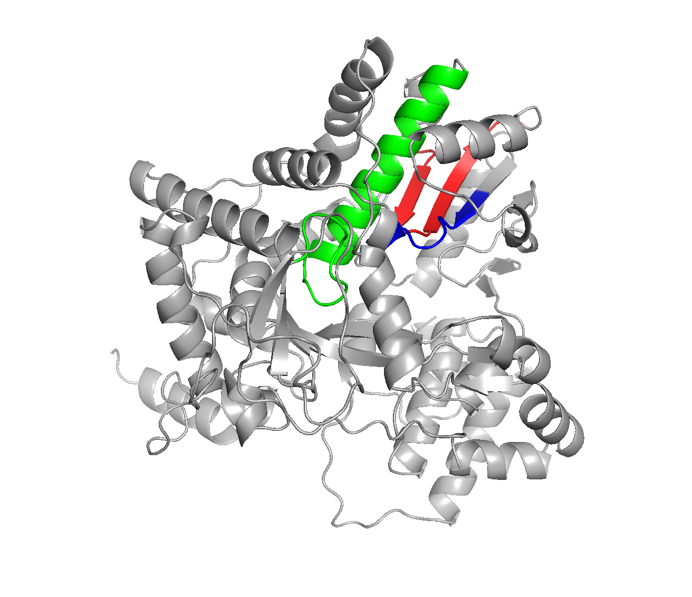
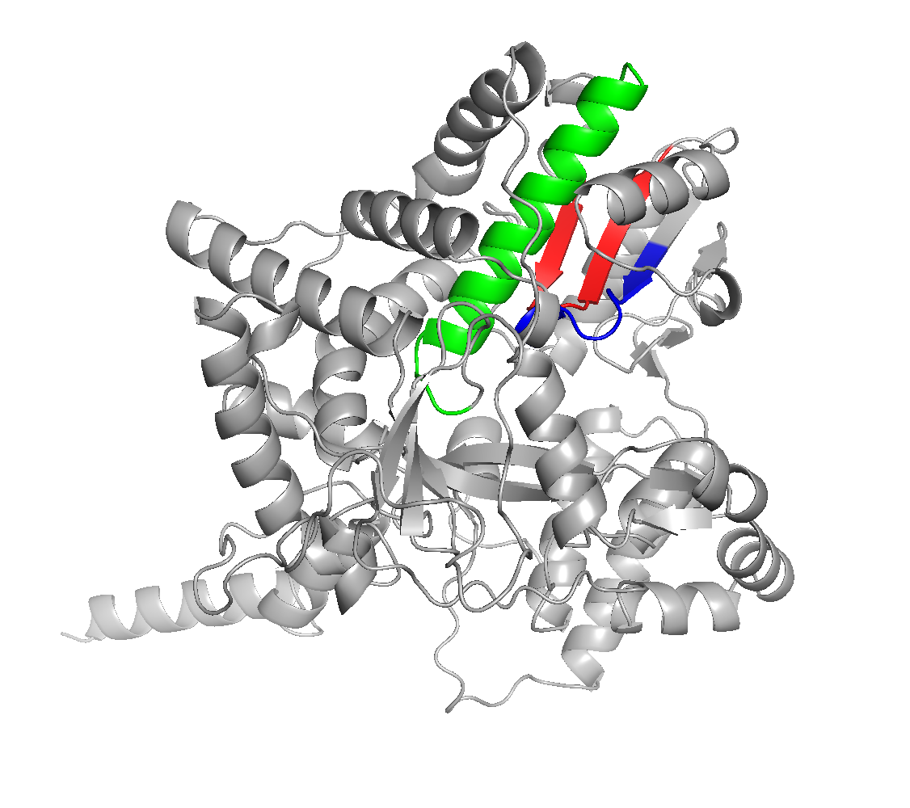

# The Run Where it Happens: Discovery of a Partitivirus-Like RdRp in Human Thyroid Tissue and Bat Urine
written by: [Victoria Pergola](https://github.com/vpergola22)

### *Mysticeovirus mutabilis*
*We propose the provisional taxon *Mysticeovirus mutabilis*, derived from the Latin “mysticeus,” meaning mysterious or enigmatic, in homage to the shapeshifting Marvel character Mystique. The genus name Mysticeovirus reflects the virus’s cryptic ecological behavior—appearing in sequencing datasets from two biologically disparate hosts, human and bat, yet maintaining a strikingly conserved RdRp structure. The species epithet mutabilis (“changeable”) refers to its apparent ability to ‘shift’ ecological context while preserving a stable molecular identity. This name emphasizes the central biological theme uncovered in our study: structural invariance beneath ecological variability.*

[Optional: Tutorial 2 Generative AI Cover-art](img/Mysticeovirus_mutabilis/cover.png)

## Abstract

Viruses are frequently discovered not by targeted virology studies, but as unexpected signals buried within large-scale sequencing datasets from humans, animals, and the environment [Edgar et al., 2022. Increasing use of high-throughput RNA-seq and metagenomic surveillance has revealed a hidden diversity of RNA viruses associated with fungi, plants, and complex microbial communities [Shi et al., 2016]. Partitiviruses, in particular, are double-stranded RNA viruses traditionally thought to infect fungi and plants, yet their genomic signatures occasionally appear in surprising contexts [Ramaswamy et al., 2022; Ghabrial et al., 2015].

The present study addresses the question of whether homologous viral polymerase sequences detected in two vastly different sequencing datasets—a human thyroid tumor transcriptome and a bat urine environmental virome—represent contamination, convergent assembly, or an unrecognized viral lineage.

Here we show that both datasets contain full-length, structurally conserved RNA-dependent RNA polymerase (RdRp) genes that phylogenetically cluster within fungal Partitiviridae and share near-identical catalytic cores. Using ORF prediction, motif mapping, phylogenetic inference, AlphaFold2 structure prediction, and Foldseek structural homology analysis, we demonstrate that the two RdRps exhibit conserved A, B, and C motifs, high structural similarity (TM-scores ≥0.89), and strong alignment in the palm domain, despite their very different ecological origins.

These findings reveal that partitivirus-like sequences can appear in both clinical and environmental sequencing libraries, challenging assumptions that such detections necessarily represent laboratory artifacts or host-restricted viruses. More broadly, the results highlight how large public sequencing datasets contain overlooked viral diversity with unclear ecological boundaries. Systematic re-examination of human tumor transcriptomes and wildlife surveillance datasets may uncover additional members of this cryptic lineage and clarify their true biological hosts.

## Results


This virus was investigated using two primary SRA runs that represent distinct ecological and experimental contexts. The first index dataset, SRR10039153, originates from a human thyroid cancer RNA-seq study (PRJNA563018) focused on clinical transcriptomics of differentiated thyroid tumors [Landa et al., 2019]. The RdRp contig recovered from this dataset shows deep coverage (~171× across the ORF), supporting a high relative abundance in the sequenced RNA pool. The second dataset, SRR18743665, derives from a PREDICT surveillance study (PRJNA272739) sampling bat urine from *Carollia perspicillata* in the context of zoonotic virus discovery [NCBI SRA, SRR18743665]. In this environmental sample, the homologous RdRp contig is present at much lower coverage (~9×), consistent with transient or low-abundance environmental material rather than active infection of the mammalian host.

Beyond these two index cases, this RdRp palmprint is detected across multiple Serratus datasets spanning diverse BioProjects and host annotations, including fungi-associated viruses (e.g., *Aspergillus* and *Penicillium* partitiviruses), environmental metagenomes, insects, and plant- or soil-associated samples [Edgar et al., 2022]. Despite this apparent ecological breadth, a common feature emerges: the virus is consistently associated with datasets where fungal RNA is expected or plausible, either directly (fungal virus references and fungal hosts) or indirectly (environmental samples, host-associated microbiomes, or clinical samples prone to fungal colonization or contamination). This pattern aligns with the known ecology of Partitiviridae, which primarily infect fungi and plants and are frequently detected through host transcriptomic sequencing rather than targeted viral isolation [Ghabrial et al., 2015; Ramaswamy et al., 2022].

Runs associated with this palmprint were evaluated using three criteria essential for downstream analysis: availability of full contig files, sufficient coverage to reconstruct a complete RdRp ORF, and biological feasibility for phylogenetic and structural analyses. Several datasets with high node coverage (e.g., SRR14381425, SRR18743667, SRR16316342) were excluded due to unavailable contig files, preventing full ORF recovery. Other datasets with very low coverage (e.g., SRR1979971) yielded only short, fragmented RdRp regions that could not support motif mapping, global alignment, or full structure prediction. Only SRR10039153 and SRR18743665 satisfied all requirements, enabling complete ORF reconstruction, motif identification, phylogenetic placement, and Foldseek-based structural comparison. The repeated detection of closely related RdRp sequences across unrelated datasets supports the hypothesis that this virus reflects a broadly distributed fungal virus lineage whose presence in clinical and environmental datasets is driven by fungal ecology rather than host-specific viral infection.

### Virus Genome

The genome organization of *Mysticeovirus mutabilis* was reconstructed for both the human-derived and bat-derived viral contigs, revealing a simple architecture characteristic of many dsRNA partitiviruses: a single, uninterrupted open reading frame encoding a complete RNA-dependent RNA polymerase (RdRp) [Nibert et al., 2014; Ghabrial et al., 2015]. The open reading frame was obtained from the available contig containing the node sequence using ORFfinder [Rombel et al., 2002], and the resulting sequence was visualized using SnapGene, with motifs A B and C annotated through downstream analysis.
In the human sample (SRR10039153), the RdRp ORF spans nt 3–1643, corresponding to a protein length of 546 aa as recovered from the microassembly. The GC content is 46%, consistent with mixed eukaryotic/fungal origin. The bat urine sample (SRR18743665) yields a nearly identical pattern, with an RdRp ORF spanning nt 2–1660 and a GC content of 41%. Both contigs produce proteins of comparable length, each containing canonical RdRp palm-domain motifs (A, B, and C). No additional coding regions, frameshift elements, poly-A tracts, or RNA secondary-structure features were identified.

\

![**Figure 1a. Genome organization of *Mysticeovirus mutabilis* (human-derived contig).** Linear gene map for the human-derived contig, showing a single long open reading frame (ORF) spanning nucleotides 3–1643 (546 aa). GC content is 46%. The ORF encodes an RNA-dependent RNA polymerase (RdRp), with catalytic motifs A, B, and C annotated along the scale. Nucleotide and rulers are shown for reference. No additional ORFs, frameshifting sites, or poly-A features were detected. Genome boundaries and ORF coordinates were annotated using ORFfinder and visualized with SnapGene.](img/Mysticeovirus_mutabilis/SnapGene_Homo_sapiens.png)

\


\
Because RdRp enzymes are defined by their conserved catalytic palm architecture [Te Velthuis, 2014], I used MAFFT and Jalview Katoh & Standley, 2013; Waterhouse et al., 2009) to visualize motif conservation across *M. mutabilis* (human and bat), together with representative Partitiviridae RdRps. This highlighted three sharply conserved motif blocks, corresponding to motif A (Dx\*D), motif B (SG\*G), and motif C (GDD), as described in Ramaswamy et al. (2022) and in structural analyses of viral polymerases. Notably, the residues forming the GDD catalytic triad were perfectly conserved across all sequences, aligning precisely between the two *M. mutabilis* isolates and fungal partitiviruses. Conservation plots beneath the alignment show strong constraint over the catalytic core and weaker signal toward the termini, consistent with structural disorder predictions and the divergent N- and C-terminal helices observed in predicted 3D structures.
Together, these genome visualizations highlight the defining features of a compact, catalytically intact RdRp genome—identical domain boundaries, shared catalytic motifs, and similar coding geometry—moderately supporting the conclusion that both contigs represent the same viral lineage infecting two different hosts.

\

![**Figure 2a. Multiple sequence alignment highlighting Motif A and Motif B in *M. mutabilis* and related Partitiviridae.** MAFFT alignment of RdRp amino-acid sequences from human *M. mutabilis*, bat *M. mutabilis*, and representative fungal partitiviruses. Motifs A (Dx*D) and B (SG*G) are boxed in black. Jalview conservation tracks show high conservation across these catalytic blocks, with strong residue identity corresponding to known RdRp palm-domain architecture. Color scale denotes physicochemical residue classes. This analysis follows the motif definitions described in Ramaswamy et al. (2022).](img/Mysticeovirus_mutabilis/Motif_A_B.png)

\


\

### AlphaFold-based structural characterization of the RdRp

To assess whether the recovered RdRp sequences encode a structurally coherent and functional RNA-dependent RNA polymerase, full-length protein sequences from both the human (SRR10039153) and bat (SRR18743665) isolates were subjected to structure prediction using AlphaFold [Jumper et al., 2021]. 
Both predicted structures (Figure 3a, b) exhibit the canonical RdRp fold, with conserved motifs A, B, and C forming a compact catalytic core in a spatial arrangement. Importantly, the AlphaFold confidence metrics (see supplimentary data) strongly support the reliability of these predictions. The human isolate achieved a high predicted TM-score (pTM) of 0.92 and an overall ranking score of 0.93, while the bat isolate similarly scored 0.89 and 0.90, respectively. These values indicate high confidence in the global fold of both models. The low fraction of disordered residues (1% in human, 3% in bat) and absence of steric clashes further suggest well-resolved, physically plausible structures [Jumper et al., 2021; Evans et al., 2021]. Additionally, minimal predicted aligned error (PAE ≈ 0.76) across chain pairs indicates strong confidence in relative domain positioning, particularly within the catalytic region.
The preservation of motif geometry across both structures is especially significant given the ecological and coverage differences between the datasets. Despite originating from unrelated biological contexts and exhibiting divergent sequencing depths, both RdRp proteins converge on nearly identical structural solutions. This strongly supports the interpretation that these sequences encode active viral polymerases rather than degraded fragments or assembly artifacts. Taken together, the AlphaFold results provide structural validation of the motif-based and phylogenetic analyses, reinforcing the conclusion that *Mysticeovirus mutabilis* represents a functionally conserved viral lineage detectable across disparate ecological niches.


\

{width="70%"}

\


{width="70%"}

\

### Structural and evolutionary insight from Foldseek and phylogenetics

To complement sequence-based annotation and directly test whether the recovered RdRp represents a genuine and conserved viral polymerase, I performed structure-based homology searches using Foldseek on AlphaFold-predicted RdRp models from both the human (SRR10039153) and bat (SRR18743665) datasets (Figure 4a, b). Strikingly, Foldseek returned the same top structural match for both models: the RNA-dependent RNA polymerase of *Aspergillus lentulus* partitivirus 1 [van Kempen et al., 2024]. The similarity metrics were exceptionally strong, with the human-derived model achieving a TM-score of 0.91865 and RMSD of 3.94 Å, and the bat-derived model achieving a TM-score of 0.89004 and RMSD of 5.82 Å. TM-scores above 0.5 indicate shared fold families, while scores approaching or exceeding 0.9 are widely interpreted as near-identical global topology, providing robust structural confirmation that both sequences encode a partitivirus-like RdRp rather than unrelated or artifactual ORFs.
Visual superposition of the models (Figure 4c) reveals that the catalytic palm domain, including motifs A, B, and C, is nearly perfectly conserved across both isolates and aligns precisely with the A. lentulus reference structure. The modest increase in RMSD observed for the bat-derived model is largely attributable to peripheral differences in terminal helices and surface-exposed loop regions, which are known to be more tolerant of sequence divergence and more sensitive to reduced sequencing coverage. Consistent with this interpretation, the human and bat RdRp models show very high mutual agreement (MSA-LDDT = 0.922), indicating that the two proteins adopt essentially the same three-dimensional fold despite originating from dramatically different biological contexts and sequencing depths.

\

![**Figure 4a. Structural homology search result for the human-derived RdRp model (SRR10039153).** The AlphaFold predicted model of the human RdRp (blue) was queried with Foldseek (3Di + amino-acid mode) against a database including experimentally determined and predicted protein structures. The top structural match returned was *Aspergillus lentulus* partitivirus 1 RdRp (gold). Foldseek alignment metrics: TM-score = 0.91865, RMSD = 3.94 Å across the aligned region. The image shows the human model (blue ribbon) superposed on the A. lentulus reference (gold ribbon). High TM-score and low RMSD indicate near-identical fold of the catalytic core and strong structural support for placement of the human sequence among partitivirus RdRps.](img/Mysticeovirus_mutabilis/Homo_sapiens_foldseek.png){width="50%"}

\

![**Figure 4b. Structural homology search result for the bat-derived RdRp model (SRR18743665).** AlphaFold predicted model of the bat RdRp (blue) aligned with the same *Aspergillus lentulus* partitivirus 1 reference (gold). Foldseek metrics: TM-score = 0.89004, RMSD = 5.82 Å across the aligned region. The main visible differences between the bat and reference structures are primarily confined to terminal helices; the core catalytic palm domain remains conserved. Lower TM-score and higher RMSD relative to the human model reflect modest divergence in peripheral regions and slightly fewer aligned residues but still robust structural homology supporting partitivirus assignment.](img/Mysticeovirus_mutabilis/Bat_paramyxovirus_foldseek.png){width="50%"}

\

![**Figure 4c. Superposition of human- and bat-derived RdRp AlphaFold models (blue = human, gold = bat).** This composite view highlights where the two predicted RdRps are structurally identical (tightly overlapping ribbons in the catalytic core) and where they diverge (extended N/C-terminal helices and peripheral loops). Structural alignment quality over the MSA-aligned region MSA-LDDT = 0.922 indicating strong similarity. The principal structural discrepancy is an extended terminal helix visible at the bottom left of the image.](img/Mysticeovirus_mutabilis/superimposed_structures.png){width="50%"}

\

To place these structural findings in an evolutionary framework, I used NGPhylogeny.fr [Lemoine et al., 2019] to construct a maximum-likelihood phylogenetic tree of RdRp amino acid sequences using reference partitivirus polymerases recovered via BLASTp (Figure 5). In this tree, *Mysticeovirus mutabilis* clusters firmly within a central fungal Partitiviridae clade, with its closest relatives including *Aspergillus lentulus* partitivirus 1, *A. fumigatus* partitivirus 2, *Penicillium brasilianum* partitivirus 1, and *Alternaria alternata* partitivirus 1. Importantly, the *Mysticeovirus mutabilis* lineage is separated from these references by a relatively long internal branch (~0.23 substitutions per site), indicating substantial evolutionary divergence while remaining embedded within the fungal partitivirus radiation. This placement mirrors the Foldseek results, which identify near-identical catalytic architecture despite detectable sequence and terminal structural variation.
Together, the Foldseek and phylogenetic analyses provide convergent evidence supporting the central hypothesis of this study: that the RdRp sequences detected in a human tumor transcriptome and a bat environmental sample represent a bona fide, deeply divergent, partitivirus-like lineage rather than contamination, assembly artifacts, or misclassified host-associated viruses. The preservation of RdRp fold and catalytic motif geometry across isolates strongly suggests functional conservation, while the ecological breadth of detection implies that this fungal virus lineage can be encountered across highly distinct sampling environments, likely reflecting widespread fungal hosts rather than cross-kingdom infection.

\


\

## Discussion

Partitiviruses are classically defined as double-stranded RNA viruses of plants and fungi, characterized by segmented genomes and a highly conserved RNA-dependent RNA polymerase that constrains their evolution [Ghabrial et al., 2015; Ramaswamy et al., 2022]. Mysticeovirus mutabilis conforms to this paradigm at the molecular level—retaining canonical RdRp motifs A–C and a conserved partitivirus-like fold—yet defies it ecologically by being recovered from metatranscriptomic datasets derived from mammalian sources rather than from an obvious fungal host [Jumper et al., 2021]. The most striking insight from this analysis is that deep structural conservation persists despite radically different sampling contexts, suggesting that partitivirus-like lineages may be far more widespread and cryptic than previously appreciated, and that their detection in mammalian datasets likely reflects hidden fungal associations rather than true host shifts [Ghannoum et al., 2010]. Together, these findings highlight how structural genomics and reanalysis of non-viral datasets can expand our understanding of viral ecology beyond traditional host boundaries [Edgar et al., 2022; Shi et al., 2016].


## Limitations
\
This study characterizes a novel partitivirus-like RNA-dependent RNA polymerase recovered from human (SRR10039153) and bat (SRR18743665) metatranscriptomes, revealing the conserved motifs, genome architecture, and strong structural homology expected of Partitiviridae [Ramaswamy et al. 2022; van Kempen et al. 2024]. However, unlike typical partitiviruses—which primarily infect fungi and plants—these sequences were detected in vertebrate-derived datasets, raising questions about whether the virus infects the host organism, an environmental contaminant, or an unsequenced microbial symbiont. The limited number of samples prevents any confident assessment of host specificity, tissue tropism, or prevalence across populations.
Phylogenetic analysis further places these sequences within a diverse fungal-associated clade, yet sparse taxon sampling and short branch lengths limit the precision of evolutionary inference. Additionally, the absence of complete viral segments, lack of experimental validation, and reliance on metatranscriptomic assemblies constrain functional interpretation. Together, these limitations underscore the need for broader sampling, isolation of full viral genomes, and direct host–virus association studies to clarify the biological significance of this unexpected lineage.

## References

Bruenn, J. A. (2003). A structural and primary sequence comparison of the viral RNA-dependent RNA polymerases. Nucleic Acids Research, 31(7), 1821–1829. https://doi.org/10.1093/nar/gkg277

Edgar, R. C., et al. (2022). Petabase-scale sequence alignment catalyses viral discovery. Nature, 602, 142–147. https://doi.org/10.1038/s41586-021-04332-2

Evans, R., et al. (2021). Protein complex prediction with AlphaFold-Multimer. bioRxiv. https://doi.org/10.1101/2021.10.04.463034
Ghabrial, S. A., et al. (2015). 50-plus years of fungal viruses. Virology, 479–480, 356–368. https://doi.org/10.1016/j.virol.2015.02.034

Ghannoum, M. A., et al. (2010). Characterization of the oral fungal microbiome. PLoS Pathogens, 6(6), e1000713. https://doi.org/10.1371/journal.ppat.1000713

Jumper, J., et al. (2021). Highly accurate protein structure prediction with AlphaFold. Nature, 596, 583–589. https://doi.org/10.1038/s41586-021-03819-2

Katoh, K., & Standley, D. M. (2013). MAFFT multiple sequence alignment software version 7: improvements in performance and usability. Molecular Biology and Evolution, 30(4), 772–780. https://doi.org/10.1093/molbev/mst010

Landa, I., et al. (2019). Genomic and transcriptomic hallmarks of poorly differentiated and anaplastic thyroid cancers. Molecular Cancer Therapeutics, 18(10), 1785–1796. https://doi.org/10.1158/1535-7163.MCT-19-0211

Lemoine, F., et al. (2019). NGPhylogeny.fr: new generation phylogenetic services for non-specialists. Nucleic Acids Research, 47(W1), W260–W265. https://doi.org/10.1093/nar/gkz303

Nilsson, R. H., et al. (2019). Mycobiome diversity in sequencing datasets. Fungal Diversity, 96, 1–21. https://doi.org/10.1007/s13225-019-00431-8

NCBI Sequence Read Archive (SRA). SRR10039153. Human thyroid cancer RNA-seq dataset. National Center for Biotechnology Information. https://www.ncbi.nlm.nih.gov/sra/?term=SRR10039153

NCBI Sequence Read Archive (SRA). SRR18743665. Bat urine virome dataset. National Center for Biotechnology Information. https://www.ncbi.nlm.nih.gov/sra/?term=SRR18743665

Ramaswamy, K., Rashid, M., Ramasamy, S., Jayavelu, T., & Venkataraman, S. (2022). Revisiting Viral RNA-Dependent RNA Polymerases: Insights from Recent Structural Studies. Viruses, 14(10), 2200. https://doi.org/10.3390/v14102200

Rombel, I. T., Sykes, K. F., Rayner, S., & Johnston, S. A. (2002). ORF-FINDER: a vector for high-throughput gene identification. Gene, 282(1–2), 33–41. https://doi.org/10.1016/S0378-1119(01)00819-8

Shi, M., et al. (2016). Redefining the invertebrate RNA virosphere. Nature, 540, 539–543. https://doi.org/10.1038/nature20167

Te Velthuis, A. J. W. (2014). Common and unique features of viral RNA-dependent polymerases. Cellular and Molecular Life Sciences, 71, 4403–4420. https://doi.org/10.1007/s00018-014-1695-z

van Kempen, M., et al. (2024). Fast and accurate protein structure search with Foldseek. Nature Biotechnology, 42, 243–246. https://doi.org/10.1038/s41587-023-01773-0

Waterhouse, A. M., et al. (2009). Jalview Version 2—a multiple sequence alignment editor and analysis workbench. Bioinformatics, 25(9), 1189–1191. https://doi.org/10.1093/bioinformatics/btp033

Wolf, Y. I., et al. (2020). Origins and evolution of the global RNA virome. mBio, 11(5), e02329-20. https://doi.org/10.1128/mBio.02329-20

# Viral Short Story

```
The year is 2025, and two scholars—Alexander Hamilton, ever-restless, ever-relentless, and Aaron Burr, cautious yet razor-sharp—find themselves not in the halls of Congress but in the dimly lit corridors of a genomic research institute. Word has spread of a peculiar discovery: a mysterious RNA-dependent RNA polymerase appearing in not one, but two diametrically opposed sequencing runs.
Hamilton storms into the bioinformatics chamber, stacks of FASTQ files in his arms.
 “Burr, sir—did you hear the news about that weird contig marker?”
 Burr raises an eyebrow. “No. But judging by your expression, I suppose I will.”
Together they plunge into the mystery. The first sample—thyroid tumor tissue from a human patient—yields an RdRp covered at 171× depth. “That’s not noise,” Hamilton insists. “That’s signal.” He begins mapping motifs with the fervor of a man writing the Federalist Papers overnight.
The second sample—bat urine from a PREDICT surveillance run—holds a faint echo of the same sequence. “Low coverage,” Burr mutters, “but the fold… the fold doesn’t lie.”
Their investigations take on the cadence of a duel.
 Hamilton battles the alignment; Burr questions the provenance.
 Hamilton wields AlphaFold; Burr assembles phylogenies like legal arguments.
 They clash, converge, clash again—
 until the catalytic motifs A, B, and C settle the score.
In the quiet glow of Foldseek results, Hamilton whispers:
 “Burr… this RdRp matches Aspergillus partitivirus. Across two hosts.”
 Burr exhales, equal parts awe and apprehension.
 “So the fungal kingdom has left its signature,” he says. “Across a tumor and a bat roost.”
And suddenly they both understand:
 They have uncovered Mysticeovirus mutabilis, a cryptic voyager slipping through ecological boundaries with elegance and invariance—a virus that transcends context while keeping its catalytic heart unchanged.
“No one else was in the run where it happened,” Hamilton muses, staring at the alignment like scripture.
 Burr nods. “But we were. And now the story is ours to tell.”
The lab is silent. The discovery glows.
 And in that moment, two rivals—bound by science rather than politics—stand shoulder to shoulder in the only room that mattered:
 the run where it happened.
```