# Recombination, a gnarly affair: a highly divergent recombined narna-like virus, *Narlivirus entericus*, inhabits the rumen microbiome
written by: [Jahin Kabir](https://github.com/jahinl17)

### *Narlivirus entericus*: etymology 

- Narliviridae is a newly proposed family of "narna-like" viruses that often possess a reassorted genome with non-RdRP ORFs [Sadiq, Chen 2022]. Although this designation is not formally recognized by ICTV as of now, I suspect my viral RdRP and genome structure closely resemble these viruses, which is why I have chosen to assign this virus to the narliviridae subgroup.

- The "entericus" component of the name relates to the fact that this viral RdRP sequence has been identified in mostly metagenomic/metatranscriptomic datasets from rumen microbiota. It is inspired by the name "*Streptococcus entericus*", which is a bacterial species found in cattle intestines.

## Abstract

Narnaviruses are positive-stranded RNA viruses typically characterized by minimalist capsid-less genomes encoding only an RNA-dependent RNA polymerase (RdRP). Recent large-scale metagenomic studies, however, have shed light on previously unappreciated diversity in highly divergent RNA viruses that have recombined genomes with additional ORFs acquired through horizontal transfer. Here, we characterize the genomic structure of a rumen-gut-microbiome-enriched virus detected through the Serratus viral discovery platform, and demonstrate the acquisition of a viral capsid protein that may have contributed to its ability to infect novel hosts. Samples contributing this virus in publicly available databases were found to be highly enriched in rumen microbiome-derived environments, suggesting a potential adaptation to hosts specific to such environments and potential ecological specialization to microbe-dense, anaerobic environments. Together, these findings expand the known genomic and ecological diversity of narna-like viruses and provide further evidence that recombination may have played a key role in shaping the evolutionary trajectories of RNA viruses and their host specialization.

## Results

### Ecology: where it all begins

Our analysis was based on the detection of a novel viral palmprint on Serratus [Edgar 2022]. The index case for our viral palmprint was acquired from a goat rumen metagenomic sample, associated with a study of novel astroviruses in ruminants [Kauer, Koch 2019]. Out of 27 sequencing runs across 19 BioProjects that were returned by Serratus based on clustering of closely resembling RdRP palmprint sequences, 18 sequencing runs belonged to rumen samples. The other sequencing runs were comprised of bioreactor metagenomes, soil metagenome, sewage metagenome, and 1 mosquito metagenome (Figure 1).

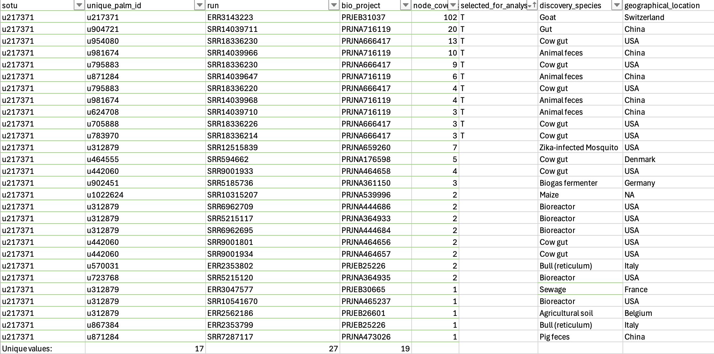
> Figure 1. Summary of datasets containing palmprint sequences similar to our virus of interest. Note: the "selected_for_analysis" column indicates which of the datasets were chosen to conduct the Logan assembly described below, to evaluate replicability of assembly graph structure. This was done based on sufficient read depth as well as applicability of the BioProjects to our research questions, choosing projects that had replication of the viral sequence across multiple sequencing runs so that we could ask questions about e.g. differences in viral load according to co-habitating microbial composition or environmental factors such as nitrate concentration (one of the projects, PRJNA666417, was designed explicitly to test the effect of addition of 3-nitrooxypropanol in cattle feed on their microbiomes, and our virus was detected in both control and treatment groups, making an experimental analysis of this possible).

To identify the potential family of our virus, we queried recorded protein sequences with our viral palmprint sequence -- the stretch of the RdRP amino acid sequence flanked by the highly conserved A,B,C motifs in the palm domain -- using BLASTp with default parameters against the NCBI non-redundant (nr) protein sequences database [Babaian, Edgar 2022, Edgar 2022, Altschul 1990, Altschul 1997]. The results suggest that our virus is a highly divergent sequence, since the closest match has a percent identity of only , and is likely a Narnavirus since most of the top hits are narnaviruses (Figure 2).

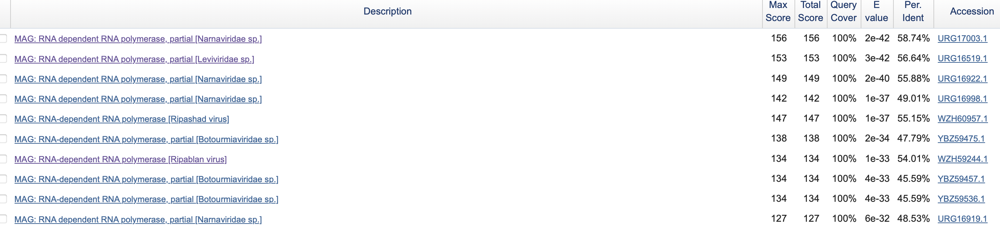
> Figure 2. Top 10 BLASTp results ranked by E-value for RdRP palmprint sequence. The database queried was the non-redundant (nr) protein sequence database.

Narnaviruses have typically been characterized to infect fungi and other eukaryotic species, although recent investigations have challenged this dogma, finding narnaviruses in diverse samples such as T. gondii, invertebrates, etc [Gupta 2024, Shi, Lin, Tian, Chen, Chen, Li 2016]. 

However, it is still unclear whether these viruses are able to adapt to new host environments -- such as the rumen microbiome, and what specific molecular changes drive these adaptations. The rumen microbiome is a unique environment with archaea-rich populations that thrive in and contribute to high degrees of methane production, which means these species are likely to be adapted to the specific environment of the rumen microbiome (and, relatedly, the environments of soil and bioreactor microbiomes). Thus, it is possible that our virus, which was detected almost exclusively in such environments, have also developed unique adaptations to these environments and the microbiota inhabiting them.

Based on these observations, we hypothesized that:

This virus is a Narnavirus species that has acquired adaptations for infecting microbes specific to the rumen gut.

To test this hypothesis, we will:

1. **Assemble the broader genome of the virus to obtain the full-length viral RdRP sequence**. 

2. **Characterize the genome of the virus and identify modifications that may have arisen, allowing the virus to colonize new environments**: We will then compare these viral genome sequences across the slightly variant strains identified for this palmprint, and look for molecular signals of adaptation in the RdRP protein sequence. 

Both these substeps address the hypothesis that our virus is a highly divergent Narnavirus species that has acquired molecular modifications in its RdRP sequence and beyond that could potentially enable it to infect rumen-inhabiting microbes.

### Virus Genome

The initial assembly of the virus, as found on Serratus, contained an incomplete ORF for the viral RdRP. To characterize the whole RdRP and the rest of the viral genome, we aimed to assemble the maximal retrievable genome sequence for this virus. To assemble the viral genome, we first undertook the following approach: 

1. Acquire the assemblies from the Logan project deposited on Serratus [Chikhi 2025]. These files contain information on graph connections from each contig to other contigs, which were found to have overlapping reads with this node but were separated due to discrepancies at certain sites.
2. These files were converted to GFA format by the `convertToGFA.py` script as specified in the instructions in [here](https://github.com/IndexThePlanet/Logan/blob/main/Unitigs.md#assembly-graph). 
3. The assembly graph was drawn from this GFA file using BandageNG [Wick 2015]. 
4. The assembly graph was manually inspected to analyze sequence variation in the viral sequence and attempt to obtain a dominant maximal sequence for the virus.

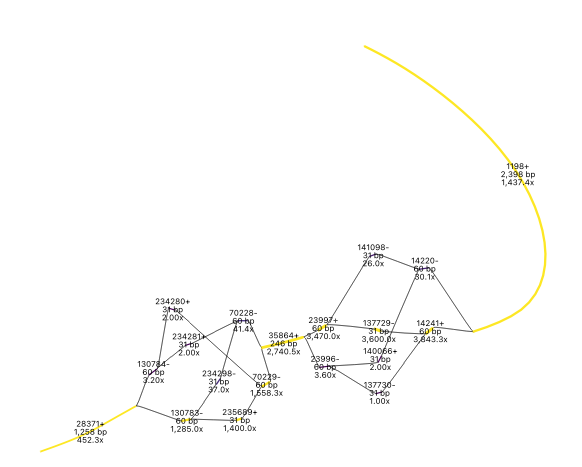
> Figure 3. Assembly graph constructed using BandageNG from assembly files produced by the Logan project for ERR3143223. Contigs have been labelled with their node ID and strand information, length (in bp), and read depth, and coloured by read depth with the yellow contigs showing the highest depth contigs.

In the assembly graph, we observed a clear dominant sequence, but another sequence also had relatively high coverage at some of the bubbles formed, indicating a possible co-infection with two strains of the virus (Figure 3). Importantly, this sequence only differed from the dominant sequence at these short "bubble" sequences, suggesting widespread conservation elsewhere. 

Nevertheless, because of the fragmented nature of the assembly, to gain further confidence in our assembled sequence, we also obtained the coronaSPADES assembly for this sequencing dataset deposited on Serratus [Babaian, Edgar 2022, Edgar 2022, Meleshko 2022]. The contig containing our palmprint of interest was identified by querying for the palmprint protein sequence against the nucleotide sequences in the coronaSPADES assembly using `tBLASTn` [Altschul 1990, Altschul 1997]. This identified a single dominant hit, which we took to be our viral sequence. 

This sequence was then queried for potential ORFs through ORFfinder [Rombel 2002]. We identified an ORF 2590 aa-long, containing our palmprint sequence.

```
Top ORFs (by length) identified by ORFfinder in contig containing sOTU palmprint sequence for our virus:

>lcl|ORF3_1:31:2622 unnamed protein product
MNMALVQSELIPISKRKRISPFALIDGLLESPSSLVEDGTTHGLIFMIATTFHGMLDAYYVESLGAKIISPTRLFIEGESVLEALELTRSLFEVFYDTLPKFGWFPLYEQLQFFRVTKSWPNKNFIKFAKYFTAYPMAFFLENELPEVPKGYLECTPSHLVFTGRIKRLLMKRLVHKSNSTVRIWWSVLQGVKRAAKEAPESFILDSYLKHARKLREEPTSEVDLSLITYIKRALEHFAFDKPRFYEASTSASFTNPRSKGGQREEVRSWLIEHFGMSYQDQVDLGEGHKVDLYGPAIPDFETVVRAAVKDFGGRDLNVEVHGILEPLKVRLITKGESVPYWLSRTAQKDMWSYLQGFKIFLATGTPLTLEHIVDLRDQRDSFEEKYNIHFDSWVSGDYSGATDGVDIRMTALVFEEMLKHSKYSEDFKSILRRVIYQQQLHYPEVTLKIPERRKVRSRNHFKPVRYVEKKVQVPSVRQRNGQLMGSTLSFPILCIINLVAYWYALETYLGQQVDLEDLPVRINGDDILFPSNSEMYAIWKEKIRSVGFDLSIGKNYIHSRYFTMNSLLFSENRTTGTVEQIPYFNPGLLTGKAKVTARDNVRVLPLWDWYEEVINGARDKWRAHKRFIHYHKTLIKQLTRNGKLNLFVNRHLGGVGFPLDPEVRKHITVTSYQRKLAHYYMRNTVRRTRSGIDPTKFILRLVKKETMNKSYTCIDLGFHDKLEYIPETSPLNVNQSNETKRLYDLPLMSQSPTSFSKPLLTIKHGVRLPSSCKISNEPRLKTDKLFSFPYKLVSVHDLPVGYQLSDYSIEDFQFFDPEIGQQNNRYRSKGWYWIDFNTGHLHYQDKTYKSKDSWRKPLVRHV
>lcl|ORF4_1:2800:3489 unnamed protein product
MSNITKSDLLKQNKSLKNQIAQLQRSNAVKKVSANTSRKKNNQVPASTVPTWAGQSKSLRIHQMERIANVTSNGTTAGAFKADSYAINPANSTTFPWLSSIASLFDKYKFHKLRFFFINNSPTSIAGNVTMAVDFDTLDAIPSNGVSMSNLAKFTSFAPWKSEELSIPVARPSNNSWLFTAATIPSGADAKTYNLGNFLISSEGLVNTNYLIGYLCVEYDVELLDKNPN
```

Interestingly, there was another long ORF, potentially encoding a protein. A BLASTp search on the protein sequence showed sequence homology with Tombusviridae-family capsid proteins [Altschul 1990, Altschul 1997]. The full-length annotated genome, with the two ORFs and the read depth from sequencing run ERR3143223, is shown below (Figure 4). 

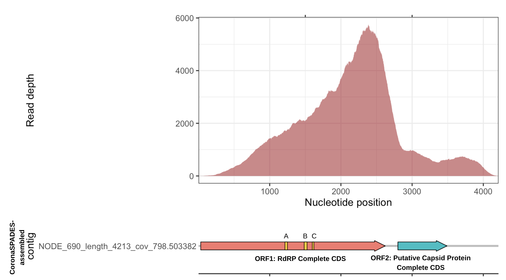
> Figure 4. Viral genome obtained from coronaSPADES assemblies for ERR3143223, deposited on Serratus. The read depth graph was obtained by mapping the FASTQ files for ERR3143223 to the coronaSPADES assemblies using bowtie2 v2.5.4, followed by the usage of samtools depth on the command line. Gene graphs were produced using the gggenes package and manually edited to include labels [Langmead, Salzberg 2012, Li 2009, Wilkins 2023]. The two main ORFs with length > 100 have been labelled, with palm domain motifs A, B, C labelled in the RdRP ORF. 

```
# ORFfinder was run on a Google Colab notebook using the following code:
!ORFfinder -in path_to_input_fasta.fa -out output_file.txt -g 1 -ml 75

# bowtie2 was run using the following code on the command line:
samtools faidx assembly_fasta.fa   
bowtie2 -x index -1 fastq_1.gz -2 fastq_2.gz --very-sensitive-local | samtools view -bS > output.bam
samtools sort output.bam -o output_sorted.bam # Optional: for viewing using Integrated Genome Viewer (IGV)
samtools index output_sorted.bam  # Optional: for viewing using Integrated Genome Viewer (IGV)

# tBLASTn code for searching for a protein sequence in your assembly:
makeblastdb -in assembly_fasta.fa -out assembly.db -dbtype nucl
tblastn -query fasta_with_query_prot_sequence.fa -db assembly.db -out tblastn_output.txt
```

### Characterizing the RdRP protein structure

To characterize the structure of the RdRP and the domains within it, we utilized AlphaFold2 to predict the structure given the full-length protein sequence of the RdRP [Jumper 2021]. This analysis demonstrated a core RdRP domain, with elongated sequences on either side of the palm, thumb, and finger-containing core. These extraneous regions had lower confidence scores in the structural prediction (Figure 5). We then analyzed the viral protein structure domains on PyMol, and manually annotated the A, B, and C motifs (Figure 6) [Schrödinger, DeLano 2020]. To demonstrate the existence of a domain separate from a typical RdRP functional core, we also present a structural overlay of our RdRP against the poliovirus RdRP (with a minimal RdRP sequence; this analysis was inspired by Gupta (2024)) (Figure 7).

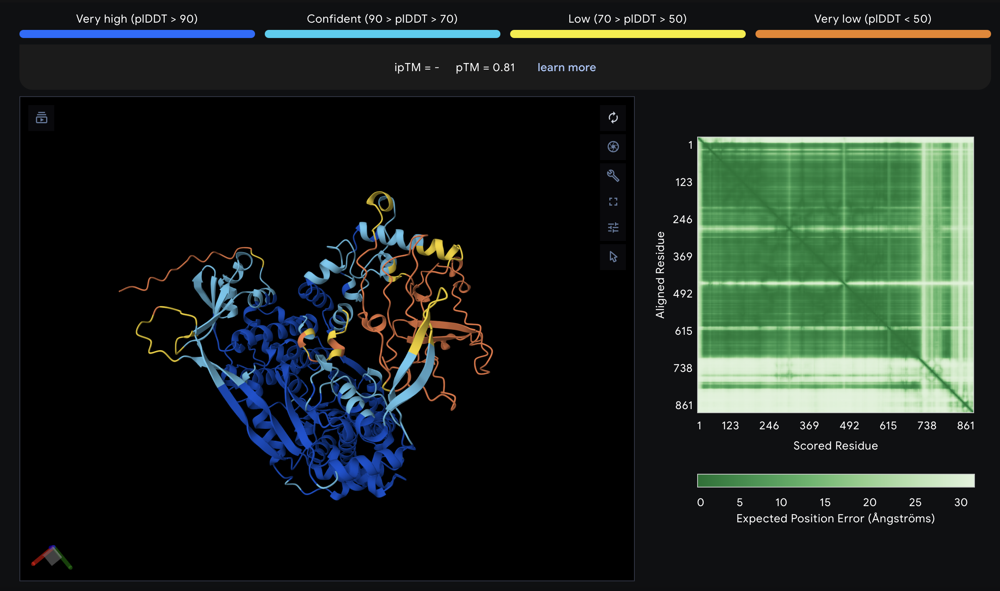
> Figure 5. Alphafold predicted structure, coloured by confidence score.

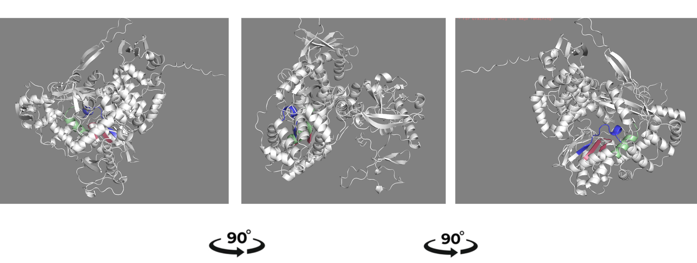
> Figure 6. Alphafold structural prediction of the RdRP ORF for the novel viral sequence from ERR3143223. Motifs A, B, and C are labelled in blue, green, and red, respectively. 

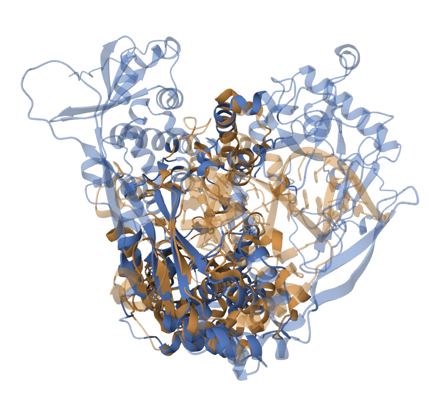
> Figure 7. Comparison of RdRP structure to experimentally resolved poliovirus RdRP structure (PDB ID 3OL6), which has a minimal structure useful for identifying the minimal RNA- and nucleotide-interacting catalytic core of RdRP. Comparison done using RCSB structure alignment tool, with alignment method = TM-align. 

Interestingly, when we compared our folded protein structure against known protein structures using FoldSeek, the closest hits on the Big Fantastic Virus Database (BFVD) of predicted protein structures were viruses characterized as "narna-like" viruses [van Kempen, Kim 2023, Kim 2025]. These viruses have been recently proposed to belong to their own clade of "Narliviruses," which have a recombined genome with a second ORF encoding a capsid-like protein [Sadiq, Chen 2022]. 

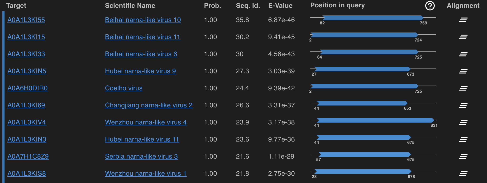
> Figure 8. Foldseek output against BFVD database for RdRP structure for our virus of interest.

### Characterizing the second ORF

Given the nature of the assembly graph obtained from the sequencing run ERR3143223, with breakpoints and short "bubbles" and long stretches of conserved sequences, we hypothesized that the breakpoints coincide with recombination breakpoints. 

First, to evaluate whether this result was truly biologically significant, we wanted to confirm if this pattern of consensus (and lack thereof) is replicable in all the sequencing runs where our cluster of viral sequences were identified. Unfortunately, this analysis was not very informative, since most of the contigs containing the palmprint were isolated contigs with no edges in the assembly graph. We therefore chose not to pursue the recombination breakpoint hypothesis above, since any conclusions from this analysis would be dominated by dataset-specific results in this index run and not generalizable.

However, the analysis above helped identify a longer sequence, 4144-bp long, that also contained separate ORFs for the RdRp and the capsid protein [Chen, Sadiq 2022]. This replication in two independent datasets of the co-occurence of the two ORFs in the same sequence provides more confidence that this virus indeed encodes both proteins, especially because this other dataset contains both ORFs in the same assembled Logan contig (a very conservative assembly that fragments sequences with small differences) which minimizes the possibility of it being an artifact of synthetic chimerism.

```
Top ORFs (by length) identified by ORFfinder in contig containing sOTU palmprint sequence for our virus:

>lcl|ORF11_1:59:2581 unnamed protein product
MIDGLLESPSSLVEDGTTHGLIFMIASTFHGMLDAYYVESLGAKIISPTRLFIEGESVLEALELTRSLFE
VLYDTLPKFGWFPLHEQLQFFRVTKSWPNRNFIKFAKYFTAYPMAFFLENELPEVPKGYLECTPSHLVFT
GRIKRLFMKRLVHKSNGTVRIWWSVLQGVKRAAKEAPESFILDSYLKHARKLREEPTSEVDLSLITYIKR
ALGSFAFDKPRFYEASTSASFTNPRSKGGQREEVRSWLIEHFGMSYQDQVDLGEGHKVDLYGPAIPDFET
VVKAAVEDFGGRDLNVEVHGILEPLKVRLITKGESVPYWLSRTAQKDMWSYLQGFKIFLATGTPLTLEHI
VDLRDQRDSFEKKYNIHFDSWVSGDYSGATDGVDIRMTALVFEEMLKHSKYSEDFKSILRRVIYQQQLHY
PEVTLKIPERRKVRSRNHFKPVRYVEKKVQVPSVRQRNGQLMGSTLSFPILCIINLVAYWYALETYLGRE
VKLQDLPVRINGDDILFPSNSEMYAIWKEKIRSVGFDLSIGKNYIHSRYFTMNSLLFSENRTTGTVEQIP
YFNPGLLTGKAKVTARDNVRVLPLWDWYEEVINGAKDKWRAHRRFIHYHKTLIKQLTRNGKLNLFINRHL
GGVGFPLDPEVRKHITVTSYQRKLAHYYMRNTVRRARSGIDPTKFVLRLVKKETINKSYTCIDLGFHDKL
EYIPETSPLNVNQSNETKRLYDLPLMSQRPTSFSKPLLTIKHGVRLPSSCKISNEPRLKTDKLFSFPYKL
VSVHDLPVGYQFSDYSIEDSQFFDPEIGQQNNRYRSKGWYWIDFDTGHLHYQDKTYKSKDSWMKPLVRHV
>lcl|ORF12_1:2759:3448 unnamed protein product
MSNITKNDLLKQNKVLKNQVNQLKRSNAVKTLTAATYRRRENRAPASSIPSWAGQSKALRIHQMERIANV
VSNSTTAGAFKADSYAINPANPTTFPWLSSIASLFDKYKFHKLRFFFINNSPTSIAGNVTMAVDFDTLDA
IPANGVAMSNLAKFVSFAPWKAEELVIPVQRPSNNSWLFTTSSVPTGADAKTYNLGNFLISTEGITTTNY
LSGYLCVEYDVELLDKNPN
```
Note: although we show these protein sequences here, all the sequence and structural analyses have been done using the sequence from the index run dataset.

To further characterize the capsid protein, we conducted a BLASTp search for the capsid protein sequence. The output of the BLASTp search is shown below:

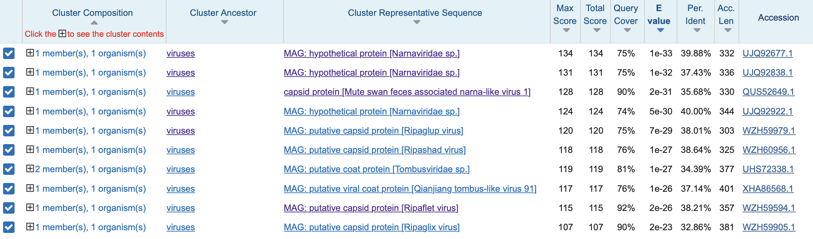
> Figure 9. Top 10 BLASTp results for putative capsid protein sequence, ranked by E values.

Importantly, most of the top hits are tombusviridae-related species and other unclassified narna-like viruses. It is possible that the virus acquired its capsid-like protein during a co-infection with one of these plant-infecting viruses from animal feed, but such a hypothesis is difficult to test.

To further characterize the capsid protein, we conducted AlphaFold structure prediction on the ORF. Our result showed a classical jelly-fold roll domain typical of many icosahedral viruses, further confirming that this is likely a functional capsid protein [Krupovic 2017].

To further test potential functionality, we also conducted Alphafold-multimer analysis with 3-, 4-, and 12-mers of the capsid protein [Evans 2021]. The 12-mer result confirms the potential of the protein to polymerize into viral capsid-like structures, although whether this arrangement can indeed result in a functional protein sequence is unclear from only a 12-mer result on AlphaFold -- for one, capsid assembly is a complex process that is determined by neighbouring icosahedrons and not just proteins within the immediate neighbourhood, as demonstrated by the discordance between our 3-mer and 4-mer structural arrangements. 

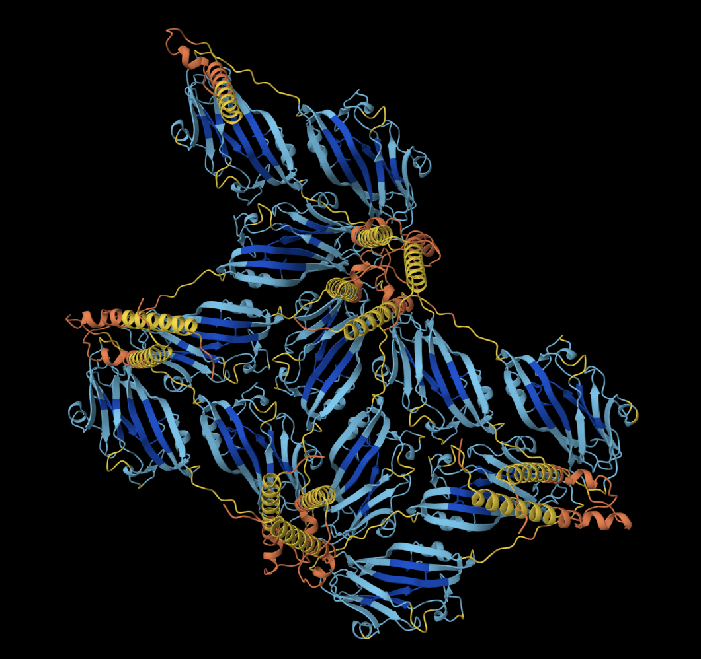
> Figure 10. AlphaFold-Multimer result for 12 copies of capsid protein sequence. 

Given that the disordered region and the adjacent alpha helix assigned unconfident by AlphaFold protrudes inwards from the viral coat, we hypothesized that this is a nucleic acid-interacting domain. 

The N-terminus region of viral capsid proteins is often enriched in positively charged residues that are able to interact with and recognize the viral nucleic acid molecule to be able to encapsulate it [Krupovic 2017]. This property is shared by some tombusviruses, which our capsid protein has sequence similarity with [Krupovic 2017]. To test whether our viral capsid shares this property, we assigned an electrostatic charge score to the surface representation of the capsid protein using the APBS electrostatics plugin on PyMol [Baker 2001, Jurrus 2018, Bank 2003]. 

We see that the inward-pointing domain of the virus is indeed enriched in positively charged residues, making it possibly the case that it interacts with nucleic acids. However, again, confirming this would require additional structural prediction analyses with nucleic acids and other capsid proteins included, and, more importantly, biological structural validation from e.g. crystal structures. 

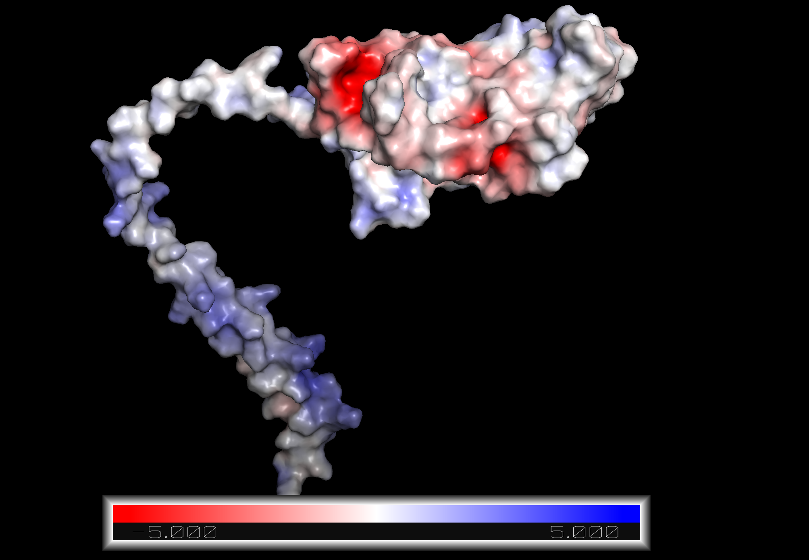
> Figure 11. Surface representation of AlphaFold2-predicted structure of capsid protein encoded by *Narlivirus entericus*. Colours represent charge assigned by the APBS electrostatics plugin on PyMol. 

## Discussion

We identified the following facts about the viral genome:

1. The virus was detected predominantly in rumen metagenomes, with additional occurrences in soil and bioreactor datasets that represent related microbe-rich and ruminant-derived environments.
2. Although the virus encodes a narnavirus-like RdRP, its overall genome structure, with a secondary ORF encoding a putative capsid protein, challenges the canonical definition of narnaviruses.
3. The putative capsid protein has an uncharacterized disordered region enriched in positively charged residues, possibly involved in interaction with nucleic acids.

## References

1. Edgar, R.C., Taylor, B., Lin, V. et al. Petabase-scale sequence alignment catalyses viral discovery. Nature 602, 142–147 (2022). https://doi.org/10.1038/s41586-021-04332-2
2. Kauer RV, Koch MC, Hierweger MM, Werder S, Boujon CL, Seuberlich T. Discovery of novel astrovirus genotype species in small ruminants. PeerJ. 2019 Jul 31;7:e7338. doi: 10.7717/peerj.7338. PMID: 31396439; PMCID: PMC6679648.
3. Altschul SF, Gish W, Miller W, Myers EW, Lipman DJ. Basic local alignment search tool. J Mol Biol. 1990 Oct 5;215(3):403-10. doi: 10.1016/S0022-2836(05)80360-2. PMID: 2231712.
4. Altschul SF, Madden TL, Schäffer AA, Zhang J, Zhang Z, Miller W, Lipman DJ. Gapped BLAST and PSI-BLAST: a new generation of protein database search programs. Nucleic Acids Res. 1997 Sep 1;25(17):3389-402. doi: 10.1093/nar/25.17.3389. PMID: 9254694; PMCID: PMC146917.
5. Babaian A, Edgar R. 2022. Ribovirus classification by a polymerase barcode sequence. PeerJ 10:e14055 https://doi.org/10.7717/peerj.14055
6. Shi, M., Lin, XD., Tian, JH. et al. Redefining the invertebrate RNA virosphere. Nature 540, 539–543 (2016). https://doi.org/10.1038/nature20167
7. Logan: Planetary-Scale Genome Assembly Surveys Life’s Diversity. Rayan Chikhi, Téo Lemane, Raphaël Loll-Krippleber, Mercè Montoliu-Nerin, Brice Raffestin, Antonio Pedro Camargo, Carson J. Miller, Mateus Bernabe Fiamenghi, Daniel Paiva Agustinho, Sina Majidian, Greg Autric, Maxime Hugues, Junkyoung Lee, Roland Faure, Kristen D. Curry, Jorge A. Moura de Sousa, Eduardo P. C. Rocha, David Koslicki, Paul Medvedev, Purav Gupta, Jessica Shen, Alejandro Morales-Tapia, Kate Sihuta, Peter J. Roy, Grant W. Brown, Robert C. Edgar, Anton Korobeynikov, Martin Steinegger, Caleb A. Lareau, Pierre Peterlongo, Artem Babaian. bioRxiv 2024.07.30.605881; doi: https://doi.org/10.1101/2024.07.30.605881
8. Ryan R. Wick, Mark B. Schultz, Justin Zobel, Kathryn E. Holt, Bandage: interactive visualization of de novo genome assemblies, Bioinformatics, Volume 31, Issue 20, October 2015, Pages 3350–3352, https://doi.org/10.1093/bioinformatics/btv383
9. Dmitry Meleshko, Iman Hajirasouliha, Anton Korobeynikov, coronaSPAdes: from biosynthetic gene clusters to RNA viral assemblies, Bioinformatics, Volume 38, Issue 1, January 2022, Pages 1–8, https://doi.org/10.1093/bioinformatics/btab597
10. Rombel IT, Sykes KF, Rayner S, Johnston SA. ORF-FINDER: a vector for high-throughput gene identification. Gene. 2002 Jan 9;282(1-2):33-41. doi: 10.1016/s0378-1119(01)00819-8. PMID: 11814675.
11. Jumper, J., Evans, R., Pritzel, A. et al. Highly accurate protein structure prediction with AlphaFold. Nature 596, 583–589 (2021). https://doi.org/10.1038/s41586-021-03819-2
12. Richard Evans, Michael O’Neill, Alexander Pritzel, Natasha Antropova, Andrew Senior, Tim Green, Augustin Žídek, Russ Bates, Sam Blackwell, Jason Yim, Olaf Ronneberger, Sebastian Bodenstein, Michal Zielinski, Alex Bridgland, Anna Potapenko, Andrew Cowie, Kathryn Tunyasuvunakool, Rishub Jain, Ellen Clancy, Pushmeet Kohli, John Jumper, Demis Hassabis. Protein complex prediction with AlphaFold-Multimer. bioRxiv 2021.10.04.463034; doi: https://doi.org/10.1101/2021.10.04.463034
13. The PyMOL Molecular Graphics System, Version 3.0 Schrödinger, LLC.
14. Schrödinger, L., & DeLano, W. (2020). PyMOL. Retrieved from http://www.pymol.org/pymol
15. van Kempen, M., Kim, S.S., Tumescheit, C. et al. Fast and accurate protein structure search with Foldseek. Nat Biotechnol 42, 243–246 (2024). https://doi.org/10.1038/s41587-023-01773-0
16. Chen YM, Sadiq S, Tian JH, Chen X, Lin XD, Shen JJ, Chen H, Hao ZY, Wille M, Zhou ZC, Wu J, Li F, Wang HW, Yang WD, Xu QY, Wang W, Gao WH, Holmes EC, Zhang YZ. RNA viromes from terrestrial sites across China expand environmental viral diversity. Nat Microbiol. 2022 Aug;7(8):1312-1323. doi: 10.1038/s41564-022-01180-2. Epub 2022 Jul 28. PMID: 35902778.
17. M. Krupovic,  & E.V. Koonin,   Multiple origins of viral capsid proteins from cellular ancestors, Proc. Natl. Acad. Sci. U.S.A. 114 (12) E2401-E2410, https://doi.org/10.1073/pnas.1621061114 (2017).
18. Jurrus E, Engel D, Star K, Monson K, Brandi J, Felberg LE, Brookes DH, Wilson L, Chen J, Liles K, Chun M, Li P, Gohara DW, Dolinsky T, Konecny R, Koes DR, Nielsen JE, Head-Gordon T, Geng W, Krasny R, Wei G-W, Holst MJ, McCammon JA, Baker NA. Improvements to the APBS biomolecular solvation software suite. Protein Sci, 27 (1), 112-128, 2018. https://doi.org/10.1002/pro.3280
19. Bank and M. Holst, A New Paradigm for Parallel Adaptive Meshing Algorithms. SIAM Review 45, 291-323, 2003. http://epubs.siam.org/doi/abs/10.1137/S003614450342061
20. Baker NA, Sept D, Joseph S, Holst MJ, McCammon JA. Electrostatics of nanosystems: application to microtubules and the ribosome. Proc. Natl. Acad. Sci. USA 98, 10037-10041 2001. http://www.pnas.org/content/98/18/10037
21. Rachel Seongeun Kim, Eli Levy Karin, Milot Mirdita, Rayan Chikhi, Martin Steinegger, BFVD—a large repository of predicted viral protein structures, Nucleic Acids Research, Volume 53, Issue D1, 6 January 2025, Pages D340–D347, https://doi.org/10.1093/nar/gkae1119
22. Langmead, B., Salzberg, S. Fast gapped-read alignment with Bowtie 2. Nat Methods 9, 357–359 (2012). https://doi.org/10.1038/nmeth.1923
23. Heng Li, Bob Handsaker, Alec Wysoker, Tim Fennell, Jue Ruan, Nils Homer, Gabor Marth, Goncalo Abecasis, Richard Durbin, 1000 Genome Project Data Processing Subgroup, The Sequence Alignment/Map format and SAMtools, Bioinformatics, Volume 25, Issue 16, August 2009, Pages 2078–2079, https://doi.org/10.1093/bioinformatics/btp352
24. Wilkins D (2023). gggenes: Draw Gene Arrow Maps in 'ggplot2'. R package version 0.5.0, https://wilkox.org/gggenes/.
25. Sadiq S, Chen YM, Zhang YZ, Holmes EC. Resolving deep evolutionary relationships within the RNA virus phylum Lenarviricota. Virus Evol. 2022 Jun 14;8(1):veac055. doi: 10.1093/ve/veac055. PMID: 35795296; PMCID: PMC9252102.