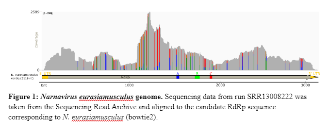

# Characterization of a Ewe-nique virus that only infects skeletal muscle and cardiac tissue

written by: Kevin Yuan

### Narnavirus eurasiamusculus

This virus is a narnavirus that seems to only infect cardiac and skeletal muscle tissue. Additionally, it has only been found in Europe and Asia.

## Abstract

The field of virus discovery is blooming at an unprecedented rate with the rate of new viruses being discovered. Recently, Edgar et al. published a pipeline for rapid virus discovery through analysis of the sequencing read archive [Edgar et al., 2022]. Through this procedure, an unknown virus was discovered in sequencing run SRR13008222. This study sets out to characterize its features. Here we show that this new virus, dubbed Narnavirus eurasiamusculus, is an RNA virus that only infects the skeletal and cardiac muscle tissue of goats and sheep stemming from Europe and Asia. This is a new narnavirus that shares similar traits to other viruses of the same family. Thereby, our study presents another example of the use of this pipeline to find new virus candidates and characterize them. It also provides another example of the diversity of viruses and how little we actually know about them.

## Results



### Discovery of Narnavirus musculusinnocens

This virus was initially found in the sequencing read archive [Leionin et al., 2020], specifically in run SRR13008222. This was an RNA-seq study, published by researchers from Gansu Agricultural University in 2021 in a study published in Frontiers in Genetics, titled "Comparative Transcriptime Profile Analysis of Longissimus dorsi Muscle Tissues From Two Goat Breeds With Different Meat Production Performance Using RNA-Seq" [Shen et al., 2021]. More specifically, this study compared the genomic muscle profiles of five Lioning cashmere (LC) goats to five Ziwuling black (ZB) goats to determine if there were genetic factors associated with meat quality. All animals were healthy nine-month year old rams from the Goat Breeding Company in the Gansu province in China. The data itself was generated from Illumina HiSeq sequencing with 45.3 million reads [Shen et al., 2021].

### N. eurasiamusculus is a narnavirus

The SRA run was put into the Serratus.io [Edgar et al., 2022] RNA Dependent RNA Polymerase (RdRp) Search where the closest match to something that wasn't unclassified was 'Narnaviridae-7'. Subsequently, the palmprint sequence was then found in an associated virusRdRpCandidates.fasta document and traced back to the nucleotide sequence. From there, the palmprint amino acid sequence was inputted into blastp and the associated nucleotide sequence was inputted into blastx (both against the non-redundant protein sequences (nr) database) [Sayers et al., 2022]. Apart from one species of Riboviria, all other viruses that showed up in the results were narnaviruses. Thus, I concluded that this virus was a narnavirus.

### N. eurasiamusculus only infects the skeletal and cardiac muscle tissues of goats and sheep

Looking at all the SRA runs which had coverage for this virus, there were a few aspects that all or most runs had in common. The first was that all sequencing runs were done on samples that came from Capra hircus (goats) or Ovis aries (sheep). All BioProjects contained samples that originated from either Europe (Spain [1], Scotland [2]) or from Asia (India [1], Mongolia [1], Tibet [1], China [4]) (number in brackets denotes the number of bioprojects). After sorting the sequencing run metadata, there are a couple more patterns that stand out. Firstly, there is no bias in age or gender for which the virus is contained in the sample. Secondly, only with the exception of one sequencing run, all other samples for which the virus was found in was either in skeletal muscle or cardiac muscle. Important to note also that in all runs, there was no indication that the animals were sick or unhealthy prior to obtaining the sample. Additionally, many of the studies for which these SRA sequencing runs were associated with were for muscle development studies for meat quality. There is no significance in the virus being biased to one population over the other. For example, in the original study conducted in Gansu, the virus was found in all five Lioning cashmere goat samples. However, it was also found in 3 of the 5 Ziwuling black goat samples as well [Shen et al., 2021]. This is most likely due to contamination. In the study conducted in spain, this virus was only found in 2 out of 72 of the goat samples [Naldurtiker et al., 2022]. Thus, from the information we currenlty have, we can conclude that N. eurasiamusculus is a rare RNA virus that only infects the skeletal muscle and cardiac tissue of Eurasian goats and sheep.

## Discussion

One of my main takeaways of what I have learned from this virus is how to analyze virus. I have learned a lot about how to use bowtie2 and SAMtools on the command line in order to align sequencing reads to a contig. I have also learned how to pick out different pieces to connect them together, which in this case was the skeletal and muscle exclusivity of this virus. Being on this journey has also expanded my horizon in terms of the diversity of viruses and how little we actually know about what features they can have. I hope that characterizing this virus has given the reader some insight into the fact that all viruses may not be harmful and that they can have extremely specific properties. Comparing some of the details of my virus to narnaviruses in general, it is relatively similar. N. eurasiamusculus has only one open reading frame which codes a RdRp protein. The only difference is that the RdRp protein and the genome are only very slightly larger than than the classified narnaviruses. This is actually what I find most fascinating about narnaviruses: that it only encodes for a single RdRp protein. It's incredibly to think that something (since viruses aren't living) just a couple of thousand nucleotides long can have such specific behavior.

## References

Shen, J. et al. (2021). Comparative Transcriptome Profile Analysis of Longissimus dorsi Muscle Tisssues From Two Goat Breeds With Different Meat Production Performance Using RNA-Seq. Frontiers in Genetics, 11. <https://doi.org/10.3389/fgene.2020.619399>

Edgar, R.C., Taylor, B., Lin, V. et al. Petabase-scale sequence alignment catalyses viral discovery. Nature 602, 142--147 (2022).

Sayers, E. W., Bolton, E. E., Brister, J. R., Canese, K., Chan, J., Comeau, D. C., Connor, R., Funk, K., Kelly, C., Kim, S., Madej, T., Marchler-Bauer, A., Lanczycki, C., Lathrop, S., Lu, Z., Thibaud-Nissen, F., Murphy, T., Phan, L., Skripchenko, Y., Tse, T., ... Sherry, S. T. (2022). Database resources of the national center for biotechnology information. Nucleic acids research, 50(D1), D20--D26.

Naldurtiker, A., Batchu, P., Kouakou, B. et al. RNA-Seq exploration of the influence of stress on meat quality in Spanish goats. Sci Rep 12, 20573 (2022). <https://doi.org/10.1038/s41598-022-23269-8>

Chantal Hulo, Edouard de Castro, Patrick Masson, Lydie Bougueleret, Amos Bairoch, Ioannis Xenarios, Philippe Le Mercier, ViralZone: a knowledge resource to understand virus diversity, Nucleic Acids Research, Volume 39, Issue suppl_1, 1 January 2011, Pages D576--D582,

"Virus taxonomy: the database of the International Committee on Taxonomy of Viruses (ICTV)". Lefkowitz EJ, Dempsey DM, Hendrickson RC, Orton RJ, Siddell SG, Smith DB. Nucleic Acids Res. 2017 Oct 13. PubMed PMID: 29040670.

Leinonen R, Sugawara H, Shumway M; International Nucleotide Sequence Database Collaboration. The sequence read archive. Nucleic Acids Res. 2011 Jan;39(Database issue):D19-21. doi: 10.1093/nar/gkq1019. Epub 2010 Nov 9. PMID: 21062823; PMCID: PMC3013647.

Larkin MA, Blackshields G, Brown NP, Chenna R, McGettigan PA, McWilliam H, Valentin F, Wallace IM, Wilm A, Lopez R, Thompson JD, Gibson TJ, Higgins DG. (2007). Clustal W and Clustal X version 2.0. Bioinformatics, 23, 2947-2948.

Langmead B, Salzberg S. Fast gapped-read alignment with Bowtie 2. Nature Methods. 2012, 9:357-359.

Heng Li, Bob Handsaker, Alec Wysoker, Tim Fennell, Jue Ruan, Nils Homer, Gabor Marth, Goncalo Abecasis, Richard Durbin, 1000 Genome Project Data Processing Subgroup, The Sequence Alignment/Map format and SAMtools, Bioinformatics, Volume 25, Issue 16, August 2009, Pages 2078--2079, <https://doi.org/10.1093/bioinformatics/btp352>

Robinson JT, Thorvaldsdóttir H, Winckler W, Guttman M, Lander ES, Getz G, Mesirov JP. Integrative genomics viewer. Nat Biotechnol. 2011 Jan;29(1):24-6. doi: 10.1038/nbt.1754. PMID: 21221095; PMCID: PMC3346182.

Stothard P (2000) The Sequence Manipulation Suite: JavaScript programs for analyzing and formatting protein and DNA sequences. Biotechniques 28:1102-1104.

Wickham H (2016). ggplot2: Elegant Graphics for Data Analysis. Springer-Verlag New York. ISBN 978-3-319-24277-4, <https://ggplot2.tidyverse.org>.

Wilkins D (2023). gggenes: Draw Gene Arrow Maps in 'ggplot2'. R package version 0.5.0, <https://wilkox.org/gggenes/>.

# Viral Short Story

```         
In a land where goats and sheep play,
A virus quite new came to stay,
With a name that's quite a chatter,
It's the Narnavirus, what a matter!
From Asia's lands, it first did sprout,
In goats and sheep, there's little doubt.
Oh, such a fuss, but here's the thrill,
In Scotland, too, it had its fill!
Its genome sequence, oh, quite a sight,
Three thousand, one hundred nineteen's its might,
Bigger than most, this viral kite,
Yet mysterious, an intriguing sight.
In studies bold, they took a peek,
For meat and muscles, oh, they did seek.
A virus linked to muscles strong,
Quality meat, where it belonged.
The ORF, a thousand and eleven,
Amino acids, oh, they're a heaven,
Working wonders, a viral song,
In the Narnavirus, oh so long!
But fear not, dear creatures here,
For science works, there's little fear.
In labs they dance, with tubes they spin,
Understanding how it begins.
The Narnavirus, a curious find,
In goats and sheep, it's intertwined.
Asia's home, yet Scotland too,
A global trek, oh, what a view!
So let's learn more, unravel this tale,
In Dr. Seuss style, we'll set sail.
For in this world, both far and near,
The Narnavirus, a mystery dear.
```
