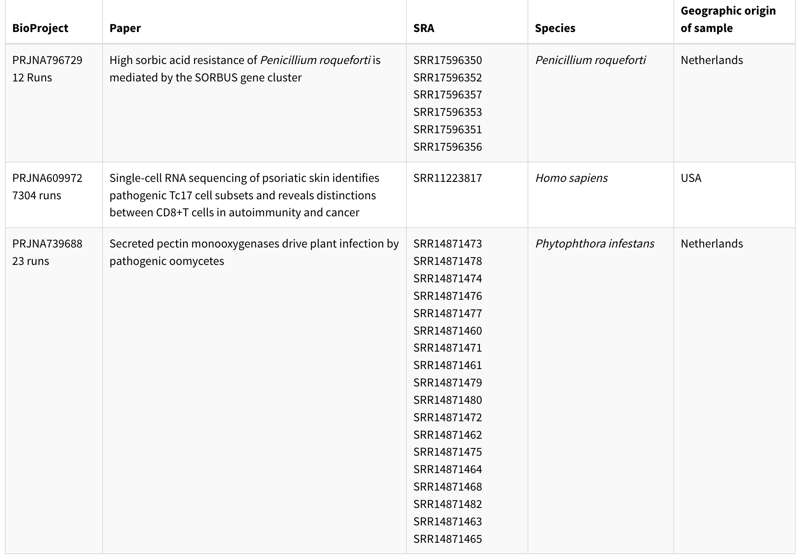
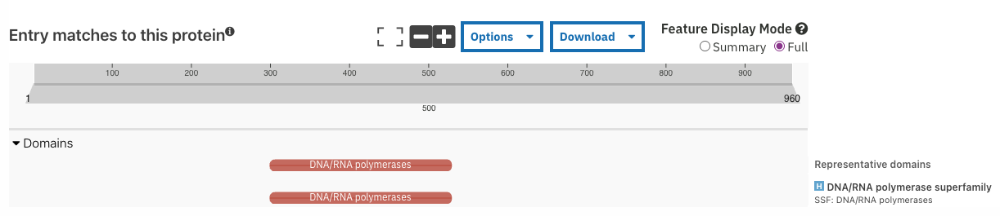
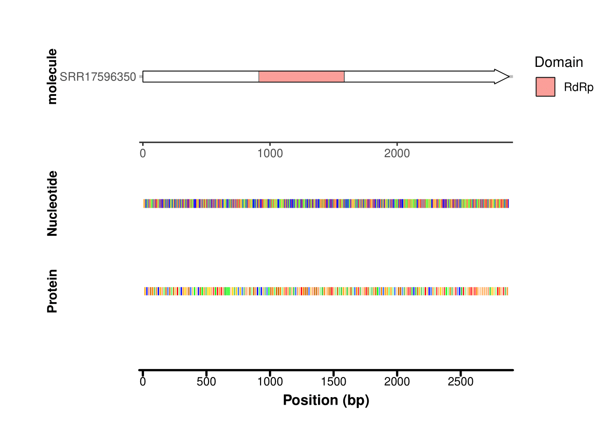
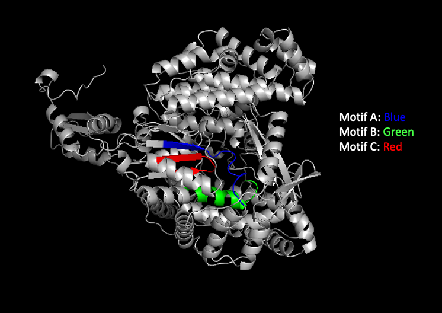

# The Unsuspecting Viral Sensation: Narnavirus nederspoliare isolated in the Blue Cheese Mold from the Netherlands

written by: [Merrilyn Chen](https://github.com/merrilynchen)

### *Narnavirus nederspoliare*

```         
Narnavirus: It is the genus belonging to the Narnaviridae family
neder: Part of Netherlands in Dutch, since the virus originated from the Netherlands
spoliare: Latin for spoil, since the virus is associated with rotting/spoiled food
```

[Optional: Tutorial 2 Generative AI
Cover-art](img/%3Cvirusname%3E/cover.png)

## Abstract

```         
Viruses are ubiquitous and highly diverse, yet most remain unclassified. This 
was a gap highlighted by the Serratus project [Edger et al., 2022]. Their work 
revealed that much of the global virome is already present in existing datasets. 
To explore one such virus uncovered through this pipeline, we investigate a viral sequence detected in 
samples of Penicillium roqueforti (a mold best known for producing blue cheese). 
Through this analysis, we identified its genome, classified its viral family, 
and named it Narnavirus nederspoliare (N. nederspoliare) to reflect its genus, 
geographic origin, and association with food-spoiling molds. Using tools such as 
BLAST, InterProScan, and AlphaFold, we characterized its genome organization, 
predicted functional domains, and identified related viruses with similar 
sequence profiles. We found that N. nederspoliare clusters with other 
plant-pathogen associated narnaviruses and displays hallmark features of the 
Narnaviridae family: a 2,883 nucleotide, positive-strand RNA genome containing a 
single ORF encoding an RNA-dependent RNA polymerase. Our results suggest that 
N. nederspoliare likely originates from the Netherlands, as the datasets 
containing the highest abundance of this virus were collected from there. 
Additionally, its presence in only a single P. roqueforti strain isolated from 
rye bread, indicating that the virus may be associated with a particular, 
potentially more toxic or atypical strains rather than the broader species. 
Together, our findings demonstrate that publicly available computational 
resources can effectively identify and classify unknown viruses and provides a 
foundation for future studies into possible mechanisms of infection of N. nederspoliare. 
```

## Results

### Origin of N. nederspoliare

```         
Our investigation began when we discovered this virus in sequencing data from 
P. roqueforti, reported in the study “High sorbic acid resistance of 
Penicillium roqueforti is mediated by the SORBUS gene cluster” [Punt et al., 2022]. 
P. roqueforti is an industrially important fungus responsible for the blue 
veining in cheese but also a major cause of food spoilage. To understand the 
effectiveness of preservation techniques, the authors examined the resistance of 
34 P. roqueforti strains to several preservatives, with a focus on sorbic acid. 
Six strains were found to be resistant, however, only a single strain originating 
from rye bread in the Netherlands contained the viral sequences. Notably, this 
strain also showed the highest viral node coverage among all N. nederspoliare samples. 

We also found the virus in datasets from “Secreted pectin monooxygenases drive 
plant infection by pathogenic oomycetes” [Sabbadin et al., 2021], which 
investigated the role of copper-dependent lytic polysaccharide monooxygenases 
(LPMOs) in the infection process of Phytophthora infestans, the pathogen 
responsible for the Irish potato famine. This project sequenced P. infestans-infected 
tomato (Solanum lycopersicum) samples from the Netherlands. Out of 23 runs in 
this BioProject, 18 contained the viral sequence.

Additionally, the virus appeared in a single sample from “Single-cell RNA 
sequencing of psoriatic skin identifies pathogenic Tc17 cell subsets and reveals 
distinctions between CD8⁺ T cells in autoimmunity and cancer" [Liu et al., 2021]. 
Since this was the only positive sample out of 7304 human skin samples in the study,
it likely reflects incidental contact rather than true infection and was not 
considered central to our analysis. All remaining detections showed very low node 
coverage, suggesting incidental contamination during sequencing. The virus also 
appeared in viral metagenome and food fermentation metagenome datasets, further 
supporting its association with food-related organisms. Table 1 summarizes the 
samples with the highest viral coverage. 
```

Table 1: Overview of the BioProjects that contained the highest coverage
of N. nederspoliare, along with information on the paper associated with
the BioProject, the total number of runs for the BioProject, the SRR
runs that contained the virus, the species that was being sequenced in
those runs, and the geographic origin of the sample that was sequenced.


### Identifiaction and Characterization of the N. nederspoliare Viral Genome

```         
To identify and characterize the virus, I first identified the contig containing 
the RNA-dependent RNA polymerase (RdRp). I began by running a TBLASTN search 
using the node sequence from the sample with the highest viral coverage (SRR17596350) 
[NCBI BLAST] against the SRA run it was from. From this search, I obtained an 
RdRp sequence, which I then located within the Logan assembly file for the same 
SRA run. This allowed me to isolate the corresponding contig that contained the 
RdRp domain. Running this contig through BLASTX revealed numerous strong hits to 
RdRp proteins. The consistency of these matches, combined with their 
very low e-values, supports the conclusion that this contig represents part of 
the viral genome rather than a spurious alignment [NCBI BLAST].

Using the identified contig, I applied both ORFfinder [Stothard, 2000] and 
InterProScan to locate the open reading frame containing the RdRp domain. The 
BLASTX results indicated that the closest matches belonged to the 
Narnaviridae, a viral family characterized by genomes that typically encode a 
single polypeptide containing the RdRp [Hillman & Cai, 2013]. Guided by this, I 
focused on identifying the ORF corresponding to the RdRp region. InterProScan 
pinpointed the RdRp domain within the ORF (Figure 1). Both ORFfinder and 
InterProScan estimated the ORF length to be 960 amino acids long, with the RdRp 
domain spanning 224 amino acids, located between positions 304 and 528 on the 
contig (Figure 2). To further confirm that the ORF corresponded to the RdRp region, 
I used Serratus PalmID to identify motifs A, B, and C, which are considered to 
be the conserved “palmprint” motifs characteristic of RdRp proteins. I then generated
an AlphaFold3 structural prediction and mapped the positions of these motifs onto 
the predicted protein structure using PyMol, as shown in Figure 3. 
```

 Figure 1:
InterProScan annotation of the proposed ORF, showing the location of the
RdRp domain. The scale is in amino acids. The presence of this conserved
domain supports that this ORF corresponds to the viral genome typical of
the Narnaviridae.

 Figure 2:
Genome map of *N. nederpeculiaris*. The open reading frame (ORF)
containing the RdRp domain is highlighted in red at the top. Below, the
nucleotide and protein sequence alignments are shown. For readability,
the nucleotide sequence is displayed at 5-base intervals, while the
amino acid sequence is presented at single–residue resolution. Each
colour represents a different amino acid/base.For amino acids, the
colour also represents the charge the amino acid has. Both sequences
appear to be equally distributed, without any stretches of any
particular base or amino acid type.

```         
The colour code for each nucleotide 
nt_colors <- c("A" = "#64F73F", "C" = "#0000FF", "G" = "#EB413C", 
               "T" = "#FFB340")
               
The colour code for each amino acid
aa_colors <- c(
  "A" = "#FFB366",  "C" = "#00CC00",  "D" = "#FF3333",  "E" = "#FF0000",
  "F" = "#FFD700",  "G" = "#FFCC99",  "H" = "#6699FF",  "I" = "#FF8000",
  "K" = "#3366FF",  "L" = "#CC6600",  "M" = "#FFCC66",  "N" = "#66FF66",
  "P" = "#FF9966",  "Q" = "#00FF00",  "R" = "#0000FF",  "S" = "#66CC66",
  "T" = "#33CC33",  "V" = "#FF9933",  "W" = "#FFA500",  "Y" = "#99FF99",
  "*" = "#000000")
```


Figure 3: Alphafold3 predicted struture of the ORF. The 3 motifs of the
RdRp sequence are shown in their respecitve colours. Motif A is shown in
blue and ranges from position 384 to 396. Motif B, shown in green is at
position 447 to 460. Lastly, Motif C is found in red at position 478 to
487.

### Common Denominator Between Samples

```         
From our analysis of the identity and characteristics of N. nederspoliare, it is 
evident that this virus belongs to the Narnaviridae family. Interestingly, it was 
detected in only a single P. roqueforti strain, which originated from rye bread 
rather than the more commonly studied cheese-associated lineages. This suggests 
that this particular strain may possess unique features not shared by other strains. 
Although P. roqueforti is generally considered non-toxic, several studies have shown 
that specific strains can produce harmful mycotoxins with potential risks to human 
health [Dubey et al., 2018]. It is therefore possible that this rye-derived strain 
represents a more toxigenic lineage

The closest matches to N. nederspoliare were also found in fungi that cause severe 
agricultural diseases, particularly in grapevine systems, including Erysiphe necator
and Plasmopara viticola. Both are major mildew pathogens associated with significant
crop loss [Debat et al., 2025; Zaccaron et al., 2023; Kolekendova et al., 2022]. 
Likewise, the only other BioProject in which this virus appeared involved P. infestans, 
a devastating plant pathogen best known for its role in the Irish potato famine 
[Sabbadin et al., 2021].

Together, these observations lead me to hypothesize that N. nederspoliare infects 
toxic or agriculturally damaging food-associated pathogens, potentially during their 
asexual sporulation stages, and may circulate in environments associated with food 
production in the Netherlands. Future work could involve whole-genome comparisons 
between the infected P. roqueforti strain and uninfected strains, as well as the 
P. infestans samples. Analysis that focuses on homology, shared genomic features, 
and single-nucleotide polymorphisms could clarify whether these hosts share traits 
that facilitate viral infection. Overall, our ecological and genomic analysis 
allowed us to identify and classify this virus, and future experiments will be 
essential for uncovering the mechanisms that enable N. nederspoliare to infect 
these organisms.
```

## Discussion

```         
This analysis identified and characterized a previously unknown virus associated 
with P. roqueforti. Closer examination of the dataset revealed that the virus was 
present in only a single P. roqueforti strain rather than being widespread across 
the species. Most of the samples containing the viral sequence originated from the 
Netherlands, suggesting a potential geographic association. Domain prediction analyses 
further showed that only one ORF exhibited identifiable functional domains, consistent
with the streamlined genomes typical of the Narnaviridae family. Although narnaviruses 
are among the simplest RNA viruses, it is intriguing to observe how the motifs within 
the RdRp palmprint vary across different narnavirus species and how these differences
may influence their infection strategies. 
```

## References

```         
*Research Articles*: 

  Debat, H. J. et al. Grapevine holobiome metatranscriptomics provides a glimpse into the wood mycovirome. Preprint at https://doi.org/10.1101/2025.03.21.644598 (2025).
  
  Dubey, M. K. et al. PR Toxin - Biosynthesis, Genetic Regulation, Toxicological Potential, Prevention and Control Measures: Overview and Challenges. Frontiers in Pharmacology 9, (2018).
  
  Hillman, B. I. & Cai, G. Chapter Six - The Family Narnaviridae: Simplest of RNA Viruses. in Advances in Virus Research 149–176 (Elsevier, 2013). doi:10.1016/b978-0-12-394315-6.00006-4.
  
  Koledenkova, K. et al. Plasmopara viticola the Causal Agent of Downy Mildew of Grapevine: From Its Taxonomy to Disease Management. Frontiers in Microbiology 13, (2022).
  
  Liu, J. et al. Single-cell RNA sequencing of psoriatic skin identifies pathogenic Tc17 cell subsets and reveals distinctions between CD8+ T cells in autoimmunity and cancer. Journal of Allergy and Clinical Immunology 147, 2370–2380 (2020).
  
  Punt, M. et al. High sorbic acid resistance of Penicillium roqueforti is mediated by the SORBUS gene cluster. PLOS Genetics 18, e1010086 (2022).
  
  Sabbadin, F. et al. Secreted pectin monooxygenases drive plant infection by pathogenic oomycetes. Science 373, 774–779 (2021).
  
  Zaccaron, A. Z., Neill, T., Stergiopoulos, I., Corcoran, J. & Mahaffee, W. F. A chromosome-scale genome assembly of the grape powdery mildew pathogen Erysiphe necator reveals its genomic architecture and previously unknown features of its biology. mBio 14, (2023).

*Technologies*:

  Abramson, J., Adler, J., Dunger, J. et al. Accurate structure prediction of biomolecular interactions with AlphaFold 3. Nature 630, 493–500 (2024).
  
  Edgar, R.C., Taylor, B., Lin, V. et al. Petabase-scale sequence alignment catalyses viral discovery. Nature 602, 142–147 (2022).
  
  Jones, P. et al. InterProScan 5: genome-scale protein function classification. Bioinformatics 30, 1236–1240 (2014).
  
  Stothard P (2000) The Sequence Manipulation Suite: JavaScript programs for analyzing and formatting protein and DNA sequences. Biotechniques 28:1102-1104.
  
  Schrödinger, L., & DeLano, W. (2020). PyMOL. http://www.pymol.org/pymol
  
  U.S. National Library of Medicine. (n.d.-a). Blast: Basic local alignment search tool. National Center for Biotechnology Information. https://blast.ncbi.nlm.nih.gov/Blast.cgi 
  
  U.S. National Library of Medicine. (n.d.). Home - SRA - NCBI. National Center for Biotechnology Information. https://www.ncbi.nlm.nih.gov/sra 
```

# Viral Short Story

```         
(Scene opens with a bright, overly cheerful man, "Dr. Bolt," in a slim-fit lab coat. He stands before a swirling graphic of a blue cheese wheel and a test tube.)
Dr. Bolt (Smiling widely, speaking with rapid, enthusiastic cadence): Greetings, future fans! Are you ready for a revolutionary discovery straight from the cutting edge of modern mycolog? I’m Dr. Bolt, and tonight, we're zooming in on your favorite dairy delight: blue cheese!
(He points to a diagram.)
Dr. Bolt: Inside the beautiful blue veins of Penicillium roqueforti, our brilliant researchers—pioneers operating out of the sophisticated labs in the Netherlands—uncovered an unbelievable biological secret! It’s a virus! That’s right! The very mold that makes your Roquefort so racy is host to a microscopic passenger!
(He taps the diagram with a silver pointer.)
Dr. Bolt: Now, this isn't just any common cold! This is a simple, elegant RNA-virus! It carries its genetic code on a single, powerful strand, making it a master of efficiency. And our classification experts, using the latest in electron microscopy technology, have placed it squarely within the distinguished Narnaviridae family of viruses! Think of them as the streamlined, space-age viruses—small, single-segmented, and utterly fascinating!
(Dr. Bolt leans in conspiratorially.)
Dr. Bolt: But hold onto your hats, because the mystery deepens! Our scientists tracked this identical virus, this Roquefort Rhapsody, far beyond the cheese cave! They found the very same Narnavirus also present in the agricultural menace known as Phytophthora infestans!
(He gestures to a stylized, futuristic image of a blighted potato.)
Dr. Bolt: From the gourmet dinner table to the fields where the potato blight thrives, this viral thread connects worlds! This incredible find gives us unprecedented insights into fungal control and food stability. The future of agriculture starts here!
(Dr. Bolt turns to the camera, his teeth gleaming.)
Dr. Bolt: Don’t delay! Invest in knowledge! Join us next week when we reveal how this discovery might power your atomic toaster! Good night, and keep your eyes on the microscope!
(The scene ends with a flash and a quick, upbeat jingle.)
```
