# Hogging the Polymerase: Discovery of a Novel Narnavirus-like RNA Virus in the Swine Gut
written by: [Tee Zheng Xuan]

### {Narnavirus porcinus}

The virus is provisionally named Narnavirus porcinus. The genus name Narnavirus reflects the virus’s phylogenetic placement, based on RdRp sequence similarity, conserved polymerase motifs, and genome organization consistent with members of the family Narnaviridae.

The species epithet porcinus is derived from Latin, meaning “of pigs,” and refers to the repeated detection of this virus in swine-associated gut metatranscriptomic and metagenomic datasets. This name reflects both the evolutionary relationship of the virus and the ecological context in which it was discovered.


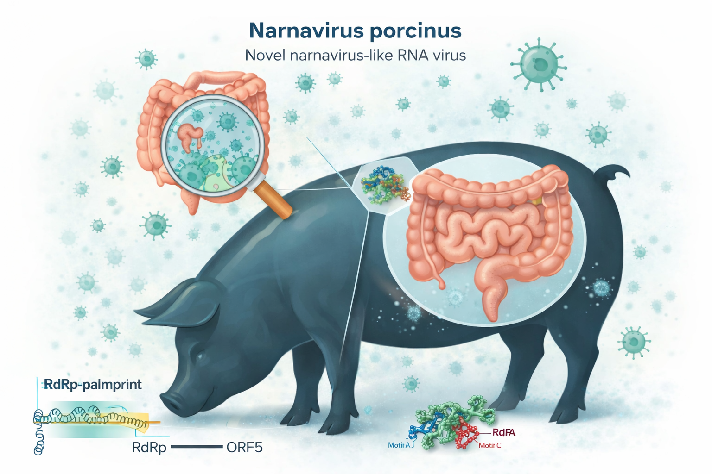

## Abstract

RNA viruses are abundant components of gut microbiomes, yet many remain uncharacterized because their genomes are highly divergent and are often detectable only through short conserved motifs in the RNA-dependent RNA polymerase (RdRp). As a result, the diversity, ecology, and genome organization of capsid-less RNA viruses in mammalian gut sequencing datasets remain poorly understood. Here, I investigated a previously unclassified viral operational taxonomic unit, sOTU u249886, identified by the conserved RdRp palmprint u78967, using publicly available metatranscriptomic and metagenomic data. All SRA runs containing this palmprint were enumerated using the course-provided virusRunObservations table, and a representative viral contig was reconstructed from the assigned index case SRR5368803 derived from piglet fecal samples in BioProject PRJNA237795. Viral classification was performed using a combination of RdRp motif detection (Serratus/PalmScan), ORF prediction (ORFfinder), sequence similarity searches (BLASTp), multiple sequence alignment (Clustal Omega), phylogenetic inference (MEGA X; maximum likelihood with JTT + Γ model and 100 bootstrap replicates), and protein structure prediction (AlphaFold). The identical 103-amino-acid palmprint was detected in nine independent SRA runs spanning two BioProjects, all originating from gut-associated libraries, indicating a reproducible signal across independent studies. The representative contig encodes a single long ORF (ORF5; 690 aa) and lacks additional large ORFs corresponding to structural proteins. BLASTp and phylogenetic analyses place this virus within the Lenarviricota, most closely related to members of the Narnaviridae, but clearly distinct from any described species. Conserved RdRp motifs A–C localize to the predicted polymerase core, supporting functional conservation despite low overall sequence identity. Together, these results support the discovery of a novel narnavirus-like RNA virus associated with the swine gut microbiome and highlight how motif-based discovery pipelines can reveal stable, capsid-less RNA viruses embedded within complex microbial ecosystems.

## Results

### Digital Ecology of Narnavirus porcinus

#### Index case: piglet gut under carbadox treatment (PRJNA2)

To characterize the ecological context of this virus, I began with the Serratus palmprint u78967 listed in the course-provided virusRunObservations table and used it to enumerate all SRA runs containing the same RdRp fragment. Although SRR5368803 was designated as the representative index case, it is one of several runs sharing an identical palmprint sequence rather than being uniquely distinguished by read coverage.

SRR5368803 is annotated as Sus scrofa domesticus feces from BioProject PRJNA237795. The associated publication, “Carbadox has both temporary and lasting effects on the swine gut microbiota” by Looft et al. (2014), describes a controlled feeding experiment in which twelve three-week-old piglets in Iowa, USA were divided into carbadox-treated and non-medicated groups. Treated pigs received carbadox in feed for 21 days, followed by a six-week withdrawal period. Fecal samples were collected longitudinally to profile gut microbial communities using high-throughput sequencing.


Five virus-positive runs (SRR5368803, SRR5368806, SRR5368811, SRR5368809, and SRR5368786) originate from pig fecal samples within this trial. Thus, the index ecological setting is the gut ecosystem of nursery-age pigs in an intensive agricultural environment, subject to strong abiotic perturbation from in-feed antibiotics and concurrent dietary changes.

These datasets consist of metatranscriptomic RNA-seq derived from whole gut communities, meaning the virus is detected within a complex mixture of bacteria, archaea, eukaryotes, and their associated viruses. While the sample host is mammalian, the narnavirus-like genome organization and RdRp sequence strongly suggest that the virus does not infect the pig directly, but instead replicates within a microbial host—most plausibly a fungal or protist member of the gut microbiota.

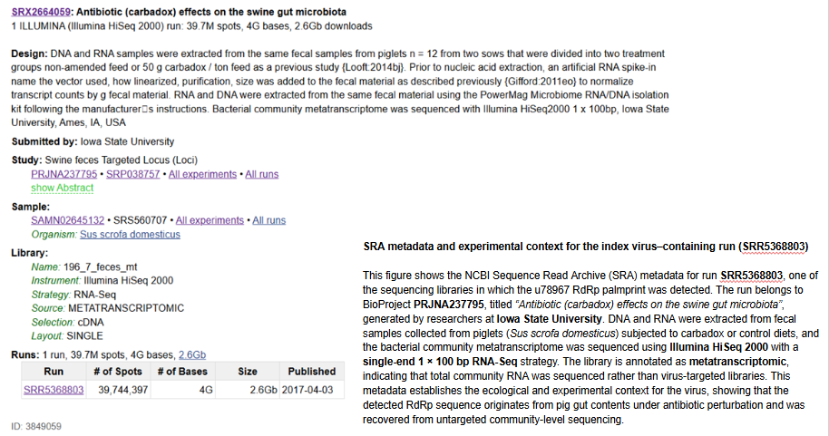


#### Broader digital ecology across SRA runs and Bioprojects

Using palmprint ID u78967, I identified all SRA runs in which this conserved RdRp motif occurs. In total, the virus is detected in nine independent runs spanning two BioProjects. In addition to the five pig fecal metatranscriptomes from PRJNA237795, four additional runs (SRR14039712, SRR14039773, SRR14039721, SRR14039579) originate from BioProject PRJNA716119 and are annotated more generically as “gut metagenome.”

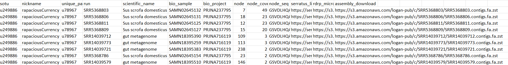

Although the host species for PRJNA716119 is not explicitly specified, all samples are intestinal or fecal in origin, again pointing to a gut-associated ecological niche. Across both BioProjects, the virus is consistently detected in gut community sequencing datasets and is absent from environmental water, soil, or respiratory samples, supporting a stable association with enteric microbial ecosystems rather than a free-living environmental lifestyle.

The sequencing technologies also differ between BioProjects—Illumina HiSeq metatranscriptomic RNA-seq for PRJNA237795 and shotgun metagenomic sequencing for PRJNA716119—yet the same 103-amino-acid RdRp palmprint is recovered. This reproducibility across platforms and studies indicates that the signal represents a genuine viral operational unit rather than a dataset-specific artifact. Notably, a full-length RdRp ORF (ORF5) could be reconstructed only from SRR5368803 and is therefore treated as a representative genome-level inference rather than evidence of complete genome recovery in all runs.


#### Shared ecological patterns and interpretation

Across all virus-positive datasets, several common features emerge. First, all detections originate from gut or fecal libraries associated with mammals or mammal-associated intestinal systems. Second, the virus is detected exclusively in untargeted metatranscriptomic or metagenomic datasets generated to study microbial communities, rather than from virus-enriched sequencing approaches. This suggests that the virus is an embedded component of the gut microbiome rather than an externally introduced contaminant.

Within PRJNA237795, the virus appears in multiple pigs and across multiple sampling time points, including both during carbadox treatment and after antibiotic withdrawal. This persistence despite major antibiotic-driven restructuring of bacterial communities implies that the virus’s primary host is unlikely to be bacterial. Instead, its ecological behavior is consistent with a narnavirus-like lifestyle involving replication within fungal or protist hosts that are less directly affected by antibacterial treatments.

Taken together, these observations support the interpretation that Narnavirus porcinus is a stable, biologically meaningful member of mammalian gut viromes. Its repeated detection across independent studies and sequencing strategies suggests that similar capsid-less RNA viruses may be widespread but under-recognized components of gut microbial ecosystems.

### Serratus-Based Taxonomic and Metadata Context of sOTU u249886

####Taxonomic composition of SRR5368803 reads

Serratus taxonomy analysis of SRR5368803 shows that 34.78% of reads could be taxonomically classified, while 65.22% remained unassigned. Among the classified reads, the majority correspond to cellular organisms, including Eukaryota (20.39%) and Bacteria (14.30%). Viral reads constitute only a very small fraction of the dataset (0.03%), which is consistent with the expected low abundance of viral sequences in untargeted metatranscriptomic fecal samples. This result indicates that the detected virus is present at low abundance relative to host and microbial RNA.

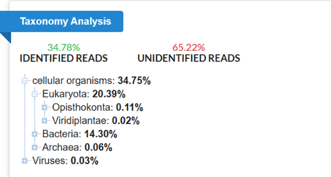

####Detection of conserved RdRp palmprint motifs

Despite the low abundance of viral reads, Serratus detected a conserved 103–amino acid RNA-dependent RNA polymerase (RdRp) palmprint corresponding to sOTU u249886. The presence of conserved polymerase motifs A–C within this palmprint supports its identification as a bona fide RNA virus and explains how this virus could be reliably detected across datasets despite its low representation in total sequencing reads.

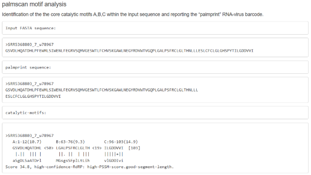

####SRA annotation and environmental metadata context

To contextualize the ecological distribution of this virus, Serratus-generated SRA annotation word clouds were examined. These annotations, scaled by percent identity, show that sequences matching the candidate virus are predominantly associated with Sus scrofa domesticus gut metagenomes, as well as wastewater and bioreactor samples. This metadata pattern indicates a strong association with swine-linked and gut-associated microbial environments rather than a single isolated study.

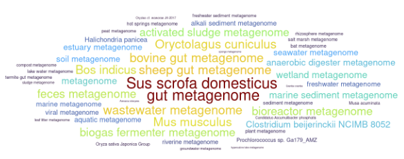

### BLASTp analysis of the RdRp palmprint sequence

To establish the taxonomic identity of the virus with minimal assumptions, I first examined the conserved RdRp palmprint sequence using BLASTp against a clustered protein database.

A BLASTp search using the 103–amino acid RdRp palmprint sequence recovered exclusively viral RNA-dependent RNA polymerase (RdRp) homologs. The two highest-scoring matches correspond to RdRps from Orin narna-like virus (family Narnaviridae), each with 100% query coverage, no gaps, high bit scores (183 and 175), and amino-acid identities of 76.7% and 74.8%, respectively, with highly significant E-values (1 × 10⁻⁵¹ and 8 × 10⁻⁴⁹).

Additional high-scoring hits include partial RdRp sequences annotated from uncultivated Leviviridae/Fiersviridae-like viruses (59–77% identity), followed by a more distant match to a mitovirus RdRp (family Mitoviridae) with approximately 51% amino-acid identity. No non-RdRp or non-viral proteins were recovered in the search.

The exclusive recovery of RdRp homologs and the taxonomic distribution of the top hits place the query within the RdRp diversity of the phylum Lenarviricota. Because all matches fall well below commonly used species-level amino-acid identity thresholds (~90%), these results support classification of sOTU u249886 as a novel narnavirus-like virus rather than a previously described species. The closest affinities to narnaviruses and mitoviruses—groups known to infect fungi or protists—suggest that the true host is likely a micro-eukaryote present in the porcine gut ecosystem rather than Sus scrofa itself.


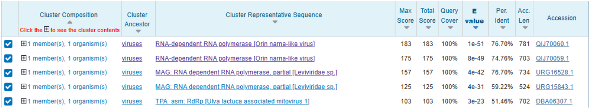

The top five BLASTp matches recovered using the 103–amino acid RdRp palmprint query all fall within the same viral phylum, Lenarviricota, as shown in the RNA virus taxonomy framework (adapted from Wikipedia/ICTV). Although the hits are assigned to different families within this phylum (including Narnaviridae, Leviviridae/Fiersviridae, and Mitoviridae), their shared placement within Lenarviricota reflects a common evolutionary origin of their RNA-dependent RNA polymerase. This result supports phylum-level classification of the query virus based on conserved RdRp sequence similarity.

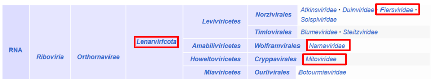

###tBLASTn validation of RdRp palmprint genomic context

To validate the genomic context of the Serratus-identified RdRp palmprint, the SRR5368803 contig assembly was split into multiple fragments to accommodate tBLASTn input size constraints. The 103–amino-acid RdRp palmprint sequence was queried against these contig subsets using tBLASTn. Significant hits were recovered in multiple overlapping contigs, including SRR5368803_3168, with complete query coverage (103/103 aa), no gaps, and extremely low E-values, confirming a high-confidence match (Highlighted with a red box). The palmprint maps internally within a long open reading frame, supporting its annotation as part of a viral RNA-dependent RNA polymerase rather than an isolated or spurious match.

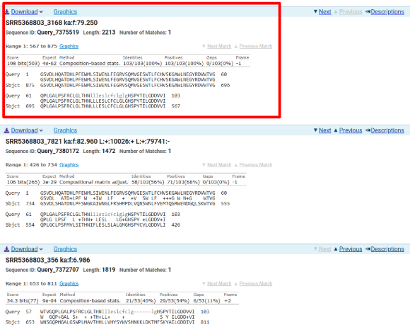

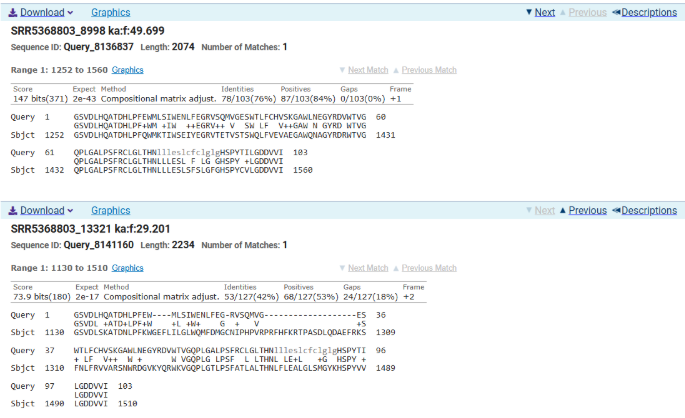

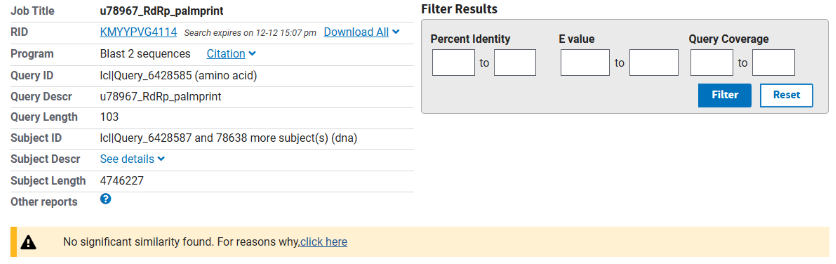

### ORFfinder analysis of the SRR5368803 viral contig

Having localized the RdRp palmprint within the SRR5368803 contig and confirmed that it resides internally within a long coding region, the next step was to define the full open reading frame encompassing this motif. To accomplish this, the palmprint-containing contig was analyzed using ORFfinder to identify candidate ORFs spanning the aligned region. This approach allowed us to determine whether the conserved polymerase motif is embedded within a single continuous ORF, as expected for narnavirus-like genomes that typically encode only one large RNA-dependent RNA polymerase.

Open reading frame (ORF) prediction was performed on the SRR5368803 contig containing the u78967 RdRp palmprint using NCBI ORFfinder under the standard genetic code, restricting start codons to ATG. A total of eight ORFs were detected. Among these, a single dominant long ORF (ORF5; approximately 690 amino acids) spans the majority of the contig and contains the conserved 103–amino acid RdRp palmprint region internally. The remaining ORFs are substantially shorter and partially overlapping, and they lack features characteristic of known viral structural or capsid proteins. This genome architecture—dominated by a single large RdRp-encoding ORF—is consistent with narnavirus-like viruses, which typically encode only an RNA-dependent RNA polymerase.

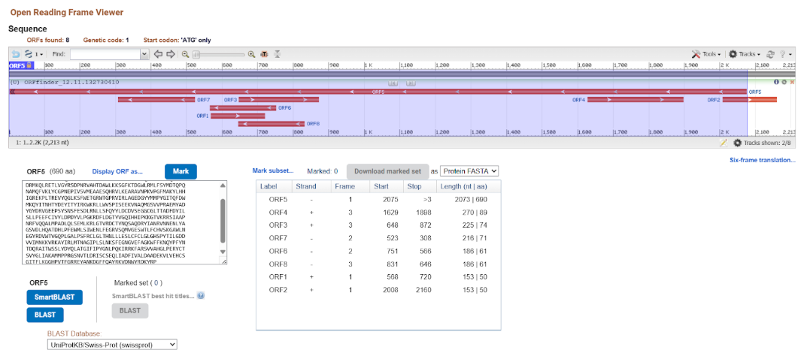

```
>lcl|ORF5
MPVTSVKKNTKLQVVNEVILRSIPLDKRLKRYFVKKFQRMVDRNGQAYAC
DRMKQLRETLVGYRSDPNRVAHTDAWLKKSGFKTDGWLRMLFSYMDTQPQ
NAMQFVKLYCGPNEPIVSVMEAAESQHRVLKEARAVNPKVPGFMAKYLHH
IGREKPLTREVYQGLKSFWETGRWTGPRVIRLAGEDGYYMMPYGITQFDW
MKQYITNHTYDEYITYIRKWKRLLWVSPISEEKVNAQMGSVVPRAEMYAD
YGYDRVGEEPSYSNSFESDLRNLLSFQYYLDCDVSEGGCGLTTADFDYIL
SLLPEEFCIVYLDPDYVLPGKRDFLDGTYVGQIHHIPKKGTVKRRSIAAP
NRFVQQALMPADLQLSEMLKRLGTVRDCTYNQSAQDRYIANRVNNENLYA
GSVDLHQATDHLPFEWMLSIWENLFEGRVSQMVGESWTLFCHVSKGAWLN
EGYRDVWTVGQPLGALPSFRCLGLTHNLLLESLCFCLGLGHSPYTILGDD
VVIMNKKVRKAYIRLMTNAGIPLSLNKSFEGNGVEFAGKWFFKNQYPFYN
TDQRAITWSSLYDYQLATGIFIPYGNLPQKIRRKFARSVVAHGLPERYCT
SVYGLIAKAMMPPRGSNVTLDRISCSEQLIADFIVALDAADEKVLVEHCS
GITFLKGGHPVTFGRREYANKDGFFQAYRKVDNWYRDKYRP
```

### BLASTp validation of ORF5 viral identity and taxonomic placement

To further validate the classification of the reconstructed viral genome, the translated ORF5 sequence (~690 aa) was queried against the ClusteredNR database using BLASTp. All top five hits correspond to RNA-dependent RNA polymerase (RdRp) proteins from RNA viruses, with no matches to cellular proteins. The highest-scoring alignments are RdRps from Orin narna-like virus and related narnavirus-like sequences, showing high query coverage (~98%) and moderate amino-acid identity (~49–51%), consistent with deep divergence. Additional significant hits include partial RdRps annotated as Leviviridae/Fiersviridae-like viruses and a more distant match to a mitovirus RdRp.

The exclusive recovery of viral RdRp proteins across the full ORF length, together with the absence of non-viral homologs, confirms that ORF5 represents a bona fide viral polymerase. The taxonomic distribution of top hits places this virus within the Lenarviricota RdRp diversity and supports its classification as a novel narnavirus-like virus rather than a member of a known species.

```
>lcl|ORF5
MPVTSVKKNTKLQVVNEVILRSIPLDKRLKRYFVKKFQRMVDRNGQAYAC
DRMKQLRETLVGYRSDPNRVAHTDAWLKKSGFKTDGWLRMLFSYMDTQPQ
NAMQFVKLYCGPNEPIVSVMEAAESQHRVLKEARAVNPKVPGFMAKYLHH
IGREKPLTREVYQGLKSFWETGRWTGPRVIRLAGEDGYYMMPYGITQFDW
MKQYITNHTYDEYITYIRKWKRLLWVSPISEEKVNAQMGSVVPRAEMYAD
YGYDRVGEEPSYSNSFESDLRNLLSFQYYLDCDVSEGGCGLTTADFDYIL
SLLPEEFCIVYLDPDYVLPGKRDFLDGTYVGQIHHIPKKGTVKRRSIAAP
NRFVQQALMPADLQLSEMLKRLGTVRDCTYNQSAQDRYIANRVNNENLYA
GSVDLHQATDHLPFEWMLSIWENLFEGRVSQMVGESWTLFCHVSKGAWLN
EGYRDVWTVGQPLGALPSFRCLGLTHNLLLESLCFCLGLGHSPYTILGDD
VVIMNKKVRKAYIRLMTNAGIPLSLNKSFEGNGVEFAGKWFFKNQYPFYN
TDQRAITWSSLYDYQLATGIFIPYGNLPQKIRRKFARSVVAHGLPERYCT
SVYGLIAKAMMPPRGSNVTLDRISCSEQLIADFIVALDAADEKVLVEHCS
GITFLKGGHPVTFGRREYANKDGFFQAYRKVDNWYRDKYRP

>QIJ70060.1 RNA-dependent RNA polymerase [Orin narna-like virus]
MYDLGVLFISGLCPKEGEYCGMSKPQQRTNGIILASIPINRRLKRYYLKIFGRMVENNGQAFACDRFKQF
REALMGYRADKHRQAKLGYWMRVTGFRSNGWLKMAFRYMDTQPEYIMQFVKLYCGPNDPIVTPGQAAEAQ
HRTLKNAESINATTPAFMRAWLHHMGRERIWTESEYAALKARCSLSQKELDTLIQFGADSPSMRSTGREK
SQKNGVSLTAQPDRMRELFRSLYWAQNFVRKHSYSEYVDYARKWKRLLWVYPIGDDEAKACMESIEPLPE
MYADAQRVLLQSTVSGEPKTYETGMESESLRKDLWNLIMMEDTVGLPLDQGGPGISPESYGFVMRQLTPG
MAMCICDEDMLLSLKGNDASILDGTYVGNIHHIPKKGTVKRRSVAPPNRFLQMGMAPVDAQLSLSLQQLG
ERKGKNGKLPLRSCGHDATYDQSRFDTWLTQRVSNSSLYCGSVDLHQATDHLPFQWMMTIWSEIFEGRVS
STVASSWRLFTEVATGAWNNAGYRDVWTIGQPLGALPSFRCLGLTHNLLLESLAFTLGMSHSPYCVLGDD
VVITNKKLRKQYIALMTNAGIPLSLQKSYEGNLVEFAGKLFIKGQAPFYTTDQRALTWESLFDYQWATGV
FIPWGHLPRSLRQKVVRLAMQEGVPKSKSEAVYQLAFAYGAQPRGSHLVDYSAKGLSESQYLTAVELLAR
HLADDDQAIPSRDEFSGIVRVGGHPVDYLDYGYSVKAGFKLRYRRVAPDWYRDKYRPVATDKLVRSASAA
ISGCLGTLNKD

>QIJ70059.1 RNA-dependent RNA polymerase [Orin narna-like virus]
MAKRRRCGGMSNHQQHVNEVILASIPISKELKRYYLKRFKGLVENNGSAFACDQFKRLREALMGYRADTR
RKQNLDLWMHRSGFRVTGWLRMAFRYMDTQPEYIMQFVKLYCGPNEPNVSIGEAAEAQHRTLEKAQSIRK
QTPSFMQKWLHHVCREKPLRKEEYLLLQYFPEYCPDWLSSFVRNHSYPEYRRYIARWKTMLWVTPITESE
AKAEMVRLEPQPEMYVDFDGHPEVMESESLNRDLWNFYMMEELSYESYGDGGPGISPKSWHFVASQLNPS
LGWALTDDEAILGFKPKDASLLDGSYVGNIHHIPKKGTTKRRSIAAPNRFLQMGMAPADLQLSQVLKQLG
SDKYRGGDCTYDQSRFDRRLTQRISNENLYCGSVDLHQATDHLPFEWMKTIWSEVFLGRVYETVETSWQL
FVEVAEGAWLNAGYRDRWTIGQPLGALPSFRCLGLTHNLLLESLSFTLGYAHSPYCVLGDDVVLLNKRLR
QQYIKLMENVGVPLSLQKSYEGNLVEFAGKLFIRGQAPFYTTDQRALTWESLFDYQFATGVRIPFGHLPR
SLRKRIQQICAKNGVPKGDSEAVYQFAYAMGAQPRGSHLIDYSVKGLTEPQFLSCVELYSQLLAEVDDTP
LAPDWFSGMVRVQGHPVTYLDYGYAEKHGHKQRYRRVAATWYRDKYRPVATDKLIHCASAAIAAVASRDL
NRK

>URG16528.1 MAG: RNA dependent RNA polymerase, partial [Leviviridae sp.]
FGVVPVPIREPIVVRRLSRSSILRPLAKGRRCGAMSRHQQHVNEVILASIPLSKEMKRFYLRLFRKMVEN
NGPAFACDRFKKLREALMGYRADRNRQANLSSWMARSGFHICGWLRMVFRYMDTQPEYIMQFVKLYCGPN
EPLISVGQAAEAQHRVLLEAGNIRTRTPGFLAKWLHHVCREKPWTEREVALICAMHSGSPFDWARSYLSN
HSYKEYLDYIHKWKGLLWVTPVTDHEAWAEMVALEPVPEMYVDYEKVPGIPESESLNRDLWNFLLMGDSC
YESYEDGGPGISPGSWGFVLSHLRPELALLVEDTEFLVGIKPPGASILDGTYVGNIHHIPKKGTTKRRSI
AAPNRFLQMGMAPCDLQLSQTLKHLGGRTKNGRIAPLRECGHDATYDQSRFDAWLTQRVSNPALYCGSVD
LHQATDHLPFQWMKTIWSEIYEGRVTETVSTSWQLFVEVAEGAWLNAGYRDRWTVGQPLGALPSFRCLGL
THNLLLESLSFSLGFGHSPYCVLGDDVVITNRKLRKEYIKLMNNVGVPLSLQKSYEGNLVEFAGKLFIKG
QAPFYNTDQRALTWESLFDYQFATGVLIPWEKLPRSFRKKIQQICVENGVPKSKSETVYQFAQAMGGQPR
GSHLVQYRAKGLTEGQFLTAIPLYTQLLLDEESGKVARDPFSGMVRVQGHPVTYLDYGYAEKHGHKLRYK
RVASTWYRDKYRPVTTDKQIRCASAAISGGFRDL

>URG15843.1 MAG: RNA dependent RNA polymerase, partial [Leviviridae sp.]
MVKPRVNTVILSSIPLNKRLKAYYISKYTWLAQHNGLEYASSIFKQMREIALAYRADPHRLEKRATYLQR
MPVRKNGWLRMLFEYLDSHPEYVLNFLKLYVGLEEPIVSVEESANTQDSYLKSRDRSVNTDVPSFLEGWL
NLISGNFRVSRKEYEIICQHWHPDPMICSFYAGSNYPMIVSRKRYDQLGLLSKYASGHTFGMFLDYIRRW
QRYLRIPKISDDQLVEAAKSAEPLPEMYVDFDLRSVQSESLERDLWCLYSMEAVSETGGWVETPTLSPNA
LSFVESFLHPSLWTLWDQWDFGQGLPDIEKTFLDGCYVGNIHHIPKKGTVKRRPIAAPNRFLQMGMHPAY
QILKKMVSHLPKDATFDQSRFDHRITNRVTNANLYIGSVDLSQATDNLPFLWGERIWDKLVRSNVSPLVN
QSWDLFVECSRARWNNDGILSSWTVGQPLGCLPSFMVLAMTHGLFLESLSFKIGYGHSPYCILGDDLVIT
TKRLRKEYIRQLRNRGIPISLHKSYEGNLTEFAG

>DBA06307.1 TPA_asm: RdRp [Ulva lactuca associated mitovirus 1]
MKHPKPNLNLMLLRSIPLDKDLKRYFISKYCHLVRSNGLEYANGKFKHLESCLKTLRSGHDMPSLGIRNN
GWVKKLIHYMMCQPHHVLNFLKGIYSWKGDINTWETSRRYHHELGSIDSNQHKTPSFMNEWWKVLHQSQS
SLRKSYQWYRSHKTSRFHRYCQWHSLSEWMTYWRHWKRRFRVTGTPTAMERPVFPEMYKDYLSSPNNTLS
DSYERDFVNLCQWLAGRTDVPTAPQPSWVLDLMRRQLSDEAMNAVESHLHGDEKDMLSFKSTDFMSGVYV
GDVHYIPKQGTGYRPIAVPNRFIQSGLVPIYGLLVRVLKNLPLDATYDQDKFDSVIQSRVTTDSRFIGSI
DLSSATDHLPLCWIAPFVKELVANHGCEVTELSLRLFELVSRSKWHNEGYMSEWKVGQPLGTLPSFTWLS
LTHHLFCEALALQIGLGHSPYRILGDDIVVFSKNFHKAYIREMLKRDIPISRHKCYSGKLTEFAGKTFIK
KINPFLTPDHSIVSWQSLFDWQYSTGIRIPWDRLPKNIKRRITRYFGKLAVSGQRAYTLAQLVTVPDRGS
TRHRFVDSESDDLLVHYFRLCEEETPDMPEAVLHTGMTLIQNTVGILFTDQVPLNHPLSLRERVQVISKT
PLEMGGYFRRYYQTVLPDWYRKKFRPTPTDKIFSMLRIAAEEVGLSNSVDSTVNTTTIGDQCGSPWQGCN
DY
```

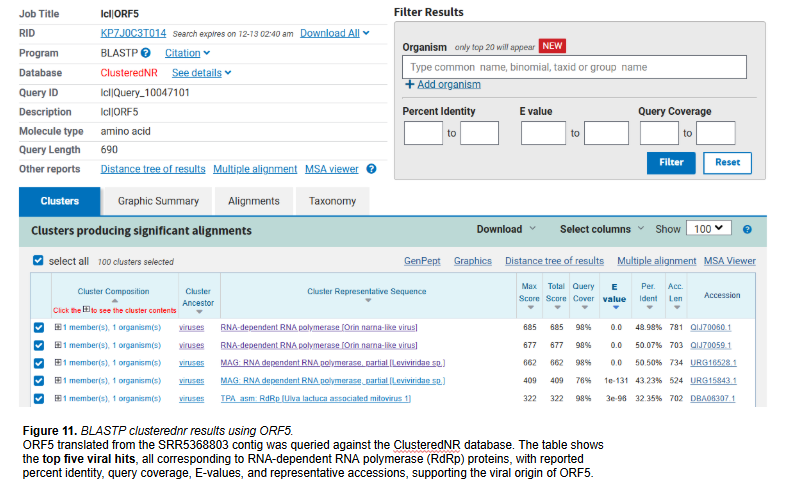

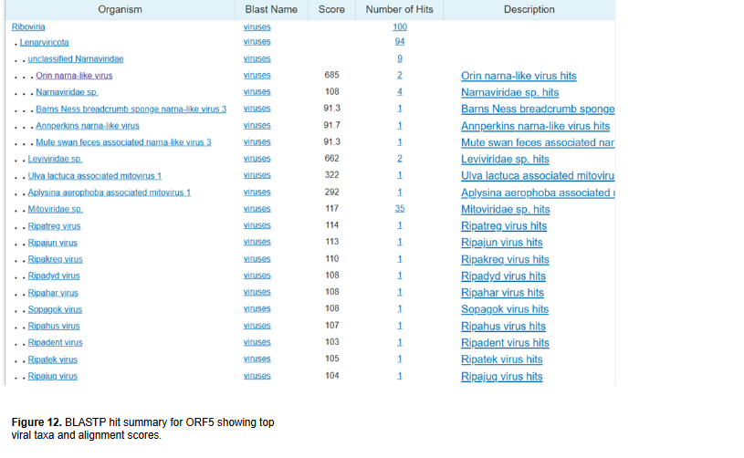

### Multiple sequence alignment of ORF5 with homologous RdRps

To further evaluate sequence conservation and functional homology, a multiple sequence alignment was generated using Clustal Omega, aligning the ORF5 protein (~690 aa) with its top five BLASTp homologs. The alignment reveals strong conservation within the central region of the protein corresponding to the RNA-dependent RNA polymerase (RdRp) catalytic core. In particular, the canonical polymerase motifs A, B, and C—highlighted in the alignment—are clearly preserved across all sequences. The motif C “GDD” catalytic signature is fully conserved in every homolog, indicating retention of essential enzymatic function.

Motifs A and B also exhibit high amino-acid conservation, with only conservative substitutions observed, consistent with strong purifying selection acting on the polymerase active site. In contrast, the N-terminal and C-terminal regions show substantially higher sequence divergence, including frequent substitutions and small insertions or deletions. This pattern—conservation of the catalytic core flanked by more variable regions—is characteristic of RdRps from Lenarviricota and is consistent with previously described narnavirus- and levivirus-like polymerases. Together, these results support the interpretation that ORF5 encodes a functional, evolutionarily divergent RdRp belonging to a narnavirus-like lineage.

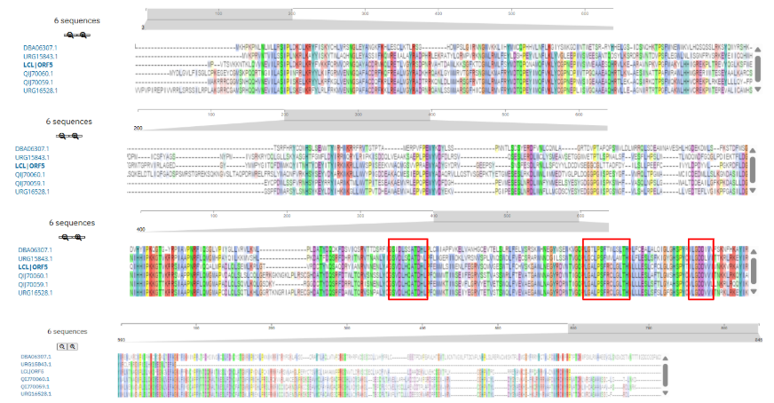


### Phylogenetic placement of ORF5 within Lenarviricota

To further resolve the evolutionary position of the candidate virus, a phylogenetic analysis was performed using MEGA based on the ORF5 amino-acid sequence and representative RdRp sequences from closely related viral taxa. A maximum-likelihood tree was constructed using the JTT substitution model with gamma-distributed rate variation (4 discrete categories) and 100 bootstrap replicates.

The resulting tree places ORF5 within the broader Lenarviricota RdRp clade, clustering most closely with RdRps from Orin narna-like viruses. ORF5 forms a distinct branch adjacent to these narnavirus-like references, supported by high bootstrap values at internal nodes (>90%). Although ORF5 is most closely related to Narnaviridae-associated sequences, its branch length and separation from established reference sequences indicate substantial evolutionary divergence. More distantly related RdRps from Leviviridae-like viruses and mitoviruses form separate branches, consistent with BLAST-based similarity results. Together, these phylogenetic relationships support classification of ORF5 as a novel narnavirus-like RNA virus within Lenarviricota rather than a member of a previously described species.

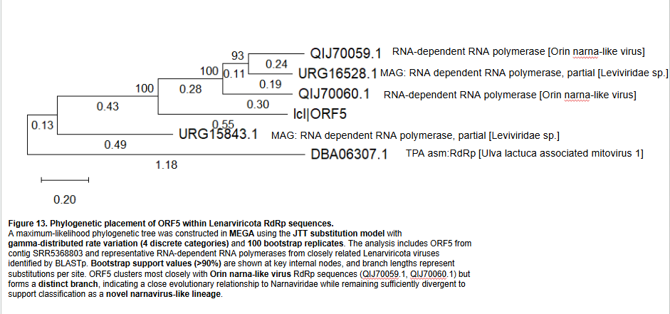

###Structural validation of RdRp identity using AlphaFold

To assess whether ORF5 encodes a structurally plausible RNA-dependent RNA polymerase, the translated ORF5 protein sequence was submitted to AlphaFold for structure prediction. The resulting model adopts a canonical RdRp fold, with a well-defined catalytic core consistent with known Lenarviricota polymerases.

Mapping of conserved polymerase motifs onto the predicted structure reveals that motifs A, B, and C cluster spatially within the palm domain of the enzyme. Motif A (residues 401–412), motif B (residues 463–476), and motif C (residues 496–503), including the conserved “GDD” catalytic signature, are positioned in the expected orientation relative to one another, forming the active site of the polymerase. This structural organization mirrors that observed in experimentally characterized narnavirus and mitovirus RdRps. The concordance between sequence conservation, phylogenetic placement, and three-dimensional structure provides independent validation that ORF5 encodes a functional RNA-dependent RNA polymerase and supports its annotation as the sole coding gene of a narnavirus-like genome.

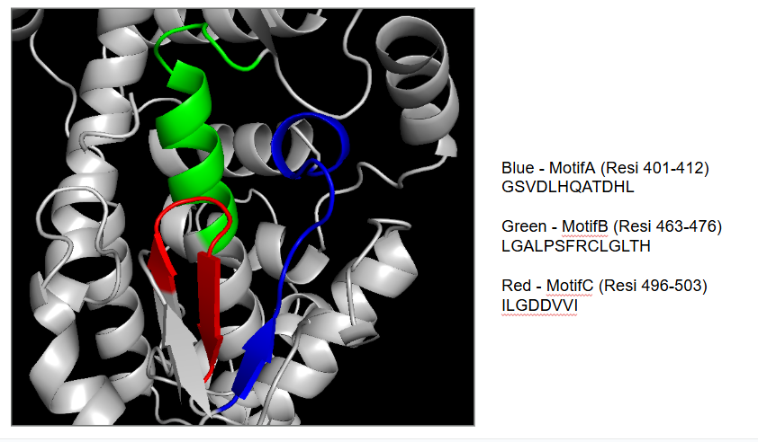

## Discussion

Characterizing this virus taught me that even very short conserved regions, such as the RdRp palmprint, can be powerful enough to identify and classify highly divergent RNA viruses. What I found most interesting is that this virus appears to encode only a single large RdRp ORF and lacks any obvious capsid or structural proteins, which matches what is known for narnavirus-like viruses. However, seeing this capsid-less virus repeatedly detected in multiple pig gut datasets was surprising, because it suggests that such viruses can persist stably in complex ecosystems without forming viral particles, likely by replicating inside fungal or protist hosts rather than infecting the animal directly.


## References

(1)Looft, T., Allen, H. K., Casey, T. A., Alt, D. P., & Stanton, T. B. (2014).
Carbadox has both temporary and lasting effects on the swine gut microbiota.
mBio, 5(3), e01319-14.
https://pubmed.ncbi.nlm.nih.gov/24959163/

(2)Altschul, S. F., Madden, T. L., Schäffer, A. A., Zhang, J., Zhang, Z., Miller, W., & Lipman, D. J. (1997).
Gapped BLAST and PSI-BLAST: A new generation of protein database search programs.
Nucleic Acids Research, 25(17), 3389–3402.

(3)National Center for Biotechnology Information (NCBI).
ORFfinder: Open Reading Frame Finder.
https://www.ncbi.nlm.nih.gov/orffinder/

(4)Kumar, S., Stecher, G., Li, M., Knyaz, C., & Tamura, K. (2018).
MEGA X: Molecular evolutionary genetics analysis across computing platforms.
Molecular Biology and Evolution, 35(6), 1547–1549.

(5)Sievers, F., & Higgins, D. G. (2014).
Clustal Omega, accurate alignment of very large numbers of sequences.
Methods in Molecular Biology, 1079, 105–116.

(6)Babaian, A., Edgar, R. C., et al. (2024).
Ribovirus discovery and classification using conserved RNA-dependent RNA polymerase motifs.
Cell.
https://www.sciencedirect.com/science/article/pii/S0092867424010912

(7)Wikipedia contributors.
Virus classification.
Wikipedia.
https://en.wikipedia.org/wiki/Virus_classification

(8)International Committee on Taxonomy of Viruses (ICTV).
Family Leviviridae.
ICTV 9th Report.
https://ictv.global/report_9th/RNApos/Leviviridae

(9)Nature Publishing Group.
Nature summary paragraph guidelines.
https://www.nature.com/documents/nature-summary-paragraph.pdf

(10)Hillman, B. I., & Cai, G. (2013).
The family Narnaviridae: Simplest of RNA viruses.
Advances in Virus Research, 86, 149–176.
https://www.sciencedirect.com/science/chapter/bookseries/abs/pii/B9780123943156000064

(11)Jumper, J., Evans, R., Pritzel, A., et al. (2021).
Highly accurate protein structure prediction with AlphaFold.
Nature, 596, 583–589.
https://doi.org/10.1038/s41586-021-03819-2

(12)AlphaFold Protein Structure Database.
AlphaFold Server user guide.
https://alphafoldserver.com/guides

(13)Babaian, A.
Obeliscus porcinus: Example viral discovery workflow.
VIRUSxDISCVRY GitHub repository.
https://github.com/ababaian/VIRUSxDISCVRY/blob/main/virus/obeliscus_porcinus.md

# Viral Short Story

In the age of abundance, humanity fed billions of animals to sustain itself, yet rarely looked inward—into the unseen ecosystems that made life possible. Beneath the concrete floors of industrial farms, within the winding labyrinth of the swine gut, a vast microbial world thrived unnoticed. Bacteria, fungi, and protists competed, cooperated, and adapted under relentless pressure from diet, antibiotics, and time.

Among them existed a quiet presence: a capsid-less RNA virus, invisible not only to the immune system of its host but to science itself. It bore no armor, no structural proteins, no elaborate genome—only a single purpose encoded in RNA: an RNA-dependent RNA polymerase. This minimalist entity, later named Narnavirus porcinus, lived not as a predator of pigs, but as a shadow within microbial life, replicating inside fungal or protist cells sheltered deep within the gut ecosystem.

Its discovery came not through deliberate search, but by chance—hidden within sequencing data generated to study the effects of the antibiotic carbadox. While researchers focused on bacterial communities, Narnavirus porcinus persisted quietly across multiple samples, its conserved polymerase motif leaving faint but unmistakable traces in the data.

Unlike textbook viruses that spread through particles and plaques, Narnavirus porcinus endured without ever forming a virion. It survived environmental upheaval, antibiotic pressure, and ecological shifts, not by strength, but by simplicity. Its genome changed slowly, its catalytic core preserved, its presence stable.

In revealing Narnavirus porcinus, humanity learned an unsettling truth: the viral world is far larger than what can be cultured, visualized, or isolated. Some viruses do not announce themselves with disease or destruction. Instead, they persist—silent witnesses to microbial life—waiting patiently for the right tools, the right questions, and the curiosity to uncover them.
