# “Obelisk 17: A Microbial Ecosystem Regulator Facilitates Protein Metabolism of the Host in Wastewater Environments by Interactions With Pepteases”
written by: [ZhenghhaoXiao](https://github.com/ZhenghaoXiao)

### Obelisk 17/*Obeliscus Aquidurentis*

[Tutorial 2 Generative AI Cover-art](img/Obeliscus_Aquidurentis/obelisk17.png)(33)

## Abstract

Obelisk 17/*Obeliscus Aquidurentis*, a novel RNA virus-like infectious agent identified within wastewater environments, play a pivotal role in microbial community dynamics and microbial metabolic processes. By performing comprehensive bioinformatics analyses, including taxonomy, codon usage, k-mer analysis, phylogenetics, and protein interaction predictions, we propose *Flavobacterium aquidurense* as the most possible host of *Obeliscus Aquidurentis*, which also suggests Obelisk 17's potential involvement in polysaccharide degradation in microbial community. The genome of Obelisk 17 comprises two overlapping open reading frames (ORFs) from 943 to 971, indicating potential regulatory mechanisms like frameshifting or translational coupling. Structural predictions demonstrated that ORF1 (66 amino acids) exhibit higher expression than ORF2 (244 amino acids), despite its shorter length, as supported by TPM/RPKM analysis. Both ORFs shows structural and functional similarities to the Oblin proteins described in previous studies(15).ORF2 also shows strong alignment on peptidase-like functions(15). STRING suggests these ORFs contribute to protein quality control, biofilm remodeling, and host gene expression regulation. The unique traits of Obelisk 17, particularly its ORF overlap and dominanting expression of ORF1, proved that it is a key microbial regulator micrbial communities in environments like wastewater whiile further investigation is required to confirm its role in host metabolic processes.

## Results

```
#[Using AI assistance from CHATGPT] to perform host prediction, using both codon usage bias analysis and K-mer analysis(33)

library(seqinr)#4
library(Biostrings)#5

# Define file paths
centroid_fasta <- "C:/Users/rjay1/Desktop/MGY441/Final/final-project/hostprediction/Obelisk_17_centroid.fasta"
host_fasta <- "C:/Users/rjay1/Desktop/MGY441/Final/final-project/hostprediction/combined_hosts.fasta"

# Load sequences
centroid_seq <- readDNAStringSet(centroid_fasta)
host_seqs <- readDNAStringSet(host_fasta)

# Function to calculate codon usage bias
calculate_codon_usage <- function(sequence) {
  codons <- sapply(seq(1, nchar(sequence) - 2, by = 3), function(i) substr(sequence, i, i + 2))
  codon_table <- table(codons)
  all_codons <- unique(unlist(lapply(seq_along(codon_table), function(i) {
    names(codon_table)
  })))
  codon_freq <- codon_table[all_codons]
  codon_freq[is.na(codon_freq)] <- 0
  codon_freq <- codon_freq / sum(codon_freq)
  return(codon_freq)
}

# Codon usage analysis for centroid
cat("Performing codon usage analysis for the centroid...\n")
centroid_codon_usage <- calculate_codon_usage(toString(centroid_seq[[1]]))
centroid_codon_usage_df <- as.data.frame(centroid_codon_usage)
write.csv(centroid_codon_usage_df, "centroid_codon_usage.csv")

# Codon usage analysis for hosts
cat("Performing codon usage analysis for hosts...\n")
host_codon_usage_list <- lapply(host_seqs, function(seq) {
  tryCatch({
    calculate_codon_usage(toString(seq))
  }, error = function(e) {
    cat("Error processing sequence:", e$message, "\n")
    return(NULL)
  })
})

# Filter out any NULL results
valid_indices <- which(!sapply(host_codon_usage_list, is.null))
host_codon_usage_list <- host_codon_usage_list[valid_indices]

# Combine results into a dataframe
host_codon_usage_df <- do.call(rbind, lapply(host_codon_usage_list, as.data.frame))
if (nrow(host_codon_usage_df) == length(valid_indices)) {
  rownames(host_codon_usage_df) <- names(host_seqs)[valid_indices]
} else {
  warning("Row names could not be fully assigned due to mismatched lengths.")
  rownames(host_codon_usage_df) <- NULL  # Avoid assigning invalid row names
}

write.csv(host_codon_usage_df, "host_codon_usage.csv")

# Function to calculate k-mer frequencies
calculate_kmer_frequencies <- function(sequence, k = 6) {
  kmers <- sapply(seq(1, nchar(sequence) - k + 1), function(i) substr(sequence, i, i + k - 1))
  kmer_table <- table(kmers)
  kmer_freq <- kmer_table / sum(kmer_table)
  return(kmer_freq)
}

# K-mer analysis for centroid
cat("Performing k-mer analysis for the centroid...\n")
centroid_kmer <- calculate_kmer_frequencies(toString(centroid_seq[[1]]))
centroid_kmer_df <- as.data.frame(centroid_kmer)
write.csv(centroid_kmer_df, "centroid_kmer_frequencies.csv")

# K-mer analysis for hosts
cat("Performing k-mer analysis for hosts...\n")
host_kmer_list <- lapply(host_seqs, function(seq) {
  tryCatch({
    calculate_kmer_frequencies(toString(seq))
  }, error = function(e) {
    cat("Error processing sequence:", e$message, "\n")
    return(NULL)
  })
})

# Filter out any NULL results
host_kmer_list <- host_kmer_list[valid_indices]
host_kmer_df <- do.call(rbind, lapply(host_kmer_list, as.data.frame))
if (nrow(host_kmer_df) == length(valid_indices)) {
  rownames(host_kmer_df) <- names(host_seqs)[valid_indices]
} else {
  warning("Row names could not be fully assigned due to mismatched lengths.")
  rownames(host_kmer_df) <- NULL  # Avoid assigning invalid row names
}

write.csv(host_kmer_df, "host_kmer_frequencies.csv")

# Summary and matching
cat("Summarizing results...\n")
summary_results <- data.frame(
  Host = names(host_seqs)[valid_indices],
  CodonBiasSimilarity = sapply(host_codon_usage_list, function(x) {
    shared_codons <- intersect(names(centroid_codon_usage), names(x))
    if (length(shared_codons) > 0) {
      cor(centroid_codon_usage[shared_codons], x[shared_codons], use = "complete.obs")
    } else {
      NA
    }
  }),
  KmerSimilarity = sapply(host_kmer_list, function(x) {
    shared_kmers <- intersect(names(centroid_kmer), names(x))
    if (length(shared_kmers) > 0) {
      cor(centroid_kmer[shared_kmers], x[shared_kmers], use = "complete.obs")
    } else {
      NA
    }
  })
)
write.csv(summary_results, "host_centroid_comparison.csv")
print(summary_results)

cat("Analysis complete. Results saved as CSV files.")
```

### Ecology

- Obelisk 17 was in 18 distinct BioProjects and 116 SRA runs, primarily focused on wastewater metagenomics. The centroid SRA run focus on finding out the impact of sludge retention duration on the functional diversity and biotransformation rates of micropollutants in wastewater community. No direct publications are associated with the index case (centroid SRA ERR2088990)(1), relevant studies were found for PRJNA230567(2) assoicated sRA runs:
Martínez Arbas S et al., "Roles of bacteriophages, plasmids and CRISPR immunity in microbial community dynamics revealed using time-series integrated meta-omics.", Nat Microbiol, 2021 Jan;6(1):123-135
Muller EE et al., "Community-integrated omics links dominance of a microbial generalist to fine-tuned resource usage.", Nat Commun, 2014 Nov 26;5:5603
These publications also explores microbial community dynamics, which can be relevant for understanding Obelisk 17's ecological context. However, the index case does not associate with any publications and lacks any specific mention in the EAWAG database.
Obelisk 17 is found predominantly in RNA-seq datasets, with a few in whole-genome sequencing (WGS) datasets. These datasets originate primarily from wastewater studies in Europe, particularly in Switzerland, and only a few in Austria, Luxembourg, and the UK. All datasets were generated using Illumina platforms, including HiSeq 2500, HiSeq 4000, Genome Analyzer IIx, and NextSeq 500(1,2,3).
- The datasets and SRA reads from NCBI(3) suggest that Obelisk 17 exists in wastewater environments characterized by high microbial diversity, nutrient flux, and competitive microbial dynamics. Taxonomic analyses indicate co-abundant bacterial species, which can be potential hosts for obelisk 17 :*Haloferula helveola CN-1*(6),*Flavobacterium aquidurense DSM 18293*(7),*Methanobrevibacter smithii ATCC 35061*(8),*Escherichia coli str. K-12*(9),*Chitinophaga pinensis DSM 2588*(10),*Flavobacterium johnsoniae UW101*(11), Among these, *Flavobacterium aquidurense* DSM 18293 is the most likely host based on codon usage and k-mer similarity(higher positive value indicates closers relationships between the two sequences). The specific contigs of *Flavobacterium aquidurense* with the highest similarity are:
Contig 1: Codon Similarity: 0.6051, K-mer Similarity: 0.2846
Contig 11: Codon Similarity: 0.6086, K-mer Similarity: 0.2802
Contig 10: Codon Similarity: 0.6026, K-mer Similarity: 0.2972
Contig 12: Codon Similarity: 0.5914, K-mer Similarity: 0.2622
*Flavobacterium johnsoniae UW101* also has similar confidence level with *Flavobacterium aquidurense*(Codon Similarity: 0.5919, K-mer Similarity: 0.2964). This highlights *Flavobacterium aquidurense* and *Flavobacterium johnsoniae* could have functional or ecological interaction with Obelisk 17.
- *Flavobacterium aquidurense* is a Gram-negative bacterium originally isolated from the Westerhöfer Bach stream in Germany(12)which aligns with the European focus of the BioProjects, particularly Switzerland and Austria, suggesting a shared ecological and geographical niche. Meanwhile Flavobacterium genus can be found in freshwater and have the role of organic matter decomposition in microbial community, especially multiple polysaccharides such as chitin, cellulose, and xylan, which are abundant in wastewater environments(13).
*F. aquidurense* can contribute to the breakdown of organic materials in wastewater environments, facilitating nutrient recycling and supporting microbial community dynamics(13).
- Hypothesis
"Obelisk 17 interacts with *Flavobacterium aquidurense*/*Flavobacterium genus* in wastewater environments, modulating its polysaccharide degradation pathways and nutrient cycling activities and enhance the bacterium’s role in organic matter decomposition and influence microbial community stability in these ecosystems."
Null: 
"Obelisk 17 does not interact with *Flavobacterium aquidurense*/*Flavobacterium genus*, and it has no significant influence on neither polysaccharide degradation, nutrient cycling, or microbial community dynamics in wastewater environments."
To test the above hypthesis, predictions on potential protein-protein interactions will be employed, Alphafold3, STRING, etc. Also several wet-lab experiment can also be performed for the future, including 
culturing Obelisk 17 and *Flavobacterium aquidurense* under wastewater-like envirnoment, with controls. If the gene that associated with the interactions between obelisk 17 and *Flavobacterium aquidurense* can be found, using CRISPR-Cas9 to knock out this gene to see the effects on *Flavobacterium aquidurense*'s functions in the microbial commuity.

### Virus Genome

- Obelisk 17 has two open reading frame protein, which can be oblin 1(ORF2) and oblin 2(ORF1)(14,15)

- ORF1 has 66 amino acids while ORF 2 has 244 amino acids(14)

- Obelisk 17 has a circular genome structure(15)

- In the paper, the *Protein conservation and phylogenetics* mentioned that Oblin 1 coding ORF sequences has approximately 180 to 320 amino acids and 40 amino acids for Oblin 2. This gives support to the observation above(15)

- ORF1 overlaps with ORF2, suggesting a regulatory or functional interaction(14)

*Figure 1: Result of Open Reading Frame Finder From NCBI*

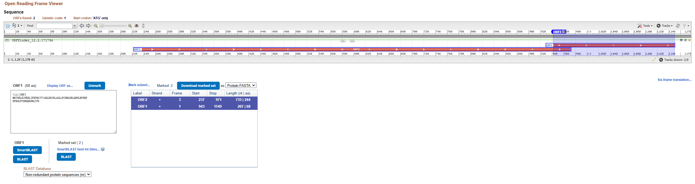

- The prediction of ORF1 has relatively low confidence but the light blue region(amino acids 30 to 44)-helical structure (Confident (90 > plDDT > 70)) suggests that ORF1 can potentially be oblin 2---(14,15,16). The low confidence regions suggest flexibility and structural changes.The helix structure can resonate with the prediction in the paper after modifications(15)

*Figure 2: AlphaFold3 Precition on ORF1(Potential Oblin 2)*

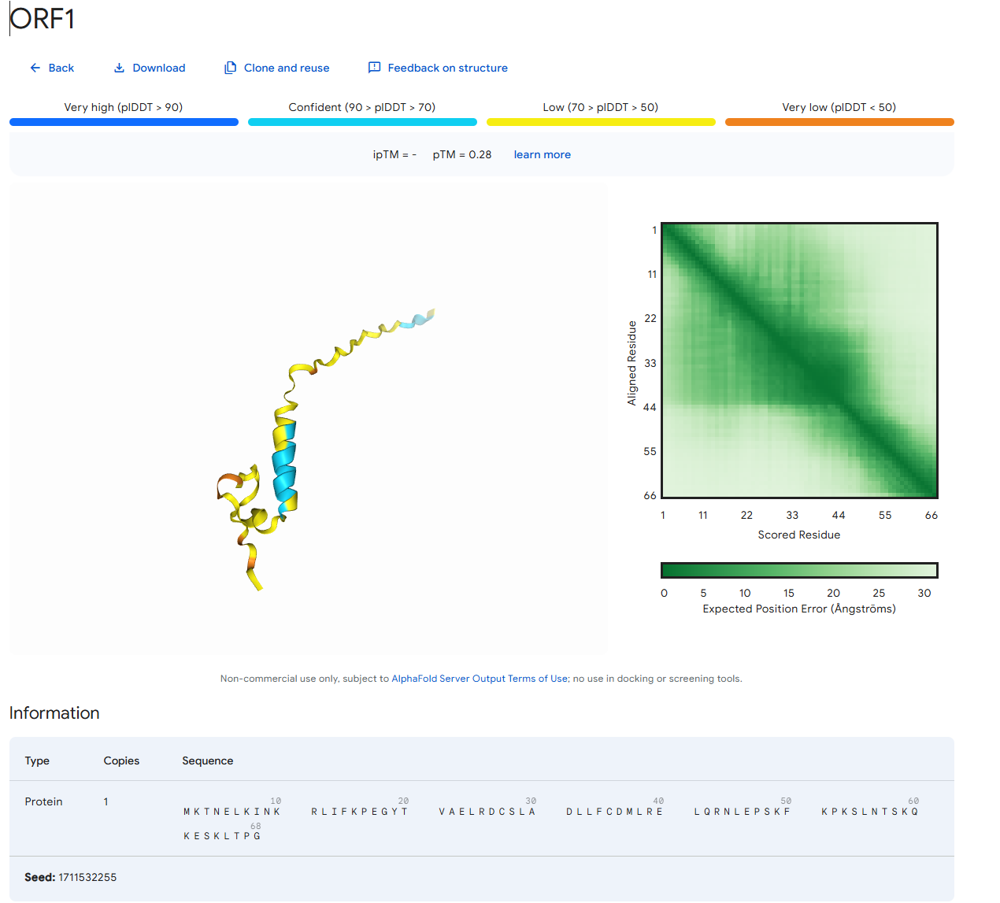

- The prediction of ORF2 has relatively moderate confidence(0.55) and the dark blue region(amino acids 60 to 180)-abundant alpha-helices (with medium to high confidence) suggests that ORF1 can potentially be oblin 1(14,15,16)

*Figure 3: AlphaFold3 Precition on ORF2(Potential Oblin 1)*

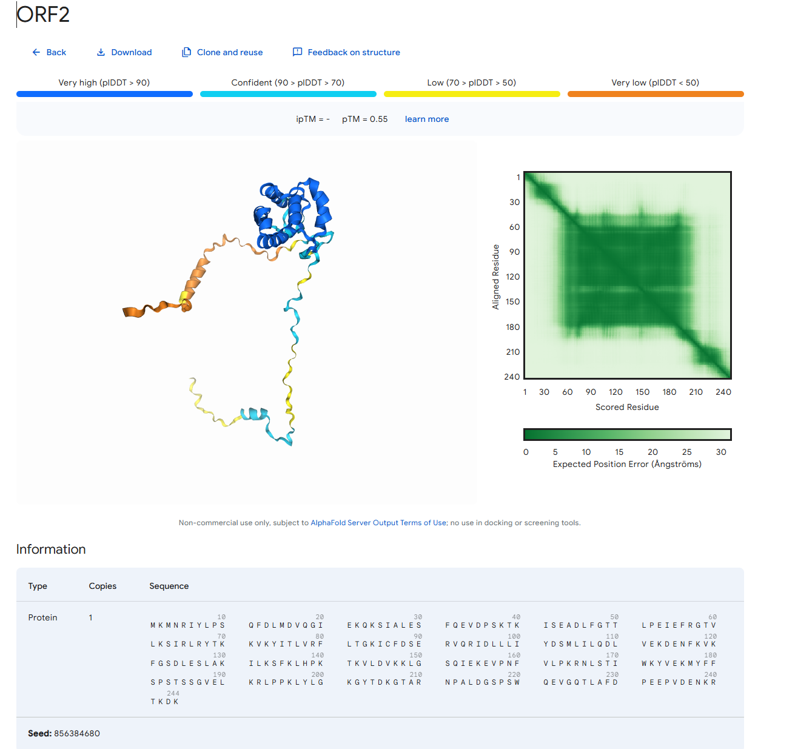

- In the paper, figure 2 demonstrated the predicted structures for both oblin 1 and 2, and predictions of ORF 1 and 2 shares structural similarities with them. Especially, the four helices structure in prediction of ORF2 align closely to the conserved structural motif in panel B(14,15,16)

*Figure 4: Predicted Strcutures and motifs on Oblin 1 and 2 From Figure 2 in Paper(15) *

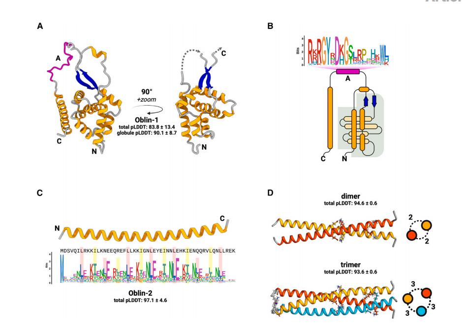

- The prediction of interactions between ORF2 and ORF 1 has relatively moderate confidence(pTM = 0.47), suggesting the dimer might not be the best structure(14,15,16)

*Figure 5: AlphaFold3 Precition on Potential ORF2 and ORF1 Interactions(Dimer)*

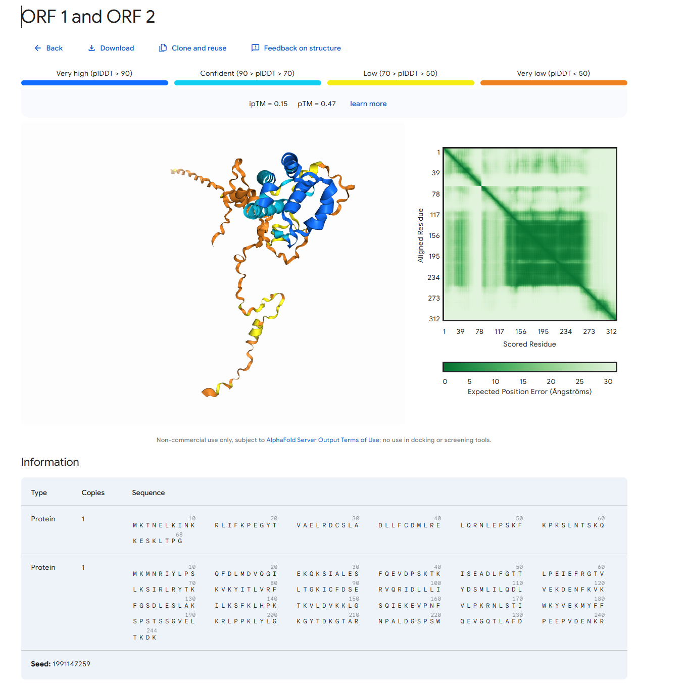


- The genome for the centroid of Obelisk 17 is 1173 nucelotides long and the average length of clusters is 1177, obelisk 17 has a moderate average genome length while comparing to other obelisks.(1406 for 73, 1377 for 89)

- Codon usage bias and k-mer similarity analyses suggest Flavobacterium aquidurense as the most likely host(4,5)

- Obelisk 17 is predominantly found in RNA-seq datasets associated with wastewater metagenomes and most SRA runs were located in Switzerland(1,2,3)

- Obelisk 17 has 116 cluster runs(1,2,3), which has the highers number of clusters among the assigned obelisks.

- Obelisk 17 is not relatively associated with human pathogenicity and do not have strong support that human can the host based on the absence of human-related hits in BLASTP(17)

- STRING database suggests input of ORF1 and ORF2 is similar to Periplasmic serine protease, S1-C subfamily, contain C-terminal PDZ domain(18)

*Figure 6: Prediction From STRING Database Suggesting Similar Functions and Relationships Between ORF2 and the Listed Proteins Subfaamlies and Species*

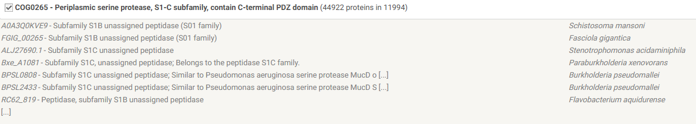

- The listed protein below has potential relationship or shared function with the input protein(ORF2 protien sequence), RC62_819 - Peptidase, subfamily S1B unassigned peptidase-*Flavobacterium aquidurense* also act like an evidence to support the potential host candidate 	    Flavobacterium aquidurense, further analysis on direct protein-protein interactions will be done in question 4

- As STRING suggests the protein input belongs to protease, this resonate with the peptidase or protease-like function of oblin 1 mentioned in the paper provided from the professor which supports the potential of ORF2 being Oblin 1 (15,18)

*Figure 7: Prediction From STRING Database Suggesting the Potential Pathways the Input Protein May Involve *

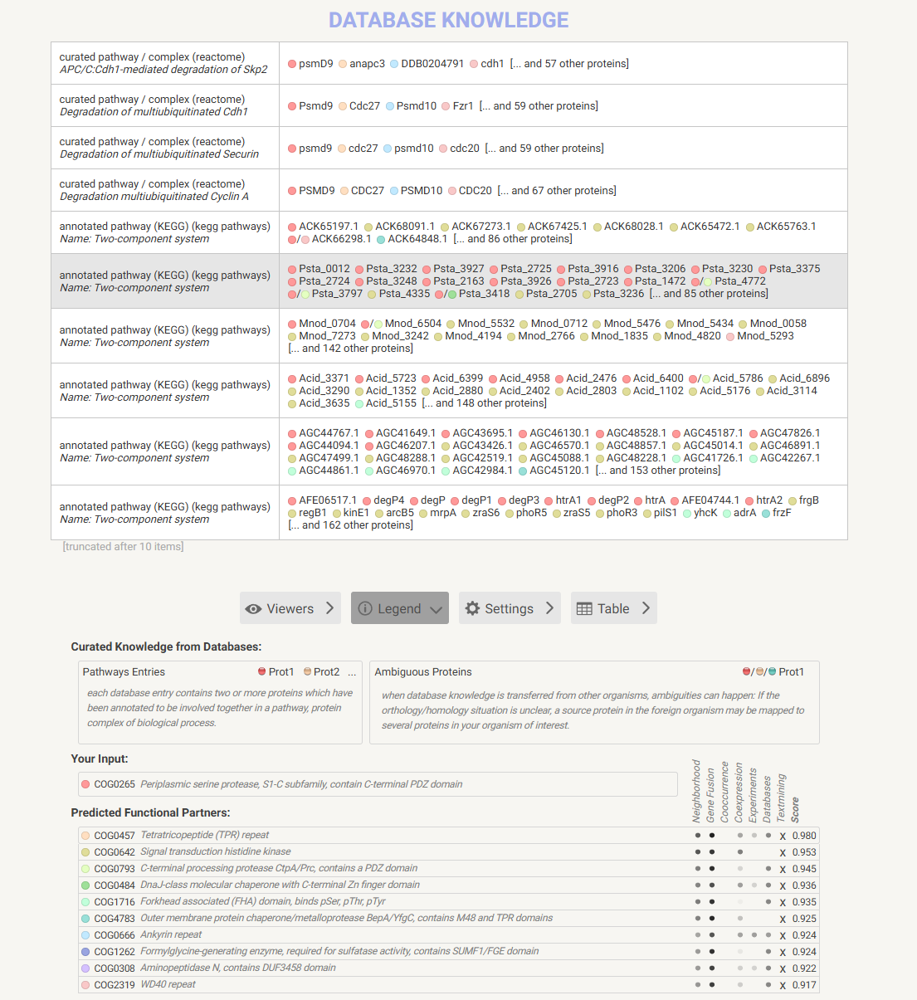

- STRING suggests that the ORF inputs can participate in pathways including: Degradation of multiubiquitinated Skp2, Degradation of multiubiquitinated Cyclin A, Degradation of multiubiquitinated Cdh1, Degradation of multiubiquitinated Securin(18)
- This suggests that the ORfS can play a role in regulating protein degradation, cell cycle, and adaptations process in the host cells by participated in different phases in the cycles. Also protease commonly have these type of functions in removing inhibitors, protein degradation(19), cleaving ubiquitin tags(20), especially in Multiubiquitination(18). This can also suggests possible functions of bacteria cell wall and biofilm remodeling function from obelisk 17 to the hosts(21).

*Figure 8: Protein-Protein Interaction Network Prediction of the Input Protein From STRING Database, Including Functional Partners*

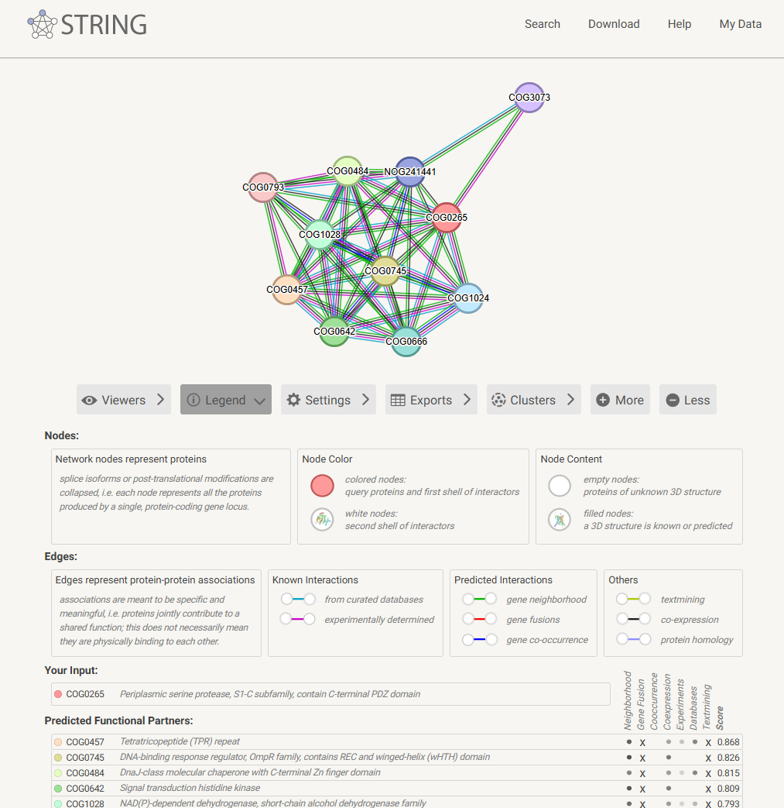

- STRING also suggests the ORFs have potential relationships or functional similarities among Tetratricopeptide (TPR) repeat, DNA-binding response regulator, OmpR family, contains REC and winged-helix (wHTH) domain, DnaJ-class molecular chaperone with C-terminal Zn finger domain, and Signal transduction histidine kinase, with the score level higher than 80.

- This suggests ORFs can have similarities or associations with the function of the families mentioned above, including TPR-like interactions to facilitate, stablize, regulate protein complexes in the host(22); interact with response regulators and facilitate regulations in gene expression(23); ensuring protein folding， protein quality control, and regulate chaperones to prevent protein aggregation(24); modulate histidine kinase to introduce adaptive responses via phosphorylation cascades(25)

- Here's the image for Obelisk 17 genome:

*Figure 9: Predicted Jupiter Plot of Obelisk 17 Genome(27), Coloring From Red to Green(low) Indicates Base-Pairing Confidence/Strongness*

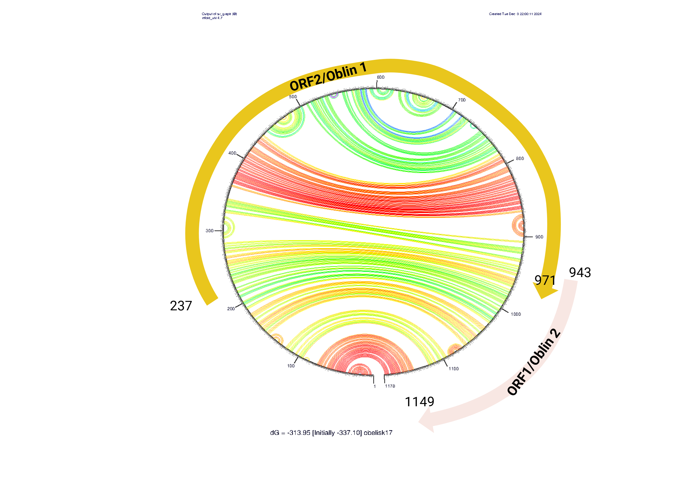

*Figure 10: Predicted Linear Representation of RNA Secondary Structure of Obelisk 17 With ORF regions And Free Engery Annotations*

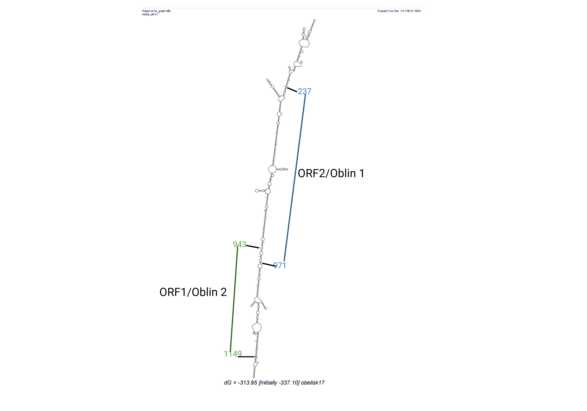

*Figure 11: Alignment of Obeliscus_Aquidurentis's Genome Sequence *

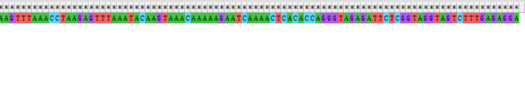

*Figure Legend*

The total length of the genome is 1173 nt, 391 aa. Only ATG start codons were included.

1.For ORF 1, incomplete CDS: The start position is at 943, and the stop position is at 1149."MKTNELKINKRLIFKPEGYTVAELRDCSLADLLFCDMLRELQRNLEPSKFKPKSLNTSKQKESKLTPG" is the amino acid sequence for the ORF. 68 aa, 207 nt.

2.For ORF 2, complete CDS: The start position is at 237, and the stop position is at 971. "MKMNRIYLPSQFDLMDVQGIEKQKSIALESFQEVDPSKTKISEADLFGTTLPEIEFRGTVLKSIRLRYTKKVKYITLVRFLTGKICFDSERVQRIDLLLIYDSMLILQDLVEKDENFKVKFGSDLESLAKILKSFKLHPKTKVLDVKKLGSQIEKEVPNFVLPKRNLSTIWKYVEKMYFFSPSTSSGVELKRLPPKLYLGKGYTDKGTARNPALDGSPSWQEVGQTLAFDPEEPVDENKRTKDK" is the amino acid sequence for the ORF. 244 aa, 735 nt.

3.There are overlaps between ORFs from 943 to 971. Suggest potential regulatory interactions, such as frameshifting or translational coupling(29).

4.There are evidence of poly-A tail at the 3' end of the sequence which can be observed from Figure 11.

5.In Figure 9, high interaction density regions (red and yellow) indicates conserved motifs, especially from 400,800;70, 1149. These hot spots could represents functional domains, including the motif of Oblin 1(multiple helices)that was discussed in the figure 2(panel B) in the paper.

6.Regions associated with ORF can have significant structural features, could serve as regulatory sites or binding sites(29).

7.In Figure 10, the arcs and loops illustrate the predicted base-pairing interactions, marked with annotations of the ORFs. ORF1/Oblin 2 has less stable regions comparing to ORF2/Oblin 1, with less loops and stems, which can indicate more flexibilities in the structure.The global free energy (ΔG = -313.95 kcal/mol) suggests a relatively high overall stability of the RNA secondary structure(29).

```
#[Using AI assistance from CHATGPT] to perform TPM / RPKM calculation and Coverage profile of reads(33)

# Install Bioconductor packages if not already installed
if (!requireNamespace("BiocManager", quietly = TRUE))
    install.packages("BiocManager")

BiocManager::install(c("Biostrings", "GenomicAlignments", "Rsamtools"))

library(Biostrings)#30
library(GenomicAlignments)#31
library(Rsamtools)#32

# Load the genome from the FASTA file
fasta_file <- "C:/Users/rjay1/Desktop/Obelisk_17_centroid.fasta"
genome <- readDNAStringSet(fasta_file)

# Define ORF positions
orf_positions <- list(
  ORF1 = c(start = 943, end = 1149),
  ORF2 = c(start = 237, end = 971)
)

# Simulate aligned reads (replace this with real BAM/SAM alignment later)
aligned_reads <- GRanges(
  seqnames = Rle("Obelisk_17"),
  ranges = IRanges(start = c(950, 960, 1000, 950, 940, 1010), end = c(955, 965, 1005, 955, 945, 1015))
)

# Count reads per ORF
read_counts <- sapply(orf_positions, function(pos) {
  sum(countOverlaps(aligned_reads, GRanges(seqnames = Rle("Obelisk_17"), 
                                           ranges = IRanges(start = pos["start"], end = pos["end"]))))
})

# Total mapped reads (simulate here, replace with actual alignment stats)
total_mapped_reads <- length(aligned_reads)

# Calculate RPKM
orf_lengths <- sapply(orf_positions, function(pos) {
  (pos["end"] - pos["start"] + 1) / 1000  # Length in kilobases
})
rpkm <- (read_counts / total_mapped_reads) / orf_lengths

# Calculate TPM
tpm <- (rpkm / sum(rpkm)) * 1e6

# Print results
results <- data.frame(
  ORF = names(orf_positions),
  Read_Counts = read_counts,
  Length_kb = orf_lengths,
  RPKM = rpkm,
  TPM = tpm
)

print(results)
```
8. RPKM (Reads Per Kilobase of transcript per Million mapped reads): Normalized read count considers the ORF length and the total number of mapped reads.
ORF1: 4.83 (higher expression).
ORF2: 0.91 (lower expression).
TPM (Transcripts Per Million): Normalized expression level based on the proportion of RPKM values within the genome.
ORF1: 841924.4, domination of the expression profile of this genome.
ORF2: 158075.6, less abundant.

Although ORF1 has shorter length, this is suggesting ORF1(Oblin 2) dominates the expression over ORF2(Oblin 1).

### Other sections

*Figure 12: AlphaFold3 Prediction and Conserved Regions Annotation Of ORF1(Potential Oblin2) and ORF2(Potential Obline1) *


- Conserved regions were circled and analysis on the prediction can be found above in observation and features, suggesting the potential functions of the them and how they are aligned with Oblin 1 and 2

- Exam potential protein-protein interactions between ORF2(Oblin 1) and host similar proteins suggested by STRING(16,18).#Only Oblin 1 is tested because it was mentioned in the paper that Oblin 1 has protease-like functions

1.*A0A3Q0KVE9 - Subfamily S1B unassigned peptidase (S01 family)	Schistosoma mansoni*
2.*FGIG_00265 - Subfamily S1B unassigned peptidase (S01 family)	Fasciola gigantica*
3.*ALJ27690.1 - Subfamily S1C unassigned peptidase	Stenotrophomonas acidaminiphila*
4.*Bxe_A1081 - Subfamily S1C, unassigned peptidase; Belongs to the peptidase S1C family.	Paraburkholderia xenovorans*
5.*BPSL0808 - Subfamily S1C unassigned peptidase; Similar to Pseudomonas aeruginosa serine protease MucD o [...]	Burkholderia pseudomallei*
6.*BPSL2433 - Subfamily S1C unassigned peptidase; Similar to Pseudomonas aeruginosa serine protease MucD S [...]	Burkholderia pseudomallei*
7.*RC62_819 - Peptidase, subfamily S1B unassigned peptidase	Flavobacterium aquidurense*

*Figure 13: AlphaFold3 Prediction of Interactions Between ORF2(Potential Oblin1) and A0A3Q0KVE9 - Subfamily S1B unassigned peptidase (S01 family)	Schistosoma mansoni *

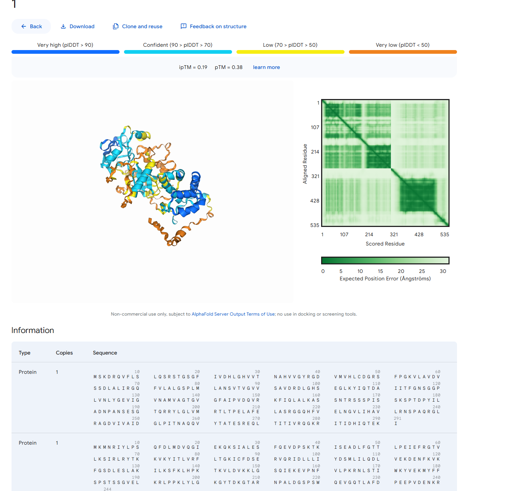

1. The interaction has lower confidence（0.38) comparing to the predictions on ORF2 alone, the multi alpha helices structure that suggests functional motif participates in interactions, suggesting potential binding with the peptidase.The scored residue suggests the interactions located mostly from 214 to 300, 350 to 450 position(36)

*Figure 14: AlphaFold3 Prediction of Interactions Between ORF2(Potential Oblin1) and FGIG_00265 - Subfamily S1B unassigned peptidase (S01 family)	Fasciola gigantica *

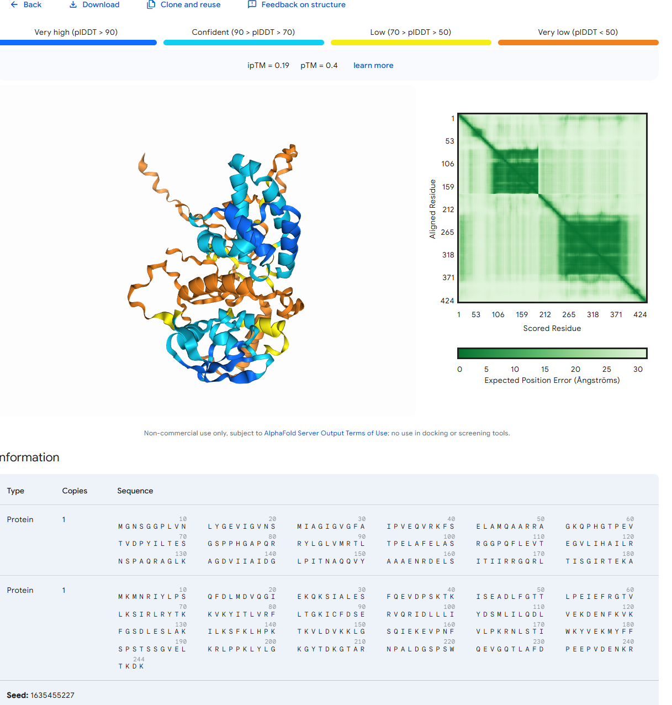

2. The interaction has lower confidence(0,4) comparing to the predictions on ORF2 alone, the multi alpha helices structure that suggests functional motif participates in interactions, suggesting potential binding with the peptidase.The scored residue suggests the interactions located mostly from 106 to 159, 265 to 371 position(37)

*Figure 15: AlphaFold3 Prediction of Interactions Between ORF2(Potential Oblin1) and ALJ27690.1 - Subfamily S1C unassigned peptidase	Stenotrophomonas acidaminiphila*

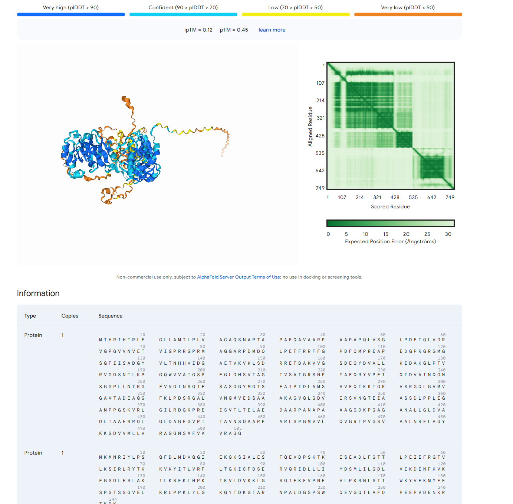

3. The interaction has lower confidence(0,45) comparing to the predictions on ORF2 alone, the multi alpha helices structure that suggests functional motif participates in interactions but it remains conserved with each others, suggesting potential binding with the peptidase.The scored residue suggests the interactions located mostly from 120 to 400, 428 to 535, 600 to 700 position(38)

*Figure 16: AlphaFold3 Prediction of Interactions Between ORF2(Potential Oblin1) and Bxe_A1081 - Subfamily S1C, unassigned peptidase; Belongs to the peptidase S1C family.	Paraburkholderia xenovorans*

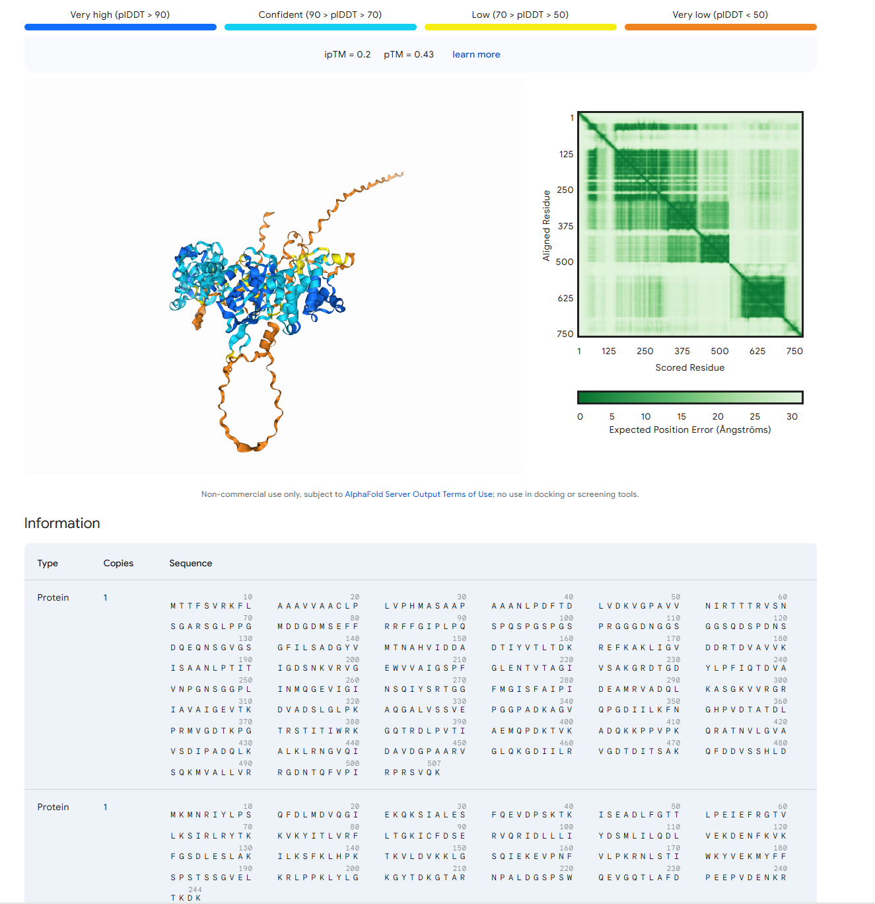

4. The interaction has lower confidence(0.43) comparing to the predictions on ORF2 alone, the multi alpha helices structure that suggests functional motif participates in interactions but it remains relatively conserved with each others, suggesting potential binding with the peptidase.The scored residue suggests the interactions located mostly from 150 to 300, 600 to 700 position(39)

*Figure 17: AlphaFold3 Prediction of Interactions Between ORF2(Potential Oblin1) and BPSL0808 - Subfamily S1C unassigned peptidase; Similar to Pseudomonas aeruginosa serine protease MucD o [...]	Burkholderia pseudomallei*

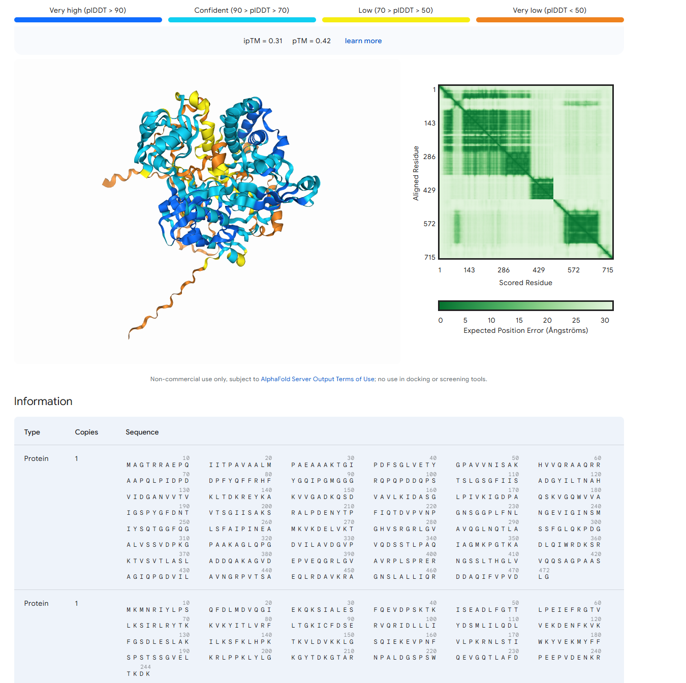

5. The interaction has lower confidence(0.42) comparing to the predictions on ORF2 alone, the multi alpha helices structure that suggests functional motif participates in interactions but it remains conserved with each others, suggesting potential binding with the peptidase.The scored residue suggests the interactions located mostly from 140 to 280, 572 to 700 position(40)

*Figure 18: AlphaFold3 Prediction of Interactions Between ORF2(Potential Oblin1) and BPSL2433 - Subfamily S1C unassigned peptidase; Similar to Pseudomonas aeruginosa serine protease MucD S [...]	Burkholderia pseudomallei*

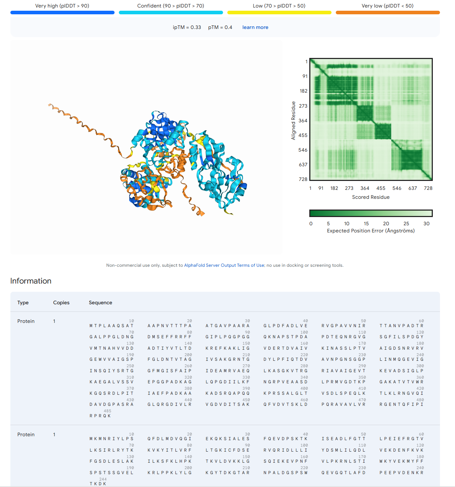

6. The interaction has lower confidence(0.4) comparing to the predictions on ORF2 alone, the multi alpha helices structure that suggests functional motif participates in interactions, suggesting potential binding with the peptidase.The scored residue suggests the interactions located mostly from 182 to 273,364 to 400, 410 to 455, 546 to 700 position(41)

*Figure 19: AlphaFold3 Prediction of Interactions Between ORF2(Potential Oblin1) and BPSL2433 - RC62_819 - Peptidase, subfamily S1B unassigned peptidase	Flavobacterium aquidurense*

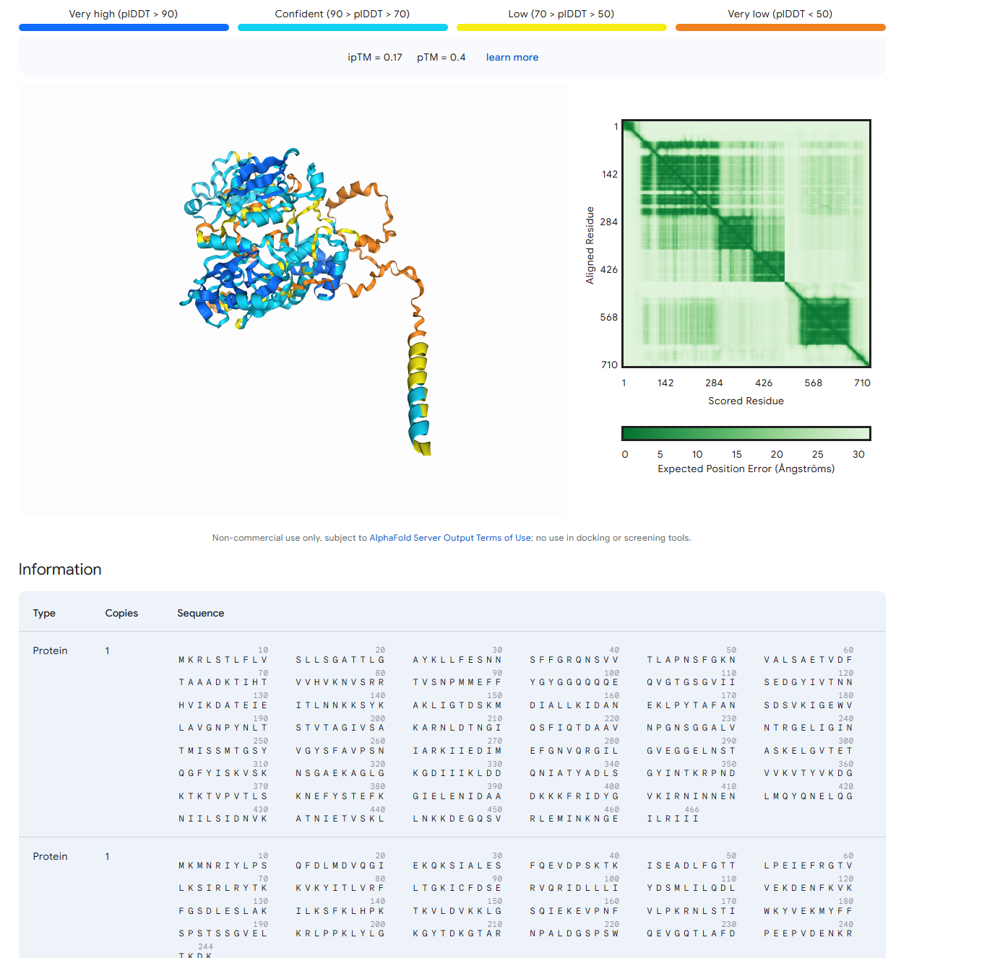

7.The interaction has lower confidence(0.4) comparing to the predictions on ORF2 alone, the multi alpha helices structure that suggests functional motif participates in interactions but it remains conserved with each others, suggesting potential binding with the peptidase.The scored residue suggests the interactions located mostly from 142 to 284,300 to 400, 400 to 426, 568 to 700 position(42)

- Ranking the potential interactions that can be done between OFR2 and peptidases: *3,4,5,6,7,2,1*
- Another phylogentic tree was generated between the ORF2 and the above peptidases, suggeting that the *RC62_819 - Peptidase, subfamily S1B unassigned peptidase	Flavobacterium aquidurense* is the most similar to the Oblin 1 considering evolutionarily.

*Figure 20: Aligment of ORF2(Potential Oblin 1) and All 7 Proteins(Suggested By STRING) Listed Above *

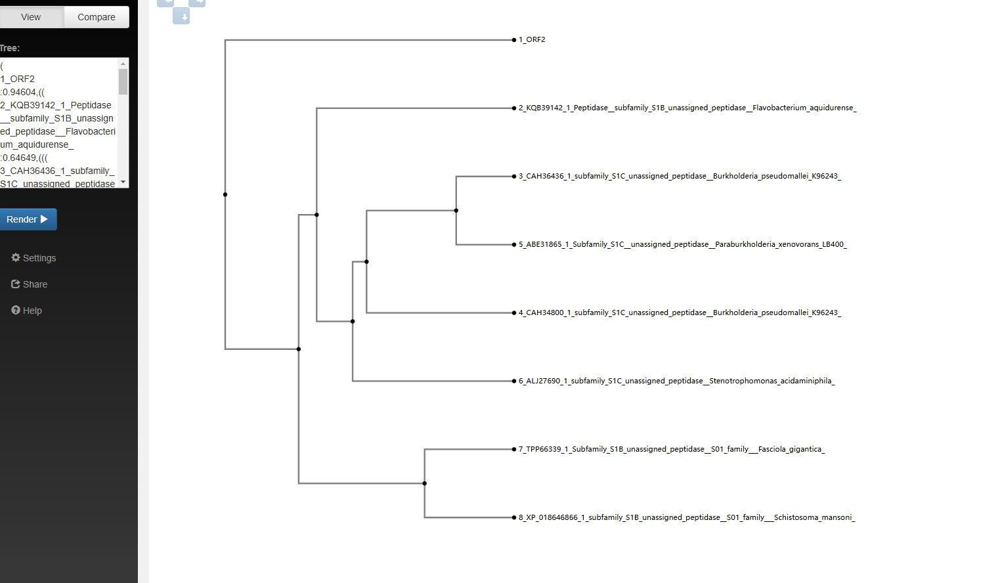

- Multiple sequence alignment of the Obelin sequence

Using MEGA11(28), the alignment was generated and phylogentic tree of all obelisk was visualized using MAFTT(34) 

*Figure 21: Multiple Sequence Alignment of Obelin Sequences From All Obelisks Using MEGA 11*

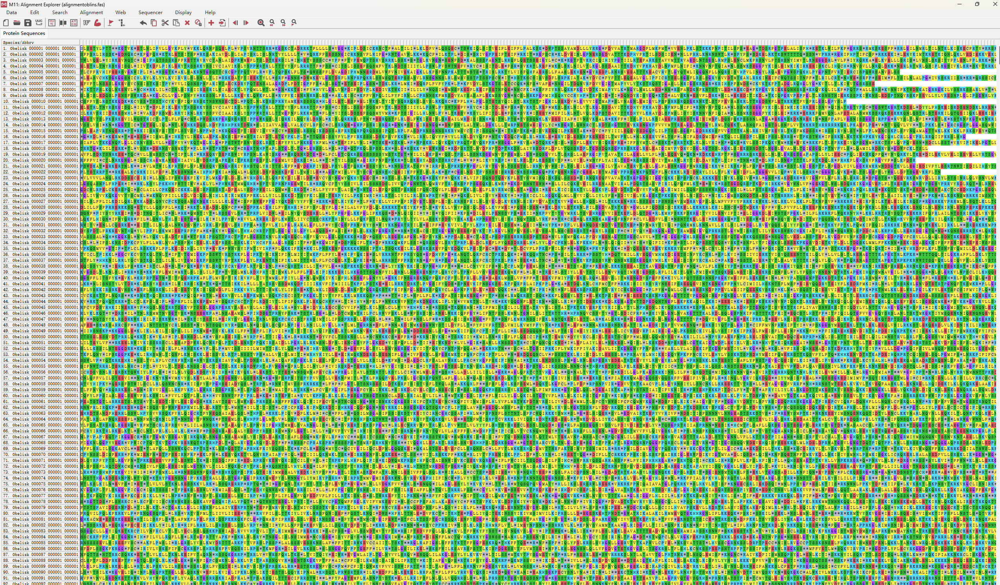

*Figure 22: Phylogentic Tree of Obelin Sequences From All Obelisks, Focus on Obelisk 17 Using MAFTT*

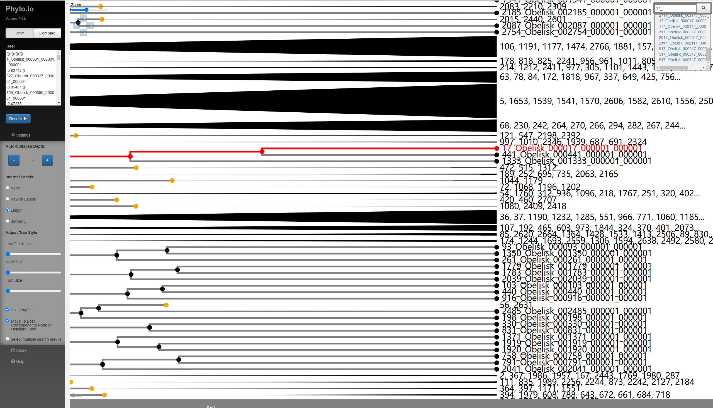

The closest obelisk on the visualizaiton are 441, and 1333. Going back to the excel file,it was checked that Obelisk 441 was 1171 and for 1333, the number is 852, which are relatively close to the average length of obelisk 17, 1177.The Obelisk 441's SRA cannot be found. The Obelisk 1333 was found in Actinidia arguta(38), which has relatively minmum associations.

- I-TASSER Prediction Results

*Figure 23: High Confidence Structural Prediction on ORF2 Using I-TASSER with Similarity to PDB Entry 4YXXA*

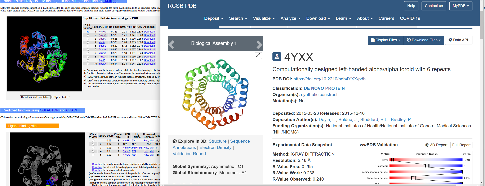

Using the I-TASSER tool provided by Zhang's lab, more detailed and confidential predictions on the structure of ORF2(Oblin1) was provided(43,44,45).
I-TASSER compares the query protein's predicted structure to known structures in Protein Data Bank and suggests that the ORF2 conserved region constructured based on multiple alpha helices which was also mentioned in the AlphaFold3 predictions(15,16).
The prediction result shows high confidence(TM-score 0.745, usually over 0.5 means high confident) with the hit *4YXXA*, suggesting structural and functional similarity(43,44,45).

*Figure 24: Moderate Confidence Structural Prediction on ORF2 Using I-TASSER with Similarity to PDB Entry 5GWNA*

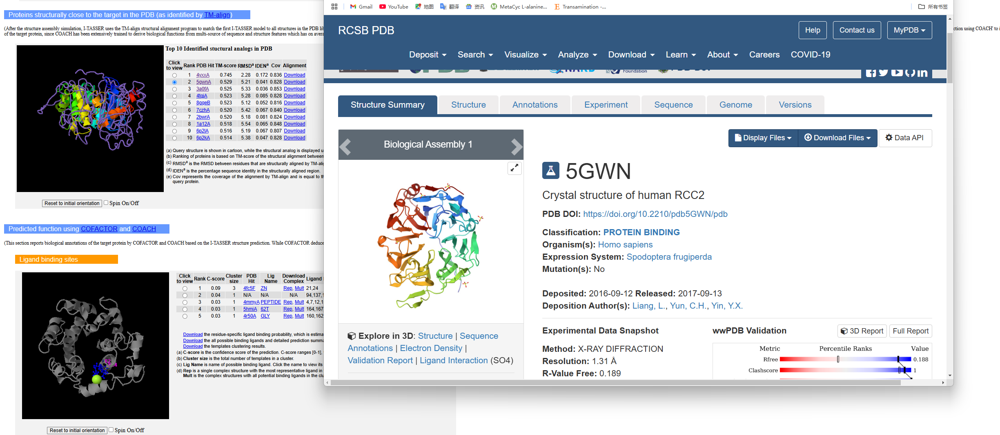

Meanwhile, the second hit(5GWNA) with moderate confidence(0.529 TM-score) suggests potential beta sheet structure of the ORF2(Oblin 1), which also align with the findings in the papter(16)(43,44,45). The Oblin 1 protein structurally includes both alpha heclies and beta sheets(15,43,44,45).

*Figure 25: Ligand and Active Binding Site Predictions for ORF2 (Oblin 1) Using I-TASSER with Suggestions on Zinc Derivatization and Enzymatic Function in Glycan Metabolism*

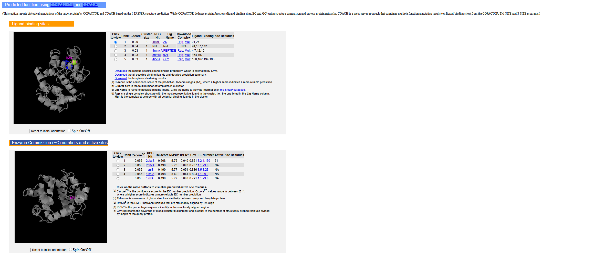

Then, the predictions also provide information on ligand binding sites(K24,E21) for Zn and active binding site(L61), both with moderate confidence level(0.09 C score, and 0.508 TM-score)(43,44,45). The ligand binding of Zn could supports Zinc derivatization, and this can
suggests binding sites for metal and structural stability(43,44,45). Also, the active binding site on L61 with EC number 3.2.1.150 indicates that the structure of ORF2(Oblin 1)can facilitate *Flavobacterium aquidurense* in the function of polysaccharide degradation.
EC number 3.2.1.150 means oligoxyloglucan reducing-end cellobiohydrolase which suggests the function of hydrolysis of cellobiose from the reducing end of xyloglucans. This enzymatic function highlights ORF2's potential role in glycan metabolism, specifically targeting complex polysaccharides for degradation, which aligns with *Flavobacterium aquidurense*'s role.(43,44,45,46).

*Figure 26: Gene Ontology Predictions for ORF2 (Oblin 1) Using I-TASSER with Potential Involvement in Histone Binding, Mitotic Nuclear Division, and Cell Cycle*

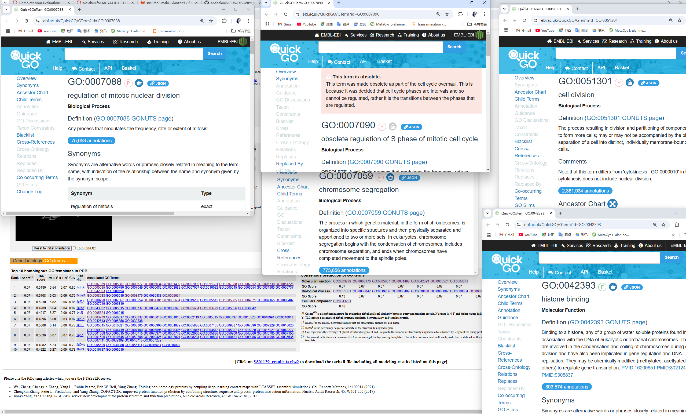

Finally, few Gene Ontology (GO) predictions support the earlier findings that ORF2(Oblin 1) participates in histone binding, regulating gene expression by involving in mitotic nuclear division, S phase of the mitotic cell cycle, cell division, etc(43,44,45).

## Discussion

The characterization of Obelisk 17 has interesting biological insights based on its characteristics of genome and ecological role. Obelisk 17 involves in microbial community dynamics potential was highlighted by its existence in wastewater environments. Through taxonomy analysis, codon usage analysis and k-mer analysis, phylogentic analysis, protein-protein interactions prediction and analysis, the results help to confirm that the most possible hosts *Flavobacterium aquidurense* suggests a potential functional connection that involves participating in the breakdown of polysaccharides. This suggests that Obelisk 17 may influence host metabolic processes. In terms of genome, structure and functions, Obelisk 17 has 2 ORFs, which moderately matches with the oblin 1 and oblin 2 protein that was mentioned in the paper after performing multiple comuptational experiments(15). More interestingly, the two ORFs have overlaps from 943 to 971, suggesting potential regulatory mechanisms, such as frameshifting or translational coupling. Also, after performing TPM/RPKM analysis to the ORFs, the result showed that ORF1 (943-1149, 66 amino acids) tends to have higher expression than ORF2 (237-971, 244 amino acids, it has conserved alpha-helices identified in structural predictions align with oblin's functional motifs) after normalization, despite the shorter length of sequence. STRING also suggested a lot of proteins that displays functional similarities or potential interactions with the ORFs, among the 7 suggested proteins, they are all peptidase which is closely related to protease(the suggested function of Oblin 1 in the paper, peptidase is a kind of protease). Phylogentic analysis on ORFs and similar protein families with the ORFs also suggests that *RC62_819 - Peptidase, subfamily S1B unassigned peptidase	Flavobacterium aquidurense* is the closest to the Obelisk 17 on evolutionary perspective, which confirms the functional similarity between ORF2(Oblin 1) and protease. Also, STRING has suggested ORFs' potential participation in protein degradation and quality control, remodelling cell wall and biofilm, regulating protein complexes in the host, facilitate regulations in gene expression, etc. The fascinating traits about obelisk 17 includes the overlap of ORFS from 943 to 971 which needs further experiments and investigations, while the dominance of ORF1(Oblin 2) expression is also interesting considering it has shorter sequence length comparing to ORF2(Oblin 1). In conclusion, Obelisk 17 is a possible regulator in microbial communities especially in envirnoment like wasterwater, by regulating host metabolic processes(protein degradation, quality control, facilitating gene expression, etc). These findings has boardened the information of obelisks but the ORF overlaps, increased expression of ORF1, interaction with proteases, potential role inpolysaccharide degradation processes, and other significances require further research for confirmation.

## References

1.European Nucleotide Archive (ENA). Sequence Read Archive: ERR2088990. BioProject: PRJEB22087. Available at: https://www.ncbi.nlm.nih.gov/bioproject/PRJEB22087 (Accessed: 2 December 2024).

2.National Center for Biotechnology Information (NCBI). BioProject: PRJNA230567. Available at: https://www.ncbi.nlm.nih.gov/bioproject/PRJNA230567 (Accessed: 2 December 2024).

3.National Center for Biotechnology Information (NCBI). Sequence Read Archive: SRR9002437. BioProject: PRJNA230567. Available at: https://www.ncbi.nlm.nih.gov/sra/SRR9002437 (Accessed: 2 December 2024).

4.Charif D, Lobry J (2007). “SeqinR 1.0-2: a contributed package to the R project for statistical computing devoted to biological sequences retrieval and analysis.” In Bastolla U, Porto M, Roman H, Vendruscolo M (eds.), Structural approaches to sequence evolution: Molecules, networks, populations, series Biological and Medical Physics, Biomedical Engineering, 207-232. Springer Verlag, New York. ISBN : 978-3-540-35305-8.

5.Pagès H, Aboyoun P, Gentleman R, DebRoy S (2024). Biostrings: Efficient manipulation of biological strings. R package version 2.74.0, https://bioconductor.org/packages/Biostrings.

6.Takami, H., Atmosphere and Ocean Research Institute, The University of Tokyo. Genome assembly ASM3707634v1 (Haloferula helveola, strain CN-1). NCBI Datasets. Available at: https://www.ncbi.nlm.nih.gov/datasets/genome/GCF_037076345.1/ (Accessed: 2 Dec. 2024).

7.NCBI Genomes. Flavobacterium aquidurense (Genome assembly ASM1652v1). Available at: https://www.ncbi.nlm.nih.gov/datasets/genome/GCF_000016525.1 (Accessed: 2 Dec. 2024)

8.NCBI Genomes. Methanobrevibacter smithii ATCC 35061 (Genome assembly ASM1652v1). Available at: https://www.ncbi.nlm.nih.gov/datasets/genome/GCF_000016525.1/ (Accessed: 2 Dec. 2024).

9.NCBI Genomes. Escherichia coli str. K-12 substr. MG1655 (Genome assembly ASM584v2). Available at: https://www.ncbi.nlm.nih.gov/datasets/genome/GCF_000005845.2/ (Accessed: 2 Dec. 2024).

10.NCBI Genomes. Chitinophaga pinensis DSM 2588 (Genome assembly ASM2400v1). Available at: https://www.ncbi.nlm.nih.gov/datasets/genome/GCF_000024005.1/ (Accessed: 2 Dec. 2024).

11.NCBI Genomes. Flavobacterium johnsoniae UW101 (Genome assembly ASM1664v1). Available at: https://www.ncbi.nlm.nih.gov/datasets/taxonomy/376686/ (Accessed: 2 Dec. 2024).

12.Cousin, S., Pauker, O., & Stackebrandt, E. Flavobacterium aquidurense sp. nov. and Flavobacterium hercynium sp. nov., from a hard-water creek. Int. J. Syst. Evol. Microbiol. 57, 243–249 (2007). https://doi.org/10.1099/ijs.0.64556-0

13.Bernardet, J. F., Segers, P., Vancanneyt, M., Berthe, F., Kersters, K., & Vandamme, P. Cutting a Gordian knot: Emended classification and description of the genus Flavobacterium, emended description of the family Flavobacteriaceae, and proposal of Flavobacterium hydatis nom. nov. (Basonym, Cytophaga aquatilis Strohl and Tait 1978). Int. J. Syst. Evol. Microbiol. 46, 128–148 (1996).

14.NCBI ORF Finder. Available at: https://www.ncbi.nlm.nih.gov/orffinder/ (Accessed: 2 December 2024).

15.Zheludev, I. N., Edgar, R. C., Lopez-Galiano, M. J., de la Peña, M., Babaian, A., Bhatt, A. S., & Fire, A. Z. Viroid-like colonists of human microbiomes. Cell 187, 6521–6536.e18 (2024). https://doi.org/10.1016/j.cell.2024.09.033

16.AlphaFold Protein Structure Database. DeepMind. Available at: https://alphafoldserver.com/. Accessed on 3 December 2024.

17.Stephen F. Altschul, Thomas L. Madden, Alejandro A. Schäffer, Jinghui Zhang, Zheng Zhang, Webb Miller, and David J. Lipman (1997), "Gapped BLAST and PSI-BLAST: a new generation of protein database search programs", Nucleic Acids Res. 25:3389-3402.

18.Szklarczyk D, Kirsch R, Koutrouli M, Nastou K, Mehryary F, Hachilif R, Annika GL, Fang T, Doncheva NT, Pyysalo S, Bork P‡, Jensen LJ‡, von Mering C‡.The STRING database in 2023: protein–protein association networks and functional enrichment analyses for any sequenced genome of interest.Nucleic Acids Res. 2023 Jan 6;51(D1):D638-646.PubMed

19.Dong, S., Chen, H., Zhou, Q., & Liao, N. (2021). Protein degradation control and regulation of bacterial survival and pathogenicity: the role of protein degradation systems in bacteria. Molecular Biology Reports, 48(11), 7575–7585. https://doi.org/10.1007/s11033-021-06744-9

20.Lecker, S. H., Goldberg, A. L., & Mitch, W. E. (2006). Protein degradation by the ubiquitin–proteasome pathway in normal and disease states. Journal of the American Society of Nephrology, 17(7), 1807–1819. https://doi.org/10.1681/ASN.2006010083

21.Ramírez-Larrota, J. S., & Eckhard, U. (2022). An introduction to bacterial biofilms and their proteases, and their roles in host infection and immune evasion. Biomolecules, 12(2), 306. https://doi.org/10.3390/biom12020306

22.D'Andrea, L. D., & Regan, L. (2003). TPR proteins: the versatile helix. Trends in Biochemical Sciences, 28(12), 655–662. https://doi.org/10.1016/j.tibs.2003.10.007

23.Mitrophanov, A. Y., & Groisman, E. A. (2008). Signal integration in bacterial two-component regulatory systems. Genes & Development, 22(19), 2601–2611. https://doi.org/10.1101/gad.1700308

24.Dekker, S. L., Kampinga, H. H., & Bergink, S. (2015). DNAJs: more than substrate delivery to HSPA. Frontiers in Molecular Biosciences, 2, 35. https://doi.org/10.3389/fmolb.2015.00035

25.Stock JB, Ninfa AJ, Stock AM. 1989. Protein phosphorylation and regulation of adaptive responses in bacteria. Microbiol Rev 53:.https://doi.org/10.1128/mr.53.4.450-490.1989

26.Biorender.com. BioRender. [Online]. Available: https://biorender.com/. Accessed: December 3, 2024.

27.Markham, N. R., & Zuker, M. UNAFold: Software for nucleic acid folding and hybridization. Methods Mol. Biol. 453, 3–31 (2008). https://www.unafold.org/in-cites.html

28.Koichiro Tamura, Glen Stecher, and Sudhir Kumar (2021) MEGA11: Molecular Evolutionary Genetics Analysis version 11. Molecular Biology and Evolution 38:3022-3027

29.Sieber, P., Platzer, M., & Schuster, S. (2018). The Definition of Open Reading Frame Revisited. Trends in Genetics, 34(3), 167–170. https://doi.org/10.1016/j.tig.2017.12.009

30.Pagès H, Aboyoun P, Gentleman R, DebRoy S (2024). Biostrings: Efficient manipulation of biological strings. R package version 2.74.0, https://bioconductor.org/packages/Biostrings.

31.Lawrence M, Huber W, Pagès H, Aboyoun P, Carlson M, Gentleman R, Morgan M, Carey V (2013). “Software for Computing and Annotating Genomic Ranges.” PLoS Computational Biology, 9. doi:10.1371/journal.pcbi.1003118, http://www.ploscompbiol.org/article/info%3Adoi%2F10.1371%2Fjournal.pcbi.1003118.

32.Morgan M, Pagès H, Obenchain V, Hayden N (2024). Rsamtools: Binary alignment (BAM), FASTA, variant call (BCF), and tabix file import. R package version 2.22.0, https://bioconductor.org/packages/Rsamtools.

33.OpenAI. (2024). ChatGPT (December 2, 2024 version) [Large language model]. Retrieved from https://chat.openai.com/

34.Katoh, K., Misawa, K., Kuma, K., & Miyata, T. (2002). MAFFT: a novel method for rapid multiple sequence alignment based on fast Fourier transform. Nucleic Acids Research, 30(14), 3059–3066. https://doi.org/10.1093/nar/gkf436

35.National Center for Biotechnology Information. Sequence Read Archive, SRR12614749. Available at: https://www.ncbi.nlm.nih.gov/sra/?term=SRR12614749. Accessed on 2 Dec 2024.

36.National Center for Biotechnology Information (NCBI). (2024). Protein sequence XP_018646866.1, Subfamily S1B unassigned peptidase (S01 family), Schistosoma mansoni. Retrieved from https://www.ncbi.nlm.nih.gov/protein/XP_018646866.1?report=fasta

37.National Center for Biotechnology Information (NCBI). (2024). Protein sequence TPP66339.1, Subfamily S1B unassigned peptidase (S01 family), Fasciola gigantica. Retrieved from https://www.ncbi.nlm.nih.gov/protein/TPP66339.1?report=fasta

38.National Center for Biotechnology Information (NCBI). (2024). Protein sequence ALJ27690.1, Subfamily S1C unassigned peptidase, Stenotrophomonas acidaminiphila. Retrieved from https://www.ncbi.nlm.nih.gov/protein/ALJ27690.1?report=fasta

39.National Center for Biotechnology Information (NCBI). (2024). Protein sequence ABE31865.1, Subfamily S1C unassigned peptidase; Paraburkholderia xenovorans. Retrieved from https://www.ncbi.nlm.nih.gov/protein/ABE31865.1?report=fasta

40.National Center for Biotechnology Information (NCBI). (2024). Protein sequence CAH34800.1, Subfamily S1C unassigned peptidase, Burkholderia pseudomallei. Retrieved from https://www.ncbi.nlm.nih.gov/protein/CAH34800.1?report=fasta

41.National Center for Biotechnology Information (NCBI). (2024). Protein sequence CAH36436.1, Subfamily S1C unassigned peptidase, Burkholderia pseudomallei. Retrieved from https://www.ncbi.nlm.nih.gov/protein/CAH36436.1?report=fasta

42.National Center for Biotechnology Information (NCBI). (2024). Protein sequence KQB39142.1, Peptidase, subfamily S1B unassigned peptidase, Flavobacterium aquidurense. Retrieved from https://www.ncbi.nlm.nih.gov/protein/KQB39142.1?report=fasta

43.Wei Zheng, Chengxin Zhang, Yang Li, Robin Pearce, Eric W. Bell, Yang Zhang. Folding non-homology proteins by coupling deep-learning contact maps with I-TASSER assembly simulations. Cell Reports Methods, 1: 100014 (2021).

44.Chengxin Zhang, Peter L. Freddolino, and Yang Zhang. COFACTOR: improved protein function prediction by combining structure, sequence and protein-protein interaction information. Nucleic Acids Research, 45: W291-299 (2017).

45.Jianyi Yang, Yang Zhang. I-TASSER server: new development for protein structure and function predictions, Nucleic Acids Research, 43: W174-W181, 2015.

46.Yaoi K, Mitsuishi Y. Purification, characterization, cloning, and expression of a novel xyloglucan-specific glycosidase, oligoxyloglucan reducing end-specific cellobiohydrolase. J Biol Chem. 2002 Dec 13;277(50):48276-81. doi: 10.1074/jbc.M208443200. Epub 2002 Oct 8. PMID: 12374797.

# Viral Short Story
```
Lovecraftian Horror genre
[The outbreak started  unassumingly in the *wastewater* treatment plant nestled in a quiet *Switzerland* town, its humming machinery and acrid stench a nightly symphony for the unbothered]. [Ada Wesker, long accustomed to the rhythmic monotony of her shift, found comfort in the familiar—a grimy routine where the sludge of the world was tamed by human hands. But on this night, the ordinary became eldritch]. [From the depths of the aeration tank came a noise, alien and malevolent, a vibration that resonated not just in the machinery but in the marrow of Ada’s bones. It was a pulse, a heartbeat unbound by life, loud and insistent]. Ada leaned too much over the edge while trying to check on the tank,her curiosity a fatal flaw. Her boots slipped on the wet. She fell into the viscous mass in the tank. When her collegues pulled her out of the tank, she was whole but changed—an infection of the unseen. [By the hour, fever ravaged her, and her breath became wet, labored, and fetid with decay]. She was sent to the hospital. Doctors tried antibiotics, antivirals—everything they can—but nothing can help with her symptoms. The hospital lab received samples from the wastewater plant for analysis. The researchers discovered a mutated strain of the virus-like agent co-abundant with *ssRNA viruses*, Obelisk 17, which also is made up of *RNA elements and has rod-like secondary structures*. This Obelisk 17 mutant had done something unimaginable. It had mutated itself to grant its main hosts, *Candidatus Microthrix parvicella*, the ability to cause diseases. The microbial symbiosis of bacteria and virus had shifted into something that can target the human cardiac system and brain. Within days, Ada no longer spoke or recognized anyone. Her body, still alive, moved with purpose, but it was no longer her own.
[The infection spread swiftly. Workers fell ill, their afflictions spiraling into rage and hunger]. The researchers uncovered another horror: This Obelisk 17 mutant now can facilitated the spread of *antibiotic resistance genes*(ARGs) through the microbiome, rendering most antibiotics useless. [Meanwhile, Those infected became something else entirely—they were vessels, mindless predators, the line between life and death dissolved by the virus’s dark symphony].
[From the wastewater, the contagion seeped into reservoirs and rivers, silent and unseen]. [Towns fell, then cities. Switzerland became a necropolis, its heart Zurich transformed into a blighted epicenter, an echo of nightmares told in whispers]. The world watched as the infection overtook Europe, the United Nations and the European Union powerless against this.
[In the ruins of Zurich, a desperate plan took shape. A squad of elite soldiers ventured into the infected heart of the city, their mission to recover the vaccine designs left behind by the doomed scientists]. [The green mist of Obelisk 17 clung to the air, thick as dread, as the infected prowled like wolves]. What they sought was salvation, but what awaited them was revelation—a truth too terrible for mortal minds.
```