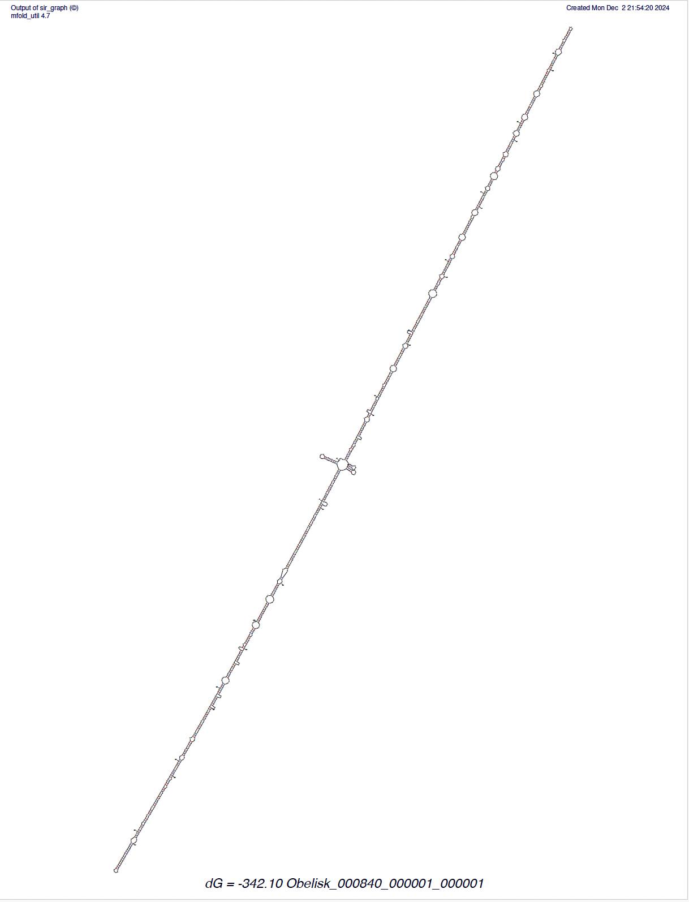
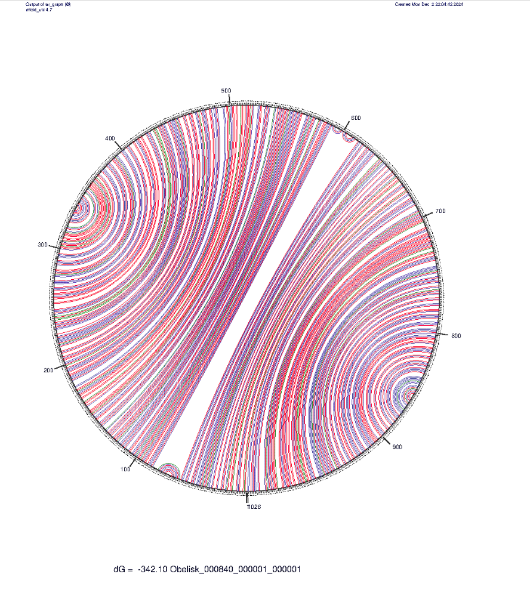
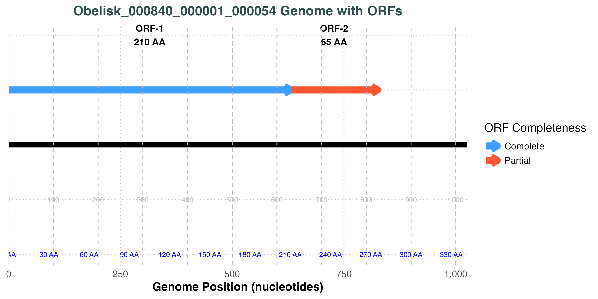
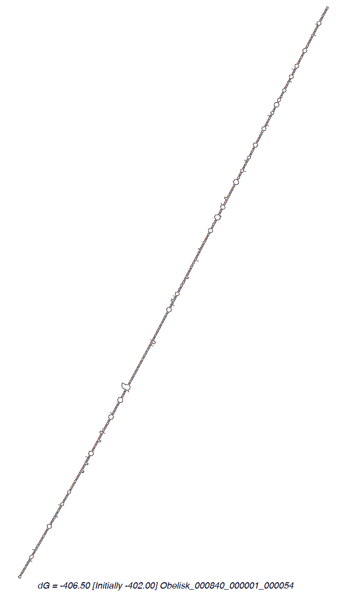
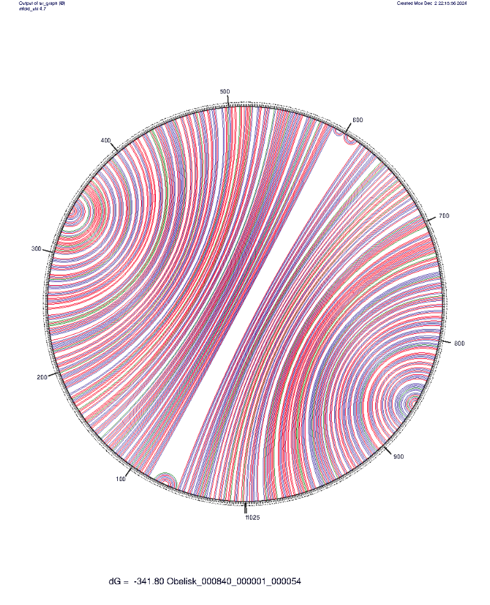
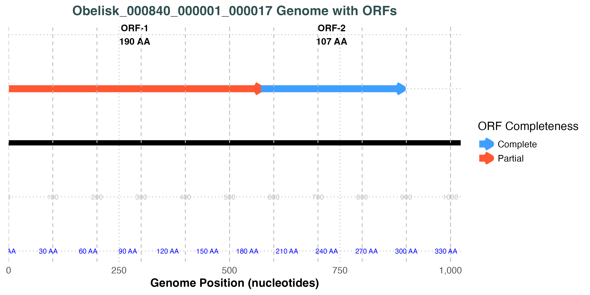
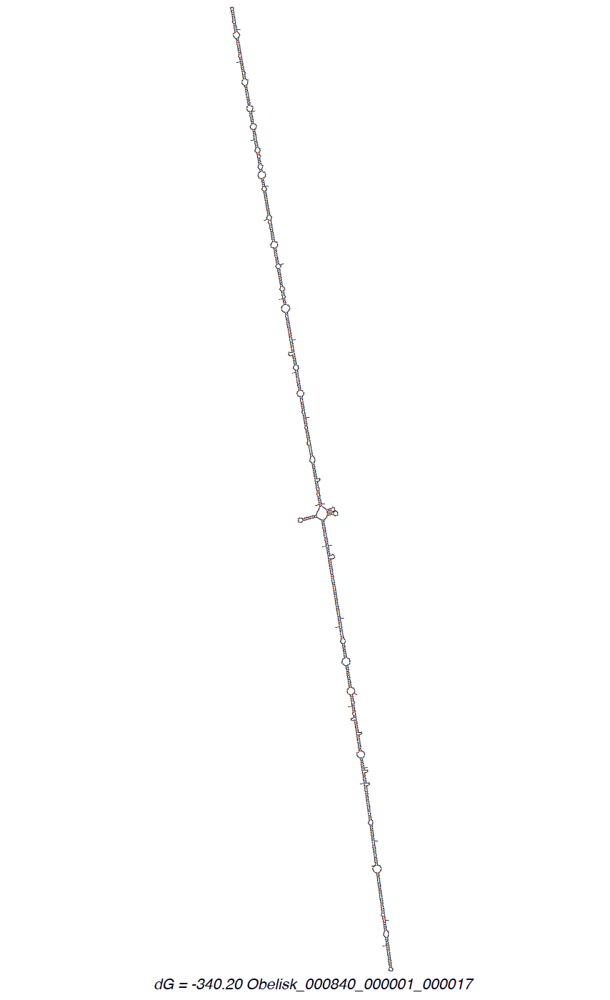
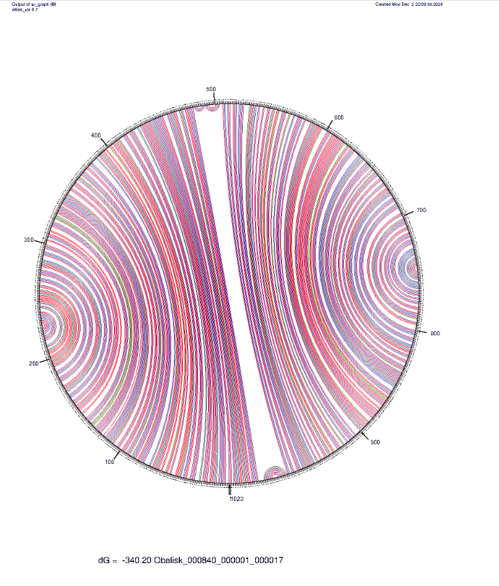
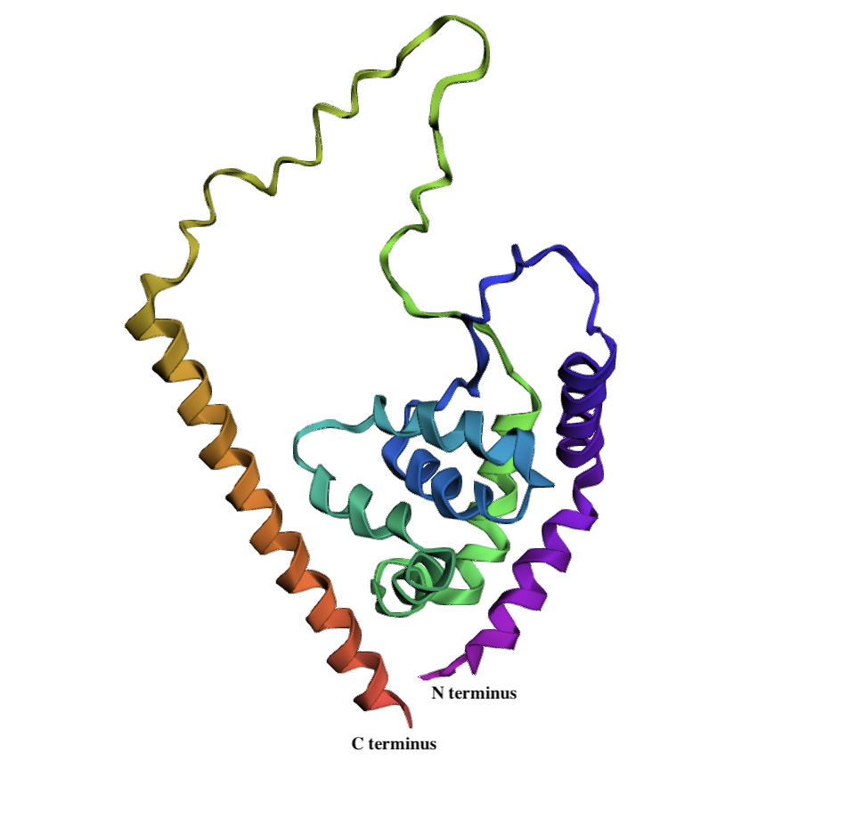

# Resilient Obelisk: Predicted Genomic and Consistent Compositional Features Across Ecological Niches

written by: [Yuxi Zhu](https://github.com/yuxizzz)

### Obeliscus faecalis

The name reflects the viroid’s significant prevalence in fecal-associated environments, including Macaca mulatta feces, human gut microbiomes, and wastewater metagenomes. The term “faecalis” highlights its ecological niche within gastrointestinal and waste-associated microbial ecosystems. Predicted genomic features, including ORFs and secondary structures, align with characteristics described in previously identified Obelisks, indicating consistency within this RNA family. The name ties the obelisk’s ecological specialization and genomic observations.

[Optional: Tutorial 2 Generative AI Cover-art](img/%3Cvirusname%3E/cover.png)

## Abstract

Obelisks are heritable circular RNA elements characterized by \~1 kb genome assemblies, rod-like secondary structures, and open reading frames encoding the novel "Oblin" protein superfamily. These RNAs are restricted to RNA datasets and have been identified in diverse ecosystems, with 29,959 distinct clusters of Obelisks previously reported [Zheludev et al., 2024].

Here we characterize a specific cluster, named Obeliscus faecalis, which exhibits predicted genomic features consistent with previously identified Obelisks, including a circular topology and rod-like secondary structures. This cluster maintains a high percent identity (\>96%) to its centroid genome and displays consistent GC content (44.35%–45.26%) and sequence lengths (1021–1026 nucleotides). These findings underscore the genomic stability of O. faecalis, despite its presence across human-associated, non-primate-associated, and environmental ecosystems.

Our results highlight the conserved structural and compositional features of Obeliscus faecalis and its persistence across diverse ecological contexts. These findings enhance our understanding of Obelisk biology and provide a foundation for future investigations into their ecological roles and evolutionary trajectories.

## Results

### Origins and Ecological Niches of the Obelisk Genome

The index case of the Obelisk genome comes from the study by Roume et al. (2015), which investigates microbial community-wide metabolic networks. This dataset (PRJNA230567) connects the Obelisk genome to wastewater metagenomes, emphasizing its ecological variety and adaptability.

The Obelisk genome spans 9 BioProjects across various ecosystems:

1.  Human Gut Microbiomes: PRJNA407499, PRJNA492158, PRJNA890008, and PRJEB62473, associated with studies by Zhang et al. (2018), de Nies et al. (2023), and Mitchell et al. (2020).
2.  Environmental Metagenomes: Wastewater and bioreactor samples, including PRJNA365462, PRJNA395784, and PRJNA230567 [Roume et al., 2015].
3.  Non-Human Primate Microbiota: PRJNA427715, from juvenile macaques with and without idiopathic chronic diarrhea (ICD), as reported by Westreich et al. (2019). PRJNA716119 is from pig gut microbiome. Only a single dataset (SRR14039825) within a multi-species microbiome bioproject was found with obelisk.

### Geographic Distribution and Sequencing Consistency

These datasets originate from six countries, including the United Kingdom, Luxembourg, China, Austria, Brazil, and the United States. Researchers used Illumina sequencing platforms (HiSeq and NextSeq), ensuring consistent technological methods across studies.

The Obelisk genome is detected in 49 datasets, predominantly from PRJNA427715 (35 datasets, Macaca mulatta). Other datasets include human gut microbiomes, pig fecal samples, and wastewater metagenomes. The shared presence of Obelisks across these distinct sample types suggests an association with gastrointestinal and waste-associated microbial environments.

### Ecological Categorization of Obelisk Genomes

Manual inspection of dataset origins categorizes the Obelisk genome into three ecological niches:

1.  Human-Associated Metagenomes: "Human gut metagenome," "Homo sapiens."
2.  Primate Gastrointestinal Systems: "Macaca mulatta," "gut metagenome."
3.  Environmental Metagenomes: "Wastewater metagenome," "bioreactor metagenome."

These niches reveal the adaptability of Obelisk genomes to diverse microbial habitats. Despite high sequence similarity within this cluster, Obelisks occur in geographically distinct locations, reflecting their resilience and widespread distribution.

### Hypotheses and Methodological Approaches

The datasets link Obelisk genomes to waste-associated microbial environments, with a strong representation in monkey feces (Macaca mulatta). This trend suggests that primates may serve as reservoirs, facilitating Obelisk transmission through environmental pathways (inconclusive).

We hypothesize that the Obelisks in this cluster, Obeliscus faecalis, resemble previously characterized Obelisks in their structure, genomic organization, and functional potential. To test this hypothesis, we will use tools like Prodigal for open reading frame (ORF) prediction, mFold for RNA secondary structure analysis, and BLASTn and InterPro to query the ORFs and confirm their identity. Consistent results with prior findings would support this hypothesis. To further explore the ecological and compositional diversity of the Obelisk genome, we propose using quantifiable metrics such as GC content, alignment scores (comparing sequences to the index/centroid Obelisk genome), and average sequence length. These metrics allow us to measure variation across ecological groups and evaluate genomic characteristics within and between datasets. We hypothesize that the Obelisk genome exhibits compositional differences across "non-human-primate-feces," "environmental," and "human-associated" metagenomes. Specifically, we propose that GC content, alignment scores, and sequence length differ significantly between human-associated and non-human-primate-feces metagenomes, as well as between environmental and human-associated datasets. To test these hypotheses, we will compare these metrics across ecological groups, with null hypotheses assuming no differences and alternative hypotheses predicting significant variations. Due to high abundance of samples from macaque feces biosamples, additionally, we hypothesize that Obelisk sequences from macaques with idiopathic chronic diarrhea (ICD) differ from those in healthy controls. By analyzing GC content, alignment scores to a centroid genome, and sequence length, we aim to detect any significant compositional or structural differences between these groups. This comprehensive approach allows us to investigate the genomic and ecological variability of Obelisks using a suite of robust statistical and bioinformatic tools.

```         
Figure 1.1: Index Obelisk Genome Visualization (Obeliscus faecalis 
Obelisk_000840_000001_00001)

The linearized genome of Obeliscus faecalis Obelisk_000840_000001_00001 (~1023 
nucleotides) is shown, with predicted open reading frames (ORFs) annotated 
based on Prodigal analysis. Complete ORFs are represented in blue, while 
partial ORFs are shown in red. ORF-1 encodes a 210-amino-acid protein and is 
complete, while ORF-2 encodes a truncated 65-amino-acid protein. The black 
line depicts the full genome length, and nucleotide coordinates are displayed 
along the x-axis. Amino acid scales corresponding to the ORFs are provided 
below the genome. While Obelisks are circular in structure, the genome is 
presented in linear form for clarity and to highlight the precise positions of 
ORFs (similar conventions apply to Figures 2.1 and 2.2). This visualization 
underscores the conserved genomic organization and protein-coding potential of 
O. faecalis.
```


```         
Figure 1.2: Secondary Structure Prediction of Obeliscus faecalis 
(Obelisk_000840_000001_000001)

The predicted secondary structure of the Obeliscus faecalis genome 
(Obelisk_000840_000001_000001) is shown, generated using the Mfold web server 
with the complete nucleotide sequence. The structure prominently exhibits the 
signature rod-like topology characteristic of Obelisks. The predicted free 
energy (ΔG) of folding is -342.10 kcal/mol, indicating a highly stable 
conformation. This visualization highlights the conserved structural features 
of the Obelisk genome, reinforcing its classification within this unique RNA 
element family. 
```

{width="666"}

```         
Figure 1.3: Jupitor Plot of Obeliscus faecalis (Obelisk_000840_000001_000001)

The Jupitor plot visualizes the predicted secondary structure of Obeliscus 
faecalis (Obelisk_000840_000001_000001), generated using the Mfold web server. 
This plot illustrates base-pairing probabilities across the genome, with the 
circular layout emphasizing the folding interactions. The structure 
prominently exhibits a high-probability rod-like secondary configuration, 
consistent with the hallmark topology of Obelisks. The genome’s stability is 
supported by the calculated free energy (ΔG = -342.10 kcal/mol). This 
representation highlights the intricate folding dynamics and structural 
integrity of O. faecalis, reinforcing its classification within the Obelisk 
RNA family.
```



```         
Figure 2.1 Human-Associated Obelisk Genome Visualization (Obeliscus faecalis, 
Obelisk_000840_000001_000054)

The linear genome (~1023 nucleotides) of Obeliscus faecalis 
Obelisk_000840_000001_000054 is shown, with Prodigal-predicted ORFs annotated. 
ORF-1 (blue) encodes a 210-amino-acid complete protein, while ORF-2 (red) 
encodes a truncated 65-amino-acid protein. The x-axis represents nucleotide 
coordinates, with an amino acid scale below. Although Obelisks are circular, 
this linear visualization highlights the ORF locations.
```



```         
Figure 2.2 Secondary Structure Prediction of Human-Associated Obeliscus 
faecalis (Obelisk_000840_000001_000054)

The secondary structure of Obelisk_000840_000001_000054, predicted using 
Mfold, reveals the signature rod-like topology of Obelisks. The folding has a 
calculated free energy (ΔG) of -406.50 kcal/mol, indicating high stability.
```



```         
Figure 2.3 Jupitor Plot of Human-Associated Obeliscus faecalis 
(Obelisk_000840_000001_000054)

The Jupitor plot shows base-pairing probabilities across the genome of 
Obelisk_000840_000001_000054, emphasizing its stable rod-like secondary 
structure (ΔG = -406.50 kcal/mol). The circular layout highlights conserved 
folding interactions characteristic of Obelisks.
```



```         
Figure 3.1 Monkey-Feces-Associated Obelisk Genome Visualization (Obeliscus 
faecalis, Obelisk_000840_000001_000017)

The linear genome (~1021 nucleotides) of the monkey-feces-associated Obeliscus 
faecalis (Obelisk_000840_000001_000017) is shown, with ORFs predicted by 
Prodigal. ORF-1 (red) encodes a truncated 190-amino-acid protein, while ORF-2 
(blue) encodes a complete 107-amino-acid protein. The x-axis represents 
nucleotide coordinates, with the amino acid scale displayed below. This linear 
representation highlights ORF locations while adhering to conventions used for 
other Obelisks.
```



```         
Figure 3.2: Secondary Structure Prediction of Monkey-Feces-Associated 
Obeliscus faecalis

The secondary structure prediction for Obelisk_000840_000001_000017, generated 
using Mfold, displays the characteristic rod-like topology of Obelisks. The 
structure is stable, with a predicted folding free energy (ΔG) of -340.20 
kcal/mol.
```



```         
Figure 3.3: Jupitor Plot of Monkey-Feces-Associated Obeliscus faecalis

The Jupitor plot illustrates the base-pairing probabilities for 
Obelisk_000840_000001_000017, reinforcing its rod-like secondary structure. 
The circular layout emphasizes conserved folding interactions, with a 
calculated free energy (ΔG) of -340.20 kcal/mol, highlighting its genomic 
stability and structural conservation.
```



```         
Figure 4: AlphaFold2 Predicted Protein Structure of Oblin-1 (ORF-1) in 
Obeliscus faecalis (Obelisk_000840_000001_000001)

The structure of Oblin-1, the protein encoded by ORF-1 of the index Obeliscus 
faecalis genome (Obelisk_000840_000001_000001), is depicted as predicted by 
AlphaFold2. The model reveals a conserved structural motif comprising a 
three-alpha-helical bundle (two smaller helices coaxially aligned along a 
larger helix) that wraps around a semi-orthogonal four-alpha-helical bundle. 
The structure is stabilized by a two-stranded beta-sheet clasp at the termini. 
The N- and C-termini are labeled for orientation, highlighting the protein's 
overall topology and conserved features.
```



## Discussion

This study characterizes a novel cluster of Obelisks, Obeliscus faecalis, uncovering conserved genomic traits and exploring ecological differences that refine our understanding of this enigmatic RNA element. The findings validate key aspects of the initial hypotheses, emphasizing the genomic stability of the cluster while assessing the limited ecological impact on its composition.

The Obelisk cluster exhibits several conserved genomic features consistent with previously described Obelisks, reinforcing the hypothesis that members of this cluster resemble known Obelisks in structure and function. Genome lengths consistently range between 1021 and 1026 nucleotides, and secondary structure predictions confirm the characteristic circular RNA topology with rod-like folding patterns. Open reading frame (ORF) analysis identifies two proteins (210 and 65 amino acids) arranged similarly to oblin-1 and oblin-2 proteins found in earlier studies [Zheludev et al., 2024]. Structural analysis using Alphafold2 further verifies the conserved alpha-helical bundle motif. The lack of significant matches for these ORFs in NCBI, Conserved Domain Database (CDD), and InterPro databases underscores the novelty of these proteins. As with previously defined Obelisks, this cluster highlights the distinct phylogenetic nature of Obelisks as a unique class of RNA elements.

Ecological groupings introduce minor compositional variability, particularly in GC content, but these differences lack biological significance due to the cluster's high percent identity (\>96%) to the centroid genome and consistent GC content (44.35%–45.26%) (moderate). While human-associated and environmental Obelisks exhibit slightly higher GC content than non-primate-associated Obelisks, the overall ranges remain narrow (high). However, the similarity in sequence length, GC content, and alignment scores between Macaca mulatta ICD and control feces samples indicates that the source of the feces does not influence genomic variability, reflecting the genomic stability of Obeliscus faecalis (moderate). The observed differences across ecological groups likely represent subtle variations rather than significant ecological divergence, highlighting the robustness of this RNA element across diverse environments.

This study defines Obeliscus faecalis as a new cluster of Obelisks with highly conserved traits and minimal compositional variability, consistent with previously described Obelisks [Zheludev et al., 2024]. These findings validate the hypothesis of genomic consistency while demonstrating the ecological breadth of O. faecalis. By emphasizing its resilience across varied habitats, this work underscores the importance of ecological context in shaping the persistence of Obelisks and provides a framework for future investigations into their evolutionary dynamics and ecological roles.

## References

Zhang, Y., Brady, A., Jones, C., Song, Y., Darton, T. C., Jones, C., Blohmke, C. J., Pollard, A. J., Magder, L. S., Fasano, A., Sztein, M. B., & Fraser, C. M. (2018). Compositional and functional differences in the human gut microbiome correlate with clinical outcome following infection with wild-type Salmonella enterica serovar Typhi. mBio, 9(3), e00686-18. <https://doi.org/10.1128/mBio.00686-18>

de Nies, L., Galata, V., Martin-Gallausiaux, C., et al. (2023). Altered infective competence of the human gut microbiome in COVID-19. Microbiome, 11, 46. <https://doi.org/10.1186/s40168-023-01472-7>

Mitchell, A. L., Almeida, A., Beracochea, M., Boland, M., Burgin, J., Cochrane, G., Crusoe, M. R., Kale, V., Potter, S. C., Richardson, L. J., Sakharova, E., Scheremetjew, M., Korobeynikov, A., Shlemov, A., Kunyavskaya, O., Lapidus, A., & Finn, R. D. (2020). MGnify: The microbiome analysis resource in 2020. Nucleic Acids Research, 48(D1), D570–D578. <https://doi.org/10.1093/nar/gkz1035>

Roume, H., Heintz-Buschart, A., Muller, E. E. L., May, P., Satagopam, V. P., Laczny, C. C., Narayanasamy, S., Lebrun, L. A., Hoopmann, M. R., Schupp, J. M., Gillece, J. D., Hicks, N. D., Engelthaler, D. M., Sauter, T., Keim, P. S., Moritz, R. L., & Wilmes, P. (2015). Comparative integrated omics: Identification of key functionalities in microbial community-wide metabolic networks. NPJ Biofilms and Microbiomes, 1, 15007. <https://doi.org/10.1038/npjbiofilms.2015.7>

Westreich, S. T., Ardeshir, A., Alkan, Z., et al. (2019). Fecal metatranscriptomics of macaques with idiopathic chronic diarrhea reveals altered mucin degradation and fucose utilization. Microbiome, 7, 41.<https://doi.org/10.1186/s40168-019-0664-z>

Zheludev, I. N., Edgar, R. C., Lopez-Galiano, M. J., de la Peña, M., Babaian, A., Bhatt, A. S., & Fire, A. Z. (2024). Viroid-like colonists of human microbiomes. Cell, 187(23), 6521–6536.e18. <https://doi.org/10.1016/j.cell.2024.09.033>

Hyatt, D., Chen, G. L., LoCascio, P. F., et al. (2010). Prodigal: Prokaryotic gene recognition and translation initiation site identification. BMC Bioinformatics, 11, 119. <https://doi.org/10.1186/1471-2105-11-119>

Mirdita, M., Schütze, K., Moriwaki, Y., et al. (2022). ColabFold: Making protein folding accessible to all. Nature Methods, 19, 679–682. <https://doi.org/10.1038/s41592-022-01488-1>

Zuker, M. (2003). Mfold web server for nucleic acid folding and hybridization prediction. Nucleic Acids Research, 31(13), 3406–3415. <https://doi.org/10.1093/nar/gkg595>

Wang, J., et al. (2023). The conserved domain database in 2023. Nucleic Acids Research, 51(D), 384–388.

Altschul, S. F., Gish, W., Miller, W., Myers, E. W., & Lipman, D. J. (1990). Basic local alignment search tool. Journal of Molecular Biology, 215(3), 403–410. [https://doi.org/10.1016/S0022-2836(05)80360-2](https://doi.org/10.1016/S0022-2836(05)80360-2){.uri} BLAST: Basic Local Alignment Search Tool. (n.d.). National Center for Biotechnology Information (NCBI). Retrieved from <https://blast.ncbi.nlm.nih.gov/Blast.cgi>

Blum, M., Andreeva, A., Florentino, L. C., Chuguransky, S. R., Grego, T., Hobbs, E., Pinto, B. L., Orr, A., Paysan-Lafosse, T., Ponamareva, I., Salazar, G. A., Bordin, N., Bork, P., Bridge, A., Colwell, L., Gough, J., Haft, D. H., Letunic, I., Llinares-López, F., ... Bateman, A. (2024). InterPro: The protein sequence classification resource in 2025. Nucleic Acids Research. <https://doi.org/10.1093/nar/gkae1082>

# Viral Short Story

```         
In code-text; include your short story from Tutorial 2 here :)

The Case of the Resilient Obelisk

It was a cold night in the bustling city of Genopolis, the kind of night where secrets festered in the shadows and even the RNA strands didn’t talk. Detective Nick Centroid lit a cigarette and stared at the file spread across his desk. The headline read: **"Obeliscus faecalis – A Cluster in the Shadows."**

“This one’s tricky,” he muttered to himself, flipping through the pages. The **genome was consistently short, just 1021–1026 nucleotides long**—a perfect disguise for a troublemaker hiding in plain sight. But it wasn’t the size that bothered him. It was the places. This Obelisk had been spotted everywhere: **human guts, Macaca mulatta feces, and wastewater**. Nick had seen viruses turn up in all kinds of places, but something about this one didn’t sit right.

Nick turned the page. The diagrams stared back at him, cold and clinical. "Circular genome, rod-like folding pattern," he read aloud. This thing was **predictable, conserved, consistent**—no wild deviations or flairs. It moved methodically, like a professional. And yet, it had a knack for blending into its surroundings. He tapped a note: “GC content—**44.35%–45.26% across habitats**.” Nick had seen subtle shifts before, but this one barely wavered. "Stable as a poker face," he muttered.

A knock at the door interrupted his thoughts. In walked Professor Oblin, the expert who had first tipped him off about the case. “Centroid,” Oblin said, “I think we’ve cracked it. The thing doesn’t evolve in the wild; it’s just…consistent. No **matches in the Conserved Domain Database or InterPro**. It’s something new—something alien.”

Nick snuffed out his cigarette. “So, it’s not just hiding,” he said grimly. “It’s thriving.”

He grabbed his coat. The resilient Obelisk wasn’t just a case. It was a revelation. And Nick Centroid wasn’t about to let it slip into the shadows unnoticed.
```
