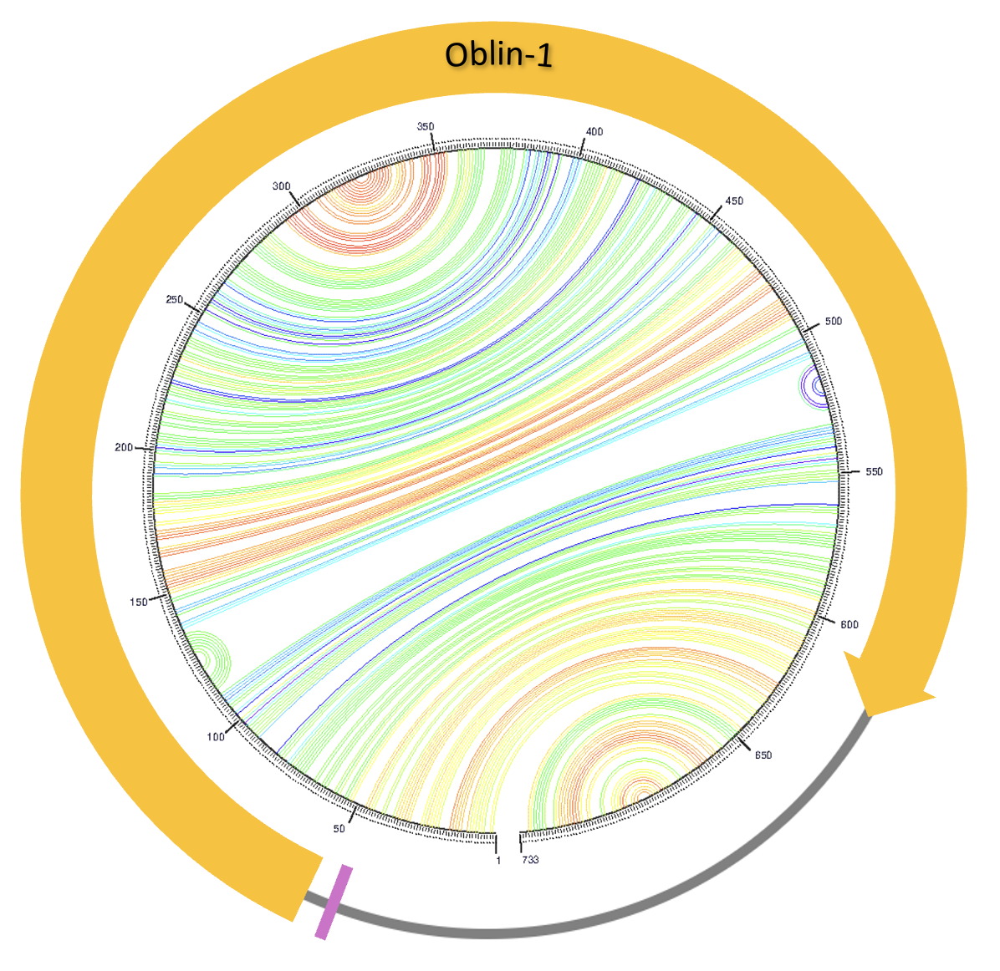
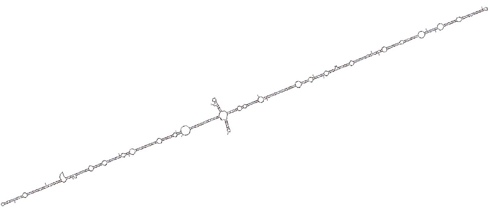
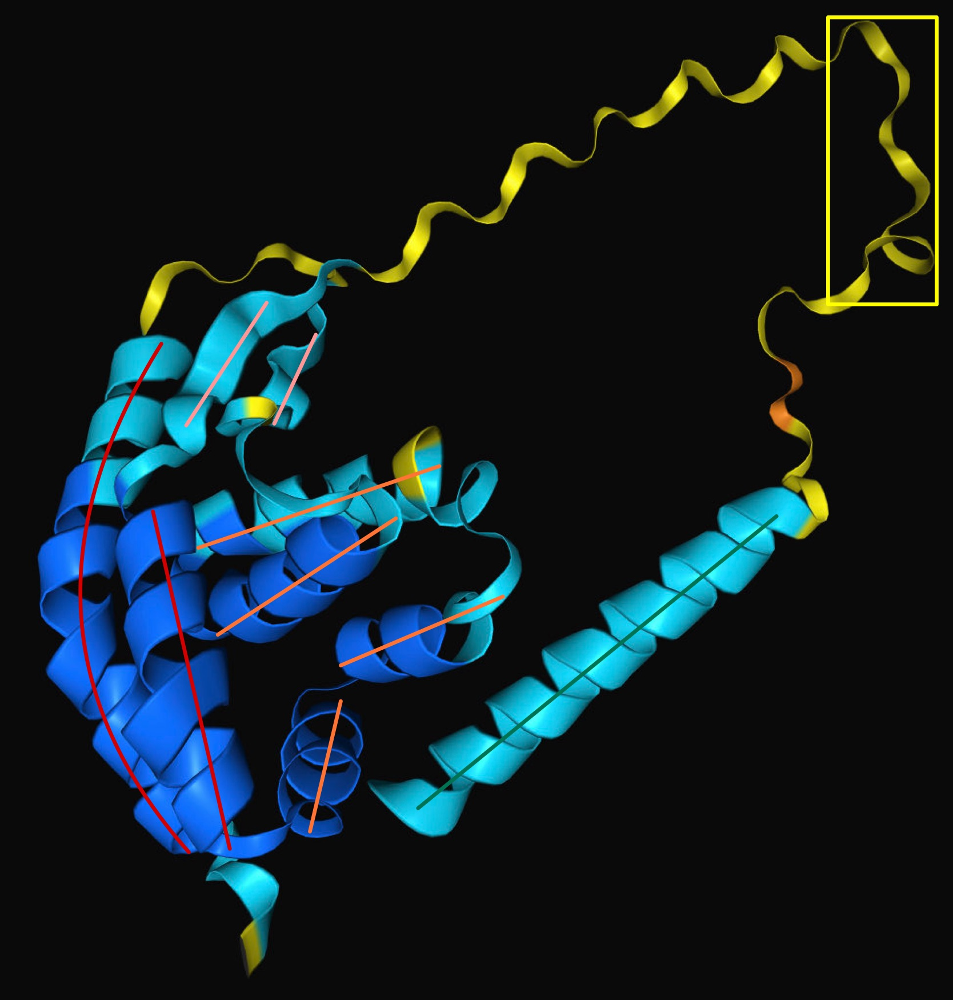
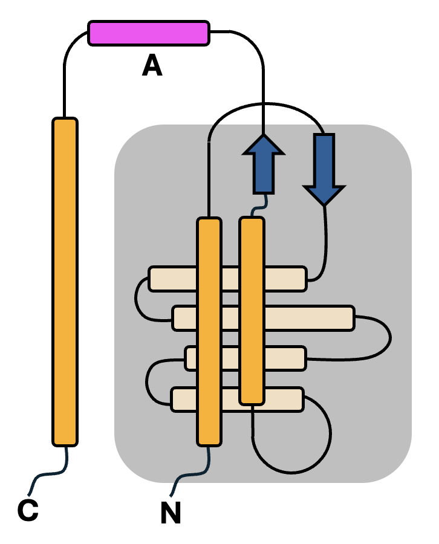

# _Obeliscus oris_: An Uncharacterised Circular RNA Encoding a Single Protein, Oblin-1
written by: [Isha Singh](https://github.com/its-isha-singh)

### _Obeliscus oris_
_Obeliscus oris_ translates to _obelisk of the mouth_. All samples containing the
obelisk (excluding one) were isolated from human oral-nasopharyngeal passages,
hence the name _Obeliscus oris_.


## Abstract

There are many types of small RNAs known to regulate different aspects of cellular
development in a wide variety of organisms. However, their complete biological
diversity is beyond the bounds of our knowledge. A recent study uncovered a new
class of circular viroid-like RNA molecules, termed obelisks, that are colonisers
of human microbiomes. These circular RNAs encode up to two proteins, termed Oblins,
that represent a novel class of never-before-known proteins. Although these obelisks
share some characteristics with hepatitis delta viruses (HDVs), they do not share
homology with any known organisms or viruses. While these RNA entities do not encode
a replication machinery, they are found to stably persist in human and other microbiomes.
A single obelisk-host pair of obelisk-_S.s_ and _Streptococcus sanguinis_ SK36 has
been identified. In this study we aim to characterise the nature of obelisks,
particularly _Obeliscus ortis_. We show that _Obeliscus ortis_ is a small, 733
nucleotide-long, circular RNA that encodes a single conserved protein, Oblin-1,
which has a unique secondary structure. This study validates the highly self-complementary
secondary structure of _Obeliscus oris_ previously determined in an independent study.
Furthermore, we demonstrate that the structure of Oblin-1 encoded by _Obeliscus oris_
differs from previous structural predictions. The findings indicate that Oblin-1
exhibits limited higher-order interactions with other copies of its monomers. Our
results demonstrate the limits to which small stably replicating molecules exist
in nature, and our limited understanding of the different classes of RNA that exist.
Our results will contribute to understanding the biology of circular RNAs which
have previously gone unnoticed. We anticipate our findings to spur an interest in
small RNA molecule discovery and characterisation, and the development of more
extensive and inclusive databases that focus on biological entities beyond those
occupying human hosts. The identification of obelisks broadens our knowledge of
RNA biology and the minimal requirements for stably propagating, information-encoding
nucleotide sequences.

## Results

### **Data collected**
Obelisk cluster 10 is composed of 88 obelisks. The index case
(Obelisk_000010_000001_000001),otherwise known as the centroid, was identified in
the Integrative Human Microbiome Project (iHMP) sequence database produced by the
J. Craig Venter Institute. As a result, the BioProject ID, BioSample ID, and SRA
run number associated with the centroid are privatised. 

There are 83 unique BioSamples originating from 40 unique BioProjects to which 87
of the 88 obelisks (excluding the centroid) belong. 

The samples were collected from different parts of the oral-nasal cavity in humans,
including dental plaque, bronchial epithelium, oral mucosa, saliva, head and neck
oral cavity squamous cell carcinoma and others. The samples (mainly transcriptomes,
although a few genomes were looked at) were sequenced using a range of next-generation
sequencing (NGS) platforms, including various Illumina and BGISEQ-500 systems. 

### **Geographic and time distribution**
The obelisks have a ubiquitous geographic occurrence, as evidenced by their
distribution across 14 countries in 6 continents.  They were sampled across 8 years
ranging from 2014 to 2021. However, 41 samples (46.59%) do not have any recorded date,
hence there is a low confidence in when the obelisk was first sampled and sequenced
as part of another dataset. 

### **Obelisk distributions across samples**
Most samples in which the obelisks were detected were obtained from humans; mainly,
the human oral-nasopharyngeal microbiome. Surprisingly one of the samples was from
distal fish gut content (ERR5377701). A few other interesting samples include
_Acinetobacter baumannii_ (SRR16173205), _Corynebacterium simulans_ (SRR26949869),
and _Mumps orthorubulavirus_ (SRR11741470, SRR8143085, SRR11741458). 

The paper associated with _A. baumannii_ (SRR16173205) investigated the overexpression
of OXA-23 β-lactamase in _A. baumannii_ by sequencing bacterial DNA. OXA-23 β-lactamase
overexpression is predominant in clinically isolated strains [Colquhoun et al. 2021].
Interestingly, _A. baumannii_ is known to cause blood, urinary tract, and lung
(pneumonia) infections in immunocompromised individuals [CDC 2024], and has previously
been isolated from human nasal samples [Nocera et al. 2021]. One can hypothesize
that _A. baumannii_ residing in human oral-nasal passages may contain the obelisk,
which can explain why the obelisk was detected in both _A. baumannii_ and human
datasets. However, it is equally likely that the _A. baumannii_ being sequenced
in this study [Colquhoun et al. 2021] were contaminated. This is especially believable
since only one _A. baumannii_ dataset contained the obelisk.  Furthermore, the
_A. baumannii_ used in the study were from lab stocks. However, the initial source
of the stocks has not been stated. Hence, there is a low confidence in _A. baumannii_
being the host of the obelisk. It may still be worthwhile to confirm or refute
the possibility of _A. baumannii_ being an obelisk host by looking for the presence
of this bacterium across other obelisk-containing samples. 

Although there is no primary article associated with _C. simulans_ (SRR26949869),
the SRA description states that the study was a "metagenomic sequencing to identify
pathogens of Severe Acute Respiratory Infection (SARI)." The BioSample (SAMN38440550)
metadata confirms that a human throat swab was obtained, and _C. simulans_ was detected
along with the obelisk. This doesn't necessarily suggest that the obelisk uses
_C. simulans_ as a host. However, it does strengthen the idea that the obelisk
colonises the human oral-nasopharyngeal microbiome. 

The obelisk also appears in the _Mumps orthorubulavirus_ (SRR11741470, SRR8143085,
SRR11741458) datasets. Two of the runs (SRR11741470 and SRR8143085) are technical
replicates of the same BioSample (SAMN07362272). I.e., although there are 3 runs,
there are only 2 BioSamples. Both independent biological replicates (BioSamples)
of the _Mumps orthorubulavirus_ were obtained from buccal swabs in an attempt to
sequence the viral metagenome in human oral cavities.

The distal fish gut content was obtained from an Atlantic salmon to characterise
the fish gut metagenome. This sample seems to be an outlier and is not related to
the human oral-nasal passage. It is highly likely that the obelisk was present as
a contaminant in this sample, possibly from the researchers handling the samples.

In conclusion, all samples containing the obelisk were isolated from human
oral-nasopharyngeal passages (excluding the fish gut sample). Hence there is high
confidence in the possibility that the obelisk is a coloniser of human oral-nasal
passages, and one can hypothesize that this is the obelisk's "native" niche.

### Virus Genome



**Figure 1: _Obeliscus oris_ contains a single 528 nucleotide-long, CDS-complete**
**ORF as predicted by ORF Finder [Rombel et al. 2002].** The jupiter plot depicts
the obelisk's probable secondary structure. The chords indicate the predicted base
pairs based on the confidence of their pairing (from 0, light blue, to 1, red).
A probable Shine-Dalgarno sequence (purple) precedes the ORF. A single ORF encoding
Oblin-1 (orange) is present in this obelisk. The ORF begins at position 51 and
terminates at position 632. Notably, one half of the coding sequence is
self-complementary to the other half. (This figure was made using
[The UNAFold Web Server](https://www.unafold.org/) [Markham et al. 2008]
and [Benchling](https://benchling.com) [Benchling 2024].)



**Figure 2: Secondary structure prediction of _Obeliscus oris_ by The UNAFold**
**Web Server [Markham et al. 2008].** The secondary structure is in accordance
with the jupiter plot in Figure 1. The obelisk has high self-complementarity,
with 2 smaller stem-loop structures protruding from the larger linear structure
at approximately half-way. (This figure was made using
[The UNAFold Web Server](https://www.unafold.org/) [Markham et al. 2008])



**Figure 3: 3D structure prediction of Oblin-1 by AlphaFold 3 [Jumper et al.**
**2021; Abramson et al. 2024].** Confidence of prediction: deep blue, very high
(plDDT > 90); light blue, confident (90 > plDDT > 70); yellow, low (70 > plDDT > 50);
orange, very low (plDDT < 50). The secondary structures have been annotated with
different colours for ease of understanding. The two-helix bundle is formed by the
helices marked in red, while the orthogonal four-helix bundle is formed by the
helices marked in orange. The two beta strands forming the clasp are marked in
pink, while the C-terminal alpha helix and conserved domain-A are marked in dark
green and yellow respectively. 



**Figure 4: A topological representation of the secondary structure of Oblin-1**
**encoded by _Obeliscus oris_.** The N-terminal globule is shaded in gray and is
composed of a two alpha helix bundle that partially wraps around an orthogonal
bundle composed of 4 alpha helices. A beta-sheet clasp is positioned on top of
the alpha-helix bundles. The C-terminal helix and conserved domain-A (magenta)
have been positioned arbitrarily with respect to the N-terminal globule. Notably,
although domain-A is conserved it has no predicted tertiary structure.
(This figure was made using Figure 2B from the work of Zheludev et al. [2024] as
inspiration.)

This structure differs from the one previously reported [Zheludev et al. 2024].
Zheludev et al. [2024] predicted Oblin-1 to have a three-helix bundle partially
wrapping around the orthogonal four-helix bundle. However, obelisks from cluster
10 have a two-helix bundle instead of a three-helix bundle. Additionally they also
lack the smaller helix that Zheludev et al. [2024] found positioned on top of the
beta sheet clasp. 

## Discussion

_Obeliscus oris_ is a small, 733 nucleotide-long circular RNA, containing one
CDS-complete ORF that encodes a single protein, Oblin-1. The obelisks being examined
in this study belong to the same class of obelisks as obelisk-ι (iota) [Zheludev
et al. 2024]. This is because of the similarities in their RNA sequence. Obelisk-ι
(iota) is 733 nucleotides long and encodes a single protein Oblin-1 whose ORF is
preceded by a Shine-Dalgarno sequence. Additionally, the ORF appears to begin at
about position 50 and terminates at position 630. The ORF in the centroid obelisk
of the cluster being examined in this study begins at position 51 and terminates
at position 632. Hence there is high confidence that _Obeliscus oris_ belongs to
the same class of obelisks as obelisk-ι (iota).

The obelisk displays extensive self-complementarity resulting in a linear secondary
structure with 2 smaller stem-loops protruding at approximately half-way, as predicted
by UNAFold [Markham et al. 2008]. Notably, the first half of the Oblin-1 coding
sequence is self-complementary to the other half. This can be confirmed by Figure
1 and Figure 2. So, there is high confidence that the obelisk adopts stable RNA
secondary structures. 

Oblin-1 is a predominantly alpha-helical protein. It consists of an N-terminal
globule, a C-terminal helix and conserved domain-A connecting the two. The N-terminal
globule is composed of a two alpha helix bundle that partially wraps around an
orthogonal bundle composed of 4 alpha helices with a beta-sheet clasp positioned
on top of the bundles. Although domain-A is conserved it has no predicted tertiary
structure and is a largely disordered region. The structure observed in this study
differs from the one previously reported, where Zheludev et al. [2024] predicted
Oblin-1 to have a three-helix bundle partially wrapping around the orthogonal
four-helix bundle. However, in this study we observed a two-helix bundle instead
of a three-helix bundle. Additionally, Zheludev et al. [2024] observed a smaller
helix positioned on top of the beta sheet clasp which was not observed in this
study. However, there are striking similarities between the proteins observed in
this study and by Zheludev et al. [2024], hence there is high confidence that the
proteins we observe in this study are Oblin-1. 

Some of the obelisks in the cluster being examined were found to persist in iHMP
samples that were collected from the same donor over a period of time [Zheludev
et al. 2024]. Since the obelisks only encode one protein, Oblin-1, they do not
have their own replication machinery. Hence there is high confidence that the
obelisks replicate using host replication machinery.

Muscle was used to examine multiple sequence alignments of Oblin-1 proteins from
the different obelisks of the cluster [Edgar 2004]. This revealed a largely
conserved amino acid sequence. Even the most dissimilar Oblin-1 relative to the
centroid had a percent identity of 82.82% when aligned with Oblin-1 from the centroid.

AlphaFold 3 was used to predict the possibility of homodimerization and higher
order interactions between Oblin-1 monomers. An ipTM of 0.17 and a pTM of 0.41 were
obtained for the prediction of homodimerisation of Oblin-1 [Jumper et al. 2021;
Abramson et al. 2024]. Additionally, an ipTM of 0.09 and a pTM of 0.29 were obtained
for homotrimerisation. A pTM score over 0.5 suggests that the overall predicted
fold for the complex may be representative of the true structure. ipTM assesses
the precision of the predicted relative positions of the subunits within the
complex. Values under 0.6 suggest the prediction failed. Hence there is
high-confidence in the fact that AlphaFold3 could not predict a high-confidence
interaction between Oblin-1 monomers. The C-terminal helix in Oblin-1 does not
have a fixed orientation with respect to the globule. Additionally,
the conserved domain A does not have a predicted tertiary structure and is disordered.
Hence there is a marginal possibility that the Oblin-1 molecules interact under
special conditions. So, there is only moderate confidence that the Oblin-1 monomers
do not interact at all.

Interestingly, Oblin-1 does not belong to any known protein families. No Pfam
annotations were associated with the protein [Mistry et al. 2021] on MGnify
[Richardson et al. 2023]. However, hits from MGnify revealed that the Oblin-1
sequence was detected in Brazilian wastewater, _Hydrochoerus hydrochaeris_ gut
microbiome, human faeces, Hadza and Nepali gut microbiomes, and Guchuan gaed
pit mud with alignment identity ranging from 22-79% and the similarity ranging
from 50-87% [Richardson et al. 2023]. Hence there is high confidence that obelisks
encode a new class of proteins.

Although the obelisk shares some similarities with hepatitis delta-like viral
(HDV) satellites, its sequence does not match viral sequences in the NCBI Virus
Database [NCBI Virus 2004]. There is moderate to low confidence that the obelisk
is unrelated to _any_ viral sequences. This is because the NCBI Viral Database
contains many unclassified viral genomes. Additionally, the database is heavily
biased towards human viruses. Hence there is the possibility of the obelisk being
related to an undiscovered virus. 

In conclusion, _Obeliscus oris_ is a 733-nucleotide circular RNA encoding a single
protein, Oblin-1. It shares sequence similarities with obelisk-ι (iota), supporting
its classification in the same group. The obelisk demonstrates extensive
self-complementarity, forming a stable secondary structure with stem-loops. Its
protein, Oblin-1, is predominantly alpha-helical with a region of disorder and
represents a new class of proteins. It is highly conserved across various obelisks,
with a minimum sequence identity of 82.82%. Further studies are needed to determine
obelisk-host relationships, characterising the function of Oblins and discovering
the biological importance of obelisks. 

## References

1. Abramson J, Adler J, Dunger J, Evans R, Green T, Pritzel A, Ronneberger O,
Willmore L, Ballard AJ, Bambricket J et al. 2024. Accurate structure prediction
of biomolecular interactions with AlphaFold 3. Nature. 630(8016):493–500.
doi: 10.1038/s41586-024-07487-w.
2. Benchling [Biology Software]. 2024. Retrieved from https://benchling.com.
3. CDC [Internet]. 2024. US government; [updated 2024 Apr 11; cited 2024 Nov 29].
Available from: https://www.cdc.gov/acinetobacter/about/index.html
4. Colquhoun JM, Farokhyfar M, Hutcheson AR, Anderson A, Bethel CR, Bonomo RA,
Clarke AJ, Rather PN. 2021. OXA-23 β-Lactamase Overexpression in Acinetobacter
baumannii Drives Physiological Changes Resulting in New Genetic Vulnerabilities.
mBio. 12(6):e0313721. doi: 10.1128/mBio.03137-21. 
5. Edgar RC. 2004. MUSCLE: multiple sequence alignment with high accuracy and high
throughput. Nucleic Acids Research. 32(5):1792–1797. doi: 10.1093/nar/gkh340.
6. Jumper J, Evans R, Pritzel A, Green T, Figurnov M, Ronneberger O, Tunyasuvunakool
K, Bates R, Žídek A, Potapenko A et al. 2021. Highly accurate protein structure
prediction with AlphaFold. Nature. 596:583–589. doi: /10.1038/s41586-021-03819-2.
7. Markham NR, Zuker M. 2008. UNAFold: software for nucleic acid folding and
hybridization. Methods Mol Biol. 453:3-31. doi: 10.1007/978-1-60327-429-6_1. 
8. Mistry J, Chuguransky S, Williams L, Qureshi M, Salazar GA, Sonnhammer ELL,
Tosatto SCE, Paladin L, Raj S, Richardson LJ et al. 2021. Pfam: The protein families
database in 2021. Nucleic Acids Research. 49(D1):D412–D419. doi: 10.1093/nar/gkaa913.
9. NCBI Virus [Internet]. 2004. Bethesda (MD): National Library of Medicine (US),
National Center for Biotechnology Information; [updated 2024; cited 2024 Dec 3].
Available from: https://www.ncbi.nlm.nih.gov/labs/virus/vssi/#/.
10. Nocera FP, Attili AR, De Martino L. 2021. _Acinetobacter baumannii_: Its
Clinical Significance in Human and Veterinary Medicine. Pathogens. 10(2):127.
doi: 10.3390/pathogens10020127.
11. OpenAI. 2024. ChatGPT (Nov 22 version) [Large language model]. https://chat.openai.com/
12. Richardson L, Allen B, Baldi G, Beracochea M, Bileschi ML, Burdett T, Burgin J,
Caballero-Pérez J, Cochrane G, Colwell LJ, et al. 2023. MGnify: the microbiome
sequence data analysis resource in 2023. Nucleic Acids Research. 51(D1):D753–D759.
doi: 10.1093/nar/gkac1080.
13. Rombel IT, Sykes KF, Rayner S, Johnston SA. 2002. ORF-FINDER: a vector for
high-throughput gene identification. Gene. 282(1–2):33-41. doi: 10.1016/S0378-1119(01)00819-8.
14. Zheludev IN, Edgar RC, Lopez-Galiano MJ, Peña M, Babaian A, Bhatt AS, Fire
AZ. 2024. Viroid-like colonists of human microbiomes. Cell. 187(23):6521-6536.e18.
doi: 10.1016/j.cell.2024.09.033.

# Viral Short Story

```
November 19, 2024 - Aye, the tensions rise higher like these waves crashing
me ship as we sail achingly slow to understanding the identity of this elusive
obelisk. Me crew grows restless. There is no treasure in sight, and curiosity is
eating 'em alive. Today, I heard 'em whisper about **the obelisk occupying
the human oral-nasopharyngeal microbiome seemingly as its native niche**.
When I first heard of this RNA, I tell ye, I thought the chap spoke of rum!

November 20, 2024 - Son of a sea serpent this obelisk! **It encodes a single
never-before-seen protein, Oblin-1.** Me crew think I'm crazy to jot it down
with such passion, but I reckon they shiver in their sodden boots too.

November 21, 2024 - I tell ye lads, this mystery ain't solvin' itself! Up, up,
up for today aye have seen the **linear, unbranched structure the obelisk takes.**
The little bugger has **near perfect self-complementarity** -- believe me!

November 22, 2024 - 'Tis strange for a haughty ol' pirate like me to chase
after a **733 nucleotide long sequence,** but blimey, the little devil's got an
iron grip on me!

-- Capt. B. Stonejaw
```