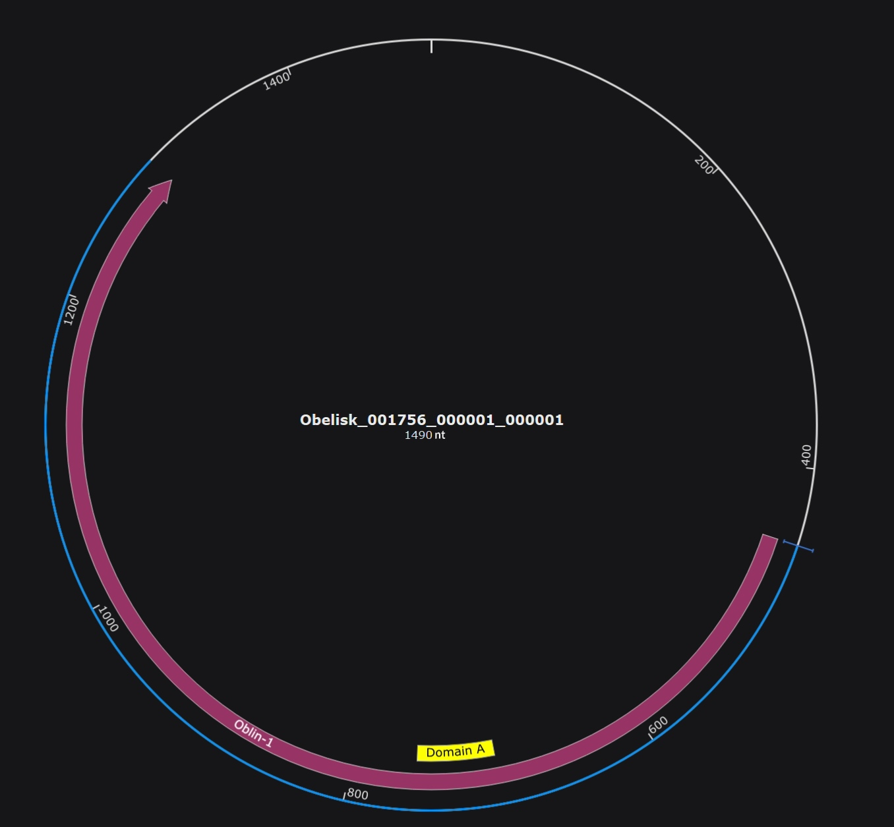
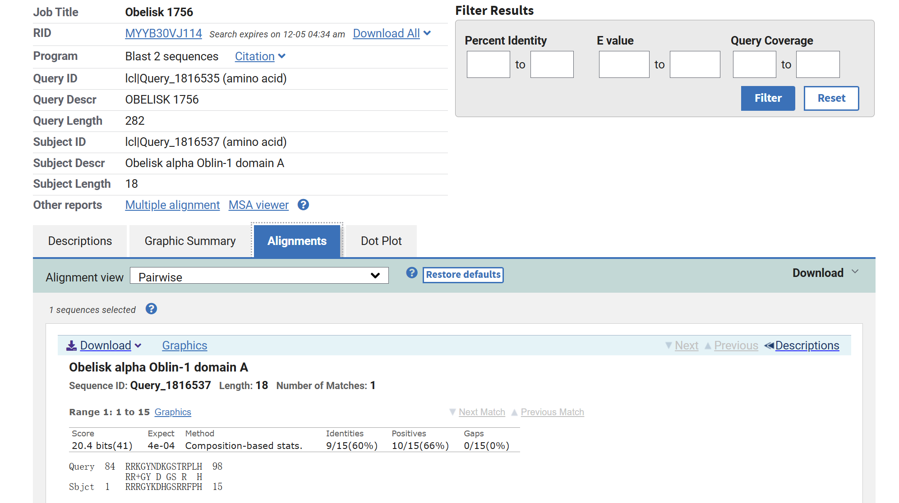
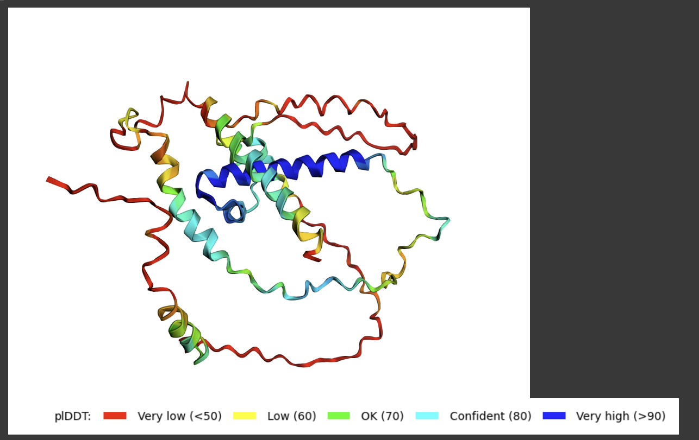
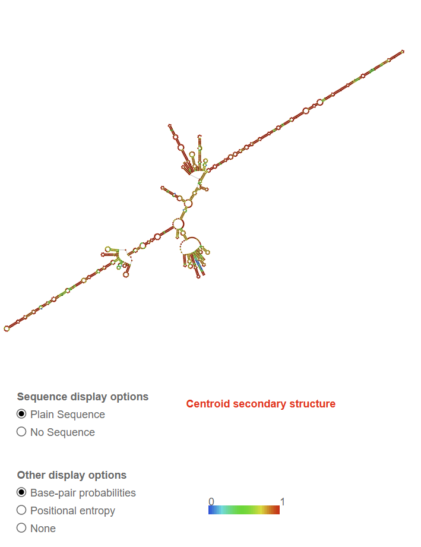
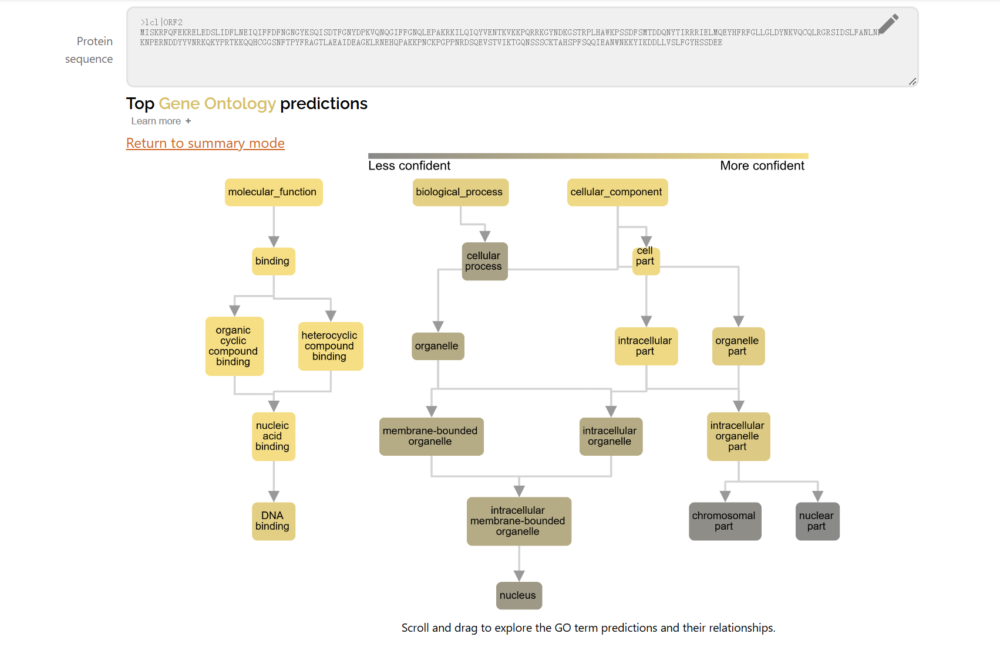
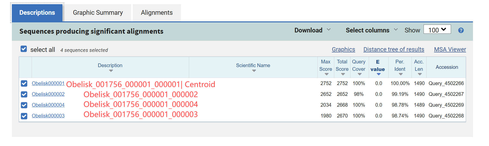
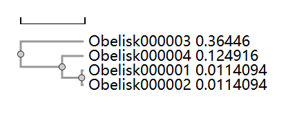
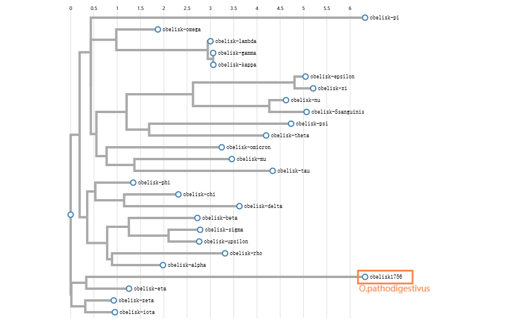

# Crossing the Line: The Obelisk Discovered at the Intersection of Human Gut Metatranscriptomics and Bacterial mRNA

written by: [Feiyang Sun](https://github.com/Limelime1214)

## *Obeliscus pathodigestivus*

The genus name "Obeliscus" is latin for "Obelisk", while the species name "pathodigestivus" combines "patho-" (indicating disease) and "digestivus" (relating to digestion), suggesting the organism is involved in the digestive system and could cause digestive-related illnesses. The nomenclature also interprets potential association between this obelisk and infectious intestinal disease (or acute gastroenteritis).

## Abstract

In recent years, there has been considerable interest in voriod-like RNAs, which exhibit extensive ecological distribution and remarkable genetic diversity. Obelisks are a class of newly discovered viroid-like RNA elements with a single-stranded circular RNA genome whose ecological roles and evolutionary origins remain enigmatic. The remarkable diversity of obelisk species, observed in a range of ecosystems, suggests that much more investigation is needed to unravel the different roles they may play in microbial communities. Additionally, deciphering their structural and functional properties could reveal novel pathways influencing microbial metabolism and ecosystem stability. A specific cluster of novel Obelisk, Obeliscus pathodigestivus (Obelisk_001756_000001_000001), which has a circular RNA genome of 1490 nucleotides long, was detected in a sample of human gut shotgun metatranscriptomics collected in UK by the University of Liverpool in year 2023. In this study, we found that O.pathodigestivus contains an Oblin-1 sequence of 849 nucleotides, with the domain-A of Oblin-1 located between nucleotide positions 701 and 755. Also, it is predicted that Oblin-1 of O.pathodigestivus possesses the function of nucleic acid binding, implying its potential genome replication mechanism. Moreover, this obelisk, found in various environmental samples, seems to flourish in nutrient-dense environments with high microbial activity, such as the gastrointestinal tracts of mammals. The discovery of O.pathodigestivus in diverse environments, particularly the human gut, highlights its potential role in shaping microbial communities and influencing host-microbe interactions. Additionally, its predicted structure and function suggests a possible involvement in genome replication or host gene modulation. The widespread distribution of obelisks across ecosystems emphasizes the need to explore their roles in nutrient cycling, gene transfer, and microbial adaptation. Understanding these viroid-like RNA elements could offer insights into microbial ecology and health, with implications for disease mechanisms and environmental stability. Future studies should focus on their evolutionary origins and functional properties to fully unravel their ecological significance.

## Results

### Digital ecology

**1. Introduction to the Index Case (Obelisk)**

Obeliscus pathodigestivus (Obelisk clulster id 1756) is a newly identified RNA viroid detected in the human gut metagenome and also some other biological samples. The index obelisk, Obelisk_001756_000001_000001, was obtained from a SRA run ERR11484199, which was from a biosample in the human gut shotgun metatranscriptomics. This run was conducted in UK by the University of Liverpool in year 2023 as part of the INTEGRATE project (BioProject PRJEB62473), which was designed to compare traditional diagnostic methods with modern, sensitive molecular and genomic microbiological methods for identifying and characterising responsible pathogens. The study [Cunningham-Oakes et al. 2023] provides Illumina HiSeq 4000 paired-end data, generated by next-generation sequencing of the stool of 1,067 symptomatic patients, including paired metagenomic (DNA) and metatranscriptomic (RNA) data generated from the stool of 985 patients. To be specific, the SRA run where the index obelisk was found is part of the metatranscriptomic (RNA) dataset. The bioProject dataset sheds light on the microbial interactions and processes occurring within human gut ecosystems.

**2. Broader Ecology of Obelisk-Containing Datasets**

Along with the index case, the remaining obelisks in the cluster were present in other ecological environments. SRA run ERR7438486, ERR7438501, and ERR7438492 are all Illumina HiSeq 2500 paired-end sequencing runs from bacterial mRNA collected by Chinese Academy of Agricultural Sciences in China as part of BioProject PRJEB48889 in year 2022. This study [Xu et al. 2022] had a title 'Multi-Omic Analysis in a Metabolic Syndrome Porcine Model Implicates Arachidonic Acid Metabolism Disorder as a Risk Factor for Atherosclerosis', and thus sought to examine the link between gut microbiota and atherothrombosis in a long-term excessive-energy diet-induced metabolic syndrome (MetS) inbred Wuzhishan minipig model. On the other hand, all the three runs are from a biosample of organism Rinodina peloleuca, which is a species of lichen-forming fungus commonly found in diverse ecosystems, known for its distinctive appearance and ecological roles in symbiotic relationships with algae. Notably, as RNA from Rinodina peloleuca (a lichen) is detected in sequencing data from a pig model of the digestive system, it indeed presents a puzzling situation. I suppose that the pig’s gut contains microbes that are somehow associated with lichen. These microbes might release RNA from the lichen or related components during digestion, leading to the observed RNA signals. Also, intestinal (i.e., ileum, cecum, and colon) contents and feces were collected, and thus it is indeed possible that lichens mixed into the pig's feces and were sampled.

**3. Comparing and Contrasting the Ecology of the Index Case and Broader Datasets**

The obelisk-containing datasets share some common factors. To begin with, obelisks flourish in ecosystems (human gut, pig gut) abundant in nutrients and with a dense microbial presence, promoting microbial interactions. Moreover, the index case comes from a clinical sample associated with a diseased state (diarrhea), and this pattern is reflected in other datasets where the viroid has been identified. For instance, in the BioProject PRJEB48889, the obelisk was found in several samples associated with pigs suffering from Arachidonic Acid Metabolism Disorder. This observation supports the idea that the viroid is more likely to be identified in gut microbiome samples from mammals with gastrointestinal diseases, possibly due to changes in microbial diversity or immune responses that facilitate its persistence in the gut environment. Technologically, the RNA viroid is most commonly detected through high-depth sequencing methods, such as Illumina-based metatranscriptomic sequencing (HiSeq 4000, HiSeq 2500 paired-end sequencing), which may be more sensitive to detecting low-abundance 'viral' genomes.

**4. Observations and Possible Hypothesis**

To quantify these observations, we can measure the frequency of Obeliscus pathodigestivus presence in different datasets and compare its occurrence in healthy vs. diseased individuals. Statistical analyses, such as chi-squared tests, can be used to determine whether there is a significant association between the virus's presence and specific health conditions (e.g., diarrhea or IBD). Future experiments may involve longitudinal studies to track the virus's presence over time and its potential role in disease progression or resolution.

Hypothesis: Obeliscus pathodigestivus RNA sequences associate to gastrointestinal diseases in mammals.

### Virus Genome {Q3}


**Figure 1: Predicted gene map of Obeliscus pathodigestivus (Obelisk_001756_000001_000001) generated by ORFfinder.** According to the RNA sequence, the genome of O.pathodigestivus has a size of 1490 nucleotides (nt). A total of 7 ORFs were detected using ORFfinder with the following parameters: Minimal ORF length **75nt**; Genetic code **Standard**; Start codons **ATG only**. The longest ORF (ORF2) corresponded to Oblin-1 of the obelisk (labeled in blue), which has a length of 849 nt (282 aa). Also, suggested by sequence alignment with the domain-A region of Obelisk-alpha Oblin-1, O.pathodigestivus possesses an Oblin-1 homolog with a domain-A region extending from nucleotide position 701 to 755 (labeled in green). There is no meaningful interpretation of the ORF1 and ORF3 on the figure above.
**The ORF2 denoted following amino acid sequence:** >lcl|ORF2 MISKRFQFEKRELEDSLIDFLNEIQIFFDFNGNGYKSQISDTFGNYDPKVQNQGIFFGNQLEPAKRKILQIQYVENTKVKKPQRRKGYNDKGSTRPLHAWKPSSDFSMTDDQNYTIRRRIELMQEYHFRFGLLGLDYNKVQCQLRGRSIDSLFANLNFKNPERNDDYYVNRKQKYPRTKKQQHCGGSNFTPYFRAGTLAEAIDEAGKLRNEHQPAKKPNCKPGPPNRDSQEVSTVIKTGQNSSSCKTAHSPFSQQIEANWNKKYIKDDLLVSLFGYHSSDEE 


**Figure 2: Circular genome map of O.pathodigestivus generated by SnapGene.** O.pathodigestivus has a single-stranded circular genome of a total length of 1490 nt. The predicted Oblin-1 sequence is indicated by pink arrow, showing the orientation and approximate location (449 to 1297) of the sequence on the genome. The predicted domain-A of Oblin-1 is labeled in yellow (nt position 701 to 755), which is consistent with the general characteristic of Obelisks. The Oblin-1 sequence starts further downstream (nt position 449) comparing to those of typical Obelisks (around nt position 100 to 200) identified in the Obelisk study [Zheludev et al. 2024].


**Figure 3: O.pathodigestivus Oblin-1 protein sequence alignment with Obelisk-alpha Oblin-1 domain-A.** Using blastp to align O.pathodigestivus Oblin-1 protein sequence with that of Obelisk-alpha Oblin-1 domain-A, which is 18 amino acid long (Obelisk-alpha: 152-RRRGYKDHGSRRFPHEVH-169) reported by the study of [Zheludev et al. 2024]. The alignment goes from O.pathodigestivus genome nucleotide position 701 to 755, where the percent identity is 60%, with E value 4e-4. Also, there is a typical 'GYxDxG' domain-A motif, which is representative of Obelisk viroid according to the research by [Zheludev et al. 2024].

### Oblin Protein Bonus Mark and some other observations


**Figure 4: Predicted 3D protein structure of Oblin-1 using AlphaFold.** Running the longest ORF in the genome (ORF2 mentioned above), the predicted protein structhre of Oblin-1 is generated. The analysis was conducted based on the amino acid sequence derived in Figure 1, corresponding to the ORF2 identified in Figure 1. As shown in the figure, structures colored in blue are of highest predicted IDDT, while those colored in red are of lowest pIDDT.


**Figure 5: Predicted centroid secondary structure of O.pathodigestivus RNA genome using RNAfold.** In general, O.pathodigestivus has a rod-like secondary structure (with some other structures in the middle). A gradient color scheme is applied to denote base-pair probabilities, where blue signifies low stability or confidence (probability = 0) and red indicates highly stable or confident base pairs (probability = 1). Key structural features include hairpin loops at the end of stems, internal loops and bulges disrupting canonical regions, multiloop junctions where multiple stems converge, and extended single-stranded regions. The displayed structure uses base-pair probabilities to highlight stability and adopts the centroid model, which represents the most likely overall configuration of the molecule.

### Other (bonus) sections

**1. Exploring potential protein function of O.pathodigestivus Oblin-1**

ProteInfer is a useful tool for predicting protein functional properties based on amino acid sequences using deep learning models. The model analyzes the sequence and generates predictions about the protein’s function, including specific molecular functions and cellular processes. Entering the amino acid sequence of O.pathodigestivus Oblin-1 into the `protein sequence` textbox, the web server generated predicted functions of our protein of interest.

As shown in Figure 6, Oblin-1 is predicted to have nucleic acid binding (DNA binding) function with very high confidence scores, indicating it is highly likely that Oblin-1 of O.pathodigestivus possesses nucleic acid binding function. This is consistent with observations mentioned in the Obelisk article [Zheludev et al. 2024], which interpred that domain-A of Oblin-1 has an anion binding function and would somehow contributes to RNA binding or DNA binding in potential host. As the replication mechanism of Obelisks is still understudied, this property of Oblin-1 mentioned above could provide insight into potential pathways for understanding how these viroid-like elements replicate. 

To further explore the functional role of Oblin-1 in O. pathodigestivus, future research should focus on several key areas. First, experimental validation of its nucleic acid binding activity is essential. Techniques such as electrophoretic mobility shift assays (EMSA) and RNA immunoprecipitation could be used to confirm its binding to DNA or RNA. Additionally, determining the specific nucleotide sequences that Oblin-1 recognizes will provide crucial insights into its molecular mechanism and possible interactions with host genetic material.

In parallel, investigating the expression profile of Oblin-1 across different growth conditions and in various host systems could provide valuable information about its role in O. pathodigestivus's 'lifecycle' and its interactions with the host. For instance, RNA sequencing or proteomics approaches could be employed to assess how Oblin-1 expression changes in response to environmental stimuli, such as nutrient availability or host immune responses.

Lastly, functional assays in animal models or cell cultures could be employed to assess the physiological effects of Oblin-1, particularly in relation to host health and disease states. These studies would provide the experimental evidence needed to support its potential as a therapeutic target or biomarker for gut-related diseases. By combining these approaches, a comprehensive understanding of Oblin-1's function and significance in microbial ecology can be achieved.


**Figure 6: Potential protein function of O.pathodigestivus Oblin-1 predicted by ProteInfer.** Submitting the protein sequence of O.pathodigestivus Oblin-1, functional categories like molecular functions, biological processes, and subcellular locations are predicted with associated confidence scores. As shown in the figure, Oblin-1 is predicted to have nucleic acid binding function with a very high confidence score (0.98), and also, the protein is predicted to possess DNA binding function with a very high confidence score (0.88).

**2. Investigating sequence similarity and phylogenetic relationship within cluster 1756.**

Comparing the ecology of index case Obelisk and broader ecology as mentioned in the above module, we obtained an interesting observation that the Centroid (Obelisk_001756_000001_000001) was discovered in the human gut metagenome, while all other three libraries were detected from sequencing runs from bacterial mRNA found in the organism Rinodina peloleuca. This could seem quite confusing at first glance, but upon further investigation of the BioProject submitting these datasets, We found that the study also involved gut microbiome samples from mammals with gastrointestinal diseases, which is similar to the other BioProject involving the Centroid.

Given that the samples (of the Centroid and other libraries) were obtained from two different species, it is worth investigating the sequence similarity and the phylogenetic relationships within obelisk cluster 1756. According to Figure 7 and Figure 8, We discovered that all the other libraries show sequence similarity as high as 99% to the Centroid. Also, Obelisk_001756_000001_000001 and Obelisk_001756_000001_000002 have the closest phylogenetic relationship within the cluster, while Obelisk_001756_000001_000003 is most distant from Centroid.


**Figure 7: Sequence alignment using all libraries of cluster 1756.** The query sequence is Centroid of O.pathodigestivus (Obelisk_001756_000001_000001), and the subject sequences are all the 4 libraries in the cluster. According to the figure, Obelisk_001756_000001_000002 has the highest similarity to Centroid, while Obelisk_001756_000001_000003 possesses the lowest similarity, indication potential phylogenetic relationship within this cluster.


**Figure 8: Phylogenetic tree indicating relationship within cluster 1756.** The tree above is generated by Clustal Omega, suggesting Obelisk_001756_000001_000001 and Obelisk_001756_000001_000002 have the closest phylogenetic relationship within the cluster. On the other hand, Obelisk_001756_000001_000003 is most distant from Centroid.


**Figure 9: Phylogenetic tree generated using a multiple sequence alignment of Oblin-1 proteins produced by GenomeNet.** Aligning Oblin-1 protein sequence of 26 clusters of Obelisks (O.pathodigestivus, alpha, beta, Ssanguinis, gamma, delta, epsilon, zeta, eta, theta, iota, kappa, lambda, mu, nu, xi, omicron, pi, rho, sigma, tau, upsilon, phi, chi, psi, onmega) leads to production of an Obelisk phylogenetic tree containing O.pathodigestivus.

## Discussion

Through the study of Obeliscus pathodigestivus (Obelisk_001756_000001_000001), we have uncovered important ecological insights regarding the diversity of obelisks. One of the most fascinating property of O.pathodigestivus is its Oblin-1 sequence, which is further downstream than expected. The genome encodes a single open reading frame (Oblin-1), which has a sequence length of 849 nucleotides with a starting position at nucleotide 449. In comparison to typical obelisks characterized in the Obelisk study [Zheludev et al. 2024], whose Oblin-1 sequences begin near the start of the genome (generally around nucleotide position 100 to 200), the Oblin-1 sequence in this case starts further downstream. The shift in the position of the Oblin-1 sequence may suggest an evolutionary divergence or adaptation to different environmental or ecological conditions. This change in sequence location could be a response to selective pressures in the host or microbial ecosystem, influencing how the viroid-like element interacts with host machinery. On the other hand, the location of the Oblin-1 gene could also have implications for the replication process of the obelisk. Genes located closer to the start of the sequence may be transcribed and replicated more efficiently, whereas genes located downstream might require additional regulatory mechanisms to initiate transcription or replication.

In the ecological context of O.pathodigestivus, the voriod plays a potentially significant role within the microbial communities it inhabits. This obelisk, identified in diverse environmental samples, appears to thrive in nutrient-rich environments where microbial interactions are abundant, such as gastrointestinal systems of mammals. These habitats are often characterized by high microbial density and dynamic nutrient cycles, offering an ideal setting for O.pathodigestivus to engage in processes like nutrient cycling, microbial community modulation, and possibly horizontal gene transfer. The interaction between O.pathodigestivus and its host species, particularly in relation to gastrointestinal health and disease, suggests that this obelisk may have implications for host-microbiome interactions and pathogenesis, potentially contributing to conditions like dysbiosis or gastrointestinal diseases.

O.pathodigestivus shares certain similarities with other obelisks documented in the Obelisk study [Zheludev et al. 2024]. To begin with, O.pathodigestivus does have a typical genome length (1490 nt) and a single-stranded circular genome structure. Moreover, a typical (sequence: RRRGYKDHGSRRFPHEVH) domain-A (nt position 701 to 755) simiar to that of Obelisk-alpha was discovered in Oblin-1 sequence of O.pathodigestivus. Also, much like the obelisks characterized in [Zheludev et al. 2024], O.pathodigestivus is part of a distinct phylogenetic group, showing no significant similarity to any known RNA or protein sequences in existing databases. This highlights the uniqueness of obelisk sequences and their potential to represent previously unexplored RNA entities. Lastly, the viroid is more likely to be identified in gut microbiome samples from mammals with gastrointestinal diseases according to our observations, which is consistent with contents mentioned in [Zheludev et al. 2024].

Drawing attention to differences, there are also some intriguing findings. Firstly, O.pathodigestivus has a Oblin-1 sequence which appears very downstream of the genome (as discussed above). Secondly, According to [Zheludev et al. 2024], obelisks are known to encode one or two proteins Oblin-1 and Oblin-2, with Oblin-1 featuring a conserved globular domain and Oblin-2 exhibiting a leucine zipper motif. However, O.pathodigestivus encodes only a single protein, lacking any identifiable conserved domains.

In short, these differences in genomic structure and ecological context point to the possibility of varying roles or adaptive strategies among obelisks, and further investigation is required to understand the extent of their ecological diversity and functional capabilities.

## References

Babaian A, Edgar R. 2022. Ribovirus classification by a polymerase barcode sequence. PeerJ. 10: e14055. doi: https://doi.org/10.7717/peerj.14055.

Camarillo-Guerrero LF, Almeida A, Rangel-Pineros G, Finn RD, Lawley TD. 2021. Massive expansion of human gut bacteriophage diversity. Cell. 184: 1098–1109. e9. doi: https://doi.org/10.1016/j.cell.2021.01.029.

Cunningham-Oakes E, Perez-Sepulveda BM, Li Y, Hinton JCD, Nelson CA, McIntyre KM, Wardeh M, Haldenby S, Gregory R, Iturriza-Gómara M, et al. 2023. Enhancing Infectious Intestinal Disease diagnosis through metagenomic and  3 metatranscriptomic sequencing of over 1000 human diarrhoeal samples. doi: https://doi.org/10.1101/2023.04.03.23288067.

Edgar RC. 2004. MUSCLE: a multiple sequence alignment method with reduced time and space complexity. BMC bioinformatics. 5: 113. doi: https://doi.org/10.1186/1471-2105-5-113.

Edgar RC, Taylor B, Lin V, Altman T, Barbera P, Meleshko D, Lohr D, Novakovsky G, Buchfink B, Al-Shayeb B, et al. 2022. Petabase-scale sequence alignment catalyses viral discovery. Nature. 602: 142–147. doi: https://doi.org/10.1038/s41586-021-04332-2.

Evans R, O'Neill M, Pritzel A, Antropova N, Senior A, Green T, Žídek A, Bates R, Blackwell S, Yim J, et al. 2021. Protein complex prediction with AlphaFold-Multimer. doi: https://doi.org/10.1101/2021.10.04.463034.

Gupta P, Hiller A, Chowdhury J, Lim D, Lim DY, Saeij JPJ, Babaian A, Rodriguez F, Pereira L, Morales-Tapia A. 2024. A parasite odyssey: An RNA virus concealed in  Toxoplasma gondii. Virus Evolution 2024. 10(1): veae040. doi: https://doi.org/10.1093/ve/veae040.

Katoh K, Standley DM. 2013. MAFFT multiple sequence alignment software version 7: Improvements in performance and usability. Molecular Biology and Evolution. 30(4): 772–780. https://doi.org/10.1093/molbev/mst010.

McIntyre KM, Bolton FJ, Christley RM, Cleary P, Deja E, Durie AE, Diggle PJ, Hughes DA, Lusignan Sd, Orton L, et al. 2019. A Fully Integrated Real-Time Detection, Diagnosis, and Control of Community Diarrheal Disease Clusters and Outbreaks (the INTEGRATE Project): Protocol for an Enhanced Surveillance System. JMIR Res Protoc 2019. 8(9): e13941. doi: https://doi.org/10.2196/13941.

Xu SS, Zhang XL, Liu SS, Feng ST, Xiang GM, Xu CJ, Fan ZY, Xu K, Wang N, Wang Y, et al. 2022. Multi-Omic Analysis in a Metabolic Syndrome Porcine Model Implicates Arachidonic Acid Metabolism Disorder as a Risk Factor for Atherosclerosis. Front Nutr. 9: 807118. doi: https://doi.org/10.3389/fnut.2022.807118.

Zheludev IN, Edgar RC, Lopez-Galiano MJ, Pena Mdl, Babaian A, Bhatt AS, Fire AZ. 2024. Viroid-like colonists of human microbiomes. Cell. 187: 6521-6536. doi: https://doi.org/10.1016/j.cell.2024.09.033.

# Viral Short Story

```
In the year 2147, the Shattered Isles became the battleground of a quiet apocalypse. The virus, Obeliscus pathodigestivus, wasn't just a pathogen—it was a weapon. Engineered by a shadowy cabal, it targeted the digestive systems of its victims, leaving them debilitated and easily controlled. **With a circular single-stranded RNA genome**, the virus seemed deceptively simple. Its compact genome **encoded a single, mysterious open reading frame**, a hallmark of the infamous Obelisk viroids.

Yet, its true power lay in its omission: **Obeliscus had no RNA-dependent RNA polymerase (RdRp)**. Instead, it exploited host cellular machinery with surgical precision, hijacking ribozymes and enzymes from the infected. The infected became hollowed-out shells **because of gastrointestinal diseases**, starving as their own bodies betrayed them, yet somehow still driven to spread the viroid.

Sora, a rogue ninja trained in bioinformatics and guerrilla warfare, fought to uncover the truth. The viroid’s design bore markers of human engineering. She suspected it was a failed bioweapon that had spiraled out of control, created to incapacitate populations without damaging infrastructure. Its **genome was remarkably short—only 1490 nucleotides—a size characteristic of all Obelisk viroids**.

Armed with this knowledge, Sora synthesized a countermeasure encoded in a viral mimic that tricked Obeliscus into self-destruction. She uploaded the formula into the last remaining quantum lab, initiating its synthesis. But time was running out. Across the city, infected agents hunted her, their strength fueled by desperation and their eyes void of humanity.

The sun rose over the Isles as the antivirus pulsed through her makeshift air disperser. Whether it would work was uncertain, but for Sora, hope had to start somewhere.

```