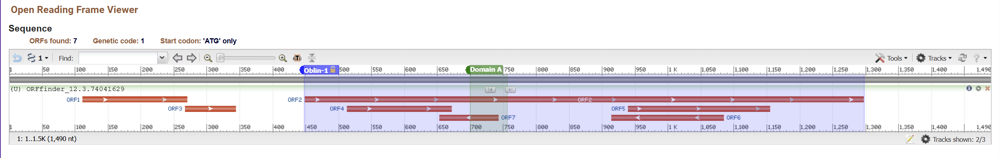

# Crossing the Line: The Obelisk Discovered at the Intersection of Human Gut Metatranscriptomics and Bacterial mRNA

written by: [Feiyang Sun](https://github.com/Limelime1214)

## *Obeliscus pathodigestivus*

The genus name "Obeliscus" is latin for "Obelisk", while the species name "pathodigestivus" combines "patho-" (indicating disease) and "digestivus" (relating to digestion), suggesting the organism is involved in the digestive system and could cause digestive-related illnesses. The nomenclature also interprets potential association between this obelisk and infectious intestinal disease (or acute gastroenteritis).

## Abstract

In recent years, there has been considerable interest in voriod-like RNAs, which exhibit extensive ecological distribution and remarkable genetic diversity. Obelisks are a class of newly discovered viroid-like RNA elements with a single-stranded circular RNA genome whose ecological roles and evolutionary origins remain enigmatic. The remarkable diversity of obelisk species, observed in a range of ecosystems, suggests that much more investigation is needed to unravel the different roles they may play in microbial communities. Additionally, deciphering their structural and functional properties could reveal novel pathways influencing microbial metabolism and ecosystem stability. A specific cluster of novel Obelisk, Obeliscus pathodigestivus (Obelisk_001756_000001_000001), which has a circular RNA genome of 1490 nucleotides long, was detected in a sample of human gut shotgun metatranscriptomics collected in UK by the University of Liverpool in year 2023. In this study, we found that O.pathodigestivus contains an Oblin-1 sequence of 849 nucleotides, with the domain-A of Oblin-1 located between nucleotide positions 701 and 755. Also, it is predicted that Oblin-1 of O.pathodigestivus possesses the function of nucleic acid binding, implying its potential genome replication mechanism. Moreover, this obelisk, found in various environmental samples, seems to flourish in nutrient-dense environments with high microbial activity, such as the gastrointestinal tracts of mammals. The discovery of O.pathodigestivus in diverse environments, particularly the human gut, highlights its potential role in shaping microbial communities and influencing host-microbe interactions. Additionally, its predicted structure and function suggests a possible involvement in genome replication or host gene modulation. The widespread distribution of obelisks across ecosystems emphasizes the need to explore their roles in nutrient cycling, gene transfer, and microbial adaptation. Understanding these viroid-like RNA elements could offer insights into microbial ecology and health, with implications for disease mechanisms and environmental stability. Future studies should focus on their evolutionary origins and functional properties to fully unravel their ecological significance.

## Results

### Digital ecology

**1. Introduction to the Index Case (Obelisk)**

Obeliscus pathodigestivus (Obelisk clulster id 1756) is a newly identified RNA viroid detected in the human gut metagenome and also some other biological samples. The index obelisk, Obelisk_001756_000001_000001, was obtained from a SRA run ERR11484199, which was from a biosample in the human gut shotgun metatranscriptomics. This run was conducted in UK by the University of Liverpool in year 2023 as part of the INTEGRATE project (BioProject PRJEB62473), which was designed to compare traditional diagnostic methods with modern, sensitive molecular and genomic microbiological methods for identifying and characterising responsible pathogens. The study [Cunningham-Oakes et al. 2023] provides Illumina HiSeq 4000 paired-end data, generated by next-generation sequencing of the stool of 1,067 symptomatic patients, including paired metagenomic (DNA) and metatranscriptomic (RNA) data generated from the stool of 985 patients. To be specific, the SRA run where the index obelisk was found is part of the metatranscriptomic (RNA) dataset. The bioProject dataset sheds light on the microbial interactions and processes occurring within human gut ecosystems.

**2. Broader Ecology of Obelisk-Containing Datasets**

Along with the index case, the remaining obelisks in the cluster were present in other ecological environments. SRA run ERR7438486, ERR7438501, and ERR7438492 are all Illumina HiSeq 2500 paired-end sequencing runs from bacterial mRNA collected by Chinese Academy of Agricultural Sciences in China as part of BioProject PRJEB48889 in year 2022. This study [Xu et al. 2022] had a title 'Multi-Omic Analysis in a Metabolic Syndrome Porcine Model Implicates Arachidonic Acid Metabolism Disorder as a Risk Factor for Atherosclerosis', and thus sought to examine the link between gut microbiota and atherothrombosis in a long-term excessive-energy diet-induced metabolic syndrome (MetS) inbred Wuzhishan minipig model. On the other hand, all the three runs are from a biosample of organism Rinodina peloleuca, which is a species of lichen-forming fungus commonly found in diverse ecosystems, known for its distinctive appearance and ecological roles in symbiotic relationships with algae. Notably, as RNA from Rinodina peloleuca (a lichen) is detected in sequencing data from a pig model of the digestive system, it indeed presents a puzzling situation. I suppose that the pig’s gut contains microbes that are somehow associated with lichen. These microbes might release RNA from the lichen or related components during digestion, leading to the observed RNA signals. Also, intestinal (i.e., ileum, cecum, and colon) contents and feces were collected, and thus it is indeed possible that lichens mixed into the pig's feces and were sampled.

**3. Comparing and Contrasting the Ecology of the Index Case and Broader Datasets**

The obelisk-containing datasets share some common factors. To begin with, obelisks flourish in ecosystems (human gut, pig gut) abundant in nutrients and with a dense microbial presence, promoting microbial interactions. Moreover, the index case comes from a clinical sample associated with a diseased state (diarrhea), and this pattern is reflected in other datasets where the viroid has been identified. For instance, in the BioProject PRJEB48889, the obelisk was found in several samples associated with pigs suffering from Arachidonic Acid Metabolism Disorder. This observation supports the idea that the viroid is more likely to be identified in gut microbiome samples from mammals with gastrointestinal diseases, possibly due to changes in microbial diversity or immune responses that facilitate its persistence in the gut environment. Technologically, the RNA viroid is most commonly detected through high-depth sequencing methods, such as Illumina-based metatranscriptomic sequencing (HiSeq 4000, HiSeq 2500 paired-end sequencing), which may be more sensitive to detecting low-abundance 'viral' genomes.

**4. Observations and Possible Hypothesis**

To quantify these observations, we can measure the frequency of Obeliscus pathodigestivus presence in different datasets and compare its occurrence in healthy vs. diseased individuals. Statistical analyses, such as chi-squared tests, can be used to determine whether there is a significant association between the virus's presence and specific health conditions (e.g., diarrhea or IBD). Future experiments may involve longitudinal studies to track the virus's presence over time and its potential role in disease progression or resolution.

Hypothesis: Obeliscus pathodigestivus RNA sequences associate to gastrointestinal diseases in mammals.

### Virus Genome {Q3}



**Figure 1: Predicted gene map of Obeliscus pathodigestivus (Obelisk_001756_000001_000001) generated by ORFfinder.** According to the RNA sequence, the genome of O.pathodigestivus has a size of 1490 nucleotides (nt). A total of 7 ORFs were detected using ORFfinder with the following parameters: Minimal ORF length **75nt**; Genetic code **Standard**; Start codons **ATG only**. The longest ORF (ORF2) corresponded to Oblin-1 of the obelisk (labeled in blue), which has a length of 849 nt (282 aa). Also, suggested by sequence alignment with the domain-A region of Obelisk-alpha Oblin-1, O.pathodigestivus possesses an Oblin-1 homolog with a domain-A region extending from nucleotide position 701 to 755 (labeled in green). There is no meaningful interpretation of the ORF1 and ORF3 on the figure above.
**The ORF2 denoted following amino acid sequence:** >lcl|ORF2 MISKRFQFEKRELEDSLIDFLNEIQIFFDFNGNGYKSQISDTFGNYDPKVQNQGIFFGNQLEPAKRKILQIQYVENTKVKKPQRRKGYNDKGSTRPLHAWKPSSDFSMTDDQNYTIRRRIELMQEYHFRFGLLGLDYNKVQCQLRGRSIDSLFANLNFKNPERNDDYYVNRKQKYPRTKKQQHCGGSNFTPYFRAGTLAEAIDEAGKLRNEHQPAKKPNCKPGPPNRDSQEVSTVIKTGQNSSSCKTAHSPFSQQIEANWNKKYIKDDLLVSLFGYHSSDEE 


**Figure 2: Circular genome map of O.pathodigestivus generated by SnapGene.** O.pathodigestivus has a single-stranded circular genome of a total length of 1490 nt. The predicted Oblin-1 sequence is indicated by pink arrow, showing the orientation and approximate location (449 to 1297) of the sequence on the genome. The predicted domain-A of Oblin-1 is labeled in yellow (nt position 701 to 755), which is consistent with the general characteristic of Obelisks. The Oblin-1 sequence starts further downstream (nt position 449) comparing to those of typical Obelisks (around nt position 100 to 200) identified in the Obelisk study [Zheludev et al. 2024].


**Figure 3: O.pathodigestivus Oblin-1 protein sequence alignment with Obelisk-alpha Oblin-1 domain-A.** Using blastp to align O.pathodigestivus Oblin-1 protein sequence with that of Obelisk-alpha Oblin-1 domain-A, which is 18 amino acid long (Obelisk-alpha: 152-RRRGYKDHGSRRFPHEVH-169) reported by the study of [Zheludev et al. 2024]. The alignment goes from O.pathodigestivus genome nucleotide position 701 to 755, where the percent identity is 60%, with E value 4e-4. Also, there is a typical 'GYxDxG' domain-A motif, which is representative of Obelisk viroid according to the research by [Zheludev et al. 2024].

### Oblin Protein Bonus Mark and some other observations


**Figure 4: Predicted 3D protein structure of Oblin-1 using AlphaFold.** Running the longest ORF in the genome (ORF2 mentioned above), the predicted protein structhre of Oblin-1 is generated. The analysis was conducted based on the amino acid sequence derived in Figure 1, corresponding to the ORF2 identified in Figure 1. As shown in the figure, structures colored in blue are of highest predicted IDDT, while those colored in red are of lowest pIDDT.


**Figure 5: Predicted centroid secondary structure of O.pathodigestivus RNA genome using RNAfold.** In general, O.pathodigestivus has a rod-like secondary structure (with some other structures in the middle). A gradient color scheme is applied to denote base-pair probabilities, where blue signifies low stability or confidence (probability = 0) and red indicates highly stable or confident base pairs (probability = 1). Key structural features include hairpin loops at the end of stems, internal loops and bulges disrupting canonical regions, multiloop junctions where multiple stems converge, and extended single-stranded regions. The displayed structure uses base-pair probabilities to highlight stability and adopts the centroid model, which represents the most likely overall configuration of the molecule.

### Other (bonus) sections

{Q4: Create sub-sections for any bonus or other cool findings you've made
related to your virus}

## Discussion

{Q5 answer}

## References

{Q6 answer}

# Viral Short Story

```
In code-text; include your short story from Tutorial 2 here :)
```