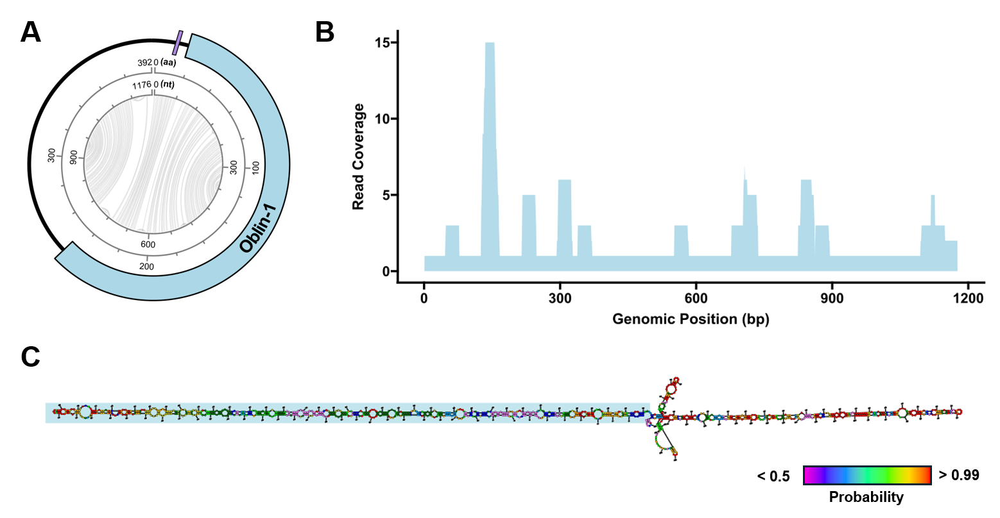
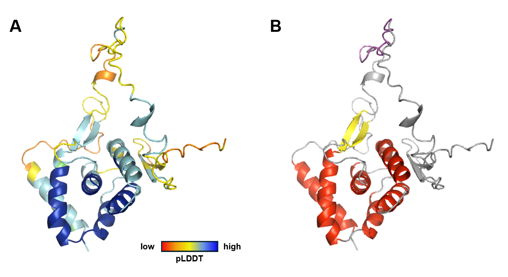
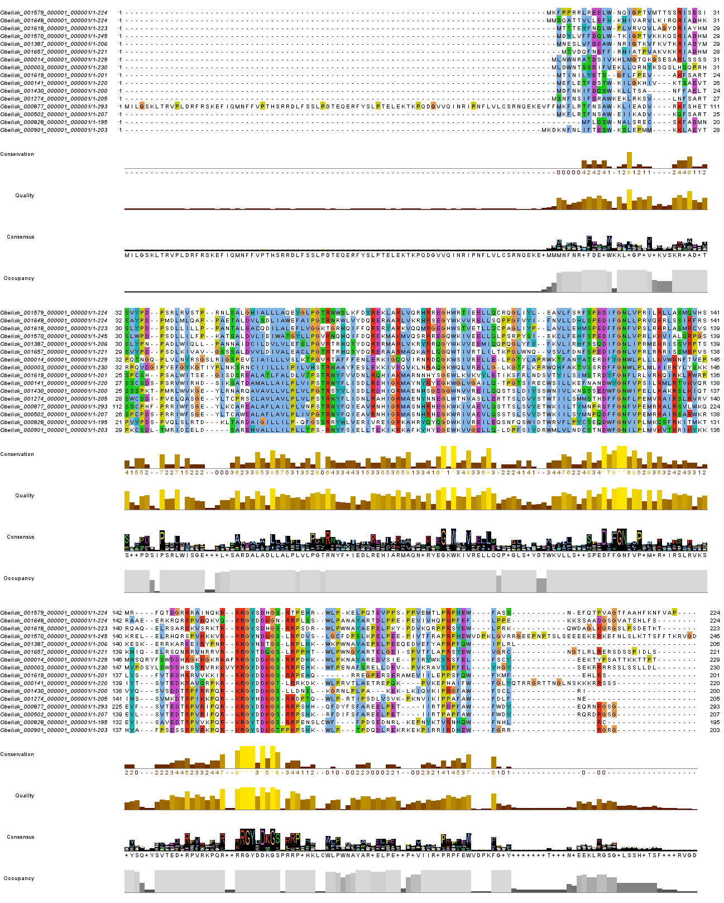
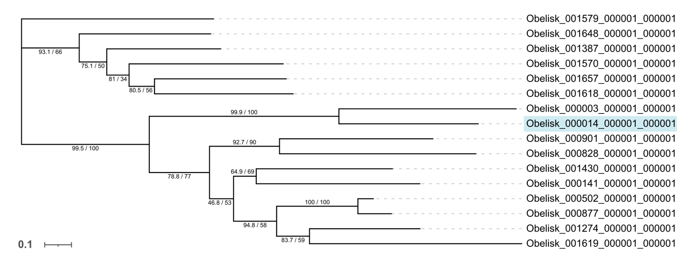

# Nu and Noteworthy: Navigating the Nasopharyngeal Niche of Obelisk-ν
written by: [Vivian Liu]

### *Obeliskvirus respiratorius*
*The genus name, Obeliskvirus, is derived from the obelisk class this virus belongs to, referencing its distinctive rod-like secondary structure. The species name, respiratorius, comes from the Latin word for "of the respiratory system," reflecting the virus's primary habitat in the human respiratory tract. Initially identified in lower respiratory regions, it has since been frequently detected in the upper respiratory tract, including the oral, nasal, and nasopharyngeal areas. The name highlights this anatomical specificity and suggests for future studies on its role in the respiratory and oral microbiomes, as well as its potential involvement in health and disease.*


## Abstract

The Obelisks are a recently characterized group of single-stranded RNA agents that are diverse and widespread in human and global microbiomes. They share notable properties such as compact ~1kb RNA genomes, predicted rod-like genome-wide secondary structures, and open reading frames (ORFs) encoding proteins from Oblin superfamily. Despite their increasing detection in metatranscriptomic datasets, knowledge regarding their ecological roles, host interactions, and functional capacity remains limited.

Here, we investigate *Obeliskvirus respiratorius* (obelisk-ν), an obelisk-class virus identified primarily in human-associated samples from the upper respiratory tract and oral microbiome. Through comparative genomic and ecological analyses, we demonstrate that obelisk-ν exhibits anatomical specificity, being consistently found in oral environments but absent from gut-associated microbiomes. Our findings reveal conserved structural and functional features consistent with previous literature, including a multi-loop RNA structure downstream of ORF suggesting translational regulation, Shine-Dalgarno-like motif suggesting bacterial association, and 'GYxDxG' motif suggesting RNA-binding function. Furthermore, phylogenetic alignment places obelisk-ν closest to obelisk-*S.s* infecting oral bacteria, hinting at similar bacterial host.

This work provides the first detailed characterization of obelisk-ν, expanding the known ecological and molecular diversity of the obelisks. More broadly, the study of obelisk-ν exemplifies the power of metatranscriptomics in uncovering hidden viral diversity and highlights the need for further investigations into the role of obelisk-ν in microbial community dynamics and its implications for human health.

## Results

### Ecology - Index case
The index case was from the SRA run SRR11002570 , which marked the first instance of obelisk-ν [Zheludev et al. 2024]. New York University conducted the run as part of a study evaluating the functional capacity of lower airway microbiota, especially aiming on identifying viable bacterial species and active metabolism (PRJNA603592). The results were published in the form of a conference abstract [Sulaiman et al. 2020], and detailed in a subsequent paper [Sulaiman et al. 2021]. The study utilized RNA-Seq technique, specifically Illumina HiSeq 2500, sequencing metatranscriptomic data from lower airway samples of 21 smokers [Sulaiman et al. 2021].

### Ecology - Other SRA occurrences
Beyond the index case, obelisk-ν was also identified in 5 other BioProjects, all of which utilized Illumina-based metatranscriptomic RNA-Seq for data generation. The samples analyzed were derived exclusively from the human microbiome, with geographic origins mostly spanning North America, with some in Northern Europe.

Obelisk-ν was identified in various periodontitis and dental caries samples in a study conducted by Nanyang Technological University (PRJNA396840), which explored the potential of salivary microbial activity as an indicator of oral health status [Belstrøm et al. 2017]. This finding was reinforced by two subsequent studies: one by NTU examining oral tongue samples (SRR13061597, PRJNA678453) to assess the impact of periodontitis on bacterial gene expression in the oral microbiota [Belstrøm et al. 2020], and another by the University of North Carolina at Chapel Hill (SRR19432487, PRJNA843091), which identified the presence of this virus in supragingival plaque samples from 3-5-year-old children while investigating risk factors and preventive strategies for dental caries [Divaris et al. 2020]. Out of all oral microbiota samples from Belstrøm et al. which contained obelisks, obelisk-ν had relative low read depth, which could indicate lower abundance of this virus.

Obelisk-ν was also identified in pediatric male nasal swab sample by Vanderbilt University Medical Center (SRR12904863, PRJNA671738), which developed a metatranscriptomics method to investigate the respiratory virome, microbiome, and host response directly from low biomass samples [Rajagopala et al. 2021].

Interestingly, the viral agent was also found in whole genome sequencing of measles virus in a study by Public Health Agency of Canada [Zubach et al. 2024]. Nevertheless, out of the various patient samples the authors tested, obelisk-ν was restricted to the nasopharyngeal specimen (SRR26338335, PRJNA1017431).

### Commonalities and Hypothesis
Taken together, the virus was consistently identified in mucosal environments in the respiratory tract, including oral, nasal, and lung specimens, and potentially involved in microbial community dynamics. Despite the oral-gastric connection, no occurrences was found in gut microbiome samples, potentially indicating an anatomical specificity of obelisk-ν, which echoes the conclusion from Zheludev et al. [2024]. 

To quantify the prevalence of obelisk-ν, normalized read counts relative to total donor reads for each sample could be compared. Notably, variations in library preparation methods across studies may influence detection efficiency, highlighting that not all metatranscriptomic studies are equally proficient at detecting obelisks. Expanding the biological understanding of obelisk-ν will require additional data from new samples and/or alternative analyses of existing samples, such as targeted qPCR. 

A potential hypothesis linking these datasets is that obelisk-ν may be a relative low-abundance virus associated with human oral mucosal surfaces and microbiomes. To test this, we can conduct controlled studies where mucosal samples from different anatomical regions (oral, nasal, gut) are collected and analyzed under identical protocols to directly test for anatomical specificity, shedding light on the ecology of the virus.

### Virus Genome {Q3}


> **Figure 1**: Genomic Features of Obelisk-ν. (A) The predicted Obelisk-ν genome (1176 bp), featuring the complete Oblin-1 open reading frame (ORF) (coding sequence, CDS, 690 nt), annotated using ORFfinder [Wheeler et al. 2007], with Shine-Dalgarno sequence in purple. Predicted obelisk secondary structures are depicted as Jupiter plot, where chords represent predicted base pairs with >50% probability. (B) Coverage profile of the SRA run SRR11002570, mapped to the Obelisk-ν index case using Bowtie2 'very sensitive end-to-end' setting [Langmead & Salzberg 2012]. The reference sequence was extended by 30 nucleotides to account for the circular nature of the genome. (C) Predicted RNA secondary structure generated by RNAstructure [Reuter & Mathews 2010], with base pair probabilities color-coded from purple (< 0.5) to red (> 0.99). The predicted ORF is highlighted as in panel (B).

### AlphaFold3 Predicted 3D Structure of Oblin-1


> **Figure 2**: Tertiary structure prediction of Oblin-1 from Obelisk-ν. (A) Cartoon representation of Oblin-1 generated by AlphaFold3 [Abramson et al. 2024] and visualized using PyMOL [Schrödinger 2024], color-coded by prediction confidence (pLDDT). (B) Cartoon representation of Oblin-1 highlighting conserved structural domains, with 'domain-A' colored in purple.

### Multiple Sequence Alignment of the Oblin-1 sequence

> **Figure 3**: Multiple sequence alignment (MSA) of Oblin-1 amino acid sequences from obelisk centroids, retrieved from Table S2 [Zheludev et al. 2024]. Sequences were filtered by 30% identity and 65% query coverage against index case of Obelisk-ν (Obelisk_000014_000001_000001) using BLASTp [Camacho et al. 2009], aligned using MUSCLE [Madeira et al. 2024], and visualized in Jalview [Waterhouse et al. 2009]. Alignments are highlighted with Clustal coloring, along with conservation, quality, consensus, and occupancy plots generated by Jalview.


> **Figure 4**: Unrooted maximum likelihood phylogenetic tree of MSA from Figure 3, generated using IQ-TREE [Trifinopoulos et al. 2016] and visualized using iTOL [Letunic & Bork 2024], with the index case highlighted in blue. Node support values are shown as SH-aLRT support (%) / ultrafast bootstrap support (%). The scale bar represents the number of amino acid substitutions per site.

## Discussion

Through ecological analysis, obelisk-ν emerges as a potential niche-specialist, predominantly associated with mucosal surfaces of the respiratory tract (*high confidence*). The consistent identification of obelisk-ν in oral and nasal microbiomes, coupled with its absence in gut samples, suggests a high degree of anatomical specificity (*moderate confidence*). This specificity contrasts with the broader distribution observed for other members of the obelisk class, which can span diverse environments from stool to soil. Although obelisk-ν has been identified exclusively in human-associated samples, the possibility of model bias in its initial bioinformatics detection cannot be ruled out. This bias may stem from the initial SRA database queries, which was based on obelisk RNA from a longitudinal dataset of human stool stranded metatranscriptomics [Zheludev et al. 2024]. Interestingly, obelisk-ν has been identified in studies of periodontitis, dental caries, and respiratory viromes, suggesting potential interactions with microbial communities on mucosal surfaces (*low confidence*). The relatively low abundance of obelisk-ν in both the index case (Figure 1B) and the Belstrøm study reported by Zheludev et al. [2024] (*moderate confidence*) prompts further questions about whether it plays a consistent ecological role or functions opportunistically.Alternatively, the low read depth could reflect limitations in current sequencing workflows, suggesting that the observed abundance represents a lower bound and that more instances of obelisk-ν are yet to be detected (*moderate confidence*).

One of the most intriguing aspects of obelisks is their strong predicted rod-like secondary structure. On a molecular level, obelisk-ν exhibits genomic composition characteristic of most obelisks [Zheludev et al. 2024], featuring a single-stranded RNA genome with a rod-like secondary structure (Figure 1C), a multi-loop RNA structure downstream of its sole ORF (Figure 1C), and its conserved Shine-Dalgarno-like sequence (Figure 1A). The multi-loop could form a structural barrier, indicating its potential role as a regulatory element (*low confidence*). The Shine-Dalgarno sequence suggests potential adaptability to bacterial hosts and environments (*low confidence*). 

The predicted Oblin-1 protein tertiary structure, with alpha-helical domains and a conserved β-sheet clasp (Figure 2), is also consistent with current observations of obelisks. A conserved 'GYxDxG' motif within Oblin-1 suggests a probable role in RNA interaction — a hallmark of many RNA viruses (*moderate confidence*). However, the absence of an Oblin-2 protein, which is present in some obelisks [Zheludev et al. 2024], indicates potential function complementation and possibly a simplified life cycle (*low confidence*).

The phylogenetic alignment places obelisk-ν closest to obelisk-*S.s* (Figure 4), which infects the commensal oral bacterium *S. sanguinis* [Zheludev et al. 2024]. This proximity suggests a hypothesis that obelisk-ν may share similarities in ecological niche and host preference, also having a bacterial host within the human oral or respiratory microbiome (*low confidence*). In contrast, other nodes on the phylogenetic tree were less explanatory, showing diverse sample sources (e.g., marine, lizard) and geographic distributions (e.g., Asia, Australia). This lack of clarity could stem from low sequence identity (>30%) and limited query coverage (<80%). Nevertheless, the analysis highlights the wide-ranging ecological diversity of related obelisks (*moderate confidence*), serving as a prompt for future exploration.

Taken together, this study reinforces our understanding of obelisk viruses and suggests potential for obelisk-ν to engage with a bacterial host. These findings provides a foundation for further investigation into the role of obelisk-ν in microbial community dynamics and its implications for human health.

## References

Zheludev, I. N. et al. Viroid-like colonists of human microbiomes. Cell 187, 6521-6536.e18 (2024).

Sulaiman, I. et al. Functional Microbiomic Approaches Using Lower Airway Samples Identify a Subset of Lung Microbial Communities with Evidence of Active Microbial Metabolism. in B98. NEW DEVELOPMENTS IN LUNG MICROBIOME A4246–A4246 (American Thoracic Society, 2020). doi:10.1164/ajrccm-conference.2020.201.1_MeetingAbstracts.A4246.

Sulaiman, I. et al. Functional lower airways genomic profiling of the microbiome to capture active microbial metabolism. The European respiratory journal 58, 2003434 (2021).

Belstrøm, D. et al. Metagenomic and metatranscriptomic analysis of saliva reveals disease-associated microbiota in patients with periodontitis and dental caries. npj Biofilms Microbiomes 3, 1–8 (2017).

Belstrøm, D. et al. Ecological Perturbations Impact Species-Specific Gene Expression of the Oral Microbiota. Preprint at https://doi.org/10.21203/rs.3.rs-104582/v1 (2020).

Divaris, K. et al. Cohort Profile: ZOE 2.0-A Community-Based Genetic Epidemiologic Study of Early Childhood Oral Health. Int J Environ Res Public Health 17, 8056 (2020).

Rajagopala, S. V. et al. Metatranscriptomics to characterize respiratory virome, microbiome, and host response directly from clinical samples. Cell Rep Methods 1, 100091 (2021).

Zubach, V. et al. Genome sequence of a measles virus strain with a novel loss of stop codon mutation in the phosphoprotein gene. Microbiol Resour Announc 13, e00833-23 (2024).

Wheeler, D. L. et al. Database resources of the National Center for Biotechnology Information. Nucleic Acids Research 36, D13–D21 (2007).

Langmead, B. & Salzberg, S. L. Fast gapped-read alignment with Bowtie 2. Nature methods 9, 357 (2012).

Reuter, J. S. & Mathews, D. H. RNAstructure: software for RNA secondary structure prediction and analysis. BMC Bioinformatics 11, 129 (2010).

Abramson, J. et al. Accurate structure prediction of biomolecular interactions with AlphaFold 3. Nature 630, 493–500 (2024).

The PyMOL Molecular Graphics System, Version 4.6 Schrödinger, LLC.

Camacho, C. et al. BLAST+: architecture and applications. BMC Bioinformatics 10, 421 (2009).

Madeira, F. et al. The EMBL-EBI Job Dispatcher sequence analysis tools framework in 2024. Nucleic Acids Res 52, W521–W525 (2024).

Waterhouse, A. M., Procter, J. B., Martin, D. M. A., Clamp, M. & Barton, G. J. Jalview Version 2—a multiple sequence alignment editor and analysis workbench. Bioinformatics 25, 1189–1191 (2009).

Trifinopoulos, J., Nguyen, L.-T., von Haeseler, A. & Minh, B. Q. W-IQ-TREE: a fast online phylogenetic tool for maximum likelihood analysis. Nucleic Acids Res 44, W232–W235 (2016).

Letunic, I. & Bork, P. Interactive Tree of Life (iTOL) v6: recent updates to the phylogenetic tree display and annotation tool. Nucleic Acids Research 52, W78–W82 (2024).

# Viral Short Story

```
In the land of small bugs, where the bacteria play,
An obelisk virus danced night and day.
It wasn’t a virus you'd find in your book—
It was circular RNA with a very sly look!

It wasn’t a bacterium, it wasn’t a germ,
But an obelisk agent, quite strange and long-term.
How do we know it’s not like the rest?
By less than 90% similarity—that’s the test!
We compare with BLASTn and give it a spin,
To see where it came from, and where to begin!

Now, who brought this virus to light, so precise?
A group from New York, so clever and nice!
Sulaiman et al. gave it a shot,
Publishing findings that they thought were hot.
They used SRR to share what they found,
With a BioProject to spread it around!

So why was this virus discovered, so neat?
To study the microbiota, so tiny, so sweet!
In the lower airways where bacteria grow,
They looked for signs of microbes in tow.
But when a virus showed up in their view,
It opened a door to a story brand new!

They used a kit, quite clever indeed,
The NEB Ultra II to prep for the deed.
With RNASeq on the Illumina machine,
Paired-end reads showed what had never been seen!

So here’s the tale of the obelisk bold,
A virus with secrets yet to unfold.
With data from February two-zero-two-zero,
This little bug's story is anything but zero!
```