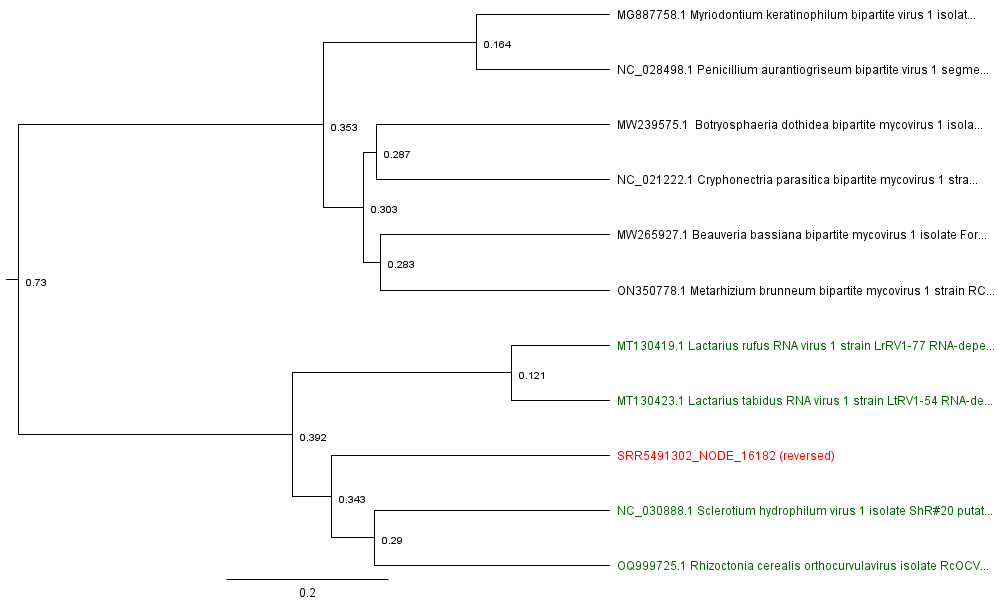

# Hide-and-seek, can you find a ghost?: Identification of novel dsRNA virus from the mushroom meta-data
written by: [Matin Muradli]

### Orthocurvulavirus phantasma
*Orthocurvulavirus is the genus of the top three closest hits in blastx. Phantasma means phantom, ghost or apparation in latin. I chose this name, because the suspected RdRp CDS was hidden inside of another ORF, which makes it harder to find. Thus, as a ghost, even if one looks into right direction, it is almost impossible to see it.*

## Abstract

Advances in sequencing techniques caused an explosion in transcriptomics databases. However, mostly there are hidden gems inside the samples, which are either unrelated to the submitted research or overseen. Our team, discovered a "hidden gem", or as we call it "ghost virus", from a basidiomycete meta-genome. We screened the bio-sample to identify possible RdRp sequences, by using the Serratus website. The expected RdRp sequence was subjected to BLASTx. Regarding the results, we introduce a novel dsRNA species belonging to the Curvulaviridae family. This finding extends the knowledge about Curvulaviridae family members and possible applications of transcriptomic screening techniques.

## Results

### Ecology of Host Species

The ghost virus was found in the bio-sample "SAMN06314174", introduced in the study of ectomycorrhizal fungi's dynamic genome evolution by Lotus A. Lofgren (1). The reference sample was obtained from the *Suillus weaverae* mushroom. Another bio-sample, SAMN03465334, with similar motifs was submitted by Hui-Ling Liao (2), in which the sample is obtained from the *Suillus granulatus*, while studying gene expression between Pines and their symbiotic Ectomycorrhizal Fungi in the Genus Suillus. Moreover, the same palm print was found in several, root and soil meta-genomes. 

This observation strongly suggests that the ghost is hidden in the mushrooms, especially in *Suillus spp*. Suillus fungi are basidiomycetes and they mostly have ectomycorrhizal (ECM) symbiotic relations with Pinaceae family members, in temperate zones of the Northern Hemisphere (3).

The shared features of the *Suillus spp.* are their host selectivity and ECM behaviors. There is a need of further research to determine if this particular type of behavior is caused by the virus of interest. On the other hand, coverage of the "ghost" and the sample origins may be interpreted as viral infection, which may cause an inclination to symbiotic relations.

### *O.phantasma* genome

> Figure 1. The longest, ORF that includes the putative RdRp sequence is ORF 14, which starts from the first reading frame in reverse direction.
Moreover, expected A, B, and C motifs are labeled with blue, green, and red ribbons respectively. 
(The image is generated via Geneious Prime (GP) software)](A3/Fig 1. RdRp.png)

The discovered virus has dsRNA genome. Similar to the other *Orthocurvulavirus spp.*, the RdRp sequence length of *O.phantasma* is in the range of 600-680 amino acids. In the figure 1, the blue, green and red ribbons depicts the A, B and C motifs respectively. 

### Other (bonus) sections

>Figure 2A. The predicted 3D configuration of putative RdRp sequence. Conserved A, B, and C motifs of the RdRp sequence are labeled blue, green, and red ribbons respectively.
The 3D configuration is predicted by the AlphaFold 2 and read in PyMol. 

> Figure 2B. The sequence coverage in the genomic database. Highly conserved active center of the enzyme, shows the highest coverage.

> Figure 3. Phylogenetic tree of RdRp motifs from various viruses. The putative RdRp sequence was used in BLASTx, and sequence data of the top 10 hits from different species were obtained. 
All samples were then subjected to multiple alignment in Geneious Prime (GP) software by using the MUSCLE alignment function. 
The finished alignment result was used to create the phylogenetic tree, via built-in function of GP.
The red labeled node is contig of interest, while green labeled nodes are members of Orthocurvulavirus genus.  

## Discussion

Regarding the phylogenetic tree, it can be said that the "ghost" contig is a genome of new species in the Orthocurvulavirus genus. As with other members, the host of "ghost" is highly specific, and belongs to *Suillus spp*. It is suspected that the orthocurvulaviruses have an impact on forming new symbiotic relations with plants, regarding data sources, and their study objectives. Because of it is highly masked existence, and relatedness to Orthocurvulaviruses, we decided to name the new species "*Orthocurvulavirus phantasma*". 

We are planning to specifically check the ECM-forming and non-forming mushrooms' transcriptomes to address the question of viral infection and ECM formation correlation. This may give us new insights on agriculture, where we can induce more efficient crops and reduce water need. 

## References

1) Lofgren, L. A., Nguyen, N., Vilgalys, R., Ruytinx, J., Liao, H., Branco, S., Kuo, A., LaButti, K., Lipzen, A., Andreopoulos, W., Pangilinan, J., Riley, R., Hundley, H., Na, H., Barry, K., Grigoriev, I. V., Stajich, J. E., & Kennedy, P. G. (2021). Comparative genomics reveals dynamic genome evolution in host specialist ectomycorrhizal fungi. New Phytologist, 230(2), 774–792. https://doi.org/10.1111/nph.17160

2) Liao, H., Chen, Y., & Vilgalys, R. (2016). Metatranscriptomic Study of Common and Host-Specific Patterns of Gene Expression between Pines and Their Symbiotic Ectomycorrhizal Fungi in the Genus Suillus. PLOS Genetics, 12(10), e1006348. https://doi.org/10.1371/journal.pgen.1006348

3) Ainsworth, G. C. (2008b). Ainsworth & Bisby’s Dictionary of the Fungi. CABI. p672. 

4) JGI GOLD | Study. (n.d.). https://gold.jgi.doe.gov/study?id=Gs0085736

5) Sokrypton. (n.d.). GitHub - sokrypton/ColabFold: Making Protein folding accessible to all! GitHub. https://github.com/sokrypton/ColabFold

6) Bashyal, B. M., Gupta, A. K., Singh, D., Choudhary, R., & Aggarwal, R. (2021). First Report of Sclerotium hydrophilum Causing Stem Rot Disease of Rice in North Eastern Plain Zone of India. Plant Disease, 105(3), 700. https://doi.org/10.1094/pdis-07-20-1529-pdn

7) Sutela, S., & Vainio, E. J. (2020). Virus population structure in the ectomycorrhizal fungi Lactarius rufus and L. tabidus at two forest sites in Southern Finland. Virus Research, 285, 197993. https://doi.org/10.1016/j.virusres.2020.197993

8) Serratus. (n.d.). https://serratus.io/

9) Hough, B., Steenkamp, E. T., Wingfield, B. D., & Read, D. A. (2023). Fungal viruses unveiled: A Comprehensive Review of mycoviruses. Viruses, 15(5), 1202. https://doi.org/10.3390/v15051202

10) Zhao, Y., Shirouzu, T., Chiba, Y., Hosaka, K., Moriyama, H., Urayama, S., & Hagiwara, D. (2023). Identification of novel RNA mycoviruses from wild mushroom isolates in Japan. Virus Research, 325, 199045. https://doi.org/10.1016/j.virusres.2023.199045

