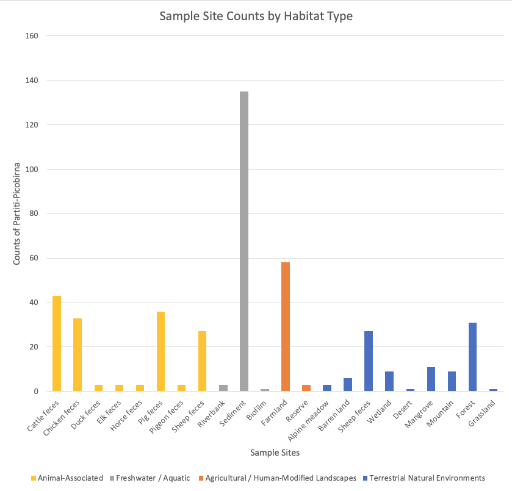
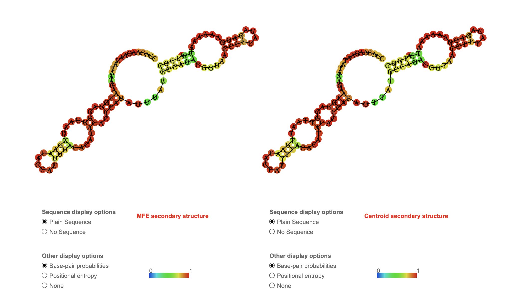

# A Lot to Ruminate On: Discovery of a Rumen-Specific Partitivirus Reflecting a Stable Fungal Viral Lineage Across Germany, China, and New Zealand

## *Partitivirus rumenrex*

Partitivirus: From the Latin for the partiviridae virus.

rumenrex: Derived from the Latin rex which means king/ruler of the rumen.

## Abstract

A novel partiti-like RNA virus, here designated P. rumenrex, was identified through RNA-dependent RNA polymerase (RdRp) sequences recovered across 17 SRA runs spanning four BioProjects (PRJEB34570, PRJNA202380, PRJNA366527, PRJNA469119). Positive detections were consistently associated with rumen-derived datasets from Bos taurus (cattle) and Ovis aries (sheep) originally generated to study feed efficiency, methane yield, and rumen physiology rather than viral diversity. The strongest evidence came from BioProject PRJEB34570, where 13/192 samples were virus-positive and all positives derived specifically from rumen tissue (with non-rumen tissues remaining negative under matched host metadata), implicating the rumen ecosystem as the primary site of detection.

BLAST analysis of the assembled RdRp fragment yielded top hits to Partitiviridae (56–60% identity), with additional matches to Durnavirales-level partiti-like sequences and known dsRNA mycovirus groups. Additionally, phylogenetic placement among reference fungal partitiviruses indicates that P. rumenrex is unlikely to infect vertebrate hosts or obligate rumen fungi; instead, its closest relatives are partitiviruses of plant- and soil-associated fungi. Thus, with the biology of partitiviruses: segmented dsRNA genomes, persistent low-symptom infections, and predominantly fungal hosts these results motivated the central hypothesis that P. rumenrex is a fungal dsRNA virus detected in ruminant samples through ingestion of infected fungi rather than vertebrate infection. 

To explain rumen-specific recurrence, three ecological hypotheses were evaluated: (i) rumen survival under anaerobic, fiber-rich, reducing conditions; (ii) rumen-only detection driven by high filamentous fungal biomass; and (iii) rumen microbiome residency. Literature synthesis supported a convergent model in which the rumen uniquely sustains dense anaerobic fungi (e.g., Neocallimastix, Piromyces, Orpinomyces) and provides physicochemical conditions permissive for persistence of intracellular dsRNA viruses, while downstream compartments reduce fungal survival and viral detectability. Collectively, these findings position P. rumenrex as a globally distributed, rumen-detected partiti-like virus likely tracking fungal ecology and agricultural exposure rather than animal host biology.

## 2.0 Digital Ecology

### 2.1: Overview of Source Datasets and Host Context

P. rumenrex was detected through the RNA-dependent RNA polymerase sequences found across 17 SRA runs, and 4 bioprojects: PRJEB34570 [20] , PRJNA202380 [26] , PRJNA366527[9], PRJNA469119[7]. The latter three bioprojects had a single SRA run associated with them: SRR873463, SRR6201515, and SRR7633495 respectively. While the first one was assessed based on run ERR3556011, as it had the highest node coverage of 31. Across all positive hits, the viral sequence is consistently associated with Bos taurus (cattle) and Ovis aries (sheep) data sets that were originally collected to study feed efficiency, methane yield, and rumen physiology rather than viruses [11,19,22,25,27].

Overall, the top hits are partitiviruses. Partitiviruses are segmented double-stranded RNA viruses that typically infect fungi, protozoa, and some plants. [25] Their genome consists of two short dsRNA segments encoding the RdRp and the capsid protein [26]. They cause persistent, low-symptom infections and are transmitted vertically within microbial hosts [4,26,30]. The majority of hits are from the Partitiviridae family, with the first 8 spots being occupied by “Partitiviridae sp.” BLAST has found that this virus is most similar to known partitivirus RdRp genes, however is unsure of the specific species [1,10]. The percent identity for this top 8 varies between 56% - 60%. The other viruses mentioned in the hits include Durnavirales sp. (57% identity)[24], Benes partiti-like virus (55% identity) [8], and Senko virus (53% identity) [19]. Durnavirales is an order that contains Partitiviridae [18,26]. Benes is an arbitrary name given by researchers who noted the partiti-like nature of their virus.[8] Finally, Senko virus is a mycovirus (fungal virus), also within the dsRNA fungal virus group [26,30].

Hypothesis: Thus, based on this hit analysis, I hypothesised that P. rumenrex is a partitivirus that infects fungi and is consumed by farm animals [26,30].

This hypothesis is loaded with several sub-questions that must be answered before it can be fully interrogated. The first of which is:

1.  Ingestion Hypothesis

P. rumenrex enters the rumen through repeated ingestion of plant or soil associated fungi rather than infecting the animal itself [4,5,11,25,31].

2.  Fungal Host Lineage Hypothesis

P. rumenrex infects a cosmopolitan fungal lineage (e.g., Mortierella, Fusarium, Penicillium, or anaerobic rumen fungi) that is present across all sampling regions (Germany, China, New Zealand) [31,33,34,35].

### 2.2: Analysis of the BioProjects

The PRJEB34570 with the most SRA runs had all samples from the rumen of Bos taurus, specifically domestic cattle. Of the total 192 samples in this BioProject 13 of them had detection of this virus; all 13 of the positive hits were samples from the rumen, while any samples from the other tissues were negative. This is the only difference that is likely to be the cause of the virus being present, as the health, age, sex, and fasted status were all consistent. The was a systems-biology study of Charolais × Holstein F₂ cattle at the Leibniz Institute for Farm Animal Biology (FBN) in Dummerstorf, North Germany. [19, 5] In this project, crossbred animals (n = 48) were stratified into high- and low-metabolic efficiency groups based on residual feed intake, energy-corrected milk, and intramuscular fat content [19]. Tissue samples from rumen, jejunum, liver, and skeletal muscle were subjected to stranded total RNA-seq, and plasma was profiled for 640 metabolites [19]. The partitivirus-like contig was specifically detected in rumen tissue (Saccus ventralis, papillary base), not in the extra-intestinal tissues, strongly implicating the rumen ecosystem as the primary site of detection [11,25,27]. Further analysis into if the high or low metabolic efficiency of the cows had any correlation to the detection of the virus was attempted, however, the data sets did not contain this level of detail. Instead, I looked into the data the study did present which showed that the rumen showed no significant host lncRNA differential expression between high- and low-efficiency cattle [19]. This indicates minimal host regulatory plasticity in this tissue. Since the rumen is a microbially dominated environment with limited host transcriptional responsiveness, the presence of the virus in rumen samples likely reflects infection of microbial symbionts (such as anaerobic fungi) rather than infection of the host [4,11,26,31]. This aligns with the ecology of partitiviruses and similar RNA viruses, which persist in stable microbial niches without triggering host transcriptional responses [4,26,30,32]. Thus, though no conclusive evidence was able to be gained from what this study explored, there is strong evidence pointing towards the ingestion hypothesis.

Projects PRJNA202380 [26] , PRJNA366527[10], PRJNA469119[7] were all from the sheep gut metagenome. The first project was a metatranscriptome analysis of rumen microbial communities from sheep fed ryegrass/clover in New Zealand [22,27]. The second project was also a New Zealand sheep rumen microbial community analysis [22,27]. The last project was a study done focused on EBI Metagenomics so there was not much information in the paper on the virus since the focus was on the tool. However, the paper did mention that whole genome shotgun sequencing data set from this project had samples from the rumen of mammals [2].

Based on all of the four BioProjects we can see that the partitivirus-like RdRP contig is largely associated with gastrointestinal samples - specifically the rumen - through detection in multiple metagenomic and metatranscriptomic datasets generated from studies that were not focused on viruses [2,9,11,22,25,27].

To broaden the search, I directly inputted the RdRp palmprint was into BLAST, yielding a match to the extensive RNA virome survey by Chen et al. (2022) [2], which sampled faecal, soil, sediment, farmland, forest, and mangrove environments across China. However, this dataset proved inconclusive for ecological interpretation. The 14 sampling regions: Beijing, China CDC, Guangdong, Guangxi, Hainan, Heilongjiang, Henan, Hubei, Inner Mongolia, Jiangsu, Sichuan, Xinjiang, and Yunnan represent ecologically diverse environments [2]. Although there was such diversity I later explore if there is any consistent pattern between these biomes across the large country. The analysis provided some evidence that aligns with fungal-infection however it is important to note that this is a single study so insights gained are not conclusive. Furthermore, in this study, due to short contig lengths, low-identity matches, and incomplete RdRp motifs, Picobirnaviridae and Partitiviridae were grouped together, limiting taxonomic resolution and preventing identification of the exact sample containing the P. rumenrex sequence [2,18]. Despite these limitations, one finding was notable: partiti-like fragments frequently appeared in fecal samples from cattle, sheep, and chickens, underscoring that these viruses are not host-species-specific and are repeatedly detected in digestive contexts [2,26]. Viral infections are typically limited to a species due to the tight biological conditions necessary in the virus and host for infection, thus it was unlikely that the virus is infecting cattle, sheep, and chickens, particularly because chickens are not ruminant [26,30].

Synthesizing all datasets, P. rumenrex is consistently associated with gastrointestinal samples. Specifically, rumen samples across multiple independent projects, species, and continents. So far it seems that the digital ecology of this virus is not a classic vertebrate pathogen but part of the rumen-associated microbial/viral community linked to nutrition and production traits [11,25,27]. It was found in these mammalian samples because it was ingested, instead of directly infecting the animals through horizontal transmission [4,26,30].

### 2.3: **Rumen-Specific Detection Pattern**

The next question that arised in my investigation was “Why the rumen?”. These viruses are ingested but how are they all being found in the same tissue? This generated two hypotheses to explore:

1.  Rumen Survival-Condition Hypothesis

    *P. rumenrex* persists in the rumen because its dsRNA genome is unusually stable under anaerobic, fiber-rich, reducing conditions.

2.  Rumen-Only Detection Hypothesis

    *P. rumenrex* survives only in the rumen because of the high biomass of filamentous fungi, unlike the intestine or feces where fungi decline sharply.

3.  Rumen Microbiome Hypothesis

    *P. rumenrex* primary hosts are in the microbiome of the rumen itself, with the fungi in the environment simply acting as a vehicle.

This was explored through a literature review examining the anatomy and physiology of the rumen and its role within ruminant digestion. I also surveyed studies to determine whether partitiviruses, or other fungal dsRNA viruses have previously been reported in rumen environments.

The rumen is the sole compartment of the ruminant digestive tract where fungal biomass is high enough to support viral replication [5,11,31]. The rumen hosts dense populations of anaerobic fungi such as Neocallimastix, Piromyces, and Orpinomyces, as well as feed-associated fungi introduced through silage and pasture [4,31]. These fungi contain persistent dsRNA mycoviruses, which release viral RNA into rumen contents during growth, hyphal fragmentation, and spore germination [4,26,30]. Downstream compartments such as the abomasum and intestines contain far fewer fungi and harsher physicochemical conditions (low pH, digestive enzymes), leading to rapid degradation of fungal cells and viral RNA [5,11]. Thus, detection of the virus is restricted to the rumen, consistent with a fungal host localized to this environment [11,25]. Thus, the ecological characteristics of partitiviruses, such as their segmented genomes, typically low abundance in metagenomic datasets, and their strict association with fungal hosts, strongly support the interpretation that the rumen provides an ideal environment for their detection [4,26,30]. The high fungal biomass and active fungal metabolism within the rumen make it the most plausible site for proliferation of a novel partiti-like virus, further substantiating its classification within this viral family [5,26].

Despite the global importance of the rumen mycobiome, no published studies to date have explicitly reported partitiviruses or other dsRNA fungal viruses within rumen-associated fungi [5,11,31]. However, I believe this absence reflects more of a methodological gap rather than a true biological absence: most rumen metagenomic studies prioritize bacteria, archaea, methane metabolism, and fiber degradation, while dsRNA viromes have rarely been targeted [5,11,25,27]. However, evidence indirectly support the plausibility of rumen fungal mycoviruses. For example: anaerobic rumen fungi such as Neocallimastix and Piromyces have been shown to harbor intracellular dsRNA elements, although these were not formally classified as partitiviruses due to limited sequencing resolution and the lack of dsRNA-enrichment techniques [4,31]. Additionally, many fungi commonly entering or inhabiting the rumen such as Fusarium, Penicillium, Aspergillus, Mortierella, Rhizoctonia, and Ustilaginales yeasts are well-established hosts of partitiviruses in other environments [26,30,33,34,35]. These frequently occur in plant-associated fungi ingested by cattle and sheep, providing a direct ecological route for partitivirus-containing fungi to enter the rumen [4,5,11]. Methodological biases further explain the lack of prior detection, for instance, standard metagenomic workflows used in rumen research tend to filter out large dsRNA molecules, remove fungal RNA, enrich for bacteriophages, and fail to capture persistent cytoplasmic dsRNA replicons [25,26]. These conditions somewhat force the partitiviruses to become systematically underrepresented in the data. Supporting this, adjacent ecosystems tightly linked to ruminant feeding, such as grasslands, pasture soils, and silage regularly contain partitiviruses and partiti-like dsRNA elements, and again, ruminants ingest these environments daily [2,4,26]. Taken together, these observations strongly suggest that the absence of previous reports reflects under-sampling rather than true absence of fungal dsRNA viruses in the rumen [25,26,31]. The detection of P. rumenrex therefore likely represents a digital discovery of a rumen-associated partiti-like virus, potentially revealing a previously uncharacterized component of the rumen mycovirome.

A recent comprehensive rumen virome study compiled a database of rumen viral sequences from diverse cattle and sheep metagenomes and showed that viruses contribute substantially to microbial diversity and associate with animal production traits [27]. Although this work emphasizes bacteriophages and DNA viruses, it demonstrates the presence of structured viral communities in the rumen and provides a resource that could be used to evaluate the broader distribution of dsRNA fungal viruses [27]. This context supports the notion that the rumen is not only bacteriophage-rich but also home to other viral lineages, validating the ecological framework I am using to interpret the presence of a partitivirus-like dsRNA signal in rumen datasets.

Taken together, the evidence from rumen physiology, fungal ecology, and virome literature collectively resolves both hypotheses. The first: Rumen Survival-Condition Hypothesis is supported by the rumen’s uniquely anaerobic, fiber-rich, reducing environment, which provides conditions under which dsRNA viruses are known to remain stable and protected within fungal cells [4,26,31]. Likewise, the Rumen-Only Detection Hypothesis is reinforced by the clear gradient of fungal biomass in ruminants: dense, metabolically active filamentous fungi exist only in the rumen, and these are precisely the fungal groups that commonly harbor partitiviruses in other ecosystems [4,26,30,31]. The absence of prior reports of rumen partitiviruses appears to reflect methodological blind spots rather than biological implausibility, and the overlap with known plant, soil, and silage associated fungal hosts further explains how these viruses enter the rumen through ingestion [4,5,11,26]. By integrating these ecological, anatomical, and sampling considerations, both hypotheses converge on a consistent interpretation: P. rumenrex is not an infection of the animal, but seems to be a fungal dsRNA virus whose detection is restricted to the rumen because this compartment alone contains the appropriate fungal hosts and physicochemical conditions for its persistence [4,26,30,31].

Additionally, the fact that the bioproject with the largest positive hits contained exclusively rumenal tissue samples provides further experimental support for the confirmation of the conclusion [11,19,25].

### 2.4: **Hypotheses for the Virus’s True Ecological Niche**

To be honest to the scientific process, the final hypothesis (3) mentioned above only occurred to me at the end of the prior analysis. After deeper thought, I became concerned about the specifics of this virus’s relationship with the rumen and fungi. Partitiviruses are thought to infect fungi rather than the vertebrate host, so I needed a model that explained why the viral signal was strongest in rumen samples. My initial working hypothesis was that the virus primarily infects fungi associated with the surrounding vegetation or stored feed (for example, *Fusarium, Penicillium* or *Mortierella*). These fungi are ingested by ruminants and then carried into the rumen, where the combination of high moisture, plant fibre, and long retention time allows both the fungi and their viruses to persist and replicate. Since the rumen is the largest fermentation chamber in the four-compartment stomach of ruminants, and the main site of fungal activity, it would naturally be the compartment where a fungal dsRNA virus is most detectable.

The third, alternative, but related, hypothesis is that the virus’s primary hosts are the resident anaerobic rumen fungi themselves (such as *Neocallimastix* or *Piromyces*), and that the vegetation simply acts as a vehicle bringing in carbon and occasional new fungal strains rather than serving as the main viral reservoir. In both scenarios, the key point is that the virus is associated with fungi, either plant-associated or rumen-resident, and the rumen provides the ideal ecological and physiological conditions for these fungal hosts, which explains why the virus is consistently observed there rather than in other parts of the digestive tract.

To distinguish whether the virus primarily infects plant or feed associated fungi versus resident rumen fungi, I first determined what I would do in the wet-lab as this is my background. Thus, I would (1) quantify viral load in feed and rumen fungal fractions by virus-specific RT-qPCR, (2) culture fungi from both feed and rumen and screen individual isolates for the virus, and (3) where possible, perform time-course experiments following a switch from virus-negative to virus-positive feed. Higher viral prevalence in feed fungi, with transient rumen detection, would support a feed-associated endophyte host, whereas strong enrichment in rumen anaerobic fungi, especially after feed changes, would support a rumen-resident fungal host.

However, to provide some preliminary bioinformatic support for either hypothesis I decided to create a phylogenetic tree using MUSCLE to place my virus in an evolutionary context [3]. The figure below also contains some samples from the initial BLAST projects that I found through my BioProjects [1,10]. New Zealand sheep refers to the methane production in sheep study, and China and Germany Cattle also refer to the previously mentioned studies that had my virus present in the rumen of these animals between a 50-60% identity [22,19,27].


The phylogenetic tree was constructed the RNA-dependent RNA polymerase (RdRp) sequences of well-characterized fungal partitiviruses representing both rumen-associated and plant/soil associated hosts [26,30]. The resulting topology is organized into three biologically coherent clades [18,. The first clade included viruses from Piromyces and Neocallimastix, which are obligate anaerobic fungi that permanently inhabit the rumen [4,31]. The second major clade comprised partitiviruses infecting plant and soil associated fungi such as Penicillium, Mortierella, and Fusarium poae partitivirus 1, reflecting their shared ecological niche outside the rumen and their more canonical Partitiviridae genomic organization [26,33,34].

My three viral sequences, derived from cattle in China, cattle in Germany, and sheep in New Zealand clustered tightly together, forming a well-supported monophyletic group with extremely short branch lengths [18]. The cattle groups also cluster together more closely which I believe is representative of cattle potentially preferring certain fungi over others, or having slightly different rumen environments which still support the viruses existence but are distinct from the sheep [5,11]. Alternatively, this could be indicative of the origins/variants of this virus since Oceania is so ecologically distinct from other continents [2]. This indicates that they represent closely related variants of the same novel viral lineage, despite originating from geographically distant continents [18]. Importantly, this clade did not group with the rumen-resident fungal viruses, suggesting that the virus is unlikely to infect anaerobic rumen fungi such as Piromyces or Neocallimastix [4,31]. Instead, its placement between the fungal partitiviruses suggests that it is a divergent member of the broader partiti-like dsRNA virus family [26,30].

This exploration also enabled me to better understand reading phylogenetic trees, and I now understand that relatedness is determined by branching structure. Two sequences are more closely related if they share a more recent common ancestor, regardless of where their labels appear on the plot. Branch lengths simply reflect the amount of evolutionary change accumulated along each lineage, not the pairwise similarity between the tips [18].

The position of my virus relative to Fusarium, Penicillium, and Mortierella partitiviruses supports the first hypothesis that its host may be a plant or soil associated fungus that is ingested by grazing mammals and transiently present in the rumen rather than a true rumen-native organism [26,33,34,35]. This aligns with ecological expectations: many pasture-associated fungi, particularly endophytes, leaf-surface fungi, and saprophytes are regularly consumed during grazing, and their intracellular dsRNA viruses can remain detectable during rumen sequencing even if they are not replicating there [4,5,11,26]. Thus, the phylogeny provides strong evidence that my virus is a novel, globally distributed partiti-like virus whose apparent presence in the rumen is likely explained by ingestion of its fungal host [26,30].

### 2.5: Viral Geography

```{r}
library(ggplot2)
library(rnaturalearth)
library(rnaturalearthdata)

# Load world map
world <- ne_countries(scale = "medium", returnclass = "sf")

# your sites
sites <- data.frame(
  country = c("China", "Germany", "New Zealand"),
  lon = c(103.0, 10.5, 174.8),
  lat = c(35.0, 51.2, -41.3),
  n_positive = c(1, 13, 2)
)

ggplot(data = world) +
  geom_sf(fill = "grey90", color = "grey60") +
  geom_point(
    data = sites,
    aes(x = lon, y = lat, size = n_positive),
    alpha = 0.8
  ) +
  geom_text(
    data = sites,
    aes(x = lon, y = lat, label = n_positive),
    vjust = -1,
    size = 4
  ) +
  theme_minimal() +
  labs(
    title = "Global Sampling Locations of P. rumenrex",
    size = "Positive Samples"
  )

```

In examining the metagenomic datasets where my partiti-like virus appeared, I realized that the locations themselves: Hainan in China, Atarau in New Zealand, and the controlled feeding environment at the Leibniz Institute for Farm Animal Biology in Germany initially seemed unrelated [2,5,7,19,22,27]. The samples came from different continents, different climates, and even different host species. At first, this diversity made the presence of the same viral lineage feel almost random or coincidental. However, a viral read can travel through ecological processes, dietary pathways, or environmental contamination, and therefore its presence in a microbiome must be interpreted with caution [2,26]. This pushed me to think more broadly and examine whether there was an ecological thread linking these distant sites.

As I began comparing the environments in which my virus was detected, I noticed that they all share a key feature: each region supports ecosystems with exceptionally high fungal abundance [4,5,11,31]. Whether in the tropical pastures of Hainan, the wet temperate grasslands of New Zealand’s West Coast, or the silage-rich feeding systems in northern Germany, fungi play an essential and often overlooked role in the food webs surrounding grazing mammals [4,5,11]. They colonize pasture plants, persist in wet soils, proliferate in stored feed, and, in the case of rumen anaerobic fungi, live directly within the digestive tract of the animals themselves [4,31]. These fungi are the true hosts of partitiviruses [26,30]. This was a key shift in my thinking as before, it was almost impossible to connect how these places across the world could have a similar virus, and prior data supported this shift in thinking [2,26].

Partitiviruses are not spread through long-distance host migration or animal-to-animal transmission; they are transmitted through fungal processes such as hyphal fusion, spore inheritance, and cytoplasmic exchange [4,26,30]. Their movement across regions therefore reflects the movement of fungi themselves, through soil, plant material, feed, and even global agricultural practices, rather than the movement of the mammals in which they were detected [4,5,26].

Understanding this made it crucial to connect the locations ecologically. Understanding the similarities between these ecological niches: the fungus-rich rumen of a cow in Hainan, the waterlogged pastures grazed by sheep in Atarau, and the mold-associated feedstocks in Germany was helpful in determining which fungi specifically my virus could be using as host which I explored in depth later in this report [4,5,11,31]. Overall, by situating my virus within this shared fungal ecosystem, I could explain why a partiti-like sequence might be detected in such geographically distant contexts without invoking unlikely biological scenarios such as transcontinental spread among vertebrate hosts [26,30]. This ecological framing strengthened the reliability of my interpretation, grounding the viral detection in known transmission modes of partitiviruses and reinforcing that the true shared factor across all sites was the fungi those animals inevitably encounter [4,26,30].

Although Hainan, China initially appeared to be a primary site for this virus based on BLAST hits, closer examination of the source study revealed that partitivirus-like sequences were detected across multiple Chinese provinces [2]. This prompted a shift in focus from asking where the virus occurs to why a sequence from Hainan was detected in particular. The figure below contextualizes Hainan within a broader geographic landscape, showing that partitiviruses are not unique to this region but occur across diverse ecological zones [2]. Hainan therefore does not represent an isolated hotspot; rather, its signal likely reflects local ecological features: such as tropical climate, high fungal biomass, or specific sampling contexts that made detection possible in that dataset [2,4,31]. This reframing suggests that the Hainan-associated detection is best interpreted as one instance within a wider, structured distribution of partitiviruses across China, rather than evidence of geographic restriction or origin [2,26].


How the figure was generated: To evaluate whether partiti–picobirna-like viral fragments showed preferential geographic clustering within China, I consolidated four separate Excel spreadsheets containing the environmental sampling metadata from Chen et al. (2022) [2]. After standardizing province and region names, I created a master dataset in Excel containing the sampling location and the number of viral detections per site [2]. I then used PivotTables to sum the number of samples containing partiti–picobirna-like reads for each geographic region [2]. Finally, I produced a horizontal bar chart showing counts per province, with bar colors representing broader ecological zones (cold/steppe, temperate agricultural, tropical land, or non-specific regions). This visualization allowed me to compare sample frequencies across a wide range of Chinese environments [2].

What the figure reveals: Despite initial impressions that viral detections in China appeared scattered or random, the chart shows several structured geographic patterns [2]. First, Xinjiang, Yunnan, and Heilongjiang show markedly higher counts than most other regions, suggesting that cooler northern or high-altitude biomes may support microbial or fungal communities more permissive to detecting partiti-like viruses [2,26,31]. In contrast, tropical regions such as Hainan show moderate signal strength, while highly urban or coastal regions (Beijing, Xisha Islands, South China Sea) show low or minimal detections [2]. Importantly, these trends may reflect underlying sampling density or ecological differences rather than true viral prevalence [2]. Overall, the figure highlights that although the virus is globally distributed, within China its detection is not uniformly random: certain ecological zones, especially cold/steppe and temperate agricultural provinces yield more partiti-like fragments, suggesting these fungal viral lineages may be more common or more detectable in these environments [2,26,30].

Why Hainan?

As China’s only fully tropical province, Hainan supports fungal communities that differ qualitatively from those found in temperate or boreal regions [2,31]. Its consistently warm temperatures, high humidity, and lack of prolonged seasonal dormancy allow continuous fungal growth and sustain higher biomass of filamentous fungi year-round [31,33]. Tropical environments such as Hainan are particularly enriched in plant-associated, soil-borne, and endophytic fungi, including taxa adapted to rapid lignocellulose degradation and persistent colonization of plant material [31,33,34]. These fungi form extensive hyphal networks and undergo frequent hyphal fusion, a key mechanism by which partitiviruses are maintained and transmitted within fungal populations [4,26,30]. In contrast, fungi in cooler provinces often experience seasonal constraints that limit active growth and reduce opportunities for long-term viral persistence [31]. Together, these features make Hainan ecologically permissive for the maintenance and detection of persistent fungal viruses, providing a plausible biological explanation for why a partitivirus-like sequence was recovered from this region without implying that such viruses are restricted to tropical environments [2,26,30]. Interestingly, Hainan is known for its "realm of fungi" so this made even more sense with my findings [2,31].

This next figure is about sample site rather than geographic location (although the biomes are also noted). I wanted to see if there were any relationships between certain sampling locations. Notably, my virus RdRp was found in the cattle feces [2,27].



**How the figure was generated:** To assess whether partiti–picobirna-like viral fragments were associated with specific ecological niches rather than strictly geographic locations, I reclassified each sample site into one of four habitat categories: animal-associated samples (e.g., cattle feces, chicken feces), freshwater/aquatic habitats (e.g., sediment, riverbank), agricultural/human-modified landscapes (e.g., farmland, biofilm), and terrestrial natural environments (e.g., grassland, forest, alpine meadow, desert, wetland). Using Excel PivotTables, I summed the number of viral detections for each habitat type and generated a grouped bar chart to visually compare their relative contributions. This data was obtained from the same study exploring [2].

**What the figure reveals:** This figure shows a striking ecological pattern: although partiti-like fragments occur in many habitat types, animal-associated fecal samples and terrestrial natural environments contribute the largest number of detections. Cattle and chicken feces, in particular, yield disproportionately high counts, supporting the idea that these viruses are not infecting animals but instead reflect the ingestion or environmental exposure of fungal hosts common in these habitats [26,30]. Agricultural lands (farmland) also show elevated detections, aligning with the known abundance of plant- and soil-associated fungi such as Fusarium, Penicillium, and Mortierella: all common partitivirus hosts [33,34,35]. Freshwater systems show comparatively lower counts. Overall, the figure reinforces the conclusion that partiti-like viruses are strongly associated with ecosystems rich in fungal biomass, ie. soils, pastures, agricultural substrates, and animal digestive systems rather than with aquatic or highly urban environments [26,30]. This habitat enrichment supports my broader ecological hypothesis that the viral lineage persists in globally distributed fungal hosts commonly encountered in grazing and agricultural landscapes [26].

### 2.6: Exploring the Genomic Differences and Similarities Between Affected Countries

Next, to explore any geographical or ecological similarities between the locations where these viruses were originally detected across countries. The sequences originated from vastly different sampling contexts: ranging from cattle rumen samples in Hainan (China), to sheep from Atarau (New Zealand) and feed-associated samples from the Leibniz Institute for Farm Animal Biology in Germany [2,5,11,27].

Hainan’s year-round warm, humid pastures favor dense fungal endophyte communities in tropical C4 grasses such as Napier and Guinea grass [31]. Atarau’s consistently wet, mild conditions similarly support fungal-rich temperate pastures, including ryegrass and clover heavily colonized by Epichloë, Trichoderma, Fusarium, and Mortierella [31,33,34]. Germany's FBN facility, though an indoor, non-grazing environment, exposes cattle to substantial fungal diversity through maize silage, haylage, cereal grains, and stored feed, which are often dominated by Penicillium, Aspergillus, and Fusarium species [5,33,35]. In other words, although the climates differ, all sampling locations provide ecosystems where fungi thrive, especially plant and feedassociated fungi known to harbor partitiviruses [26,30].

This pattern becomes more compelling when considering partitivirus biology. Partitiviruses do not infect vertebrate hosts directly; instead, they are obligate fungal viruses that persist intracellularly in fungal hyphae and spores [26,30]. Their transmission does not rely on receptor-mediated entry but on cytoplasmic continuity, such as hyphal fusion, mycoparasitism, mechanical disruption, or inheritance through fungal spores [4,26]. Because many fungi share conserved intracellular machinery: eukaryotic ribosomes, chaperone systems, nucleotide pools, and weak antiviral defenses, partiti-like viruses can replicate across multiple fungal genera [26,30,32]. This allows them to occur in any ecosystem rich in fungal biomass, independent of the vertebrate species that happen to be sampled.

This explains why similar partiti-like viruses are detected across animals, across regions. Animals from these different regions do not share viruses because the virus infects them; rather, they all ingest, encounter, or carry fungi that serve as the true viral hosts [4,26,30]. The rumen, for example, is a uniquely fungal-dense compartment, dominated by anaerobic fungi such as Neocallimastix and Piromyces, which are ideal hosts for dsRNA viruses [4,31]. Likewise, tropical pastures in Hainan and hyper-wet pastures in New Zealand contain abundant plant endophytes and soil fungi, while German feedstocks concentrate multiple fungal genera during storage [5,31,33]. Across all sites, the environmental reservoir is consistent: fungi with characteristics permissive to partitivirus replication [26,30].

I made the following map using ChatGPT to visualise how different and physically far away these locations are from each other.

```{r}
library(tidyverse)
library(UpSetR)

read_kraken_report <- function(path, country, rank = "S", min_pct = 0.1) {
  df <- read.delim(
    path, header = FALSE, sep = "\t",
    quote = "", stringsAsFactors = FALSE
  )
  
  # Standard Kraken2 report format
  colnames(df) <- c(
    "pct",          # % of reads covered by this taxon and its children
    "reads_root",   # number of reads covered by this taxon + children
    "reads_direct", # number of reads assigned directly to this taxon
    "rank_code",    # taxonomic rank code (D,P,C,O,F,G,S,...)
    "ncbi_id",      # NCBI taxon ID
    "name"          # scientific name (with leading spaces)
  )
  
  df %>%
    filter(rank_code == rank, pct >= min_pct) %>%    # choose rank + threshold
    mutate(
      name = str_trim(name),                        # clean indentation
      country = country
    ) %>%
    select(country, name, pct)
}

# EDIT THESE PATHS to your actual files
cn <- read_kraken_report("Desktop/china_kraken2.report",   country = "China")
de <- read_kraken_report("Desktop/germany_kraken2.report", country = "Germany")
nz <- read_kraken_report("Desktop/nz_kraken2.report",      country = "New Zealand")

# Combine into one long data frame
taxa_all <- bind_rows(cn, de, nz)

# Build a list: names = countries, elements = vector of taxa
taxa_list <- taxa_all %>%
  group_by(country) %>%
  summarise(taxa = list(unique(name)), .groups = "drop") %>%
  deframe()   # turns data frame into a named list

# Check structure
str(taxa_list)
# $ China: chr [1:??] "Prevotella" "Ruminococcus" ...
# $ Germany: chr [1:??] ...
# $ New Zealand: chr [1:??] ...

# Convert to UpSet input and plot
upset_input <- fromList(taxa_list)

upset(
  upset_input,
  nsets = length(taxa_list),
  order.by = "freq",
  nintersects = 20,
  mainbar.y.label = "Number of shared genera",
  sets.x.label = "Genera per country"
)

# Take top 10 genera per country by % reads
top_taxa <- taxa_all %>%
  group_by(country) %>%
  arrange(desc(pct)) %>%
  slice_head(n = 10) %>%
  ungroup()

ggplot(top_taxa, aes(x = reorder(name, pct), y = pct)) +
  geom_col() +
  coord_flip() +
  facet_wrap(~ country, scales = "free_y") +
  labs(
    x = "Genus",
    y = "% of reads (Kraken2)",
    title = "Top 10 bacterial genera in P. rumenrex–positive rumen samples"
  ) +
  theme_bw()


```

### 2.7: Exploring the Fungi in the Affected Regions

The global distribution of my virus initially appears surprising: sequences from cattle in China and Germany, and sheep in New Zealand, cluster tightly together and differ by only minimal branch lengths. For a virus that genuinely infected mammals or rumen-resident fungi, such global similarity would be difficult to explain, because these hosts do not move frequently or rapidly enough to maintain such low divergence. However, partitiviruses do not infect animals. They infect fungi, and the ecology and dispersal capabilities of fungi, especially those associated with pastures, soil, and decaying vegetation provide a far more plausible explanation for the worldwide presence of this viral lineage.

The worldwide detection of this virus follows naturally from this ecological framework. Pasture-associated fungi disperse globally through multiple mechanisms. Many produce resilient spores capable of surviving long-distance aerial transport, persisting desiccation, UV exposure, and temperature fluctuations. Others spread internationally via human-mediated agricultural activities: contaminated seeds, rootstocks, hay and silage shipments, straw bedding, soil on farm machinery, and the exchange of forage grass cultivars across continents. Clonal fungal lineages and the viruses persisting within them can therefore establish in multiple countries over relatively short ecological timescales without requiring direct movement of livestock or intercontinental viral transmission events.

Partitiviruses themselves evolve slowly because they replicate within relatively stable fungal intracellular environments and lack extracellular stages. This slow evolutionary rate, combined with the vertical transmission of viral genomes across fungal generations, means that a virus infecting a widespread fungal species can remain highly conserved even when found on different continents. This matches what I observe in my phylogeny: the China, Germany, and New Zealand viral sequences form an exceptionally tight clade, with minimal divergence despite their geographic separation. Such a pattern is not consistent with host species that are geographically isolated (e.g., rumen fungi) but is exactly what one would expect for a virus associated with a globally distributed environmental fungus.

To narrow down the most plausible fungal hosts of the novel partiti-like virus I identified, I considered four critical criteria: (1) whether the fungi can grow in the geographical areas represented in the datasets; (2) whether these fungi are consumed or encountered by the mammals sampled (cattle, sheep, rodents, rabbits); (3) whether they are known hosts of partiti-like dsRNA viruses; and (4) whether they share conserved molecular features that would enable a single virus lineage to replicate across them using similar intracellular mechanisms. By integrating ecological, virological, and molecular evidence, a set of high-confidence candidate fungal hosts emerges.

### 2.8: Candidate Fungal Cells

**1. Geographic persistence across sampling regions**\
Across tropical Hainan, wet temperate New Zealand, and temperate European agricultural systems, several fungal genera persist due to broad ecological tolerance. *Mortierella* species are globally abundant in soils and pastures, while *Fusarium*, *Penicillium*, and *Aspergillus* thrive in pasture plants, stored feed, and silage across a wide range of climates. Anaerobic rumen fungi such as *Neocallimastix* and *Piromyces* are consistently present in the rumen of cattle and sheep regardless of geography. All candidate fungi therefore satisfy the criterion of geographic persistence.

**2. Accessibility to mammalian hosts**\
Cattle and sheep ingest substantial fungal biomass through grazing and feeding [31]. Pasture plants harbor endophytic fungi including Fusarium, while soil-associated fungi such as Mortierella are ingested incidentally during grazing. Stored feeds and silage further expose animals to Penicillium, Aspergillus, and Fusarium. Anaerobic rumen fungi are intrinsic to herbivore digestion, and rodents and rabbits encounter many of the same fungi through plant and soil consumption [4]. Thus, all candidate fungi are ecologically accessible to the sampled mammals.

**3. Compatibility with partiti-like viral infection**\
Many fungi common in soil, feed, and pastures are established hosts of Partitiviridae. *Mortierella* species are among the most prolific partitivirus hosts, while *Fusarium*, *Penicillium*, and *Aspergillus* harbor multiple characterized dsRNA mycoviruses. Anaerobic rumen fungi are also known to contain intracellular dsRNA elements consistent with partiti-like viruses. The repeated detection of similar viral sequences across diverse animal-associated viromes further supports fungi as the true hosts.

**4. Molecular compatibility with a shared replication strategy**\
Partitiviruses replicate exclusively in the fungal cytoplasm and are transmitted via intracellular continuity rather than extracellular entry, relying on conserved intracellular machinery rather than host-specific receptors. These features are shared across diverse fungal taxa, including soil-, feed-, and rumen-associated fungi. Hyphal networks and cytoplasmic mixing further facilitate viral persistence across compatible hosts. This conserved intracellular environment enables a single partiti-like virus lineage to replicate across multiple fungal genera.

#### Identifying Specific Potential Fungal Cells

To refine candidate host organisms for P. rumenrex, I evaluated fungal groups that are ecologically persistent across virus-positive datasets and identified representative species based on regional prominence and documented associations with partiti-like dsRNA viruses [26]. This analysis integrates BioSample metadata, agricultural context, and established fungal ecology rather than direct taxonomic quantification.

Soil-associated fungi of the genus Mortierella are among the most plausible global hosts. Species such as Mortierella alpina and Mortierella elongata are abundant in agricultural soils across temperate Europe, New Zealand pasture systems, and tropical to subtropical regions of China. These fungi are frequently reported hosts of partitiviruses and are readily ingested by grazing animals through soil and plant material, making them strong candidates across all regions [26].

Anaerobic rumen fungi represent a second highly conserved host group. Obligate rumen fungi such as Neocallimastix frontalis, Piromyces communis, and Orpinomyces species are consistently present in cattle and sheep regardless of geography due to their essential role in fiber degradation. These fungi are known to harbor intracellular dsRNA elements and provide an active replication environment uniquely confined to the rumen, supporting a rumen-localized fungal host for P. rumenrex [4].

Plant and feedassociated fungi of the genus Fusarium also emerge as likely hosts. Fusarium oxysporum is globally abundant in pasture soils and plant roots across all sampled regions, while Fusarium graminearum is particularly prominent in temperate agricultural systems and silage-associated environments in Europe and China. Multiple Fusarium species are established hosts of partitiviruses, reinforcing their candidacy [33].

Stored-feed–associated fungi in the genus Penicillium show regional variation consistent with feeding practices. Penicillium roqueforti is strongly associated with silage and stored feed in European cattle systems, while Penicillium chrysogenum is widespread in agricultural environments globally. Both species are known reservoirs of dsRNA mycoviruses and may contribute to viral introduction through feed ingestion [34].

Finally, Aspergillus species represent plausible peripheral hosts, particularly in warmer or feed-rich environments. Aspergillus fumigatus is common in silage and composted feed worldwide, while Aspergillus flavus and Aspergillus niger are more prominent in warm, humid regions such as southern China. Although less consistently associated with rumen systems, these fungi are well-documented hosts of dsRNA viruses and may act as transient carriers [35].

Taken together, this analysis supports a model in which P. rumenrex most plausibly infects a conserved group of soil-, feed-, and rumen-associated fungi rather than vertebrate hosts [26]. The consistent detection of the virus in rumen-derived datasets across continents reflects the convergence of these fungal communities within the rumen environment, reinforcing the interpretation of P. rumenrex as a fungal partiti-like virus detected in animals through ingestion and ecological persistence [26].

### 2.9: Viral Dispersion Analysis

Having established that *P. rumenrex* is most likely a partiti-like dsRNA virus infecting fungi and only appearing in rumen datasets because its fungal host is ingested, the final ecological question is how this viral lineage came to be detected in such geographically distant regions. Prior sections explain *why* the virus is detectable in the rumen and *which* fungal hosts are plausible; here, I focus on *how* the virus might have dispersed globally and whether any one region is a plausible point of origin. This led me to three complementary hypotheses:

1.  Global Dispersal Hypothesis

    The worldwide appearance of *P. rumenrex* arises from global movement of livestock, feed, and pasture fungi rather than independent viral evolution.

This hypothesis can be examined through the phylogenetic tree generated previously.

The extremely short branch lengths between the Chinese, German, and New Zealand sequences indicate that they are closely related variants of the same viral lineage, rather than independently evolved partitiviruses that happen to resemble one another. This pattern is difficult to reconcile with strictly local dispersal, but it is entirely consistent with the modern globalized agricultural system. Fungal hosts such as *Fusarium*, *Penicillium*, and *Mortierella* are frequently moved across borders via contaminated seed, forage grasses, hay and silage bales, straw bedding, and even soil adhering to farm machinery. Once established in new pastures or feed storage systems, these fungi can persist for years, vertically maintaining their dsRNA viruses.

Under this hypothesis, *P. rumenrex* is not repeatedly “re-evolving” in different locations; instead, a single viral lineage has been transported alongside its fungal host as agriculture has become increasingly interconnected. The rumen functions as a passive sampler of this global fungal pool. Since partitiviruses replicate slowly and are transmitted vertically within fungi, their genomes can remain highly conserved even after long-range dispersal, explaining the low divergence observed between continents.

With only three closely related sequences and no sampling times, it is not possible to robustly infer which region was “first” or to reconstruct a precise direction of spread. Apparent clustering in one geography could simply reflect where sequencing was performed rather than where the virus originated. At this stage, the interpretation is that *P. rumenrex* belongs to a cosmopolitan fungal lineage that has been dispersed through routine agricultural movements rather than emerging independently in each region.

1.  Feed-Type Modulation Hypothesis

    Different feed types (pasture vs. silage vs. tropical grasses) determine the abundance of the fungal host, influencing whether the virus is detectable.

Although the virus appears globally distributed, it is not detected in every rumen dataset. This patchy detection is more easily explained by differences in feed type and fungal load than by differences in the presence or absence of the virus itself. Pasture-based systems (e.g., tropical grasses in Hainan, ryegrass–clover pastures in New Zealand) expose animals to high levels of plant- and soil-associated fungi, including endophytes and saprophytes that are known partitivirus hosts. In contrast, indoor or semi-indoor systems (such as those at the Leibniz Institute in Germany) concentrate fungi in stored feed: maize silage, haylage, and grain mixes often dominated by *Penicillium*, *Aspergillus*, and *Fusarium*.

If *P. rumenrex* is associated with one or more of these fungi, then its apparent abundance in rumen sequencing runs should be strongly shaped by the fungal biomass entering the rumen. Diets rich in silage or heavily colonized pastures would increase the probability of detecting the virus, whereas diets with lower fungal loads (e.g., fresh, lightly colonized forage or highly processed feeds) might fall below the detection threshold. This provides a natural explanation for why the virus appears in some animals but not others, even within the same region or species: the key variable is not the animal, but the fungal ecology of its diet.

Testing this hypothesis would require linking viral detection to detailed dietary metadata and directly quantifying both fungal and viral loads across different feed types. Nonetheless, the current pattern of detection, across multiple feed regimes that all share high fungal burdens, fits well with a feed-modulated model of viral visibility.

1.  Co-traveling With Fungal Spores Hypothesis

    *P. rumenrex* is transmitted primarily via fungal spores contaminating forage grasses, soil, and silage rather than through host-to-host viral infection.

Partitiviruses are not transmitted through classic host-to-host mechanisms (e.g., fecal–oral spread between animals). Instead, they move almost exclusively within and between fungi through hyphal fusion, cytoplasmic mixing, and vertical inheritance in spores. This means that the true dispersal units of *P. rumenrex* are fungal propagules, not virions infecting vertebrate hosts.

Fungal spores and hyphal fragments are highly mobile. They can be carried over long distances by wind, water, and dust; they can also be transported in bulk via hay bales, silage blocks, seed shipments, and contaminated agricultural equipment. Each propagule potentially contains copies of the viral genome. When these fungi colonize new fields, silos, or storage environments, the virus is effectively “planted” alongside them. Ruminants then encounter the virus only indirectly when they consume colonized plant material or feed.

Under this framework, the rumen is a transient waypoint in the virus’s life cycle rather than a long-term habitat. Fungal spores carrying *P. rumenrex* are ingested, some fraction of them survive long enough for their dsRNA to be captured by sequencing, and then both fungus and virus are degraded or pass through the gut. This explains why closely related viral sequences can appear in cattle, sheep, rodent, and rabbit datasets without implying cross-species infection: these animals share exposure to the same fungal dispersal network, not the same infectious viral reservoir.

These are three hypotheses that I believe could be explored next with further study.

#### What I hope to Gain from Virus Genome Interrogation

What remained unresolved from ecological analysis alone, and what motivates genome interrogation, is how this viral fragment maps onto known partitivirus genomic architecture and whether its molecular characteristics illuminate its origin or host range. By examining the genome, ORF organization, RNA secondary structure, and AlphaFold-predicted protein fold, the goal is to determine whether *P. rumenrex* resembles canonical fungal partitiviruses (with simple two-segment genomes encoding an RdRp and a capsid) or whether it belongs to a more divergent, environmentally distributed lineage. The genome interrogation allows me to connect ecology with molecular identity: to test whether the single ORF genuinely encodes an RdRp-like protein, whether any structural motifs suggest a specific fungal host, and whether its similarity to rodent-associated and rumen-associated partiti-like viruses reflects shared environmental reservoirs rather than host specificity. In essence, ecological analysis explains *where* this virus is found and *why*, while genome interrogation seeks to reveal *what* this virus is at the molecular level and *how* it fits into the broader evolutionary landscape of dsRNA fungal viruses.

## 3.0 Viral Genome Results

{width="536"}

**Figure 1. Circular genome representation and ORF annotation of the *P. rumenrex* assembly.**\

**The 864 bp viral contig recovered from metatranscriptomic assembly is displayed in circular form for clarity. A single open reading frame (ORF1) was identified using NCBI ORFfinder with a minimum length threshold of 30 nt. ORF1 is located on the reverse strand (nt 1–297) and is shown in purple. BLAST analysis indicates that this ORF encodes an RNA-dependent RNA polymerase (RdRp)-like protein fragment, consistent with partial genomic segments commonly observed in dsRNA viruses such as Partitiviridae and related Durnavirales lineages.**

This was obtained by downloading the sequence assemblies corresponding to each SRA accession in which the *Serratus* PALM ID for this virus was detected. For each SRA file, the viral palmprint was queried against its assembly using tblastn, and the resulting FASTA alignments were examined to identify contigs containing significant RdRp-like hits. The contig shown represents the best-supported match across these assemblies. ORF prediction was performed using NCBI ORFfinder (minimum length 30 nt), which identified a single open reading frame (ORF1) on the direct strand. ORF1 encodes an RdRp-like fragment, consistent with partial polymerase segments commonly recovered from dsRNA viruses in metatranscriptomic datasets. No additional ORFs were detected. Restriction sites were hidden for visual clarity.

To note: ORFfinder identified three possible ORFs, but only one (ORF1) showed homology to viral RdRp proteins. The remaining ORFs likely represent spurious open reading frames expected in short contig fragments. This is consistent with the genome architecture of many dsRNA viruses, including Partitiviridae, where each genomic segment typically encodes a single protein. Because the recovered sequence represents only a fragment of a larger segment, additional ORFs would not be expected.

When this ORF was compared against viral reference sequences using tblastn, it showed significant similarity to the Rodent-associated partiti-like virus RNA-dependent RNA polymerase (RdRp) that has been reported in rodent tissues and cecal contents from China. This match is consistent with earlier indications from the Serratus PALM print that the contig likely derives from a partiti-like dsRNA virus, which typically encodes a single RdRp protein on one genomic segment. So to look into this more, I did a new Muscle alignment and created the following phylogenetic tree by obtaining the FASTA sequence for the Rodent-associated partiti-like virus RDRP from this protein with 72% identity to my ORF. 

This phylogenetic tree compares the RdRp fragment from *P. rumenrex* to partiti-like RdRp sequences recovered in metatranscriptomic studies of different environments, including rumen samples from cattle (Germany and China), rodents, sheep, and various fungal-associated datasets. Branch lengths reflect relative sequence divergence, with shorter lengths indicating greater amino-acid similarity.

In the tree, *P. rumenrex* groups with sequences labeled “Germany_Cattle” and “China_Cattle,” which represent partiti-like viral RdRps recovered from rumen metatranscriptomes of cattle. It also clusters with the “China_Rodent_Associated” sequence, another environmental partiti-like virus. This indicates that the *P. rumenrex* fragment shares higher similarity with partiti-like viruses detected in rumen or gut-associated sequencing datasets than with classical fungal partitiviruses such as *Mortierella*, *Piromyces*, or *Neocallimastix*, which appear on longer branches.

The phylogenetic tree places the Germany cattle, China cattle, and New Zealand sheep rumen-derived RdRp contigs in a tight cluster with short internal branch lengths, indicating close relatedness despite different hosts and continents. The “rodent-associated partiti-like virus” RdRp fragment, added because it shared \~72% amino-acid identity to my assembled RdRp region, falls outside this core rumen cluster on a longer branch. This pattern is consistent with the rodent sequence representing a related but distinct lineage rather than the same virus, and it supports the interpretation that partiti-like RdRp signals can recur across digestive-content datasets without implying vertebrate infection. Instead, this can be explained via that these sequences track fungal hosts (or fungal biomass) that are consumed and persist in gut environments, particularly the rumen.



**Figure 2:** The local RNA secondary structure for this contig was predicted using the ViennaRNA RNAfold web server with default parameters [8]. The minimum free-energy model (ΔG ≈ –12 kcal/mol) contains several stem–loop structures, including a stable hairpin spanning approximately nt 30–55. These structures indicate that the fragment is capable of forming stable secondary elements, although their functional relevance cannot be determined from this partial sequence. No evidence of poly-A sequence, frameshift motifs, or splicing signals was detected.

[Legend]{.underline}

Left: Minimum free-energy (MFE) structure representing the single most thermodynamically stable fold.

Right: Centroid structure representing the most probable fold across the ensemble of predicted structures.

Colours indicate base-pairing probability (green = high, red = low). The two structures are broadly similar, with minor differences reflecting uncertainty in folding of this short RNA fragment.

#### Explanation of RNA Secondary Structure Analysis

To assess whether the viral contig contains any notable RNA structural features, I used the RNAfold web server to predict the minimum free-energy (MFE) and centroid secondary structures for the nucleotide sequence containing my putative ORF. These models estimate how the RNA might fold based on thermodynamic parameters. The two structures generated were highly similar, which indicates that the predicted fold is relatively stable across the ensemble of possible structures.

Both predictions show that the sequence can form multiple stem–loop (hairpin) structures of varying confidence. The colouring reflects the base-pairing probability, with green representing more confidently predicted base pairs and red representing more uncertain ones. In this sequence, some stems near the centre were predicted with higher confidence, while terminal regions showed more flexibility. This is an expected pattern for short RNA fragments.

Although no specific functional RNA motif can be inferred from this analysis alone, the presence of a stable stem–loop–rich architecture is consistent with persistent dsRNA viruses, including members of the Partitiviridae, whose genomes must remain structurally intact during intracellular maintenance and environmental passage.

#### AlphaFold Analysis

{width="424"}


AlphaFold predicted that my ORF forms a single protein made of two structural domains, shown in different colours in the 3D model [6]. The TED consensus identifies Domain 1 as two disconnected regions at the N- and C-termini (residues 32–74 and 396–507), while Domain 2 spans the large central block (83–377) [6]. This type of “split domain” arrangement is not unusual in viral RNA polymerases because conserved catalytic regions can be separated by long loops [26]. The second domain is considered "better defined" because it matches a known structural class in the CATH database (3.90.1730), which corresponds to a canonical RNA-dependent RNA polymerase fold [6]. It also has a very high average pLDDT score (\~97), indicating AlphaFold is extremely confident in its local structure, whereas Domain 1 has no database match and slightly lower confidence (\~93). This simply suggests that the core of the protein (Domain 2) resembles known polymerase structures more strongly than the outer regions.

The Predicted Aligned Error (PAE) plot shows uniformly low error values across the protein, meaning AlphaFold is confident about how different parts of the protein sit relative to each other. There are no major blocks of high uncertainty, which supports the idea that the two predicted domains interact as a stable unit. The top bar diagram above the PAE plot visually shows the two TED domains along the sequence: the long central region (Domain 2) and the two shorter outer regions (Domain 1). Taken together, these results indicate that AlphaFold predicts a well-folded, two-domain protein, with the inner domain showing strong similarity to known RdRp structures and therefore being more confidently annotated. The analysis describes the structural organization and confidence of the predicted folds.

## 4.0 Discussion

Characterizing *P. rumenrex* revealed that partitivirus-like sequences can appear in rumen metagenomes not because they infect animals, but because they hitchhike inside globally distributed fungi consumed through pasture and silage. This is an ecological dynamic rarely acknowledged in host-associated virome studies. Unlike textbook partitiviruses, which are typically described as stable, host-specific, intracellular fungal symbionts, *P. rumenrex* emerges in cattle and sheep across continents with almost no genomic divergence. Most strikingly, it does not cluster with obligate rumen fungal viruses but instead aligns with plant and soil associated partitiviruses, showing that even highly persistent dsRNA viral lineages can track agricultural and ecological networks rather than host biology, revealing a global fungal virome footprint.

## 5.0 Creative Endeavours

### The Colour Story of *P. rumenrex*

To visualise the nucleotide composition of my RdRp ORF, I converted A/C/G/T frequencies into a single RGB colour, assigning A = red, C = blue, G = green, and T = yellow. Using an online nucleotide statistics tool to obtain base frequencies, then mixing colours in proportion to these frequencies in a spreadsheet, I obtained a dominant warm brown tone (#A56C2C). This reflects the AT-rich nature of the sequence, consistent with the low-GC, AT-biased genomes typical of fungal dsRNA viruses and their rumen-adapted hosts. The “genome colour” thus gives an intuitive, aesthetic summary of composition that links directly back to host and genome biology.

The final hex code colour is this warm, rumen-y brown/orange, which I think is perfect for a rumen dsRNA fungus virus.

#A56C2C


### Tweet-torial

Surprise! This “animal virus” isn’t infecting the animals at all, it’s just a fungal hitchhiker thriving in the rumen by chance. A viral trickster traveling the world inside livestock digestion. #Rumen #Microbiome

Across China, Germany & NZ, the same viral lineage appeared, but not because cattle share pathogens. Instead, fungi do. Partitiviruses ride inside plant- and soil-associated fungi, making the rumen a perfect accidental sequencing trap.

An 864-bp fragment revealed the truth: a lone RdRp-like ORF matching fungal dsRNA viruses, not animal pathogens. Ecology + phylogeny + structure = one story: *P. rumenrex* is a globally traveling fungal symbiont, not a cow virus.

## References

[1] Altschul, S. F. *et al.* Basic local alignment search tool. *J. Mol. Biol.* **215**, 403–410 (1990).

[2] Chen, Y. M. *et al.* RNA viromes from terrestrial sites across China expand environmental viral diversity. *Nat. Microbiol.* **7**, 1312–1323 (2022).

[3] Edgar, R. C. MUSCLE v5 enables improved multiple sequence alignment. *Nucleic Acids Res.* **52**, gkae241 (2024).

[4] Ghabrial, S. A., Castón, J. R., Jiang, D., Nibert, M. L. & Suzuki, N. 50-plus years of fungal viruses. *Virology* **479–480**, 356–368 (2015). <https://doi.org/10.1016/j.virol.2015.02.034>

[5] Hanafy, R. A., Elshahed, M. S. & Youssef, N. H. Fermentation, rumen microbial ecology, and anaerobic fungi. *Fungal Biol. Rev.* **34**, 81–97 (2020). <https://doi.org/10.1016/j.fbr.2020.03.001>

[6] Lau, A. M. *et al.* Exploring structural diversity across the protein universe with the Encyclopedia of Domains. *Science* **386**, eadq4946 (2024).

[7] Leibniz Institute for Farm Animal Biology (FBN). <https://www.fbn-dummerstorf.de/en/> (accessed 2025).

[8] Lorenz, R. *et al.* ViennaRNA Package 2.0. *Algorithms Mol. Biol.* **6**, 26 (2011).

[9] Mahar, J. E. *et al.* Comparative analysis of RNA virome composition in rabbits and associated ectoparasites. *J. Virol.* **94**, e02119-19 (2020).

[10] Marchler-Bauer, A. *et al.* Conserved Domain Database (CDD). *Nucleic Acids Res.* **43**, D222–D226 (2015).

[11] Mizrahi, I. *et al.* The rumen microbiome: balancing food security and environmental impacts. *Front. Genet.* **10**, 1130 (2019).

[12] NCBI BioProject Database. PRJNA861023. <https://www.ncbi.nlm.nih.gov/bioproject/PRJNA861023> (accessed 2025).

[13] NCBI Nucleotide Database. Accession 146261168. <https://www.ncbi.nlm.nih.gov/nuccore/146261168> (accessed 2025).

[14] NCBI Nucleotide Database. Accession MT129723.1. <https://www.ncbi.nlm.nih.gov/nuccore/MT129723.1> (accessed 2025).

[15] NCBI ORFfinder. <https://www.ncbi.nlm.nih.gov/orffinder/> (accessed 2025).

[16] NCBI Protein Database. Benes partiti-like virus protein QIJ70079.1. <https://www.ncbi.nlm.nih.gov/protein/QIJ70079.1> (accessed 2025).

[17] NCBI Protein Database. USE08312.1. <https://www.ncbi.nlm.nih.gov/protein/USE08312.1> (accessed 2025).

[18] NCBI Protein Database. UWK02071.1. <https://www.ncbi.nlm.nih.gov/protein/UWK02071.1> (accessed 2025).

[19] NCBI Sequence Viewer. <https://www.ncbi.nlm.nih.gov/tools/sviewer/> (accessed 2025).

[20] nSadiq, S. *et al.* Resolving deep evolutionary relationships within the RNA virus phylum Lenarviricota. *Virus Evol.* **8**, veac055 (2022).

[21] Nolte, W. *et al.* Biological network approach for identification of regulatory long non-coding RNAs associated with metabolic efficiency in cattle. *Front. Genet.* **10**, 1130 (2019).

[22] Serratus. PALM ID record. <https://serratus.io/palmid?hash=76de72301256e49a31dd19fb7a84f99a60f597cf> (accessed 2025).

[23] Serratus. RNA-dependent RNA polymerase run ERR3556011. <https://serratus.io/explorer/rdrp?run=ERR3556011> (accessed 2025).

[24] Shi, W. *et al.* Methane yield phenotypes linked to differential gene expression in the sheep rumen microbiome. *Genome Res.* **24**, 1517–1525 (2014).

[25] Stothard, P. The Sequence Manipulation Suite: reverse translation. *Bioinformatics* **16**, 1102–1104 (2000).

[26] Vainio, E. J. *et al.* ICTV Virus Taxonomy Profile: *Partitiviridae*. *J. Gen. Virol.* **99**, 17–18 (2018).

[27] Wallace, R. J. *et al.* The rumen microbial metagenome associated with high methane production in cattle. *Microbiome* **4**, 44 (2016).

[28] Wille, M. *et al.* Sustained RNA virome diversity in Antarctic penguins and their ticks. *ISME J.* **14**, 1768–1782 (2020).

[29] Yan, M. & Yu, Z. Viruses contribute to microbial diversification in the rumen ecosystem and are associated with certain animal production traits. *Microbiome* **12**, 82 (2024).

[30] Hillman, B. I. & Cai, G. The family *Narnaviridae*: simplest of RNA viruses. *Adv. Virus Res.* **86**, 149–176 (2013).

[31] Hess, M. *et al.* Anaerobic fungi: Past, present, and future. *Front. Microbiol.* **11**, 584893 (2020).

[32] Lange, T. *et al.* “Under pressure” – How fungi evade, exploit, and modulate cells of the innate immune system. *Semin. Immunol.* **66**, 101738 (2023).

[33] Arie, T. Fusarium diseases of cultivated plants: control, diagnosis, and molecular and genetic studies. *J. Pestic. Sci.* **44**, 275–281 (2019).

[34] Crequer, E. *et al.* A new cheese population in *Penicillium roqueforti* and adaptation of the five populations to their ecological niche. *Evol. Appl.* **16**, 1438–1457 (2023).

[35] Sugui, J. A. *et al.* *Aspergillus fumigatus* and related species. *Cold Spring Harb. Perspect. Med.* **5**, a019786 (2014).
