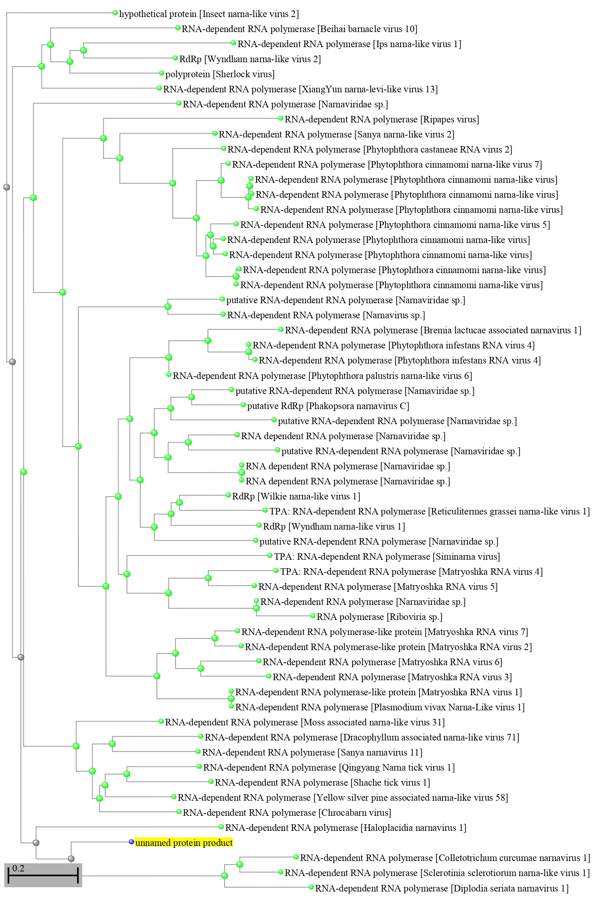
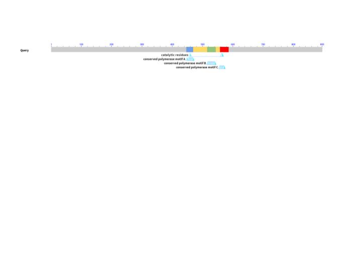
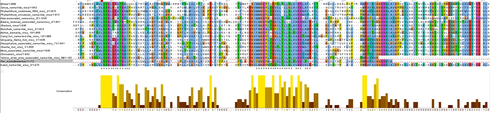
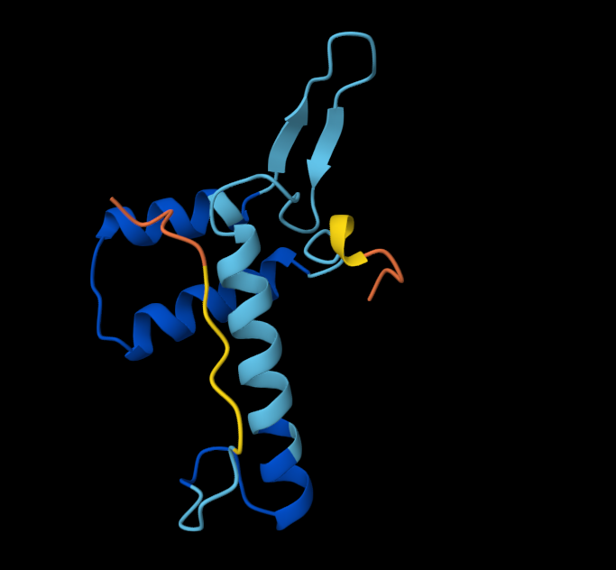

# Viral Fermentation: Novel Virus Pax mycesfermentum found in Saccharomyces cerevisiae
written by: Sabrina Xi

[Video Link](https://gitlab.ccbr.utoronto.ca/xisabrin/final-project/-/blob/main/Xi_PaxMycesfermentum.mp4)

### Pax mycesfermentum

Pax: the latin word for peace. This alludes to the "pacifist" or somewhat incidental nature of this virus. 
Myces: this is a component in the name of Saccharomyces cerevisiae, signifying "fungus". This alludes to the fact that its most common host is Saccharomyces cerevisiae and that its virus family most commonly affects fungi. 
Fermentum: the latin word for fermentation, which most of its hosts are involved with. 

## Abstract

Saccharomyces cerevisiae, also known more commonly as yeast, play a significant role in multiple industries. In particular, they have noted roles in baking and alcohol production. They are also being considered in other fields, including the production of cleaner fuels like bioethanol using sorghum [Fu, 2018]. Improved fermentation is then an attractive prospect. In this study, we address the possible roles viruses can play in this process, focusing on the discovery and characterization of a novel virus, Pax mycesfermentum, within yeast populations in China and Korea. We characterize this virus as a member of the Narnaviridae family and show that it aligns significantly with common traits found within this family. We additionally reviewed the literature with discoveries of P. mycesfermentum in other organisms capable of fermentation. We conclude that it likely plays a benign role within its host organisms, but determine inconclusive results regarding its role in this process. We also identify a possible case study giving insight into the method of viral transmission. Our results add to the existing body of knowledge regarding the poorly characterized Narnaviridae family, and underscores the importance of novel virus discovery through a critical lens not only focused on a virus as a harmful agent but also a potential vector for positive change. We also demonstrate the importance of and a technique for utilizing developing technological tools in virus discovery. As technology progresses, we anticipate seeing further efforts to build on the methodology detailed in this report, with significant results in the viral realm of the life sciences.

## Results

### Pax mycesfermentum Ecology

Pax mycesfermentum (P. mycesfermentum) has been found globally across different species, including in China, Korea, Costa Rica, Germany, Belgium, and the US. They were found through the Sequence Read Archive (SRA) where it was found in 12 bioprojects and was associated with 19 individuals SRA runs. Of these, 4 out of 12 Bioprojects (9 out of 19 runs) contained samples from Saccharomyces cerevisiae. 

These 4 Bioprojects included the index case (SRA run ID: ERR2676424, Bioproject ID: PRJEB24828), which corresponded to a paper by Fu et al. entitled "RNA-Seq-based transcriptomic analysis of Saccharomyces cerevisiae during solid-state fermentation of crushed sweet sorghum stalks" (2018). In this publication, Fu et al. demonstrated the increased effectiveness of a new strain of yeast (TSH3) in utilizing sweet sorghum stalks to conduct solid-state fermentation (SSF) to produce bioethanol. P. mycesfermentum was found in the novel strain TSH3 which improves fermentation, which led to our initial hypothesis regarding its role in fermentation [Fu, 2018]. However, of the 2 TSH3 replicates, our novel virus was found in only 1 at each timepoint, which makes it difficult for us to conclude the virus's role in this process. 

A further Bioproject (ID: PRJNA761852) investigating Saccharomyces cerevisiae investigated a similar track. They compared the fermentation and growth performance of flocculating and non-flocculating strains. Pax mycesfermentum was found in the flocculating strain that performed better--but it was also found in the other strain [Ye, 2022], leading us unable to present conclusive evidence in support of our hypothesis. 

Of the remaining yeast studies, one analyzed budding yeast respiratory oscillations [Weterings, 2024] while another examined the gene networks of wild yeast isolated with differing lifespans [Kaya, 2021]. Pax mycesfermentum was only found in one of many replicates in both studies. 

Pax mycesfermentum was also found in an additional study analyzing fermentation in Costa Rican Theobroma cacao. However, it was only found in 2 out of 16 runs [Verce, 2021]. Similarly, it was found in only one of multiple replicates in additional studies investigating buckwheat (1 out of 40) [Sohn, 2021], Blyxa echinosperma (1 out of 50) [Chen, 2022], Mus musculus (1 out of 10) [Centonze, 2020], Homo sapiens (1 out of 6) [Li, 2023], and Homo sapiens oocytes (1 out of 50) [Zhang, 2018]. 

Therefore, any results we may conclude regarding its function these organisms could only be held with low confidence. However, we can reasonably conclude that it likely plays a benign role in its hosts, as runs identified to have the presence of Pax mycesfermentum did not significantly differ in their experimental results compared to those which did not. 

Interestingly, there were two cases where Pax mycesfermentum was found in only 1 run out of multiple for the same sample. This included a study examining Apis [Wang, 2018] and a study examining long non-coding elements in Oryza sativa Nipponbare reproduction [Vega-Sanchez, 2012]. While this is likely a result from a contaminant or experimental design choice, we noted that it may be related to the virus's method of transmission. 

This may indicate that the virus does not transmit through horizontal transfer. This is additionally supported by our index case, where Saccharomyces cerevisiae were isolated from associated stalks. However, it is difficult to make any conclusions with a high level of confidence, as there are still few studies with a high number of Pax mycesfermentum. 

### Pax mycesfermentum Classification

Using the sotu (u157028) and palmprint sequence which were originally extracted from Serratus [Edgar, 2022], we identified the virus's probable family affiliation. 

We did so by accessing Blastp [Atlschul, 1990] and inputting the palmprint sequence. From this, we were able to get 100 hits. We narrowed them down to 48 hits by filtering for >40 percent identify and >90 coverage. The highest percent identity match (54.87%) was "insect narna-like virus 2". With the same score and e-value, and highest percent identity match not far behind at 50.43% was the "XiangYun narna-levi-like virus". Following, we also found "Dracophyllum associated narna-like virus 71", "Sanya narnavirus 11", "Beihai barnacle virus 10", "Moss associated narna-like virus 31", "Sherlock virus". 

We cross-checked this conclusion through Serratus [Edgar, 2022]. Using the index SRA run (ERR2676424) [Fu, 2018], we get Narnaviridae-23 as the top match. From these, we were able to conclude that the virus likely belongs to the Narnaviridae family. We constructed a phylogenetic tree highlighting this:

This likely also gives an explanation into its ecology and function, as viruses in the Narnaviridae family are known to have very simple genomes and be found in fungi, which yeast are members of. This also gives insight into its benign function, as many Narnaviruses do not have particular phenotypes associated with them. 

### Pax mycesfermentum Genome

To confirm our classification analysis, we delved deeper into Pax mycesfermentum's genome. Using tblastn [Altschul, 1990], we input the palmprint sequence and received a contigs, which we used to identify the virus's genome by mapping to the assembly genome. We then used ORFfinder to identify open reading frames (ORFs) within the genome [Rombel, 2002]. ORFfinder returned a single ORF encompassing the genome, which aligns with traits commonly found in other narnaviruses. However, we did identify 47 nested ORFs within this ORF.

We then input the resulting amino acid sequence to blastp [Altschul, 1990], which identified motifs and catalytic domains in the sequence. We also attempted to overlay additional domains using InterProScan [Blum, 2025], but this tool yielded no additional results, so we did not include them within the figure here. 

Figure 2. NCBI BLAST representation of the Pax Mycesfermentum genome. The ORF is not noted as it is represented by the whole genome. Catalytic domains, Motif A is represented in blue, Motif B is represented in green, and Motif C is represented in red. The RdRp is highlighted in yellow. 

We also visualized the top 17 highest percentage identity hits to the RdRp sequence of Pax Mycesfermentum from BlastP [Altschul, 1990] restricted to those with >90% query coverage and 40% identity. We also filtered out viruses with the same name or named 'Narnaviridae sp.', tie-breaking by percent identity. We aligned their sequences using MUSCLE [Madeira, 2024]. We visualized this using Jalview [Waterhouse, 2009], annotating the A and B motifs, which we can note are highly conserved. As these are mostly with viruses related to narnaviruses, this reinforces our belief that Pax Mycesfermentum is within this family. 

Figure 3. Jalview visualization of Pax Mycesfermentum RdRp (highlighted) and its top 17 highest percentage identity hits from BlastP with nucleotide conservation. The A and B motifs are also annotated below the sequences.

A similar investigation was carried out for the entire genome, but we elected not to show these findings as we felt these were more relevant. 

A possible protein structure was also visualized in Alphafold3 [Abramson, 2024]. We see that it has a relatively high confidence level, which supports our work done investigating Pax mycesfermentum's genome.

Figure 4. The predicted protein structure of the Pax Mycesfermentum RdRp using Alphafold3. Areas in dark blue represent very high confidence (plDDT >90), light blue represent moderate confidence (plDDT >70), yellow represent low confidence (plDDT >50), and orange represent very low confidence (plDDT <50).

## Discussion

In this report, we characterized Pax mycesfermentum as a novel virus belonging to the Narnaviridae family and most commonly found in Saccharomyces cerevisiae. Like most of its family, P. mycesfermentum is characterized by a naked RNA genome encoding its RdRp and retains their characteristic motifs. We also established its likely benign role in its host organism, without conclusive results on its role in fermentation. Our results add to the existing body of knowledge regarding the poorly characterized Narnaviridae, and establishes an existing methodology for the discovery of novel viruses. 

## References

**Bioinformatics Tools** 

Abramson, J., Adler, J., Dunger, J., Evans, R., Green, T., Pritzel, A., Ronneberger, O., Willmore, L., Ballard, A. J., Bambrick, J., Bodenstein, S. W., Evans, D. A., Hung, C.-C., O’Neill, M., Reiman, D., Tunyasuvunakool, K., Wu, Z., Žemgulytė, A., Arvaniti, E., … Jumper, J. M. (2024). Accurate structure prediction of biomolecular interactions with AlphaFold 3. Nature, 630(8016), 493–500. https://doi.org/10.1038/s41586-024-07487-w

Altschul, S. F., Gish, W., Miller, W., Myers, E. W., & Lipman, D. J. (1990). Basic local alignment search tool. Journal of molecular biology, 215(3), 403–410. https://doi.org/10.1016/S0022-2836(05)80360-2

Blum, M., Andreeva, A., Florentino, L. C., Chuguransky, S. R., Grego, T., Hobbs, E., Pinto, B. L., Orr, A., Paysan-Lafosse, T., Ponamareva, I., Salazar, G. A., Bordin, N., Bork, P., Bridge, A., Colwell, L., Gough, J., Haft, D. H., Letunic, I., Llinares-López, F., Marchler-Bauer, A., … Bateman, A. (2025). InterPro: the protein sequence classification resource in 2025. Nucleic acids research, 53(D1), D444–D456. https://doi.org/10.1093/nar/gkae1082

Edgar, R. C., Taylor, B., Lin, V., Altman, T., Barbera, P., Meleshko, D., Lohr, D., Novakovsky, G., Buchfink, B., Al-Shayeb, B., Banfield, J. F., de la Peña, M., Korobeynikov, A., Chikhi, R., & Babaian, A. (2022). Petabase-scale sequence alignment catalyses viral discovery. Nature, 602(7895), 142–147. https://doi.org/10.1038/s41586-021-04332-2

Madeira, F., Madhusoodanan, N., Lee, J., Eusebi, A., Niewielska, A., Tivey, A. R. N., Lopez, R., & Butcher, S. (2024). The EMBL-EBI Job Dispatcher sequence analysis tools framework in 2024. Nucleic acids research, 52(W1), W521–W525. https://doi.org/10.1093/nar/gkae241

Rombel, I. T., Sykes, K. F., Rayner, S., & Johnston, S. A. (2002). ORF-FINDER: a vector for high-throughput gene identification. Gene, 282(1-2), 33–41. https://doi.org/10.1016/s0378-1119(01)00819-8

Waterhouse, A. M., Procter, J. B., Martin, D. M., Clamp, M., & Barton, G. J. (2009). Jalview Version 2--a multiple sequence alignment editor and analysis workbench. Bioinformatics (Oxford, England), 25(9), 1189–1191. https://doi.org/10.1093/bioinformatics/btp033

SRA-Accessed Runs

Centonze, A., Lin, S., Tika, E., Sifrim, A., Fioramonti, M., Malfait, M., Song, Y., Wuidart, A., Van Herck, J., Dannau, A., Bouvencourt, G., Dubois, C., Dedoncker, N., Sahay, A., De Maertelaer, V., Siebel, C. W., Van Keymeulen, A., Voet, T., & Blanpain, C. (2020). Heterotypic cell–cell communication regulates glandular stem cell multipotency. Nature, 584(7822), 608–613. https://doi.org/10.1038/s41586-020-2632-y

Chen, L. Y., Lu, B., Morales-Briones, D. F., Moody, M. L., Liu, F., Hu, G. W., Huang, C. H., Chen, J. M., & Wang, Q. F. (2022). Phylogenomic Analyses of Alismatales Shed Light into Adaptations to Aquatic Environments. Molecular biology and evolution, 39(5), msac079. https://doi.org/10.1093/molbev/msac079

Fu, X., Li, P., Zhang, L., & Li, S. (2018). RNA-Seq-based transcriptomic analysis of Saccharomyces cerevisiae during solid-state fermentation of crushed sweet sorghum stalks. Process Biochemistry, 68, 53–63. https://doi.org/10.1016/j.procbio.2018.02.024

Kaya, A., Phua, C. Z. J., Lee, M., Wang, L., Tyshkovskiy, A., Ma, S., Barre, B., Liu, W., Harrison, B. R., Zhao, X., Zhou, X., Wasko, B. M., Bammler, T. K., Promislow, D. E., Kaeberlein, M., & Gladyshev, V. N. (2021). Evolution of natural lifespan variation and molecular strategies of extended lifespan in yeast. eLife, 10, e64860. https://doi.org/10.7554/eLife.64860

Li, L., Wen, J., Li, H., He, Y., Cui, X., Zhang, X., Guan, X., Li, Z., & Cheng, M. (2023). Exosomal circ-1199 derived from EPCs exposed to oscillating shear stress acts as a sponge of let-7g-5p to promote endothelial-mesenchymal transition of EPCs by increasing HMGA2 expression. Life sciences, 312, 121223. https://doi.org/10.1016/j.lfs.2022.121223

Sohn, H. B., Kim, S. J., Hong, S. Y., Park, S. G., Oh, D. H., Lee, S., Nam, H. Y., Nam, J. H., & Kim, Y. H. (2021). Development of 50 InDel-based barcode system for genetic identification of tartary buckwheat resources. PloS one, 16(6), e0250786. https://doi.org/10.1371/journal.pone.0250786

Vega-Sánchez, M. E., Verhertbruggen, Y., Christensen, U., Chen, X., Sharma, V., Varanasi, P., Jobling, S. A., Talbot, M., White, R. G., Joo, M., Singh, S., Auer, M., Scheller, H. V., & Ronald, P. C. (2012). Loss of Cellulose synthase-like F6 function affects mixed-linkage glucan deposition, cell wall mechanical properties, and defense responses in vegetative tissues of rice. Plant physiology, 159(1), 56–69. https://doi.org/10.1104/pp.112.195495

Verce, M., Schoonejans, J., Hernandez Aguirre, C., Molina-Bravo, R., De Vuyst, L., & Weckx, S. (2021). A combined metagenomics and metatranscriptomics approach to unravel costa rican cocoa box fermentation processes reveals yet unreported microbial species and functionalities. Frontiers in Microbiology, 12, 641185. https://doi.org/10.3389/fmicb.2021.641185

Wang, K., Fan, R.-L., Ji, W.-N., Zhang, W.-W., Chen, X.-M., Wang, S., Yin, L., Gao, F.-C., Chen, G.-H., & Ji, T. (2018). Transcriptome analysis of newly emerged honeybees exposure to sublethal carbendazim during larval stage. Frontiers in Genetics, 9, 426. https://doi.org/10.3389/fgene.2018.00426

Weterings, S. D. C., Eto, H., De Leede, J.-D., Giladi, A., Hoekstra, M. E., Beijk, W. F., Liefting, E. J. M., Van Den Anker, K. B., Van Rheenen, J., Van Oudenaarden, A., & Sonnen, K. F. (2024). NOTCH-driven oscillations control cell fate decisions during intestinal homeostasis. https://doi.org/10.1101/2024.08.26.609553

Ye, P. L., Wang, X. Q., Yuan, B., Liu, C. G., & Zhao, X. Q. (2022). Manipulating cell flocculation-associated protein kinases in Saccharomyces cerevisiae enables improved stress tolerance and efficient cellulosic ethanol production. Bioresource technology, 348, 126758. https://doi.org/10.1016/j.biortech.2022.126758

Zhang, Y., Yan, Z., Qin, Q., Nisenblat, V., Chang, H.-M., Yu, Y., Wang, T., Lu, C., Yang, M., Yang, S., Yao, Y., Zhu, X., Xia, X., Dang, Y., Ren, Y., Yuan, P., Li, R., Liu, P., Guo, H., … Yan, L. (2018). Transcriptome landscape of human folliculogenesis reveals oocyte and granulosa cell interactions. Molecular Cell, 72(6), 1021-1034.e4. https://doi.org/10.1016/j.molcel.2018.10.029

**Biological Background**

Hillman, B. I., & Cai, G. (2013). The family narnaviridae. In Advances in Virus Research (Vol. 86, pp. 149–176). Elsevier. https://doi.org/10.1016/B978-0-12-394315-6.00006-4

Hillman, B. I., & Esteban, R. (2011). Narnaviridae (No. 9; Virus Taxonomy: The Classification and Nomenclature of Viruses). ICTV. https://ictv.global/report_9th/RNApos/Narnaviridae

Wang, J., Chitsaz, F., Derbyshire, M. K., Gonzales, N. R., Gwadz, M., Lu, S., Marchler, G. H., Song, J. S., Thanki, N., Yamashita, R. A., Yang, M., Zhang, D., Zheng, C., Lanczycki, C. J., & Marchler-Bauer, A. (2023). The conserved domain database in 2023. Nucleic acids research, 51(D1), D384–D388. https://doi.org/10.1093/nar/gkac1096