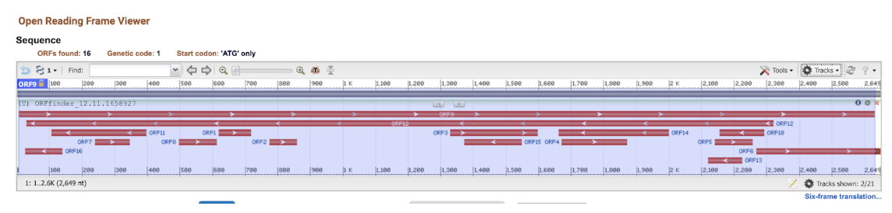

# Puccinia triticum - The silent killer of the world's food supply

written by: [Ryan Fu](https://github.com/yourname%20*optional%20link*)

### Puccinia triticum

(Puccinia for the fungus it resides in, triticum for the wheat plant the fungus infects)

## Abstract

Triticum aesitivum, or common wheat, as been a global food staple for centuries. The global reliance on the plant has resulted in wheat stripe, a disease that causes yellow stripes and discolorings, posing a massive threat to global food security. Currently, it is well known that fungal pathogens in the Puccinia species, namely Puccinia striiformis and Puccinia triticina, are primarily responsible for the infection. However, the advancement of sequencing technology seems to have unveiled a new mechanism for which fungal infeciton takes place. In this report, we characterize a novel virus - Puccinia triticum (PtV) that seems to be heavily correlated with wheat rust disease. Using serratus and NCBI databases, we were able to further sequence our viral genome and annotate it and uncovered a narnavirus with an ambigrammatic genome. Through this database, we also uncovered strong correlations with PsV5, an already discovred virus that seems to be a key contributor in wheat stripe rust. Taking it all together, our analysis provides a solid framework for uncovering the mechanism behind this phenomenom. Understanding how our novel virus functions and its structure can lead to developments in anti-viral treatments to combat wheat stripe rust and provide promote food security globally.

## Results

### Ecology subsection A...

Analyzing the SRA runs obtained from serratus, containing our sequence, we can determine which species’ our virus most likely infects.


Figure 1: First Rows of Table of SRR Observations obtained from Serratus containing our palmprint sequence Analyzing all runs we see that 19 came from Triticum aestivum, 44 came from Puccinia triticina, 31 from Puccinia striiformis f. sp. Tritici, 11 for Puccinia striiformis, 5 for phyllosphere metagenome, and one each of Puccinia coronata f. sp. Avenae, plant metagenome, Mus musculus, leaf litter metagenome, Brassica rapa. The Puccinia species are fungal pathogens, so it is highly likely these fungal pathogens host our virus. We also see a sizeable number of our SRR hits came from Triticum aesitivum, or common wheat. Investigating the metadata, we see that the SRR runs that had Triticum aesitivum were specifically infected with a disease called wheat stripe rust, when wheat develops yellow stripes and discolorings. The Triticum aesitivum in pretty much all SRR runs were also sequenced using RNAseq. Further researching, we can see that both Puccinia triticina and Puccinia striiformis are actually responsible for causing this disease (Manickavelu et al, 2010). Analysis of the species of our SRR runs, as such, provides high confidence that our virus lives in fungal pathogens of species Puccinia, and the virus sequence was found in Triticum aesitivum due to the fungus infecting it hosting the virus. In particular, I want to highlight Bioprojects PRJEB39201 - RNA-Seq of field samples of Wheat Yellow Rust uploaded into the Rust Expression Browser (Adams et al, 2021) and PRJNA725323 - Puccinia triticina (Pt76) Genome sequencing and assembly. Both measure RNA-seq but in two different samples, the prior performing RNAseq on yellow rust infected wheat and the latter performing RNAseq on samples of Puccinia triticina that has been extracted from yellow rust infected wheat. In particular, the presence of this sequence in both the fungus’ RNA and the infected wheat’s RNA allows us to hypothesize that both the fungus Puccinia triticina and Puccinia striiformis serve as a host to our virus, which then acts as a fungal pathogen that causes wheat rust disease in Triticum aestivum.\
Observing the blastp hits, we can see we get maximum hits of \~70% identity. As such, while our virus is most likely indeed novel, it is not highly diverged. Given this, it is possible we’ll be able to use already discovered virus’ in the following blastp hits to elucidate the function of our virus.

 Figure 2: Blastp run of our palmprint RdRp sequence using default settings.

The most notable hit is the putative Rdrp with accession WBC51218.1, referring to a paper describing a novel ambigrammatic mycovirus, PsV5 that allegedly works hand in hand with wheat rust fungus to promote infection (Zhang et al). This hit, especially with a %identity of 70% provides evidence for our primary hypothesis. This paper proposes a novel narnavirus PsV5 that contains an ambigrammatic sequence, meaning it contains a reverse ORF that overlaps the forward ORF and spans almost the entire genome. The authors then go on to claim that overexpression of both the forward and reverse ORF sequences result in boosted infection, while RNA interference of these mRNA molecules causes a much lower infection rate. Given how similar these two viruses are and how they both exist in the same host and infect the same species of wheat, I will adjust my primary hypothesis now to the following. Not only does our novel virus promote wheat rust infection, it works cooperatively with PsV5 to promote infection. Our digital ecology so far has simply proven a correlation relationship. However, I want to investigate these proteins as well as the literature on wheat rust to determine if any causal relationship exists.

### Virus Genome {Q3}

When analyzing our sequence’s ORF using ORFfinder, one interesting attribute I noticed was a long open reading frame spanning almost the entire genome (ORF9). Furthermore, I also notice a reverse ORF that also spans almost the entire genome, overlapping with ORF9 (ORF12). The rest of the ORFS in contrast, judging based on their short length, most likely do not encode for functional proteins (DeRisi J. L., 2019).

 Figure 3: ORF analysis of our full RdRp sequence, using ORF finder tool with default settings

We can use similar virus’ to determine what is occurring in our ORF analysis. Inputting the full Rdrp protein, we can use serratus to view a rough evolutionary tree of related PtV and related viruses’. Here, we can see PtV has highest alignment scores with narnaviruses - small positive-sense strand RNA virus encoding only an Rdrp (in other words lacking a protein capsid). One other interesting thing to note is that the virus nicknamed “unbowedTrestle” is most likely the already discovered PsV5.

 Figure 4: Evolutionary Tree generated by Serraturs using our RdRp sequence

Indeed, when we research this virus family, narnavirus do indeed tend to have a long ORF spanning almost the entire genome encoding for only a single Rdrp protein (DeRisi J. L., 2019). Furthermore, the presence of a long reverse open reading frame indicates that it is an ambrigrammatic narnavirus - a narnavirus that contains a long reverse open reading frame that spans almost the entire genome. While the function of ambigrammatic virus and the mechanism on which it transcribes this reverse ORF are unknown, the presence of a long uninterrupted reverse open reading frame is conserved amongst diverse narnaviruses, indicating some evolutionary importance for this feature (DeRisi J. L., 2019).

While not all ambigrammatic viruses actually encode a protein with this long rORF, the already discovered PsV5 was shown to encode this protein, so I will assume for this analysis that our novel PtV also has this feature. Given this, I will refer to the protein produced by rORF as rRdrp (reverse Rdrp) and ORF as fRdrp (forward). As such to test my hypothesis, I will conduct analyses on both rRdrp and fRdrp.

 Figure 5: Genome of PtV. A viral genome was obtained using tblastn, our Rdrp palmprint sequence, and the SRR run SRR12998698 - an RNAseq analysis of Thatcher avirulent wheat leaf rust that was infected by Puccinia triticina. Running tblastn (Blast+, Camacho et al, 2009) using our palmprint as a protein query and the SRR run as our database, we are able to obtain a file containing aligned sequences, specified in the file SRR1299869_aligned.fasta. The top alignment was then matched to a 2649nt sequence found in the logan assembly contigs of SRR12998698.

### PsV5 and PtV show similar molecular properties, but no evidence of interaction

Running AlphaFold3 to compare structures, no immediate similarities between the two appear, except for a similar intrinsically disordered loop (as shown by an orange loop indicating a low confidence in its structure, indicating it may be disordered). However, both structures have decently high confidence by AlphaFold3, as indicated by a pTM score (a measure to determine how likely a protein resembles its true structure, with \>0.5 being good resemblance) of 0.84 for PtV and 0.81 for PsV5.

 Figure 6: AlphaFold3 (Jumper, J, 2021) Analysis of PtV compared to PsV5. pIDDT scale indicates confidence in protein structure.

However, analyzing the individual peptides reveals much greater similarity. When analyzing plots produced by PepInfo by EMBOSS, we notice similarities in residue properties, particularly in charged residues for both proteins.

 Figure 7: Charged residues of PtV. EMBOSS PepInfo was used for analysis. Lines represent areas where a charged residue was found

 Figure 8: Charged residues of PsV5. EMBOSS PepInfo was used for analysis. Lines represent areas where a charged residue was found

While their structures may not be identical, similar residues can indicate similar protein domains and functions, providing further evidence for our primary hypothesis that PtV is involved in promotion of wheat rust.

To determine molecular binding affinity between the two, molecular docking would need to be performed. Unfortunately, I was unable to do this due to the computing resources I have and paywall constraints, but I attempted to simulate a toned down version using PyMol. In PyMol, I was able to obtain a predicted multimer of the two proteins (unfortunately, no binding energy for Gibbs free energy results were available).

 Figure 9: PyMol (DeLano D. L, 2002) rendering of PsV5 (already characterized virus simikar to ours), PtV (our virus), and a PtV and PsV5 multimer. 3D structures were downloaded in .pdb format using AlphaFold2 (Jumper et al, 2021), available on google collab.(<https://colab.research.google.com/github/sokrypton/ColabFold/blob/main/AlphaFold2.ipynb>).

In addition, one of the many ways protein have binding affinity is through interactions such as hydrogen bonds, and salt bridges. In PyMol, with the assistance of ChatGPT, I was able to 1) Identify the charged residues on the interfaces between the proteins and 2) Use it to display any salt bridges that may have formed in the interaction.

 Figure 10: Analysis of salt bridges, as produced by PyMol. Structure was created by entering .pdb field into PyMol int he same workflow as figure 9. Salt bridges were added by adding an interface of the two proteins, labelling charged residues, and then drawing salt bridges such that the distance is less than 3.5A (assisted by ChatGPT).

However, nothing major appeared. Given this, with low confidence, I conclude that these two proteins most likely do not form an interaction and do not work cooperatively in the wheat rust infection mechanism. That being said, it is highly likely both proteins share similar evolutionary history, due to similar structures and similar hypothesized functions.

### The reverse open reading frame protein (rRdRp) is intrinsically disordered

rRdRp’s functional and structure remains elusive: To conclude my analysis, I will be analyzing the protein sequence formed by rRdRp. I first analyzed the protein, again, in the AlphaFold3 webserver.

 Figure 11: AlphaFold3 (Jumper, J, 2021) analysis of the rRdRp protein encoded by the reverse ORF of PtV

As we can see, this protein seems to display extremely low confidence by AlphaFold3, with a pTM of just 0.13. Running the sequence through InterPro, we again find no hits. The protein also is strictly composed of protein sequences with a low pLDDT. As previously, low pLDDT has been seen to be associated with disordered proteins (Bruley, 2022). While a structure was unable to be generated, we cannot conclude with confidence this protein is not functional.

## Discussion

Using our virus' palmprint sequence, we identified its host species as Puccinia fungal pathogen. We identified a similar virus with \~70% identity - PsV5 and used it to link PtV to causing wheat rust in Triticum aesitivum. Although no causal relationship exists between the two viruses, we have concluded PtV is an ambigrammatic narnavirus, producing an RdRp similar in structure with PsV5, providing evidence that our novel virus is responsible for the devastating wheat rust disease. In the future, we hope advancements in molecular docking and simulations can reveal potential interactions between the two viruses and their genomes, providing an anti-virulent mechanism for preventing wheat rust.

## References

Manickavelu, A., Kawaura, K., Oishi, K., Shin-I, T., Kohara, Y., Yahiaoui, N., Keller, B., Suzuki, A., Yano, K., & Ogihara, Y. (2010). Comparative gene expression analysis of susceptible and resistant near-isogenic lines in common wheat infected by Puccinia triticina. DNA research : an international journal for rapid publication of reports on genes and genomes, 17(4), 211–222. <https://doi.org/10.1093/dnares/dsq009>

Adams, T.M., Olsson, T.S.G., Ramírez-González, R.H. et al. Rust expression browser: an open source database for simultaneous analysis of host and pathogen gene expression profiles with expVIP. BMC Genomics 22, 166 (2021). <https://doi.org/10.1186/s12864-021-07488-3>

Zhang, Y., Liang, X., Zhao, M., Qi, T., Guo, H., Zhao, J., Zhao, J., Zhan, G., Kang, Z., & Zheng, L. (2023). A novel ambigrammatic mycovirus, PsV5, works hand in glove with wheat stripe rust fungus to facilitate infection. Plant communications, 4(3), 100505. <https://doi.org/10.1016/j.xplc.2022.100505>

Camacho, C., Coulouris, G., Avagyan, V., Ma, N., Papadopoulos, J., Bealer, K., & Madden, T. L. (2009). BLAST+: architecture and applications. Nucleic Acids Research, 37(Web Server issue), W5–W9. <doi:10.1093/nar/gkp324>

Jumper, J., Evans, R., Pritzel, A., Green, T., Figurnov, M., Ronneberger, O., … Hassabis, D. (2021). Highly accurate protein structure prediction with AlphaFold. Nature, 596, 583–589. <doi:10.1038/s41586-021-03819-2>

DeLano, W. L. (2002). The PyMOL Molecular Graphics System. DeLano Scientific LLC, San Carlos, CA.

Gruber, A. R., Lorenz, R., Bernhart, S. H., Neuböck, R., & Hofacker, I. L. (2008). The Vienna RNA websuite. Nucleic acids research, 36(Web Server issue), W70–W74. <https://doi.org/10.1093/nar/gkn188>

DeRisi, J. L., Huber, G., Kistler, A., Retallack, H., Wilkinson, M., & Yllanes, D. (2019). An exploration of ambigrammatic sequences in narnaviruses. Scientific reports, 9(1), 17982. <https://doi.org/10.1038/s41598-019-54181-3>

Fukuda, M., Cai, J., Bader, J. S., & Boeke, J. D. (2023). Pervasive RNA folding is crucial for narnavirus genome maintenance. Proceedings of the National Academy of Sciences of the United States of America, 120(26), e2304082120. <https://doi.org/10.1073/pnas.2304082120> [PubMed+1]{.underline}{alt="<https://pubmed.ncbi.nlm.nih.gov/37339222/?utm_source=chatgpt.com>"}

Bruley, A., Mornon, J. P., Duprat, E., & Callebaut, I. (2022). Digging into the 3D Structure Predictions of AlphaFold2 with Low Confidence: Disorder and Beyond. Biomolecules, 12(10), 1467. <https://doi.org/10.3390/biom12101467>

# Viral Short Story

```         
Once upon a time, Francis was used to working late, but this was rough. As he was pipetting Sample 31337, the glare of the rising sun blinded him, and instinctively his grip tightened. A single drop of the sample fell past his bench unnoticed, soaking into his converse.
This was the beginning, but the significance of this day would not be felt until months later, and by then it was too late. Everything changed...
As always, Francis returned home to his farm. There, he tended his wheat as usual, providing grain and bread for the whole kingdom. However, over the next few months, a strange disease overcame the field. After a month, Francis looked on in horror as his wheat field became infested with some sort of disease. Yellow stripes and orange-red pustules started appearing on leaves. Not just his wheat, but his grapevine and yellow pine as well. Something seriously has gone wrong, and if he didn’t figure it out, the kingdom would be left without food and he would surely be sent to a gruesome death.
He took a sample to bring back to his lab and discovered a fungus had rapidly multiplied across his field. Francis knew this was unnatural. Something foreign to their land had infected his fields. In horror, he scrambled with his lab and discovered the source - sample 31337 had amplified the fungus' activities. Panicking, Francis sought to sequence his sample, discovering an ambigrammatic coding pattern. However, it was too late. The king discovered the wheat fields and promptly executed him.
```
