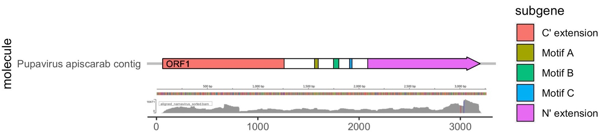
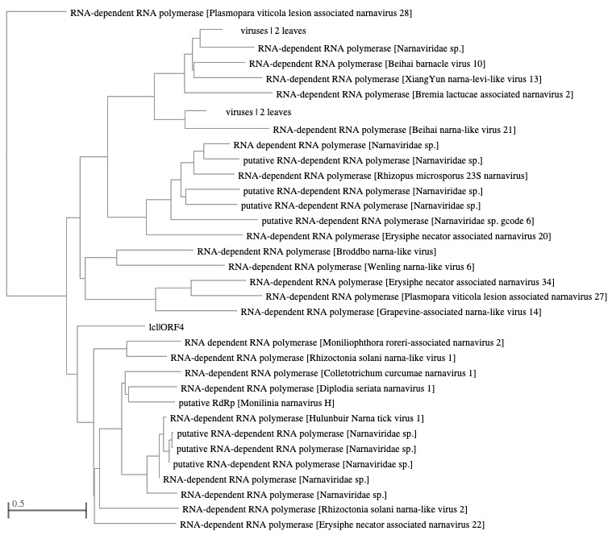
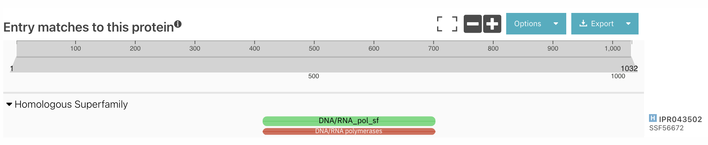
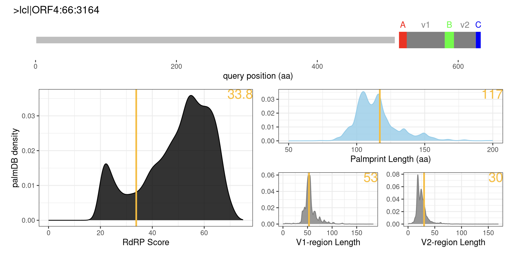
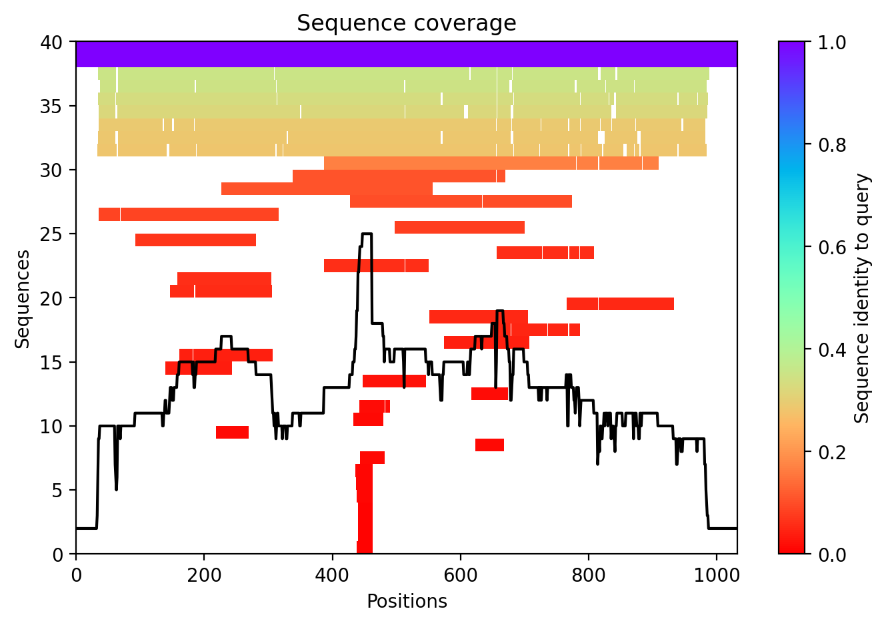
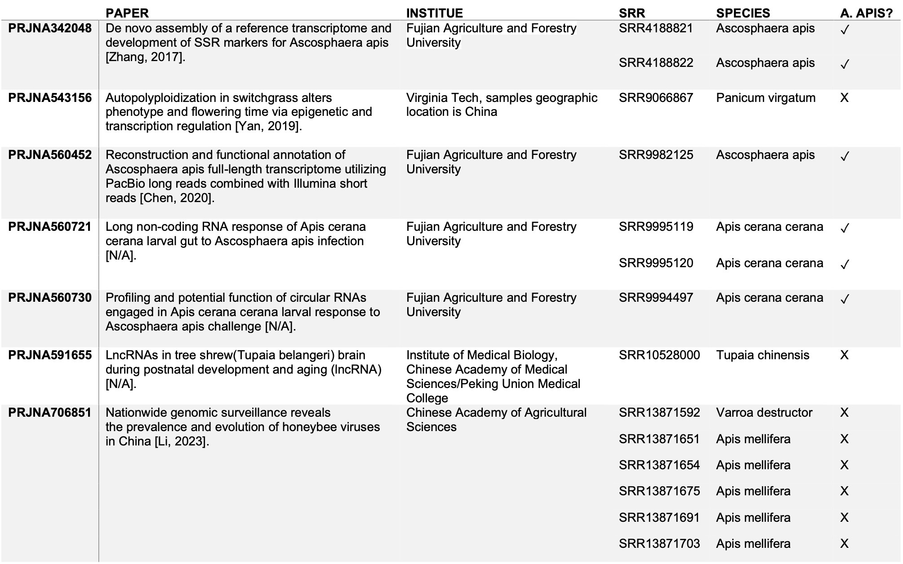

---
bibliography: img/pupavirus_apiscarab/a3_references.bib
nocite: '@*'
---

# A Viral Metamorphosis: Novel Virus Pupavirus apiscarab Found in Honeybee Populations in China
written by: [Katarina Vucic](https://github.com/katarinaavucic)

### Pupavirus apiscarab 
```
Pupa: The latin word for cocoon. This virus uses the Ascosphaera apis fungus as its host, 
which causes chalkbrood disease to honeybee larvae, causing them to look like they are in cocoons.

apis: The genus for honeybees, which are the direct host of this virus.

scarab: A reference to The Mummy (1999). Ascosphaera apis kills larve by entering their 
digestive system and feeding on their inside nutrients, which reminded me of the scarab beetles from The Mummy. 
```

## Abstract
```
Bees play a crucial role in our ecosystem as essential pollinators, contributing significantly 
to biodiversity and food security. Maintaining the health of beehives is imperative for sustaining 
honey production, and a key factor influencing bee health is the prevalence of viruses. One 
particularly detrimental disease is Chalkbrood disease, known to infect beehives and lead to the 
death of bee larvae. In this study, we address the challenge posed by fungal and viral infections, focusing 
on the discovery and characterization of a novel virus, Pupavirus apiscarab, within honeybee 
populations in China. Here, we reveal the emergence of Pupavirus apiscarab, a highly diverged 
narnavirus with a unique genomic and protein domain composition, representing a potential 
threat to bee populations. Contrary to existing assumptions about narnaviruses, our findings 
suggests that Pupavirus apiscarab exhibits a broad host range, potentially infecting both Apis cerana and 
mellifera honeybees. Additionally, its utilization of the fungus Ascosphaera apis as a transmission
vector, coupled with evidence of horizontal transfer by honeybees and mites, challenges prior 
understanding. This study not only prompts a critical reassessment of viral characteristics but 
also emphasizes the urgent need to comprehend and mitigate the potential consequences of Pupavirus
apiscarab's novel presence on the vital role of bees in pollination and ecosystem health. By shedding
light on the intricate dynamics between viruses and their essential pollinator hosts, this research 
underscores the pressing importance of preserving bee populations for global biodiversity and food security.
```

## Results

```
Pupavirus apiscarab (hereby shorted to P. apiscarab) is a highly diverged narnavirus 
that affects honeybee larvae in China. Throughout this study, we will characterize several 
features about this virus.
```

### P. apiscarab is a highly diverged narnavirus.
```
P. apiscarab was a previously unidentified virus that was obtained from the serratus database
with palmID u136737. To investigate the taxonomy of this virus, we identified the possible 
contig for an RdRp (hereby termed contig 1) and used ORFfinder to determine the ORFs associated 
with this RdRp. The resulting search showed one long sense-strand ORF (hereby termed ORF1) that had 
a length of 3099 nucleotide bases. We mapped the transcripts from SRA run SRR9982125 to ORF1 to 
generate a coverage profile of ORF1, and used information from palmID to map the RdRp on the genome (Figure 1).
```


Figure 1: The virus genome of Pupavirus apiscarab. ORF1's coverage is represented by the arrow, with specific regions coloured. The RdRp is the sequence between the C' and N' extension, and contains the A, B, and C motifs. The bottom scale shows the coverage profile of reads mapped to contig 1. Figure generated using SRA toolkit, bowtie2, and samtools, and inspired by [Gupta, 2023].

```
To investigate the phylogenetic basis of this virus, we put ORF1 through NCBI blastp and found the
highest matches were to narnavirusus, and that they were found to have a percent identity of 
less than 37%, thus indicating that is virus is likely a highly diverged narnavirus (Figure 2). 
Narnaviruses are positive single-stranded RNA viruses [ICTV]. These viruses have a genome length 
between 2.3 and 2.9 kilobases and encode a singular protein, the RdRp [Viral Zone].
```


Figure 2: NCBI BLAST Taxonomy of the P. apiscarab ORF1 (here termed ORF4). It is closely associated with other narnaviruses, but splits off from the rest early on in the tree. Figure generated by [NCBI Blast]. 

```
As a validation that P. apiscarab is a diverged narnavirus, we used InterProScan to see if
there were any other domains located in ORF1. Similar to the characteristic observed in narnaviruses, 
InterProScan predicted only one protein domain in this contig, that of the RdRp (Figure 3). Thus, 
we can conclude that P. apiscarab is a highly diverged narnavirus.
```

Figure 3: Predicted Protein Domains for ORF1 in P. apiscarab, generated by InterProScan [Paysan-Lafosse, 2022].

### P. apiscarab has a diverged RdRp sequence. 
```
Since narnaviruses are small single-stranded viruses, it was intriguing that the percent 
identity was so low. In order to determine more about the divergence of this virus, we used 
palmID to check the conservation of the RdRp. palmID reported a 33.8 RdRp score, which is on 
the lower scale of RdRp scores (Figure 4). To interrogate the RdRp a little further, we put 
the structure through AlphaFold2 and found that the prediction had low confidence, including 
in the 417-649 range where the RdRp is (Figure 5). This was further proof that the narnavirus
is highly diverged, and gave us the idea that it might be a unique virus.
```

Figure 4: Scan of P. apiscarab's RdRp palm sequence, indicating that the palmprint of the RdRp sequence is different that the typical RdRp. Figure generated with Serratus palmID [Babaian and Edgar, 2022].


Figure 5: AlphaFold2 Prediction using ColaFold for P. apiscarab shows poor sequencing coverage on regions containing the RdRp [AlphaFold2].

### P. apiscarab is a virus that affects bees in China.
```
With the novelty of this virus in mind, we sought to determine what this virus might infect.
Using the information from Serratus and the SRA, we were able to pull out the samples where 
the virus was found [SRA]. This virus was identified in 14 samples, in 6 different species, 
belonging to 7 studies. An overview of this data can be found in Table 2. We aimed to find 
the connection between these species and what specifically the virus is infecting. 
We discovered that this novel virus was found in several samples in the honeybee ecosystem, 
including the eastern honeybee (Apis cerana cerana), the western honeybee (Apis mellifera), 
a fungus that infects honeybees (Ascosphaera apis), and a parasitic mite that attacks and 
feeds on honeybees (Varroa destructor). Additionally, all cases of the virus were found in 
studies performed in China (Table 1). 
```

Table 1: Overview of BioProjects containing P. apiscarab. BioProjects with no assosciated paper have [N/A] instead of a publication. Additional information includes the Institute that published the paper, and assosciated SRR runs that include P. apiscarab. Each SRR has the documented species and whether or not Ascosphaera apis was present in the data for that run.


### P. apiscarab is a mycovirus that uses A. apis as a transmission vector
```
Ascosphaera apis (hereby shortened to A. apis) is a fungal pathogen of Apis mellifera honeybee
larvae that results in chalkbrood disease, where the fungus drains the larvae of nutrients until
it starves to death. This fungus was confirmed in 5/14 of the SRA runs, indicating the possibility
of co-occurence with the virus. Additionally, P. apiscarab was found in two different studies that
involved building the A. apis transcriptome. 
The aim of the first study was to de novo assemble a reference transcriptome of A. apis spores 
during infection of A. mellifera and A. cerana honeybees (BioProject PRJNA342048). They performed 
this by purifying A. apis spores, feeding them to A. mellifera and A. cerana honeybees, and then 
sequencing the infected larval guts [Zhang, 2017]. The virus was found in two out of three of the
samples generated from this experiment. The SRA showed that only 20-35% of these reads were identified,
making it difficult to determine the quantity of virus found in these sets.
The second study was performed with the goal of using PacBio single-molecule real-time (SMRT) sequencing 
to generate a transcriptome of A. apis (BioProject PRJNA560452). In this experiment, they obtained the 
A. apis from A. mellifera larvae, cultured the spores until they grew into mycelia, and then purified 
and sequenced the mycelia [Chen, 2020]. In these results, the virus is only found in the mycelia and 
not in the spores [Chen, 2020]. Since the SRA could only identify 67% and 79% of these reads for spore 
and mycelia samples, respectively, our current hypothesis is that the virus was present in the spores, 
but at an undetectable amount that the SRA could not pick up on.
Taken together, we can see that there is some form of correlation here, where the virus is using the
fungi as a host. Due to the purification process of these experiments, it is highly unlikely for the
presence of the virus to be due to contamination.
```
```
The other three samples containing A. apis were transcriptomic profiles of Apis cerana honeybees. 
Interestingly, A. apis has no effect on Apis cerana, which have been found to have immunity to the
fungus, creating a point of interest for researchers to study.
One such project involved looking at if lncRNA levels change when Apis cerana honey bees undergo 
infection by A. apis (BioProject PRJNA560721). Interestingly, the virus was found in both the 
control and infected honey bee samples, despite the fact that the control was designed to be 
unaffected by the fungi. This poses an interesting question: was the virus there through 
contamination or was the virus in both samples independent of the fungus. We attempted to look more
into this, however, there is no paper associated with this study, so we were unable to uncover more
about the design of the experiment and how these samples were obtained. Thus, it is unclear whether
this virus was there by contamination or pre-existed in this sample.
The other Apis cerana sample was from a study by the same group that involved looking at how circRNAs
are involved in A. cerana larval response to A. apis (BioProject PRJNA560730). In this experiment, 
their test sample had the virus while their control run did not, which is what we would expect to see. 
Since we know for sure that the control sample had the virus, we wanted to see if it also had traces 
of the fungus that might have gone undetected. Using STAT SRA, we found trace amounts of Ascosphaeraceae 
and Narnaviridae in the Apis cerana SRRs (Table 2). We also found that there seems to be a corelation
between the amount of Ascosphaeraceae and Narnavidae in the sample. 
```

Table 2: Counts of Ascosphaeraceae and Narnaviridae reads in Apis cerana treatment and control samples


```
With this potential correlation in mind and due to the co-occurence of several samples with A. apis, 
we propose that P. apiscarab uses A. apis as a vector to infect its host. The relationship between
A. apis and P. apiscarab remains elusive, however, it is possible that P. apiscarab could be related 
to Chalkbrood disease, although further research needs to be done.
```

### P. apiscarab is spread through horizontal transfer
```
 P. apiscarab was also found in five A. mellifera and one Varroa destructor samples that were 
unrelated to A. apis (BioProject PRJNA706851). These samples were generated in a study 
investigating honeybee viruses in China, where they identified 23 novel viruses, although none of
them are Narnaviruses or belong to a related clade. These samples were pooled from 155 libraries 
of honeybee and mite samples obtained from 326 honeybee colonies in various locations in China 
between 2016 and 2019 [Li, 2023]. We ran SRA STAT on these samples to determine if A. apis (or 
related families) were found in these samples, and no hits were found.
Taking into consideration the wide variety of samples, nature of A. apis’ attack system on Apis
mellifera, and the fact that A. apis is not found in these samples, we hypothesize that P. apiscarab
is able to infect its host through horizontal transfer. In essence, since A. apis spreads between
colonies through feeding, the virus is able to infect A. mellifera adults when they come into contact
with A. apis. It is also likely that P. apiscarab can be spread through Varroa destructor mites 
when they feed on honeybees.
```

```
Finally, P. apiscarab was found in a run with Panicum virgatum (switch grass) and Tupaia belangeri
(tree shrew). We wanted to determine if this virus could be found in a specific microbiome or if 
these were due to contamination. To do this, we ran MGnify Search on contig 1, however no significant
results were generated [Richardson, 2023]. Thus, the inclusion of the virus in this sample was likely
due to some sort of contamination.
```

## Discussion

```
The discovery of Pupavirus apiscarab within honeybee populations in China unveils a new chapter
in our understanding of the intricate relationship between viruses and essential pollinators. 
This highly diverged narnavirus presents a unique genomic makeup and protein domain composition 
against narnaviruses. Its broad host range, including the association with a fungal pathogen that 
allow it to infect honeybees, raises the question of if this virus promotes Chalkbrood disease. 
Furthermore, the unexpected identification of P. apiscarab in unrelated A. mellifera samples suggests
the possibility of horizontal transmission, broadening our understanding of how this virus spreads.
The fascinating aspect of narnaviruses utilizing fungi for infecting their primary host adds a layer
of complexity to the virus-host relationship as we know it. This analysis of this mechanism in P. apiscarab
contributes to our understanding of these viruses. This research not only characterizes a novel virus but
also underscores the urgency in comprehending and mitigating the potential consequences of this novel 
viral presence on the pivotal role of bees in sustaining global biodiversity and ensuring food security.
```

# Viral Short Story

```
Once upon a time, ethereal fairies would tiptoe into homes, drawn to the laughter of lively children. 
These were no ordinary fairies; they carried a mysterious enchantment, a kind of magic that could 
leave even the mightiest creatures weary.

With mischievous glints in their eyes, the fairies would spin tales of weariness, claiming only a 
bright child's energy could revive their fading glow. Alone in their homes and eager to be part 
of the enchantment, children would twirl and dance, offering their vibrant spirits to the fairy's spell.
Little did they know, the fairy, like a sly sorceress, absorbed their light, leaving the children tired 
and drained.

In the quiet of the night, when the moon cast its silvery glow upon the village, one such fairy entered 
a home with a creak of the door. The child within, curious and innocent, sensed a fluttering presence. 
The fairy, with wings shimmering like stardust, approached the child with a gentle whisper.

"I am a traveler of dreams, a seeker of the purest light," the fairy crooned, its eyes holding a captivating
sparkle. "Your laughter, dear child, is a melody that can awaken the dormant magic within me. Will you 
share it with me?"

The child, enchanted by the fairy's otherworldly beauty, agreed. And so, the dance began. The child twirled 
and giggled, casting a radiant aura that enveloped the room. The fairy, with each pirouette, absorbed the
vibrant energy, a silent theft hidden behind the enchanting facade.

As the dance reached its crescendo, the child, now breathless and exhausted, felt a sudden weariness. 
The fairy, wings now aglow, whispered gratitude and vanished into the night, leaving behind a drained
and sleepy child.

As the village slept, the fairies fluttered away with their pet mites, carrying the stolen energy 
on their wings. Much like a secret breeze, they traversed from the West to the East, spreading their
enchantment far and wide. 

This tale became a whispered warning among the village youth. They learned to discern the true nature 
of visitors, for not every fluttering wing carried the song of a friend. And so, the children held onto 
the magic of caution, ensuring they remained vigilant against the beguiling enchantment of the fairies 
who sought to steal their light.
```

## [References](img/pupavirus_apiscarab/a3_references.bib)
