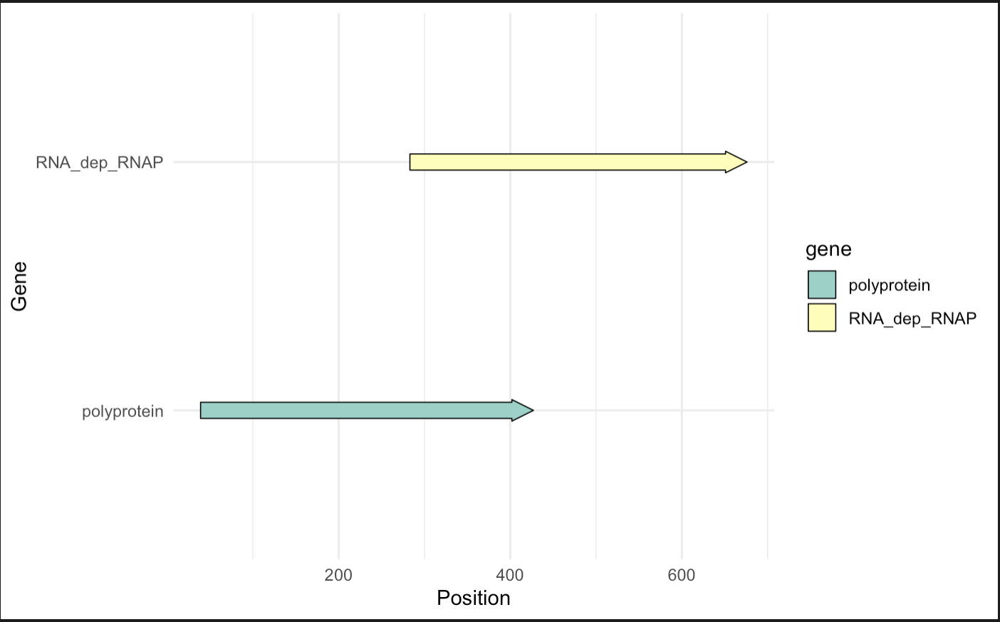
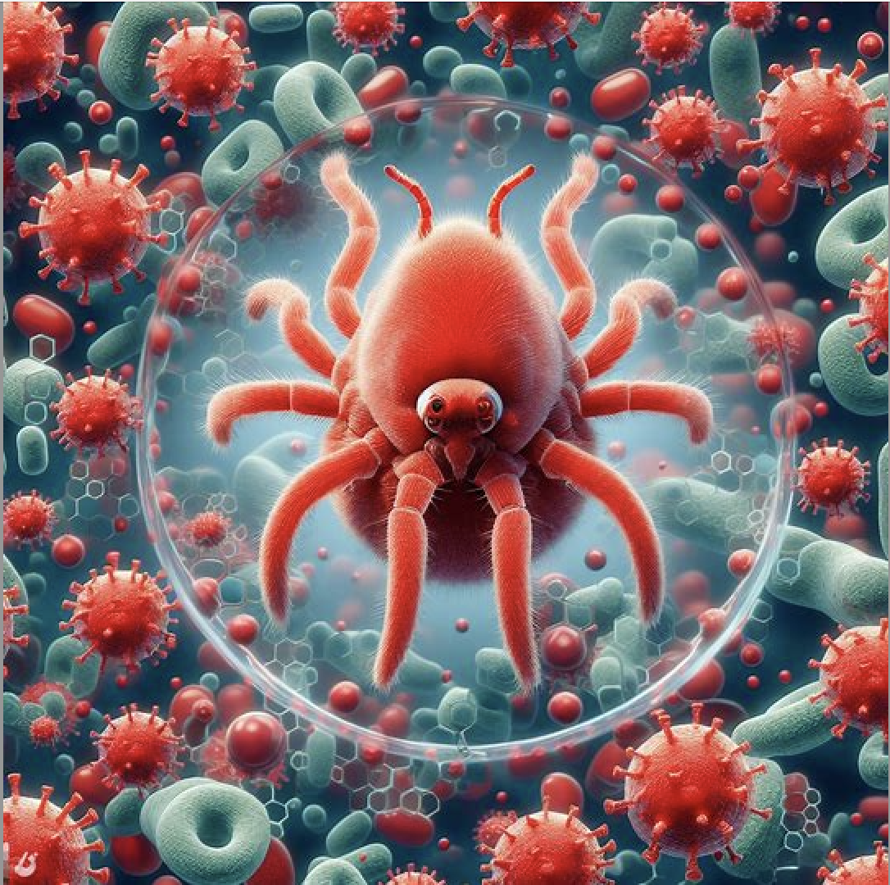

# Adaptability of Red Mite Associated Hypovirus 1 across different hosts
written by: [Krutika Joshi](https://github.com/ika-joshi)

### Versatilis Adaptabilis
Versatilis stands for versatile and Adaptabilis means adaptable. Red Mite Associated Hypovirus 1 is known to be versatile based on the research as it is able to infect multiple host species. It needs to be adaptable in order to infect and survive in different hosts.

## Shadows of Hypovirus

## Abstract: Cross-Species Adaptability and Genomic Insights of Red Mite Associated Hypovirus 1

Red mite associated hypovirus 1 is a member of the Hypoviridae family[ICTV, n.d]. The Hypoviridae family is known for its positive-sense RNA genome and adaptability across different species [ICTV, n.d]. Typically having genome lengths between 7.3 and 18.3 kb, hypoviridae are unique because they have large open reading frames (ORFs) translated by noncanonical mechanisms [ICTV, n.d]. This study aims to analyze biotic and abiotic factors related to Red mite associated hypovirus 1. Specifically, this study focuses on the presence of Red mite associated hypovirus 1 in fungal, human, and plant tissues hosts suggesting its high adaptability to different environments. Although Red mite associated hypovirus 1 can infect a broad spectrum of hosts, little research has been conducted on the mechanisms through which this virus replicates and adapts. This research found three publications with Red mite associated hypovirus 1 viral genomic information in the publication's data set. The commonality found between the data sets was the identification of RNA-dependent RNA polymerase (RdRP) enzymes and RNA dependent RNA polymerase (RNAP) [Tirosh et al., 2018 & Liu et al., 2019 & Gu et al., 2020]. As a result of both of these factors, the virus was able to produce polyproteins and siRNAs, which enables its survivial and proliferation across a wide variety of host organisms [Tirosh et al., 2018 & Liu et al., 2019 & Gu et al., 2020]. Identifying the mechanisms allowing cross-species transmission and the evolutionary dynamics of host-virus interactions in Red mite associated hypovirus 1 is a vital part of virology [ Dianzani   et al., 1996]. Based on the study, Red mite associated hypovirus 1 is capable of adapting to a variety of biological systems and environmental conditions, suggesting a history of multiple host switches [Elena et al., 2009].

## Results

### Ecology: Deciphering the Versatility of Red Mite Associated Hypovirus 1 Across Fungi, Human, and Plant Hosts

There were 3 publications where characteristics of Red mite associated hypovirus 1 were observed. This section of the assignment aims to analyze biotic and abiotic aspects of the publications to study and delve deeper into the understanding of the Red mite associated hypovirus 1. 

The first publication is a study conducted by Liu et al. from Huazhong Agricultural University. This study focused on studying the interaction between Tremella fuciformis and Annulohypoxylon stygius by examining the RNA-sequence data. Tremella fuciformis is a white jelly mushroom meanwhile Tremella fuciformis is its companion fungus [Liu et al., 2019]. There are 3 data sets associated with this publication with the accession number as SRR8689296, SRR8689295 and SRR8689294. The first two accession numbers map to data sets that focus on Annulohypoxylon stygius. Meanwhile the last accession number maps to a data set that focuses on Tremella fuciformis. All these three data sets associated with this publication had Hypoviridae RNA genetic information present in them which was examined via serratus.io and blast. Specifically, through the search, it was found that all the three datasets had Putative conserved domain for RdRP_4 and RNA_dep_RNAP with accession pfam02123 and cd01699 respectively. RdRP_4 stands for RNA-dependent RNA polymerase proteins (RdRPs) 4 and is usually found in Luteovirus, Totivirus and Rotavirus  [Liu et al., 2019]. Every virus with an RNA genome encodes RNA_dep_RNAP as an essential protein  [Liu et al., 2019]. RdRp catalyzes the synthesis of the RNA strand complementary to a given RNA template. Many viruses produce RdRps as a result of the processing of polyproteins [Liu et al., 2019].  

The second publication is a study conducted by Torish et al from NHGRI/NIH. This study aims to provide insight into the relation between the immune system and various viral pathogens on the skin [Tirosh et al., 2018]. In humans, DOCK8 is a protein that is encoded by the DOCK8 gene [Tirosh et al., 2018]. A rare primary immunodeficiency known as DOCK8 deficiency is caused by a lack of DOCK8 [Tirosh et al., 2018]. DOCK8 regulates the actin cytoskeleton, which is important for the movement of immune cells within tissues [Tirosh et al., 2018]. The accession number associated with the data set is SRR10951073. This data set was collected by extracting RNA from skin and nares from DOCK8-deficient patients. The viral genetic component from this data set was examined by using serratus.io and blast. It was found that Papillomaviridae, Polyomaviridae, Poxviridae, Parvoviridae and Herpesvirida have sequence level matches. Specifically, there was a 100 percent match for Papillomaviridae and Polyomaviridae with the data set. 

And lastly, a study conducted by Gu et al. from Northwest A&F University. This study aimed to study the resistance of Solanum pinnatisectum to Phytophthora infestans. The data set associated with this publication is a RNA-sequence data that contained viral RNA components, specifically Betaflexiviridae_RdRp and RdRP_2 with accession cd23245 and pfam00978 respectively. Betaflexiviridae_RdRp are usually found in positive-sense single-stranded RNA viruses [Gu et al., 2020]. These viruses typically infect plants that possess replication proteins that are similar to those found in alphaviruses [Gu et al., 2020]. Similar to RdRP_4, RdRP_2 are produced as a result of the processing of polyproteins [Gu et al., 2020]. 

An important finding across all datasets was the identification of RdRP enzymes, which play a crucial role in viral replication. As a result of their widespread presence across different host species, Red mite associated hypovirus 1 must be able to adapt to diverse ecological conditions. The three data sets consisting of fungi, human skin cells, and plant tissues contain this viral genetic information indicating that this virus is highly adaptable thus allowing its spread through species. A wide variety of ecosystems are also covered by the datasets. Liu et al. focused their study on fungi which are grown in decayed wood ecosystems. Torish et al. focused on human skin microbiomes and Gu et al. focused on plant pathology. This virus has shown potential of thriving under a wide range of environmental conditions [Elena et al., 2009]. It is possible that multiple host switching events have occurred during the evolution of this virus, as evidenced by the diversity of hosts, ranging from fungi to humans and plants [Elena et al., 2009]. Most likely, this virus's ability to adapt to diverse biological systems is a result of its genetic makeup [Elena et al., 2009]. 


### Virus Genome: Visualizing the Open Reading Frames of Red Mite Associated Hypovirus 1


Figure 1: This figure depicts the ORF for RNA dependent RNAP and polyprotein. Both the ORF have have partial CNS. The start and stop locations for the ORF were collected from ORFfinder from blast. The polyprotein ORF had the amino acid code of:
```
MEDRQNDQNDDVFSFFSPSFSAATPSTLFNRSAYSSSSSSGDDESQPSVDDSNKRIDYMIQFLDRRLSEDGNHDGIGDGNGSDSLPEFVGKCGESGIFKVPIRSAVHPNRPPSLDVRPHPLRETQIGRFLRTMTSTERQLWTGGEDGALRVWEFSELYGS.
```
There are several motifs in the catalytic center that contain a number of conserved amino acid residues[Tirosh et al., 2018]. Viruses that hold this strand of polyproteins usually are known to be a positive-strand RNA eukaryotic virus[Tirosh et al., 2018]. A polyprotein consists of chains of smaller proteins[Crépin  et al., 2015]. This mecanism was developed to organize virus proteomes[Crépin  et al., 2015]. 

The RNA_dep_RNAP ORF had the amino acid code of:
```
MAVNEIFFDRYPDSILEHQIQVRPFNALKTKNMRNLNPEDIDQLITISGMVIRTSQLIPEMQEAFFQCQVCAHTTRVEMDRGRIAEPSVCGRCHTTHSMALIHNRSLFSDKQMIKLQESPEDMPAGQTPHTVILFAHNDLVDKVQPGDRXNVTGIYRAVPIRVNPRXSXVKSVYKTHIDVIHYRKTDAKRLHGLDEXAEQKLFSXKRVELA
```
This ORF sequence is primarily found in rotavirus. It is hypothesized that the RdRP in rotavirus undergoes confrontational rearrangements during the synthesis of RNA due to the canonical RdRP motifs and a priming loop[Patton, n.d]. RdRPs play a crucial role in the synthesis of RNA in RNA viruses[Modrow et al., 2013]. 

### AI Image of Red Mite Associated Hypovirus 1: Host Interactions



> This image was created from Microsoft Bing - Image Creater. [Microsoft, n.d]

I have created an image of the components of the essential genes found in the virus. The image is labeled Q4.jpeg in the A3 folder. This image shows the original host organism called red mite. Surrounding the host are different aspects such as red blood cells and RdRp structures which was used as a replication mechanism by the virus. 

The red blood cells are a symbolism of the viral genome as the componets of the genome such as rdrp and polyprotins allow the virus to spread fast and quickly throughout the body. Since red blood cells circulate throught the body this symbolism ties to the idea of the adaptability and reproduction of the virus. There are also chemical structures present in the background which is meant to depict the functional groups present in the viral genome. 

## Discussion: Unraveling the Unique Genome and Adaptive Strategies of Red Mite Associated Hypovirus 1

Red mite associated hypovirus 1 belongs to the family of hypoviridae [ICTV, n.d]. This virus’s genome structure is encoded by positive-sense RNA. This means that its RNA(i.e genetic information) can directly function as messenger RNA in host cells [ICTV, n.d]. As a result of this, the replication cycle is expedited and can start right after the virus has been introduced to the host [Modrow et al., 2013]. Based on graphical analysis, we know that the genome length for this virus family is between 7 kb and 11 kb. 

Based on the analysis on data sets present in previous publications, it was noticed that the Red mite associated hypovirus 1's ability to infect diverse organisms has expanded from fungi and arthropods to humans and plants[Tirosh et al., 2018 & Liu et al., 2019 & Gu et al., 2020]. This ability confirms their evolutionary success [Modrow et al., 2013]. This suggests the virus has a complex interaction and has developed an unique immune response causing highly adaptability. 

Furthermore, two ORFs in the viral genome were identified. The first open reading frame(ORF) encodes for RNA-dependent RNA polymerase(RdRP) and the other ORF encodes for a polyprotein. RdRPs play a crucial role in the synthesis of RNA in RNA viruses[Modrow et al., 2013]. The ORFs are translated through non-standard mechanisms, suggesting a complex strategy for gene expression and protein synthesis [Jacob-Wilk et al., 2006]. 

The Hypoviridae family don't have capsid which the analysis completed in this lab supports. There were no structural proteins found in the Red mite associated hypovirus 1 genome which encodes for the capsid. The related members of this family use the hosts lysosomes to protect and transmit the viral genome[Jacob-Wilk et al., 2006]. It seems Red mite associated hypovirus 1 also follows a similar mechanism due to their lack of capsid. 

Additionally, the hypoviridae family usually have a 3′-poly(A) tail in the genome which aids in stability and translation of the viral RNA [ICTV, n.d]. The 3′-poly(A) tail is common in eukaryotic mRNAs showcasing the possibility of mimicking host RNA features to increase adaptability and replication [Modrow et al., 2013]. 

To conclude, the red mite associated hypovirus 1 is an interesting subject for virological research. The unique characteristics of this virus like its positive-sense RNA genome, the lack of capsid, and its ability to infect multiple hosts, challenge our understanding of adaptation. It gives us a new perspective on viral evolution and replication. 


## References

1.) Crépin , T., Swale, C., Monod&nbsp; , A., Garzoni&nbsp; , F., Chaillet , M., &amp; Berger, I. (2015). Polyproteins in Structural Biology. Current opinion in structural biology. https://pubmed.ncbi.nlm.nih.gov/25996897/#:~:text=Polyproteins%20are%20chains%20of%20covalently,proteome%20of%20viruses%20including%20HIV. 

2.) Dianzani&nbsp; , F., Baron, S., &amp; Albrecht&nbsp; , T. (1996). Introduction to virology - medical microbiology - NCBI bookshelf. Medical Microbiology. 4th edition. https://www.ncbi.nlm.nih.gov/books/NBK8098/ 

3.) Elena, S. F., Agudelo-Romero, P., &amp; Lalić, J. (2009, March 19). The evolution of viruses in multi-host Fitness Landscapes. The open virology journal. https://www.ncbi.nlm.nih.gov/pmc/articles/PMC2703199/ 

4.) Family: Hypoviridae. ICTV. (n.d.). https://ictv.global/report/chapter/hypoviridae/hypoviridae 

5.) Gu , B., Zhao, H., Cao, X., Zhou, X., Chen, Z., Wang, Q., Liu, W., &amp; Chen, Q. (2020, May). The histological, effectoromic, and transcriptomic analyses of solanum pinnatisectum reveal an upregulation of multiple NBS-LRR genes suppressing phytophthora infestans infection. International journal of molecular sciences. https://pubmed.ncbi.nlm.nih.gov/32370102/ 

6.) Jacob-Wilk, D., Turina, M., &amp; Van Alfen, N. K. (2006, July). Mycovirus Cryphonectria hypovirus 1 elements cofractionate with trans-golgi network membranes of the fungal host Cryphonectria parasitica. Journal of virology. https://www.ncbi.nlm.nih.gov/pmc/articles/PMC1488963/ 

7.) Liu , D., Pujiana, D., Wang, Y., Zhang, Z., Zheng, L., Chen, L., &amp; Ma, A. (2019, November). Comparative transcriptomic analysis identified differentially expressed genes and pathways involved in the interaction between Tremella fuciformis and Annulohypoxylon Stygium. Antonie van Leeuwenhoek. https://pubmed.ncbi.nlm.nih.gov/31263999/ 

8.) Microsoft. (n.d.). Bing Image. Bing. https://www.bing.com/images/create/red-mite-associated-hypovirus-1-genome-with-a-poly/1-656d1a125137443a98e8a4a2bbdb7781?FORM=GENCRE 

9.) Modrow, S., Falke, D., Truyen, U., &amp; Schätzl, H. (2013, August 12). Viruses with single-stranded, positive-sense RNA genomes. Molecular Virology. https://www.ncbi.nlm.nih.gov/pmc/articles/PMC7169642/ 

10.) OpenAI. "ChatGPT." 2023. https://www.openai.com/chatgpt.

11.) Patton, J. (n.d.). Mechanism of rotavirus genome replication and packaging. Mechanism of Rotavirus Genome Replication and Packaging | National Agricultural Library. https://www.nal.usda.gov/research-tools/food-safety-research-projects/mechanism-rotavirus-genome-replication-and-packaging-1#:~:text=The%20RV%20RdRP%2C%20VP1%2C%20contains,has%20a%20retracted%20priming%20loop. 

12.) Picarelli, M. A. S. C., Forgia, M., Rivas, E. B., Nerva, L., Chiapello, M., Turina, M., &amp; Colariccio, A. (2019, June 21). Extreme diversity of mycoviruses present in isolates of Rhizoctonia Solani AG2-2 LP from Zoysia japonica from Brazil. Frontiers. https://www.frontiersin.org/articles/10.3389/fcimb.2019.00244/full 

13.) Tirosh, O., Conlan, S., Deming, C., Lee-Lin, S.-Q., Huang, X., Su, H. C., Freeman, A. F., Segre, J. A., &amp; Kong, H. H. (2018, November 5). Expanded skin virome in dock8-deficient patients. Nature News. https://www.nature.com/articles/s41591-018-0211-7 


# Midnight Mutation: The Hypoviridae Menace Emerges

```
The clock struct 11:58 pm when Dr. Blue, a virologist, examined a sample of Tremella fuciformis and Annulohypoxylon stygium under her microscope. What she saw was unbelievable. There was a **third agent** present in the vial along with the Tremella fuciformis.

"What is this?" she muttered, noticing an weird interaction between T. fuciformis and Annulohypoxylon stygium. “**Usually they have a friendly relationship**” she whispered. 

It was now midnight. Dr. Blue was intrigued by the results she was observing. She decided to examine the RNA sequencing data. “Oh my..” was all she could say after she had processed the data. It was a virus. Not just any virus… It was a virus named Red mite associated hypovirus 1 which belonged to the one and only **Hypoviridae family**. “I need to call my lab members right away… this strain is **mutating** dangerously” she thought as she frantically started searching for her phone.  Accidentally, she knocked over a vial containing the sample of Tremella fuciformis and Annulohypoxylon stygium.

The pores of the fungus had now entered the air. She coughed and coughed in hopes of exhaling the pores but she knew it was too late. This originally fungal virus had now entered the body of a human with its **unique genetic sequence**. Dr. Blue was its first victim. She could feel a sudden hunger for meat. Not just any meat, human meat. Within a couple of minutes the virus had taken over her body. She was no longer Dr. Blue. She was now a puppet lurking through the streets lit by nothing by moonlight… ready to find the second victim. 
```
