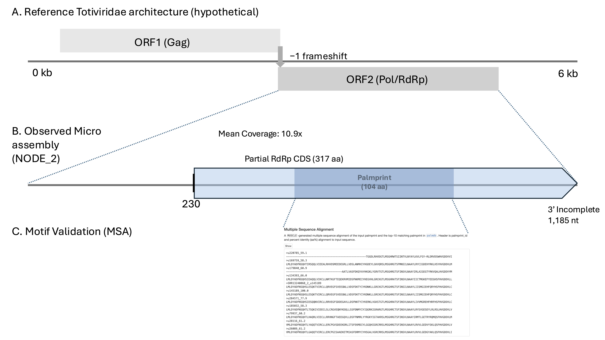
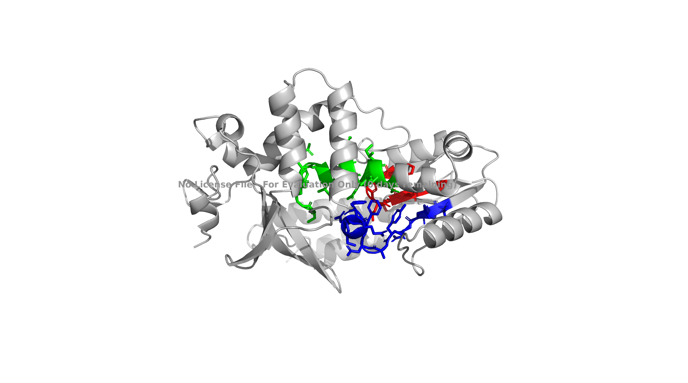
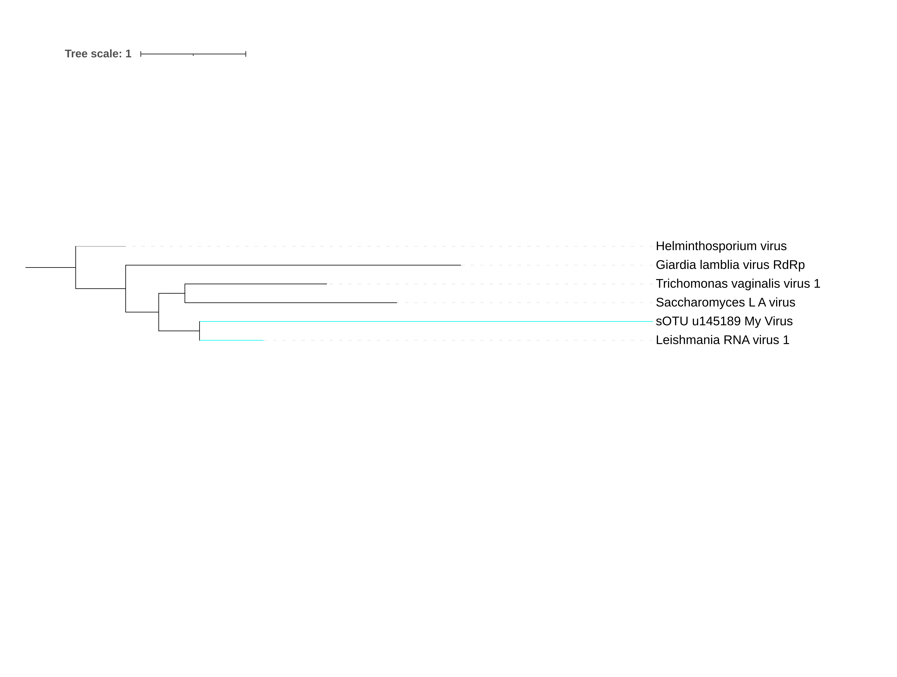

# Tail of Two Hosts: Tracing a Cryptic Totiviridae-Associated Virus in Bovine Muscle Transcriptomes
written by: [Khushi Kankaria](https://github.com/khushikankaria)

[YouTube/Video Link to your presentation video](TBD)

### Sarcototivirus pseudocauda
*Genus: Sarcototivirus. Derived from “Sarco” (Greek sarx for flesh/muscle), referencing both the isolation source (striated bovine muscle) and the presumed protozoan host genus (Sarcocystis), plus "Totivirus" to place it within the Totiviridae family. Species: pseudocauda. Derived from "pseudo" (Greek for false) + "cauda" (Latin for tail). The name refers to the inferred mechanism by which the virus was detected (internal A-rich regions mimicking a poly-A tail).*

## Abstract

Public nucleotide archives contain vast repositories of host-derived RNA sequencing data that remain largely unexplored for commensal or parasitic viral signatures. Standard eukaryotic mRNA sequencing protocols frequently utilize poly-A enrichment to capture coding transcripts, a process assumed to exclude non-polyadenylated lineages such as double-stranded RNA (dsRNA) viruses of the family Totiviridae. However, it remains unclear to what extent this exclusion is absolute, or if specific biochemical mechanisms allow "tailless" viral RNA to bypass selection and appear as authentic signals in host datasets. Here, I characterize the ecology and capture mechanism of sOTU u145189, a cryptic Totiviridae-like RNA-dependent RNA polymerase recovered from Bos grunniens (Yak) muscle transcriptomes. The viral signal was found to be predominant in striated muscle across 15 sequencing runs, while phylogenetic analysis places it with Eimeria-associated viruses (about 61% amino acid identity), contradicting a direct bovine infection model. Forensic sequence analysis shows that although the virus lacks a true poly-A tail, it contains several short adenosine-rich regions (AAAA) that could enable incidental capture during oligo-dT–based library preparation. I therefore propose that u145189 represents a "passenger" virus of the muscle-encysting apicomplexan Sarcocystis, unmasked during host library preparation. Consequently, this study demonstrates that technical artifacts in library preparation can be leveraged as forensic tools, transforming archived host transcriptomes into unanticipated resources for surveying cryptic microbiological ecosystems.

## Results: Forensic Ecology & Genomic Reconstruction

### Patient Zero: The Index Case Anomaly
Ecological analysis defines a virus by its relationship to its host (biotic) and environment (abiotic). To establish the baseline ecology for sOTU u145189, I looked at its “Index Case”, the dataset where it first appeared. The virus was identified in SRA run SRR13240068, which is part of BioProject PRJNA683720, a raw sequencing dataset from Southwest Minzu University (2020) generated within the study “Maiwa farming in plateau and plain.” SRR13240068 was used as the index case because it represents the highest-coverage detection of the canonical palmprint sequence for sOTU u145189 and provides a complete, well-annotated metadata context.

- Biotic context: According to the NCBI BioSample metadata, the host organism is the Maiwa breed of domestic yak (Bos grunniens); specifically, the sample is annotated as muscle tissue collected from an adult male.

- Abiotic context: Although the broader study includes bovine animals from both Guanghan (plain) and Hongyuan (plateau), the index dataset analyzed here corresponds specifically to the Hongyuan high-altitude plateau group.

- Technical context: NCBI library annotations (RNA-seq strategy, transcriptomic source, cDNA selection) are consistent with host-focused sequencing design rather than a targeted microbial or viral profiling.

### Expansion to the Broader Viral Ecology
To place the index case in a broader ecological context, I examined the virusRunObservations.csv dataset to identify all sequencing runs containing sOTU u145189. This dataset aggregates Serratus RdRp detections across public SRA libraries and serves as the main source for ecological analysis in this project. All rows corresponding to u145189 were extracted, and unique SRA runs, BioProjects, and associated host metadata were counted and summarized. This screening identified 17 observations across 15 unique SRA runs distributed across 6 independent BioProjects.

- Host Specificity: The virus is strongly associated with the subfamily Bovinae, appearing multiple times in Bos grunniens (Yak) and Bos taurus (Cattle). A single detection is annotated as human-derived.

- Geographical Independence: The detections span independent studies from China (Yak) and North America (Cattle). Critically, while the Cow Heart detections (PRJNA644042) originate from the same institution as the Index Case (Southwest Minzu University), the Cow Muscle detections (PRJNA480220) originate from the University of Alberta (Canada). This replication across completely distinct laboratories and continents strongly argues against a facility-specific contaminant.

- Tissue context: In Bos grunniens, detections are confined to muscle tissue, whereas in Bos taurus, the viral signal is detected in muscle and heart tissue, consistent with the Yak index case. Lastly, one single detection occurs in the Homo sapiens fecal dataset.

### Comparison to Related Viruses and Ecological Interpretation
To assess whether this ecological pattern aligns with expectations from related viruses, I performed BLASTp analysis on the translated palmprint sequence (104 amino acids) corresponding to u145189. BLASTp analysis returns RNA-dependent RNA polymerases as the top matches. Because the query sequence is short (~104 amino acids) and aligns only to a small internal region of much larger RdRp proteins, this confirms that u145189 represents a conserved RdRp fragment (a Serratus palmprint) rather than a full-length polymerase.

- Result: The top matches were RNA-dependent RNA polymerases from Totiviridae-like viruses, including Eimeria-associated RNA viruses, with approximately 61% amino acid identity and an E-value of 9e-37.

- The paradox: Viruses in this group are most commonly associated with fungi or protozoa, rather than vertebrate hosts. This contrasts with the repeated detection of u145189 in datasets derived from ruminant animals, including samples annotated as muscle tissue.

Comparative tissue analysis: To better understand this paradox, I examined the run-level metadata for the bovine datasets to determine the precise tissue tropism. An informative distinction emerged:

- The Index (Yak): Detected exclusively in muscle tissue (SRR13240068), establishing the baseline tropism.

- The Broader Context (Cattle): While the parent BioProject (PRJNA480220) describes a broad "multi-tissue" study (including Rumen, Liver, and Lung), run-level verification confirms that sOTU u145189 is detected exclusively in Muscle and Heart libraries (e.g., SRR7498176, SRR12170553). The virus is notably absent from the Rumen and Liver datasets within the same cohort.

### Hypothesis: Hyperparasitism of a Muscle-Dwelling Protozoan

The strict localization of the viral signal to striated muscle (skeletal and cardiac) strongly supports a parasite-associated tropism rather than a direct viral infection of the bovine host. Totiviridae viruses are typically found in fungi and protozoa rather than animal tissues. The recurrent detection of this viral signal in yak muscle transcriptomes therefore suggests an indirect ecological association, most likely involving a protozoan host residing within muscle tissue.

- Biological plausibility: Domestic yaks (Bos grunniens) on the Tibetan Plateau exhibit a high prevalence (~95%) of Sarcocystis Infection. Sarcocystis is an apicomplexan protozoan that is phylogenetically close to Eimeria. Given that the RdRp palmprint sequence of sOTU u145189 most closely matches Eimeria-associated viruses, this relationship offers a plausible biological context for the detection of the virus in cardiac and skeletal musculature.

- Proposed Mechanism: I hypothesize that sOTU u145189 infects Sarcocystis parasites encysted within the host muscle. When muscle samples are processed for RNA sequencing, these parasite cysts are broken open, releasing viral RNA. As a result, the viral sequences are captured alongside host RNA and appear to originate from yak muscle, even though the virus itself is associated with a non-vertebrate parasite.

- The Trophic Link (Human Detection): Finally, while sOTU u145189 is predominantly detected in Bos grunniens (yak), there was a single detection in a human fecal virome dataset (PRJNA804384). Humans are the definitive host for S. hominis, acquired via consumption of infected bovine muscle. Although our viral sOTU was linked to a Yak metadata annotation, its detection in a human metagenome would imply that S. hominis (the human-infecting species) may also utilize Yaks as an intermediate host, given the host genus similarity (Bos). Thus, my interpretation is that the presence of the virus in human feces is therefore consistent with the digestive transit of a cyst-derived virus ("trophic transmission") rather than an active human infection.

### Virus Genome
Intrinsic Features and Genome Architecture
sOTU u145189 is defined by a 104 amino acid "palmprint" sequence which encompasses the core structural domain of the RdRp. This domain contains the three conserved catalytic motifs (A, B, and C), with Motif C at the C-terminus housing the GDD active site essential for catalysis. BLASTp analysis reveals top hits to Totiviridae (dsRNA viruses) with a best hit identity of about 61%, suggesting it represents a novel genus or species. The viral genome is likely linear, double-stranded RNA (dsRNA), typical of Totiviridae, with an expected bicistronic architecture consisting of two overlapping ORFs encoding a Gag (capsid) protein and a Pol (RdRp).




Figure 1: Genomic Architecture and Forensic Validation of sOTU u145189. (A) Hypothetical Genome: Schematic of the canonical Totiviridae architecture (dsRNA, ~6 kb), characterized by two overlapping open reading frames (Gag and Pol) expressed via a -1 ribosomal frameshift (not recovered in this microassembly). (B) Observed Microassembly: The viral genome was retrieved from the Serratus microassembly pipeline, yielding a high-coverage contig (NODE_2, 1,185 nt) from dataset SRR13240068 visualized here, and an extended scaffold (NODE_1, 1,524 nt) used for downstream phylogenetic reconstruction. Viral abundance was established via mean read coverage (10.9x). The contig contains a substantial Open Reading Frame (317 aa) initiating at nucleotide 230. This ORF encodes the core RNA-dependent RNA Polymerase (RdRp), containing the taxonomic 104 aa "Palmprint" domain (shaded region). The sequence is 3' incomplete. No additional viral segments (e.g., Gag) were recovered from the assembly. (C) Motif Validation: Multiple Sequence Alignment (MSA) of the palmprint region confirms the presence of the catalytic Motif C (GDD) active site.



Figure S1: AlphaFold 3D Structural Prediction of the Viral RdRp. The tertiary structure of the complete viral ORF (317 aa) was predicted using AlphaFold2 (via ColabFold). The canonical "Right Hand" polymerase architecture is resolved with high confidence (Rank 1 model). The conserved active site motifs are highlighted: Motif A (Blue) containing the proton-transfer wire; Motif B (Green) containing the flexible glycine loop; and Motif C (Red) containing the catalytic GDD triad essential for RNA synthesis.


Phylogenetic Verification of Host Tropism
To validate the host prediction beyond simple BLAST-based homology, I conducted a maximum likelihood phylogenetic analysis. The RdRp sequence of sOTU u145189 was aligned with the RdRp sequences of the type species from each of the five recognized Totiviridae genera: Giardia lamblia virus (Giardiavirus), Trichomonas vaginalis virus 1 (Trichomonasvirus), Leishmania RNA virus 1 (Leishmaniavirus), Saccharomyces cerevisiae virus L-A (Totivirus), and Helminthosporium victoriae virus 190S (Victorivirus).
The phylogenetic analysis resolved two well-supported clades: a fungal clade anchored by Saccharomyces cerevisiae and a protozoan clade anchored by Giardia and Trichomonas. sOTU u145189 clustered robustly within the protozoan clade, forming a sister relationship to the Giardia/Trichomonas lineage. This evolutionary placement supports adaptation to a protozoan host and strengthens the inference that the viral signal detected in bovine muscle originates from the parasite Sarcocystis, rather than from the bovine host itself.



Figure 2. Maximum likelihood phylogeny of sOTU u145189. The evolutionary history was inferred using a maximum likelihood approach based on RdRp amino acid sequences. Viral sequences were aligned with MAFFT, and phylogenetic reconstruction was performed using FastTree via the NGPhylogeny.fr platform. The resulting tree was visualized and annotated in iTOL. The tree is rooted using the fungal Helminthosporium virus (grey). sOTU u145189 clusters as a robust sister taxon to Leishmania RNA virus 1 (cyan), placing it firmly within the protozoan-infecting clade of the family Totiviridae.

### Addressing the “Poly-A Paradox”
Rationale & Hypothesis:
An apparent inconsistency was identified in the viral analysis. Totiviridae are known to possess non-polyadenylated dsRNA genomes [Ghabrial, 1998], yet sOTU u145189 was recovered from an RNA-seq library annotated as cDNA-based and therefore likely enriched for polyadenylated transcripts. This observation is most consistent with non-canonical priming of the viral RNA during cDNA synthesis. Short internal A-rich regions within the viral RNA could plausibly allow incidental capture during oligo-dT–based library preparation. This mechanism, known as false priming, has been previously documented and provides a reasonable explanation for the presence of non-polyadenylated viral sequences in host RNA-seq data [Svoboda et al., 2022]. This hypothesis was evaluated by examining the viral contig for internal adenosine traces capable of mediating such capture.

Method 1: Excluding endogenous viral elements (EVEs): To test whether the detected sequence could represent an endogenous viral element rather than an active viral genome, I queried the viral contig against the Bos grunniens reference genome (TaxID: 30521) using BLASTn. No significant alignments to host chromosomes were observed. This result argues against our sOTU u145189 being a host-integrated genomic fossil and supports its interpretation as an exogenous viral fragment.

Method 2: Analysis of "False Priming" Sites: To investigate how a non-polyadenylated viral RNA could be recovered from a poly-A–enriched library, I scanned the 1,185 nt contig for adenosine homopolymers (A-traces) that could plausibly anneal to oligo-dT capture probes.
- Observation: Four discrete A-rich regions containing runs of four consecutive adenines (AAAA) were identified at approximately nt positions 614, 695, 921 and 1004. No canonical long A-sections (>6 nt) were found.

- Interpretation: The absence of long A-tracts argues against capture via a single, canonical poly-A–like region. A plausible alternative is that multiple short A-rich motifs contributed to weak, transient oligo-dT interactions, allowing occasional retention of viral RNA during the library preparation. This implies that the library preparation conditions allowed for thermodynamically unstable interactions, where the Oligo-dT primers bound to weak internal 'AAAA' sites despite the lack of a true Poly-A tail.

Conclusion: This analysis attempts to resolve the ecological paradox. It demonstrates that the observations are most consistent with a technical capture effect arising from library preparation, rather than true biological polyadenylation of the viral RNA. This suggests that dsRNA viruses can still be recovered from poly-A–selected datasets, likely as a consequence of rare, depth-dependent capture rather than true polyadenylation.

### Scientific Tweet-torial
Tweet 1: A forensic paradox: sOTU u145189 appears repeatedly in bovine (Bos grunniens and Bos taurus) muscle RNA-seq. The problem? 
1. It’s a Totiviridae RdRp (typically fungal/protozoan, not mammalian).
2. It’s a dsRNA virus (non-polyadenylated) recovered likely from Poly-A enriched libraries. Metadata largely says "Bovine." Biology says "Impossible." [Image: Figure 1 Microassembly]

Tweet 2: The Twist - The Biological Insight: The viral signal is primarily restricted to striated muscle (cardiac/skeletal), the exact tissue where *Sarcocystis* parasites encyst. The "Trojan Horse" Hypothesis: We aren't seeing a bovine virus. We are sequencing a viral passenger inside a protozoan cyst, hidden within the host tissue.

Tweet 3: The Solution (A Technical Mechanism?) Resolving the capture: How does a "tailless" dsRNA virus bypass Poly-A selection? Forensics reveal multiple internal 'AAAA' motifs (e.g., pos 614) capable of low-affinity priming. The lesson: Stochastic capture errors in library prep can inadvertently create digital biomarkers for cryptic parasitic burden.

## Discussion

Characterizing sOTU u145189 exposes the gap between metadata and biology. While the datasets consistently label these samples as bovine muscle and heart, the sequence data argues otherwise: the RdRp palmprint is structurally consistent with fungal and protozoan dsRNA viruses, not mammalian ones. We shouldn't confuse the collection site with the biological host. This discrepancy supports a specific, testable hypothesis, in that this is a 'passenger' virus infecting a cryptic parasite (likely, for e.g., Sarcocystis) embedded within the tissue, rather than a direct infection of the yak itself. The recovery of a non-polyadenylated dsRNA signal from libraries likely intended for mRNA sequencing suggests that these datasets can still contain non-host viral sequences. This suggests that archived RNA-seq data hold untapped utility as digital biomarkers, allowing researchers to infer parasitic burden from viral proxies even when the parasite itself is not explicitly annotated.

## References
Blazejewski, T., Nursimulu, N., Pszenny, V., Dangoudoubiyam, S., Namasivayam, S., Chiasson, M. A., Chessman, K., Tonkin, M., Swapna, L. S., Hung, S. S., Bridgers, J., Ricklefs, S. M., Boulanger, M. J., Dubey, J. P., Porcella, S. F., Kissinger, J. C., Howe, D. K., Grigg, M. E., & Parkinson, J. (2015). Systems-Based Analysis of the Sarcocystis neurona Genome Identifies Pathways That Contribute to a Heteroxenous Life Cycle. MBio, 6(1), e02445-14. https://doi.org/10.1128/mBio.02445-14

Fayer, R., Esposito, D. H., & Dubey, J. P. (2015). Human Infections with Sarcocystis Species. Clinical Microbiology Reviews, 28(2), 295–311. https://doi.org/10.1128/CMR.00113-14

Ghabrial, S. A. (1998). Origin, Adaptation and Evolutionary Pathways of Fungal Viruses. Virus Genes, 16(1), 119–131. https://doi.org/10.1023/a:1007966229595

Goodman, R. B., Ghabrial, S. A., Fichorova, R. N., & Nibert, M. L. (2010). Trichomonasvirus: a new genus of protozoan viruses in the family Totiviridae. 156(1), 171–179. https://doi.org/10.1007/s00705-010-0832-8

Gupta, P., Hiller, A., Chowdhury, J., Lim, D., Dillon Yee Lim, Jeroen P J Saeij, Babaian, A., Rodriguez, F., Pereira, L., & Morales-Tapia, A. (2024). A Parasite Odyssey: An RNA virus concealed in Toxoplasma gondii . Virus Evolution, 10(1). https://doi.org/10.1093/ve/veae040

Ingrida Olendraitė, Brown, K. A., & Firth, A. E. (2023). Identification of RNA Virus–Derived RdRp Sequences in Publicly Available Transcriptomic Data Sets. Molecular Biology and Evolution, 40(4). https://doi.org/10.1093/molbev/msad060

Liv Sandlund, Mor, S. K., Singh, V., Soumesh Kumar Padhi, Nicholas, Nylund, S., & Mikalsen, A. B. (2021). Comparative Molecular Characterization of Novel and Known Piscine Toti-Like Viruses. Viruses, 13(6), 1063–1063. https://doi.org/10.3390/v13061063

Svoboda, M., Frost, H. R., & Bosco, G. (2022). Internal oligo(dT) priming introduces systematic bias in bulk and single-cell RNA sequencing count data. NAR Genomics and Bioinformatics, 4(2). https://doi.org/10.1093/nargab/lqac035

Tang, K., Lamu, D., Qin, T., Liao, Z., Zhang, M., Wu, Z., Deng, S., Tao, J., & Hu, J. (2023). Prevalence and Genetic Characterization of Morphologically Indistinguishable Sarcocysts of Sarcocystis cruzi in Cattle and Sarcocystis poephagicanis in Yaks. Diversity, 15(11), 1136. https://doi.org/10.3390/d15111136

Taynar Lima Bezerra, Rodrigo Martins Soares, & Pita, F. (2023). Sarcocystis Species (Apicomplexa, Eucoccidiorida) Parasitizing Snakes. Parasitologia, 3(4), 327–347. https://doi.org/10.3390/parasitologia3040032

Viscardi, M. J., & Arribere, J. A. (2022). Poly(a) selection introduces bias and undue noise in direct RNA-sequencing. BMC Genomics, 23(1). https://doi.org/10.1186/s12864-022-08762-8


# Viral Short Story
```
The False-Flag Protocol
The rain didn't fall in the dataverse; it just static-washed across the monitors. I was working the graveyard shift in the Archives, scrubbing old biological sectors for anomalies. That’s when I noticed a glitch in a file tagged as Bos grunniens (Yak) muscle transcriptomes.
The metadata claimed it was primarily livestock, but the signal density was wrong. My deck flagged a rogue code sequence: sOTU u145189, a cryptic Totiviridae-like RNA-dependent RNA polymerase. I lit a virtual cigarette as that didn't add up. Totiviridae are old code, scripts that run on fungi and protozoa, not high-altitude mammals.
I checked the security logs. The library was built using standard poly-A enrichment, a velvet rope designed to filter out the noise and only let coding transcripts through. This intruder was double-stranded RNA: it didn't have the credentials to get in. It should have been invisible.
I ran a forensic decrypt to see how it cracked the lock. It didn't break the door down; it picked it. The virus was carrying short internal adenosine-rich regions (AAAA), false flags that tricked the oligo-dT probes into thinking it belonged.
It wasn't a glitch, and it wasn't an infection of the beast. It was a hitchhiker. The virus was a passenger hiding inside a muscle-encysting apicomplexan Sarcocystis, unmasked only because the sequencer got fooled by a counterfeit ID. I archived the file. In this city, even the parasites have parasites.
```