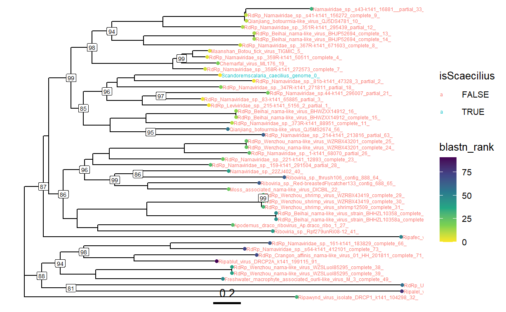
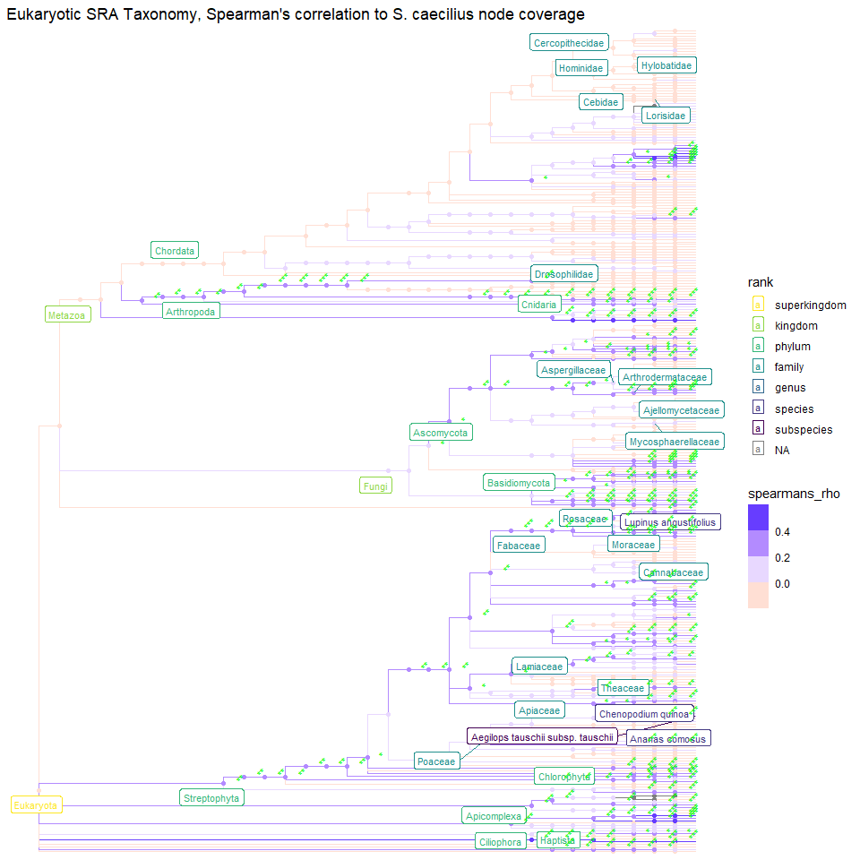
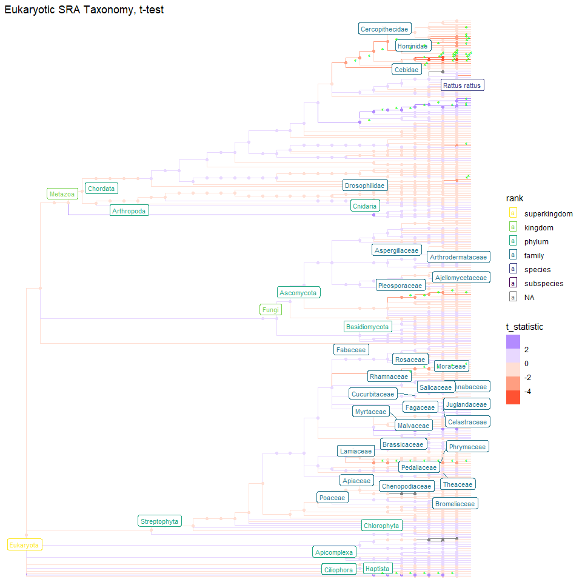
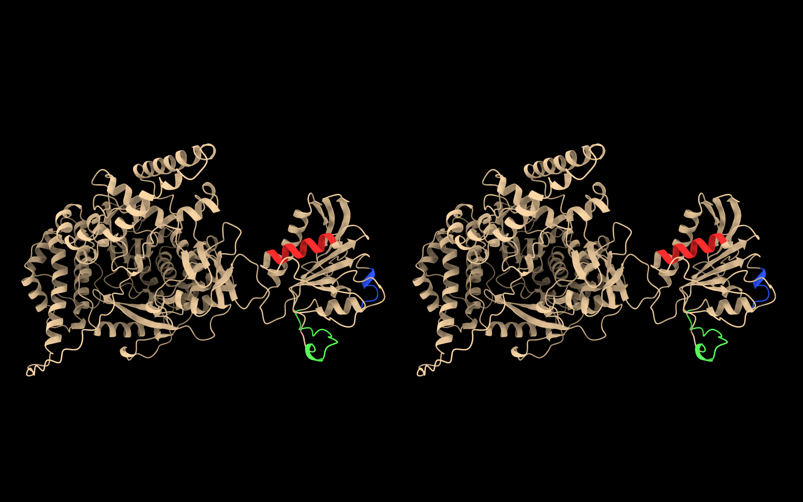
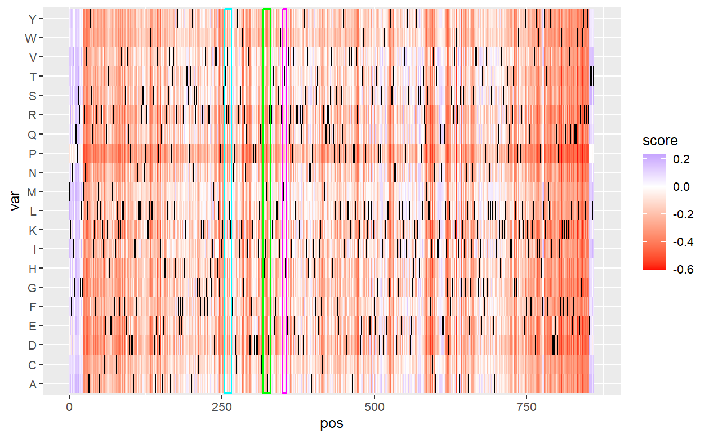
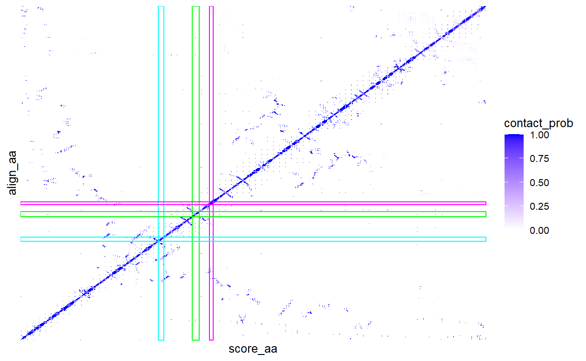
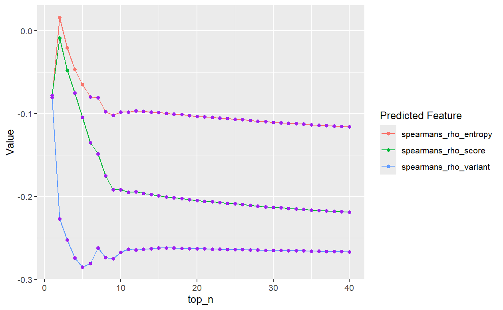

# The Cow, the Trypanosomatidae, and some AlphaFold: The Chronicles of a Narn(i)avirus

written by: [Megan Ding]

### Scandoremscalaria caecilius

Scandorem: Accusative case of scandor, which is Latin for climber.

Scalaria: The Latin word for stairs.

We propose that S. caecilius infects organisms of the family
Trypanosomatidae (which is named after the protozoa's cockscrew like
motions), and thus the virus is like a climber of a spiral staircase.

caecilius: A reference to the main character of the Cambridge Latin
Course Book I, Lucius Caecilius Iucundus, a banker who lived in Pompeii
and died during the eruption of Mt. Vesuvius. Caecilius is the
partriarch of the family that the book follows; the end of the C motif
of this virus are the residues DILF.


## Abstract

Scandoremscalaria caecilius (S. caecilius) is a novel Narnavirus that
may infect parasites of the family Trypanosomatidae. Its presence is
negatively associated with reads to several other viruses, such as Human
papillomavirus, Bovine viral diarrhea virus 3, and Ourmiavirus. Several
species of Trypanosomatidae are highly pathogenic, including Trypanosoma
brucei and Trypanosoma cruzi, but hard to vaccinate against due to their
large antigenic variation. S. caecilius adds to the limited
characterization of Narnaviruses that infect Trypanosomatidae. With a
simple variant effect predictor, DeMaSk, and validation by AlphaFold
predicted contact probabilities, we suggest that the newest variants of
S. caecilius will have variants in the N and C termini of their
RNA-dependent polymerases. S. caecilius presents a new avenue of
research into preventing Trypanosoma infections and its variant effect
prediction may guide the discovery of more novel Narnaviruses derived
from S. caecilius.

## Results

### Ecology

#### Virus classification

To get a feeling for what we should be looking for before we assemble
the S. caecilius's genome, we ran blastp on all of the given palmprints.

The top 5 blastp hits by E-value for all 9 palmprints were some form of
Narnaviridae sp. RdRp (E-values: 1e-48 to 1e-25).

This suggests that S. caecilius is most likely a Narnavirus.

#### Genome reconstruction

Finding the full-ish genome:

We assembled genome from all logan contig files individually using
MEGAHIT [Li 2015] and SPAdes [Bankevich 2012] (trying all of the single
cell, RNA, RNA viral, metaviral, and metagenome options).

-   SPAdes assembled genomes showed no alignment to the palm IDs using
    tblastn
    -   got blastn hits for synthetic construct plasmids and cloning
        vectors
    -   the rnaSPAdes assembly of SRR13690437 reconstructed a Mus
        musculus ring finger protein transcript
-   MEGAHIT assembled genomes showed moderate alignment between a few
    short (103-228 bases) sequences and the palm IDs using tblastn

Next, we took the simpler approach: get all the raw logan contig files,
filtered them to contigs that are 2000 bases or longer, and then aligned
them to the palm IDs using tblastn - gave us 18 candidate genomes of
reasonable length (2056 bases to 3909 bases) across all SRRs

We chose the a contig (C1) from SRR12324618 to be the reference genome
since C1 contains the exact palmprint ID from all SRRs, as measured by
tblastn, and a reasonable length (2549 bases).

However, according to ORFfinder, C1 does not have an in-frame stop
codon, which is concerning and suggests that this contig does not
capture a sufficient amount of the viral genome. So we used
contig-extender [Deng 2021] to map RdRp reads to the end of C1. This
extended C1 by 159 bases and produced a stop codon for the ORF (ORF
range: 20-2602, 2583 bases, 860aa).

This is where we stopped. We could have directly interrogated the
RNA-seq data from the original SRRs, but we think this 2708 base long
contig is a good enough representation of the typically simple
Narnavirus genome.

#### Relationship to other known viruses

We used blastn on the genome of S. caecilius and did multisequence
alignment on with 100 sequences with the lowest E-values using MUSCLE
[Edgar 2004].

Then, we ran IQTREE [Nguyen 2014] tree inference (default parameters:
1000 bootstrap alignments, 1000 SH-aLERT replicates, minimum correlation
coefficient of 0.99, stopping rule of 100, preturbation strength of 0.5)
on the MUSCLE alignment file.



Figure 1. IQTREE phylogenetic tree of S. caecilius in relation to top Blast
hits. The node tips are coloured by the blast E-value rank (1 = lowest,
91 = highest). S. caecilius is coloured blue while the others are
red.

We're only plotting a subtree that contains S. caecilius and 48 other
sequences because a 101 leaf tree would be even harder to read. The
majority of the sequences here are Narnaviruses and from RdRps. This
adds strong evidence to the case of S. caecilius being a Narnavirus.
Furthermore, S. caecilius seems like a pretty typical Narnavirus due do
the SH-aLERT support values for the separation of S. caecilius from 2
known Narnaviruses being less than 80 (insignificant).

The main exercise here in comparing blast E-value rankings to IQTREE
phylogenetic similarity is that blast is not the end-all-be-all for
measurements of sequence similarity. These 48 sequences are the "most
related" to S. caecilius based on blastn E value filtering and then
IQTREE inference, but there is a Ripablut virus that is ranked 91st
based on blastn E value in this clade. Blastn ranks a lentiviral RdRp as
the number one most likely match to S. caecilius, whereas the IQTREE
inference says this lentiviral sequence is 3 steps removed from S.
caecilius and the blastn second ranked sequence (which is a Narnavirus
RdRp) is the most closely related to S. caecilius.

#### Host hunting

To characterize S. caecilius's host, we took a more exploratory, rather
than hypothesis driven, approach. This is because there is not any
obvious connection among the locations and subjects the source papers.
First, we only looked at eukaryotes. This is because Narnaviruses are
known to infect fungi and protozoans, which are often carried by other
more complex eukaryotes. While we do want to break definitions, for the
sake of interpretability and plausibility, we did not include
prokaryotes in this analysis.

To systematically characterize the eukaryotic taxa that are present/not
present when S. caecilius is detected, we performed Spearman's
correlation of reads of each taxa with the S. caecilius node coverage
normalized by the total number of reads to the Eukaryota superkingdom
and t-tests for the difference in means between normalized reads of taxa
in SRRs that do and don't have S. caecilius reads. All p-values were FDR
corrected.



Figure 2. Taxonomic tree of the eukaryotic organisms in all of the BioProjects
that contain S. caecilius. Edges are coloured by the child node's
normalized read count Spearman's correlation to the normalized S.
caecilius palm ID node coverage. The green starts are represent the FDR
corrected significance of the correlation (\*\*\* =\> p adjusted \<
0.001, \*\* =\> p adjusted \< 0.01, \* =\> p adjusted \<
0.05)



Figure 3. Taxonomic tree of the eukaryotic organisms in all of the BioProjects
that contain S. caecilius. Edges are coloured by the difference in means
in the child node's normalized read count in SRRs that do and don't
contain S. caecilius palm ID node coverage. The green starts are
represent the FDR corrected significance of the correlation (\*\*\* =\>
p adjusted \< 0.001, \*\* =\> p adjusted \< 0.01, \* =\> p adjusted \<
0.05)

When we look at the intersection of all the taxa that are significant
under the Spearman's and t-test approach, we get cows (a likely vector)
and the family Trypanosomatidae, a protozoan parasite. Both of these
coefficients and t-statistics are also positive.

This exploratory analysis tells us that S. caecilius may infect
Trypanosomatidae.

Does this make sense? Yes.

Trypanosomatidae are a very globalized parasite that can infect both
mammals and insects [Kaufer 2017]. The genus Trypanosoma specifically
infects the blood. This may relate to S. caecilius's presence in 2
cancer related papers as they both used donor tissue, rather than
sterile cell lines. Furthermore, some species in this genus are known to
infect the source subjects, Trypanosoma musculi infect house mice, and
Trypanosoma evansi and Trypanosoma theileri plus several others can
infect both humans and cattle [Antoine-Moussiaux 2009].

There is little evidence for S. caecilius infecting more concerning
Trypanosoma species such as Trypanosoma brucei, which is transmitted to
humans by tsetse flies and causes sleeping sickness, and Trypanosoma
cruzi which is transmitted to humans by triatomine bugs and causes
Chagas disease [Antoine-Moussiaux 2009]. This is because the only
significant taxonomic association with S. caecilius node coverage that
relates to any sort of insect is the Spearman's correlation with reads
for the clade Holometabola, which contains tsetse flies. However, this
is not convincing enough evidence for S. caecilius infecting
specifically Trypanosoma brucei. This suggests that S. caecilius
inhabits Trypanosomatidae that are non-pathogenic as there are no
experimental notes about subjects having any parasitic
infection/sickness.

Narnaviruses are known to infect Trypanosomatidae of the genus
Leishmania, but Leishmania are not found in cows (a key source of S.
caecilius in our study) as often as Trypanosoma [Klocek et al 2023]. We
are leaning towards S. caecilius infecting Trypanosoma, but we cannot
say so conclusively.

Overall, while we did not pin-point specific species that S. caecilius
infects, our exploratory analysis provides evidence for
Narnaviruses/narna-like viruses infecting another phylum of protists. As
well, this suggests that it is likely that there is or will be some
Narnavirus that infects more concerning, pathogeneic Trypanosomatidae
such as Trypanosoma brucei. This presents a new avenue of research for
Trypanosoma infection treatment. Trypansoma are hard to vaccinate
against due to their large antigenic variation [La Greca 2011]. If there
is a Narnavirus that infects Trypanosoma, producing a more consistent
antigenic signature, it may be possible to make more effective vaccines.

### Virus Genome


Figure 4. A) Composite plot of genome read coverage from SRR12324618, the one
RdRp ORF in S. caecilius (gggenes), and the nucleotide identity for each
position (top ot bottom). The genome is not very GC rich (38.5% GC). B)
Predicted folding of the RNA genome of S. caecilius from RNAfold (Gruber
2008). The colouring follows the base-pairing probabilities for the
structure that has the minimum free energy. This structure may be
inaccurate due to its large
size.

### AlphaFold RdRp structure in ChimeraX



Figure 5. Stereo view of S. caecilius's RdRp AlphaFold (Jumper 2021) structure
in ChimeraX (Pettersen
2020).

### Variant effect predictor

DeMaSk [Munro 2020] is a naive variant effect predictor (VEP) that just
takes an amino acid sequence and calculates entropy, variant rate, and
fitness scores based on 22 existing deep mutational scanning papers. It
really doesn't compare to VEPs like AlphaMissense [Cheng 2023], but
DeMaSk is nice because you can actually input a new protein sequence and
get scores.

Something that makes AlphaMissense an especially good VEP is its use of
structural predictions from AlphaFold [Jumper 2021].

Can we measure the concordance of DeMaSk's scores with the some measure
of residue importance as produced from AlphaFold?



Figure 6. DeMaSk predicted variant map of S. caecilius RdRp. Higher score means
that DeMaSk predicts that this amino acid substution increases fitness,
where as low scores should correlate to decreased fitness. The black
tiles are at the wild type amino acid identity. The blue, green, and
magenta boxes are around the A, B, and C motif positions
respectively.



Figure 7. AlphaFold predicted probability of contact for each amino acid
position in the S. caecilius RdRp. Higher probability means that
AlphaFold predicts that this amino acid pair will touch each other. The
blue, green, and magenta boxes are around the A, B, and C motif positions
respectively.



Figure 8. Spearman's correlation between the average predicted variant effect
score for each residue and the average of the top 1 to 40 AlphaFold
predicted probability of contact values for each amino acid position in
the S. caecilius RdRp. The purple points mean that the correlation
coefficient is significant at FDR adjusted p-value =
0.05.

There is a negative association between DeMaSk predicted entropy
(salmon), variant rate (blue), and variant effect fitness score (green)
and mean of top n probability values for this AlphaFold model, which
makes sense. Even though DeMaSk is a very naive VEP, we can still get
sensical relationships between its predicted measurements of variation
and the importance of residues as measured by contact probability.

The predicted variant effect map also highlights that the N (residues
1-22) and C (residues 853-860) termini of S. caecilius's RdRp are not
very optimal (i.e. many residue substitutions result in a higher score).
This is possibly an artifact from DeMaSk's reference variant effect
maps, but it may suggest that future S. caecilius mutants (which could
infect more pathogenic Trypanosomatidae) are likely to have variants in
their N and C termini.

### R to ChimeraX interface example script

```         
# CX function informed by Prof. Steipe
CXPORT <- 64950

# start-up
# open ChimeraX
# enter command: remote rest start port CXPORT
# run commands in CX wrapper for reproducible structure fun


CX <- function(cmd, port = CXPORT, quietly = FALSE) {
  # send a command to ChimeraX listening on port CXPORT via its REST
  # interface.
  # Parameters:
  #   cmd      char     a ChimeraX commandline command
  #   port     int      the portnumber on which ChimeraX is listening
  #   quietly  logical  if FALSE, cat() the contents of the response
  #
  # Value:  the reply by ChimeraX, invisibly.

  CXREST <- sprintf("http://127.0.0.1:%s/run?", CXPORT)

  cmd <- gsub("(^\\s+)|(\\s+$)", "", cmd)  # trim whitespace
  # percent encode reserved characters
  cmd <- gsub("%",   "%25", cmd)          #   %
  cmd <- gsub("#",   "%23", cmd)          #   #
  cmd <- gsub("/",   "%2F", cmd)          #   /
  cmd <- gsub(":",   "%3A", cmd)          #   :
  cmd <- gsub("@",   "%40", cmd)          #   @
  cmd <- gsub(",",   "%2C", cmd)          #   ,
  cmd <- gsub("\\*", "%2A", cmd)          #   *
  cmd <- gsub("\\?", "%3F", cmd)          #   ?
  cmd <- gsub("!",   "%21", cmd)          #   !
  cmd <- gsub("=",   "%3D", cmd)          #   =
  cmd <- gsub("\\(", "%28", cmd)          #   (
  cmd <- gsub("\\)", "%29", cmd)          #   )
  cmd <- gsub("\\[", "%5B", cmd)          #   [
  cmd <- gsub("\\]", "%5D", cmd)          #   ]
  cmd <- gsub("&",   "%26", cmd)          #   &
  cmd <- gsub("\\+", "%2B", cmd)          #   +

  cmd <- gsub("\\s+", "+", cmd)            # whitespace to "+"
  cmd <- URLencode(cmd)                    # encode special characters
  cmd <- paste0(CXREST, "command=", cmd, collapse = "")

  r <- httr::GET(cmd)

  if (! r$status_code == 200) {
    stop("ChimeraX returned status code %d", r$status_code)
  }

  if (length(r$content) == 0) {
    reply <- ""
  } else {
    reply <- rawToChar(r$content)
  }

  if (quietly == FALSE) {
    cat(reply)
  }

  return(invisible(reply))

}

# visit https://www.rbvi.ucsf.edu/chimerax/docs/user/index.html for command documentation

# replace with your own *.cif file path
cif_file <- "fold_2025_12_12_13_25_model_0.cif"
CX(paste0("open ", cif_file))

#===================================
# colour the A, B, C motifs

A_range <- "254-265"
B_range <- "317-330"
C_range <- "349-356"

CX(paste0("select /A:", A_range))
CX("color sel rgba(250, 40, 40, 1)")

CX(paste0("select /A:", B_range))
CX("color sel rgba(80, 250, 80, 1)")

CX(paste0("select /A:", C_range))
CX("color sel rgba(40, 80, 250, 1)")

CX("color /B bynucleotide")

CX("lighting soft")

CX("select clear")

#==================================
# see which nucleotides are near the A, B, C motifs

CX("select /A:254-265 /A:317-330 /A:349-356")

CX("select zone sel 5")
CX("select intersect /B")

surrounding<-CX("info residues sel")

surrounding <- unlist(strsplit(surrounding, " ")) # split into a vector
surrounding <- surrounding[grepl('^[[:upper:]]', surrounding)]
barplot(table(surrounding))

CX("hide /B")
CX("hide /B ribbons")

#=========================================
# select all histidines in the model and see which residues are near it
CX("select zone :his 3.8")
CX("select intersect /A")
surrounding<-CX("info residues sel")

surrounding <- unlist(strsplit(surrounding, " ")) # split into a vector
surrounding <- surrounding[grepl('^[[:upper:]]', surrounding)]
surrounding <- sapply(surrounding, function(x)
  paste0(substr(x, 1, 1), tolower(substr(x, 2, nchar(x)))))
x <- seqinr::AAstat(seqinr::a(surrounding))   # compute frequency statistics
barplot(sort(x$Compo),
        cex.names = 0.6)

#=================================================
# you will need to find your own files/measurements to use here
vep <- data.table::fread(file = "./data/vep_pos_rank.txt")
colour_vect <- grDevices::colorRampPalette(colors = c("red", "white", "blue"))(860)
colour_command <- paste0("color  /A:", vep$pos, " ", colour_vect)
colour_command <- paste(colour_command, collapse = "; ")
CX(colour_command)

#==================================================
# close the open file
CX("close #1")
# clean up after yourself!
CX("remotecontrol rest stop")
```

## Discussion

S. caecilius is a genetically generic Narnavirus with an functionally
unique niche. We have provided evidence for its infection of
Trypanosomatidae as well as its negative association with the presence
of several viruses. Although the S. caecilius genome has poor coverage,
it still exhibits predicted secondary structures characteristic of other
Narnaviruses. Variant effect prediction on S. caecilius's RdRp sequence
suggests that emergent variants of S. caecilius will have mutations in
the N and C termini of their RNA-dependent polymerases. This simple
provides new avenues for further research into its relationship to its
proposed host, interviral interactions, and its evolution.

## References

Antoine-Moussiaux, N., Büscher, P., & Desmecht, D. (2009). Host-parasite
interactions in trypanosomiasis: On the way to an antidisease strategy.
Infection and Immunity, 77(4), 1276–1284.
<https://doi.org/10.1128/iai.01185-08>

Bankevich, A., Nurk, S., Antipov, D., Gurevich, A. A., Dvorkin, M.,
Kulikov, A. S., Lesin, V. M., Nikolenko, S. I., Pham, S., Prjibelski, A.
D., Pyshkin, A. V., Sirotkin, A. V., Vyahhi, N., Tesler, G., Alekseyev,
M. A., & Pevzner, P. A. (2012). Spades: A new genome assembly algorithm
and its applications to single-cell sequencing. Journal of Computational
Biology, 19(5), 455–477. <https://doi.org/10.1089/cmb.2012.0021>

Cheng, J., Novati, G., Pan, J., Bycroft, C., Žemgulytė, A., Applebaum,
T., Pritzel, A., Wong, L. H., Zielinski, M., Sargeant, T., Schneider, R.
G., Senior, A. W., Jumper, J., Hassabis, D., Kohli, P., & Avsec, Ž.
(2023). Accurate proteome-wide missense variant effect prediction with
Alphamissense. Science, 381(6664).
<https://doi.org/10.1126/science.adg7492>

Deng, Z., & Delwart, E. (2021). Contigextender: A new approach to
improving de novo sequence assembly for Viral Metagenomics Data. BMC
Bioinformatics, 22(1). <https://doi.org/10.1186/s12859-021-04038-2>

DeRisi, J. L., Huber, G., Kistler, A., Retallack, H., Wilkinson, M., &
Yllanes, D. (2019). An exploration of ambigrammatic sequences in
narnaviruses. Scientific Reports, 9(1).
<https://doi.org/10.1038/s41598-019-54181-3>

Duffy, S. (2018). Why are RNA virus mutation rates so damn high? PLOS
Biology, 16(8). <https://doi.org/10.1371/journal.pbio.3000003>

Edgar, R. C. (2004). Muscle: A multiple sequence alignment method with
reduced time and space complexity. BMC Bioinformatics, 5(1).
<https://doi.org/10.1186/1471-2105-5-113>

Fukuda, M., Cai, J., Bader, J. S., & Boeke, J. D. (2023). Pervasive RNA
folding is crucial for narnavirus genome maintenance. Proceedings of the
National Academy of Sciences, 120(26).
<https://doi.org/10.1073/pnas.2304082120>

Gruber, A. R., Lorenz, R., Bernhart, S. H., Neubock, R., & Hofacker, I.
L. (2008). The vienna RNA websuite. Nucleic Acids Research, 36(Web
Server). <https://doi.org/10.1093/nar/gkn188>

Guo, Q., Wang, H., Duan, J., Luo, W., Zhao, R., Shen, Y., Wang, B., Tao,
S., Sun, Y., Ye, Q., Bi, X., Yuan, H., Wu, Q., Lobie, P. E., Zhu, T.,
Tan, S., Huang, X., & Wu, Z. (2022). An alternatively spliced P62
isoform confers resistance to chemotherapy in breast cancer. Cancer
Research, 82(21), 4001–4015.
<https://doi.org/10.1158/0008-5472.can-22-0909>

Higa, K. C., Goodspeed, A., Chavez, J. S., De Dominici, M., Danis, E.,
Zaberezhnyy, V., Rabe, J. L., Tenen, D. G., Pietras, E. M., & DeGregori,
J. (2021). Chronic interleukin-1 exposure triggers selection for
cebpa-knockout multipotent hematopoietic progenitors. Journal of
Experimental Medicine, 218(6). <https://doi.org/10.1084/jem.20200560>

Jalal, D., Elzayat, M. G., El-Shqanqery, H. E., Diab, A. A., Yahia, A.,
Samir, O., Bakry, U., Amer, K., ElNaqeeb, M., Hassan, W., Talat, H. S.,
Farawela, H. M., Hamdy, M. S., Soliman, M. S., El Sissy, M. H.,
Ezzelarab, M. H., El khateeb, S. M., Soliman, L. H., Haddad, S. E., …
Sayed, A. A. (2022). SARS-COV-2 genome variations and evolution patterns
in Egypt: A multi-center study. Scientific Reports, 12(1).
<https://doi.org/10.1038/s41598-022-18644-4>

Jumper, J., Evans, R., Pritzel, A., Green, T., Figurnov, M.,
Ronneberger, O., Tunyasuvunakool, K., Bates, R., Žídek, A., Potapenko,
A., Bridgland, A., Meyer, C., Kohl, S. A., Ballard, A. J., Cowie, A.,
Romera-Paredes, B., Nikolov, S., Jain, R., Adler, J., … Hassabis, D.
(2021). Highly accurate protein structure prediction with alphafold.
Nature, 596(7873), 583–589. <https://doi.org/10.1038/s41586-021-03819-2>

Kaufer, A., Ellis, J., Stark, D., & Barratt, J. (2017). The evolution of
Trypanosomatid taxonomy. Parasites & Vectors, 10(1).
<https://doi.org/10.1186/s13071-017-2204-7>

Klocek, D., Grybchuk, D., Tichá, L., Votýpka, J., Volf, P., Kostygov, A.
Yu., & Yurchenko, V. (2023). Evolution of RNA viruses in
trypanosomatids: New insights from the analysis of Sauroleishmania.
Parasitology Research, 122(10), 2279–2286.
<https://doi.org/10.1007/s00436-023-07928-x>

La Greca, F., & Magez, S. (2011). Vaccination against trypanosomiasis.
Human Vaccines, 7(11), 1225–1233.
<https://doi.org/10.4161/hv.7.11.18203>

Langmead, B., & Salzberg, S. L. (2012). Fast gapped-read alignment with
bowtie 2. Nature Methods, 9(4), 357–359.
<https://doi.org/10.1038/nmeth.1923>

Li, D., Liu, C.-M., Luo, R., Sadakane, K., & Lam, T.-W. (2015). Megahit:
An ultra-fast single-node solution for large and complex metagenomics
assembly via succinct de bruijn graph. Bioinformatics, 31(10),
1674–1676. <https://doi.org/10.1093/bioinformatics/btv033>

Li, H., Handsaker, B., Wysoker, A., Fennell, T., Ruan, J., Homer, N.,
Marth, G., Abecasis, G., & Durbin, R. (2009). The sequence alignment/map
format and SAMtools. Bioinformatics, 25(16), 2078–2079.
<https://doi.org/10.1093/bioinformatics/btp352>

Munro, D., & Singh, M. (2020). DeMaSk: A deep mutational scanning
substitution matrix and its use for variant impact prediction.
Bioinformatics, 36(22–23), 5322–5329.
<https://doi.org/10.1093/bioinformatics/btaa1030>

Ngu, A., Wang, S., Wang, H., Khanam, A., & Zempleni, J. (2022). Milk
exosomes in nutrition and drug delivery. American Journal of
Physiology-Cell Physiology, 322(5).
<https://doi.org/10.1152/ajpcell.00029.2022>

Nguyen, L.-T., Schmidt, H. A., von Haeseler, A., & Minh, B. Q. (2014).
IQ-tree: A fast and effective stochastic algorithm for estimating
maximum-likelihood phylogenies. Molecular Biology and Evolution, 32(1),
268–274. <https://doi.org/10.1093/molbev/msu300>

Pettersen, E. F., Goddard, T. D., Huang, C. C., Meng, E. C., Couch, G.
S., Croll, T. I., Morris, J. H., & Ferrin, T. E. (2020). UCSF chimerax:
Structure visualization for researchers, educators, and developers.
Protein Science, 30(1), 70–82. <https://doi.org/10.1002/pro.3943>

Venkataraman, S., Prasad, B., & Selvarajan, R. (2018). RNA dependent RNA
polymerases: Insights from structure, function and evolution. Viruses,
10(2), 76. <https://doi.org/10.3390/v10020076>

Wass, M., Göllner, S., Besenbeck, B., Schlenk, R. F., Mundmann, P.,
Göthert, J. R., Noppeney, R., Schliemann, C., Mikesch, J.-H., Lenz, G.,
Dugas, M., Wermke, M., Röllig, C., Bornhäuser, M., Serve, H.,
Platzbecker, U., Foerster, K. I., Burhenne, J., Haefeli, W. E., …
Müller-Tidow, C. (2020). A proof of concept phase I/II pilot trial of
LSD1 inhibition by tranylcypromine combined with atra in
refractory/relapsed AML patients not eligible for intensive therapy.
Leukemia, 35(3), 701–711. <https://doi.org/10.1038/s41375-020-0892-z> \#
Viral Short Story

```         
**“Directive for a Crossing Strand”**

*after Robert Frost’s *Directive**

Back out of all this fret of charts and glass,
Of benches lit like winter afternoons,
And come to where the pasture paths collapse
Into old stone the **cattle** long forgot.
I’d lead you there, though not to make you safe—
Only to show what still abides unseen.

For something small has traveled here before us,
A wanderer with neither map nor right,
Thread-thin, like those that **haunt the parasitic** loam,
Yet choosing warmer keeps: the pulse of beasts,
The **milk-warm** hush where calves lean into dusk,
The marrow’s well, the breath behind the ribs.

It crossed the mouse-run under leaning barns,
It sifted with the hay-dust in the eaves,
It lodged—so we have found—in breast and bone,
In cow’s first light of morning in a pail,
In **swabs of those who never guessed its name**.
A pilgrim with no promise but its passing.

Come—this is where the stories break to silence,
Where nothing’s asked except a listening.
Kneel at the trough the heifers used to share,
And drink, not of the water, but the knowing
That even in our gentlest-seeming places
A **mystery can root**, unnoticed, deep.

And if you rise again, do so aware
That what we call the edge of things is porous:
The lives that browse, that scurry, that recall
The feel of breath in winter’s narrow rooms—
All keep a door unlatched for something drifting
Between them, like a whisper through the pines.

Take this as your directive:
Not to fear the darkling thread,
But to walk back with fuller sight—
Remembering that the world is stitched
By countless travelers we never see,
Who leave no ruins, only clues.
```
