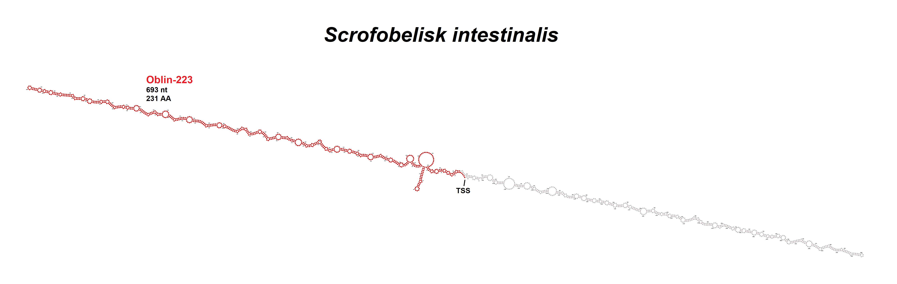
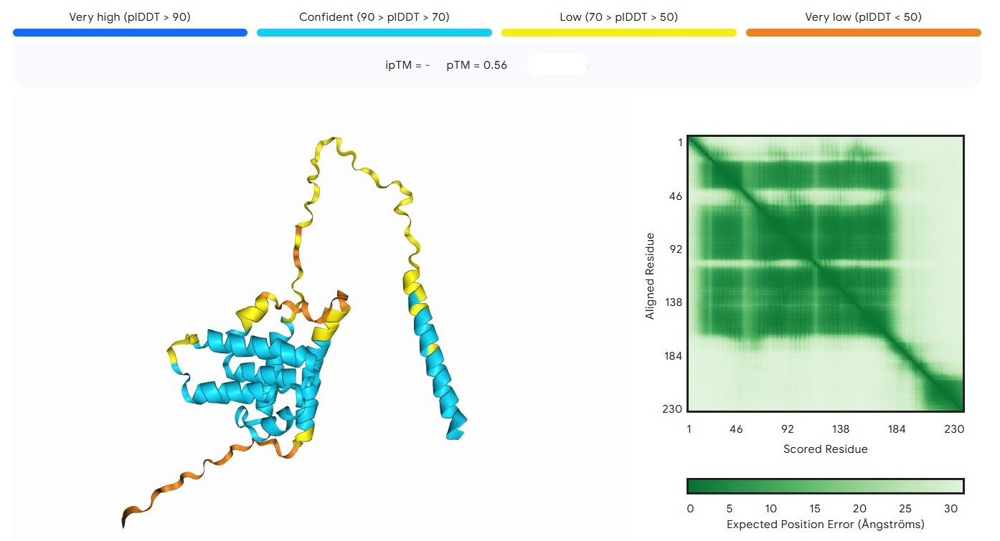

# No guts, no glory: A novel RNA element of the mammalian gut microbiome
written by: [Jade Juba]

### Scrofobelisk intestinalis
*"Scrof-" relates to the pig (Sus scorfa), the organism in which this obelisk was predominantly found; "-obelisk" relates to obelisk, following the naming conventions for viruses; "intestinalis" relates to the primary samples in which this obelisk is found--faecal matter and the gut.*


## Abstract

Obelisks are novel RNA elements identified by Zheludev et al. which have been identified in animal and environmental microbiomes. These circular, rod-shaped structures are pervasive, able to persist in their niches for long periods of time, but have no known function or affect on organismal phenotypes and no similarity to known biological agents. Obelisks have genomes of ~1 kb which encode for one or more proteins, termed Oblins, which the Obelisk does not have the ability to produce without the aid of resources from host cell machinery. This sets them apart from both DNA and RNA viruses, therefore they constitute their own phylogenetic group. Here, we investigate a group of obelisks found predominantly in the gut microbiome of pigs and other mammals. Scrofobelisk intestinalis elements are ~1280 nt in length, each coding for one putative Oblin. The obelisk nucleotide sequences and Oblin amino acid sequences have no significant similarities to known sequences, nor any identifiable protein domains based on sequence. This obelisk is not geographically bound and cannot be associated with any known phenotypes or disease states. Our results expand the body of knowledge on the vast variety of obelisks and their Oblins and where they exist in organisms and the world. These findings, when integrated into the broader dataset of what is known about obelisks, highlight the necessity of deeper computational and experimental analysis in uncovering the functions of these novel elements. Our analysis covers the basics of Scrofobelisk intestinalis while laying the foundation for further studies into the phenotypes it is associated with and the microorganisms it exists in.

## Results

### Ecology

The centroid obelisk (ID Obelisk_223_1_1) is associated with a study by Keel et al. for the U.S. Meat and Animal Research Center (USMARC) of the U.S. Department of Agriculture (USDA) [2020]. Knowing total RNA-seq, in which ribosomal RNA is depleted before sequencing of all RNAs in a sample, is costly, Keel et al. set out to determine the optimal sequencing depth for total RNA-seq to maximize cost-effectiveness without losing out on useful information in the sample. To do this, they performed total RNA-seq on liver, hypothalamus, and latissimus dorsi muscle from Sus scrofa, the wild boar. This obelisk was found in a single replicate from one of the liver samples. Interestingly, it is the only obelisk in the dataset found in an organ other than the gut.

Two obelisks (223_1_2 and 223_1_3) were found in pig faeces from animals in two Chinese provinces, Henan and Yunnan, and are categorized as gut metagenome samples. The authors of this study sequenced RNA viromes from different ecological samples across China to profile virome diversity [Chen et al, 2022]. Another two (223_1_6 and 223_1_7) were found in the cecum of two out of six extremely obese female pigs in Zhejiang, China, in a study which sought to characterize the relationship between gut microbiota and fat deposition [Liu et al., 2023]. Two (223_1_4 and 223_1_5) were found in sludge [Macro transcriptional analysis, 2021]. Sludge is a slurry of water and solids; it which may exist naturally, e.g., in riverbeds, but may be produced by wastewater treatment and industrial processes, in which case it can contain faeces, organic matter, and microorganisms from many different sources. One (223_2_1) was found in human feaces in England as part of a yet-to-be-published study which collected microbiological data for pathogen identification [INTEGRATE 2023]. One (223_2_2) was found in an anal swab sample from a coypu (a herbivorous, semiaquatic rodent) in Guangxi, China (these rodents do not live in China naturally, so the animal either existed in a lab in China, or the anal swab sample was delivered to China for this experiment) [Meta-transcriptomic analysis 2022].

We must exercise caution when interrogating the sources of these obelisks. The fact that the sample was labelled as originating from a certain location does not mean the organism lived in that location. In some cases, the paper attached to the data will provide some idea as to the origin of the sample, but for most of these obelisks, a paper does not exist. Regardless, the organism and organs of origin have commonalities which can tell us about where the obelisk exists. Most of the samples are faecal or from the gut of mammals (pig, human, and coypu). One sample is from porcine liver, although this seems to be an outlier in terms of tissue/sample type, and could represent contamination of liver tissue. Two obelisks were identified in sludge of unknown origin, but this sludge may have contained faecal matter. Additionally, two obelisks were identified in heavily obese pigs; however, there is not enough data to draw a link between the presence of these obelisks and the fact that the pigs were obese, because this obelisk was also present in several other pigs whose physical conditions were not described.

There is a question as to why obelisks from this family were identified twice in several datasets. It is possible that the methods which the researchers used to set up these studies were, unwititngly to the researchers, better suited to the discovery of these relatively small and circular RNA elements. This would mean that obelisks from this family were not necessarily more prevalent in the organisms sampled for these experiments, but the experiment was just more sensitive to the obelisks. This possibility is one of the reasons why I am not inclined to associate this obelisk with obesity in pigs, despite the fact that it was discovered in two different obese pigs in the same experiment. 

From this, I hypothesize that this group of obelisks is limited to the gut microbiome of a diverse group of mammals, and is not geographically limited. Under this hypothesis, the obelisks present in the sludge samples would likely represent faecal matter from a mammal. It makes sense for this obelisk to not be geographically restricted because livestock and other mammals are transported or travel between borders, and humans travel between borders constantly. If this obelisk is spread between a wide array of mammals, at this point it would be present in most locations in the world. This hypothesis is made in medium-high confidence, because there is some doubt due to inconclusive data.

The datasets in which these obelisks are found are not conducive to a hypothesis on any phenotypes these obelisks may be associated with. Most datasets are not associated with any disease, or do not have this information listed.

### Virus Genome



This figure was produced using the RNAfold WebServer [Lorenz et al, 2011].

### Oblin Structure



This figure was produced using AlphaFold. Oblin structures predicted by AlphaFold and included in the paper by Zheludev et al. [2024] are all made up of alpha-helices and disordered stretches between them like this oblin; however, most oblins shown there have larger intrinsically disordered loops between alpha helices than this oblin does.

### Scrofobelisk intestinalis oblin phylogeny


I generated an amino acid sequence alignment using MEGA v11.0.13 [Tamura et al, 2021], exported it in FASTA format and converted it to PHYLIP interleaved format with EMBOSS seqret, and generated a tree using PhyML v3.0 [Guindon et al, 2010]. For PhyML, I left all parameters as default except: In [Substitution Model -> Automatic Model Selection by SMS], I selected [AIC] criterion to better suit the small number of sample sizes I have; in [Branch Supports], I selected [Standard bootstrap analysis] for 100 bootstraps. I visualized the resulting tree in FigTree v1.4.4, selecting the clade of oblins 223_2_1 and 223_2_2 to be the outgroups, as these oblins were clearly slightly different from the rest (had 1281 nt instead of 1280 nt, and did not align as well to the rest of the oblins as they did to each other.) The bootstrapping values are a little hard to see because the software improperly formatted the region where oblins were very similar, but the value between 223_1_2 and _1_1 is 96, and the value between _1_1 and _1_4 is 11. It is clear that PhyML was more confident in the grouping of 223_2_1 and 223_2_2, and the separation of 223_1_3 from the rest of the oblins, but the bootstrapping values get very low between the oblins which are nearly identical, indicating that PhyML was not sure how the evolutionary history of these oblins differs in that region.

## Discussion

Obelisk 223, named Scrofobelisk intestinalis, was identified in nine samples across six BioProjects in the NCBI database. Most of these samples came from mammals: pigs, human, and coypus; two came from sludge of unknown composition. Most mammalian samples were related to the gut - faecal matter, cecum, anal swabs - with one Sus scrofa sample related to the liver. Many of these samples were from China, but the obelisk was also found in experiments performed in the U.S. and England. This strange mix of sources can be deconvoluted, but other features of these obelisks - their possible functions, phenotypes they are associated with, and other nucleic acids or proteins they have similarity to - proved to be difficult to elucidate.

This obelisk seems to be associated with the gut microbiome despite its existence in a sample originating from pig liver. This sample may have been contaminated, or the obelisk, which could have existed in the gut of the pig, travelled to the liver, possibly inside a bacterium or some other vector which would have mediated its travels. Either way, I believe this sample represents an outlier that is not congruent with the true range of this obelisk in a host. Additionally, although the sludge samples (from the same BioProject) are unlabelled and the constituents of the sludge are unknown, it is possible that the sludge contained faecal matter which carried the obelisk; in this case, the obelisk would still be originating from the gut. The data also shows that this obelisk exists in at least three continents. If it is carried by mammals, including humans, its spread between continents would be inevitable. Therefore we cannot reject the hypothesis that Scrofobelisk intestinalis is associated with the gut of mammals and is not geographically limited; however, we cannot exclude the possibility that it can be found in other regiosn of the body, such as the mouth, or in other organisms that are not mammals.

Nearly all obelisks in the dataset were 1280 nt in length, with two being 1281 nt. The centroid obelisk 223_1_1 forms the characteristic rod structure of obelisks, with a single larger stem loop across from a bulge of single-stranded RNA; the rest of the secondary structures are relatively small, as is expected for a rod-shaped obelisk. All the obelisks  in this group had only one putative ORF which was judged to be of high confidence; the rest of the possible ORFs identified by ORFfinder were short, sparse, and inconsistent between different obelisks in the dataset. The ORF for obelisk 223_1_1 was split between two strands of the rod-structure, highlighting a fascinating feature of obelisks in which the protein-coding region is usually folded in on itself, meaning each half of the ORF is complementary to the other half. As the sequences for six out of nine obelisks (all obelisks beginning in 223_1_ except 223_1_2) were so similar, the ORFs for all of these proteins begin around ~10 bases into the sequence as provided for us (biologically, the beginning of the sequence we were given does not mean anything as the obelisk is circular, but the fact that the ORFs for these different obelisks begins at around the same location in terms of sequence similarity is biologically meaningful as it implies conservation and shared evolutionary history). The putative amino acid sequences for these oblins are almost identical, providing more confidence in the fact that this ORF may be biologically meaningful and has the capacity to code for a real protein. Obelisk 223_1_2 was slightly different, coding for a shorter oblin (217 AA, vs. 230 AA for the other six 223_1_ oblins). This difference can be seen in the obelisk phylogeny, as 223_1_2 appears to have undergone evolution at a faster rate than the rest of the 223_1_ oblins. Obelisks 223_2_1 and 223_2_2 are more similar to each other than they are to the rest of the obelisks here. Found in the coypu, they have 1281 nt, and oblin 223_2_1 has a slightly shorter amino acid sequence than the 230 AA norm at 227 AA. These oblins group together in the phylogeny, signifying their differences; here, they act as the outgroup. The evolutionary history of 223_1_2 in particular is interesting, as it is close enough to the rest of the 223_1_ oblins to be grouped in with them, but has experienced different evolution than the rest. This represents an intriguing pathway for future study.

BLAST searches for the nucleotide and amino acid sequences of the obelisks and oblins yielded no results, even when searching for distantly related sequences. This indicates the obelisk has never been characterized, even as mistake, despite having been identified in a few datasets. The centroid obelisk, 223_1_1, did not match to any known sequences which are characteristic of protein domains when ran through InterProScan. However, when a putative 3D protein-folding structure was generated for oblin 223_1_1 using AlphaFold, the amino acid sequence folded into a structure similar to the ones shown for other oblins in Zhedulev et al. The disordered regions of this structure were formed in low confidence; however, the alpha-helices were generated in confidence, and these are the most striking features which are similar to the structures generated by Zhedulev et al.

The SRR runs in which each obelisk was found were ran through Serratus.io to look for palmprints of RdRp, the RNA-dependent RNA polymerase. Only the run containing the centroid obelisk contained palmprints of RdRps, and these were for two different RNA viruses infecting pigs, porcine pegivirus and pasivirus A. This does not tell us that the RdRp palmprint was found in our obelisk, but that it exists in the sample in which the obelisk originated. It is not likely that our obelisk associates with these viruses because the obelisk was also found in samples from humans, coypus, and sludge of unknown origin. One of these obelisks was also found in a sample from an extremely obese pig, and another obelisk was associated with a dataset which sought to identify pathogens in humans via gut microbiome samples; however, because many of these datasets do not have papers attached to them or the data is incompletely entered, there is no way of associating any of these obelisks with a specific phenotype or conditions in these mammals, therefore we cannot draw any possible conclusions as to what this obelisk may do or what other organisms (i.e., microorganisms) it is associated with.

Suscrobelisk intestinalis remains highly elusive. To further investigate this obelisk, I would perform thorough searches of datasets which gather information on the gut microbiome of different organisms, likely limiting my search to ones related to livestock and humans for efficiency, and look for the obelisk's sequence. If I was able to gather enough data points, I would look for correlations between them, as hopefully these datasets would have more information as to the phenotype or health status of the organisms that the samples were collected from. Furthermore, I would also reconstruct this obelisk's sequence with RNA and introduce it into different strains of bacteria to see if there are any strains in which it is able to persist for long periods of time. I would then see if protein was produced from that obelisk using the host cell's machinery. These last experiments would not tell us about how the obelisk exists and behaves in nature, but it could give us some idea as to in what organism the obelisk is able to exist, and what the protein may be doing.

## References

AlphaFold Server. Google DeepMind. https://deepmind.google/technologies/alphafold/alphafold-server/

Chen, Y. M., Sadiq, S., Tian, J. H., ... Zhang, Y. Z. 2022. RNA viromes from terrestrial sites across China expand environmental viral diversity. Nature Microbiology, 7(1312-1323). https://www.nature.com/articles/s41564-022-01180-2 

EMBOSS seqret. European Bioinformatics Institute (EMBL-EBI). https://www.ebi.ac.uk/jdispatcher/sfc/emboss_seqret

Guindon, S., Dufayard, J. F., Lefort, V., Anisimova, M., Hordijk, W., & Gascuel, O. 2010. New algorithms and methods to estimate maximum-likelihood phylogenies: Assessing the performance of PhyML3.0. Systematic Biology, 59(3):307-321. https://www.ebi.ac.uk/jdispatcher/sfc/emboss_seqret

INTEGRATE Project. 2023. National Center for Biotechnology Information. https://www.ncbi.nlm.nih.gov/bioproject/981050 

Keel, B. N., Oliver, W. T., Keele, J. W., & Lindholm-Perry, A. K. 2020. Evaluation of transcript assembly in multiple porcine tissues suggests optimal sequencing depth for RNA-Seq using total RNA library. Animal Gene, 17(200105). https://www.ars.usda.gov/plains-area/clay-center-ne/marc/ 

Liu, S., Lai, X., Xie, Q., Wang, Z., Pan, Y., Wang, Q., & Zhang, Z. 2023. Holo-omics analysis reveals the influence of gut microbiota on obesity indicators in Jinhua pigs. BMC Microbiology, 23(322). https://bmcmicrobiol.biomedcentral.com/articles/10.1186/s12866-023-03011-8

Lorenz, R., Bernhart, S. H., zu Siederdissen, C. H., Tafer, H., Flamm, C., Stadler, P. F., & Hofacker, I. L. 2011. ViennaRNA Package 2.0. Algorithms for Molecular Biology, 6(26). https://almob.biomedcentral.com/articles/10.1186/1748-7188-6-26 

Macro transcriptional analysis data of anaerobic fermentation and microbial electrosynthesis at low temperature. 2021. National Center for Biotechnology Information. https://www.ncbi.nlm.nih.gov/bioproject/729609 

Meta-transcriptomic analysis of rodent animals. 2022. National Center for Biotechnology Information. https://www.ncbi.nlm.nih.gov/bioproject/795267 

National Library of Medicine. National Center for Biotechnology Information. https://www.ncbi.nlm.nih.gov/ 

Rambaut, A., et al. FigTree. http://tree.bio.ed.ac.uk/software/figtree/

RNAfold WebServer. http://rna.tbi.univie.ac.at//cgi-bin/RNAWebSuite/RNAfold.cgi

Tamura, K., Stecher, G., & Kumar, S. 2021. MEGA11: Molecular Evolutionary Genetics Analysis Version 11. Molecular Biology and Evolution, 38(7):3022-3027. https://academic.oup.com/mbe/article/38/7/3022/6248099 

U.S. Meat and Animal Research Center. U.S. Department of Agriculture. https://www.ars.usda.gov/plains-area/clay-center-ne/marc/

Zheludev, I. N., Edgar, R. C., Lopez-Galiano, M. J., de la Pena, M., Babaian, A., Bhatt, A. S., & Fire, A. Z. 2024. Viroid-like colonists of human microbiomes. Cell, 187(23). https://www.cell.com/cell/fulltext/S0092-8674(24)01091-2

# Viral Short Story

```
June 16th, 1687. I have little time. This entry will be brief.

Early this morn, the captain spotted an island in the fog. No sooner than he called to announce it was the ship pulled in its direction by a force inexplicable. As the island drew near, a **monolith of two strands, rod-like with sides that bulged irregularly**, seemed to rise from the horizon. By the time the ship ran ashore, we could see **the strands were connected to form a continuum.** The structure trembled with energy as if to frighten us further. Just as the captain shouted to stay on board, the first mate, like a man possessed, leapt onto the smooth black pebbles of the shore and ran into the mist. One man ran after him, then the next, and I followed, although now I cannot say why.

Drawing closer, staring up at this thing, I saw **from its jagged backbone protruded these shapes, four distinct ones repeated throughout the structure, and intermingled with those from the other strand, except at spots where the backbone bulged.** I was so entranced by the sight of it that I crashed into our first mate from behind. He fell to his knees, and only then did I see **the base of this structure was obscured by grotesque lumps of flesh, pig and man, and a viscous brown sludge which was strewn about them. It was as if this structure was growing out of the entrails of these creatures.**

**It was like nothing I had ever seen before.** "My god," I gasped, "what is this?" The first mate's head turned slowly, and his eyes met mine. His expression is burned into my mind. He was not there. He was gazing beyond me, into a place unknown. His lips fell open. **"Obelisk,"** he said, except he did not--the word was clear as day though it came from all around me. It is the last thing I remember before the world went black. I awoke here, on the ship, alone. My men are calling to me from the fog, far away though their voices are whisper close, muttering of **ribonucleic acids and microbiomes,** things I do not understand. I must go back. If this is my last entry, know I am still out there. Do not come looking.
```