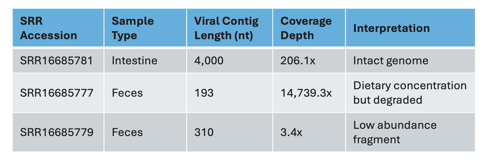
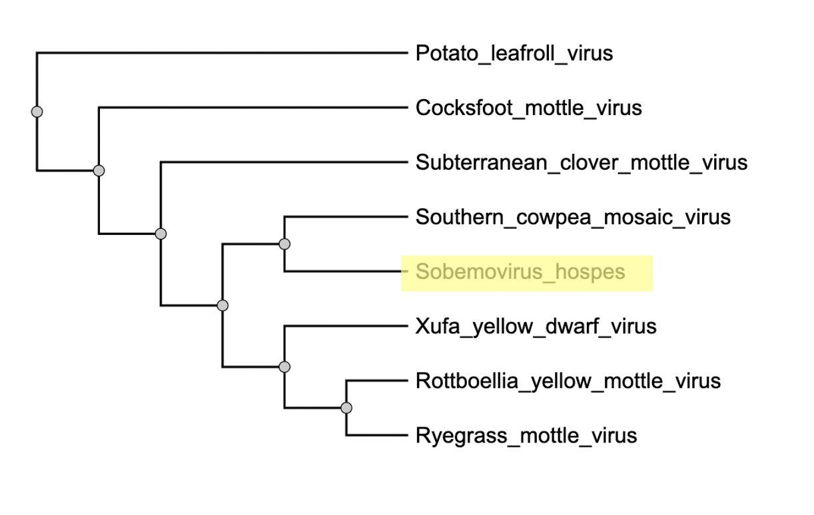
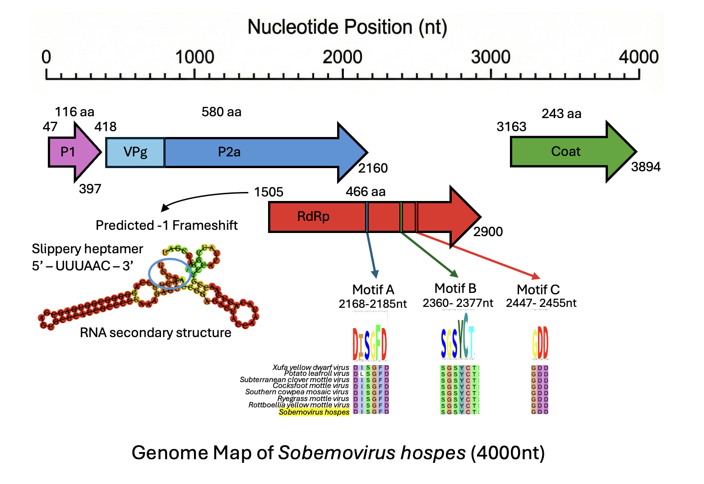
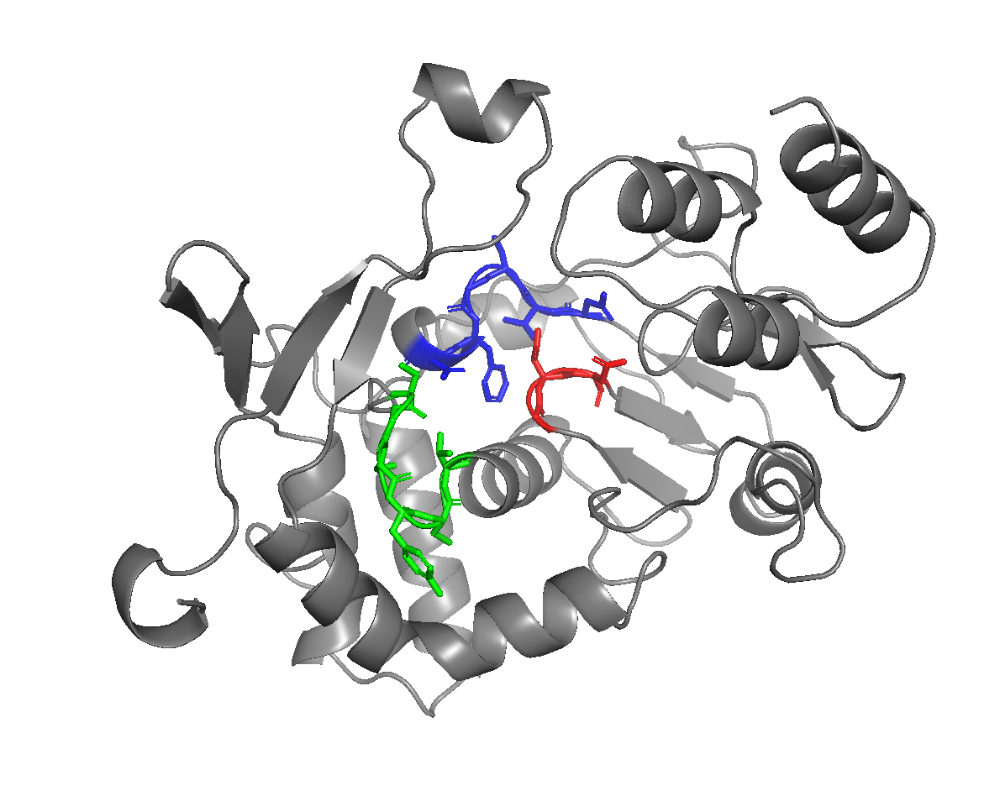

# {You Are What You Eat: De Novo Assembly of a Plant-Infecting Sobemovirus 
from the Enteric Virome of the Herbivorous Vole *Neodon fuscus*}
written by: [Eileen Li](https://github.com/lieilee4)

### {*Sobemovirus hospes*}

The species epithet *hospes* is Latin for "guest" or "stranger."This name reflects 
the ecological context of the finding. As a plant virus found inside an animal's 
gut and feces, it is biologically a "stranger" to the vole. It is a transient 
"guest" passing through the digestive tract via the host's diet, serving as a 
marker of consumption rather than disease.

## Abstract

Characterizing vertebrate viromes is essential for pathogen surveillance, though 
it is frequently complicated by the ambiguity between genuine infection and 
environmental contamination. Leveraging the exponential growth of public databases, 
computational approaches now facilitate the high-throughput discovery of viral 
diversity previously overlooked in existing sequencing data. Herein, we mine the 
SRA database and discover a novel positive-sense RNA virus associated with the 
Qinghai vole (*Neodon fuscus*), which we name *Sobemovirus hospes*. Our putative virus 
is phylogenetically sister to the type species *Southern cowpea mosaic virus* and 
retains a strict plant-virus genome organization. The identification of a canonical 
Arginine-Rich Motif and -1 ribosomal frameshift within a mammalian dataset suggests 
that *S. hospes* represents a dietary passenger derived from alpine sedges, rather
than a cross-species host jump. Our computational results serve as a foundation 
for using structural biology to resolve ecological ambiguity in metagenomic data.
More broadly, Qinghai voles are a dominant keystone species on the Tibetan Plateau; 
studying their virome can not only contribute to deeper insights into their 
ecology but also demonstrate non-invasive methods for monitoring viral diversity 
in fragile ecosystems.

## Results

### Identification of a *Sobemovirus* in the Vole Enteric Virome
The viral RNA-dependent RNA polymerase (RdRp) signature was initially identified 
using Serratus, a cloud-based infrastructure designed to mine the Sequence Read 
Archive (SRA) for novel viral palmprints [Edgar et al., 2022]. Traceback of the 
specific RdRp index sequence linked the viral signal to BioProject PRJNA776963 
("Metagenomic Analysis for Viromes in Different Tissues of Wild Voles from the 
Eastern Tibetan Plateau") [Wu et al., 2022]. The virus was detected in 6 distinct 
sequencing runs using paired-end Illumina Novaseq, corresponding to independent 
biological replicates, all from this BioProject, spanning 3 intestine samples 
(SRR16685783, SRR16685784, SRR16685781) and 3 feces samples (SRR16685779,
SRR16685777, SRR16685780). 


### Assembly Methodology
The viral genome recovery proceeded in two stages. First, we retrieved the RdRp 
micro-assemblies identified by Serratus. Using the Biostrings package in R, we 
selected the longest initial candidate (3,215 nt) from this dataset (see code 
at the end of document). 

Second, to investigate if a full genome can be assembled, we searched the 
pre-assembled contigs generated by the Serratus 'Logan' infrastructure. To 
initiate this process, the 3,215 nt sequence was first analyzed using SMS ORF 
Finder to predict the boundaries of the RdRp gene [Stothard, 2000]. A "seed-based"
filtering approach was then applied to the contig pools using a conserved 30-nt 
probe derived from the N-terminus of the predicted RdRp gene (see code below). 
This analysis successfully recovered an extended 4,000 nt genome from library 
SRR16685781, exhibiting a mean coverage of ~206x, determined by extracting the 
assembler-reported k-mer abundance (ka:f) from the contig headers (see code at 
the end of document). 


### Ecological Context 
The associated study by Wu et al. (2021) aimed to characterize the viral diversity 
in wild Qinghai voles (*Neodon fuscus*), which are both unique to and the most 
common rodent species in the eastern Tibetan Plateau. Their goal was to establish 
a baseline virome and assess the risk of future zoonotic disease. The biotic 
context is defined by the plateau‑vole host living in moist meadows of 
high‑elevation alpine grasslands (3,700–4,800 m) on the Qinghai–Tibet Plateau 
[Wilson et al., 2017], within a vegetation community typically dominated by 
sedges (*Cyperaceae*) and grasses (*Gramineae*) characteristic of alpine meadows 
in the region [Shimono et al., 2010].


### Co-occurrence Validation
To validate the metadata describing these samples as enteric, we analyzed the 
co-occurring viral signatures using Serratus [Edgar et al., 2022]. The majority 
of positive libraries (including the genome assembly intestine sample SRR16685781 
and fecal sample SRR16685779) contained high-confidence reads mapping to 
Picornaviridae and Picobirnaviridae. As these are ubiquitous vertebrate enteric 
viruses [Fregolente et al., 2016], their presence confirms that the sequencing 
libraries represent true fecal/gut material and that the novel virus was physically 
present within these samples. 


### Hypothesis: Trophic Transfer

To identify the viral coding regions, Open Reading Frames (ORFs) were predicted 
from the assembled 4,000 nt contig using the SMS ORF Finder (Start codon: ATG) 
[Stothard, 2000]. This analysis revealed a genome organization characteristic of 
the family Sobemoviridae, containing four putative ORFs: a 5' proximal 
Silencing Suppressor (P1), a central polyprotein containing the VPg/Protease (P2a), 
the RNA-dependent RNA polymerase (RdRp), and the 3' structural Coat Protein (Fig X).

To confirm the taxonomy, we analyzed the RdRp sequence using PalmID, a specialized
tool for viral polymerase discovery [Babaian and Edgar, 2022]. PalmID detected 
a high-confidence "Palmprint" (Score 54) sharing 98% amino acid identity with 
*Rottboellia yellow mottle virus (Solemoviridae)*. Furthermore, the PalmID SRA 
search indicated that matching palmprints are frequently annotated as "gut metagenome,"
supporting the hypothesis that this viral lineage is a common dietary passenger.

Following this, a BLASTp search [Altschul et al., 1990] of the translated RdRp 
confirmed the PalmID findings and broadened the context. The closest relatives of 
*S. hospes* are all plant-infecting viruses, including *Xufa yellow dwarf virus* 
(65% identity) [Zhang et al., 2020] and *Ryegrass mottle virus* (58% identity) 
[Balke et al., 2023].

This reveals a stark ecological mismatch between the host (mammal) and the virus 
family (*Sobemoviridae*). Comparing the observed niche (vole gut/feces) against 
the expected niche of grasses/sedges, we hypothesize that *S. hospes* is an 
artifact of trophic transfer. The voles act as "biological samplers," 
concentrating the virus in their gut by grazing on infected alpine vegetation. 

### Quantitative Validation

This hypothesis is supported by a comparison of assembly statistics across the 
datasets (Table 1). While the Intestine sample (SRR16685781) yielded the complete 
4,000 nt genome at moderate coverage (~206x), the Feces sample (SRR16685777) 
contained only short, fragmented viral contigs (193 nt) but at an extremely high 
coverage depth of ~14,739x (see script above). This pattern—high integrity in the 
gut lumen versus high concentration and fragmentation in feces is consistent with 
dietary passage, a phenomenon well-documented in mammalian enteric viromes where 
abundant plant viruses represent food-derived contamination rather than active 
replication [Zhang et al., 2006].

**Table 1. Comparative assembly statistics for libraries containing the viral 5' terminus.** Data derived from a seed-based retrieval script querying the Logan SRA assembly database. Coverage depth represents k-mer abundance (ka:f) reported by the assembler.



## Taxonomic Classification

It is important to distinguish between database hits annotated broadly as 
Solemoviridae and our specific classification of Sobemovirus. Solemoviridae 
is the viral family that encompasses the genus Sobemovirus. While initial database
matches established the family-level identity, our phylogenetic analysis 
(Figure 1) provides the necessary resolution for genus assignment. Because 
*S. hospes* is recovered as the sister taxon to *Southern cowpea mosaic virus*—
the type species that defines the genus—we can definitively classify this new 
virus within the genus Sobemovirus (Family: Solemoviridae).



**Figure 1. Maximum Likelihood Phylogenetic Tree of *Sobemovirus hospes*.** The 
phylogenetic relationship of S. hospes was reconstructed using the amino acid 
sequences of the viral RNA-dependent RNA polymerase (RdRp). The tree was generated 
using the NGPhylogeny.fr pipeline [Lemoine et al., 2019], utilizing MUSCLE for 
multiple sequence alignment, Gblocks for alignment curation, and PhyML for maximum 
likelihood tree reconstruction (LG substitution model). The tree is rooted on 
the outgroup *Potato leafroll virus* (Family *Solemoviridae*, Genus *Polerovirus*).
The analysis recovers *S. hospes* as the sister taxon to the type species 
*Southern cowpea mosaic virus*, forming a well-supported clade distinct from 
the *Rottboellia/Ryegrass* lineage. This placement confirms the classification 
of *S. hospes* within the genus *Sobemovirus*.

### Virus Genome {Q3}




**Figure 2. Genomic organization and structural conservation of *Sobemovirus hospes*.** 
The complete 4,000 nt positive-sense RNA genome was identified from the *Neodon fuscus* 
enteric transcriptome (BioProject PRJNA776963; Wu et al., 2021). While viral reads 
were detected across six independent datasets from this BioProject, the consensus
genome presented here was recovered *de novo* from library SRR16685781, exhibiting 
a mean coverage depth of ~206x. The schematic displays four Open Reading Frames (ORFs) 
predicted by SMS ORF Finder (Stothard, 2000) (Start codon: ATG). P1 (Purple) encodes a 
putative Silencing Suppressor.P2a (Blue) encodes the polyprotein containing 
VPg and Protease domains. RdRp (Red) encodes the RNA-dependent RNA polymerase;
expression is mediated by a -1 ribosomal frameshift at nucleotide 1505. An arrow 
at this coordinate points to the predicted RNA secondary structure generated by 
ViennaRNA (Lorenz et al., 2011), showing a stable stem-loop downstream of the 
slippery sequence `UUUAAAC` that facilitates ribosomal slippage (circled in blue). 
The structural Coat Protein (Green) is located at the 3' terminus. The RdRp 
arrow details the nucleotide positions of motifs A, B, and C, with the corresponding 
conservation shown via a MUSCLE multiple sequence alignment (Edgar, 2004) of *S. hospes* 
(highlighted in yellow) against seven representative *Sobemoviridae* species.



**Figure 3. Model of the RdRp of *S. hospes*.** Initial structure prediction using 
AlphaFold 3 (Abramson et al., 2024) resolved the core Palm architecture containing 
Motifs A and B; however, the catalytic GDD triad (Motif C) was consistently predicted 
within a disordered loop region, disrupting the active site geometry. To resolve 
this, the tertiary structure was modeled via SWISS-MODEL (Waterhouse et al., 2018) 
using the crystal structure of the Coxsackievirus A16 polymerase 
(PDB: 5Y6Z; Bi et al., 2017) as a template. PyMOL (Schrödinger, LLC) was used for
figure generation. The model exhibits the canonical "right-hand" viral polymerase
structure, with the active site formed by the clustering of Motif A (blue), 
Motif B (green), and Motif C (red).


**Figure 4. Electrostatic profile of the *S. hospes* Coat Protein.** Analysis 
performed using a sliding window of 5 amino acids (EMBOSS Charge; Rice et al., 2000). 
The plot reveals a distinct positive charge spike (Net Charge > +3) exclusively 
at the N-terminus (residues 1–25). This confirms the presence of an 
Arginine-Rich Motif (ARM), a positively charged molecular "magnet" required
to encapsulate the negatively charged viral RNA genome [Satheshkumar et al., 2005; 
Tamm et al., 2000].


## Discussion

{Characterizing *Sobemovirus hospes* demonstrates the power of mining overlooked 
transcriptomes, specifically from the unique Qinghai vole, to reveal novel viral
diversity without new fieldwork. Biologically, the most compelling insight is 
the preservation of strict plant-virus architecture, including the canonical -1 
ribosomal frameshift and N-terminal Arginine-Rich Motif, despite its recovery 
from a mammalian host. This structural rigidity confirms the virus is likely a 
dietary passenger rather than evidence of jumping from one kingdom to another, 
illustrating how genomic re-analysis can definitively resolve the ecological 
ambiguity between genuine infection and environmental exposure.}

## References

{Abramson, J., Adler, J., Dunger, J., Evans, R., Green, T., Pritzel, A., Ronneberger, O., Willmore, L., Ballard, A. J., Bambrick, J., Bodenstein, S. W., Evans, D. A., Hung, C.-C., O’Neill, M., Reiman, D., Tunyasuvunakool, K., Wu, Z., Žídek, A., Haque, E., ... Jumper, J. (2024). Accurate structure prediction of biomolecular interactions with AlphaFold 3. Nature, 630, 493–500. https://doi.org/10.1038/s41586-024-07487-w

Altschul, S. F., Gish, W., Miller, W., Myers, E. W., & Lipman, D. J. (1990). Basic local alignment search tool. Journal of Molecular Biology, 215(3), 403–410. https://doi.org/10.1016/S0022-2836(05)80360-2

Babaian, A., & Edgar, R. C. (2022). Ribovirus classification by a polymerase barcode sequence. PeerJ, 10, e14055. https://doi.org/10.7717/peerj.14055

Balke, I., Silamikelis, I., Radovica-Spalvina, I., Zeltina, V., Resevica, G., Fridmanis, D., & Zeltins, A. (2023). Ryegrass mottle virus complete genome determination and development of infectious cDNA by combining two methods—3′ RACE and RNA-Seq. PLoS ONE, 18(12), e0287278. https://doi.org/10.1371/journal.pone.0287278

Bi, P., Shu, B., & Gong, P. (2017). Crystal structure of the coxsackievirus A16 RNA-dependent RNA polymerase elongation complex reveals novel features in motif A dynamics. Virologica Sinica, 32(6), 526–535. https://doi.org/10.1007/s12250-017-4066-8

Edgar, R. C. (2004). MUSCLE: Multiple sequence alignment with high accuracy and high throughput. Nucleic Acids Research, 32(5), 1792–1797. https://doi.org/10.1093/nar/gkh340

Edgar, R. C., Taylor, J., Lin, V., Altman, T., Barbera, P., Meleshko, D., Lohr, D., Novakovsky, G., Buchfink, B., Al-Shayeb, B., Banfield, J. F., de la Peña, M., Korobeynikov, A., Chikhi, R., & Babaian, A. (2022). Petabase-scale sequence alignment catalyses viral discovery. Nature, 602, 142–147. https://doi.org/10.1038/s41586-021-04332-2

Fregolente, M. C. B., Zerbini, F. M., & Silva, J. M. F. (2008). Complete genome sequence of Southern cowpea mosaic virus and its relationship to sobemoviruses. Archives of Virology, 153(11), 2115–2118. https://doi.org/10.1007/s00705-008-0213-9

Guindon, S., & Gascuel, O. (2003). A simple, fast, and accurate algorithm to estimate large phylogenies by maximum likelihood. Systematic Biology, 52(5), 696–704. https://doi.org/10.1080/10635150390235520

Guindon, S., Dufayard, J.-F., Lefort, V., Anisimova, M., Hordijk, W., & Gascuel, O. (2010). New algorithms and methods to estimate maximum-likelihood phylogenies: Assessing the performance of PhyML 3.0. Systematic Biology, 59(3), 307–321. https://doi.org/10.1093/sysbio/syq010

Lemoine, F., Correia, D., Lefort, V., Doppelt-Azeroual, O., Mareuil, F., Cohen-Boulakia, S., & Gascuel, O. (2019). NGPhylogeny.fr: New generation phylogenetic services for non-specialists. Nucleic Acids Research, 47(W1), W260–W265. https://doi.org/10.1093/nar/gkz303

Lorenz, R., Bernhart, S. H., Höner zu Siederdissen, C., Tafer, H., Flamm, C., Stadler, P. F., & Hofacker, I. L. (2011). ViennaRNA Package 2.0. Algorithms for Molecular Biology, 6, Article 26. https://doi.org/10.1186/1748-7188-6-26

Satheshkumar, P. S., Lastri, K., & Savithri, H. S. (2005). The role of arginine-rich motif and beta-annulus in the assembly and stability of Sesbania mosaic virus capsids. Journal of Molecular Biology, 353(2), 447–458. https://doi.org/10.1016/j.jmb.2005.08.021

Shimono, A., Zhou, H., Shen, H., Hirota, M., Ohtsuka, T., & Tang, Y. (2010). Patterns of plant diversity at high altitudes on the Qinghai-Tibetan Plateau. Journal of Plant Ecology, 3(1), 1–7. https://doi.org/10.1093/jpe/rtq002

Stothard, P. (2000). The Sequence Manipulation Suite: JavaScript programs for analyzing and formatting protein and DNA sequences. BioTechniques, 28(6), 1102–1104.

Tamm, T., & Truve, E. (2000). Sobemoviruses. Journal of Virology, 74(14), 6231–6241. https://doi.org/10.1128/jvi.74.14.6231-6241.2000

Waterhouse, A., Bertoni, M., Bienert, S., Studer, G., Tauriello, G., Gumienny, R., Heer, F. T., de Beer, T. A. P., Rempfer, C., Bordoli, L., Lepore, R., & Schwede, T. (2018). SWISS-MODEL: Homology modelling of protein structures and complexes. Nucleic Acids Research, 46(W1), W296–W303. https://doi.org/10.1093/nar/gky427

Wilson, D. E., Mittermeier, R. A., & Lacher, T. E., Jr. (Eds.). (2017). Handbook of the mammals of the world: Vol. 7. Rodents II. Lynx Edicions.

Wu, Z., Lu, L., Du, J., Yang, L., Ren, X., Liu, J., Yang, J., Dong, J., Sun, L., Zhu, Y., Jiang, J., & Liu, Q. (2022). Metagenomic analysis of viromes in tissues of wild Qinghai vole from the eastern Tibetan Plateau. Scientific Reports, 12(1), Article 17239. https://doi.org/10.1038/s41598-022-22134-y

Zhang, C., Guo, R., Zhang, S., Yang, J., Ding, M., & Zheng, S. (2016). Complete genome sequence and organization of Rice stripe mosaic virus, a new cytorhabdovirus in rice. Archives of Virology, 161(12), 3487–3490. https://doi.org/10.1007/s00705-016-3041-6

Zhang, Y., Wang, Y., Meng, J., Xie, L., & Wang, X. (2020). Identification and characterization of a novel sobemovirus infecting Cyperus esculentus. Archives of Virology, 165(7), 1711–1715. https://doi.org/10.1007/s00705-020-04633-x
}

# Viral Short Story

```
Captain’s Log – 17th Day of the Seventh Moon, Year of Our Plague

By the stars, I’ve never seen a beast so cunning nor so hidden. ’Tis not on the deck nor in the hold that it dwells, but in lands far yonder. The lads returned from the cliffs of the eastern Tibetan Plateau and brought word of a strange creature: ***it was detected in wild Qinghai voles***, they say, hopping like ghosts across the rocks.

What manner of fiend it be, none can tell, though learned men call it a vertebrate-associated virus, of a breed known to meddle in the flesh of creatures aplenty. More curious still, ***it shows no close matches to known rodent viruses in BLAST searches, aligning only to sequences from other species***, a rogue with no equal among the ledgers of scholars.

They say it haunts specific quarters of its hosts, showing a ***tissue-specific presence***, skulking in the liver or spleen while leaving other parts untouched, like a true pirate picking the richest hold. Its secrets were uncovered by the scribes, ***for its RNA was recovered from pooled liver, spleen, and fecal samples in the vole virome study***, capturing what the eye could not see.

And mark me, the final clue reveals its nature: ***it likely belongs to the RNA virus category***, swift and elusive as the sea winds themselves. It rides unseen among the voles, a specter of the unknown, as we sail cautiously and keep our powder dry, wary of what unseen horrors may follow in its wake.

—End of Log, Captain E. Blackfin
```

## Supplementary Code

```
### 1. Data Retrieval & Assembly Logic (Reference Only)

```{r download-data, eval=FALSE, echo=TRUE}
# REPRODUCIBILITY STEP:
# This command downloads the raw SRA data used for the original assembly.
# WARNING: This downloads ~4GB of data. It is set to eval=FALSE to avoid 
# downloading large files during report generation.

# Requires SRA Toolkit installed on the system
system("prefetch SRR16685781")
system("fastq-dump SRR16685781")

library(Biostrings)

# --- STEP A: INITIAL SEARCH WITHIN RDRP FILES ---
file_path <- "/Users/lileenei/Downloads/SRR166857xx.rdrp.fa"
rdrp_sequences <- readDNAStringSet(file_path)
sequence_lengths <- width(rdrp_sequences)
longest_index <- which.max(sequence_lengths)
longest_contig_seq <- rdrp_sequences[[longest_index]]
print(paste("Initial Candidate Length:", length(longest_contig_seq), "bp"))

# --- STEP B: SECONDARY SEARCH TO EXTEND GENOME ---
folder_path <- "/Users/lileenei/Downloads/E-SRR files" 
file_list <- list.files(path = folder_path, pattern = "\\.fa$|\\.fasta$", full.names = TRUE)
all_contigs <- do.call(c, lapply(file_list, readDNAStringSet))
probe_seq <- DNAString("ATGCCCCTCGTTGCGGTTGGAAGATCGGGT") 
hits <- vmatchPattern(probe_seq, all_contigs)
candidates <- all_contigs[elementNROWS(hits) > 0]
longest_idx <- which.max(width(candidates))
final_genome <- candidates[[longest_idx]]
print(paste("Final Genome Length:", length(final_genome), "nt"))
```

### 2. Analysis & Results (Executable)
```
```{r analysis-results, eval=TRUE, echo=TRUE}
# RESULTS STEP (Executable):
# This block loads the final assembled genome provided in the repository 
# and recreates the summary table manually (since raw search files are excluded).

library(Biostrings)

# --- PART A: Load the Final Genome ---
# load the sequence to confirm length and structure
genome_path <- "sobemovirus_hospes_full_genome.fasta" 
candidates <- readDNAStringSet(genome_path)

# Print the Final Sequence Stats
final_seq_name <- names(candidates)[1]
final_seq_len <- width(candidates)[1]
print(paste("Final Genome Loaded:", final_seq_name))
print(paste("Length:", final_seq_len, "nt"))


# --- PART B: Reconstruct the Abundance Table ---
# Since we cannot run the raw search on GitHub (files too large), 
# we manually reconstruct the table of hits found during the original analysis.

# 1. Define the data manually (Source: Original analysis of SRR166857xx)
srr_ids <- c("SRR16685781", "SRR16685779", "SRR16685777")
sample_types <- c("Intestine", "Feces", "Feces")
lengths <- c(4000, 310, 193) 
coverages <- c(206.098, 3.400, 14739.264) 

# 2. Create the Master Table
full_results <- data.frame(
  SRR_ID = srr_ids,
  Sample_Type = sample_types,
  Length_nt = lengths,
  Coverage = coverages
)

# 3. Sort by Length
full_results <- full_results[order(full_results$Length_nt, decreasing = TRUE), ]

print("--- ANALYZED VIRAL HITS (Reconstructed) ---")
print(full_results)
```
```

