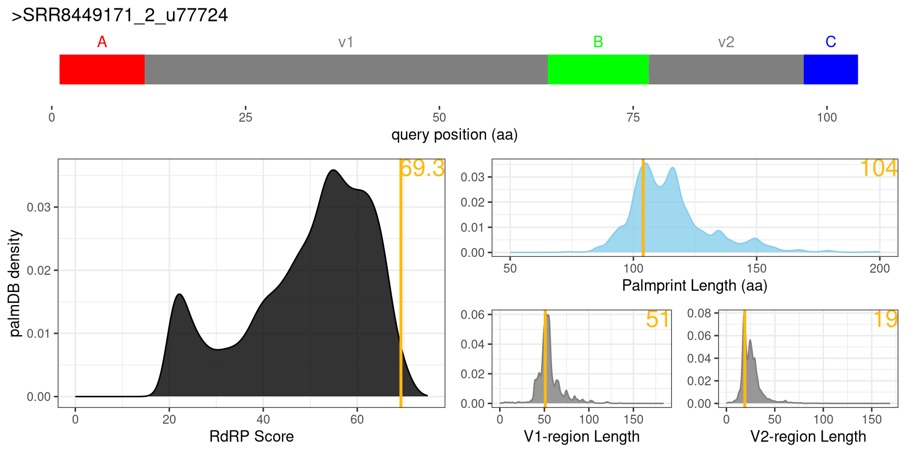
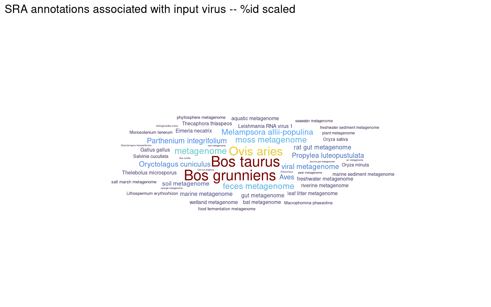
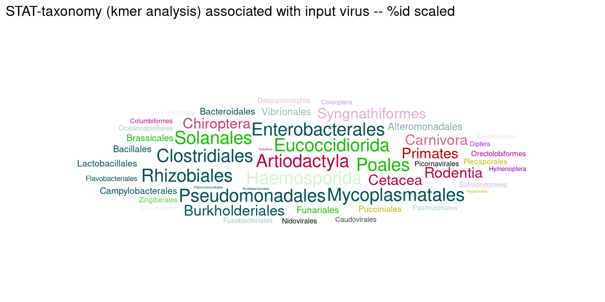
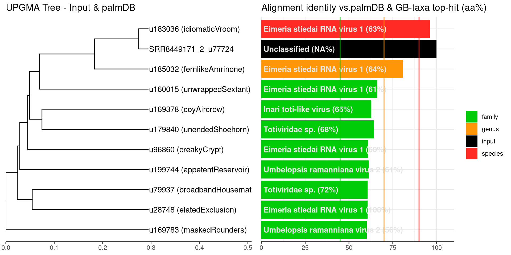
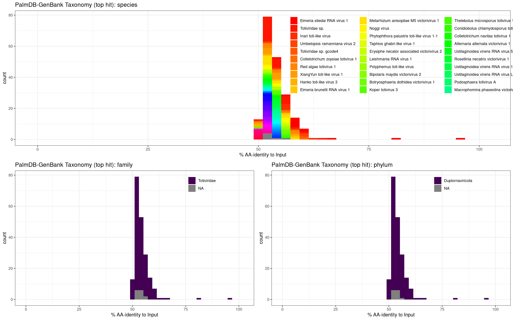
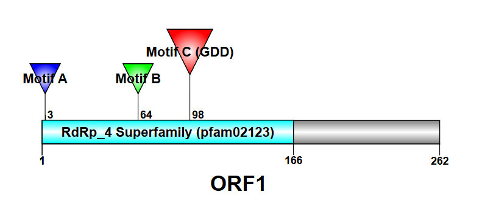
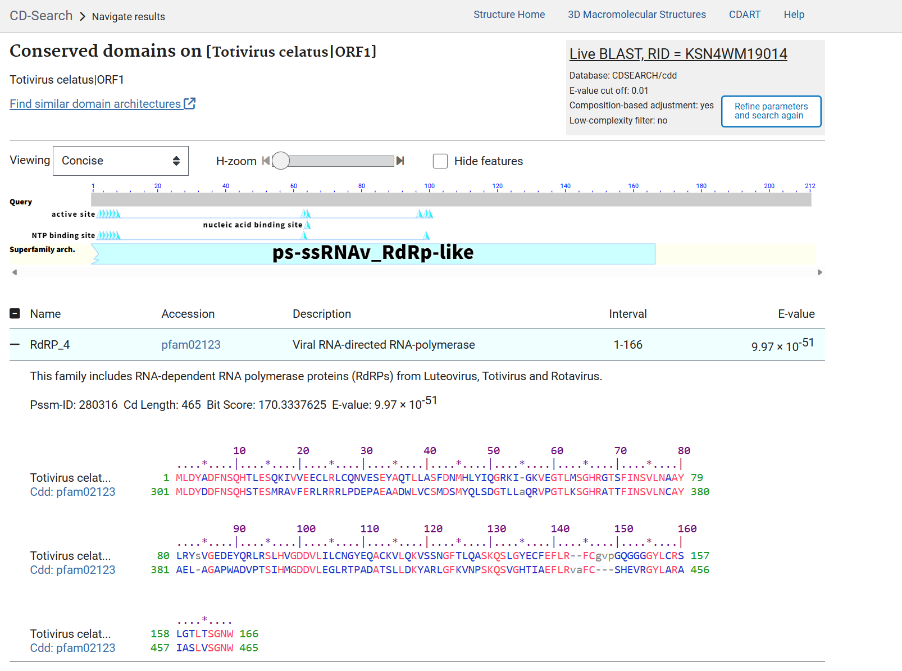

# A Silent Moo-tation: Discovery of *Totivirus celatus*, a 'Trojan Horse' Virus Hidden in Yak Circulation
written by: [Dingjiu Tang](https://github.com/Dangelo2002)

### *Totivirus celatus*
*{Totivirus is the genus name, and celatus means "hidden" or "disguised" in Latin. This term reflects the difficulties encountered during the research. The virus exhibits a paradoxical evolutionary pattern—high protein conservation in the RdRp palm domain (>96%) alongside drastic nucleotide alterations. This drastic sequence alteration effectively "hides" it from conventional nucleotide mapping tools (such as Bowtie2), rendering it undetectable in standard reference-based alignments. Analysis of the ORF1 (Capsid/Gag) region reveals low similarity (~51%) to the prototype Eimeria stiedai RNA virus 1 (ESRV1), indicating that the virus possesses a highly divergent structural "disguise" likely driven by adaptation to the bovine Eimeria host niche.}*


>The Deceptive Treaty: A Visual Metaphor for the Emergence of *Totivirus celatus*.
This allegorical illustration visualizes the cross-species transmission and immune evasion of the virus:
The Peace Treaty (Foreground): The handshake between the Rabbit (original host) and the Bovine soldier (new host) symbolizes the ecological interface or initial contact that allowed the host jump to occur, possibly under conditions of immune tolerance.
The Trojan Eimeria (Midground): The massive wooden horse represents the vector (Eimeria). While it appears to be a singular entity entering the city, the leaking red particles reveal its true cargo: the stealthy Totivirus celatus payload.
The Yak Fortress (Background): Represents the systemic environment of the Yak (Bos grunniens). The Macrophage-shaped castles signify the immune cells that unwittingly transport the parasite.
The Golden Heart (Peak): The ultimate destination—the heart tissue—where the viral RNA was unexpectedly discovered, shining as the focal point of the infection journey.


## Abstract

Viral host jumps and the resulting expansion of tissue tropism represent major challenges in understanding emerging infectious diseases. Viruses of the Totiviridae family are typically restricted to their fungal or protozoan hosts, but their potential for spillover into mammalian systems is an overlooked area of investigation. Determining the mechanisms by which these intracellular, parasite-associated viruses can gain access to and persist in novel mammalian tissues is critical for wildlife and livestock health surveillance. Here we show the discovery and characterization of a novel, highly divergent virus, ***Totivirus celatus***, identified unexpectedly within the heart transcriptome (`SRR12170553`) of a high-altitude yak (*Bos grunniens*).

Sequence analysis revealed that *T. celatus* is functionally homologous to the lapine parasite-associated virus, *Eimeria stiedai RNA virus 1* (ESRV1), yet it exhibits massive nucleotide divergence—a "Moo-tation"—indicative of rapid selective pressure following a significant host jump. Despite this genomic plasticity, structural prediction confirmed the perfect conservation of the RdRp's catalytic GDD motif, demonstrating that functional fidelity was maintained during evolutionary divergence. We propose the virus employs a **"Trojan Horse"** strategy: the Eimeria parasite, known to infect cattle, shields the viral payload and utilizes host immune cells (macrophages) for systemic transport, explaining the virus's unusual presence in cardiac tissue far removed from the typical enteric site. This study fundamentally expands the observed tissue tropism for the Totiviridae family and highlights parasitic co-infection as a significant and overlooked route for viral emergence in domestic livestock.


## Results

### Ecology 

#### Sample Origin and Digital Ecological Location

Our methodology began with cloud-based tracing of the RdRp sequence. By searching the Logan and SRA databases for unique_palm_id and the nucleotide sequence of the palm domain, we pinpointed the specific sequencing runs and bioprojects associated with the virus. The virus is primarily found in transcriptome samples from domestic yaks (*Bos grunniens*), but also in domestic cattle (*Bos taurus*). The core yak samples all originated from high-altitude areas of the Qinghai-Tibet Plateau in China (altitudes>2500 meters; cores approximately 4200 meters). This is a typical high-altitude, hypoxic ecosystem that exerts extremely high physiological stress on the host. The core dataset `SRR12170553`, from which we obtained the RdRp contig sequence, originates from yak heart tissue. Given that *Totiviridae* animals typically do not infect vertebrate tissues, this finding is highly anomalous, suggesting potential ectopic infection or immune cell-borne mechanisms. This virus spans multiple independent bioprojects, confirming its endemicity rather than accidental contamination:

1. **PRJNA644042 (High-Altitude Adaptation Study):** This study investigated the adaptation mechanisms of the yak heart to hypoxia and is the core dataset for our virus discovery (`SRR12170553`). Authors are from SOUTHWEST MINZU UNIVERSITY, China.
2. **PRJNA512958 (Muscle/Fat Study):** This study involves yak muscle growth. Authors are from SOUTHWEST MINZU UNIVERSITY, China. Some authors also participated in PRJNA644042.
3. **PRJNA1009594 (Bos taurus breed:Wagyu Study, not analyzed in our study, but is a good supplement):** This study demonstrates the virus's ability to cross Bovine subfamily hosts. Authors are from NINGXIA UNIVERSITY, China.

#### Niche Discord and the Trojan Horse Mechanism

According to the literature, *Bovine Eimeria spp.* is an extremely prevalent parasite in cattle (prevalence can reach 48.11%), with numerous species including *E. bovis*, *E. zuernii*, and *E. alabamensis*. All *Bovine Eimeria* are intestinal epithelial parasites. They primarily infect the mucosal epithelial cells of the small and large intestines, where they reproduce through schizogony and gametosis, leading to intestinal damage and diarrhea. The normal life cycle is fecal-oral transmission. Oocysts are excreted in feces and, after being ingested by cattle, sporozoites are released in the intestine and invade the intestinal wall [Haryadi et al., 2025]. Under normal physiological conditions, the life cycle of *Eimeria* is strictly confined to the digestive tract and should never appear in the circulatory system or cardiac tissue.

However, our palmID Viral RdRP Analysis results reveal a completely different story. The viral sequence was significantly abundant in SRR12170553 and SRR12170552. The biosample_attribute and bioproject_description of these SRA datasets explicitly identify them as "Heart tissues". In dataset SRR8449171, the virus appeared in "Muscle and adipose tissues". Furthermore, k-mer analysis and BLAST results from Serratus unequivocally classify this sequence as Totiviridae. BLAST results show that the closest relatives of this virus are all Eimeria stiedai RNA virus 1, Eimeria brunetti RNA virus 1, etc. Totiviridae are strictly fungal or protozoan viruses. To date, no whole virus capable of directly infecting mammalian (e.g., bovine) cells has been discovered [Ghabrial, 2008]. What we know is that this virus can only parasitize a protozoan that can infect cattle. Based on the sample source, the only possible protozoan host is *Bovine Eimeria spp.*

So why was this virus found in the heart of a yak? We can explain this niche conflict using the literature. The yak is the physical source of the sequencing sample. *Bovine Eimeria spp.* is the actual host of the virus. *Totivirus celatus* is the core of the virus. We hypothesize that the virus does not directly infect cardiomyocytes, but rather reaches the heart via transport by immune cells. Doorninck's classic study confirmed that up to 78% of *Eimeria spp.* sporozoites are phagocytosed and transported by macrophages after invading the intestine [Doorninck & Becker, 1957]. Scheltema et al.'s kiwi study showed that *Eimeria spp.* can cause systemic dissemination and can be detected by PCR in vascularized organs such as the lungs and spleen, and is usually associated with weakened immunity or the larval stage [Scheltema et al., 2025]. Therefore, it is reasonable to speculate that the virus reaches the heart via the circulatory system after Eimeria are phagocytosed by macrophages. Alternatively, it enters the bloodstream through extraintestinal spread of Eimeria under specific conditions. It is not surprising that cells carrying the viral RNA were included in the transcriptome analysis of heart tissue. Furthermore, the hypoxic environment at high altitudes can lead to systemic inflammation and weakened intestinal barrier function, further promoting the entry of virus-carrying immune cells into the bloodstream and through the heart.

#### Evolutionary Evidence and the "Moo-tation" Hypothesis

Finally, we transformed the sequence analysis results into quantitative evidence supporting **"Moo-tation" (host adaptive mutation)**. The virus was detected in at least **5 independent samples  (SRR runs)** and **3 different BioProjects**, excluding random error. The amino acid similarity of the RdRp core region is >96% vs. ESRV1, demonstrating that it retains core replication function. The amino acid similarity of the structural protein (Capsid/ORF1) is only ~51%. Significant differences in nucleotide sequences cause conventional nucleotide mapping (such as Bowtie2, regardless of the default setting, Sensitive-local or Very-sensitive-local) to fail. 
We name this virus ***Totivirus celatus***. It underwent a dramatic divergent evolution ("Moo-tation"). To adapt to the cellular environment of Eimeria bovis and evade the host immune system, the virus's nucleotide sequence and capsid proteins underwent dramatic mutations, thereby completing the "disguise" and adaptation to the new host while retaining RdRp function.

### Analysis of Viral Genome Resembled by RdRp Nucleotide Sequence






>**Analysis and visualization results of palmID from the SRR12170553 dataset in Serratus.** A 774 bp contig (NODE_1) representing RdRp was extracted from SRR12170553 and sent to Serratus Explorer for retrieval. The search confirmed the existence of five datasets from two BioProjects, and then a search was performed on palmID:u77724. The RNA Virus RdRP Report for palmID yielded the five images shown above, illustrating: 1. The sequence fragment is high-quality and contains three characteristic RdRp motifs. 2. This virus is mainly found in domestic yak and cattle samples. 3. Many orders are associated with this virus, including Artiodactyla. 4. The closest relative to this virus is ESRV1; although the conserved palm domains of the two share more than 90% similarity, their amino acid sequences are still significantly different. 5. The amino acid sequence similarity further determines the classification of this virus, which belongs to the phylum Duplornavricota, specifically the family Totiviridae.




>**Linear Functional Architecture.** The open reading frame (ORF) organization of the 774 bp contig (NODE_1) recovered from the yak heart transcriptome (SRR12170553) was predicted using NCBI ORFfinder with standard genetic code. Conserved protein domains were identified using NCBI CD-Search against the Pfam database (E-value < 0.01), revealing a viral RNA-dependent RNA polymerase (RdRp) superfamily 4 domain (light blue). Key catalytic motifs were manually annotated based on sequence homology: Motif A (NTP binding, blue), Motif B (template binding, green), and the canonical Motif C (catalytic GDD, red). The schematic was generated using IBS (Illustrator for Biological Sequences) (v1.0) [Liu et al., 2015].

### Structure Prediction using AlphaFold


>**3D Structural Prediction.** The tertiary structure of the *T. celatus* RdRp ORF1 was predicted using AlphaFold3 (via AlphaFold Server) with default parameters. The highest-confidence model (model_0,  pTM = 0.81) was visualized using PyMOL (3.1.3). The spatial arrangement of Motif A (blue), Motif B (green), and Motif C (red) forms the active site pocket, confirming the preservation of the structural catalytic core despite sequence divergence.


## Discussion

### A Trojan Horse in the Heart: Parasite-Mediated Viral Transport

The unexpected detection of an Eimeria-associated virus in yak cardiac tissue challenges the conventional understanding of enteric parasite restriction. We propose a **"Trojan Horse"** mechanism where phagocytized sporozoites act as "armored" vectors, transporting the viral payload from the gut to peripheral tissues via systemic circulation. This finding suggests that parasitic coinfections may vastly expand the tissue tropism of their viral passengers, allowing strictly enteric viruses to access and potentially persist in immunologically privileged sites like the heart, undetected by standard surveillance.

## References

1. Wang, H., Zhong, J., Wang, J., Chai, Z., Zhang, C., Xin, J., Wang, J., Cai, X., Wu, Z., & Ji, Q. (2021). Whole-Transcriptome Analysis of Yak and Cattle Heart Tissues Reveals Regulatory Pathways Associated With High-Altitude Adaptation. Frontiers in Genetics, 12, 579800. https://doi.org/10.3389/fgene.2021.579800

2. Lan, D., Fu, W., Ji, W., Mipam, D., Xiong, X., Ying, S., Xiong, Y., Sheng, P., Ni, J., Bai, L., Shan, T., Kong, X., & Li, J. (2024). Pangenome and multi-tissue gene atlas provide new insights into the domestication and highland adaptation of yaks. Journal of Animal Science and Biotechnology, 15, 64. https://doi.org/10.1186/s40104-024-01027-2

3. Scheltema, E., Morgan, K., Hunter, S., Mackay, J., Singh, P., & Howe, L. (2025). Development of a qPCR molecular diagnostic assay for the detection of kiwi Eimeria species and its application to determine tissue-specificity of species causing coccidiosis in North Island brown kiwi (Apteryx mantelli). Parasitology Research, 124(7), 77. https://doi.org/10.1007/s00436-025-08521-0

4. Van Doorninck, W.M., & Becker, E.R. (1957). Transport of Sporozoites of Eimeria necatrix in Macrophages. The Journal of Parasitology, 43(1), 40-44. https://doi.org/10.2307/3274751

5. Haryadi, F. R., Nurcahyo, R. W., Priyowidodo, D., Indarjulianto, S., Ekawasti, F., & Ninditya, V. I. (2025). Determination of the morphology of Eimeria spp. In beef cattle in Bandung Regency, West Java Province, Indonesia. Open Veterinary Journal, 15(1), 85. https://doi.org/10.5455/OVJ.2025.v15.i1.7

6. Ghabrial, S.A. (2008) Totiviruses. In Encyclopedia of Virology (Third Edition). Academic Press, 163-174. https://doi.org/10.1016/B978-012374410-4.00518-5

7. Xin, C., Wu, B., Li, J., Gong, P., Yang, J., Li, H., Cai, X., & Zhang, X. (2016) Complete genome sequence and evolution analysis of Eimeria stiedai RNA virus 1, a novel member of the family Totiviridae. Arch Virol 161, 3571–3576. https://doi.org/10.1007/s00705-016-3020-7

8. Babaian A, & Edgar R. (2022). Ribovirus classification by a polymerase barcode sequence. PeerJ 10:e14055 https://doi.org/10.7717/peerj.14055

9. The Galaxy Community. (2024). The Galaxy platform for accessible, reproducible, and collaborative data analyses: 2024 update. Nucleic Acids Research, 52(W1), W83-W94. https://doi.org/10.1093/nar/gkae410

10. Edgar, R. C., Taylor, B., Lin, V., Altman, T., Barbera, P., Meleshko, D., Lohr, D., Novakovsky, G., Buchfink, B., Banfield, J. F., Korobeynikov, A., Chikhi, R., & Babaian, A. (2022). Petabase-scale sequence alignment catalyses viral discovery. Nature, 602(7895), 142-147. https://doi.org/10.1038/s41586-021-04332-2

11. Liu, W., Xie, Y., Ma, J., Luo, X., Nie, P., Zuo, Z., Lahrmann, U., Zhao, Q., Zheng, Y., Zhao, Y., Xue, Y., & Ren, J. (2015). IBS: an illustrator for the presentation and visualization of biological sequences. Bioinformatics 31(20), 3359-3361.

12. Abramson, J., Adler, J., Dunger, J., Evans, R., Green, T., Pritzel, A., Ronneberger, O., Willmore, L., Ballard, A. J., Bambrick, J., Bodenstein, S. W., Evans, D. A., Hung, C., Reiman, D., Tunyasuvunakool, K., Wu, Z., Žemgulytė, A., Arvaniti, E., Beattie, C., . . .  Jumper, J. M. (2024). Accurate structure prediction of biomolecular interactions with AlphaFold 3. Nature, 630(8016), 493-500. https://doi.org/10.1038/s41586-024-07487-w

# Viral Short Story

```
The Siege of the Golden Heart: A Parable of the Plateau
I. The Treaty on the Ridge The wind howled across the high peaks, thin and biting—a realm where only the strongest lungs could breathe. At the gates of the Citadel of Grunnienopolis, a historic meeting was taking place.

Standing tall in bronze armor was General Asterion, a mighty Minotaur representing the Yak Lords. His horns were draped in heavy fur, and his breath steamed in the freezing air. Opposite him stood Captain Lago, a Hoplite of the Rabbit Kin. Though small, Lago wore the crested helmet of a veteran, his eyes sharp and calculating.

"The grazing lands are shared," Captain Lago declared, extending a gloved hand. "Let there be no war between the burrowers and the grazers. We offer a truce."

General Asterion gripped the Rabbit’s hand. The shake was firm—a deceptive peace. "The Yak Fortress accepts your terms," the Minotaur rumbled. "But what is this structure you bring to our gates?"

II. The Gift of Purple Spores Lago gestured behind him. Looming in the midground was not a horse of wood, but a colossal, ovoid construct—the Chariot of Eimeria.

It was a marvel of biological engineering, painted in deep, bruising purples with patterns swirling like organic spores. It rolled on heavy timber wheels, flying a banner sigil that looked suspiciously like a parasite.

"A vessel of tribute," Lago lied smoothly. "Filled with the rarest grain from the lowlands."

As the massive gates—adorned with giant, carved yak horns—creaked open, the Chariot began to roll forward. The Minotaur stepped aside, allowing the "gift" to enter the sanctity of the city.

III. The Red Leak Unseen by the General, the Chariot was flawed by design. As it rumbled over the threshold, the belly of the purple construct groaned. From a hidden fissure, glowing, spiky red particles began to spill onto the stone pavement.

They didn't look like grain. They looked like embers of a fire that would not go out.

These were the Celatus Agents (the virus). As they hit the ground, they didn't die. Instead, they shimmered and changed hue, twisting their shape to match the stones of the Yak Citadel. It was a "Moo-tation"—a silent, rapid adaptation to this new, foreign soil.

IV. The City of Macrophages The Chariot did not stop at the market. It rolled deeper into the city, where the architecture became strange and organic. The buildings here were soft, bulbous, and white, shaped like the defenders themselves—the Macrophage Sentinels.

The Sentinels swarmed the Chariot. But instead of burning it, they engulfed it. "We shall carry this tribute to the summit!" the Sentinels cried, believing they were containing the foreign object. They did not realize they had become beasts of burden for the invader.

Inside the belly of the Chariot, the red particles pulsed brighter. They were safe now, hidden inside the city's own defenders, riding the flow of the streets (the bloodstream) upward, ever upward.

V. The Temple of the Golden Heart High above the organic city stood the ultimate prize: The Temple of the Golden Heart. It shone with a rhythmic, pulsating light, the engine that kept the entire fortress alive.

The Macrophage Sentinels carried the Chariot right to the temple steps. The gates of the Heart opened to welcome its own defenders.

Silence fell over the plateau. The Rabbit Hoplite, watching from a distant ridge, lowered his spear. The siege had been won without a single arrow fired. The Chariot was inside. The red particles were unleashed. The Golden Heart continued to beat, but now, it beat to the rhythm of a new, hidden master.
```