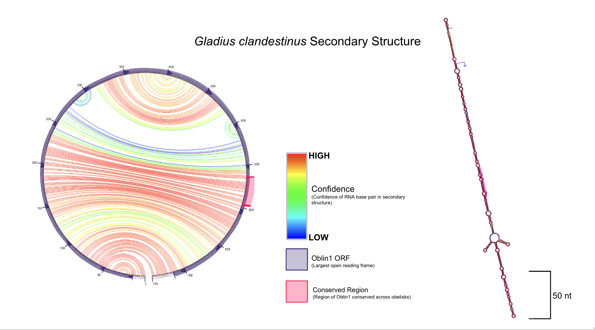
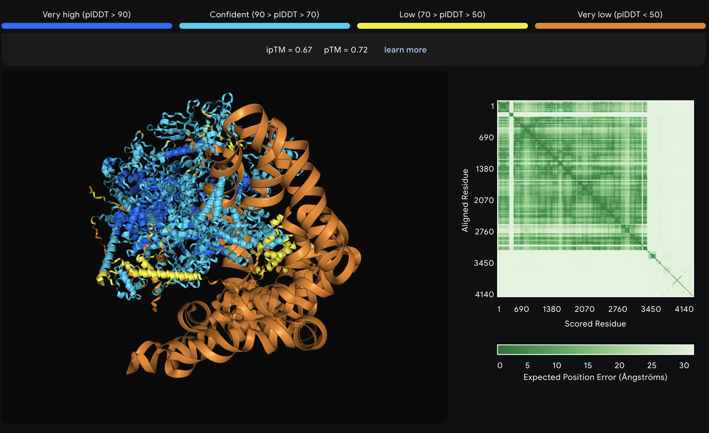
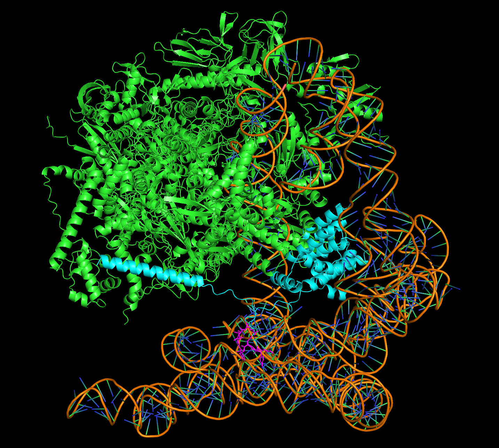
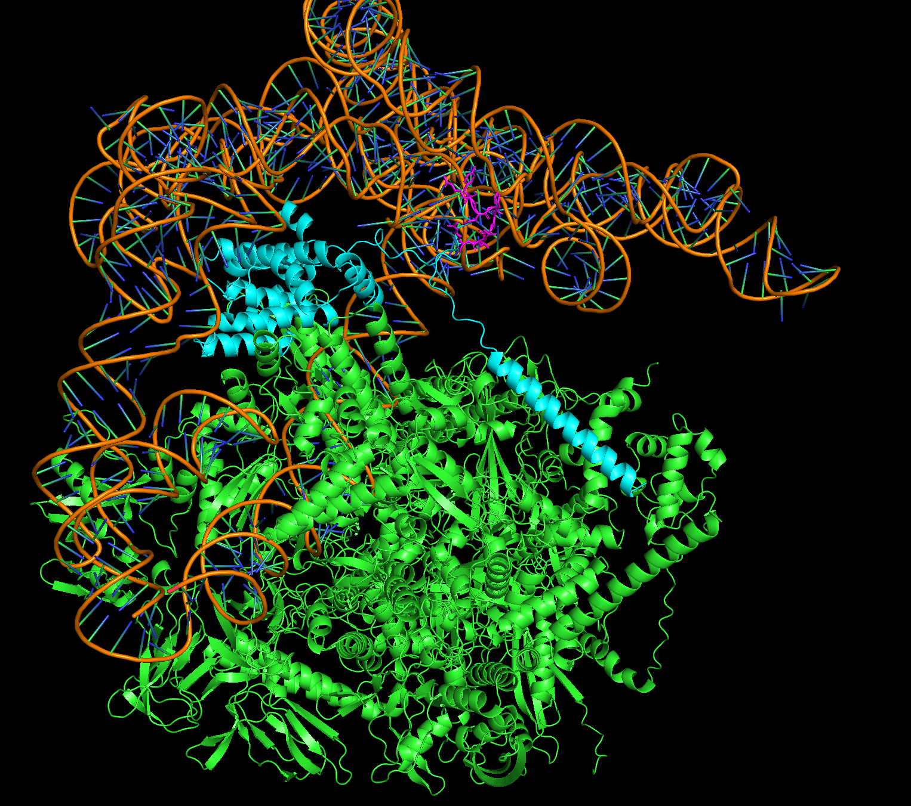
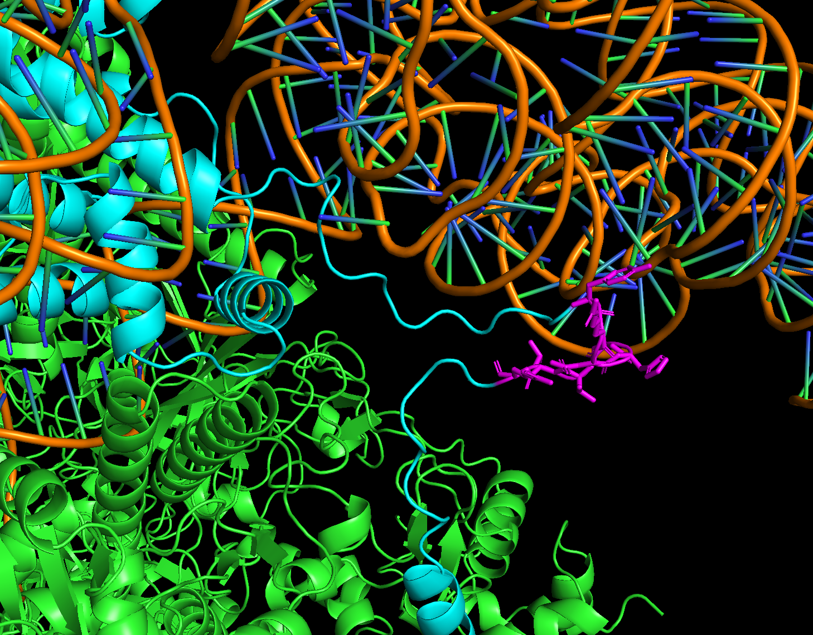
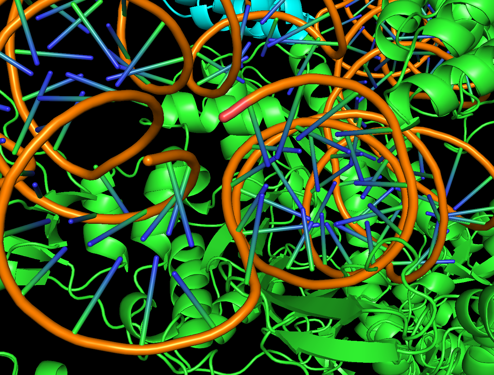
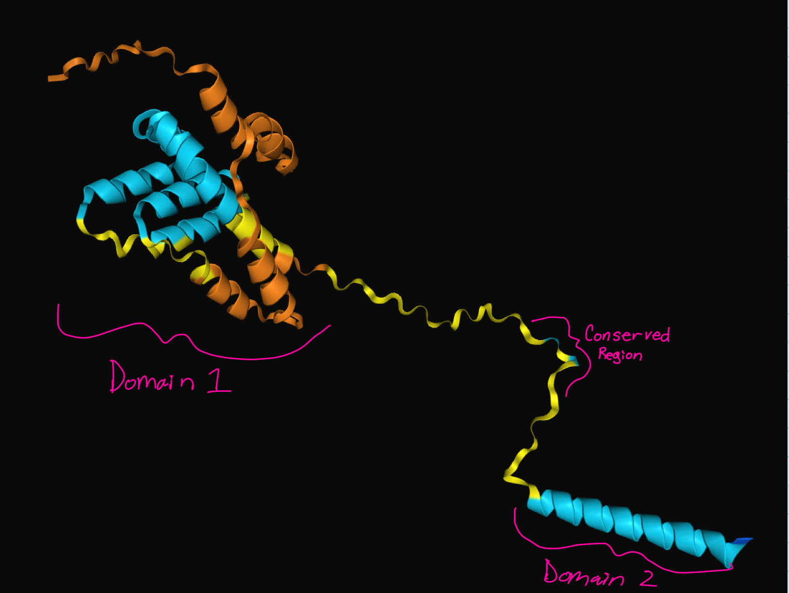

# Hijacking our attention: characterization of a viroid-like agent that may act as a satellite of an E.coli virus
written by: Clare Gillis (https://github.com/claregillis)

### *Gladius clandestinus*

[Optional: Tutorial 2 Generative AI Cover-art](img/<virusname>/cover.png)

## Abstract

Humans host diverse microbiomes composed of bacteria, fungi, archaea, and viruses. Metagenomic analyses provide insights into these communities by characterizing the species composition of genetic material in samples. However, much of the resulting data remains underexplored. Recently, a novel class of viroid-like agents, termed obelisks, was discovered from this data. Here, I investigate and characterize obelisk cluster 1702, designated *Gladius clandestinus*, which is prevalent in the human oral and respiratory microbiomes. *G. clandestinus* is strongly associated with the Escherichia virus phiX174 in a manner that cannot be fully explained by cohabiting a host. Additionally, an initial AlphaFold analysis suggests that it is possible *G. clandestinus* is replicated by E. coli RNA polymerase and encodes a transcriptional initiation factor. Further investigation into its replication mechanism and ecological role is required to confirm its replication mechanism. Given this investigation, I propose that *G. clandestinus* could represent a new class of virophage, broadening our understanding of satellite viruses. I anticipate this work will serve as a foundation for future studies investigating other obelisks as viral satellites.

## Results

### Ecology subsection A...

*G. clandestinus* is found in five distinct SRA datasets, spanning multiple ecosystems and host organisms. These sequences were identified in datasets derived from the lower airways of a long-term smoker (run accession SRR11002570; Sulaiman et al., 2021), an oral sample (run accession SRR16316507), a nasal sample (run accession SRR14354277; Zhang et al., 2023), an esophageal tumor (run accession SRR13521325), and a sample associated with an anemone (run accession SRR1944533). These datasets originate from diverse geographic locations and employ metagenomic sequencing technologies, including Illumina and NextSeq instruments. Human samples dominate the dataset, and the anemone-associated sample appears to contain environmental contamination, including DNA from human, dog, and chicken sources.

## Environmental characterization

The *G. clandestinus* predominantly inhabits the human respiratory and oral microbiomes. I draw this conclusion since four of the five runs in the *G. clandestinus* cluster are assoicated with this environment. Notably, the one outlier sample, SRR1944533 identified as originating from an anemone, contained human genetic sequences and sequences from species commonly associated with human environments, such as dog and chicken. This suggests the anemone sample is contaminated, likely via breathing, sneezing, or coughing during sample collection or processing. This supports the hypothesis that *G. clandestinus* primarily colonizes the human respiratory and oral microbiomes.

## Assosication with immunocompromisation

A notable pattern among the datasets containing *G. clandestinus* is their strong association with immunocompromised environments. Three out of five samples (SRR13521325, SRR16316507, and SRR1944533) explicitly report the presence of HIV, a defining marker of immune suppression. Another sample originates from the lower airway of a long-term smoker, a condition well-documented to impair immune responses, particularly in the lungs (Qiu et al., 2016). While the final sample lacks associated STAT (SRA Taxonomy Analysis Tool; Katz et al., 2021) analyses or published metadata to confirm the immune status of the host, the overall pattern strongly suggests a connection between the *G. clandestinus* and immunocompromised conditions.

Using the estimated prevalence of immunocompromisation in the general adult population—approximately 3% according to a 2013 survey (Harpaz et al., 2016)—as a null model, the probability that all four samples with analyzable metadata are from immunocompromised individuals is `r 0.03^4`.  While this result is strikingly low, it should be interpreted cautiously. The SRA is not a random sampling of the general population; instead, it disproportionately represents samples from clinical or disease-focused studies. These studies are more likely to include immunocompromised individuals, either as a direct target of investigation or due to secondary associations with the diseases being studied.

Despite the potential for sampling bias, the observed correlation between the obelisk cluster and immunocompromised environments remains significant. This connection may arise from direct colonization of immunocompromised hosts or indirect association with microbial taxa that thrive in such conditions.

## Association with Escherichia phage phiX174

Among the four samples containing *G. clandestinus* with associated STAT analyses, all report sequences from Escherichia phage phiX174 (taxonomy ID: 2886930), referred to hereafter as phiX174. This consistent presence of phiX174 in obelisk-associated samples is noteworthy, given its relatively low prevalence in broader datasets. 

Using BigQuery, I calculated the frequency of phiX174 detection in SRA runs from respiratory and oral microbiomes where viral sequences were reported. Of the total SRA runs meeting these criteria, only 6.05% contained phiX174. Using this prevalence as a null model, the probability that all four obelisk-containing samples with analyzable metadata coincidentally report phiX174 is `r 0.0605^4`. This result indicates a highly significant association between obelisk cluster 1702 and phiX174, far exceeding conventional thresholds for statistical significance.

The link between obelisk cluster 1702 and phiX174 cannot be solely attributed to sharing Escherichia coli as a host. While E. coli is present in all samples with phiX174 and obelisk cluster 1702, the prevalence of phiX174 in respiratory and oral microbiomes reporting both E. coli and any virus is only 7.4%. This supports the hypothesis that the association between obelisk cluster 1702 and phiX174 is not merely incidental but due to a specific relationship.

### Virus Genome {Q3}

The jupiter plot on the left represents the base pairing between residues in the secondary structure (generated using MFold; Zuker, 2003). The colour of lines represent the confidence of the predicted base pair. The open reading frame for Oblin1 is highlighted in purple, with arrows denoting the direction of transcription. The conserved region is shown in pink. The sword-like secondary structure is shown on the right with the Oblin1 open reading frame and the conserved region also highlighted in purple and pink respectively.

### Other (bonus) sections

## Hypothesis of function

Based on the collected data, I propose that the relationship between *G. clandestinus* and phiX174 parallels the interaction between Hepatitis Delta and Hepatitis B. Hepatitis Delta, a rod-shaped viroid, does not encode its own envelope proteins but instead utilizes those of Hepatitis B. Additionally, Hepatitis Delta employs RNA Polymerase II for genome replication (Tseng & Lai, 2009). Similarly, *G. clandestinus* is a rod-shaped RNA viroid-like agent that lacks encoded envelope proteins. I suggest that *G. clandestinus* is likely replicated by the RNA polymerase of its host, Escherichia coli. Specifically, I hypothesize that Oblin1, the protein encoded by *G. clandestinus*, interacts with E. coli RNA polymerase, functioning as a transcription initiation factor to facilitate replication of the *G. clandestinus* genome.

To begin testing this, I used AlphaFold (Abramson et al., 2024) to predict the structure of the complex formed by E. coli RNA polymerase (sequence sourced from PDB 4KMU; Molodtsov et al., 2013), my Oblin1 protein, and the RNA genome of *G. clandestinus* from run SRR11002570. Unfortunately, AlphaFold does not support circular RNA, so the obelisk genome was modeled as linear in this initial test.

AlphaFold's predictions for the RNA structure and much of the Oblin1 protein structure show areas of low confidence (Figure 2). However, the proposed model offers intriguing insights. In Figure 3, we observe the overall complex predicted by AlphaFold, with RNA Polymerase shown in green, Oblin1 in cyan, and the conserved region of Oblin1 highlighted in magenta. Notably, the structured regions of Oblin1 appear to interact with RNA Polymerase.

Figure 4 demonstrates the RNA passing through RNA Polymerase, while Figure 5 highlights the interaction between the conserved region of Oblin1 and the RNA. Interestingly, Figure 6 reveals that the linear RNA genome's ends are predicted to lie in close proximity, forming a pseudo-circular structure. This observation aligns with the actual circular nature of the genome, lending some additional confidence to AlphaFold’s prediction.

Overall, the model suggests that Oblin1 may interact with RNA Polymerase and the obelisk genome, potentially playing a role in transcription initiation. This must be interpreted with caution, however, since the predictions, especially regarding the RNA structure, are made with low confidence.

## Oblin1 predicted structure from AlphaFold

## Discussion

I have characterized *G. clandestinus*, a novel viroid-like agent that colonizes the human oral and respiratory microbiomes and is closely associated with immunocompromised environments. Most intriguingly, this agent seems to demonstrate a unique mechanism. Its association with Escherichia phage phiX174 is not solely due to their shared colonization of E. coli. Instead, it may utilize the phiX174 envelope proteins in a manner similar to how Hepatitis Delta Virus utilizes Hepatitis B Virus (Tseng & Lai, 2009).

However, as phiX174 has a single stranded DNA genome while the *G. clandestinus* has a single-stranded RNA genome, *G. clandestinus* can not use the same replication strategy as phiX174. Instead, *G. clandestinus* requires a replication strategy distinct from the phage it associates with. Based on AlphaFold predictions of the E. coli RNAP, Oblin1, and the obelisk genome complex, Oblin1 may act as a transcriptional initiator for the *G. clandestinus* genome. This indicates that *G. clandestinus* may replicate via E. coli RNA polymerase.

To confirm this hypothesis, further investigation is critical. Finding obelisks in environments where phiX174 is absent would help determine whether its association with phiX174 is obligatory. Additionally, experiments to test whether phiX174 is necessary for the obelisk's replication are essential to establish the dependency. Structural studies, such as a cryo-EM analysis of the complex formed by the RNA genome, Oblin1, and E. coli RNAP, would provide concrete evidence of this novel interaction, solidifying the proposed model of replication.

Given these findings, I propose that this agent may represent the first known single-stranded RNA (ssRNA) virophage. To date, virophages have been characterized as double-stranded DNA (dsDNA) entities that act as satellite viruses, typically lacking capsid protein-encoding genes (Tokarz-Deptuła et al., 2023). This agent, which functions as a satellite of phiX174 and similarly lacks a capsid protein, aligns with most aspects of the virophage definition apart from its ssRNA nature. Its unique features suggest a significant expansion of the virophage classification. Furthermore, the prevalence and limited characterization of other obelisk-like agents raise the possibility that they, too, may function as virophages, warranting further investigation.

## References

Abramson, J., Adler, J., Dunger, J., Evans, R., Green, T., Pritzel, A., Ronneberger, O., Willmore, L., Ballard, A. J., Bambrick, J., Bodenstein, S. W., Evans, D. A., Hung, C. C., O’Neill, M., Reiman, D., Tunyasuvunakool, K., Wu, Z., Žemgulytė, A., Arvaniti, E., … Jumper, J. M. (2024). Accurate structure prediction of biomolecular interactions with AlphaFold 3. Nature, 630(8016), 493–500. https://doi.org/10.1038/s41586-024-07487-w

Edgar, R. C. (2004). MUSCLE: Multiple sequence alignment with high accuracy and high throughput. Nucleic Acids Research, 32(5), 1792–1797. https://doi.org/10.1093/nar/gkh340

Harpaz, R., Dahl, R. M., & Dooling, K. L. (2016). Prevalence of immunosuppression among US adults, 2013. JAMA, 316(23), 2547–2548. https://doi.org/10.1001/jama.2016.16477

Hofacker, I. L. (2003). Vienna RNA secondary structure server. Nucleic Acids Research, 31(13), 3429–3431. https://doi.org/10.1093/nar/gkg599

Katz, K. S., Shutov, O., Lapoint, R., Kimelman, M., Brister, J. R., & O’Sullivan, C. (2021). STAT: A fast, scalable, MinHash-based k-mer tool to assess Sequence Read Archive next-generation sequence submissions. Genome Biology, 22(1), 1–15. https://doi.org/10.1186/s13059-021-02490-0

Logel, D. Y., & Jaschke, P. R. (2020). A high-resolution map of bacteriophage ϕX174 transcription. Virology, 547, 47–56. https://doi.org/10.1016/j.virol.2020.05.008

Molodtsov, V., Nawarathne, I. N., Scharf, N. T., Kirchhoff, P. D., Showalter, H. D. H., Garcia, G. A., & Murakami, K. S. (2013). X-ray crystal structures of the Escherichia coli RNA polymerase in complex with benzoxazinorifamycins. Journal of Medicinal Chemistry, 56(11), 4758–4763. https://doi.org/10.1021/jm4004889

Qiu, F., Liang, C. L., Liu, H., Zeng, Y. Q., Hou, S., Huang, S., Lai, X., & Dai, Z. (2016). Impacts of cigarette smoking on immune responsiveness: Up and down or upside down? Oncotarget, 8(1), 268. https://doi.org/10.18632/oncotarget.13613

Rombel, I. T., Sykes, K. F., Rayner, S., & Johnston, S. A. (2002). ORF-FINDER: A vector for high-throughput gene identification. Gene, 282(1–2), 33–41. https://doi.org/10.1016/s0378-1119(01)00819-8

Sulaiman, I., Wu, B. G., Li, Y., Tsay, J. C., Sauthoff, M., Scott, A. S., Ji, K., Koralov, S. B., Weiden, M., Clemente, J. C., Jones, D., Huang, Y. J., Stringer, K. A., Zhang, L., Geber, A., Banakis, S., Tipton, L., Ghedin, E., & Segal, L. N. (2021). Functional lower airways genomic profiling of the microbiome to capture active microbial metabolism. European Respiratory Journal, 58(1), 2003434. https://doi.org/10.1183/13993003.03434-2020

Tokarz-Deptuła, B., Chrzanowska, S., Gurgacz, N., Stosik, M., & Deptuła, W. (2023). Virophages—Known and unknown facts. Viruses, 15(6), 1321. https://doi.org/10.3390/v15061321

Tseng, C. H., & Lai, M. M. C. (2009). Hepatitis delta virus RNA replication. Viruses, 1(3), 818. https://doi.org/10.3390/v1030818

Zhang, L., Rahman, J., Chung, M., Lashua, L., Gordon, A., Balmaseda, A., Kuan, G., Bonneau, R., & Ghedin, E. (2023). CRISPR arrays as high-resolution markers to track microbial transmission during influenza infection. Microbiome, 11(1), 136. https://doi.org/10.1186/s40168-023-01568-0

Zheludev, I. N., Edgar, R. C., Lopez-Galiano, M. J., Peña, M. de la, Babaian, A., Bhatt, A. S., & Fire, A. Z. (2024). Viroid-like colonists of human microbiomes. Cell, 187(23), 6521-6536.e18. https://doi.org/10.1016/j.cell.2024.09.033

Zuker, M. (2003). Mfold web server for nucleic acid folding and hybridization prediction. Nucleic Acids Research, 31(13), 3406–3415. https://doi.org/10.1093/nar/gkg595

# Viral Short Story

*An Obelisk Called Lea*

**A chain of seven hundred thirty nine,**  
**– nucleotides** that is – in not a line.    
It makes a **circular design,**   
**the genome** of the creature(?) I will here outline.  

**54 percent, is he,**  
**not A and T but G and C.**  
**He's shaped like a rod. Well more like a "t".**  
He is an obelisk, named Lea.  

The middle of some **five brothers** –  
not that they came from the same mother.  
Or had one at all we would discover,  
They were the obelisk-cluster of motherless-brothers.  

Our story centers around Lea,   
Who, somehow, would come to be,  
A world away–he unwillingly flee-d–  
from his **home in a man in NYC**  

He starts off deep in the lung  
of **one who puffed his pipe since young**  
To those bronchioles he clung till–  
\*COUGH \*COUGH \*COUGH – up he flung.  

He hit the pharynx and who would show,  
but brother **one way down below,**  
**in the esophagus** he stows,  
Lea tries to chat, but he must go.  

\*COUGH \*COUGH \*COUGH he flies again,  
into the mouth of his host-friend.  
Hoping to stay, he finds a den.  
Under the gums, he meets one he ken.  

**Brother two, here he be**  
**tucked away subgingivally.**  
“My brother! Where are we?”  
exasperatedly asks Lea.  

No time for an answer, Lea takes off,  
ACHOO! this time, without a cough.  
He flies for ages bracing for a BOF!  
But he lands and feels something…soft?  

He peers around an alien domain,  
all wet and jiggly and looks like a brain.  
He sees his fourth brother lain,  
With the look on face, his confusion his plain.  

“Did you just come from that there host?”  
“Yes I was **living up in his nose!**”  
Where the brothers are - who knows,  
At least they’re together, although exposed.  

The final brother rounds the bend,  
“Where’d you come from my good friends?”  
“We’re from that man. Where do we attend?”  
“You’re **on an anemone.**” That’s it. The end.  