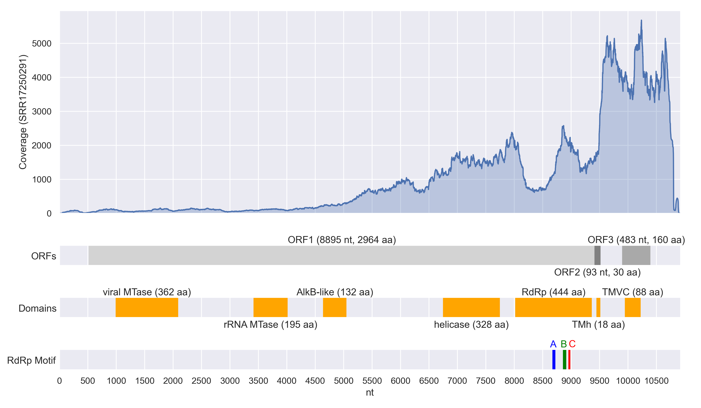

<div align="center">


# Decrypting old transcriptomics data from *Latrodectus hesperus* spyders uncovers a novel Nege-like virus.

Written by: [Alston Lo](https://alstonlo.github.io)

Banner generated by Stable Diffusion

</div>

### Hespivirus rivalense

*Hespivirus* is a combination of **Hesp**erus, **spi**der, and **virus**. It seems common to name Negeviruses after
their respective geographic locations (Negev is a desert in Israel, for example). My index strain came from Riverside,
California, USA. Hence, *rivalense* is a combination of **Riv**erside, C**al**ifornia, and **-ense**, following [1].

---

## Table of Contents

* [Abstract](#abstract)
* [Results](#results)
    + [Viral ecology](#viral-ecology)
    + [Viral genome](#viral-genome)
    + [AlphaFold2: RdRp structure](#alphafold2-rdrp-structure)
    + [Phylogenetic analysis](#phylogenetic-analysis)
* [Discussion](#discussion)
* [References](#references)
* [Viral Short Story](#viral-short-story)

---

## Abstract

Insects are among the most diverse groups of organisms, yet the study of their viromes is considerably biased, such as
towards hematophagous insects for their medical significance. Fortunately, modern bioinformatics tools and databases
have enabled the cheap discovery and analysis of novel viruses. Herein, we mine the SRA database and discover a novel
RNA virus infecting the Western black widow (*Latrodectus hesperus*) spider, which we name *Hespivirus rivalense*. Our
putative virus is distantly related to Nege- and virga-like viruses and has a Negevirus-like genome organization. The
detection of *H. rivalense* in spider egg tissue further suggests that it could be vertically transmitted, something
observed only once so far in spider-infecting viruses. Our computational results serve as a foundation for future
experimental work to validate and refine our model of *H. rivalense*. More broadly, black widows are also urban pests
and
of academic interest for their strong venom and silk. Studying their virome can not only contribute to deeper insights
into their ecology and biology but also shed light on more neglected areas of the insect virome.

## Results

### Viral ecology

*H. rivalense* was detected by the presence of an RNA-dependent RNA polymerases (RdRp) palmprint sequence across eight
SRA runs: SRR1725029(1,2,3,5), SRR5285123 [2], SRR1853323, SRR1539570 [3], and SRR12918481 [4].

**Black widow spiders.** The first seven are of various tissues (e.g., cephalothorax, venom and silk glands, ovaries)
from female *Latrodectus hesperus* (Western black widow spider) or *L. hesperus* eggs. Many of the SRA runs were created
to study the genomics or transcriptomics of *L. hesperus* venom and silk, which are of medical and technological
interest due to their potency and strength. The only geographically annotated samples SRR1725029(1,2,3,5) were collected
in Riverside, California, USA. Indeed, *L. hesperus* can be found throughout western North America and especially thrive
in urban areas [5]. Beyond these seven runs, there are 31 RNA-seq runs in the SRA annotated to *L. hesperus*. These are
further organized into four BioProjects in all of which *H. rivalense* palmprints are detected. Only 1 of 31 *L.
hesperus* samples comes from an adult male spider but is palmprint-negative.

The top hits are primarily Negeviruses [6] or related to Negeviruses, with the first being a putative polyprotein gene
from the Bofa virus [7] with 62% identity (E value 2e-34). The subsequent hits include, in no particular order, the
Beult virus [8], Buckhurst virus [7], Castlerea virus [9], and Mekrijärvi negevirus [10]. Negeviruses are a taxon of
insect-specific viruses that have a broad host and geographic range, but have been primarily reported in hematophagous
insects [6]. They are positive-sense single-stranded RNA viruses with an enveloped, spherical structure resembling a
"hot air balloon" [6], [9]. Considering the moderate similarity of *H. rivalense* to Negeviruses and the presence of *H.
rivalense* across multiple *L. hesperus* tissue samples, we hypothesize that *H. rivalense* is a novel virus infecting
*L. hesperus*, an endogenous viral element (EVE), or an artifact from sample contamination.

To rule out the EVE hypothesis, we map the detected *H. rivalense* palmprint sequence to the assembled contigs from the
highest estimated coverage run SRR17250291. Doing so recovered a single 10924 nt contig `Hriv_contig`. Next, we
performed BLASTN (megablast) [11] searches against the WGS collection, restricting to only *L. hesperus* entries (taxid:
256737), which included a reference genome (JJRX02). This returned no significant hits, while repeating the process ad
hoc for other palmprint-negative contigs recovered multiple hits annotated as genomic *L. hesperus* DNA. This suggests
that *H. rivalense* is not an EVE. In general, while EVEs are common in insects [12], expressed EVEs are rare [7].
Another possibility is that `Hriv_contig` is a contaminant; for example, it could arise from a virus that infects an
organism contaminating the *H. rivalense* palmprint-positive runs. We are unable to find other runs positive for *H.
rivalense* through BLASTN searches in the Nucleotide and TSA collections. Given the above information, a novel virus
seems most likely.

Interestingly, we find the putative virus in *L. hesperus* egg samples, suggesting a possible route of vertical
transmission. To our knowledge, this would make *H. rivalense* the second vertically transmitted virus discovered in
spiders, with the first found in spinybacked orbweaver spiders [13].

**Ants.** The last run SRR12918481 is from a pool of five *Pheidole megacephala* (big-headed ant) collected at Molokai,
Hawaii [4]. However, its palmprint only has 91% identity with the other runs, which otherwise agree perfectly, and an
estimated coverage of 1, which falls short of the coverage quality recommended by [14]. Thus, we discard the SRR12918481
hit for our analyses, both for simplicity and due to its low confidence. It could be worthwhile to revisit SRR12918481
in future work. Brettell et al. [4] found that *P. megacephala* , along with other apiary pests, may act as viral
reservoirs for bee-associated viruses. Given that *P. megacephala* is a highly invasive pest beyond apiaries, a similar
inter-species transmission could be a possibility with *L. hesperus*.

### Viral genome

Our contig `Hriv_contig` is 10924 nt long with a 39.4% GC content. We observe a 42 nt A stretch towards the 3’ end of
the contig, which we hypothesize to be a poly(A) tail. This is due to the recorded presence of poly(A) tails in related
viruses, such as Negeviruses [6], and the use of Oligo-dT selection in SRR17250291. However, the stretch is followed by
a 41 nt suffix of non-repeating bases. To check for potential assembly errors, we realign the reads from SRR17250291 to
our contig using bowtie2 [19], resulting in a mean 1026x coverage. We observe high coverage (~300x) of the bases
following the poly(A) stretch, which decays to 1x over the next 20 bases. However, there is a coverage bias of ends of
contigs due to the assembly process, and a similar decay is observed in the 5’ end. Hence, our analysis remains
inconclusive.

We find 10 ORFs in our viral contig with ORFfinder and restricting to 75 nt non-nested ORFs. InterproScan [20] predicts
domains in 3 of 10 ORFs, ignoring disorder predictions, coils, and SignalP-noTM, which is not annotated further but
seems to indicate a signal peptide. The three ORFs lie on the positive strand, so we will name them in downstream order:
ORF1 (522-9416 nt), ORF2 (9417-9509 nt), and ORF3 (9906-10388 nt). These ORFs are predicted to have the following
domains:

- An *Alphavirus*-like methyltransferase (MTase) domain (IPR002588) in ORF1.
- An rRNA MTase FtsJ domain (IPR002877) in ORF1.
- An alpha-ketoglutarate-dependent dioxygenase AlkB-like domain (IPR027450) in ORF1.
- A RNA virus helicase core domain (IPR027351) in ORF1.
- An RdRp from *Alsuviricetes* (IPR001788) in ORF1.
- A transmembrane helix (TMh) that is part of a membrane-bound protein in ORF2.
- A Tobacco mosaic virus-like coat protein (TMVC) (IPR001337) in ORF3.

We are unable to find any elements encoding for non-coding RNAs in `Hriv_contig`, using Infernal cmscan 1.1.2. The
following figure summarizes the contig-wide coverage, ORFs, predicted domains, and RdRp A, B, C motifs.



**Figure 1.** The genomic contig `Hriv_contig` of *H. rivalense*. The read coverage from realigning the reads from
SRR17250291 to the contig, using bowtie2 [19], is depicted in the topmost graph (blue). The contig ORFs (grey),
predicted domains (orange) from InterproScan [20], and RdRp A, B, C motifs (rgb) are indicated below. Plots were created
in Python using the `matplotlib` and `seaborn` libraries.

### AlphaFold2: RdRp structure

We use the putative RdRp sequence above and ColabFold [21] with its default settings.

<div align="center">

</div>

**Figure 2.** The ColabFold-predicted structure of *H. rivalense*'s RdRp. One seed structure is visualized with
Py3DMol [22].

### Phylogenetic analysis

We use the putative RdRp sequence from above. For BLASTP [23], we search against the nr database restricted to RNA
viruses (taxid:2559587), and we set the maximum number target sequences to 1000. Filtering the candidates with >80%
query coverage and >40% identity leaves 191 sequences (including the *H. rivalense* RdRp). We further remove entries
with duplicate scientific names or named "ssRNA positive-strand virus sp." and "Virgaviridae sp.", tie-breaking by E
score. On the remaining 81 sequences, we perform a multiple sequence alignment (MSA) using MUSCLE [24]:


**Figure 3.** The MSA of *H. rivalense*'s RdRp and its top BLASTP hits visualized using Jalview [25]. For visual
clarity, we have trimmed the MSA to *H. rivalense*'s RdRp palmprint and included only the top 19 BLASTP hits. The A,
B, and C motifs of *H. rivalense*'s palmprint are annotated in the last row, and by inspection, we can see that they
are well-conserved. The [trimmed](img/hespivirus_rivalense/msa_trim.fasta)
and [full](img/hespivirus_rivalense/msa_full.fasta) MSAs are uploaded.

We pass the full MSA into IQTree [26], with the default parameters (i.e., VT+F+I+G4 substitution model via
ModelFinder [27], 1000 ultrafast bootstrap replicates [28]), to construct a maximum-likelihood phylogenetic tree.


**Figure 4.** The maximum-likelihood phylogenetic tree of *H. rivalense*'s RdRp and its top BLASTP hits visualized using
the iTOL webtool [29]. *H. rivalense* is highlighted in green and the smallest clade containing *H. rivalense* and the
top Negevirus or Nege-like virus BLAST hits from above are lightly shaded. The raw
IQTree [output](img/hespivirus_rivalense/iqtree.iqtree) is uploaded.

## Discussion

Our phylogenetic analysis places *H. rivalense* more closely to Negeviruses than the Nege-like Bofa, Buckhurst, and
Beult viruses obtained from BLAST. We also observe similarity to virga-like viruses. Indeed, we observe a Negevirus-like
genome organization in *H. rivalense*. Both ORF1s in *H. rivalense* and Negeviruses contain similar domains of
nonstructural proteins: viral MTase, rRNA MTase, helicase, RdRp in the same order [6]. Similarly, both ORF2s have a
transmembrane domain and both ORF3s encode for a structural membrane protein. Although ORF1&2 are not separated by an
intergenic region in *H. rivalense* as in the prototypical Negevirus, we note that this or an ORF1&2 overlap have been
observed in some species [10], [16]. However, ORF2 in *H. rivalense* appears much smaller than expected; ColabFold
predicts its structure to be a single helix. We attempted to BLAST search the ORF2 protein, the ORF2 genomic interval,
and the ORF2 genomic interval expanded by 50 nt on both ends, but all results were inconclusive.

Interestingly, we found one paper [30] that found a viral-like sequence in *L. hesperus*. Specifically, they obtained a
contig (GBCS01005187) from the TSA dataset, which is in the same bioproject (PRJNA242358) as SRR1539570. GBCS01005187
has a 98% identity (MUSCLE) with `Hriv_contig`, but is shorter (4745 nt) and only captures the helicase, RdRp, and TMVC
domains. In addition, their RdRp domains are split over two ORFs. Inspecting the alignment, we find that this arises due
to an T insertion in GBCS01005187 that causes a frameshift, producing an early stop codon 17 nt downstream. It is
unclear whether this is an assembly error or a defective viral variant. Nonetheless, the genomic sequence analyzed
herein can be considered a refinement and extension upon GBCS01005187.

## References

1. T. S. Postler et al., "Guidance for creating individual and batch latinized binomial virus species names," J. Gen.
   Virol., vol. 103, no. 12, 2022, doi: https://doi.org/10.1099/jgv.0.001800.
2. T. H. Clarke, J. E. Garb, R. A. Haney, R. C. Chaw, C. Y. Hayashi, and N. A. Ayoub, "Evolutionary shifts in gene
   expression decoupled from gene duplication across functionally distinct spider silk glands," Scientific Reports, vol.
   7, no. 1, 2017, doi: https://doi.org/10.1038/s41598-017-07388-1.
3. S. M. Correa-Garhwal, R. C. Chaw, T. H. Clarke, N. A. Ayoub, and C. Y. Hayashi, "Silk gene expression of theridiid
   spiders: Implications for male-specific silk use," Zoology, vol. 122, pp. 107–114, 2017,
   doi: https://doi.org/10.1016/j.zool.2017.04.003.
4. L. E. Brettell, D. C. Schroeder, and S. J. Martin, "RNAseq analysis reveals virus diversity within hawaiian apiary
   insect communities," Viruses, vol. 11, no. 5, p. 397, 2019, doi: https://doi.org/10.3390/v11050397.
5. P. Trubl, T. Gburek, L. Miles, and J. C. Johnson, "Black widow spiders in an urban desert: Population variation in an
   arthropod pest across metropolitan phoenix, AZ," Urban Ecosystems, vol. 15, no. 3, pp. 599–609, 2011,
   doi: https://doi.org/10.1007/s11252-011-0223-2.
6. N. Vasilakis et al., "Negevirus: A proposed new taxon of insect-specific viruses with wide geographic distribution,"
   J. Virol., vol. 87, no. 5, pp. 2475–2488, 2013, doi: https://doi.org/10.1128/jvi.00776-12.
7. C. L. Webster, B. Longdon, S. H. Lewis, and D. J. Obbard, "Twenty-five new viruses associated with the
   Drosophilidae (Diptera)," Evol. Bioinform. Online, vol. 12s2, pp. 13–25, 2016,
   doi: https://doi.org/10.4137/EBO.S39454.
8. N. C. Medd et al., "The virome of Drosophila suzukii, an invasive pest of soft fruit," Virus Evol., vol. 4, no. 1,
   2018, doi: https://doi.org/10.1093/ve/vey009.
9. C. A. O’Brien et al., "Discovery and characterisation of castlerea virus, a new species of negevirus isolated in
   australia," Evolutionary Bioinformatics, vol. 13, p. 1176934317691269, 2017,
   doi: https://doi.org/10.1177/1176934317691269.
10. M. T. Suvanto et al., "A novel negevirus isolated from Aedes vexans mosquitoes in Finland," Arch. Virol., vol. 165,
    no. 12, pp. 2989–2992, 2020, doi: https://doi.org/10.1007/s00705-020-04810-4.
11. Z. Zhang, S. Schwartz, L. Wagner, and W. Miller, "A greedy algorithm for aligning DNA sequences," J. Comput. Biol.,
    vol. 7, no. 1–2, pp. 203–214, 2000, doi: https://doi.org/10.1089/10665270050081478.
12. E. C. Holmes, "The evolution of endogenous viral elements," Cell Host & Microbe, vol. 10, no. 4, pp. 368–377, 2011,
    doi: 10.1016/j.chom.2011.09.002.
13. K. Rosario, K. A. Mettel, A. M. Greco, and M. Breitbart, "Prevalence of a vertically transmitted single-stranded DNA
    virus in spinybacked orbweavers (gasteracantha cancriformis) from florida, USA," Journal of General Virology, vol.
    100, no. 8, pp. 1253–1265, 2019, doi: https://doi.org/10.1099/jgv.0.001293.
14. J. T. Ladner et al., "Standards for sequencing viral genomes in the era of high-throughput sequencing," mBio, vol.
    5, no. 3, 2014, doi: https://doi.org/10.1128/mbio.01360-14.
15. G. Lu et al., "Discovery of two novel negeviruses in a dungfly collected from the arctic," Viruses, vol. 12, no. 7,
    p. 692, 2020, doi: https://doi.org/10.3390/v12070692.
16. M. R. T. Nunes et al., "Genetic characterization, molecular epidemiology, and phylogenetic relationships of
    insect-specific viruses in the taxon negevirus," Virology, vol. 504, pp. 152–167, 2017,
    doi: https://doi.org/10.1016/j.virol.2017.01.022.
17. R. Kallies et al., "Genetic characterization of goutanap virus, a novel virus related to negeviruses, cileviruses
    and higreviruses," Viruses, vol. 6, no. 11, pp. 4346–4357, 2014, doi: https://doi.org/10.3390/v6114346.
18. M. J. Adams et al., "ICTV virus taxonomy profile: virgaviridae," J. Gen. Virol., vol. 98, no. 8, pp. 1999–2000,
    2017, doi: https://doi.org/10.1099/jgv.0.000884.
19. B. Langmead and S. L. Salzberg, "Fast gapped-read alignment with bowtie 2," Nature Methods, vol. 9, no. 4, pp.
    357–359, 2012, doi: https://doi.org/10.1038/nmeth.1923.
20. T. Paysan-Lafosse et al., "InterPro in 2022," Nucleic Acids Research, vol. 51, no. D1, pp. D418–D427, 2022,
    doi: https://doi.org/10.1093/nar/gkac993.
21. M. Mirdita, K. Schütze, Y. Moriwaki, L. Heo, S. Ovchinnikov, and M. Steinegger, "ColabFold: Making protein folding
    accessible to all," Nature Methods, vol. 19, no. 6, pp. 679–682, 2022, doi: 10.1038/s41592-022-01488-1.
22. N. Rego and D. Koes, "3Dmol.js: molecular visualization with WebGL," Bioinformatics, vol. 31, no. 8, pp. 1322–1324,
    2014, doi: https://doi.org/10.1093/bioinformatics/btu829.
23. S. F. Altschul et al., "Gapped BLAST and PSI-BLAST: A new generation of protein database search programs," Nucleic
    Acids Res., vol. 25, no. 17, pp. 3389–3402, 1997, doi: https://doi.org/10.1093/nar/25.17.3389.
24. R. C. Edgar, "MUSCLE: multiple sequence alignment with high accuracy and high throughput," Nucleic Acids Research,
    vol. 32, no. 5, pp. 1792–1797, 2004, doi: https://doi.org/10.1093/nar/gkh340.
25. A. M. Waterhouse, J. B. Procter, D. M. A. Martin, M. Clamp, and G. J. Barton, "Jalview Version 2—a multiple sequence
    alignment editor and analysis workbench," Bioinformatics, vol. 25, no. 9, pp. 1189–1191, 2009,
    doi: https://doi.org/10.1093/bioinformatics/btp033.
26. L.-T. Nguyen, H. A. Schmidt, A. von Haeseler, and B. Q. Minh, "IQ-TREE: A fast and effective stochastic algorithm
    for estimating maximum-likelihood phylogenies," Mol. Biol. Evol., vol. 32, no. 1, pp. 268–274, 2015,
    doi: https://doi.org/10.1093/molbev/msu300.
27. S. Kalyaanamoorthy, B. Q. Minh, T. K. F. Wong, A. von Haeseler, and L. S. Jermiin, "ModelFinder: Fast model
    selection for accurate phylogenetic estimates," Nature Methods, vol. 14, no. 6, pp. 587–589, 2017,
    doi: https://doi.org/10.1038/nmeth.4285.
28. D. T. Hoang, O. Chernomor, A. von Haeseler, B. Q. Minh, and L. S. Vinh, "UFBoot2: Improving the ultrafast bootstrap
    approximation," Molecular Biology and Evolution, vol. 35, no. 2, pp. 518–522, 2017,
    doi: https://doi.org/10.1093/molbev/msx281.
29. I. Letunic and P. Bork, "Interactive Tree Of Life (iTOL) v5: an online tool for phylogenetic tree display and
    annotation," Nucleic Acids Research, vol. 49, no. W1, pp. W293–W296, 2021, doi: https://doi.org/10.1093/nar/gkab301.
30. D. Bigot, C. M. Atyame, M. Weill, F. Justy, E. A. Herniou, and P. Gayral, "Discovery of culex pipiens associated
    tunisia virus: A new ssRNA(+) virus representing a new insect associated virus family," Virus Evolution, vol. 4, no.
    1, 2018, doi: https://doi.org/10.1093/ve/vex040.

## Viral Short Story

Written in the style of Lovecraftian horror:

```
The spiders were acting weirdly. Now and then, people would see the odd one
scurry out of a dark crevice, but always too fast for a spider, as if it were
searching for something. Dr. Parker, a geneticist at UC Riverside, was among
the first to notice something wrong. A black widow spider had made its way
into a hamster cage, which would not have been a strange occurrence if not for
the spider being the size of the rodent that it devoured. After making it to
Parker’s lab, it was clear that this was some kind of RNA viral affliction.
The virus permeated the glands, eggs, and other spider tissues, making them
grow and mutate uncontrollably. Soon, the spider grew into a monstrous
creature. Perhaps it became much stronger and smarter than Parker could
recognize because it escaped one day. It wasn’t soon after that eggs started
showing up, from which baseball-sized hatchlings sprung. The virus could be
inherited. Worse yet, massive bugs began to appear in neighbouring states. A
giant ant was found in Hawaii. Did the moderate proximity of the virus to
other insect viruses allow it to hop between hosts? Nonetheless, while the
world began to celebrate the appearance of these strange creatures, Parker
could only watch on with dread at what he released into the world. He could
only hope that they never got a taste for humans...
```