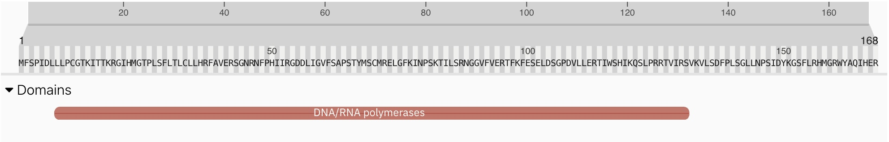
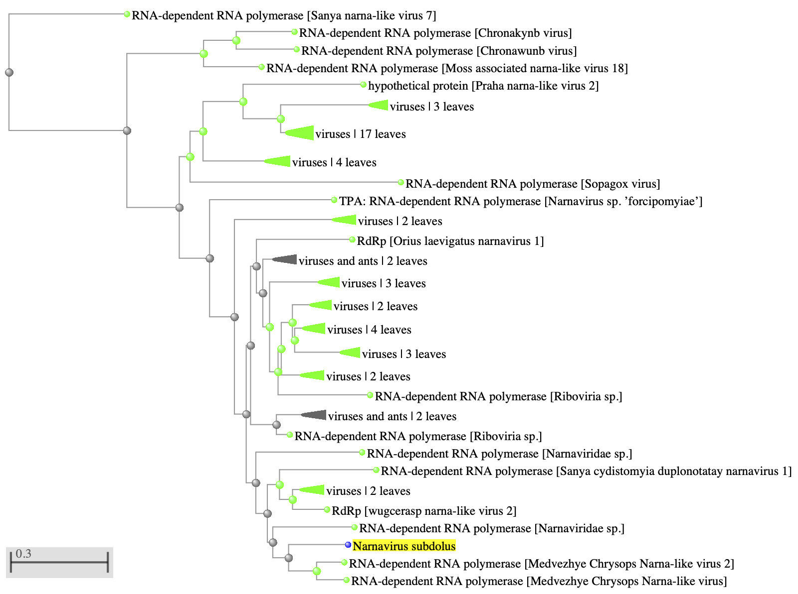

# Narnavirus subdolus: A Novel Narnavirus Hidden in the Tsetse Fly-Trypanosoma System

written by: [Clara Wang](https://github.com/Wang-Clara)

------------------------------------------------------------------------

### Narnavirus subdolus

**Narnavirus** represents the genus of viruses that it belongs to, and **subdolus** is Latin for "deceit", which refers to the virus appearing to be hidden within a parasite host.

------------------------------------------------------------------------

## Abstract

The tsetse fly–trypanosoma system is responsible for the transmission of African trypanosomiasis, but there is limited research about RNA viruses associated with it. This study computationally characterizes a previously unknown narnavirus that was detected in transcriptomic datasets from both tsetse flies and trypanosomes, consistent with a viral presence within this vector–parasite system. A partial viral genome recovered from one of the datasets revealed narnavirus-like features, including a single open reading frame encoding an RNA-dependent RNA polymerase. Although phylogenetic analysis suggests the virus is insect-associated, sequencing coverage was substantially higher in *Trypanosoma brucei brucei*, indicating that the parasite is the more likely host. These findings highlight the challenges of assigning viral hosts in tightly linked biological systems and demonstrate the need for experimental validation.

------------------------------------------------------------------------

## Results

### Viral Ecology

Tsetse flies are blood-feeding insects of the genus *Glossina*, and the vector for African trypanosomiasis, also known as “sleeping sickness” in humans and “nagana” in livestock [International Glossina Genome Initiative et al., 2014]. Trypanosomiasis is a potentially fatal neglected tropical disease that is endemic in Sub-Saharan Africa, as well as a major limiting factor for agriculture production [International Glossina Genome Initiative et al., 2014]. It is spread through the bite of a tsetse fly that is infected with a parasite of the genus *Trypanosoma*. Nagana is caused by species of *Trypanosoma* such as *Trypanosoma brucei* *brucei*, *Trypanosoma congolense*, and *Trypanosoma vivax*, whereas sleeping sickness results from infection with *Trypanosoma brucei gambiense* or *Trypanosoma brucei rhodesiense* [Saarman et al., 2018].

In addition to these parasite-vector interactions, viruses have been discovered independently in both tsetse flies and trypanosomes, indicating that each host may be a reservoir for currently unknown RNA viruses [Manni and Zdovnov, 2021; Fernández-Presas et al., 2017]. It is important to investigate these possible viruses, as the fly–trypanosome system efficiently transmits disease.

### Virus Detection

Viral sequences were searched for within NCBI Sequence Read Archive (SRA) datasets, where the palmprint sequence of an RNA-dependent RNA polymerase (RdRp) was detected in 53 sequence read runs (SRRs) from the tissues of *Glossina morsitans morsitans*, 18 SRRs of *Trypanosoma brucei brucei*, 2 SRRs of *Trypanosoma congolense*, and 1 SRR of *Glossina palpalis gambiensis*. These originated from 12 different BioProjects associated with transcriptomic studies that used Illumina sequencing at Yale University, the Institute of Tropical Medicine, the Institute of Infection and Global Health, the University of Bern, and the Research Institute for Development.

BLASTp analysis [Altschul, 1997] of the palmprint sequence showed homology to RdRps of narna-like viruses. Thus, the sequence is hypothesized to represent a novel narnavirus-like virus that primarily infects either tsetse flies or their associated trypanosome parasites. This study characterizes the virus through computational analyses evaluating this hypothesis.

### Virus Genome

The palmprint sequence was detected in multiple short contigs across several SRR datasets. To extend these contigs, the three datasets with the highest coverage were subsampled to adjust for memory limitations and assembled using MEGAHIT [Li et al., 2015]. Using this approach, a 772-nt contig was recovered from SRR039378 with MEGAHIT.

Given that the 772 nt long contig was substantially shorter than an expected full-length narnavirus genome, which are typically 3000 nucleotides long [DeRisi, 2019], this sequence represents a partial fragment of the viral genome and was used in further analyses as a representative viral sequence.

An ORF finder by Sequence Manipulation Site [Stothard, 2000] was used to search for ORFs greater than 100 nt beginning with ATG, along with the remaining standard parameters. The contig was found to encode a single uninterrupted open reading frame at positions 268-771 on the direct strand.

Within the ORF, an InterPro [Paysan-Lafosse et al., 2023] scan found one RdRp domain. This is consistent with typical narnaviruses, which have only one open reading frame that encodes an RdRp [DeRisi, 2019].



**Figure 1.** Representation of the RdRp domain within the ORF of *Narnavirus subdolus*, generated using InterPro [Paysan-Lafosse et al., 2023].


**Figure 2.** The partial genome of *Narnavirus subdolus*, generated using SnapGene [SnapGene® software].

### Viral Phylogeny

A BLASTp [Altschul, 1997] search of the translated ORF revealed strong homology to RdRps of narnaviruses and narna-like viruses, with the top hit showing 70.8% amino acid identity to the RdRp of *Medvezhye Chrysops narnavirus-like virus 2*. This virus was identified in an insect virome study published in 2023 and was characterized as narna-like based on its 51% identity to the RdRp of *Sanya cydistomyia duplonotatay narnavirus 1* [Litov et al., 2023]. Notably, *Sanya cydistomyia duplonotatay narnavirus 1* was the third-highest BLASTp hit to the ORF of *Narnavirus subdolus*, with 57.1% amino acid identity.

These relationships support the classification of the virus as a narnavirus. Its phylogenetic relationships also suggest that the virus is primarily insect-associated.



**Figure 3.** Phylogeny of *Narnavirus subdolus*, obtained from NCBI BLASTp [Altschul, 1997].

### Host Association

To further evaluate the likely host of the virus, sequencing coverage was compared across datasets derived from tsetse flies and trypanosomes. Although phylogenetic clustering places the virus among insect-associated narnaviruses, coverage patterns of the SRR datasets suggest a different host. The palmprint sequence of the virus is found at a substantially lower coverage in *Glossina morsitans morsitans* (mean = 12.5) than in *Trypanosoma brucei brucei* (mean = 263.1). Because detections in *Trypanosoma congolense* and *Glossina palpalis gambiensis* were rare and low-coverage, they were excluded from further analysis.

Coverage depth is informative for viruses, which replicate intracellularly and typically reach high abundance within their true host [Fukuda et al., 2023]. The consistently higher viral coverage in *Trypanosoma brucei brucei* matches this expectation, while the weaker detections in *Glossina morsitans morsitans* are more consistent with possible contamination from parasite RNA or residual trypanosome material in fly tissues. This favours *Trypanosoma brucei brucei* as the more likely host, despite the virus’s relationship to insect-associated viruses.

------------------------------------------------------------------------

## Discussion

Computational characterization of this virus illustrates the genomic simplicity of narnaviruses, which are composed primarily of a single open reading frame encoding an RNA-dependent RNA polymerase, yet are capable of persistent intracellular replication. Although phylogenetic analysis suggests an insect-associated lineage, comparative sequencing coverage more strongly supports *Trypanosoma brucei brucei* as the likely host, demonstrating that host association cannot always be inferred from evolutionary relatedness alone. A similar pattern has been observed for a narna-like virus detected in *Plasmodium vivax* and its mosquito vector, where experimental validation confirmed the parasite as the true host [Charon et al., 2019], underscoring the complexity of viral ecology within vector–parasite systems.

------------------------------------------------------------------------

## References

Altschul, S. Gapped BLAST and PSI-BLAST: a new generation of protein database search programs. Nucleic Acids Research 25, 3389–3402 (1997).

Charon, J. et al. Novel RNA viruses associated with Plasmodium vivax in human malaria and Leucocytozoon parasites in avian disease. PLoS Pathog 15, e1008216 (2019).

DeRisi, J. L. et al. An exploration of ambigrammatic sequences in narnaviruses. Sci Rep 9, 17982 (2019).

Fernández-Presas, A. M. et al. Enveloped and non-enveloped viral-like particles in Trypanosoma cruzi epimastigotes. Rev. Inst. Med. trop. S. Paulo 59, (2017).

Fukuda, M., Cai, J., Bader, J. S. & Boeke, J. D. Pervasive RNA folding is crucial for narnavirus genome maintenance. Proc. Natl. Acad. Sci. U.S.A. 120, e2304082120 (2023).

International Glossina Genome Initiative et al. Genome Sequence of the Tsetse Fly (Glossina morsitans): Vector of African Trypanosomiasis. Science 344, 380–386 (2014).

Li, D., Liu, C.-M., Luo, R., Sadakane, K. & Lam, T.-W. MEGAHIT: an ultra-fast single-node solution for large and complex metagenomics assembly via succinct de Bruijn graph. Bioinformatics 31, 1674–1676 (2015).

Litov, A. G. et al. Viromes of Tabanids from Russia. Viruses 15, 2368 (2023).

Manni, M. & Zdobnov, E. Tsetse RNA Virome: Novel Iflavirus Genomes in Glossina morsitans and Other Tsetse Species. Preprint at <https://doi.org/10.1101/2021.10.23.465572> (2021).

Paysan-Lafosse, T. et al. InterPro in 2022. Nucleic Acids Research 51, D418–D427 (2023).

Saarman, N. et al. A spatial genetics approach to inform vector control of tsetse flies (Glossina fuscipes fuscipes) in Northern Uganda. Ecology and Evolution 8, 5336–5354 (2018).

SnapGene® software (from Dotmatics; available at snapgene.com).

Stothard, P. The Sequence Manipulation Suite: JavaScript programs for analyzing and formatting protein and DNA sequences. Biotechniques 28, 1102-1104 (2000).

This article was copy-edited with the use of a generative large language model (ChatGPT 5.1 Auto, 2025-12-11).

------------------------------------------------------------------------

# Viral Short Story

```         
“Seven Hundred Seventy-Two” 

I begin late,
two hundred sixty-seven bases into the thought,
as if the virus cleared its throat
and decided the important part
could wait.

I speak in one long sentence
no commas, no hesitation—
a blue arrow of intent
aimed stubbornly toward an ending
I know by heart.

Inside me lives a craft older than hosts,
a green machine that copies whispers
into echoes,
echoes into lineage.
I am not whole,
but I remember how wholeness feels.

My beginning is missing.
Not erased,
just somewhere upstream,
still drifting in the dark library of the cell,
waiting to be assembled correctly.

But my ending is perfect.
I stop exactly where I should.
One base later and silence falls.
That precision is not an accident;
it is how survival learns to write.

Call me partial if you want.
I still know how to replicate an idea.
I still carry the syntax of persistence.
Give me a polymerase and time,
and I will finish the sentence myself.

This poem was generated with the use of a generative large language model (ChatGPT 5.1 Auto, 2025-12-11).
```
