# Unveiling the Obelisk Virus and Its Host-Hijacking Secrets (Despite Limited CPU Cycles)

written by: [Enea Provenzano](https://github.com/prvnzn)

### Obeliscus Replicandii

Obeliscus: Derived from the term “obelisk”

Replicandii: Stemming from the Latin “replicare”, meaning “to replicate”

This species name highlights the novel replication mechanism
hypothesised for the virus, particularly its interaction with the
Streptococcus sanguinis RNA polymerase.

[Cover Image](img/obeliscus_replicandii/cover_image.jpg)

## Abstract

Viruses play a critical role in shaping microbial ecosystems, yet many
remain underexplored, particularly those integrated into host
microbiomes. RNA viruses, in particular, exhibit diverse mechanisms for
persistence and replication, often requiring host machinery to
propagate.

The Obelisk virus *Obeliscus Replicandii*, identified within the rumen
microbiome of Hu sheep, represents a novel single-stranded RNA virus
with a unique genomic structure and ecological context. Associated with
temperate biomes across China, New Zealand, and Canada, the Obelisk
demonstrates an unexpected reliance on microbial ecosystems rather than
a single host or environmental reservoir. Phylogenetic and microbiome
analyses reveal surprising overlaps between geographically distant
regions, highlighting ecological pressures shaping viral distribution.
Its genome includes four open reading frames (ORFs), including a novel
antisense ORF encoding a replication protein, hypothesised to hijack
host RNA polymerase.

Here we show that the Obelisk replication protein likely interacts with
specific subunits of Streptococcus sanguinis RNA polymerase, with the
beta subunit displaying the strongest binding characteristics. This
interaction suggests a novel mechanism by which the replication protein
redirects host transcription machinery to support viral replication.
While incomplete assembly of the Streptococcus RNA polymerase complex
limits current models, these findings emphasise the virus’s capacity to
manipulate bacterial hosts through innovative strategies.

The discovery of this interaction challenges traditional paradigms of
RNA virus replication, offering insights into host-virus dynamics within
microbial ecosystems. By elucidating the molecular, ecological, and
evolutionary characteristics of the Obelisk, we provide a foundation for
understanding underexplored viral strategies and their broader
implications for microbial ecology and virology. These findings
highlight the intricate interplay between viruses, their microbial
hosts, and their ecological environments.

## Results

------------------------------------------------------------------------

**BioProject Analysis and associated Publications:**

I used the NCBI database for all of the following steps.

I can now further analyse the BioProject identifier to determine if and
in which publications my index case (only the centroid!) was involved
in. The BioProject’s name was “Multi-omics profiling of rumen microbiome
reveals the degradation of plant fiber in Hu sheep”. My Centroid was not
published within a study but only identified within the said BioProject.
Only the previously mentioned BioProject (“PRJNA642030”) is associated
with my centroid. This BioProject contains multispecies raw sequencing
reads data, providing 12 different BioSamples. Each BioSample
corresponds to an RNA-seq read from the rumen of adult male Hu sheep,
providing a total of 12 RNA-seq reads which were obtained using ILLUMINA
(HiSeq X Ten) sequencing.

------------------------------------------------------------------------

**Expanding the Datasets that are associated with my Obelisk**

For now, I restricted myself only to analyse the centroid obelisk. I can
now further broaden the presence of our obelisk by identifying more
datasets. I analyse if and in which other BioProjects our clustered
obelisks were involved in. Hereby we access more data which is
associated with our assigned Obelisk. Thus, we isolate all the SRA-run
codes of the related obelisks and further analyse the metadata of these
datasets. By doing so I can put my Obelisk into a broader perspective as
I am now able to further investigate the biological, geographical and
ecological properties of these additional datasets.

The new DataFrame, ‘meta\_clustered’, contains metadata on the related
obelisks, which was further analysed using the “OR” operator in the NCBI
search bar. This approach allowed me to uncover additional insights into
the clustered obelisks and their broader ecological context.

From the SRA accession codes of the clustered obelisks, I identified 14
distinct datasets across various libraries within the NCBI databank.
These datasets, along with the metadata in ‘meta\_clustered’, enabled a
detailed characterisation of the ecological properties associated with
the clustered obelisks.

The analysis revealed that the clustered obelisks were predominantly
found in the gut microbiomes of farm animals, particularly ruminants
such as cattle (Bos taurus) and sheep. These samples originated from
multiple countries, specifically China, Canada, and New Zealand, and
were sequenced in studies involving metatranscriptomic, metagenomic, or
transcriptomic analyses of the rumen microbiome. The clustered obelisks
are associated with seven distinct BioProjects, which are catalogued in
the ‘BioProject\_clustered’ variable, while the variable
‘related\_SRA\_codes’ provides the corresponding SRA run identifiers for
additional datasets where these obelisks were detected.

Three published studies have utilised sequencing data involving the
clustered obelisks, including:

-   “Temporal changes in total and metabolically active ruminal
    methanogens in dairy cows supplemented with 3-nitrooxypropanol.”

-   “Biological Network Approach for the Identification of Regulatory
    Long Non-Coding RNAs Associated With Metabolic Efficiency in
    Cattle.”

-   “Methane yield phenotypes linked to differential gene expression in
    the sheep rumen microbiome”

The observed ecological and geographical distribution of the clustered
obelisks suggests a potential link to the diet and microbiome
composition of ruminants in temperate biomes located around the Pacific
Ocean.

------------------------------------------------------------------------

**Detecting Overlaps in the Metadata**

With a clearer understanding of the geographic and ecological context, I
aimed to identify a common factor linking the presence of the virus to
specific parameters. To achieve this, I analysed the conditions under
which the clustered obelisks were detected. Examining the
‘meta\_clustered’ DataFrame, I observed that all clustered obelisks with
available data were associated with the same biome classification:
WWF\_TEW\_BIOME\_04.

To gain more insight, I consulted the WWF’s “Terrestrial Ecoregions of
the World”
[database](https://www.worldwildlife.org/publications/terrestrial-ecoregions-of-the-world).
After downloading and analysing the metadata from the TEW file, I
confirmed that Biome 4 corresponds to the “Temperate Broadleaf & Mixed
Forests” biome. This biome is characterised by consistent environmental
conditions, including temperate climates and diverse but relatively
stable microbial communities.

The association of the clustered obelisks with this biome raises the
possibility that the temperate forest biome could play a role in
maintaining or facilitating the virus’s presence. Its environmental
consistency and shared microbial communities across geographically
distinct regions may support the persistence or transmission of the
obelisk virus. This observation warrants further investigation to
determine whether specific ecological factors within this biome serve as
critical reservoirs or intermediaries for the virus’s lifecycle.

------------------------------------------------------------------------

**Determining the true Origin of the Virus**

In the lecture on 18th November, Artem Babaian provided valuable insight
into interpreting microbiome data. He highlighted that just because a
sequencing read is found within a microbiome, it does not necessarily
mean it originated there. The read could be a result of contamination or
could have been introduced through other means. Keeping this in mind I
tried to put my ecological findings into a broader perspective and
critically evaluate the results.

I started to orientate myself using this map which showed the presence
of the mentioned ‘Temperate Broadleaf & Mixed Forests’ biome across the
[globe](https://www.researchgate.net/figure/Temperate-Forests-of-the-World_fig2_278967988).
The countries in which my centroid was found lay all within the
temperate climate zone. The Obelisk was observed in both either the
northern or southern hemisphere. The affected countries (Canada, China
and New Zealand) are all located at the edges of these temperate climate
zones, adjacent to the pacific ocean. They are all separated by water
but still exhibit the presence of this Obelisk. This suggests that the
Obelisk spread across the Bering Sea in the Northern Hemisphere and
somehow reached New Zealand in the southern Hemisphere. We can therefore
reduce the detection location of the Virus to this cluster of regions
around the Pacific Ocean.

I now focused on identifying a unique feature of the temperate zones in
East Asia, Eastern Oceania, and Western North America that could be
linked to the Obelisk. The provided data showed no hits in European
temperate zones, therefore it needs to differ from the european zone. To
identify what the true common factor is that combines these different
locations, I read some literature on these temperate forests \[Guo.
1999, Yih. 2012\].

------------------------------------------------------------------------

**Flora and Fauna in the affected regions**

East Asia and Western North America share numerous plant genera, a
similarity that can be traced back to the Bering land bridge. This land
bridge connected Western North America and Asia during the Tertiary
period, allowing for the exchange of flora and fauna.

In contrast, Eastern Oceania (New Zealand) differs greatly from these
northern regions. Isolated from other landmasses and located in the
Southern Hemisphere, New Zealand harbours a high proportion of endemic
flora and fauna. These unique species developed within this ecosystem
after the landmass diverged from the Gondwana supercontinent
approximately 85 million years ago. Its animal life is dominated by
birds, lizards, and frogs, with native mammals arriving only relatively
recently through the British colonisation. Interestingly, New Zealand
has almost no native mammals, raising significant questions about how
the virus emerged in this location \[McGlone, 2007\].

I hypothesise that the obelisk virus originated in temperate East
Asia/Western North America, where its presence was maintained by
ruminant hosts or their microbiomes, and spread to other regions through
the migration of host species or anthropogenic activities, such as
agricultural trade or livestock transport.

This hypothesis raises several key questions:

1.  Could ancient environmental reservoirs (e.g. grass) in New Zealand,
    Eastern Asia, and Western North America have acted as a temporary
    host or vector for the virus before the arrival of its primary host
    animals?

2.  Is there a common plant or grass type that all affected animals
    consume, which could serve as the true host of the virus?

3.  What is the host cell that facilitates the replication of the
    obelisk virus, and how does it relate to the microbiome composition
    in these regions?

Addressing these questions will provide insights into the virus’s
ecological niche, its mechanisms of transmission, and the role of
environmental and host factors in shaping its distribution.

------------------------------------------------------------------------

**Ancient Environmental reservoirs that stored the Virus**

To address the previously raised questions about potential environmental
reservoirs, I explored whether grass, as the primary food source for
cattle and sheep, could have preserved the obelisk virus’s genome or
acted as a transmission vector. Given that the virus is likely older
than the host organisms it infects \[Durzyńska et al., 2015\], I
hypothesised that grass might serve either as:

-   A persistent environmental reservoir, maintaining the virus’s genome
    until a suitable host became available

-   A contamination vector, facilitating the virus’s introduction to
    ruminant microbiomes through grazing

To test the first hypothesis, I conducted a literature review to
identify the most common native grass species in the temperate forest
biomes of Western North America, Eastern Asia, and New Zealand. Using
ChatGPT, I compiled a region-specific list of grass species
\[Britannica, Internet\]:

Western North America: Festuca rubra (Red Fescue), Elymus glaucus (Blue
Wildrye), Danthonia californica (California Oatgrass), Bromus carinatus
(California Brome)

Eastern Asia: Miscanthus sinensis (Chinese Silvergrass), Arundinella
hirta (Hairy Arundinella), Oplismenus undulatifolius (Wavyleaf
Basketgrass), Brachypodium sylvaticum (False Brome)

New Zealand: Chionochloa conspicua (Snowgrass/Tussock Grass), Poa cita
(Silver Tussock), Microlaena stipoides (Meadow Grass), Austrofestuca
littoralis (Coastal Fescue)

This diversity in grass species refuted the assumption of a common grass
type across all regions, suggesting that grass as a shared environmental
reservoir is less likely. To further evaluate the first question from
the section before, I created a FASTA file of the obelisk genome
sequence and performed a BLAST alignment against available reference
genomes of these grass species using the NCBI databank. The results
yielded no matches, indicating that the virus is not embedded within the
reference genomes of these grass species.

These findings led me to reconsider grass as a potential environmental
reservoir. Instead, I propose two refined hypotheses:

1.  Grass acts as a contamination vector, carrying the virus externally
    through exposure to infected materials (e.g. soil microbes, faecal
    matter) and transmitting it to ruminant microbiomes during grazing

2.  The virus relies on bacterial or microbial hosts in the soil or
    within the gut microbiome rather than on grass itself

To evaluate the role of grass as a contamination vector, future
experiments should include testing for viral RNA in physical grass
samples from the affected regions. Analysing microbial communities on
the grass surface or in associated soil samples could also help identify
alternative hosts or carriers.

Given these findings, I infer that grass is unlikely to serve as an
environmental reservoir for the obelisk RNA virus but may act as an
intermediary in its transmission pathway. This conclusion points to the
need for further investigation into microbial reservoirs, focusing on
soil microbes or gut-associated bacteria that may serve as true hosts
for the virus.

------------------------------------------------------------------------

**Common Bacteria within the affected Microbiome**

Having excluded grass as a genomic environmental reservoir for the
virus, I now investigate its potential role as a mediator in the
transmission process. Specifically, I explore whether grass facilitated
the introduction of bacteria or microbial hosts into the gut microbiomes
of the affected animals, potentially acting as an intermediary for the
obelisk virus in these temperate biomes.

First, I performed taxonomic profiling to identify prevalent microbes
across the samples. To enable country-specific taxonomic analysis, I
downloaded only the SRA runs that had an assigned country. I then setup
Kraken2 for the analysis downloading it from GitHub following standard
procedure. I then ran miniKraken2 comparison for each pair of the FASTQ
files. ChatGPT helped me to walk me through the code as I never used it
before. The WSL code can be found in the ‘data’ folder within the file
‘Kraken2\_taxo’. Due to the size of the reads and the limited CPU on my
laptop, I only compared one SRA run per country in Kraken2 to get a
geographical comparison. Further information on the taxonomy was
retreated from the NCBI databank.

The SRA’s used within Kraken: - New zealand: SRR1206249 - China:
SRR12118744 - Canada: SRR26224283

I then used R studio to analyse the Kraken.reports files from the SRA
runs and tried to identify overlaps throughout the different countries.
ChatGPT helped me once again with the analysis as I never did this
before. I adjusted the provided code and added some more to make it
suitable and debugged it when errors occurred.

I created an UpsetPlot to examine overlaps in the rumen microbiome based
on geographical origin. The analysis revealed that most taxa are present
across all sampled countries. However, contrary to my expectations,
there is minimal overlap between the rumen microbiomes of China and
Canada, despite the historical land bridge connection. Interestingly,
there is a greater overlap in microbial composition between China and
New Zealand, despite their geographical distance.

<figure>
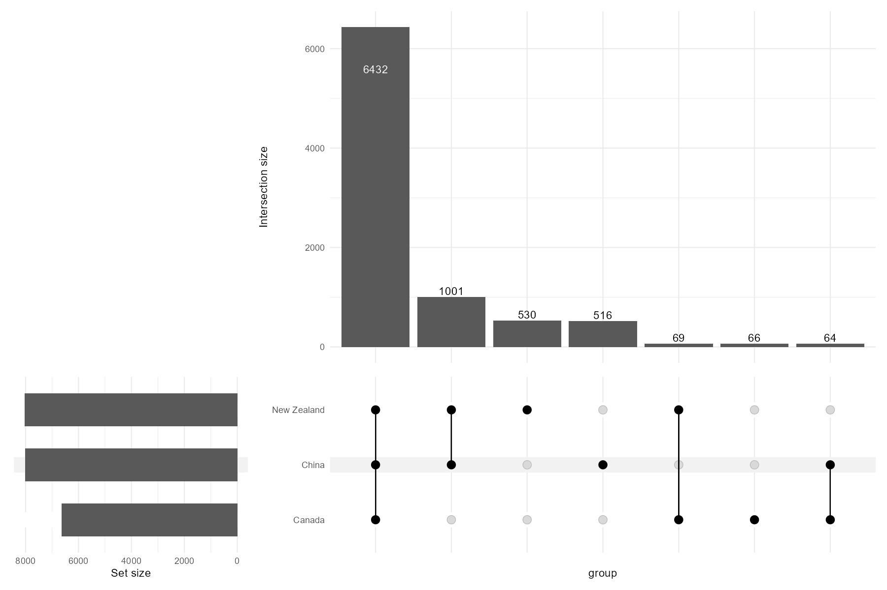
<figcaption aria-hidden="true">Upset Plot showing the Colocation of
Microbes within the affected Regions</figcaption>
</figure>

This finding demonstrates that grass, while not serving as a genomic
reservoir for the obelisk virus, likely acts as a contamination vector
by mediating the introduction of microbial hosts or bacteria into the
gut microbiomes of affected animals. The observed overlaps in microbial
taxa, particularly the unexpected similarities between geographically
distant regions, support the argument that grass facilitates microbial
transmission and may contribute to the spread of the obelisk virus
within temperate biomes.

------------------------------------------------------------------------

**Identifying new potential Host Cells**

I further analysed the overlapping microbiome shared among all the
affected countries to identify microbes present in every region. These
common microbes could then be further analysed to identify whether they
act as a host cell for the Obelisk. Specifically, I investigated whether
Streptococcus sanguinis was included in this overlap, as the Obelisk
paper identifies it as a known host-associated microbe.

Streptococcus sanguinis was indeed present in all three datasets,
supporting the observation made in the Obelisk paper. I then aimed to
further investigate the overlapping microbes from ‘present\_in\_all’ to
identify those closely related to Streptococcus, potentially expanding
the list of candidate host cells. These candidates will need
experimental validation to determine whether they also harbour the
Obelisk. To determine the candidates, I compared the list of microbes
present in all countries ‘present\_in\_all’ to the phylogenetic tree of
Streptococcus sanguinis. This allowed me to identify closely related
microbes that could potentially serve as additional host cells.

To identify species closely related to Streptococcus sanguinis, I
utilised the NCBI BLAST tool to analyse 16S rRNA sequences. Initially, I
retrieved the 16S rRNA sequence for Streptococcus sanguinis using the
reference number NR\_024841.1 from the NCBI database. The rRNA sequence
file is named ‘streptococcus\_16S\_rRNA’. The bash code can be found
within the ‘streptococcus\_blast\_code’ file. The BLAST results from
identifying related species to Streptococcus sanguinis using the BLAST
algorithm can be found in the file ‘results\_strepto’ I then continued
to analyse the BLAST results in R. I used ChatGPT for debugging.

Through this analysis, I identified species closely related to the known
host cell Streptococcus sanguinis. Using the ‘overlap\_summary’
dataframe, which lists species common across affected regions, I firstly
confirmed the presence of Streptococcus sanguinis in all regions and
secondly expanded the potential host cell list. Specifically, I
identified two additional species with &gt;90% identity, both closely
related to S. sanguinis and found within the local rumen microbiome of
all three regions.The two species are ‘Streptococcus gordonii’ and
‘Streptococcus dysgalactiae subsp. equisimilis’. The next step would be
to assess whether my Obelisk is present in local samples of these
bacteria to validate this computational hypothesis.

<figure>
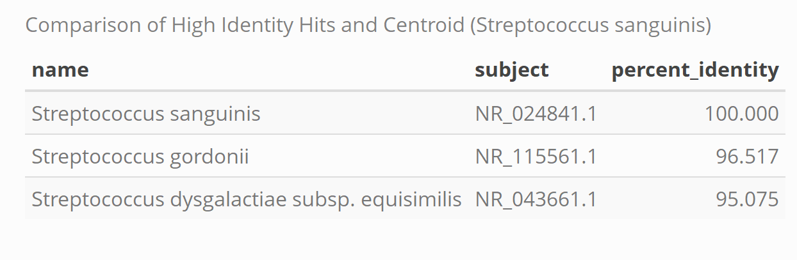
<figcaption aria-hidden="true">Table: Comparison of High Identity Hits
from the local Microbiomes around the Centroid</figcaption>
</figure>

Building on my earlier findings, I identified patterns in the
microbiomic characteristics of the affected regions and proposed two
additional potential host cells. Furthermore, the significant overlap
between the microbioal cells and the presence of the known host suggest
that grass acts as a contamination vector, allowing the host organisms
to acquire the virus.

Having placed my Obelisk into a broader ecological context, I will now
shift focus to its genomic characteristics.

------------------------------------------------------------------------

**Genomic Analysis of the Obelisk** To identify patterns and examine how
the Obelisk may differ based on the country in which it was found, I
began by analysing how the genomic sequences vary across different
countries. Additionally, I aim to determine whether similarities exist
within the clustered Obelisks and explore patterns that could
potentially explain differences between regions, such as the northern
and southern hemispheres.

I started off my analysis by simply isolating my centroid sequence and
create a new data frame which shows the country of origin, sequence and
percent identiy of the sequences when compared to the centroid.

------------------------------------------------------------------------

**Genomic Differences and Similarities between the affected Countries**

I aim to investigate potential genomic similarities and evolutionary
characteristics based on the geographic locations where the Obelisks
were discovered. To achieve this, I will perform multiple sequence
alignment (MSA) of the complete sequence to identify conserved regions
across the genome and detect variations. Following this, I will
construct a phylogenetic tree to cluster the sequences and explore
potential geographical patterns. Additionally, I will visualise the
multiple sequence alignments using principal component analysis (PCA) to
further uncover patterns within the variation.

I began by performing multiple sequence alignment (MSA) on the clustered
Obelisk sequences to identify conserved regions and variations across
the dataset. I used the Clustal Omega tool and ChatGPT to help me
navigate through the Ubuntu code. The exact Ubuntu code after the FASTA
extraction can be found in the file ‘msa\_clusters\_clustalomega’. The
file ‘aligned\_sequences\_cluster’ contains the data from the multiple
sequence alignment.

<figure>
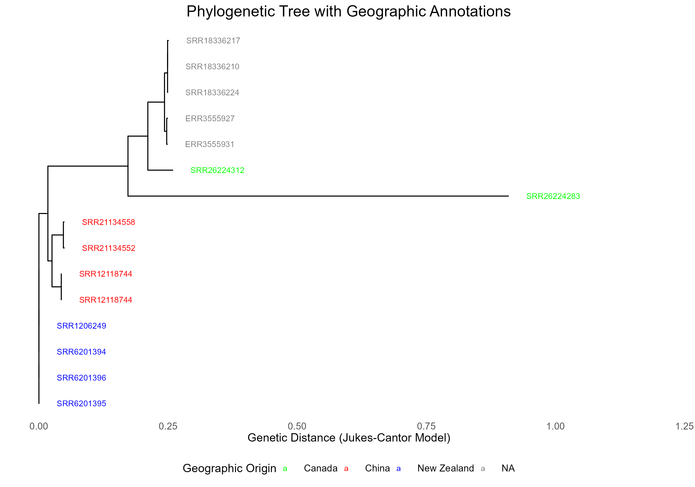
<figcaption aria-hidden="true">Phylogenetic Tree with Geographic
Annotations</figcaption>
</figure>

Samples from China (red) form a distinct cluster, reflecting a
relatively similar genetic composition of the microbiome within this
geographic origin. Similarly, samples from New Zealand (blue) form a
separate cluster, indicating a microbiome composition distinct from both
China and Canada (green) but internally consistent within New Zealand.
Notably, the branch lengths between China and New Zealand samples are
shorter compared to their connections to Canada. This suggests, that the
Obelisks from China are more similar to the ones from New Zealand. This
is consistent with the upset plot findings that the microbiome
composition of China is more similar to New Zealand rather than Canada.
The Canadian sample SRR26224312 stands out on a long, isolated branch,
suggesting either a unique squence, microbiome composition or potential
sequencing artefacts. Samples with “NA” geographic annotations (grey)
also cluster separately, implying a distinct microbiome composition.
However, their closer relationship to the Canadian samples suggests an
evolutionary origin near Western Canada, from which they developed into
a distinct cluster.

Having established the evolutionary relationships based on genetic
similarities, I am now applying PCA to analyse the data from a different
perspective. This approach focuses on identifying patterns of variation
across the clustered sequences. I used once again ChatGPT for help as I
first had to convert the ‘alignment\_matrix’ into a numerical
representation. Most of the PCA code was already known to me due to
previous courses at ETH.

<figure>
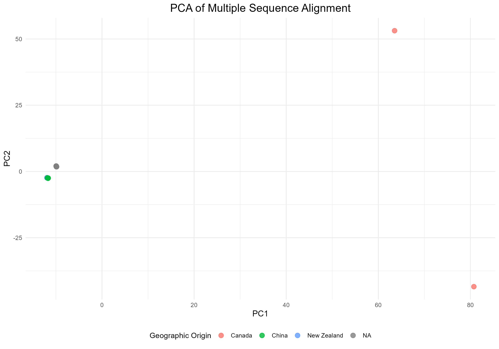
<figcaption aria-hidden="true">PCA of the multiple sequence alignment
from the clustered Obelisks</figcaption>
</figure>

The PCA plot partially aligns with the observations derived from the
phylogenetic tree. The Canadian Obelisks are distinctly different from
both the Chinese and New Zealand Obelisks. Additionally, the significant
genetic difference among the two Canadian samples supports previous
findings that one sample is genetically distant from the others.
However, a clear cluster is observed that includes Obelisk sequences
from New Zealand, China, and the NA values.

This clustering aligns with my earlier observation that the Chinese
Obelisks are evolutionary closer to the New Zealand Obelisks. However,
it contradicts the expectation that the NA Obelisks would be closer to
the Canadian samples, as they instead appear to cluster more closely
with the Chinese and New Zealand Obelisks. This pattern suggests that
while the phylogenetic tree reflects evolutionary relationships based on
lineage and therefore indicating that the NA samples likely derive from
the Canadian samples, that their sequences share similarities with the
Chinese and New Zealand samples. This suggests that factors beyond
direct ancestry influence genetic similarity, creating overlaps in
genetic traits even among species that do not share a direct
evolutionary origin. These factors could include genetic drift, maybe a
form of horizontal gene transfer, or shared environmental pressures
shaping genetic variation.

Altogether, these findings reveal an unexpected pattern of sequence
similarity. While one might anticipate closer relationships among
Obelisks from the northern hemisphere due to geographical proximity, the
data instead show stronger genetic similarities between Obelisks from
China and New Zealand, spanning both hemispheres. Furthermore, the
results suggest that despite the NA Obelisks being evolutionarily closer
to the Canadian Obelisks, variations captured by PCA reveal distinct
clustering patterns, likely influenced by factors beyond direct
ancestry. To gain further insights, I will now conduct a more detailed
genome analysis to identify new characteristics of the centroid, which
can then be applied to the related types.

------------------------------------------------------------------------

**Identifying Open Reading Frames**

After using the sequence of the Obelisks to further validate my
ecological analysis, I shifted my focus to characterising the genome of
my centroid. To begin, I identified potential open reading frames (ORFs)
using the NCBI ORF Finder, guided by the tutorial provided by
VIRUSxDISCVRY. I uploaded the file ‘centroid\_sequence.fa’ into the
sequence input box to initiate the analysis.

To gain further insights, I performed a BLAST search for each ORF to
identify homologous proteins and infer potential functions or
characteristics for the encoded genes. This step was critical in
determining how these ORFs might contribute to the molecular machinery
of the Obelisk.

I organised my findings into a data frame to compile and store the most
essential information systematically in the CSV file
‘ORF\_description\_centroid’:

When analysing the data frame, I was dissatisfied with the percent
identity and E-value scores of the proposed protein alignment.
Therefore, I need to further investigate the true nature of these ORFs
and identify other proteins that might be associated with my Obelisk.

I continued by annotating the genome to map out the the location of the
ORFs . I used
[this](https://github.com/PuravG/Computational-Virus-Discovery/blob/main/Workflow%20Summary.md)
tutorial to create the following code and annotate the genome after
Thomas provided this link on PIAZZA. I also added the antisense strand
of the genome. I used ChatGPT to adjust the plot:

<figure>
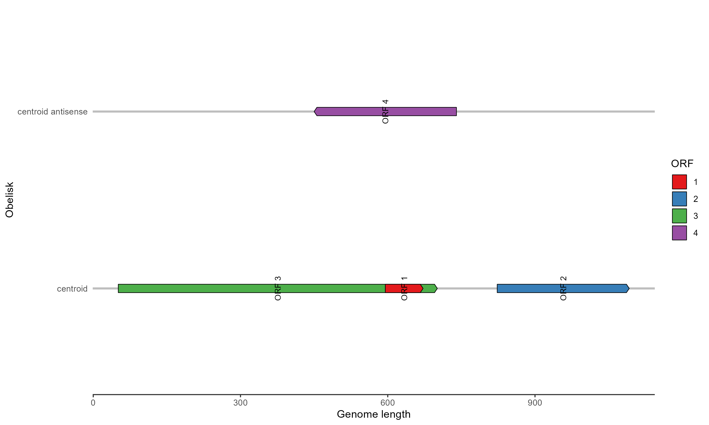
<figcaption aria-hidden="true">Genome annotation with ORF</figcaption>
</figure>

Now that I have mapped out the ORFs on a linear plot, I can further
analyse each ORF and maybe try to identify characteristics of these
proteins. The analysis revealed four ORFs. Three of these were located
on the sense strand, indicating that these regions are likely to encode
proteins during the normal lifecycle of the Obelisk. Interestingly, one
ORF was identified on the antisense strand. The literature suggests that
some retroviruses such as HIV-1 and HTLV-1 transcribe from their
antisense strand \[Romerio, 2023\]. Thus, it is possible that my Obelisk
also possesses this characteristic. While the genome is most likely
single-stranded circular RNA, the presence of this antisense ORF may
suggest that this ORF is transcribed during replication. Therefore, it
could potentially encode for a protein involved in Obelisk replication
or other regulatory functions.

With the ORFs of the lifecycle Obelisk mapped to a linear sequence, my
next step is to further explore the genome’s structure by creating a
circular plot to identify more patterns. Additionally, I aim to analyse
the characteristics of the ORFs and especially the Oblin1 overlap across
the symmetry axis of the genome.

------------------------------------------------------------------------

**Genome Visualisation**

I started off by visualising the circular genome. I implemented the ORF2
and ORF3 to map it out. I left out the ORF1 in this visualisation, as it
has an E-value of 8.9 and is extremely short further indicating that it
was only identified by chance. However, since the BLAST search revealed
a relatively high percent identity of 59% to the ‘eIF-2-alpha kinase,’
it is possible that ORF1 represents a domain within the Oblin1 protein.
I will keep this in mind and further investigate that possibility later
on. I created two plots: one representing the lifecycle Obelisk (sense
strand) and the other depicting the antisense strand during replication.
The ORF4 is located on the antisense strand and was implemented in the
figure as well.

<figure>
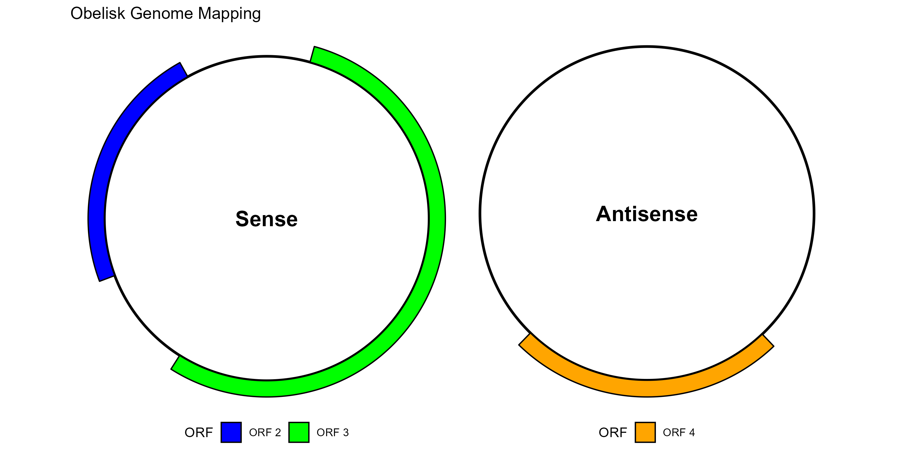
<figcaption aria-hidden="true">Circular Genome annotation with
ORF</figcaption>
</figure>

The circular genome of the sense strand and the ORF are read clock-wise.
When analysing the sense strand and comparing its structure to Figure 6
from the Obelisk paper, distinct patterns and similarities become
evident. My Obelisk closely resembles the Obelisk-Beta structure, as its
length (1188 nt) and the positioning of its ORFs align with the reported
features. Notably, ORF3 appears to correspond to the Oblin1 sequence,
while ORF2 could encode Oblin2. Furthermore, the symmetry axis is
observed to bisect ORF3 and ORF2.

**ORF3 = Oblin1**

**ORF2 = Oblin2**

The circular genome of the antisense strand are read counter-clock-wise.
On the antisense strand, an intriguing observation emerges: ORF4 spans
from to the end of ORF3 to the symmetry axis, representing the
complementary sequence of the latter half of ORF3. That means, that the
ORF4 encodes for a protein whose sequence is complementary to the last
half of the Oblin1! As it is only accessible during Obelisk replication,
I hypothesise that it is somehow similar to known proteins that are
associated with RNA, DNA or Virus replication.

**ORF4 = Obelisk self-replicatory protein (?)**

Returning to the previously mentioned ORF1, it is located within ORF3,
which is likely to encode the Oblin1 protein. Based on this, I assume
that the BLAST result identifying ORF1 as ‘eIF-2-alpha kinase’ is
partially accurate. It is plausible that ORF1 represents a domain within
Oblin1 and shares the same protein function as suggested by the BLAST
analysis. However, as the ORF1 also possesses a start codon it is also
translated independently.

**ORF1 = domain from Oblin1**

These findings demonstrate a strong alignment between my Obelisk and the
results in the paper. Furthermore, the unique characteristic of ORF4 on
the antisense strand presents an opportunity for deeper insight into
these Obelisks, as ORF4 may only be transcribed during replication.
Investigating ORF4 could provide critical clues about whether Obelisks
produce self-replicatory compounds, thereby enhancing our understanding
of their replication mechanisms.

I continued to write up my findings in a new data frame: 

### Virus Genome

<figure>

<figcaption aria-hidden="true">Genome annotation with ORF</figcaption>
</figure>

<figure>

<figcaption aria-hidden="true">Circular Genome annotation with
ORF</figcaption>
</figure>

<figure>
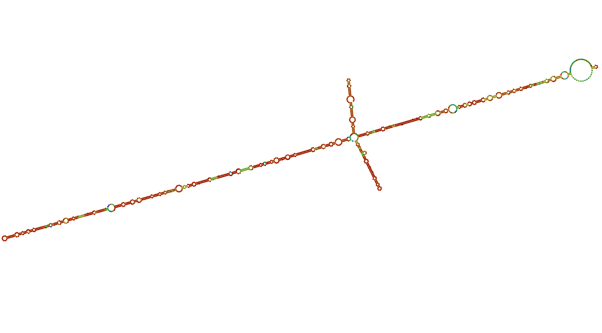
<figcaption aria-hidden="true">RNA-secondary structure based on RNAfold
Webserever</figcaption>
</figure>

### Protein Visualisation

Oblin1: 

Oblin2: 

Proposed replication protein: 

### Possible Replication Protein on the Antisense Strand

------------------------------------------------------------------------

**Amino acid sequence of the genes**

I try to further analyse whether the antisense protein could function as
a replication protein. I aimed to further identify the molecular
function and try to detect homologous proteins to deepen my
understanding of its role.

Firstly, I translated all the ORFs to get the amino acid sequence. I did
this step in the section before and the data can be seen in the
following dataframe ‘protein\_data’. 

Now that I have the amino acid sequence of the three proteins of
interest, I can start to analyse them even further. I continued by
visualising them in Alpha Fold. The results can be seen in the previous
chapter.

------------------------------------------------------------------------

**Possible Presence of a replication protein on the antisense strand**

I then continued to further characterise my proposed replicatory protein
on the antisense strand

I started to characterised the sequence using [NCBI
CDD](https://www.ncbi.nlm.nih.gov/Structure/cdd/wrpsb.cgi) which
searches for conserved domains within the protein sequence. This yielded
no results, likely due to the short length of the protein. The [NCBI
BLAST](https://blast.ncbi.nlm.nih.gov/Blast.cgi?PROGRAM=blastp&PAGE_TYPE=BlastSearch&BLAST_SPEC=&LINK_LOC=blasttab&LAST_PAGE=blastn)
search also yielded no hits. Therefore, I redirected my search to a
viral database, to possibly find a hit. I used the
[ViPR](https://www.viprbrc.org) database trying to identify hits. This
database also yielded no results.

Given that the proposed protein has no known homology, I had an
interesting idea suggesting that this protein might function as a
mediator between the host cell’s RNA polymerase (e.g. Streptococcus
sanguinis) and the Obelisk’s genome. This interaction could redirect the
host polymerase to the Obelsik’s genome, facilitating its replication.

The following analysis focused on this idea. \_\_\_ **RNA binding
domains of the proposed replication protein**

First, I used the [RNAct](https://rnact.tartaglialab.com/) tool to
determine whether this protein possesses an RNA-binding domain. This
would help identify if the protein is directly involved in binding the
Obelisk RNA or if it is more likely that the proposed replication
protein interacts with another site on the host cell’s RNA polymerase,
potentially altering its affinity from the host cell’s RNA to the
Obelisk’s RNA. This search yielded no results. Thus, it is not likely
that the replication protein directly targets the Obelisk’s genome.

I then tried to identify whether this protein possesses nuclear
transition signals which would indicate if it would even be able to
interact with nuclear RNA-polymerase. I used the [cNLS
Mapper](https://nls-mapper.iab.keio.ac.jp/cgi-bin/NLS_Mapper_form.cgi)
for this analysis.

<figure>
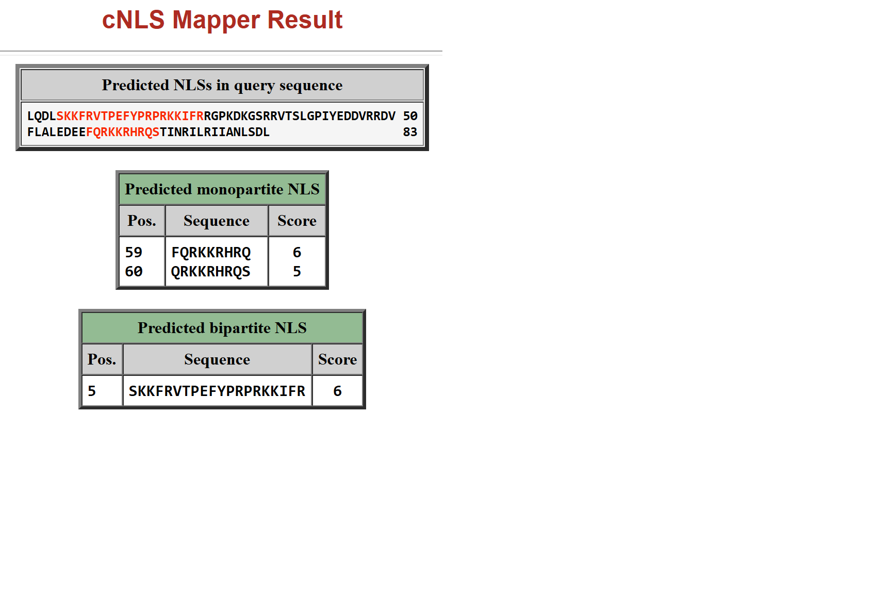
<figcaption aria-hidden="true">cNLS Mapper results of the proposed
replication protein</figcaption>
</figure>

This analysis yielded both monopartite and bipartite hits. The two
monopartite hits, with scores of 5 and 6, suggest that the protein
contains a single continuous stretch of signalling amino acids, allowing
for localisation in both the cytoplasm and the nucleus, as explained on
the website. The bipartite hit suggests that the protein contains two
clusters of amino acid stretches separated by a spacer region. The score
of 6 further supports the conclusion that the protein is localised in
both the nucleus and the cytoplasm. \[Park, 2023\]

Therefore, it is possible that the replication protein can translocate
into the nucleus and interact with the host RNA-polymerase and alter its
affinity.

Now that I know that the possible replication protein is spread
throughout the cytosol and the nucleus, I want to further analyse
possible interactions. To do so, I further analyse whether the proposed
replication protein is capable of docking to the bacterial
RNA-polymerase, thus altering its affinity and allowing Obelisk genome
replication. I tried to identify interacting domains between my proposed
replication protein and bacterial RNA-polymerase.

------------------------------------------------------------------------

**Possible Interaction domains**

Since the Obelisk is likely to be found within bacteria (such as
Streptococcus sanguinis and potentially my newly proposed host cells), I
attempted to identify interacting domains between bacterial RNA
polymerases and my protein. To do so, I first retrieved the
RNA-polymerase sequence of the Streptococcus sanguinis. This bacterial
RNA-polymerase consist out of several subunits (two α (RpoA), one β
(RpoB), one β’ (RpoC) and one ω (RpoZ)) which then assembly to the
functional complex \[Darst 2001, Svetlov 2015\]. Therefore, I retreated
the FASTA files for all the subunits form the [NCBI
protein](https://www.ncbi.nlm.nih.gov/protein) database.

There was no pre-assembled strucutre for the Streptococcus sanguinis
RNA-polymerase on PDB (how great).

Thus, I predicted each fold of the subunits using
[AlphaFold](https://alphafold.ebi.ac.uk/) and downloaded the PDB files.
Then, I used the [protein data bank (PDB)](https://www.rcsb.org) to
identify a bacterial RNA polymerase template allowing me to assemble my
subunits trying to create the Streptococcus RNA-Polymerase. I first used
a template structure from E. coli (search ID: 4YLP) allowing me to
assemble the subunits not from de novo. I downloaded biological assembly
file ‘RNA\_poly\_template’ and validated its structure in PyMOL. The
alignment to the E. coli using my subunits provided high RMSD values
(&gt;5) indicating a bad alignment. Therefore, I tried to identify a
different template which is more appropriate.

I used the Bacillus subtilis RNA Polymerase as a next step as it is
closer related to the Streptococcus than E. coli. The code for the PyMOL
alignment can be found in the file ‘PyMOL\_code\_strepto\_polymerase’.
The final alignment using the Bacillus polymerase as a template looked
like that:

<figure>
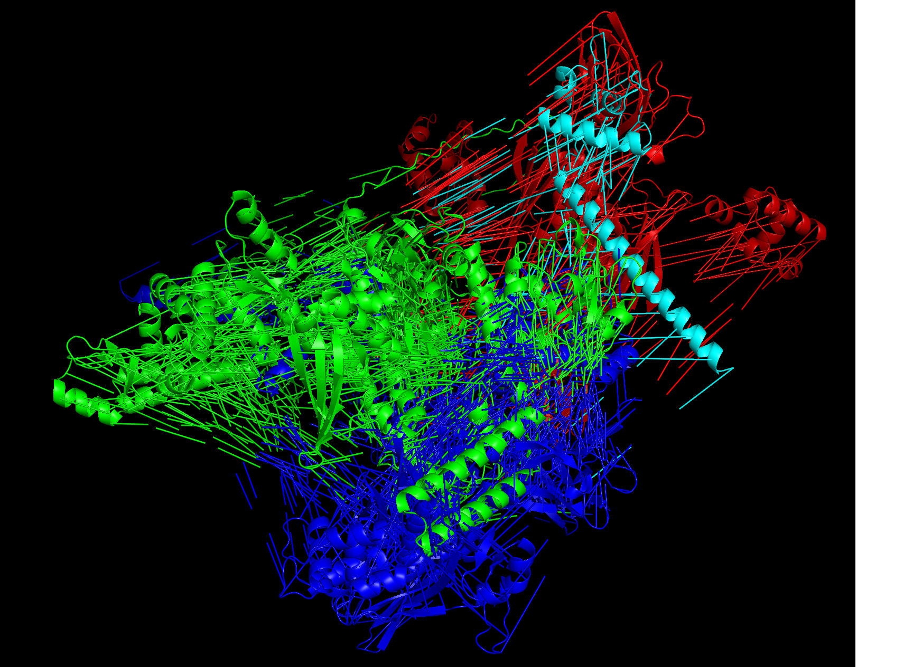
<figcaption aria-hidden="true">RNA Polymerase of the Streptococcus
sanguinis</figcaption>
</figure>

Despite having adequate RMSD values (mostly &lt;2) the model does not
look pretty *at all*. Therefore, I tried to identify protein interaction
sites by comparing each subunit of the streptococcus RNA polymerase to
the proposed protein replication protein. The file
‘PBD\_replication\_protein’ contains the data for my replication
protein. All the subunits of the streptococcus can also be found in the
data file.

I used [HADDOCK](https://rascar.science.uu.nl/haddock2.4/) as a tool to
identify interaction residues between the replication protein and the
alpha, beta, and omega subunits from the Streptococcus RNA-polymerase. I
tried to identify whether alpha helices from the subunits are able to
interact with the alpha helice from the replication protein. My input
paramters (from subunit alpha) looked like this:

<figure>
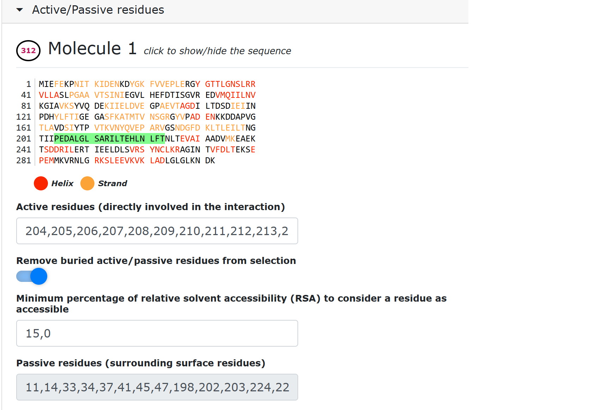
<figcaption aria-hidden="true">Alpha subunit residue</figcaption>
</figure>

------------------------------------------------------------------------

**Alpha Subunit and Replication Protein Interaction**

The result of the docking analysis between the alpha subunit and the
proposed replication protein provided valueble insights. The HADDOCK
score of -70.3 ± 4.9 is moderately favourable, suggesting some
favourable interactions but not as strong as seen in highly reliable
alignments (often &lt; -100). The electrostatic energy is strongly
negative (-269.7 ± 43.2), indicating significant favourable charge-based
interactions. Similarly, the Van der Waals energy (-57.5 ± 3.2) supports
stable molecular packing. However, the restraints violation energy
(310.4 ± 67.8) is high, indicating deviations from the applied
restraints, which reduces confidence in the reliability of the
alignment. The RMSD value of 27.5 ± 0.1 Å is unusually high, suggesting
significant structural variability, which is unfavourable.

Altogether, the docking results suggest some favourable interactions
(e.g. electrostatics), but the high RMSD and moderate HADDOCK score
indicate a lack of precision or accuracy in alignment. Therefore, we can
exclude a high association between the replication protein and the
subunit.

Detailed results can be found
[here](https://rascar.science.uu.nl/haddock2.4/result/6209086420/414897-alphasubunit)

Visualisation of the alpha subunit and the proposed replication protein
can be found in the PDB file ‘alpha\_replication\_cluster’:

 \_\_\_ **Beta
Subunit and Replication Protein interaction**

The parameters for Cluster 10 suggest a more favourable docking
interaction compared to the previous cluster. The HADDOCK score of -91.2
± 18.1 indicates a stronger overall interaction energy, which is more
favourable than the prior cluster’s score. The electrostatic energy of
-430.6 ± 43.0 is highly negative, demonstrating strong favourable
charge-based interactions between the docked molecules. Additionally,
the RMSD from the overall lowest-energy structure is 0.6 ± 0.5 Å, which
is significantly lower and indicates high structural consistency and
reliability in the docking poses within this cluster. However, the
restraints violation energy (561.7 ± 98.6) is quite high, which raises
concerns about the adherence to experimental restraints during docking

Overall, this cluster represents a stronger and more favourable docking
interaction due to the highly negative HADDOCK and electrostatic scores,
as well as the low RMSD. The high restraints violation energy, however,
is a notable limitation, suggesting some inaccuracies that might require
further refinement.

Detailed results can be found
[here](https://rascar.science.uu.nl/haddock2.4/result/6209086420/414899-betasubunit)

 \_\_\_ **Omega
Subunit and Replication Protein interaction**

The HADDOCK score of -89.3 ± 2.0 indicates a favourable docking
interaction which reflects good binding energy overall. The
electrostatic energy of -466.3 ± 44.7 is very negative, highlighting
strong charge-based interactions, which is a key factor in molecular
binding. However, the RMSD value of 30.7 ± 0.1 Å is exceptionally high,
indicating a significant lack of structural consistency across the
cluster, which undermines the reliability of this docking result.

While the interaction appears energetically favourable based on the
HADDOCK and electrostatic energy scores, the extremely high RMSD
significantly reduce the reliability of this docking cluster.

Detailed results can be found
[here](https://rascar.science.uu.nl/haddock2.4/result/6209086420/414904-omegasubunit)

<figure>
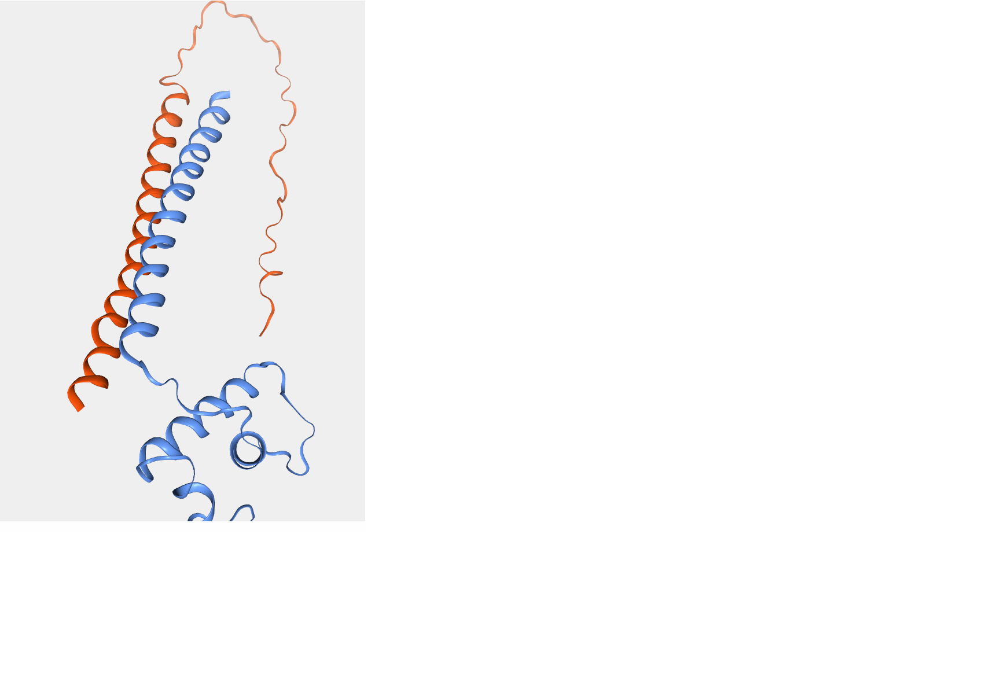
<figcaption aria-hidden="true">Omega Subunit (blue) of the Streptococcus
sanguinins and the proposed replication protein’s (orange) most
favourable cluster</figcaption>
</figure>

------------------------------------------------------------------------

**Final Evaluation of the Interaction**

Based on the analysis of the docking clusters, it is plausible that the
replication protein from the antisense strand from the Obelisk interacts
with the RNA polymerase of Streptococcus. Altthough the results vary in
reliability. The beta subunit demonstrates the most favourable
interaction with the replication protein, with a strongly negative
HADDOCK score and electrostatic energy, alongside a very low RMSD,
suggesting a stable and reliable interaction.However, the interaction
with the alpha and the omega subunit had more downsides rather than
favourable characteristics.

Altogether, the analysis indicates that the interaction between the
replication protein and the RNA polymerase is possible, but the
favourability depends on the specific subunit involved. The beta subunit
appears to be the most favourable interaction partner. Therefore, my
hypothesise that the ORF on the antisense strand of the Obelisk virus
could be associated with the host RNA-polymerase is supported.
Nevertheless, due to the unsuccessful assembly of the Streptococcus
RNA-polymerase complex, this result has to be treated carfully as it
does not truly resemble the in vivo appearance.

------------------------------------------------------------------------

**Additional side note on the Intracellular location of Oblin1**

I also used [cNLS
Mapper](https://nls-mapper.iab.keio.ac.jp/cgi-bin/NLS_Mapper_form.cgi)
to identify where the Oblin1 protein can be localised to further
understand its possible physiological function.

<figure>
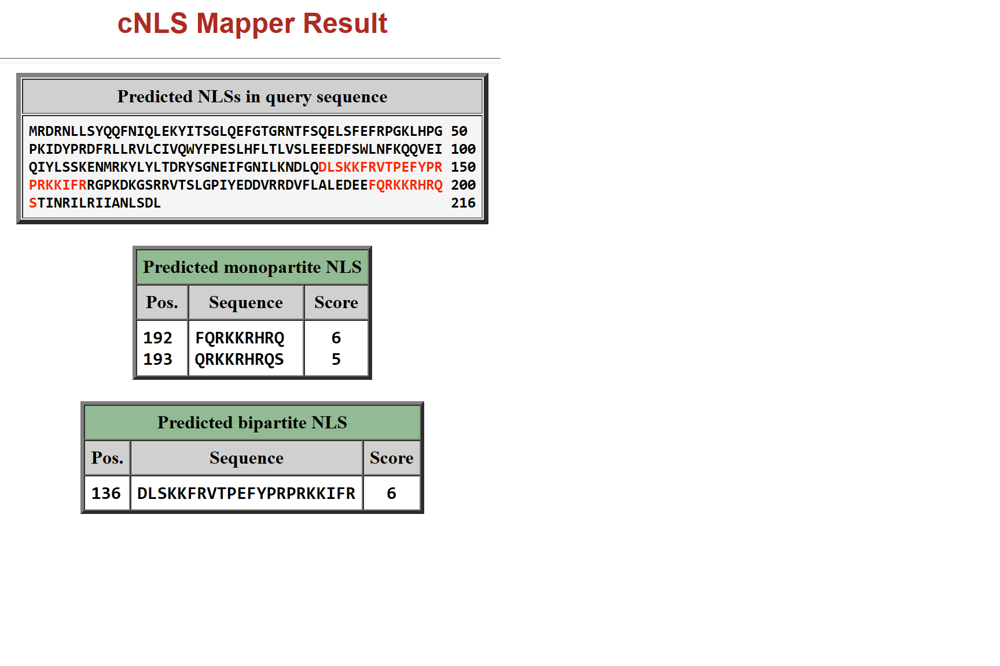
<figcaption aria-hidden="true">cNLS Mapper results of the Oblin1
protein</figcaption>
</figure>

This search yielded three hits: two monopartite NLS and one bipartite
NLS. These results further suggest that Oblin1 is capable of localising
to both the cytoplasm and the nucleus just as the proposed replication
protein.

## Discussion

------------------------------------------------------------------------

**Ecological Insights and Microbiome Composition**

Ecological analysis revealed that the Obelisk is consistently associated
with temperate biomes, particularly the “Temperate Broadleaf & Mixed
Forests” biome, spanning geographically disparate regions such as China,
New Zealand, and Canada. This pattern suggests a robust ecological niche
maintained by stable microbial communities. Despite its association with
grass as a contamination vector, no evidence supports grass as a genomic
reservoir. Instead, the virus likely depends on microbial hosts within
the rumen microbiome.

Interestingly, the microbiome composition of the Obelisk-infected
regions showed surprising overlaps. While New Zealand and China
displayed closer microbial similarities despite their geographic
distance, Canada diverged significantly. These findings challenge
assumptions about microbiome distribution and underscore the importance
of microbial ecology in viral spread. The possibility of shared
environmental pressures or horizontal gene transfer driving genetic
similarities between distant populations is particularly fascinating and
warrants further exploration.

------------------------------------------------------------------------

**Host Interactions and Novel Potential Hosts**

A key outcome of this work was the identification of host candidates for
the Obelisk virus. Streptococcus sanguinis, a known host, was present in
all affected regions. Additionally, Streptococcus gordonii and
Streptococcus dysgalactiae subsp. equisimilis emerged as potential hosts
through phylogenetic analysis, highlighting a broader spectrum of
possible microbial interactions.

This expanded host range has significant implications for understanding
the virus’s lifecycle and transmission. The overlap of microbiota
between regions, facilitated by vectors like grass, could promote the
spread of both primary and secondary hosts, demonstrating a complex web
of ecological and biological relationships that support viral
persistence.

------------------------------------------------------------------------

**Genomic Structure and Evolutionary Characteristics**

The Obelisk genome’s circular, single-stranded RNA structure exemplifies
its evolutionary novelty. The identification of four open reading frames
(ORFs) revealed intriguing functional and structural features:

-   ORF1: Likely represents a domain within Oblin1, with partial
    functional alignment to eIF-2-alpha kinase
-   ORF2 and ORF3: Encode Oblin2 and Oblin1, respectively, with Oblin1
    displaying features consistent with the Obelisk-Beta subgroup
-   ORF4: A novel replicative protein encoded on the antisense strand,
    suggesting a role in viral replication via interaction with host RNA
    polymerase.

The genome’s symmetry, with ORF3 and ORF2 bisected by a central axis,
aligns with known Obelisk structures but introduces new possibilities
for functional interdependence among its proteins. The antisense
localisation of ORF4 challenges standard definitions of single-stranded
RNA virus genome organisation and adds a layer of complexity to its
replication strategy.

------------------------------------------------------------------------

**RNA Interaction and the Role of the Replication Protein**

One of the most intriguing findings from this study is the potential
interaction between the proposed Obelisk replication protein (ORF4) and
the Streptococcus sanguinis RNA polymerase. This novel hypothesis adds a
significant dimension to our understanding of the Obelisk’s replication
strategy and its reliance on host machinery.

Docking analyses revealed that the replication protein likely engages
with specific subunits of the bacterial RNA polymerase, with the beta
subunit emerging as the most favourable interaction partner. This
interaction is supported by stable binding characteristics, including
strong electrostatic and Van der Waals interactions, and reliable
structural consistency. Conversely, the alpha and omega subunits
demonstrated weaker or less reliable interactions, suggesting a
selective affinity of the replication protein for certain polymerase
components.

The presence of nuclear localisation signals (NLS) in the replication
protein further supports its capability to translocate into the host’s
nucleus or cytoplasm, potentially enabling it to redirect the host
polymerase’s transcriptional activity toward the Obelisk genome. While
these computational findings provide compelling evidence, challenges in
fully assembling the Streptococcus sanguinis RNA polymerase complex
highlight the need for caution and further experimental validation.

If confirmed, this interaction mechanism would represent a novel
adaptation among RNA viruses, where a viral protein selectively targets
host polymerase subunits to mediate genome replication. This finding not
only advances our understanding of Obelisk biology but also broadens the
scope of host-virus interactions in microbial ecosystems, providing a
unique framework for studying replication strategies in RNA viruses.

------------------------------------------------------------------------

**Phylogenetic Tree and Evolutionary Insights**

Phylogenetic analysis revealed unexpected patterns in the Obelisk’s
evolutionary relationships. Obelisks from China and New Zealand shared
closer genetic similarities than either did with Canada, aligning with
microbiome composition data. The presence of distinct clusters suggests
both evolutionary lineage and shared environmental pressures influence
genetic traits.

The most fascinating divergence lies in the Canadian samples, where long
phylogenetic branch lengths indicate potential sequencing artefacts or
distinct evolutionary pressures. The distinctness of these samples
invites further investigation into the unique microbiome dynamics or
ecological conditions in Canada.

------------------------------------------------------------------------

**Challenging Definitions and Novel Insights**

The Obelisk challenges two textbook definitions:

-   Genome Organisation: The presence of an antisense ORF (ORF4)
    challenges conventional views of single-stranded RNA virus
    replication, hinting at novel mechanisms.

-   Microbiome Interplay: The interplay between microbial hosts and
    environmental vectors like grass reveals complex transmission
    pathways not typically considered in viral ecology.

What stands out is the absence of conserved protein functions typically
associated with replication and host interaction, suggesting that the
Obelisk employs previously uncharacterised mechanisms to sustain its
lifecycle. This divergence from textbook expectations opens the door to
novel hypotheses about viral evolution and adaptation.

------------------------------------------------------------------------

**Conclusion**

Characterising the Obelisk genome has provided profound insights into
its ecological, evolutionary, and molecular dynamics. From its unique
genome structure to its interactions with microbial hosts, the Obelisk
challenges conventional wisdom and enriches our understanding of RNA
virus biology. A particularly compelling discovery is the hypothesised
interaction between the Obelisk replication protein and the RNA
polymerase of Streptococcus sanguinis, suggesting a novel mechanism for
redirecting host transcriptional machinery to support viral replication.

This reliance on microbial ecosystems, rather than a single host or
reservoir, underscores the complex interplay between environmental and
biological factors driving viral persistence and evolution. By shedding
light on these facets, the Obelisk demonstrates how studying
under-characterised viruses can unveil new paradigms in virology and
microbial ecology, offering broader implications for understanding
host-virus interactions.

## References

1.  Guo Q. Ecological comparisons between Eastern Asia and North
    America: historical and geographical perspectives. J Biogeogr.
    1999;26(2):199–206.

2.  Yih D. Land Bridge Travelers of the Tertiary: The Eastern
    Asian-Eastern North American Floristic Disjunction. Arnoldia.
    2012;69(3):14–23.

3.  Matt McGlone, ‘Evolution of plants and animals’, Te Ara - the
    Encyclopedia of New Zealand,
    <http://www.TeAra.govt.nz/en/evolution-of-plants-and-animals/print>
    (accessed 19 November 2024)

4.  Durzyńska J, Goździcka-Józefiak A. Viruses and cells intertwined
    since the dawn of evolution. Virol J. 2015 Oct 16;12(1):169.

5.  Hugh Stringleman and Robert Peden, ‘Sheep farming - The
    establishment phase’, Te Ara - the Encyclopedia of New Zealand,
    <http://www.TeAra.govt.nz/en/sheep-farming/page-2> (accessed 20
    November 2024

6.  Temperate forest - Deciduous Trees, Conifers, Evergreen | Britannica
    \[Internet\]. \[cited 2024 Nov 23\]. Available from:
    <https://www.britannica.com/science/temperate-forest/Flora>

7.  Svoboda P, Di Cara A. Hairpin RNA: a secondary structure of primary
    importance. Cell Mol Life Sci CMLS. 2006 Apr;63(7–8):901–8.

8.  Romerio F. Origin and functional role of antisense transcription in
    endogenous and exogenous retroviruses. Retrovirology. 2023 May
    16;20(1):6.

9.  Park H, Denha S, Higgs PG. Evolution of Bipartite and Segmented
    Viruses from Monopartite Viruses. Viruses. 2023 May 10;15(5):1135.

10. A Darst S. Bacterial RNA polymerase. Curr Opin Struct Biol. 2001 Apr
    1;11(2):155–62.

11. Svetlov V, Artsimovitch I. Purification of Bacterial RNA Polymerase:
    Tools and Protocols. In: Artsimovitch I, Santangelo TJ, editors.
    Bacterial Transcriptional Control: Methods and Protocols
    \[Internet\]. New York, NY: Springer; 2015 \[cited 2024 Dec 3\].
    p. 13–29. Available from:
    <https://doi.org/10.1007/978-1-4939-2392-2_2>

12. R.V. Honorato, P.I. Koukos, B. Jimenez-Garcia, A. Tsaregorodtsev, M.
    Verlato, A. Giachetti, A. Rosato and A.M.J.J. Bonvin (2021).
    “Structural biology in the clouds: The WeNMR-EOSC Ecosystem.”
    Frontiers Mol. Biosci., 8, fmolb.2021.729513.

# Viral Short Story

    The rain hammered the tin roof of my shabby office, and the Pacific winds howled through the cracks in the walls. Another case had landed on my desk, and it reeked of trouble—scientific trouble. They called it "My Obelisk," and it had a knack for showing up where it didn’t belong. The client? A sharp-suited geneticist who wore her anxiety like cheap perfume.

    She placed a folder on my desk, her fingers trembling slightly. "It’s showing up in places we don’t expect. Bos tauri, Hu sheep—organisms that shouldn’t even share the same zip code of genetic anomalies. We need to know why."

    The data spilled across the table like an unravelling thread. Western North America, Eastern Asia, even New Zealand—all coastal regions hugging the Pacific. Temperate Broadleaf and Mixed Forests, places where the sea and the land had a complicated relationship. The connection was murky, like a film noir plot that refused to end cleanly.

    One detail caught my eye: a centroid discovered in an adult male Hu sheep in Nanjing, China. A sheep. In Nanjing. A genetic puzzle that could take down an empire—or, at the very least, shake up the local biome.

    "Any leads on why it’s sticking to coastal regions?" I asked, lighting a cigarette. She frowned. "None. But it thrives near the sea—almost like it’s drawn to the salt air."

    I stood, grabbing my trench coat. "Looks like I’ll be chasing ghosts through wet forests and seaside cliffs. If this thing is real, it’s not just a genome. It’s a roadmap."

    She nodded, her eyes heavy with secrets. My Obelisk wasn’t just a scientific curiosity; it was a riddle from nature’s dark side. And me? I had to solve it before it solved us.
