# Fleece and Release: Uncovering a Totivirus Hiding in Sheep Muscle

written by: [Sophia Li](https://github.com/sophiamjiali)

[YouTube/Video Link to your presentation video](https://videolink.goes.here)

### Ovismusculus totivirae

The genus name (Ovismusculus) combines Ovis from the primary host (sheep) and musculus from the tissue in which the virus was consistently detected, reflecting the virus' strong tissue tropism and host association. The species epithet (*totivirae*) refers to its totivirus-like RdRp motif, linking the virus to the Totiviridae family while acknowledging that full genome confirmation is pending.


## Abstract

Viruses are ubiquitous biological entities that shape host biology and ecosystem dynamics, yet many remain poorly characterized, especially those associated with vertebrate tissues. Totiviruses, a family of double-stranded RNA viruses, are typically known to infect fungi and protozoan parasites, often exhibiting tightly conserved replication mechanisms.

*Ovismusculus totivirae*, detected in transcriptomes of *Ovis aries* and *Capra hircus*, represents a totivirus-like sequence with a RdRp palmprint closely related to *Eimeria stiedai* RNA virus 1. Observed across multiple countries and breeds, the virus consistently appears in muscle-derived transcriptomes, suggesting a host- or tissue-specific association that is unusual for totiviruses detected outside typical parasite hosts. However, it remains unclear whether the totivirus-like sequences detected in vertebrate tissue represent true host infections, parasite-associated viruses, or artifacts of transcriptomic sequencing.

Here, we show that the virus likely infects a sheep-associated parasite, based on its strict tissue specificity and phylogenetic similarity to *Eimeria stiedai* RNA virus 1. Unlike canonical totiviruses which typically infect fungi, this sequence appears in vertebrate tissue-derived transcriptomes, revealing a nested infection pattern. Its consistent detection in muscle samples across multiple breeds and countries suggests a robust host–parasite association rather than sporadic contamination. This expands understanding of totivirus ecology to include vertebrate-associated parasitic contexts.

These findings demonstrate that livestock transcriptomes can harbor previously unrecognized parasite-associated viruses. Recognizing these nested infections is critical for accurate viral annotation and understanding host–parasite–virus interactions. By integrating ecological, tissue-specific, and phylogenetic analyses, this work provides a framework for interpreting viral signals in vertebrate datasets. It emphasizes that even well-characterized viral families can present unexpected host associations, underscoring the complexity of viral diversity in livestock systems.

## Results

### Initial Index Run and BioProject Analysis

To begin characterizing the virus, we first analyzed the index run, defined as the SRA run with the highest node coverage. From the information provided, the index run is associated with the run accession number SRR3399761, BioSample SAMN04867312, and BioProject PRJNA318767, with a node coverage of seven [NCBI Nucleotide, Internet]. The NCBI database browser was used to characterize the run's associated BioProject using its accession number [NCBI SRA, Internet]. The database results revealed that the project was named "RNA sequencing of sheep infraspinatus muscle after tendon release and repair under concomitant nadrolone administration" and was associated with the 2017 publication "Genomic and lipidomic actions of nandrolone on detached rotator cuff muscle in sheep" by Flück et al. from the Laboratory of Muscle Plasticity, University of Zurich, Zurich, Switzerland [Flück et al., 2017].

The study investigated the impact of administering nadrolone at the time of tendon release on fatty muscle infiltration in Ovis aries. Biopsies were collected from the operated infraspinatus muscle of eighteen two-year-old female Swiss Alpine sheep and expression profiling was performed by high throughput sequencing obtained using Illumina HiSeq 2500 [Bentley et al., 2008]. The GEO DataSet associated with the BioProject provided 36 BioSamples, corresponding to a biopsy before and after tendon release and repair per animal. Notably, the virus was not included in the original publication and was found in a controlled experimental setting, rather than a field survey.

### Expanding to All Observed Datasets and BioProjects

After characterizing the index run, we expanded our analysis to all datasets in which the virus was observed. By contextualizing the virus across all observed datasets and BioProjects, we can further investigate its broader ecology. Particularly, we looked for commonalities in species, geographical location, and the type of experiments performed to gain intuition regarding the ecology of the virus itself.

The virus was reliably detected in 32 SRA runs which associated with eleven distinct BioProjects, including the index run previously characterized [Flück et al., 2017; Jin et al., 2021; Jiang et al., 2014; Bao et al., 2022; Cui et al., 2022; Zhang et al., 2014; Han et al., 2022; Arora et al., 2019; Ma et al., 2018; Clark et al., 2017; Yuan et al., 2021]. The following code compiles all SRA runs in which the virus was observed as a data frame, included as the table below [R Core Team, 2023]. Note that the node sequence, Serratus link, RdRp microassembly link, and assembly download link are omitted for clarity. The run, BioSample, and BioProject fields are provided as their associated NCBI accession numbers.

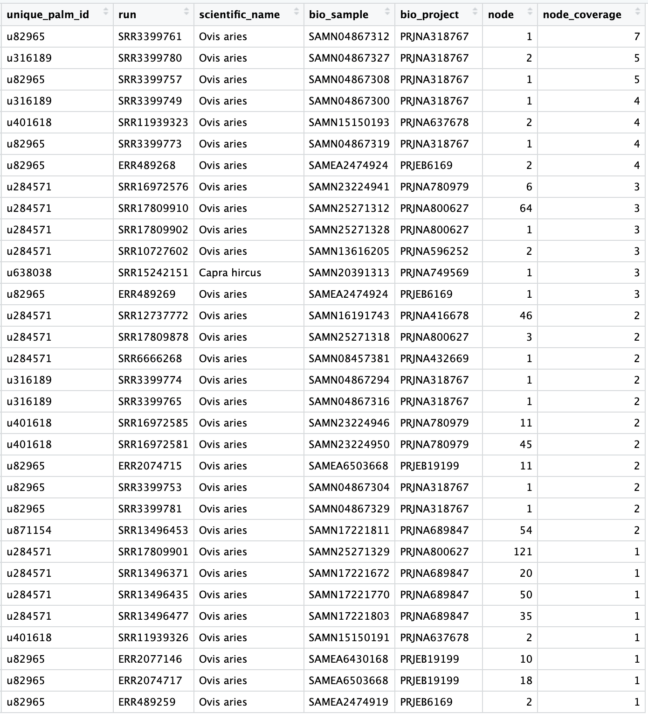**Table 1:** Summary of all SRA runs matching the assigned sOTU, showing only virus-positive observations with reliable detection. Entries are sorted in descending order of node coverage to highlight the most confident observations. Summary of all SRA runs matching the assigned sOTU, showing only virus-positive observations with reliable detection. Entries are sorted in descending order of node coverage to highlight the most confident observations.

Similar to the index run, the NCBI database browser was used to analyze each run's associated BioSample and BioProject using their corresponding accession numbers [NCBI SRA, Internet]. Each BioProject was associated with a publication, none of which mentioning the presence of a virus. The studies primarily focused on transcriptomic analyses, where sequencing data was made available from their associated BioSamples. These projects largely fell into two categories: comprehensive transcription surveys of sheep as a model organism, and expression profiles of sheep muscle tissue across developmental stages. A recurrent focus of these publications were the quality of mutton and investigated the transcriptomic origin of its associated desirable traits. Furthermore, the economic value of sheep and its derived products were explicitly stated as a primary motivator in almost all studies.

Using the NCBI database, our analysis revealed that the virus was dominantly found in *Ovis aries*, composing 31 out of the 32 runs, whereas the remaining was observed in *Capra hircus* [NCBI SRA, Internet]. After analyzing each BioProject's associated publication, we found that the virus was diversely found in a wide range of sheep species, including the Small-tail Han, Texel, Tibetan, Lanzhou Fat-tail, Bandur, Argali, Bashibay, Dorper, Tan, Dutanhan, Scottish Blackface, Polled Dorset, Merino Border Leicester, White Suffolk, and Swiss Alpine. The observation in goats occurred in the Wuan species. Furthermore, all biosamples were acquired from various types of muscle tissue, including the infraspinatus, heart ventricles, skeletal, biceps femoris, longissimus dorsi, longissimus thoracis, and biceps brachii muscles.

Analyzing the information provided by the associated publications, the studies and their acquired samples dominantly originated from China and Switzerland, where the rest of the projects originated from Australia, Scotland, and India. The geographical distribution of the studies spanned several biomes, where their corresponding studies pertained to sheep species either indigenous to the area, or commonly farmed as livestock.

Through this preliminary analysis of the metadata, we identified several key investigative directions. First, was to investigate potential geographical or environmental patterns in the detection of the virus. As the virus was observed in studies originating from a variety of countries, analyzing commonalities between their associated climates and biomes may reveal evidence or new directions regarding potential environmental factors that may influence viral nature. Second, was to investigate the relationship between the two observed host species and what is known about viral infection involving the species. As the virus was exclusively observed in *Ovis aries* and *Capra hircus* BioSamples, evaluating the significance may reveal evidence of potential host tropism of the virus. Third, was to investigate the nature of all viral observations being sequenced from muscle samples and if evidence suggesting tissue-specific tropism exists.

To continue our ecological interrogation of the virus, we formed hypotheses and investigated these three preliminary directions in the following sections.

### Geography and Biome Mapping

The detection of viral sequences across multiple, geographically distant countries suggested that the virus may not be restricted to a single regional lineage or management system, which motivated our evaluation of its spatial distribution. As early observations showed detection in datasets from China, Europe, and Australia, we hypothesized that the virus, if genuinely associated with its host, would exhibit a correspondingly broad ecological footprint rather than clustering within a single country or research group. A geographical assessment was therefore necessary to distinguish true ecological signal from potential sampling artifacts, such as a disproportionate sequencing efforts in particular regions. By examining country-level distributions, we aimed to evaluate whether the scattered detection reflected underlying host populations and production systems, or instead emerged from uneven global sequencing representation.

We initially attempted to fetch country metadata for each SRA run using the NCBI API and the `rentrez` and `xml2` R Packages with the following code [NCBI, 2023; Winter, 2023; Wickham, 2023]. However, automated queries did not return relevant information, and manual inspection of the NCBI database confirmed that country-level metadata was not consistently provided for runs, BioSamples, or BioProjects.

Consequently, we manually extracted geographic information from the methodology sections of each associated publication. Country-level data was consistently reported and corresponded to the location where the animals were sourced. However, finer-resolution data such as city or farm location were not consistently available and were omitted.

The following code used the `dplyr` R package to summarize the distributions of virus-positive SRA runs and BioProjects by country, using the manually compiled metadata provided by `data/geo_metadata.csv` [Wickham et al., 2023]. The results, visualized by the following table, revealed that China presents the largest number of runs and the highest project diversity, indicating repeated detection across independent studies rather than an isolated event. Switzerland, Australia, and Scotland each contribute smaller but distinct BioProjects, demonstrating that the signal recurs even in countries with comparatively limited sequencing efforts. India contributes a single project with one detection, further expanding the geographical range. Across all geographical locations, the primary host was *Ovis aries,* with a single detection in *Capra hircus* from China.

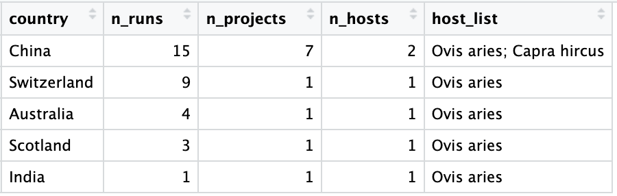**Table 2:** Summary of virus-positive SRA runs, BioProjects, and host species across countries. The table reports the number of runs and distinct BioProjects per country, along with the unique host species observed.

These results were broadly consistent with our initial hypothesis that the virus was not confined to a single geographic region or research group, nor restricted to a single regional lineage. Furthermore, the uneven distribution aligns with known imbalances in global sequencing activity. Countries with intensive livestock genomics programs, notably China and Europe, are over-represented in public databases, and their prominence here likely reflects this sampling structure rather than an underlying ecological gradient [World Population Review, 2025]. Thus, the observations were consistent with a virus that plausibly circulates broadly within global sheep populations, but the current evidence cannot yet separate biological distribution from the geography of available sequencing data.

To complement the country-level summary and assess whether detection exhibited any broad spatial structure, we next visualized the geographical distribution of positive datasets on a world map using the following code, with the results included as the following plot. The `rnaturalearth`, `ggplot2`, `ggrepel` `terra` and `sf` R packages were used [South, 2023; Wickham, 2023; Slowikowski, 2023; Hijmans, 2023; Pebesma, 2023]. Given the dispersed but uneven pattern observed in the tabulated results, we hypothesized that plotting the country centroids would clarify whether viral detection aligned with recognizable bio-geographic or hemispheric trends, or whether they simply mirrored regions with active livestock sequencing programs.

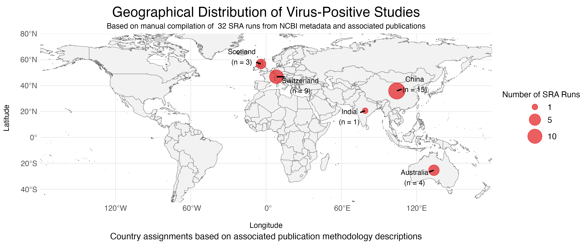**Figure 1:** Geographical distribution of virus-positive studies based on country centroids. Dot sizes are proportional to the number of SRA runs in each country where the virus was reliably detected. Country labels indicate the total number of positive runs per location.

The results largely supported the latter interpretation: detection was concentrated in the Northern Hemisphere, with a single instance in the Southern Hemisphere, and no observations across the Americas. This pattern reinforces the view that the apparent distribution is shaped primarily by where sheep-focused sequencing studies are conducted rather than a strict ecological boundary, a point developed further in the subsequent major section.

Next, we hypothesized that the virus exhibited no meaningful associations with biome or climate. This expectation was based on the observation that positive detection occurred across multiple sheep breeds adapted to distinct environmental conditions, namely the Swiss Alpine and Dorper breeds that thrive in alpine and arid desert regions, respectively [National Sheep Association, 2025]. If supported, this would suggest that environmental factors, ecological conditions, or biome-specific reservoirs are unlikely to drive viral distribution, reinforcing the possibility of host-specificity.

To evaluate potential environmental associations, each country in which the virus was detected was assigned to a broad biome and climate classification using established literature-based environmental categories [NASA, 2025]. This allowed us to assess whether detection clustered within particular ecological zones. The following code was used to generate the following table which visualizes the results.

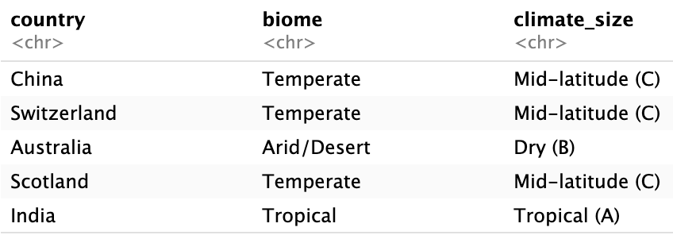**Table 3:** Summary of country, biome, and climate classification for all countries where the virus was reliably detected. Biome and climate assignments were obtained from literature sources.

The results showed that virus-positive observations occurred in temperate, arid/desert, and tropical regions, covering mid-latitude, dry, and tropical climate groups. The distribution showed no clustering within any single biome or climate category, and no pattern indicative of environment-specificity emerged. Given the limited geographic scope of the underlying studies, these findings should be interpreted with moderate confidence; sampling bias and heterogeneous research effort may influence apparent distributions. Nevertheless, the absence of detectable biome- or climate-specificity supports further investigation into host-related factors, such as physiology, breed, specific susceptibility, or husbandry practices—as more plausible determinants of viral presence than environmental conditions.

Overall, our analyses indicate that virus-positive observations are broadly distributed across multiple countries and biomes, with no clear evidence of environmental or climate specificity. Furthermore, given the limited number of countries represented and the influence of research sampling bias, we determined that formal statistical tests of significance were not appropriate at this stage. These findings, instead, highlight the potential importance of host-related factors in shaping viral presence, motivating the subsequent exploration of phylogenetic relationships between sheep and goats to better understand host-specific susceptibility.

### The Phylogeny of Goats and Sheep

Based on the consistent detection of the virus in *Ovis aries* and a single occurrence in *Capra hircus*, we hypothesized that host phylogeny, rather than geography or environment, may better explain the observed viral distribution.

*Ovis aries* (domestic sheep) comprises more than one thousand distinct breeds worldwide and has historically been selected for economically important traits such as meat and wool quality [Schoch et al., 2025]. Similarly, *Capra hircus* (domestic goat), with more than three hundred recognized breeds, represents another major global livestock species [Schoch et al., 2025].

Both species have exceptionally broad geographic ranges, occurring on all contents except Antarctica, largely driven by their propensity towards local adaption and successful domestication. Their local breeds are adapted to diverse agro-climatic conditions, including tropical, arid, temperate, and high-altitude environments [Schoch et al., 2025]. Both species are among the global most common livestock, where the largest sheep populations occur in China, Australia, India, New Zealand, and Iran, whereas the goat populations are most numerous in India and China [National Sheep Association, 2025]. Notably, this wide global distribution overlaps strongly with the countries represented in the viral observation dataset, suggesting that viral detection coincides with regions of high host density, rather than specific environmental niches [Schoch et al., 2025].

Given this context, the presence of the virus in both sheep and goats is consistent with their close evolutionary relationship. Both species belong to the family *Bovidae*, subfamily *Caprinae*, and tribe *Caprini*, differing only at the genus level. Their phylogenetic proximity implies substantial similarity in host biology, immune response, and cellular receptors that may influence susceptibility to shared pathogens [Schoch et al., 2025]. This is supported by documented cross-species infections for multiple parasites and viruses affecting both hosts, including *Haemonchus contortus* (Barber's Pole Worm) and members of the *Capripoxvirus* genus [National Sheep Association, 2025].

To evaluate host phylogeny, the following code was used to generate a Newick-format tree including *Ovis aries*, *Capra hircus*, *Ovibos moschatus,* and *Bos taurus*, provided by the following figure. Visualization of this phylogeny confirmed that *Ovis aries* clusters closely with *capra hircus,* while *Ovibos moschatus* and *Bos taurus* form more distant outgroups. This structured highlights their shared ancestry and provides a biological rationale for similar susceptibility to pathogens, consistent with our observed viral detection. The `ape`, `ggtree`, `ggplot2` and `dplyr` R packages are used [Paradis et al., 2023; Yu et al., 2023; Wickham et al., 2023].

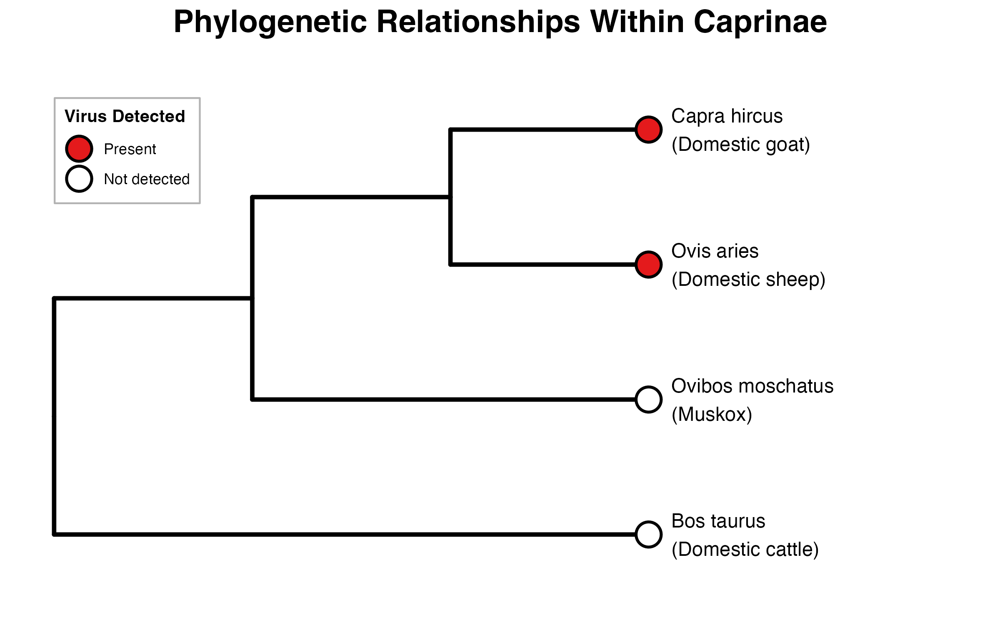**Figure 2:** Phylogenetic tree depicting the evolutionary relationships among *Ovis aries* (domestic sheep), *Capra hircus* (domestic goat), *Ovibos moschatus* (muskox), and *Bos taurus* (domestic cattle) based on standard mammalian taxonomy. Red circles indicate species in which the virus was detected.

While closely related, several key distinctions exist between sheep and goats in their diet, behaviour, and physical traits. Notably, sheep are grazers whereas goats are browser, diverging their diets despite considerable overlap in their geographical distribution. Differences in disease response and manifestation are also reflected in tailored management strategies, such as parasite control [National Sheep Association, 2025].

Given the sparse and uneven distribution of viral observations, formal statistical tests for host specificity were not justified due to low power. Instead, the most informative evidence comes from the biological plausibility of infection in closely related species. Therefore, we hypothesized that the virus exhibits a host-associated signal rather than reflecting environmental contamination: geographical analyses did not reveal significant associations at the country or biome level, viral observations largely overlapped with regions of high sheep density, *Ovis aries* and *Capra hircus* are closely related and documented to share pathogens, and all viral detection was derived from tissue samples rather than fecal or environmental material. Thus, our findings supported a host-driven pattern of viral presence and motivate further investigation into host-specific factors influencing viral prevalence.

Finally, given that both hosts are frequently infected by a wide range of viruses and endoparasites, and that many tissue-derived sequencing studies inadvertently recover viral sequences originating from associated parasites, this ecological context motivates a closer examination of what types of viruses are typically detected in tissue rather than in fecal or environmental samples [National Sheep Association, 2025]. Such knowledge will allow us to distinguish signals arising from the host itself from those originating from parasitic or commensurable organisms present within the tissue.

### Tissue and Host Tropism in Viruses

Building upon the observation that viral detection was consistently derived from tissue samples, we hypothesized that the virus exhibits tissue tropism within its host species. Evaluating tissue specificity would allow us to distinguish whether the viral sequences originated from the host itself or from associated parasites.

All virus-positive observations were found in tissue-derived sequencing runs, including heart and multiple skeletal muscle types. No signal was detected in fecal, environmental, or gut-content datasets. Given the prevalence of transcriptomic studies in sheep, driven by their economic value and use as a model organism, these tissue-specific patterns support a strong association between the virus and host-derived tissue. Furthermore, both sheep and goats are frequently infected by a wide variety of viruses and endoparasites, and many tissue-derived sequencing studies inadvertently recover viral sequences originating from associated parasites. While this does not allow direct inference of infection or transmission routes, it indicates that the signal consistently arises from tissue samples rather than studies targeting enteric or environmental viromes.

To formally assess tissue association, we performed a Fisher's Exact Test comparing the presence of viral sequences in muscle versus non-muscle tissues [Fisher, 1922]. This test was chosen due to the categorical nature of the data and the small number of positive observations, which results in sparse contingency tables. This analysis would allow us to quantify if viral detection is significantly enriched in certain tissues, providing statistical support for the observed pattern of tissue specificity.

We initially attempted to use the `rentrez` package to computationally query all SRA runs in *Ovis aries* and *Capra hircus*, but due to the large number of runs available in the database, the `rentrez_search` function timed out. Using the NCBI Run Selector browser, 101742 runs were manually confirmed to be available [Winter, 2023].

Consequently, the NCBI Run Selector browser was used to manually extract the run data using the advanced search term `organism:"Ovis aries"[Organism] OR "Capra hircus"[Organism]` and provided as `data/sra_run_table.csv` [NCBI SRA, 2025]. The following code was used to clean the dataset by filtering to include only RNA-seq studies with reported source or tissue information. Duplicate BioSamples and runs lacking relevant metadata were removed, and tissue descriptors were harmonized into a single `sample_source` column. Muscle tissue was defined to include skeletal and cardiac sources using a pattern matching approach (`skeletal|muscle|infraspinatus|biceps|longissimus|heart|myocard`). After cleaning, the dataset included 18,376 unique SRA runs and BioSamples, 961 unique BioProjects, and 1,505 unique tissue sources. Of the 31 virus-positive runs (omitting one run associated with the same BioSample), only 23 had annotated tissue information and were included in the Fisher’s Exact Test analysis.

Next, the following code was used to generate a contingency table upon which the Fisher's Exact Test was performed. The results are included in the following table, which indicate a highly significant enrichment of viral sequences in muscle tissue compared with non-muscle tissues (p \< 2.2e-16, odds ratio = Inf, 95% CI: 32.75 – Inf). This result reflects that all virus-positive reads were observed exclusively in muscle-derived samples, whereas no positive reads were detected in other tissue types. While the odds ratio is formally infinite due to the absence of positives in non-muscle tissues, this should be interpreted cautiously, as the total number of virus-positive observations is small (31 reads). Nevertheless, the test provides strong statistical support for the observed pattern of tissue restriction, reinforcing the hypothesis that the virus is associated with host-derived tissue rather than arising from environmental or fecal sources.

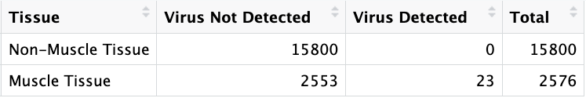**Table 4:** Contingency table showing the presence of the virus in muscle versus non-muscle tissues across all RNA-seq SRA runs of *Ovis aries* and *Capra hircus* with available tissue metadata. Entries lacking relevant information were omitted; 23 of 31 virus-positive runs had annotated tissue sources.

Tissue-restricted viral sequences can arise from multiple biological contexts. Viral nucleic acids may be present in muscle or cardiac tissue due to systemic circulation, localized infection, or persistence within specific cell types. Alternatively, tissue-associated viral sequences can originate from endoparasites residing within sampled tissue. Metagenomic and transcriptomic studies often detect nested infection signals, where a virus infects a parasite present in the host tissue. Although technical contamination can occasionally produce low-level signals, the repeated observation of the viral palmprint across multiple independent BioProjects and tissue types argues against isolated contamination as the sole explanation.

Overall, the statistically significant viral association with muscle tissue combined with the absence of corresponding fecal or environmental signals and the known biology of host-associated parasites, supports the hypothesis that the virus is associated with host tissue rather than environmental contamination. This finding motivates a more detailed investigation into the viral taxonomic identity and its potential host-specific interactions.

### Motivating Molecular Characterization

Our ecological analysis of available metadata from NCBI revealed several consistent features that frame our key hypotheses regarding the virus. First, detection was strongly concentrated in *Ovis aries* and, to a lesser extent, *Capra hircus*, suggesting a potential host-specific signal. Second, across eleven BioProjects spanning multiple countries, breeds, and experimental designs, the viral sequence was recovered exclusively from muscle- and heart-derived transcriptomes, consistent with tissue tropism. Third, although detected across multiple regions, the virus did not appear restricted to any single country or biome, motivating evaluation of host specificity relative to environmental or geographic factors. Collectively, these patterns define the central ecological questions: whether the virus exhibits tissue restriction, host specificity, or a geographically structured distribution.

These observations collectively raise several molecular hypotheses that cannot be resolved through ecological context alone. One possibility is that the sequence represents a virus directly infecting sheep or goats, consistent with its recurrent presence in tissue. An alternative hypothesis is that the signal originates from an endoparasite residing within muscle tissue, given the known capacity of tissue-derived transcriptomes to capture nested infection signals. A final possibility is that the sequence reflects a recurrent laboratory or reagent-associated contaminant shared across projects. Distinguishing among these possibilities requires direct molecular interrogation.

Therefore, to further evaluate these key hypotheses and formalize our understanding of the virus, we conducted preliminary molecular characterization of the viral palmprint. By examining its genomic organization and phylogenetic placement, we aimed to determine whether the sequence corresponds to a known viral lineage, a parasite-associated virus, or an unrecognized agent relative to available annotated databases.

### Preliminary Characterization of the Viral Palmprint

We first examined the virus' molecular signature using the viral RdRp sequence, specifically the palmprint motif from the index run. Palmprints are highly conserved catalytic subdomains of RdRps, designed to provide sensitive taxonomic anchors while being relatively short (104 amino acids) [Edgar et al., 2022]. While this makes them more computationally efficient to work with and is sufficient for some analyses, their length limits their resolution for full protein or genome-level classification.

The Serratus palmID browser tool was used to compare the palmprint against palmDB [Edgar et al., 2022]. The analysis identified a high-confidence palmprint which showed 99% amino-acid identity to a motif annotated as *Eimeria stiedai RNA virus 1* of family *Totiviridae* and phylum *Duplornaviricota*. This motif was observed in several public SRA libraries, including several *Ovis aries* datasets [NCBI SRA, 2025]. Across all matches, amino-acid identities ranged broadly from 48% to 60%, indicating that while the top hit is highly similar, most related sequences are more divergent

These observations suggest that the contig contains an RdRp-like motif related to totivirus-like sequences. However, because the palmprint is short and represents only a catalytic subdomain, full RdRp sequence and genome assembly are required for confident taxonomic placement and evaluation of host association. Notably, the closest known relatives of the motif infect coccidian parasites (genus *Eimeria*), which raises questions about potential host range or sample context, but this cannot be resolved without further genome-level data.

To corroborate the palmprint findings, we performed Protein BLAST (BLASTp) of the motif against the NCBI non-redundant (nr) protein database, the standard resource for viral polymerase comparison [NCBI BLASTP, 2025]. The BLAST results were consistent with the Serratus analysis: the motif showed 99% identity to the top hit, *Eimeria stiedai RNA virus 1*, further supporting that the contig contains a totivirus-like polymerase motif.

A total of 115 hits were identified, all within the realm of Riboviria. Percent identities were tightly clustered between 50-60%, with the top hits showing approximately 99% dientity and very low E-values (\< 2e-18), confirming the motif's strong similarity to known viral RdRp sequences. The highest-scoring group consisted of three hits annotated as *Eimeria stiedai RNA virus 1*, while the largest group of 14 hits comprised of unclassified Totiviridae sp. The remaining matches appeared only once or twice. These results indicate that the palmprint is highly conserved mong certain totivirus-like sequences, but that most related sequences are moderately divergent across Riboviria. Given the short length of the motif, we did not interpret overall evolutionary relationships or make any high-confidence taxonomic claims at this stage.

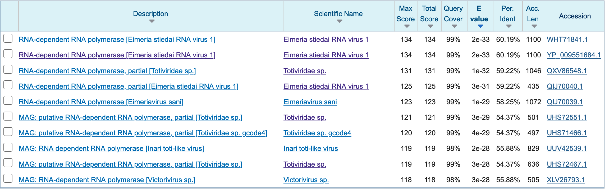**Figure 3:** Top 10 Protein BLAST results of the index run palmprint against the NCBI non-redundant (nr) protein database.

The palmprint provided strong evidence for a totivirus-like RdRp motif and highlighted its relation to *Eimeria stiedai RNA virus 1*. However, the short motif length and the moderate divergence among most matches prevent confident assignment of taxonomy, host, or novelty. To make more robust conclusions regarding these findings, we next proceeded to a more in-depth molecular investigation of the virus.

### Virus Genome

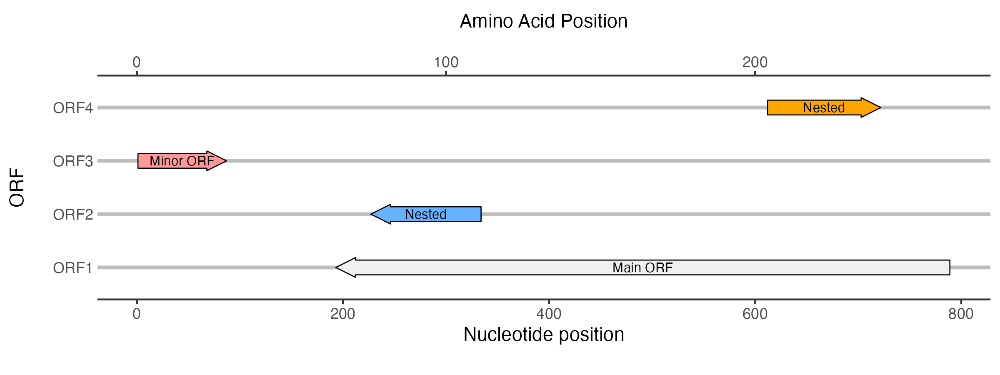**Figure 8:** Linear genome map of the highest-coverage viral contig illustrating four ORFs and candidate frameshifting sites. The plot was generated using the gggenes R package. ORF1 (Main ORF) spans the longest region and contains the incomplete RdRp fragment, representing the primary coding sequence. ORF2 and ORF4 are nested within ORF1; ORF2 overlaps a candidate slippery sequence, suggesting a potential programmed ribosomal frameshifting site. ORF3 (Minor ORF) lacks BLAST hits or association with frameshifting motifs, consistent with a non-functional fragment. Partial start and stop codons in ORF1, ORF2, and ORF4 indicate that this contig represents a fragmentary genome. Nucleotide positions are shown on the primary x-axis, with corresponding amino acid positions indicated on the secondary axis. Colors denote ORF identity: gray for the main ORF, blue and orange for nested ORFs, and red for the minor ORF. This figure integrates sequence annotation and frameshifting analysis to visualize the key genomic architecture of this partial viral genome.

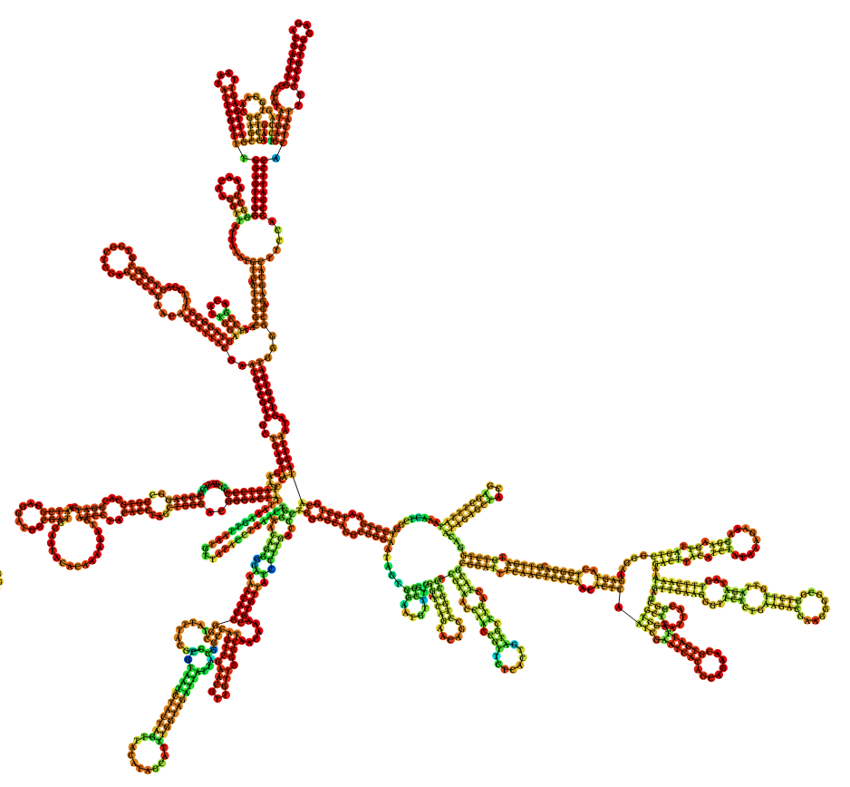**Figure 9:** Predicted RNA secondary structure of the partial viral contig. The structure was modeled using the RNAfold Webserver (ViennaRNA Package 2.0) to visualize potential stems, loops, and other base-paired regions that could influence translation, stability, or frameshifting. The predicted folding does not fully recapitulate the canonical dsRNA Totiviridae genome organization, which typically exhibits more extensive base-paired regions and stable stem-loop motifs. This likely reflects the fragmentary nature of the contig rather than fundamental differences in viral genome architecture. The figure highlights local structural features, including potential stem-loop motifs and single-stranded regions, providing insights into the secondary structure context of the partial RdRp-containing ORF.

![**Figure 11:** Predicted three-dimensional structure of ORF1 using AlphaFold. The truncated amino acid sequence of ORF1, containing the probable RdRp fragment, was modeled with AlphaFold. The N-terminal region is poorly resolved, reflecting missing upstream residues, whereas the remainder of the structure—including the conserved C-terminal GDD motif—is predicted with high confidence. This pattern indicates that the catalytic fold characteristic of viral RdRps is preserved in the partial sequence, supporting functional annotation of this ORF as a truncated RdRp fragment. Confidence scores (pLDDT) are represented by the standard AlphaFold coloring scheme, with higher confidence in the C-terminal region.](img/ovismusculus_totivirae/orf_structure.png)

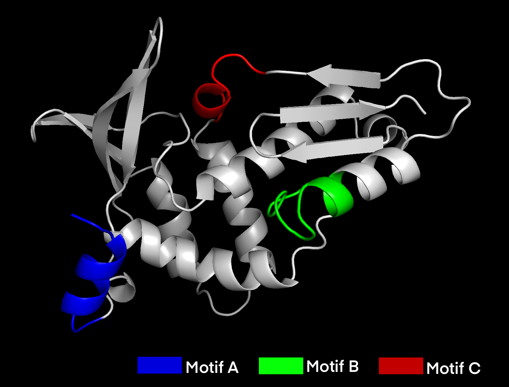**Figure 13:** Identification and structural validation of RdRp palmprint motifs in ORF1. The highest-coverage contig was analyzed using the palmID tool from the Serratus pipeline to identify conserved RdRp palmprint motifs. PalmID detected Motif A (amino acids 1–12), Motif B (64–77), and Motif C (97–104) with high confidence (score = 67.7), indicating preservation of the canonical RdRp catalytic core despite sequence truncation. The predicted AlphaFold structure was subsequently visualized in PyMOL, confirming spatial clustering of the three motifs within the catalytic region and supporting the structural integrity of the RdRp fragment.

### Identifying Open Reading Frames and Assessing Quality

To characterize the viral genome, we first focused on identifying open reading frames (ORFs) within the contigs derived from the SRA runs in which the virus was reliably detected. Identifying ORFs allows us to pinpoint putative protein-coding regions and infer functional elements of the genome, such as conserved enzymatic domains or polymerases, which are critical for viral replication.

Contigs were prioritized based on coverage, under the hypothesis that higher-coverage contigs would provide a more complete representation of the genome and increase the likelihood of detecting conserved regions, such as RdRp fragments. The top three contigs were analyzed to assess genome completeness and to determine whether recurrent ORFs could be consistently identified across independent contigs, providing additional confidence in their biological relevance.

The NCBI ORF Finder browser tool was used to predicct ORFs for the three highest-coverage contigs with parameters restricting start codons to `ATG` and excluding nested ORFs [NCBI ORFfinder, 2025]. Each ORF was subsequently evaluated using BLAST against the non-redundant protein database to determine potential homology and functional annotation.

The contig with the highest coverage (SRR3399761; length 790 nt; 7.8x coverage) contained two predicted ORFs: a large ORF1 on the positive strand (start 193, stop \> 798, length 597 nt) and a smaller ORF2 on the negative strand (start 87, stop \>1, length 87 nt). BLAST analysis of ORF1 revealed significant hits to probable RNA-directed RNA polymerases: one from *Leishmania RNA virus 1* (E = 4e-46) of the *Pseudototiviridae* family, and another from *Helminthosporium victoriae virus 190S* (E = 5e-44) from the *Totiviridae* family. In contrast, ORF2 produced no significant hits, suggesting it likely represents noise or a non-coding fragment.

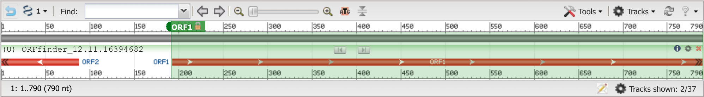**Figure 4:** Identification and structural validation of RdRp palmprint motifs in ORF1. The highest-coverage contig was analyzed using the palmID tool from the Serratus pipeline to identify conserved RdRp palmprint motifs. PalmID detected Motif A (amino acids 1–12), Motif B (64–77), and Motif C (97–104) with high confidence (score = 67.7), indicating preservation of the canonical RdRp catalytic core despite sequence truncation. The predicted AlphaFold structure was subsequently visualized in PyMOL, confirming spatial clustering of the three motifs within the catalytic region and supporting the structural integrity of the RdRp fragment.

The second highest coverage contig (SRR3399780; length 603 nt; 6.2x coverage) also contained two ORFs: ORF1 ( + strand, start 517, stop \> 603, 87 nt) and ORF2 (- strand, start 411, stop \>1, 411 nt). Here, the BLAST results of ORF2 again produced the same RdRp hits observed in the top contig, whereas ORF1 showed no significant alignment, consistent with the interpretation that shorter ORFs may present partial fragments or assembly artifacts.

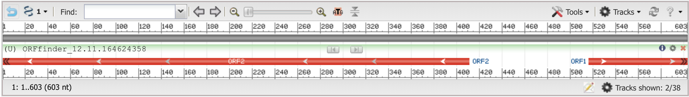**Figure 5:** NCBI ORFfinder ('ATG' only start codon, nested ORFs removed) results of the second highest coverage contig (SRR3399780, length 603, coverage 6.2x). Two ORFs were found: ORF1 (+ strand, start 517, stop \>603, length 87), ORF2 (- strand, start 411, stop \> 1, length 411).

Finally, the third highest coverage contig (SRR3399757; length 578 nt; 5.9× coverage) contained two ORFs, longer than those in the previous contigs and overlapping by approximately 80 nucleotides. BLAST analysis confirmed ORF2 as homologous to the same RdRp sequences (*Helminthosporium victoriae virus 190S*, E = 8e-27; *Leishmania RNA virus 1*, E = 2e-26), while ORF1 did not produce significant hits.

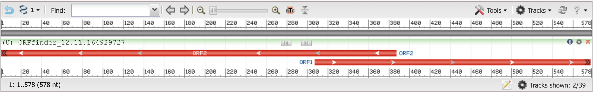**Figure 6:** NCBI ORFfinder ('ATG' only start codon, nested ORFs removed) results of the third highest coverage contig (SRR3399757, length 578, coverage 5.9x). Two ORFs were found: ORF1 (+ strand, start 308, stop \>577, length 270), ORF2 (- strand, start 387, stop \> 1, length 387).

Across these three contigs, a consistent pattern emerged: a single ORF corresponding to the RdRp was repeatedly recovered, while additional ORFs varied in length and alignment quality. None of the predicted ORFs were coding sequence (CDS) complete, supporting the hypothesis that the contigs represent partial genome fragments. Based on these results, we focused subsequent analyses on the highest-coverage contig (SRR3399761) to investigate the RdRp fragment and potential nested ORFs in greater detail.

### Identifying Possible Programmed Ribosomal Frameshifting

Building on the focus of the highest coverage contig, we next sought to explore whether the virus may utilize programmed ribosomal frameshifting (PRF) to express overlapping proteins. This analysis was motivated by the observation that *Totiviridae* and other dsRNA viruses often generate multiple proteins from a single RNA segment via frameshifting, which allows translation of nested ORFs without increasing genome length [Li et al., 2011]. Considering that ORF1 contains the RdRp fragment, investigating potential frameshifting could provide insight into how additional, otherwise cryptic proteins might be expressed.

Based on this rationale, we hypothesized that the virus employs PRF to translate nested ORFs within ORF1. To test this, ORF Finder was rerun on the highest-coverage contig using only ATG start codons, while retaining nested ORFs to examine all six reading frames. In addition to the previously identified ORF1 and ORF3 (ORF2 in prior nomenclature), this analysis revealed two additional ORFs, ORF2 and ORF4, nested entirely within ORF1.

Notably, ORF1, ORF2, and ORF4 occupy distinct reading frames and overlap across approximately 100 nucleotides, a pattern consistent with canonical −1 PRF sites. Manual inspection of ORF1 identified a seven-nucleotide candidate slippery sequence, `AAAAAAT`, at positions 221–227, which overlaps ORF2 and matches the X_XXY_YYZ motif characteristic of −1 frameshifting [Brierley et al., 1992]. BLAST searches of the nested ORFs returned no significant hits, suggesting these sequences may either encode accessory proteins or require frameshifting for expression.

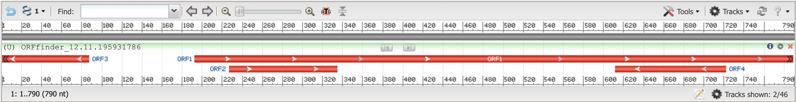**Figure 7:** NCBI ORFfinder ('ATG' only start codon) results of the highest coverage contig (SRR3399761, length 790, coverage 7.8x). Four ORFs were found: ORF1 (+ strand, start 193, stop \>798, length 597), ORF2 (+ strand, start 227, stop 334, length 108), ORF3 (- strand, start 87, end \>1, length 97), and ORF4 (- strand, start 722, end 612, length 111).

These observations support the possibility that the virus utilizes PRF to translate overlapping ORFs, potentially enabling expression of ORF2 or ORF4 from the same transcript as ORF1. However, this remains a bioinformatic prediction and requires experimental validation. Consistent with Totiviridae biology, ORF1 containing the RdRp fragment is likely the primary functional product, with nested ORFs representing potential frameshift-dependent or accessory products.

Given the likely partial nature of the contig and the role of 3′ genomic features in RNA virus biology, we next examined the sequence for evidence of polyadenylation, which could indicate RNA stability signals or transcriptional processing relevant to viral gene expression.

### Identifying Poly-A Tails

We next examined the contig for evidence of a polyadenylated (poly-A) tail, which could indicate RNA stability or transcriptional processing signals. Based on the biology of double-stranded RNA viruses such as *Totiviridae*, we hypothesized that no poly-A tail would be present [Li et al., 2011].

To test this, we manually inspected the nucleotide sequence of the highest-coverage contig (SRR3399761) and the top five contigs from the dataset for extended stretches of adenine residues. No significant A-rich regions were observed in any contig, supporting the hypothesis that this virus lacks a poly-A tail and suggesting that RNA stability and processing occur independently of polyadenylation.

Having characterized the ORFs, potential frameshifting regions, and the absence of poly-A tails, we next sought to integrate these findings into a visual representation of the viral genome. Mapping the partial genome allows us to contextualize the location and overlap of ORFs, highlight conserved motifs, and provide a clear overview of the contig’s coding potential for downstream analysis.

### Mapping of the Partial Genome

To integrate the ORF and the frameshifting analyses into a cohesive view of the viral genome, we mapped the partial genome of the highest-coverage contig. We focused on the four ORFs described previously (Table 4), hypothesizing that ORF1 represents the canonical viral protein and primary ORF, while the nested ORFs (ORF2 and ORF4) are potential programmed ribosomal frameshift sites. The shortest ORF (ORF3) is likely noise, as it lacks significant BLAST hits or association with known frameshifting motifs.

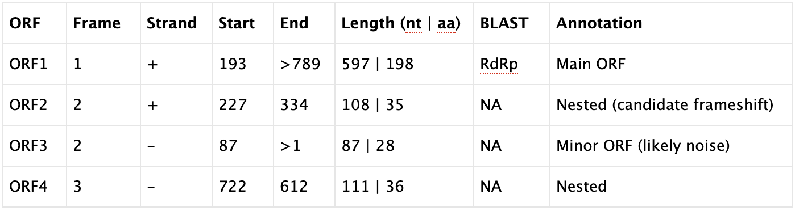**Table 4:** Summary of all ORFs, including nested, found in the highest coverage contig (SRR3399761, length 790, coverage 7.8x).

We used the `gggenes` package in R to generate a linear genome plot of these ORFs [Davidson et al., 2023]. The main ORF spans the longest region and contains the RdRp fragment, while ORF2 and ORF4 are nested within ORF1. Notably, ORF2 overlaps with the candidate slippery sequence, supporting its potential role in frameshifting. ORF3 shows no association with any frameshifting motifs or BLAST hits, reinforcing the interpretation that it likely represents a minor, non-functional fragment. Partial start and stop codons observed in the main and minor ORFs further support that this contig represents a fragmentary genome, with the RdRp sequence being incomplete.

**Figure 8:** Linear genome map of the highest-coverage viral contig illustrating four ORFs and candidate frameshifting sites. The plot was generated using the gggenes R package. ORF1 (Main ORF) spans the longest region and contains the incomplete RdRp fragment, representing the primary coding sequence. ORF2 and ORF4 are nested within ORF1; ORF2 overlaps a candidate slippery sequence, suggesting a potential programmed ribosomal frameshifting site. ORF3 (Minor ORF) lacks BLAST hits or association with frameshifting motifs, consistent with a non-functional fragment. Partial start and stop codons in ORF1, ORF2, and ORF4 indicate that this contig represents a fragmentary genome. Nucleotide positions are shown on the primary x-axis, with corresponding amino acid positions indicated on the secondary axis. Colors denote ORF identity: gray for the main ORF, blue and orange for nested ORFs, and red for the minor ORF. This figure integrates sequence annotation and frameshifting analysis to visualize the key genomic architecture of this partial viral genome.

Following genome mapping, we visualized the RNA secondary structure of the contig using the RNAfold Webserver to assess potential structural features that may influence translation, stability, or frameshifting [Lorenz et al., 2011].

We observed that the predicted structure does not fully resemble the canonical dsRNA *Totiviridae* genome organization, which typically exhibits more extensive base-paired regions and stable stem-loop structures. However, we hypothesized that this deviation likely reflects the partial nature of the contig rather than a fundamental difference in viral genome architecture, underscoring that the current analysis represents only a fragment of the complete viral genome.

![**Figure 9:** Predicted RNA secondary structure of the partial viral contig. The structure was modeled using the RNAfold Webserver (ViennaRNA Package 2.0) to visualize potential stems, loops, and other base-paired regions that could influence translation, stability, or frameshifting. The predicted folding does not fully recapitulate the canonical dsRNA Totiviridae genome organization, which typically exhibits more extensive base-paired regions and stable stem-loop motifs. This likely reflects the fragmentary nature of the contig rather than fundamental differences in viral genome architecture. The figure highlights local structural features, including potential stem-loop motifs and single-stranded regions, providing insights into the secondary structure context of the partial RdRp-containing ORF.](img/ovismusculus_totivirae/rna_structure.png){width="393"}

With the genome mapped and the RdRp-containing ORF identified, we next sought to investigate the structural characteristics of the encoded proteins. Predicting protein folds using AlphaFold allows us to evaluate whether the partial RdRp fragment retains key structural features, and to visualize potential domains or motifs that may be functionally relevant, providing deeper insight into the molecular biology of this virus.

### Investigation into the Main ORF

To analyze the protein structure and identify conserved domains or motifs, we focused on ORF1, which contains the probable RdRp. The nested and minor ORFs were not analyzed due to their short length, which would produce unreliable structural predictions. Although ORF1 represents only a C-terminal fragment as it has a partial stop, we hypothesized that it would retain the conserved catalytic fold typical of viral RdRps, consistent with the BLAST results described previously.

We first used HMMER with default parameters against Pfam to detect conserved domain sequences in the ORF's truncated amino acid sequence [Potter et al., 2018]. The top five matches are included below, where the top hit corresponding to *Eimeria stiedai RNA virus 1*, providing independent confirmation that this fragment contains a canonical RdRp domain.

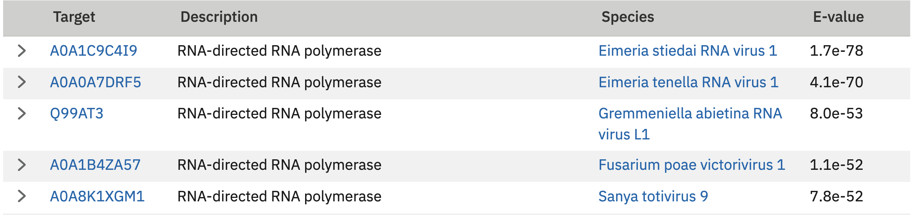**Figure 10:** Conserved domain analysis of ORF1 using HMMER against the Pfam database. The truncated amino acid sequence of ORF1, containing the probable RdRp fragment, was analyzed with HMMER using default parameters to detect conserved protein domains. Only ORF1 was analyzed, as the nested and minor ORFs are too short to produce reliable predictions. The top five domain hits are shown, with the highest-scoring match corresponding to Eimeria stiedai RNA virus 1, confirming the presence of a canonical RdRp catalytic fold in this partial sequence. This analysis supports functional annotation of the partial ORF and is consistent with previous BLAST-based homology results.

### Identifying Conserved Motifs

Next, we used AlphaFold to predict the three-dimensional structure of ORF1 [Jumper et al., 2021]. The N-terminal region of the fragment was poorly resolved, consistent with missing upstream residues, whereas the remainder of the ORF, including the C-terminal GDD motif, was predicted with high confidence. This pattern supports the interpretation that ORF1 represents a truncated RdRp segment: the conserved catalytic fold is maintained, while the low-confidence N-terminal region reflects the absent upstream sequence.

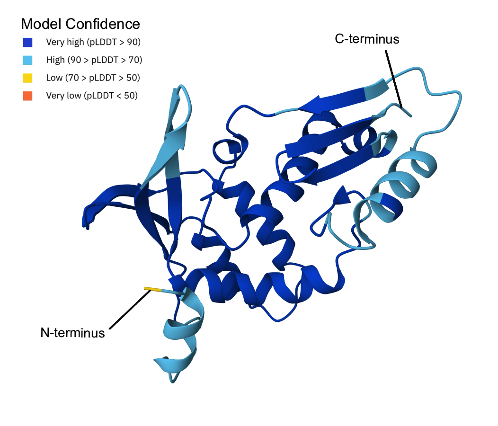**Figure 11:** Predicted three-dimensional structure of ORF1 using AlphaFold. The truncated amino acid sequence of ORF1, containing the probable RdRp fragment, was modeled with AlphaFold. The N-terminal region is poorly resolved, reflecting missing upstream residues, whereas the remainder of the structure—including the conserved C-terminal GDD motif—is predicted with high confidence. This pattern indicates that the catalytic fold characteristic of viral RdRps is preserved in the partial sequence, supporting functional annotation of this ORF as a truncated RdRp fragment. Confidence scores (pLDDT) are represented by the standard AlphaFold coloring scheme, with higher confidence in the C-terminal region.

We then used InterProScan to confirm the annotation: ORF1 belongs to RdRP family 4, with the domain annotated as DNA/RNA polymerases [Jones et al., 2014]. The RDRP_SSRNA_POS region spans amino acids 90–199, a fold shared by positive-sense single-stranded RNA viruses and dsRNA viruses such as Totiviridae. Manual inspection of the conserved motif region revealed only Motif C (positions 186–188, GDD) at the C-terminus, consistent with ORF1 representing a truncated fragment.

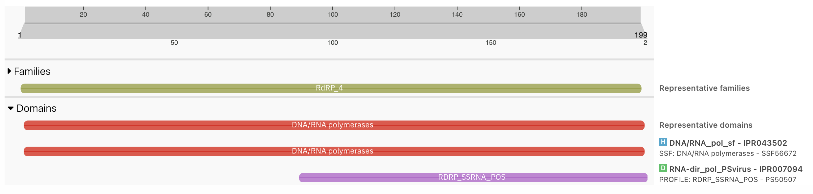**Figure 12:** InterProScan results for ORF1. The figure shows the conserved domain annotation of the truncated RdRp-containing ORF1. InterProScan identifies the ORF as belonging to RdRP family 4, with the DNA/RNA polymerase domain (RDRP_SSRNA_POS, amino acids 90–199) highlighted. Only Motif C (positions 186–188, GDD) is detected at the C-terminus, consistent with a partial sequence. These results support functional annotation of ORF1 as a truncated RdRp fragment.

To further investigate the RdRp motifs, the palmID tool from Serratus was used on the highest coverage contig sequence to identify the three motifs, including the partially detectable upstream Motifs A and B [Edgar et al., 2022]. The results reported Motif A (positions 1-12), Motif B (64-77), and Motif C (97-104) with high-confidence (67.7), reinforcing that ORF1 retains the conserved catalytic core typical of viral RdRps.

Finally, we visualized the predicted structure from AlphaFold in PyMol, confirming the presence of the three motifs and supporting the structural integrity of the catalytic region despite the truncation [Schrödinger et al., 2025].

**Figure 13:** Identification and structural validation of RdRp palmprint motifs in ORF1. The highest-coverage contig was analyzed using the palmID tool from the Serratus pipeline to identify conserved RdRp palmprint motifs. PalmID detected Motif A (amino acids 1–12), Motif B (64–77), and Motif C (97–104) with high confidence (score = 67.7), indicating preservation of the canonical RdRp catalytic core despite sequence truncation. The predicted AlphaFold structure was subsequently visualized in PyMOL, confirming spatial clustering of the three motifs within the catalytic region and supporting the structural integrity of the RdRp fragment.

### Evaluating GC Content

To complement ORF annotation and structural predictions, we analyzed the nucleotide composition of the contig using a sliding-window approach. The motivation for this analysis is that local variations in GC content can reveal regions of structural or functional significance, such as conserved domains, regulatory elements, or areas of potential instability, which are not evident from sequence alignment or ORF mapping alone.

The following code was used to compute GC content using a 50-nucleotide sliding window across the highest coverage config. The results revealed pronounced heterogeneity along the genome: a GC-rich peak (\~60%) from nucleotides 40–170, followed by a moderate dip (\~40%) at positions 200–300, another GC-rich region (\~55%) at 350–500, a sharp AT-rich trough (\~20%) at 550, and a return to baseline (\~50%) toward the 3’ end.

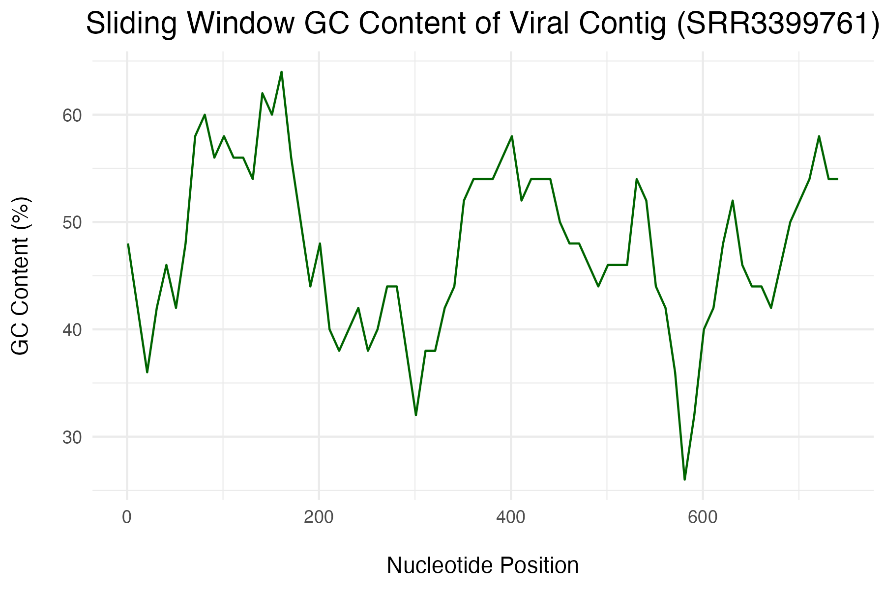**Figure 14:** Sliding-window GC content analysis of the highest-coverage viral contig. GC content was calculated across the contig using a 50-nucleotide sliding window with a 10-nucleotide step and visualized as a continuous profile. The plot reveals pronounced compositional heterogeneity, including GC-rich regions (\~55–60%), AT-rich troughs (\~20–40%), and a return to baseline GC content toward the 3′ end. These fluctuations highlight localized nucleotide composition differences that may reflect underlying structural or functional features not evident from ORF annotation alone, such as regions of increased RNA stability, conserved functional elements, or flexible segments within the partial viral genome.

These fluctuations provide additional insight into the genome organization. The GC-rich regions likely correspond to structurally stable or conserved segments, potentially associated with RdRp domains or other functional motifs, while the AT-rich trough may indicate flexible or looped regions in the RNA secondary structure. This analysis complements the ORF and motif mapping by highlighting compositional and structural patterns that could influence genome function, replication, or regulation, and would not be apparent from sequence similarity or structural predictions alone.

## Discussion

Characterization of this virus revealed strong host- and tissue-specificity, detected exclusively in *Ovis aries* and a single *Capra hircus* individual, and only in muscle-derived transcriptomes. Positive detection spanned five countries and multiple breeds, with no apparent associations with specific biomes or climate conditions. Molecular analysis further indicates that the virus likely infects a parasite rather than the host itself, with phylogenetic and palmprint evidence showing high similarity to *Eimeria stiedai* RNA virus 1, suggesting it represents a strain of Eimeria.

Collectively, these findings describe a previously unrecognized host-associated agent, demonstrating that even well-studied viral families can exhibit unexpected genome architectures, tissue restriction, and host-parasite interactions, expanding our understanding of parasite-associated viruses in livestock systems.

## References

1.  Arora R, S NK, S S, Fairoze MN, Kaur M, Sharma A, et al. Transcriptome profiling of longissimus thoracis muscles identifies highly connected differentially expressed genes in meat type sheep of India. *PLoS ONE*. 2019;14(6):e0217461. <doi:10.1371/journal.pone.0217461>.
2.  Bao G, Li S, Zhao F, Wang J, Liu X, Hu J, et al. Characterization of the circRNA–miRNA–mRNA network to reveal potential functional ceRNAs associated with dynamic changes in the meat quality of the longissimus thoracis muscle in Tibetan sheep at different growth stages. *Front Vet Sci.* 2022;9:803758. <doi:10.3389/fvets.2022.803758>.
3.  Bentley DR, Balasubramanian S, Swerdlow HP, et al. Accurate whole human genome sequencing using reversible terminator chemistry. Nature. 2008;456(7218):53-9. <doi:10.1038/nature07517>
4.  Brierley I, Jenner AJ, Inglis SC. Mutational analysis of the “slippery‑sequence” component of a coronavirus ribosomal frameshifting signal. *J Mol Biol*. 1992;227(2):463–479. [doi:10.1016/0022‑2836(92)90901‑U](doi:10.1016/0022‑2836(92)90901‑U){.uri}.
5.  Clark EL, Bush SJ, McCulloch MEB, Farquhar IL, Young R, Lefevre L, et al. A high resolution atlas of gene expression in the domestic sheep (Ovis aries). *PLoS Genet*. 2017;13(9):e1006997.
6.  Cui R, Kang X, Liu Y, Liu X, Chan S, Wang Y, et al. Integrated analysis of the whole transcriptome of skeletal muscle reveals the ceRNA regulatory network related to the formation of muscle fibers in Tan sheep. Front Genet. 2022;13:991606. <doi:10.3389/fgene.2022.991606>.
7.  Davidson M, Lee B. gggenes: Draw gene arrow maps in ‘ggplot2’. R package version 0.4.2. 2023. Available from: <https://cran.r-project.org/package=gggenes>.
8.  Edgar RC, Taylor J, Lin V, Altman T, Barbera P, Meleshko D, et al. Petabase‑scale sequence alignment catalyses viral discovery. *Nature*. 2022;602(7895):142–147. <doi:10.1038/s41586‑021‑04332‑2>.
9.  Fisher RA. “On the interpretation of χ² from contingency tables, and the calculation of P.” *J R Stat Soc* Series A. 1922;85(1):87–94. <doi:10.2307/2340521>.
10. Flück M, Ross S, Möhl CB, Valdivieso P, Benn MC, von Rechenberg B, Laczko E, Hu J, Wieser K, Meyer DC, Gerber C. Genomic and lipidomic actions of nandrolone on detached rotator cuff muscle in sheep. J. Steroid BIochem. Mol. Biol. 2017;165(B):382-395.
11. Han H, Wang X, Li W, Liu J, Fan Y, Zhang H, et al. Identification and characterization of lncRNAs expression profile related to goat skeletal muscle at different development stages. *Animals*. 2022;12(19):2683. <doi:10.3390/ani12192683>.
12. Hijmans RJ. terra: Spatial data analysis. R package version 1.7-40. 2023. Available from: <https://cran.r-project.org/package=terra>
13. Jiang Y, Chen W, Talbot R, et al. The sheep genome illuminates biology of the rumen and lipid metabolism. Science. 2014;344:1168–73. <doi:10.1126/science.1252806>.
14. Jin L, Tang Q, Hu S, et al. A pig BodyMap transcriptome reveals diverse tissue physiologies and evolutionary dynamics of transcription. Nat Commun. 2021;12:3715. <doi:10.1038/s41467-021-23560-8>.
15. Jones P, Binns D, Chang HY, Fraser M, Li W, McAnulla C, et al. InterProScan 5: genome‑scale protein function classification. *Bioinformatics.* 2014;30(9):1236‑40. <doi:10.1093/bioinformatics/btu031>. <PMID:24451626>.
16. Jumper J, Evans R, Pritzel A, Green T, Figurnov M, Ronneberger O, et al. Highly accurate protein structure prediction with AlphaFold. *Nature.* 2021;596(7873):583–9. <doi:10.1038/s41586‑021‑03819‑2>.
17. Li H, Havens WM, Nibert ML, Ghabrial SA. RNA sequence determinants of a coupled termination‑reinitiation strategy for downstream open reading frame translation in Helminthosporium victoriae virus 190S and other victoriviruses (Family Totiviridae). *J Virol*. 2011;85(14):7343–7352. <doi:10.1128/JVI.00364‑11>.
18. Lorenz R, Bernhart SH, Höner Zu Siederdissen C, Tafer H, Flamm C, Stadler PF, Hofacker IL. RNAfold Web Server. ViennaRNA Package 2.0 [Internet]. Vienna: University of Vienna; 2011 [cited 2025 Dec 12]. Available from: <https://www.tbi.univie.ac.at/RNA/>.
19. Ma L, Li Z, Cai Y, Xu H, Yang R, Lan X, et al. Genetic variants in fat‑ and short‑tailed sheep from high‑throughput RNA‑sequencing data. *Anim Genet*. 2018;49(5):483–487. <doi:10.1111/age.12699>.
20. National Sheep Association. Sheep Breeds. National Sheep Association; 2025 [cited 2025 Dec 12]. Available from: [https://nationalsheep.org.uk/for-the-public/culture/sheep-breeds/](https://nationalsheep.org.uk/for-the-public/culture/sheep-breeds/?utm_source=chatgpt.com)**.**
21. National Center for Biotechnology Information (NCBI). Protein BLAST (BLASTP) [Internet]. Bethesda (MD): National Library of Medicine (US); 2025 [cited 2025 Dec 12]. Available from: <https://blast.ncbi.nlm.nih.gov/Blast.cgi?PAGE=Proteins>.
22. National Center for Biotechnology Information (NCBI). ORFfinder [Internet]. Bethesda (MD): National Library of Medicine (US), National Center for Biotechnology Information; 2025 [cited 2025 Dec 12]. Available from: [https://www.ncbi.nlm.nih.gov/orffinder/](https://www.ncbi.nlm.nih.gov/orffinder/?utm_source=chatgpt.com)**.**
23. National Center for Biotechnology Information (NCBI). E-utilities API. Bethesda (MD): National Library of Medicine (US), National Center for Biotechnology Information; 2023 [cited 2025 Dec 12]. Available from: <https://www.ncbi.nlm.nih.gov/books/NBK25501/>
24. NASA. Mission: Biomes [Internet]. National Aeronautics and Space Administration; 2025 Dec 05 [updated 2025 Dec 05; cited 2025 Dec 12]. Available from: [https://science.nasa.gov/kids/earth/mission-biomes/](https://science.nasa.gov/kids/earth/mission-biomes/?utm_source=chatgpt.com).
25. Nucleotide [Internet]. Bethesda (MD): National Library of Medicine (US), National Center for Biotechnology Information; [1988] – [cited 2025 Dec 12]. Accession No. SRR3399761, GSM2125407: END-CC - N22W - 2913; Ovis ares; RNA-seq; [cited 2025 Dec 12]. Available from: <https://www.ncbi.nlm.nih.gov/sra/?term=SRR3399761>.
26. Paradis E, Claude J, Strimmer K. APE: Analyses of Phylogenetics and Evolution in R language. R package version 5.7-2. 2023. Available from: <https://cran.r-project.org/package=ape>.
27. Pebesma E. sf: Simple Features for R. R package version 1.1-9. 2023. Available from: <https://cran.r-project.org/package=sf>.
28. Potter SC, Luciani A, Eddy SR, Park Y, Lopez R, Finn RD. HMMER web server: 2018 update. *Nucleic Acids Res*. 2018;46(W1):W200–W204. <doi:10.1093/nar/gky448>.
29. R Core Team. R: A language and environment for statistical computing. Vienna, Austria: R Foundation for Statistical Computing; 2023. Available from: <https://www.R-project.org/>.
30. Schoch CL, et al. NCBI Taxonomy: Ovis aries (Taxonomy ID: 9940) [Internet]. National Center for Biotechnology Information; 2025 [cited 2025 Dec 12]. Available from: [https://www.ncbi.nlm.nih.gov/Taxonomy/Browser/wwwtax.cgi?id=9940](https://www.ncbi.nlm.nih.gov/Taxonomy/Browser/wwwtax.cgi?id=9940&utm_source=chatgpt.com).
31. Schoch CL, et al. NCBI Taxonomy: Capra hircus (Taxonomy ID: 9925) [Internet]. National Center for Biotechnology Information; 2025 [cited 2025 Dec 12]. Available from: <https://www.ncbi.nlm.nih.gov/Taxonomy/Browser/wwwtax.cgi?id=9925>.
32. Schrödinger, LLC, DeLano WL. *The PyMOL Molecular Graphics System*, Version 3.1 (or specify the version you used). Schrödinger, LLC; 2025. Available from: [http://www.pym](http://www.pymol.org.){.uri}
33. Sequence Read Archive (SRA) [Internet]. Bethesda (MD): National Library of Medicine (US), National Center for Biotechnology Information; 2004 – [cited 2025 Dec 12]. Available from: <https://www.ncbi.nlm.nih.gov/sra>.
34. Slowikowski K. ggrepel: Automatically Position Non-Overlapping Text Labels with ‘ggplot2’. R package version 0.9.3. 2023. Available from: <https://cran.r-project.org/package=ggrepel>
35. South A. rnaturalearth: World map data from Natural Earth. R package version 0.3.3. 2023. Available from: <https://cran.r-project.org/package=rnaturalearth>
36. Wickham H. xml2: Parse XML. R package version 1.3.4. 2023. Available from: <https://cran.r-project.org/package=xml2>
37. Wickham H, François R, Henry L, Müller K. dplyr: A grammar of data manipulation. R package version 1.1.1. 2023. Available from: <https://cran.r-project.org/package=dplyr>
38. Wickham H. ggplot2: Elegant graphics for data analysis. R package version 3.4.3. 2023. Available from: <https://cran.r-project.org/package=ggplot2>
39. Winter DJ. rentrez: An R package for the NCBI eUtils API. R package version 1.2.3. 2023. Available from: <https://cran.r-project.org/package=rentrez>.
40. World Population Review. Sheep Population by Country 2025. World Population Review; 2025 [cited 2025 Dec 12]. Available from: [https://worldpopulationreview.com/country-rankings/sheep-population-by-country](https://worldpopulationreview.com/country-rankings/sheep-population-by-country?utm_source=chatgpt.com).
41. Yu G, Lam TT, Zhu H, Guan Y. ggtree: An R package for visualization and annotation of phylogenetic trees with their covariates and other associated data. R package version 3.6.3. 2023. Available from: <https://cran.r-project.org/package=ggtree>.
42. Yuan Z, Sunduimijid B, Xiang R, Behrendt R, Knight MI, Mason BA, et al. Expression quantitative trait loci in sheep liver and muscle contribute to variations in meat traits. *Genet Sel Evol*. 2021;53:8. <doi:10.1186/s12711-021-00602-9>.
43. Zhang H. Relative study on the performance of the hybrid offspring of wild argali and Bashibay sheep. Int J Anim Sci Husbandry Livestock Prod. 2014;1(2):29–34. <doi:10.1371/journal.pgen.1006997>.

# Viral Short Story

```         
Log 1: Brother, we’ve taken a strange commission from the Crown. England’s rabbits lie dead these past years, some parasite having hollowed them out till the forests starved of prey. Now His Majesty seeks to restock the warrens, and so we haul sheep instead; odd cargo, but said to be hardy enough to feed the beasts that remain. The learned men whisper the sheep themselves may bear traces of whatever scourged the rabbits, though none dare speak plainly. Still, the coin is good, and we sail tomorrow.

Log 2: Brother, our voyage ended, but a new task begins. The court physicians bid us ferry a “medicine” from far shores—some tincture meant to strike at the parasite plaguing the rabbits. They call the stuff Eimeria stiedai RNA virus 1, kin to a clan they name Totiviridae. I know not their tongue, only that it is said to attack the parasite rather than the creature it dwells in. Strange art, this: sending a sickness to cure another. But the rabbits improve, they say, and so we put faith in the scholars.

Log 3: Brother, success with the rabbits has earned us new orders. The sheep we carried now ail with a kindred parasite, and the physicians seek another “cure.” I heard them arguing below deck: this new remedy is no herb but a virus not documented before and potentially novel, found not in any grand virology study but hidden in records from ordinary sheep research.

They claim the creature we now carry bears a close match to Eimeria stiedai RNA virus 1, though not the same, and perhaps born of the parasite infecting the sheep rather than the sheep itself, similar to those of the rabbits. The learned men wager it is of the Totiviridae as well, and thus may strike the parasite cleanly as the earlier cure had done. If their hopes bear fruit, England’s flocks will stand, and we, unlikely midwives to strange new cures, will be paid handsomely.
```
