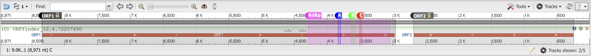
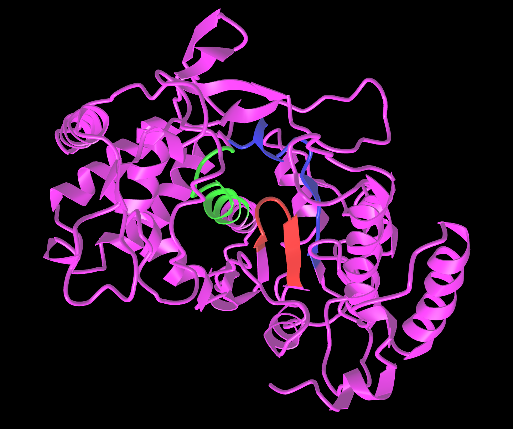
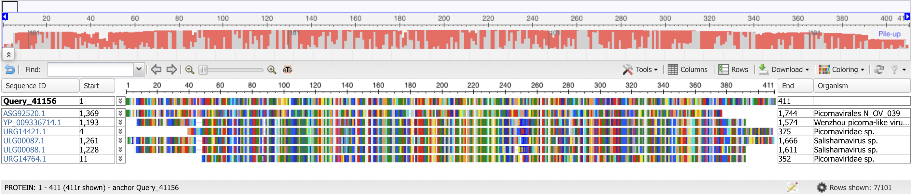
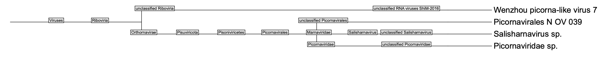

# Hidden in the Depths: A Novel RNA Virus Buried in Marine Sediment
written by: Gavin Pu

### *Sedimentum occultus*
The name I choose for my virus is *Sedimentum occultus*. The Latin word 'sedimentum' translates to 'settling' in English and, more importantly, is the word from which 'sediment' is derived. Of course, this represents how my virus was originally found in marine sediment samples, as were some similar viruses from other studies. The Latin word 'occultus' is an adjective meaning 'concealed' or 'hidden', showing how there are still many features of this virus that are unknown or inconclusive.

## Abstract

Viruses are found in many natural environments. In particular, the nucleic acids from microorganism samples taken from the environment can be analyzed for the presence of viral genomes or portions of them. A study performed to determine culturing techniques for bacteria sampled from marine sediments in intertidal zones found a possible viral genome within the sample metagenome. This genome was first identified as a possible viral genome because sections of it indicate that it might encode an RNA-dependent RNA polymerase (RdRp), a protein essential to all RNA viruses. However, the virus associated with this genome has not yet been characterized, and many of its attributes are unknown. Here we show that this virus likely belongs to the family *Picornaviridae*. We performed BLAST queries using the ORFs of the virus to find other organisms with similar proteins. Reviewing the results showed that taxonomically similar viruses were found in environments much like the marine sediment where the original virus was found. Our results show several putative features of this virus compared to other viruses in the family *Picornaviridae*. We expect that the topics presented here can be greatly expanded upon to better characterize the virus, as further research is required to determine its host and taxonomic classification.

## Results

### Index Case

*Sedimentum occultus* was originally found in an experiment to determine cultivation procedures for microorganisms that may fail to grow in culture due to their natural growth states, such as remaining dormant [Mu et al. 2018]. The researchers collected three samples of sediment from the intertidal zone of Weihai, China and and extracted DNA and RNA during and after culturing the microbes present in the samples. After removal of rRNA, the remaining RNA was used to synthesize cDNA.

The index run of *S. occultus* was SRR6808584, and its corresponding assembly file contained 1,346,747 nodes in FASTA format. Node 389 was an DNA sequence of length 8.9 kilobases. The RdRp nucleotide sequence of *S. occultus* was present within Node 389. We first used BLAST on the RdRp amino acid sequence to narrow down the virus's potential identity [Altschul et al. 1990]. Many of the BLAST hits with the greatest percent identities showed that the RdRp amino acid sequence was similar to the RdRp amino acid sequences of other unknown viruses in the family *Picornaviridae*. We can moderately conclude from this finding that *S. occultus* belongs to the family *Picornaviridae*. However, since the specific genus and species of the viruses were unknown, it is inconclusive as to whether *S. occultus* has already been discovered and named.

### Finding ORFs

There are multiple online software tools that can be used to find ORFs in a nucleotide sequence. We first used the DNA sequence of Node 389 as the input to Translate and EMBOSS Sixpack, both of which can be used to identify ORFs [Gasteiger et al. 2003, Madeira et al. 2022]. Both tools identified two major ORFs on the reverse DNA strand. Their lengths were 810 and 1,790 amino acids long, but they were not located in the same reading frame. To visually examine the ORFs, we used ORFfinder with Node 389 as input. ORFfinder identifed the longer ORF (with 1,790 amino acids) as ORF 1 and the shorter ORF (with 810 amino acids) as ORF2 [Wheeler et al. 2003].

On each ORF, we then performed a BLAST query. The hits with the greatest percent identity for ORF1 were the same as the ones from our previous BLAST results on the RdRp amino acid sequence, indicating that ORF1 contains the RdRp nucleotide sequence. The runs for the top three hits with the greatest percent identities were SRR14039754, SRR14039658, and SRR14039631. All three hits belonged to the BioProject PRJNA716119. We then examined each hit for ORF1 which was an RdRp for an unknown *Picornaviridae* species and found that every single hit was in fact part of PRJNA716119. For ORF2, the BLAST hits with the greatest percent identity were a putative structural protein for an unknown virus in the order *Picornavirales* and a caspid protein for an unclassified *Picornaviridae* virus in scallops. Hence, we are moderately confident that ORF1 contains the sequence for RdRp while ORF2 contains a sequence or sequences that code for structural proteins forming the viral caspid. In addition, the BLAST results indicate that it is highly likely that *S. occultus* is a member of the family *Picornaviridae*.

### Other Publications

As mentioned previously, the BLAST hits for ORF1 that were RdRps for species in *Picornaviridae* all came from the same BioProject. The associated publication was on determining the diversity of environmental RNA viruses. The authors of the study took 32 environmental samples across 16 provinces and regions of China [Chen et al. 2022]. All similar RdRp sequences found from BLAST were sampled from soil or sediment. It appears that both *S. occultus* and viruses from the same family with similar RdRps are found in sediments in China. However, other attributes of *S. occultus* still remain inconclusive.

The two BLAST hits for ORF2 with the highest percent identity were structural proteins. The first one was a putative structural protein from the *Picornavirales* order, which the *Picornaviridae* family belongs to. The associated publication for this protein sought to determine virus--host relationships in marine systems. The authors noticed that they collected the most transcripts of unclassified *Picornavirales* viruses during brown tide blooms of the algae *Aureococcus anophagefferens* in Quantuck Bay, New York, which was also associated with a rise in diatoms, dinoplagellates, and other protists. This suggested that one or several of these organisms may be the host of some unknown viruses from the *Picornavirales* order, but the authors could not conclude which [Moniruzzaman et al. 2017]. In terms of *S. occultus*, it is possible that its host may be a similar marine organism, but this is inconclusive because the viruses found in the study were not from the same location and may not have been from the same family. The second BLAST hit was a study on the scallop *Argopecten irradians* in the Gulf coast of Florida that revealed three novel viruses in the family *Picornaviridae* within the scallop pathobiome [Scro et al. 2023]. These two studies taken together suggest that it may be possible that the host of *S. occultus* may be a marine animal or protist, as viruses with similar caspid proteins have been found as the putative hosts of these organisms. However, it is still inconclusive as to what the host of *S. occultus* is.

### Virus Genome

Still Image:



[Interactive Version](https://www.ncbi.nlm.nih.gov/projects/sviewer/?id=lcl|1&tracks=[key:sequence_track,name:Sequence,display_name:Sequence,id:STD649220238,category:Sequence,annots:Sequence,ShowLabel:false,ColorGaps:false,shown:true,order:0][key:gene_model_track,name:U2EZpwA2z898C,display_name:(U)%20ORFfinder_12.4.72257490,id:U2EZpwA2z898C,data_key:dcrjGxXIwunu5vTuxffK4Jmdm5yTnr-Ut4y5piyrKgnqPwqyJwYWXVoPZHYxamhyelotW25FflRkTnRRQnx7fltOfQ,dbname:NetCache,category:ORFfinder,annots:ORFfinder_12.4.72257490_UUD1701692577DUU_gene_model,Options:MergeAll,CDSProductFeats:false,NtRuler:true,AaRuler:true,HighlightMode:2,ShowLabel:true,highlights_color:#0000ff,shown:true,order:1]&key=_kFokJ5DSWJlbX9lTnxBaxIWEBcYFTQfPAcyLacgoYJitBa9sNaB6w-kRN0RwUjZWvEN8E7uXv9E5VT6Ytdb1XvlXQ&mk=3479:3502|C|red,3797:3832|A|0000FF,3584:3625|B|00FF00,2969:8341|ORF1|black|9,247:2679|ORF2|333333|1,3050:4282|RdRp|FF00FF&noguess_assm=1&spacing=1&v=1:8971&c=null&gflip=1&select=null&slim=0&toolbar=-d) (may not work):

<iframe id="iframe_NCBI" width="100%" src="https://www.ncbi.nlm.nih.gov/projects/sviewer/embedded_iframe.html?iframe=iframe_NCBI&id=lcl|1&tracks=[key:sequence_track,name:Sequence,display_name:Sequence,id:STD649220238,category:Sequence,annots:Sequence,ShowLabel:false,ColorGaps:false,shown:true,order:0][key:gene_model_track,name:U2EZpwA2z898C,display_name:(U)%20ORFfinder_12.4.72257490,id:U2EZpwA2z898C,data_key:dcrjGxXIwunu5vTuxffK4Jmdm5yTnr-Ut4y5piyrKgnqPwqyJwYWXVoPZHYxamhyelotW25FflRkTnRRQnx7fltOfQ,dbname:NetCache,category:ORFfinder,annots:ORFfinder_12.4.72257490_UUD1701692577DUU_gene_model,Options:MergeAll,CDSProductFeats:false,NtRuler:true,AaRuler:true,HighlightMode:2,ShowLabel:true,highlights_color:#0000ff,shown:true,order:1]&key=_kFokJ5DSWJlbX9lTnxBaxIWEBcYFTQfPAcyLacgoYJitBa9sNaB6w-kRN0RwUjZWvEN8E7uXv9E5VT6Ytdb1XvlXQ&mk=3479:3502|C|red,3797:3832|A|0000FF,3584:3625|B|00FF00,2969:8341|ORF1|black|9,247:2679|ORF2|333333|1,3050:4282|RdRp|FF00FF&noguess_assm=1&spacing=1&v=1:8971&c=null&gflip=1&select=null&slim=0&toolbar=-d&appname=no_appname" onload="if(!window._SViFrame){_SViFrame=true;window.addEventListener('message',function(e){if(e.origin=='https://www.ncbi.nlm.nih.gov' && !isNaN(e.data.h))document.getElementById(e.data.f).height=parseInt(e.data.h);});}">
</iframe>
</iframe>

**Figure 1:** Genome of *Sedimentum occultus*. The ORF1 region (in black) shows the location of ORF1, which contains the nucleotide sequence for RdRp. The RdRp region (in pink) shows the location of the RdRp nucleotide sequence that is directly translated into RdRp. Within this region are the motifs A, B, and C (in blue, green, and red, respectively). The ORF2 region (in black) shows the location of ORF2, which contains nucleotide sequences for capsid proteins.

### RdRp Structure



**Figure 2**: Structure of the RdRp as determined by AlphaFold2. The A, B, and C motifs are shown in blue, green, and red, respectively.

### RdRp Multiple Sequence Alignment

Still Image:



[Interactive Version](https://www.ncbi.nlm.nih.gov/projects/msaviewer/?anchor=0&coloring=rasmol&key=E6yFfXOupI-IgJKIo5Gshv_7_fr1-Nny0erfwErNTGRdUi6QH18umCqwvcno1bHNo-X05Lf6p-u98a3um8OiwYLxpA,HaKLc32gqoGGjpyGrZ-iiPH18_T79tf83-TRzkTDQmpTXFnzBsA3zriYm-HO_Zflhc3SzJHSgcOb2YvGveuE6aTZgg&track_config=protein_default&hidden=4,6,7,8,9,10,12,13,14,15,16,17,18,19,20,21,22,23,24,25,26,28,29,30,31,32,33,34,35,36,37,38,39,40,41,42,43,44,45,46,47,48,49,50,51,52,53,54,55,56,57,58,59,60,61,62,63,64,65,66,67,68,69,70,71,72,73,74,75,76,77,78,79,80,81,82,83,84,85,86,87,88,89,90,91,92,93,94,95,96,97,98,99,100&columns=d:120,b:55,x:17,aln,e:55,o:150) (may not work):

<iframe id="iframe_NCBI" width="100%" src="https://www.ncbi.nlm.nih.gov/projects/msaviewer/embedded_iframe.html?iframe=iframe_NCBI&anchor=0&coloring=rasmol&key=E6yFfXOupI-IgJKIo5Gshv_7_fr1-Nny0erfwErNTGRdUi6QH18umCqwvcno1bHNo-X05Lf6p-u98a3um8OiwYLxpA,HaKLc32gqoGGjpyGrZ-iiPH18_T79tf83-TRzkTDQmpTXFnzBsA3zriYm-HO_Zflhc3SzJHSgcOb2YvGveuE6aTZgg&track_config=protein_default&hidden=4,6,7,8,9,10,12,13,14,15,16,17,18,19,20,21,22,23,24,25,26,28,29,30,31,32,33,34,35,36,37,38,39,40,41,42,43,44,45,46,47,48,49,50,51,52,53,54,55,56,57,58,59,60,61,62,63,64,65,66,67,68,69,70,71,72,73,74,75,76,77,78,79,80,81,82,83,84,85,86,87,88,89,90,91,92,93,94,95,96,97,98,99,100&columns=d:120,b:55,x:17,aln,e:55,o:150&appname=ncbi_msav_demo" onload="if(!window._MSAiFrame){_MSAiFrame=true;window.addEventListener('message',function(e){if(e.origin=='https://www.ncbi.nlm.nih.gov' && !isNaN(e.data.h))document.getElementById(e.data.f).height=parseInt(e.data.h);});}">
</iframe>

**Figure 3:** Multiple sequence alignment of the *Sedimentum occultus* RdRp protein sequence to all BLAST hits with >80% query coverage and >40% amino acid identity.

### Phylogenetic Tree



**Figure 4:** Phylogenetic tree of organisms present in multiple sequence alignment.

## Discussion

Compared to the genomes of most viruses of the family *Picornaviridae*, *S. occultus* is interesting in that it contains two ORFs instead of one. Currently, the only genus of *Picornaviridae* known to contain viral species with two ORFs is *Dicipivirus*. There are only two known viruses in this genus, so it is quite unique that *S. occultus* has separate ORFs for structural and non-structural proteins [Zell et al. 2017]. However, there are still many open questions that remain. First, even though taxonomically similar viruses with marine hosts have been found, it is unknown what the host organism of *S. occultus* is, though the current evidence present suggests that the host is likely to be a marine organism. Second, we do not know if Node 389 of the index run's assembly file contains the entire viral genome. The sequence length of 8.9 kilobases does fall within the accepted range of 6.7--10.1 kilobases for picornaviruses, but the sequence itself notably lacks a poly-A tail at either end. Nevertheless, Node 389 still contains the portion of the *S. occultus* genome with ORFs used to synthesize viral proteins typical for a picornavirus. As its name indicates, there are still many mysteries surrounding *S. occultus* and similar viruses found in marine sediments and similar environments.

## References

Altschul, S.F., Gish, W., Miller, W., Myers, E.W., Lipman, D.J. Basic Local Alignment Search Tool. *J. Mol. Biol.* **215**, 403--410 (1990). https://doi.org/10.1016/S0022-2836(05)80360-2

Chen, Y.M. et al. RNA viromes from terrestrial sites across China expand environmental viral diversity. *Nat. Microbiol.* **7**, 1312--1323 (2022). https://doi.org/10.1038/s41564-022-01180-2

Gasteiger, E. et al. ExPASy: the proteomics server for in-depth protein knowledge and analysis. *Nucleic Acids Res.* **31**, 3784--3788 (2003). https://doi.org/10.1093/nar/gkg563

Hulo, C. et al. ViralZone: a knowledge resource to understand virus diversity. *Nucleic Acids Res.* **39**, D576--D582 (2010). https://doi.org/10.1093/nar/gkq901

Madeira, F. et al. Search and sequence analysis tools services from EMBL-EBI in 2022. *Nucleic Acids Res.* **50**, W276--W279 (2022). https://doi.org/10.1093/nar/gkac240

Moniruzzaman, M. et al. Virus-host relationships of marine single-celled eukaryotes resolved from metatranscriptomics. *Nat. Commun.* **8**, 16054 (2017). https://doi.org/10.1038/ncomms16054

Mu, D.S. et al. Metatranscriptomic and comparative genomic insights into resuscitation mechanisms during enrichment culturing. *Microbiome* **6**, 230 (2018). https://doi.org/10.1186/s40168-018-0613-2

Scro, A.K., Bojko, J., Behringer, D.C. Symbiotic survey of the bay scallop (*Argopecten irradians*) from the Gulf coast of Florida, USA. *J. Invertebr. Pathol.* **201**, 108019 (2023). https://doi.org/10.1016/j.jip.2023.108019

Wheeler, D.L. et al. Database resources of the National Center for Biotechnology *Nucleic Acids Res.* **31**, 28--33 (2003). https://doi.org/10.1093/nar/gkg033

Zell, R. et al. ICTV Virus Taxonomy Profile: *Picornaviridae*. *J. Gen. Virol.* **98**, 2421--2422 (2017). https://doi.org/10.1099/jgv.0.000911

# Viral Short Story

```
  "I need your help, detective," she said. "No one has any information on the new virus. People are panicking, and soon the world will be in disarray."
  
  Of course, I knew how bad the situation was before she entered my office. "Seems like it **belongs to the family *Picornaviridae***," I replied. "When you've been doing my job for 30 years, you tend to notice patterns and do some investigation before things get out of hand."
  
  "Prior investigation, huh? What else do you know?"
  
  I said, "Not much, but if I'm correct, the virus should have a **single-stranded RNA genome of around 6.7 to 10.1 kilobases**. Why would this concern you, anyway?"
  
  It was then that I got a good look at her. She was wearing an expensive-looking dress with heels so high that I wondered how she didn't trip. Without her fur coat, it seemed like she was freeze in the cold winter night, but surely she didn't walk here.
  
  Her eyes met mine and gazed into my soul. "My husband is sick," she said, "and there's no one to keep his company running if he goes. Everyone knows you're the best detective here."
  
  "Fine," I said. "If the rumors are correct, **multiple samples of this virus were identified in the intertidal zone of Weihai, China**. The BLAST algorithm reckons its **RdRp has at least a 40% identity to some other *Picornaviridae* viruses from the BioProject PRJNA716119***."
  
  "That's fine and all," she said, "but do you know anything about the morphology of this virus?"
  
  "Unfortunately, almost nothing." I sighed. "Only lead I have is that other members of *Picornaviridae* have an **icosahedral caspid built from four caspid proteins**. Anything else is beyond me, and you and I will just need to wait and see what people can figure out."
  
  "Very well. We will meet again soon detective," she said. And with that sentence, she slinked out the door.
```