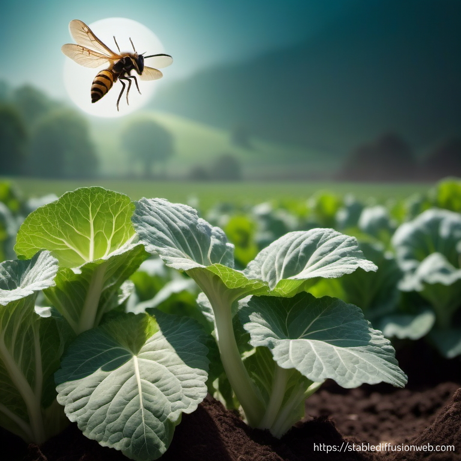

# Wasp out! A novel virga-like virus discovered in *Costesia vestalis* with possible roots to plant viruses
written by: [Elli Hung](https://github.com/ellihung)

### Trojan patchwork virus

Trojan patchwork virus: Alike the Greek Trojan Horse, this virus hides inside of a wasp which is a parasite to a moth so this virus is part of a double Trojan horse scheme. Additionally, viruses that destroy plants are generally known as mosaic viruses. Patchwork is a synonym to mosaic because the virus has not been directly sampled from plants, but it could be likely that it is closely related to other mosaic viruses. 




## Abstract

Research has suggested that some RNA-viruses have jumped from plant to insect genomes and vice versa (Kondo et al., 2019). Virga-like viruses are positive single-stranded RNA viruses that are closely related to the family Virgaviridae that is commonly associated with plants (Adams et al., 2009; Kondo et al., 2019). Recently, traces of a novel virga-like virus have been found in insects suggesting a common viral origin of these viruses between plants and insects. Here a novel virus (Trojan patchwork virus) with a virga-like virus RdRp was found in a sample of C. vestalis from a study by Zhao et al., 2017 from a search through RNA-sequencing databses. This novel virus acts as more evidence supporting a close evolutionary relationship between standard Virgaviridae plant viruses and virga-like viruses in insects and suggest that specific viruses may exist that can cross this transmission barrier. Further research should be conducted to focus on endogenous viral elements (EVEs) to see if more plant-like viruses are found in other insects, in the diamondback moth host that C. vestalis uses as a host, or in vegetation that C. vestalis interacts with.

## Results

### The Trojan patchwok virus in *Costesia vestalis* 

The Trojan patchwork virus belongs to a virga-like family under *Virgaviridae* which is a family of positive-strand RNA viruses. These viruses are generally associated with plants but recent studies have found traces of this virus in insects suggesting that insects can act as a host and vector of viruses that infect plants (Kondo et al., 2019). 

The sample (SRR3948414) containing this virus was part of a study conducted by Zhao et al., 2017 in which RNA-seq was conducted on two wasp species. This virus was found in *Costesia vestalis* which is a wasp that is a larval endoparasite of the diamondback moth. Doing BLASTP searches on related RdRp sequences showed that this virus was found in other related insects from similar geographical areas as *C. vestalis*. 

Larval *C. vestalis* live inside or on the bodies of arthropods, including diamondback moths. They exist in the body cavity of the insect ultimately killing the host once the wasp emerges from its larval state. Diamondback moths are pests to brassicaceous crops and are not very receptive to insecticides. Therefore, *C. vestalis* have been used as biological control of these moths in many agricultural contexts in Japan (Hiroyoshi et al., 2017). 

Phylogenetic analyses have shown that plant and insect virga-related viruses may share common viral origins (Kondo et al., 2019). It could be suggested that the Trojan patchwork virus could be closely related to a virga-like virus that originated in plants. It could also be possible for *C. vestalis* to pass this virus onto its host species such as diamondback moths. 

## Discussion

The Trojan patchwork virus could be an example of a plant virus integrating into the genome of an insect. The virga-like virus family has potential to cross barriers between plants and insects and vice-versa which could show extremely interesting evolutionary relationships. 

Future directions for research on this virus should focus on endogenous viral elements (EVEs) within plants and insects and see if any of these sequences match to the Trojan patchwork viral sequence. Additionally, different domains may have been transferred between species involved such as helicase sequences within moths. It would be very interesting to look at the agricultural plants that *C. vestalis* are present on, *C. vestalis* themselves, and the diamondback moths to search for evidence of viral transfer between these species. 

Implications for these results could greatly impact agricultural methods for biological control as *C. vestalis* may be acting as vectors for these viruses which could impact cattle or other parts of the ecosystem. Additionally, viral infections could help to explain decreased crop yields, if the virus can infect plants, and get to the root cause rather than fighting pest moths that are not the root of the problem. 

## References

```
Adams, M. J., Antoniw, J. F., & Kreuze, J. (2009). Virgaviridae: A new family of rod-shaped plant viruses. Archives of Virology, 154(12), 1967–1972. https://doi.org/10.1007/s00705-009-0506-6

Adams, M. J., Heinze, C., Jackson, A. O., Kreuze, J. F., Macfarlane, S. A., & Torrance, L. (2012). Virgaviridae. In Virus Taxonomy (pp. 1139–1162). Elsevier. https://doi.org/10.1016/B978-0-12-384684-6.00097-5

Andika, I. B., Kondo, H., & Sun, L. (2016). Interplays between Soil-Borne Plant Viruses and RNA Silencing-Mediated Antiviral Defense in Roots. Frontiers in Microbiology, 7. https://www.frontiersin.org/articles/10.3389/fmicb.2016.01458

Cui, J., & Holmes, E. C. (2012). Endogenous RNA viruses of plants in insect genomes. Virology, 427(2), 77–79. https://doi.org/10.1016/j.virol.2012.02.014

Hiroyoshi, S., Harvey, J. A., Nakamatsu, Y., Nemoto, H., Mitsuhashi, J., Mitsunaga, T., & Tanaka, T. (2017). Potential Host Range of the Larval Endoparasitoid Cotesia vestalis (=plutellae) (Hymenoptera: Braconidae). International Journal of Insect Science, 9, 1179543317715623. https://doi.org/10.1177/1179543317715623

Kondo, H., Chiba, S., Maruyama, K., Andika, I. B., & Suzuki, N. (2019). A novel insect-infecting virga/nege-like virus group and its pervasive endogenization into insect genomes. Virus Research, 262, 37–47. https://doi.org/10.1016/j.virusres.2017.11.020

Koonin, E. V., Dolja, V. V., & Morris, D. T. J. (1993). Evolution and Taxonomy of Positive-Strand RNA Viruses: Implications of Comparative Analysis of Amino Acid Sequences. Critical Reviews in Biochemistry and Molecular Biology. https://doi.org/10.3109/10409239309078440

Lazareva, E., Lezzhov, A., Vassetzky, N., Solovyev, A., & Morozov, S. (2015). Acquisition of Full-Length Viral Helicase Domains by Insect Retrotransposon-Encoded Polypeptides. Frontiers in Microbiology, 6. https://www.frontiersin.org/articles/10.3389/fmicb.2015.01447

Savenkov, E. I. (2021). Virgaviruses (Virgaviridae). In D. H. Bamford & M. Zuckerman (Eds.), Encyclopedia of Virology (Fourth Edition) (pp. 839–851). Academic Press. https://doi.org/10.1016/B978-0-12-809633-8.21338-1

Shi, M., Lin, X.-D., Tian, J.-H., Chen, L.-J., Chen, X., Li, C.-X., Qin, X.-C., Li, J., Cao, J.-P., Eden, J.-S., Buchmann, 
J., Wang, W., Xu, J., Holmes, E. C., & Zhang, Y.-Z. (2016). Redefining the invertebrate RNA virosphere. Nature, 540(7634), Article 7634. https://doi.org/10.1038/nature20167

Whitfield, A. E., Falk, B. W., & Rotenberg, D. (2015). Insect vector-mediated transmission of plant viruses. Virology, 479–480, 278–289. https://doi.org/10.1016/j.virol.2015.03.026

Zhao, W., Shi, M., Ye, X., Li, F., Wang, X., & Chen, X. (2017). Comparative transcriptome analysis of venom glands from Cotesia vestalis and Diadromus collaris, two endoparasitoids of the host Plutella xylostella. Scientific Reports, 7(1), Article 1. https://doi.org/10.1038/s41598-017-01383-2
```
# Viral Short Story

```
Long long ago, the greatest battle of broken promises, backstabbing, and hidden agendas took place. This is the story of ultimate cabbage supremacy and world domination.

Enter the Diamondback moth. As any good parent, this moth wants to provide its offspring with the best possible environment for them to flourish and thrive. What better of a place than the leaves of a cabbage? Each season, these moths lay eggs and leave their larvae on leaves of cabbage to ensure their progeny are strong and healthy. **These larvae want nothing more than to feast on the juicy leaves cruciferous plants**. And where is the best place to find rows upon rows of easily accessible cabbage? Cabbage farms!

Introducing the cabbage farmer. These farmers are hardworking folks who rely on cabbage to feed themselves, their families, and make a living. Their mortal enemies are these moths who keep destroying their crops without a second thought. In combination, **an estimated $4-5 billion USD worth of damage is caused by these moths**. 

Naturally, the cabbage farmers started to rebel throwing chemical after chemical at these moths to try and keep them under control. **They started with DDT, which quickly turned out to be a horrible idea, and soon concoctions of synthesized compounds were being thrown at these moths**. However, these moths are fighters. **They quickly developed resistance to insecticides** and came back to feast on cabbages even stronger. 

Just as the farmers were about to give up growing cabbages to start up a biotech company, an elderly cabbage farmer remembered a long-forgotten myth about the one true destroyer of these moths:  a parasitoid wasp by the name of *Cotesia vestalis*. These wasps have a personal vendetta against the Diamondback moth and other moth species. Just because a moth has longer wings doesn’t mean they’re any better than wasps. Legend says that these wasps **sneakily laid a singular egg on each moth larvae. Once the egg hatched, the wasp larvae acted as an inside agent living within the body cavity of the moth, slowly consuming all its nutrients from the inside out. After three months of anguish for the moth, the wasp larvae finally emerged and pupated near the body of the dying moth** to establish its unquestionable dominance and clear wasp superiority. 

These wasps could be the answer the farmers were looking for! After scrounging through texts and maps, the farmers went out on an expedition to find these wasps in the far away lands where there were no cabbages and no moths. The farmers traveled in packs with some unaccounted for traveling hitchhikers: a virus. The farmers finally made it to the land of these wasps and shared the horrors they were encountering with the moths. The wasps eagerly agreed to come back to town with the farmers and they schemed on how to achieve dominance over the moths as they traveled back to the cabbage farms. 

However, there was a secret infiltration happening at the same time. There was a virus coming along for the journey and was living amongst the farmers in the same way a wasp larvae would live inside a moth. This virus was waiting to attack, for just the right moment to strike and spread for ultimate world domination. This virus, alike the wasps, were fed up with everyone underestimating them and saying “viruses aren’t even alive, what harm can they even do?”

One late night on the journey back to the farms, the virus took a risky move and jumped from a human farmer to a wasp. The virus started to replicate within the wasp and sat waiting for its next opportunity to strike just as the cabbage farmers and wasps were arriving back to the farms to begin the battle for cabbage supremacy. 

Now, what will happen when the plan plays out? Who will ultimately end up victorious? The cabbage farmers? The moth? The wasps? The virus? Who is actually working with who? Not even I can tell you who is superior, as these events are unfolding as you read this. Now I urge you to think carefully about who you make friends with, who may be hiding within who, and what the true intentions may be. Sometimes the cabbage isn’t worth it.

```
