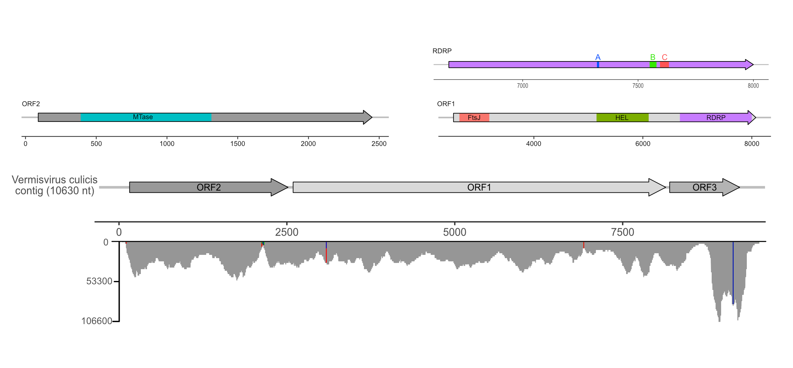
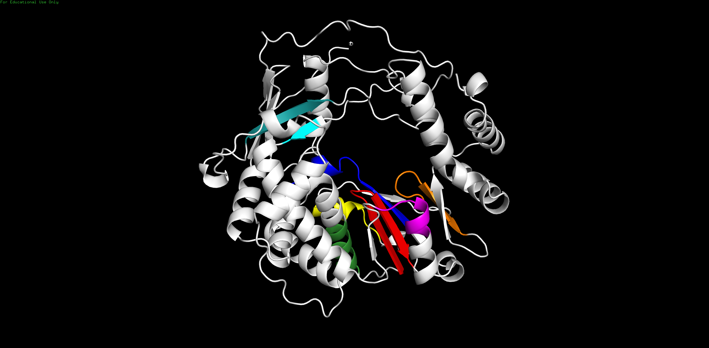
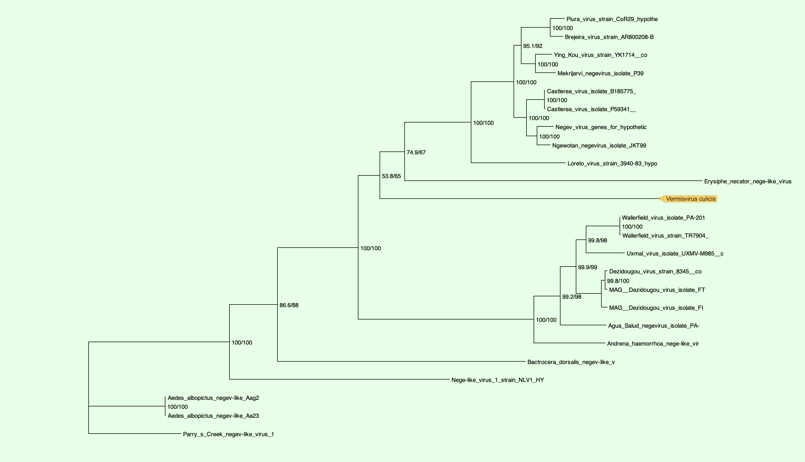

# Worming into the unknown: An Exploration into the Unknown World of Negeviruses with Vermisvirus culicis
written by: [Declan Lim](https://github.com/declanlim)

### *Vermisvirus culicis*


## Abstract

We present the the discovery of a novel RNA virus *Vermisvirus culicis*, identified from a single nematode from the species Panagrolaimus sp. LJ2414. The genome of the virus has a length of around 10,500 nucleotides and comprises of 3 ORF regions. The genetic make up of the virus is consistent with the genus Negevirus, a genus of insect specific viruses (ISVs) with a wide host range. From a phylogenetic analysis, we consider *Vermisvirus culicis* to be a divergent member of the genus Negevirus, clustering with the proposed clade Nelorpivirus. The discovery of *Vermisvirus culicis* in a nematode suggests a potential host shift for viruses in the genus Negevirus, and may provide insight into the evolution of Negeviruses and their ever increasing host range. 

## Results

### Identifying Negevirus associated sequences from a palmprint

From the assigned palmprint on Serratus (u812429\_deceitfulHeadword), we were able to retrieve a single run accession (SRR22163886) from BioProject PRJNA845886 containing a divergent RDRP fragment. The BioProject's associated paper investigated telomeric-repeat motifs (TRMs) in nematodes, where the authors performed DNA and RNA sequencing on multiple nematode species in order to explore the evolution of TRMs within the phylum Nematoda. Out of the 28 sequencing runs generated by the BioProject, only a single (index) run was found to contain a divergent RDRP fragment. The index run sequenced RNA from the nematode species Panagrolaimus sp. LJ2414, an unclassified species from the family Panagrolaimidae. The authors of the paper did not comment on the presence of any virus or disease within their samples. 

Using this index run, a de novo assembly of the RNA-seq reads generated 112,586 contigs. Using palm_annot and Diamond, we were able to identify a 10,630 nucleotide (nt) viral contig at a coverage of 12,827, characterized by 3 ORFs, the largest of which contained a 440 amino acid RDRP. Further investigation through a BLASTP search revealed highly divergent homologs (<50\% identity), the majority of which belonging to the genus *Negevirus*.

From our examination, we propose that this viral contig signifies the discovery of a novel RNA virus within the genus Negevirus. The virus has been tentatively named *Vermisvirus culicis*, derived from the Latin term "*vermis*", meaning worm, and "*culicis*", meaning mosquito. This nomenclature pays homage to the virus' main host organism, while also acknowledging the taxonomic origins of the virus. 

### *Vermisvirus culicis* is a divergent Negevirus

Due to the lack of sampling data relating to *Vermisvirus culicis*, we were unable to perform an ecological analysis to explore the virus' distribution and host range. However, we were able to interrogate the proximal phylogenetic relationships of *Vermisvirus culicis* and other related viruses. From initial BLASTP searches, we identified *Vermisvirus culicis* as a divergent member of the genus *Negevirus*, a genus of insect specific viruses (ISVs) with a wide host range within the order *Diptera* [@Schoonvaere2018-hv]. *Negeviruses* are also found globally, from the Arctic to the tropics and are closely related to plant viruses in the genera *Cilevirus*, *Higrevirus* and *Blunervirus* [@Nunes2017-og]. *Negeviruses* are known to have 3 ORFs [@Lu2020-om; @Vasilakis2013-vv; @Nunes2017-og; @OBrien2017-va], the largest of which (ORF1) is predicted to encode a polyprotein with 4 domains involved with RNA replication: viral methyltransferase, RNA ribosomal methyltransferase, helicase, and RNA-dependent RNA polymerase (RDRP), ORF2 and ORF3 are expected to encode a glycoprotein and a membrane protein respectively, though there has been little experimental evidence to support these predictions [@Kawakami2016-pi]. 

Exploring NCBI Virus for all viruses in the genus *Negevirus* with a complete genome, we were able to retrieve 18 different species, with a total of 23 different genomes. For each genome, we extracted the RDRP encoding ORF and included it with out *Vermisvirus culicis* RDRP in a multiple sequence alignment in MUSCLE [@Edgar2004-ks]. Using this alignment, we were able to generate a maximum likelihood phylogenetic tree using IQ-TREE (see below). The resulting tree agrees with the split of *Negeviruses* into two distinct clades: Nelorpivirus and Sandewavirus [@Kallies2014-ku], with *Vermisvirus culicis* falling within the Nelorpivirus clade.

Although the majority of *Negeviruses* are known to infect insects within the order diptera, the close relationship between *Negeviruses* and plant viruses suggests that *Negeviruses* may have a wider host range than previously thought [@Ramos-Gonzalez2020-mm]. Experimental evidence has shown that *Negeviruses* are unable to replicate in vertebrate cell lines [@Vasilakis2013-vv], suggesting that insects would not be able acquire these viruses from vertebrate hosts [@Nunes2017-og]. The host range of *Negeviruses* is also expected to be underestimated due to the sampling bias towards biting arthropods, as many *Negeviruses* are found through arbovirus surveillance. 

Structurally *Vermisvirus culicis* differs from other *Negeviruses* in the location of the viral methyltransferase domain. In regular *Negeviruses*, the viral methyltransferase domain is located on ORF1, alongside the other three domains that relate to RNA replication. However, in *Vermisvirus culicis*, the viral methyltransferase domain is located on ORF2, which was previously predicted to contain a single glycoprotein domain. This suggests that *Vermisvirus culicis* may have a different mechanism of RNA replication compared to other *Negeviruses*, potentially making it more suitable for replication in nematodes. Despite this, the RDRP of *Vermisvirus culicis* still clusters with other *Negeviruses* in the phylogenetic tree. According to the analysis, the closest relative is the Erysiphe necator nege like virus, a virus that was found in the grape powdery mildew fungus. While there is very little available information regarding this fungus, we can hypothesize that the virus may actually be a transmitted through the nematode host. Since *Vermsivirus culicis* is closely related to a plant virus and has a different structure compared to typical *Negeviruses*, further analysis *Vermisvirus culicis* may shed some light on the evolution of *Negeviruses* and their ever expanding host range.

### Endogenous viral elements in insects

Serving as hosts to a wide range of viruses, insects may integrate fragments of viral genomes into their own genome in the form of endogenous viral elements (EVEs). EVEs can shed light on the evolutionary history of viruses and their hosts, as well as provide insight into the effects of these viruses [@Kondo2019-hc]. Though *Vermisvirus culicis* was not found in any DNA sequencing runs, studies exploring insect transcriptome data have found virga/negevirus like EVEs in insects across several orders, as well as in nematodes. Exploring the commonalities between the EVEs and *Vermisvirus culicis* may provide insight into the evolutionary history of *Negeviruses* and explain the apparent host shift from insects to nematodes. 

### Virus Genome


**Figure 1.** *Vermisvirus culicis* genome. Assembling the index run, we recovered a high coverage contig containing 3 ORFs. ORF1 encodes a Ribosomal FtsJ methyltransferase, a helicase, and the viral RDRP. ORF2 (second largest) encodes a viral methyltransferase. ORF3 was not found to have any identifiable homologs via BLASTP in the non-redundant database (	Dec 2, 2023), INTERPROSCAN, or FOLDSEEK. 

### Viral RDRP Structure

**Figure 2.** *Vermisvirus culicis* RDRP visualized in PyMol after running through AlphaFold2. Motifs A (blue), B (green), and C (red) are visualized.

### Viral RDRP Phylogeny

**Figure 3.** Maximum likelihood phylogenetic tree (IQ-TREE) of the RDRP protein from *Vermisvirus culicis* and other viruses from the genus negevirus. RDRPs were retrieved from NCBI for all viruses in the genus negevirus that had a complete genome. Genomes were run through ORFfinder to identify the RDRP protein before being aligned with MUSCLE. 

## Discussion

Through a basic analysis of *Vermisvirus culicis*, we were able to identify it as a divergent member of the genus *Negevirus*. The discovery of *Vermisvirus culicis* in a nematode suggests a potential host shift for viruses in the genus Negevirus. With the genus being closely related to plant viruses, the discovery of *Vermisvirus culicis* may provide insight into the evolution of Negeviruses. More analyses would be required to fully characterize and understand *Vermisvirus culicis*, but the initial phylogenetic and structural analyses confirm that *Vermisvirus culicis* is indeed a virus within the genus Negevirus.

I was particularly interested in the wide host and geographic range of Negeviruses. Since they are found all over the world, there is likely a lot of variation between different species, potentially explaining host shifts like the one we see here. Much more work is required to fully understand the evolution of Negeviruses, but the initial discovery of a divergent Negevirus in a nematode is an interesting start.

## References

Lim, J., Kim, W., Kim, J., & Lee, J. (2023). Telomeric repeat evolution in the phylum Nematoda revealed by high-quality genome assemblies and subtelomere structures. Genome Res., gr.278124.123.

Vasilakis, N., Forrester, N. L., Palacios, G., Nasar, F., Savji, N., Rossi, S. L., … Tesh, R. B. (2013). Negevirus: a proposed new taxon of insect-specific viruses with wide geographic distribution. J. Virol., 87(5), 2475–2488.

Kawakami, K., Kurnia, Y. W., Fujita, R., Ito, T., Isawa, H., Asano, S.-I., … Bando, H. (2016). Characterization of a novel negevirus isolated from Aedes larvae collected in a subarctic region of Japan. Arch. Virol., 161(4), 801–809.

O’Brien, C. A., McLean, B. J., Colmant, A. M. G., Harrison, J. J., Hall-Mendelin, S., van den Hurk, A. F., … Hobson-Peters, J. (2017). Discovery and characterisation of Castlerea virus, a new species of negevirus isolated in Australia. Evol. Bioinform. Online, 13, 1176934317691269.

Schoonvaere, K., Smagghe, G., Francis, F., & de Graaf, D. C. (2018). Study of the metatranscriptome of eight social and solitary wild bee species reveals novel viruses and bee parasites. Front. Microbiol., 9.

Nunes, M. R. T., Contreras-Gutierrez, M. A., Guzman, H., Martins, L. C., Barbirato, M. F., Savit, C., … Tesh, R. B. (2017). Genetic characterization, molecular epidemiology, and phylogenetic relationships of insect-specific viruses in the taxon Negevirus. Virology, 504, 152–167.

Ramos-González, P. L., Dos Santos, G. F., Chabi-Jesus, C., Harakava, R., Kitajima, E. W., & Freitas-Astúa, J. (2020). Passion fruit Green Spot virus genome harbors a new orphan ORF and highlights the flexibility of the 5’-end of the RNA2 segment across cileviruses. Front. Microbiol., 11, 206.

Lu, G., Ye, Z.-X., He, Y.-J., Zhang, Y., Wang, X., Huang, H.-J., … Li, J.-M. (2020). Discovery of two novel negeviruses in a dungfly collected from the arctic. Viruses, 12(7), 692.

Gorchakov, R. V., Tesh, R. B., Weaver, S. C., & Nasar, F. (2014). Generation of an infectious Negev virus cDNA clone. J. Gen. Virol., 95(Pt 9), 2071–2074.

Kallies, R., Kopp, A., Zirkel, F., Estrada, A., Gillespie, T. R., Drosten, C., & Junglen, S. (2014). Genetic characterization of goutanap virus, a novel virus related to negeviruses, cileviruses and higreviruses. Viruses, 6(11), 4346–4357.

Carapeta, S., do Bem, B., McGuinness, J., Esteves, A., Abecasis, A., Lopes, Â., … Parreira, R. (2015). Negeviruses found in multiple species of mosquitoes from southern Portugal: Isolation, genetic diversity, and replication in insect cell culture. Virology, 483, 318–328.

Kondo, H., Chiba, S., Maruyama, K., Andika, I. B., & Suzuki, N. (2019). A novel insect-infecting virga/nege-like virus group and its pervasive endogenization into insect genomes. Virus Res., 262, 37–47.

Jones, P., Binns, D., Chang, H.-Y., Fraser, M., Li, W., McAnulla, C., … Hunter, S. (2014). InterProScan 5: genome-scale protein function classification. Bioinformatics, 30(9), 1236–1240.

Edgar, R. C. (2004). MUSCLE: multiple sequence alignment with high accuracy and high throughput. Nucleic Acids Res., 32(5), 1792–1797.

# Viral Short Story

```
In the land of Petri dishes, where microbes play,
A story unfolds in a viral array.
Deep in the soil of South Korea's ground,
Nematodes danced, a twisty-turny round.

Fed on E. coli, OP50's delight,
They grew in the medium, oh, what a sight!
In their tiny world, so hidden and small,
A virus emerged, not seen by all.

It danced with the worms in a microscopic jig,
A Negevirus it was, wearing a viral wig.
Highly diverged, it had its own flair,
A tale to tell in the viral air.

Elements akin to Virgaviridae's grace,
In this tiny world, a viral embrace.
Macrogen, the wizard with a sequencer's wand,
On NovaSeq's stage, the data was spawned.

A symphony of A, T, G, and C,
Played by Illumina, in genetic glee.
The secrets unfolded, the code laid bare,
A viral saga, a story to share.

In the world of nematodes, a tale so grand,
A Negevirus emerged in the South Korean land.
Dancing with worms in a minuscule spree,
In the heart of Petri, a viral jubilee!

So here's to the virus, mysterious and bright,
In the dance of science, a star shining light.
From soil to sequence, a journey so keen,
In the world unseen, a viral dream.
```