# {Pigs Might Fly: Exploring the Potential of Obeliscus porcinus omega36 in the Antisense Protein Coding}
written by: [David Zheglov](https://github.com/dzheglov)

### {Obeliscus porcinus Ω36}
*{ The name Obeliscus refers to the overarching family of obelisk RNAs, characterized by their rod-like secondary structure. Porcinus is derived from Latin, meaning "of pigs," reflecting its ecological association with the porcine microbiota. The designation omega36 denotes the cluster number assigned during classification. I will also use the name omega36 throughout the text, because it is easier to refer to the obelisk with a short name.}*

[Optional: Tutorial 2 Generative AI Cover-art](img/O_porcinus_omega36/00_cover_art.jpg)

## Abstract

RNA viroid-like elements of the obelisk family are a recently discovered group of genetic entities with circular genomes and unique secondary structures. These RNAs are thought to colonize various ecosystems and exhibit remarkable versatility in protein-coding potential. Here, we describe Obeliscus porcinus omega36, a novel member of the obelisk family. Omega36 is distinct due to its genome length of 1586 nucleotides, larger than previously characterized members such as Obeliscus alpha. This genome encodes two well-characterized proteins, Oblin-1 and Oblin-2, along with a potential third protein, Oblin-3, located on the antisense strand.

In our analysis, we classified the genomes of the first 100 obelisk clusters into distinct groups based on their coding potential and genomic architecture. While many obelisks encode only one or two proteins, some, like cluster 36, may encode a third protein on the antisense strand. Others, such as cluster 33, exhibit evidence of recent genome duplication, producing a symmetrical genome that encodes identical proteins on the sense and antisense strands.  These results indicate that there is a high degree of variability in the evolution of the obelisk family and may suggest the potential for new ways of protein coding in these RNA elements.

The ecological distribution of omega36 also strengthens the percription of omega36 as an obelisk RNA. Thus, omega36 was detected in geographically different datasets originated from China and the USA and was linked with porcine microbiome and bacterial hosts.

## Results

### Ecology subsection A...

RNA elements of the obelisk family are recently discovered potential viroid-like agents that might be active in various environments. These unique RNAs which have circular genome and highly structured secondary structures may contain one or two ORFs which determines the classification of the obelisk family [1]. The newly discovered omega36, assigned to this study, has the following characteristics which are similar to those of this classification.

Omega36 has a genome size of 1586 nucleotides which is larger than the previous known obelisk- alpha which has a genome of 1164 nucleotides only. This difference in the size may suggest that there are variations in the size of the genomes of the obelisk family. The GC content of omega36 is 37.2% which is similar to other obelisk RNAs as they are known to have equal amounts of GC and AT content thus proving that omega36 is an obelisk RNA (check section 1 in the project_code.Rmd).

When the genomes of omega36 were searched for similarities with other obelisk RNAs using the EMBOSS Needle Pairwise Sequence Alignment [6], it was found that the genome identity with obelisk-alpha was 43.0% and with obelisk-beta it was 43.5% (check alignments folder). These values are within the range of expectations for two related, but different family members of obelisk. Like its relatives omega36 has characteristics of an obelisk RNA including the predicted circular genome with a rod like structure and ability to encode Oblin- 1 and Oblin- 2 proteins (see Question 3 section). All these features point to the classification of omega36 with the known obelisk RNAs.

The ecological distribution of the newly identified obelisk, omega36, provides valuable information about its potential role and evolutionary adaptability. By examining two independent bioprojects, PRJNA552555 and PRJNA564815, and analyzing their datasets and sampling locations, we hypothesize that omega36 is a bacterium-associated RNA element inhabiting environments closely linked to the porcine gastrointestinal tract.

Bioproject PRJNA552555 focused on microbial transcriptomes in biogas slurry collected from pig farm wastewater in Guangdong Province, China. Using Illumina HiSeq 2000 sequencing, four datasets SRR1097280(6-9) captured omega36 sequences. The biogas slurry environment, rich in microbial content derived from porcine waste, strongly implicates a microbial origin for omega36. Given the close association between wastewater metagenomes and the gastrointestinal microbiota of pigs, omega36 is likely linked to bacteria inhabiting this niche [2].
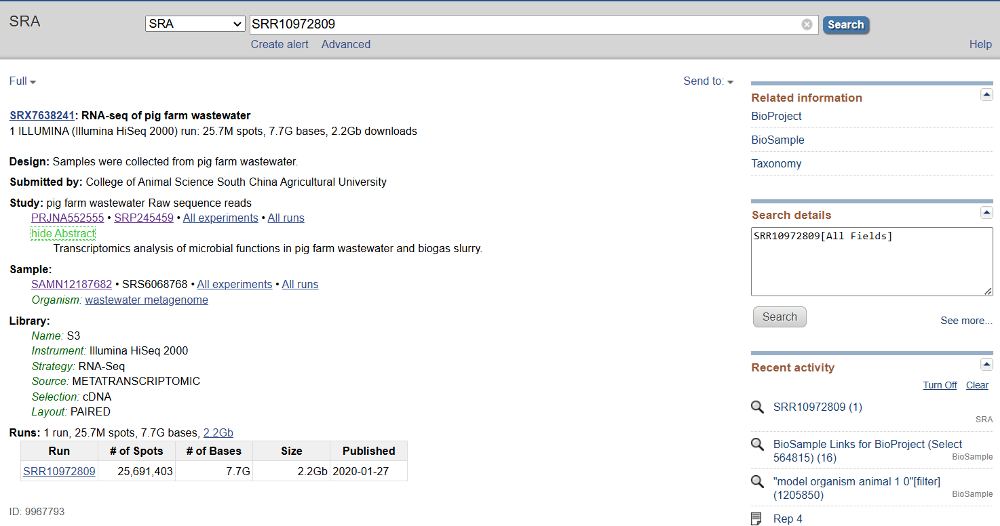

Figure 1. Bioproject PRJNA552555 SRA run. Transcriptomics analysis of microbial functions in pig farm wastewater and biogas slurry.

In contrast, Bioproject PRJNA564815 analyzed liver transcriptomes from White Composite pigs in the United States. This dataset, derived from NextSeq 550 sequencing, detected omega36 in liver tissues pooled from multiple pigs. Although the liver is not a primary microbial reservoir, transient or consistent colonization by bacteria associated with porcine digestion could explain omega36's presence. The liver's involvement in metabolic processes and interactions with microbiota supports the hypothesis that omega36 is indirectly linked to the gastrointestinal tract via bacterial hosts [3].
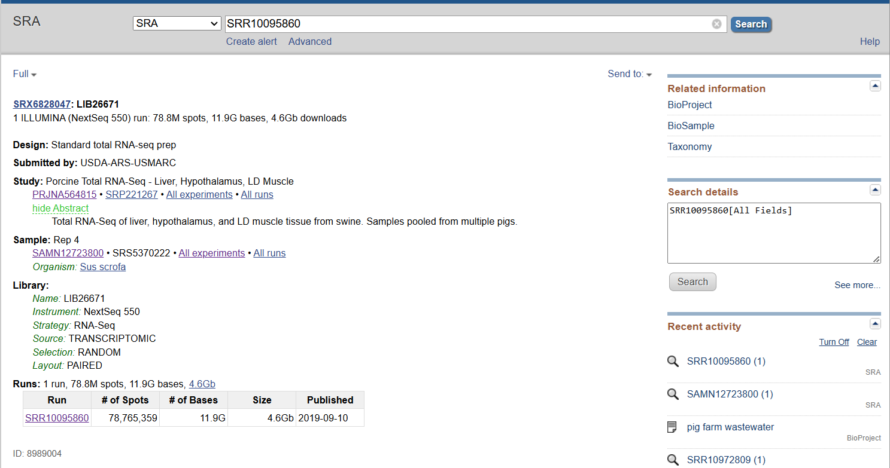

Figure 2. Bioproject PRJNA564815 SRA run. Sample LIB26671 contains liver tissue transcripts.


A notable feature of omega36 is the presence of a Shine-Dalgarno sequence preceding its Oblin-1 and Oblin-2 ORFs (see Question 3 section). This sequence, a ribosome binding site, is a hallmark of bacterial translation machinery, underscoring its potential bacterial association.

Despite the significant geographic disparity between the bioprojects—Guangdong Province, China, and Nebraska, USA—all five members of the omega36 cluster exhibit high sequence similarity. Specifically, the obelisk sequence from the USA dataset shares 96% sequence identity with centroid sequence of omega36 from the Chinese pig farm wastewater. This high level of conservation suggests that closely related obelisks associated with bacterial hosts are widespread and omega36 may inhabit Sus scrofa microbiome in different geographic locations. Such global distribution implies a conserved ecological role associated with their bacterial hosts, likely within the porcine microbiome. Unfortunately, for the first project (PRJNA552555), the breed of pigs could not be determined due to the nature of the sample, as it was derived from biogas slurry and pig farm wastewater, which lack direct traceability to specific animals.

Given the above observations, we propose two interconnected hypotheses:

Primary Hypothesis: Omega36 is a bacterium-associated RNA element likely inhabiting bacterial species within the porcine gastrointestinal tract. Its presence in biogas slurry and liver tissues suggests a bacterial origin and a potential role within the microbiota of pigs.
Secondary Hypothesis: Obelisks associated with specific bacterial hosts exhibit global distribution. The high sequence similarity between geographically distant samples supports the notion that obelisk-associated bacteria are widespread and not constrained by location.


### Virus Genome {Q3}

The genome of Obelisk Omega36 was analyzed to identify and annotate its open reading frames (ORFs) and visualize its structural and functional features. Using bioinformatics tools and structural predictions, I created a detailed representation of the genome, highlighting key elements such as ORFs, RNA secondary structure, and conserved features.

Open Reading Frames (ORFs)
The genome of Omega36 contains 8 identified ORFs, with 5 on the sense strand and 3 on the antisense strand. The ORFs vary in length and potential functionality, with several encoding small peptides or proteins of interest. The following ORFs were identified:

ORF4: (51–1085) Encodes a 344-amino acid protein, identified as Oblin-1, a characteristic obelisk protein known for its self-complementary secondary structure.
ORF8: (342–79) Antisense strand, encoding an 87-amino acid protein, potentially a reverse peptide with distinct properties.
ORF5: (1308–1562) Encodes an 84-amino acid protein, identified as Oblin-2, with a leucine zipper motif indicative of multimerization potential.
ORF1: (106–252) Encodes a small 48-amino acid peptide of uncertain function.
ORF7: (1212–1072) Antisense strand, encoding a 46-amino acid protein.
ORF6: (197–84) Antisense strand, encoding a 37-amino acid peptide.
ORF2: (520–609) Encodes a 29-amino acid peptide.
ORF3: (1204–1293) Encodes a 29-amino acid peptide, predicted to fold into a stable small structure.
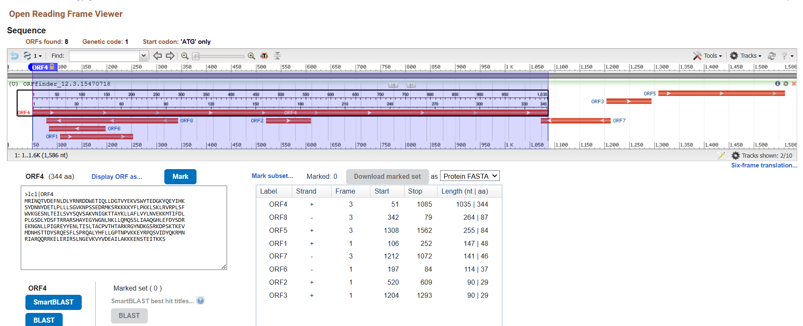
Figure 3. Open Reading Frames through ORFfinder.


For annotation purposes, I focused on ORF8 on the reverse strand, which encodes a potential reverse protein, and ORF3, a small peptide with promising AlphaFold structural predictions. These features were annotated using SnapGene for a clear visualization of their genomic positions and orientations.

Here are the protein sequences:

Oblin-1: MRINQTVDEFNLDLYRNRDDWETIQLLDGTVYEKVSWYTEDGKYQEYIHK
SYDNNYDETLPLLLSGVKNPSSEDRMKSRKKKKYFLPKKLSKLRVRPLSF
WVKGESNLTEILSVYSQVSAKVNIGKTTAYKLLAFLVYLNVEKKMTIFDL
PLGSDLYDSFTRRARSHAYEGYWGNLNKLLQMQSSLIAAQGHLEFDYSDR
EKNGNLLPIGREYYENLTISLTACPVTHTARKRGYNDKGSRKDPSKTKEV
MDNHSTTDYSRQESFLSPRQALYHFLLGPTNPVKKEYRPQSVIDYQKRMN
RIARQQRRKELERIRSLNGEVKVYVDEAILAKKKENSTEITKKS

Oblin-2: MKETAKQQLEILNTKRGNIVNNINNINLKILTLQAQLEKEEKALERIENT
IANFGKKQAKGPSNQSEDSPSPTEKSEEKESLSN

ORF-3: MQHFTLYSLVSYKSGLDCSINKLQPQLNS


ORF-8: MVEPSTLITSWEESISSSYETSFYLLNWDSLLQIEEEEGFHRNCYHKIYEYILDIYRLRYTKKLSRRPYRPGAEWFPNHPCYGKDLG


Secondary Structure Predictions
Using RNAfold (-p -r -d2 --noLP --circ) [4], I predicted the minimum free energy (MFE) structure of the Omega36 genome. The secondary structure revealed distinct regions:

From nucleotide 200 to 950, the sequence forms a linear self-complementary structure that encodes Oblin-1. This observation supports the hypothesis of Oblin-1's self-complementary nature, a hallmark of obelisk proteins.
Beyond this region, the structure transitions into irregular conformations, with numerous loops and unpaired regions, indicative of complex RNA folding patterns.
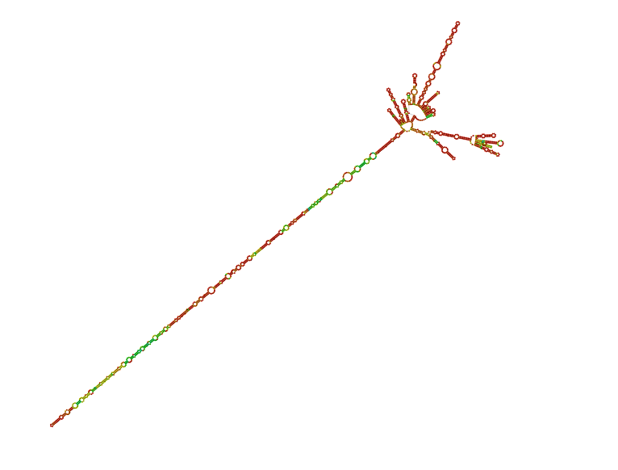
Figure 4. RNAFold secondary structure prediction.

These structural features were visualized in a Jupiter plot (generated using the code in Section 2 of the project_code file). The Jupiter plot and SnapGene annotation together highlight that Oblin-1 is encoded in a highly complementary and stable RNA structure, further reinforcing its functional importance.
![Figure 5. SnapGene annotation. This circular genome map illustrates the annotated features of the Omega36 genome, including identified Open Reading Frames (ORFs) and Shine-Dalgarno sequences. ORF4 encodes Oblin-1, a 344-amino acid self-complementary protein, while ORF5 encodes Oblin-2, a smaller protein with a leucine zipper motif. ORF8, located on the reverse strand, encodes a potential reverse Oblin. Shine-Dalgarno sequences, characteristic of bacterial ribosomal binding sites, are marked in blue and suggest bacterial association. The annotations demonstrate the structural and functional diversity within the 1586 nt genome.](img/O_porcinus_omega36/Obelisk_36_genome_annotation.png)


Figure 5. SnapGene annotation. This circular genome map illustrates the annotated features of the Omega36 genome, including identified Open Reading Frames (ORFs) and Shine-Dalgarno sequences. ORF4 encodes Oblin-1, a 344-amino acid self-complementary protein, while ORF5 encodes Oblin-2, a smaller protein with a leucine zipper motif. ORF8, located on the reverse strand, encodes a potential reverse Oblin. Shine-Dalgarno sequences, characteristic of bacterial ribosomal binding sites, are marked in blue and suggest bacterial association. The annotations demonstrate the structural and functional diversity within the 1586 nt genome.


![Figure 6. Jupiter Plot for obelisk 36 secondary structure. This Jupiter plot visualizes the RNA secondary structure of the Omega36 genome as predicted by RNAfold. The plot highlights the self-complementary nature of the region spanning nucleotides around 200 to 950, which encodes Oblin-1. The dense connections within this region indicate a stable linear complementary structure, characteristic of Oblin-1's functional architecture. Beyond this region, irregular structures with loops dominate, showcasing the complex folding patterns of the RNA. The self-complementary feature of Oblin-1 supports its role as a hallmark obelisk protein.](img/O_porcinus_omega36/jupiter_plot_36.png)

Figure 6. Jupiter Plot for obelisk 36 secondary structure. This Jupiter plot visualizes the RNA secondary structure of the Omega36 genome as predicted by RNAfold. The plot highlights the self-complementary nature of the region spanning nucleotides around 200 to 950, which encodes Oblin-1. The dense connections within this region indicate a stable linear complementary structure, characteristic of Oblin-1's functional architecture. Beyond this region, irregular structures with loops dominate, showcasing the complex folding patterns of the RNA. The self-complementary feature of Oblin-1 supports its role as a hallmark obelisk protein.


Hypothesis: ORF8 Codes a Third Potential Protein in the Obelisk Genome on the Antisense Strand
While analyzing the genome of Obelisk Omega36, I was particularly intrigued by the role of the antisense strand. This curiosity stemmed from observations of Obelisk-S.s, which is predominantly present in its antisense form (93% of reads, as reported in [1]). This led me to hypothesize that antisense strands in obelisk genomes might encode functional proteins. To explore this, I focused on ORF8, located on the antisense strand, as well as ORF3, which encodes a small peptide.

To test my hypothesis, I attempted to determine whether ORF8 codes for a protein by searching widely used protein databases, including BLAST and Pfam [9, 11]. Unfortunately, no matches were found, suggesting that ORF8 may not correspond to any known protein families. However, a search in MGnify [12], a metagenomic database, yielded one result with an E-value of 0.0061. The sequence matched a study on the gut microbiota of Nepalese populations (BioProject: PRJEB49206) [5]. Given that Obelisk Omega36 is hypothesized to be a colonist of pig microbiota, this finding raises the possibility that the sequence might have some ecological or functional relevance to gut-associated microbes.

To further investigate, I aligned the ORF8 sequence with the MGnify hit using EMBOSS Needle [6]. The results indicated very low homology, with only 4.5% sequence identity (see alignment results: alignments/alignment_36_Nepal.out). This low level of similarity suggests that if ORF8 does encode a protein, it may represent a highly divergent or novel entity that lacks close homologs in existing databases.

The lack of strong homology or abundant metagenomic data to support this hypothesis highlights the current limitations in our understanding of obelisk genomes. The absence of definitive evidence does not, however, negate the possibility that ORF8 encodes a third protein. Obelisks are newly discovered RNA elements, and much remains to be learned about their biology, including the potential functions of antisense-encoded ORFs.

Interestingly, ORF3 includes a Shine-Dalgarno sequence (AGGAGG) upstream of its start codon. This sequence is indicative of bacterial ribosome binding, suggesting that ORF3 may encode a functional peptide. While ORF3 encodes a small protein, its structural predictions indicate potential stability, further supporting its plausibility as a coding region.


### Other (bonus) sections

## AlphaFold protein structure predictions

Oblin-1 protein homolog showed typical Oblin-1 domains on AlphaFold predictions[7],[8]. 

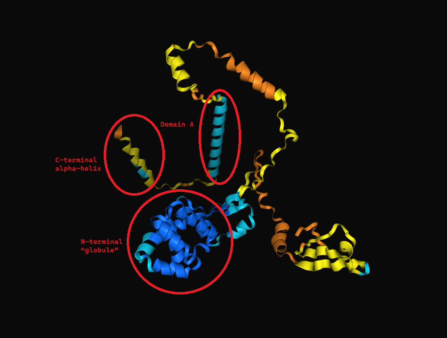

Figure 7. Oblin-1 AlphaFold predicted domains.


Based on the AlphaFold structural prediction, the ORF4 protein encoded by omega36 aligns closely with the characteristic structural features of the Oblin-1 protein described in the obelisk family. The predicted protein exhibits a well-defined N-terminal globule formed by a bundle of three alpha helices (orange), partially wrapping around a four-helix bundle (orthogonal orientation), and capped with a beta sheet clasp (blue). The confidence score for this globule structure is very high (plDDT > 90), supporting its structural integrity and conservation.

The structure also contains an intervening domain-A region (magenta) lacking significant tertiary structure but displaying a conserved motif characteristic of Oblin-1 proteins. This domain is confidently predicted (90 > pLDDT > 70) and joins to an arbitrarily placed C-terminal alpha helix. These features align perfectly with previously described Oblin-1 proteins, further validating the protein's identity as Oblin-1.

The AlphaFold results corroborate the hallmark structural motifs of Oblin-1 proteins as detailed in prior studies (e.g., obelisk-alpha).

The Oblin-2 homolog was also observed:
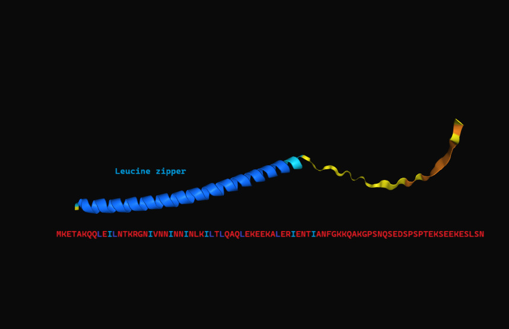

Figure 8. Oblin-2 AlphaFold predicted domains.


The AlphaFold modeling of ORF5, corresponding to Oblin-2, produced a high-confidence prediction, confirming its identity as a solitary α-helix with a characteristic leucine zipper motif.


The AlphaFold modeling of ORF8 (on the antisense strand) resulted in a structure with low confidence predictions, as reflected by a mean pLDDT score below 70. The generated structure shows an arrangement of secondary structural elements, primarily composed of disorganized coils and a few poorly defined helices.

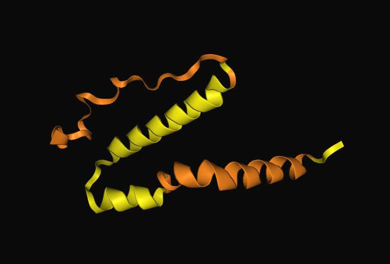

Figure 9. ORF8 AlphaFold prediction.


However, for the ORF3, the AlphaFold predictions were quite confident. However, due to the lack of time, I couldn't investigate its presense in other Obelisks. I didn't find homologs of this sequence in the existing databases.

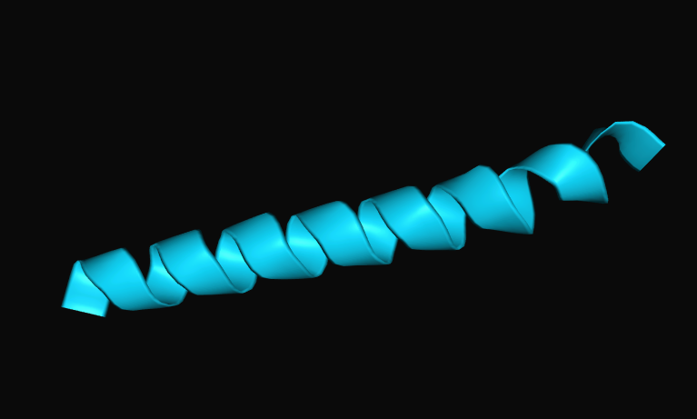

Figure 10. ORF3 AlphaFold prediction.

## Classification

Here, I wanted to find something like ORF8 in the genomes of other obelisks. For that reason, I studied how the genomes of the first 100 clusters representatives are organized. Let's call the potential protein that is encoded by ORF8 Oblin-3.
The map of the genome of the obelisk from cluster 36 is depicted on Figure 11. I emphasize that all five obelisks from this cluster have the same structure.
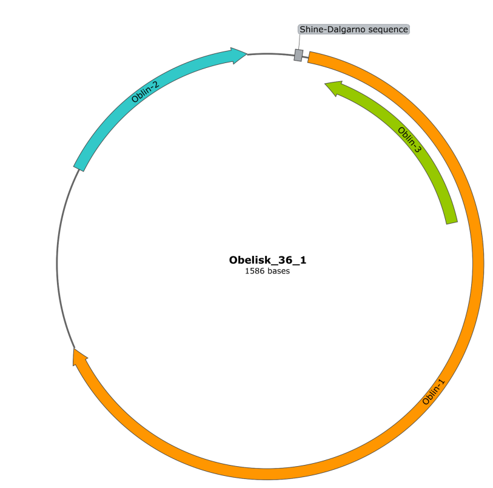

Figure 11. Omega36 obelisk. Map of the centroid obelisk from cluster 36 with shown oblin-1, oblin-2, andoblin-3 ORFs.

**Types of obelisk genome organization.**

To better understand whether found sequence is a unique feature of cluster 36 obelisks, or if it is more common, I’ve taken the first 100 clusters from the table and predicted ORFs for their centroid representatives. In the process of doing them, I understood the genome of obelisks in diverse ways. I’ve split all of them into several groups. Although the criteria is rather artificial, I think, it reflects the biology of these marvelous RNA agents and may be helpful in their further studies. Here are the results, while the pictures of the genomes with ORFs are available below each group.

Group 1: Many obelisks have only one protein encoded on the sense chain. This is probably oblin-1, although these polypeptides vary greatly in length, so further studies on them are needed.

Common examples of such obelisks are from clusters 4,5,6,7, 8,9,13, 14 ...
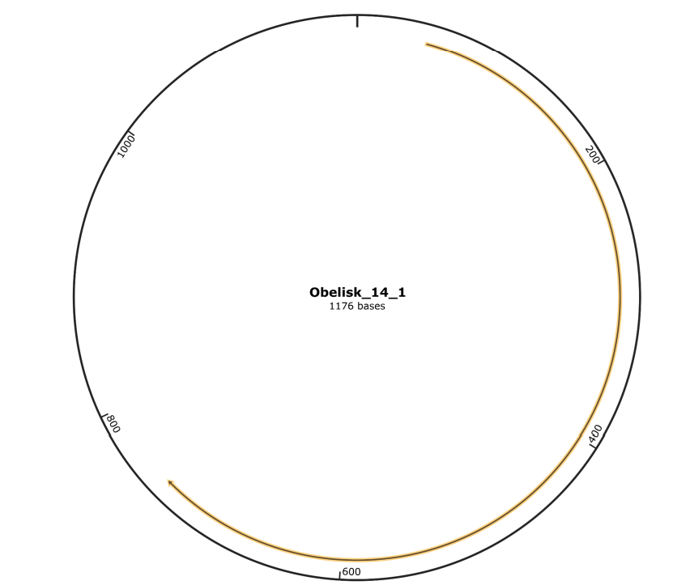

Figure 12. Genomic map of the centroid obelisk from cluster 14.


Group 2:  In a large number of clusters, the genome of the corresponding obelisk encodes 2 proteins whose reading frames are on the sense chain and do not overlap. Probably, the longer one corresponds to oblin-1 and the shorter one to oblin-2. For example, this situation was noted in clusters 1, 2, 3, 10, 11, 27, 28, 31, 37, 38, 40, 41, 42, 49, 52, 62, 63, 65, 73, 73, 84, 86, 91, 92, 93, 94, 98, 100.
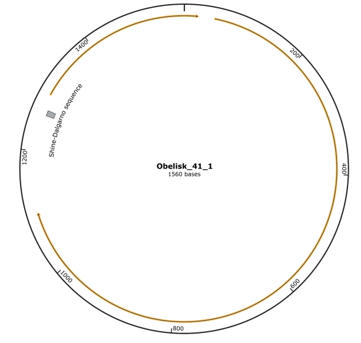

Figure 13. Genomic map of the centroid obelisk from cluster 41.


Group 3:

Some obelisks encode two proteins, one from the sense chain and the other from the antisense chain, and their reading frames do not overlap. This is how the genomes in clusters 43, 44, and 47 are arranged.
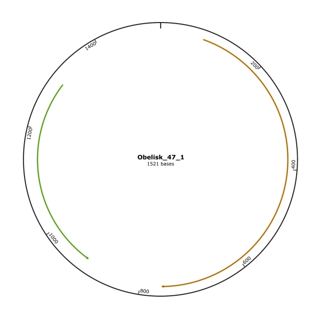

Figure 14. Genomic map of the centroid obelisk from cluster 47.


Group 4:

The obelisks in cluster 9 have a similar situation, but the reading frames overlap completely.
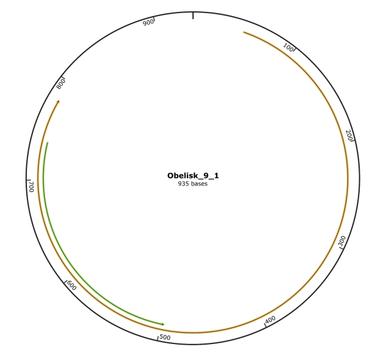


Figure 15. Genomic map of the centroid obelisk from cluster 9.


Group 5:

Some obelisks, on the contrary, contain three ORFs, all in the sense chain. Such genome organization is characteristic of representatives of clusters 39, 95,97.
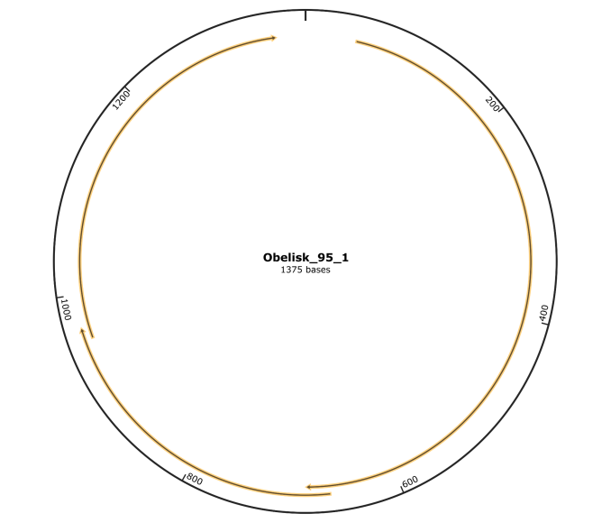

Figure 16. Genomic map of the centroid obelisk from cluster 95.


Group 6:

Other obelins can encode three proteins, with two (oblin-1 and oblin-2) from the sense chain and the third from the antisense chain (and it partially or completely overlaps with the reading frame of oblin-1, which is also interesting). Not only all five representatives of cluster 36 are organized in this way, but also obelisks
from clusters 21, 25, 32, 54, 68, and 90.
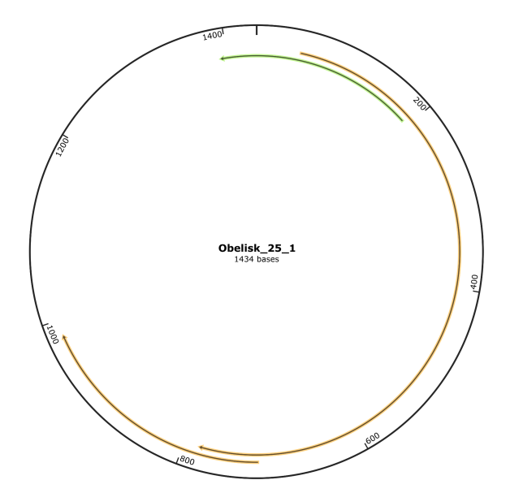

Figure 17. Genomic map of the centroid obelisk from cluster 25.


Group 7 (Very Interesting!):

The obelisks in cluster 33 have a unique structure. It is likely that their ancestor has recently undergone a duplication event. Therefore, it encodes two proteins on the sense chain and two proteins on the antisense chain, with the proteins within each pair being identical and the obelisk itself symmetrical.

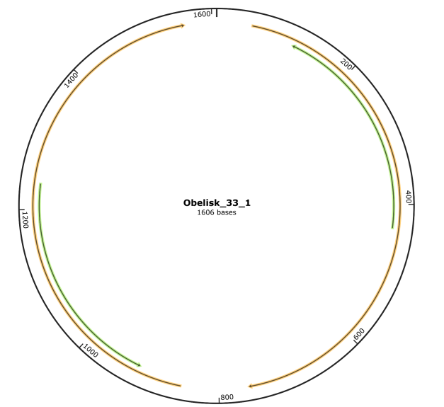

Figure 18. Genomic map of the centroid obelisk from cluster 33.


*Phylogenetic tree of all proteins from centroid obelisks of clusters 1-100*
To understand whether proteins found on both sense and antisense chains, except relatively well-known oblin-1 and oblin-2, are somehow related to each other, and being particularly interested in oblin-3, I extracted all 168 ORFs predicted from the centroid representatives of clusters 1-100 and made a multiple sequence alignment (using ClustalW in MEGA) [10] and then created a phylogenetic tree (via ML in MEGA, with no bootstrapping). The results are demonstrated on Figure 19.

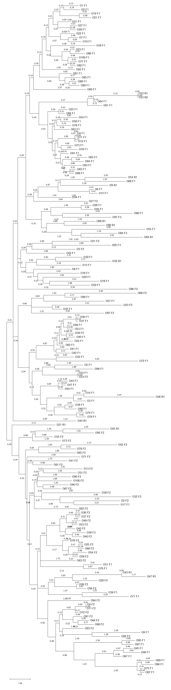

Figure 19. Phylogenetic tree of all 168 predicted proteins. Number after “>O” indicates an obelisk cluster, then “F” stands for sense, or forward, and R stands for antisense, or, reverse, strand.

As we can see “O36 R1”, which corresponds to oblin 3, has a great distance from its closest relative, “O14 F1”, which is a long protein with absolutely different structure (AlphaFold). Howevr, we can see that O33 F1 and O33 F2 have identical sequences, which supports the hypothesis of the genome duplication in Obelisk cluster 33.

## Discussion

**Main discussion about the possibility of ORF8 to encode the Oblin-3**
The genome of the novel virus Obeliscus porcinus omega36 demonstrates the potential for variation in the structure of obelisk RNA elements. Although omega36 contains most of the features that are characteristic of other obelisks including the circular genome, the self-complementary RNA that gives rise to Oblin-1 and Oblin-2, its genomic organization raises questions about the potential functionality of additional ORFs, particularly ORF8 on the antisense strand.

The omega36 genome encodes eight ORFs, five on the sense strand and three on the antisense strand. Among these, ORF8 is particularly intriguing due to its position on the antisense strand, its size(84 aa), and its potential to encode a novel peptide. This curiosity stemmed from findings in Obelisk-S.s, where 93% of reads mapped to the antisense strand, suggesting that antisense transcription might play a functional role. However, despite this intriguing possibility, further analysis failed to provide conclusive evidence for the existence of a functional protein encoded by ORF8.

To contextualize ORF8, I examined the genomic organization of 100 representative obelisk clusters. This analysis revealed seven distinct patterns of genome organization, with omega36 fitting into a category where two proteins (Oblin-1 and Oblin-2) are encoded on the sense strand, and an additional ORF appears on the antisense strand. This arrangement is shared by clusters 21, 25, 32, and 68. However, no strong evidence supports the functional relevance of these antisense ORFs, indicating that they might not encode essential proteins.

To investigate whether ORF8 encodes a protein, I searched major protein databases, including BLAST and Pfam, but found no significant matches. MGnify, a metagenomics database, returned one weak result with an E-value of 0.0061, linking ORF8 to a metagenomic study of the Nepalese gut microbiota (PRJEB49206). However, an EMBOSS Needle alignment showed only 4.5% sequence similarity between ORF8 and this hit, further weakening the case for functional conservation.

The lack of strong homology, combined with the low confidence in the structural prediction by AlphaFold, suggests that ORF8 is unlikely to encode a protein necessary for omega36's biology. This conclusion does not entirely exclude the possibility of ORF8 functioning as a regulatory or accessory element, but its role, if any, remains unclear. 

**Cluster 33: A Unique Case of Genome Duplication**
Among the 100 obelisk clusters analyzed, cluster 33 stands out due to its unusual genome organization, which appears to be a result of a recent duplication event. Unlike other clusters, the representative genome of cluster 33 encodes two proteins on the sense strand and two on the antisense strand, with the proteins within each pair being identical. This symmetrical organization is highly atypical among obelisks and suggests a unique evolutionary trajectory.

**Ecology**
The identification of Omega36 in geographically distinct environments—pig farm wastewater in Guangdong, China (PRJNA552555), and liver tissues of White Composite pigs in Nebraska, USA (PRJNA564815)—underscores its ecological adaptability and potential bacterial association. In the Chinese dataset, the pig farm environment, rich in microbial communities derived from gastrointestinal tracts, strongly suggests that Omega36 is associated with bacteria from the porcine gut. Supporting this, Shine-Dalgarno sequences upstream of its key ORFs are hallmarks of bacterial translation machinery.

In contrast, the presence of Omega36 in liver tissue raises questions about its ecological role. While the liver is not a primary microbial habitat, transient bacterial RNA transport or systemic microbial interactions could explain its detection. Despite the geographic and biological differences, the sequence from the USA shares 96% identity with the Chinese centroid sequence, emphasizing its evolutionary conservation and global distribution.

Hypotheses:

1) Omega36 is a bacterium-associated RNA element linked to porcine gut microbiota.
2) Obelisk-associated bacteria exhibit global distribution, with highly conserved RNA elements.

Further exploration of microbial hosts and metagenomic contexts is needed to clarify Omega36's role, reinforcing its significance in microbial ecology and obelisk biology.

## References


[1] Zheludev, I. N., Edgar, R. C., Lopez-Galiano, M. J., De La Peña, M., Babaian, A., Bhatt, A. S., & Fire, A. Z. (2024). Viroid-like colonists of human microbiomes. Cell. https://doi.org/10.1016/j.cell.2024.09.033
[2] Keel, B. N., Oliver, W. T., Keele, J. W., & Lindholm-Perry, A. K. (2020). Evaluation of transcript assembly in multiple porcine tissues suggests optimal sequencing depth for RNA-Seq using total RNA library. Animal Gene, 17–18, 200105. https://doi.org/10.1016/j.angen.2020.200105
[3] Yang, Y., Liu, Z., Xing, S., & Liao, X. (2019). The correlation between antibiotic resistance gene abundance and microbial community resistance in pig farm wastewater and surrounding rivers. Ecotoxicology and Environmental Safety, 182, 109452. https://doi.org/10.1016/j.ecoenv.2019.109452
[4] Lorenz, R., Bernhart, S.H., Höner zu Siederdissen, C. et al. ViennaRNA Package 2.0. Algorithms Mol Biol 6, 26 (2011). https://doi.org/10.1186/1748-7188-6-26
[5] Jha, A. R., Davenport, E. R., Gautam, Y., Bhandari, D., Tandukar, S., Ng, K. M., Fragiadakis, G. K., Holmes, S., Gautam, G. P., Leach, J., Sherchand, J. B., Bustamante, C. D., & Sonnenburg, J. L. (2018). Gut microbiome transition across a lifestyle gradient in Himalaya. PLoS Biology, 16(11), e2005396. https://doi.org/10.1371/journal.pbio.2005396
[6] Madeira, F., Madhusoodanan, N., Lee, J., Eusebi, A., Niewielska, A., Tivey, A. R. N., Lopez, R., & Butcher, S. (2024). The EMBL-EBI Job Dispatcher sequence analysis tools framework in 2024. Nucleic Acids Research, 52(W1), W521–W525. https://doi.org/10.1093/nar/gkae241
[7] Jumper, J. et al. “Highly accurate protein structure prediction with AlphaFold.” Nature, 596, pages 583–589 (2021). DOI: 10.1038/s41586-021-03819-2
[8] Mirdita, M. et al. “ColabFold: Making protein folding accessible to all.” Nature Methods, 19, pages 679–682 (2022). DOI: 10.1038/s41592-022-01488-1
[9] Camacho, C., Coulouris, G., Avagyan, V., Ma, N., Papadopoulos, J., Bealer, K., and Madden, T.L. 2009. BLAST+: architecture and applications. BMC Bioinformatics, 10, 421.
[10] Higgins D., Thompson J., Gibson T. Thompson J. D., Higgins D. G., Gibson T. J.
CLUSTAL W: improving the sensitivity of progressive multiple sequence alignment through sequence weighting, position-specific gap penalties and weight matrix choice.
Nucleic Acids Res. 22:4673-4680. (1994)
[11] Pfam: The protein families database in 2021 J. Mistry, S. Chuguransky, L. Williams, M. Qureshi, G.A. Salazar, E.L.L. Sonnhammer, S.C.E. Tosatto, L. Paladin, S. Raj, L.J. Richardson, R.D. Finn, A. Bateman Nucleic Acids Research (2020) doi: 10.1093/nar/gkaa913
[12] Richardson, L., Allen, B., Baldi, G., Beracochea, M., Bileschi, M. L., Burdett, T., Burgin, J., Caballero-Pérez, J., Cochrane, G., Colwell, L. J., Curtis, T., Escobar-Zepeda, A., Gurbich, T. A., Kale, V., Korobeynikov, A., Raj, S., Rogers, A. B., Sakharova, E., Sanchez, S., . . . Finn, R. D. (2022). MGnify: the microbiome sequence data analysis resource in 2023. Nucleic Acids Research, 51(D1), D753–D759. https://doi.org/10.1093/nar/gkac1080

# Viral Short Story

```
Lovecraftian Horror: The Obelisk Lurking in the Slurry
In the murky depths of a **pig farm's biogas slurry**, where sunlight dared not trespass and microbial secrets fermented, scientists unearthed a relic of the unseen. They called it Obelisk-S.s., a name that barely captured the terror that rippled through their findings. Its genome, **a circular RNA with a rod-like structure**, coiled as if alive, whispering of cycles unbroken and a hunger insatiable.

The slurry, teeming with microbes and filth, seemed mundane until **the College of Animal Science at South China Agricultural University** sequenced its secrets. There, amidst the wastewater metagenome, they found it—an agent **neither virus nor viroid but something far older, far stranger**. Its sequence was encoded in **Illumina HiSeq 2000 data**, the sharp precision of modern science unwittingly pulling back the veil on a primordial horror.

Its presence was not benign. The RNA twisted through microbial pathways, entangling itself in genes linked to methane production. Some whispered it was a parasite, others, a messenger from beyond the stars. All knew it was **found in 10% of microbiomes surveyed**, yet none could explain why it lingered, watching, waiting. Even the **self-cleaving ribozyme motifs** it bore seemed like ancient runes etched by a hand long forgotten, meant for purposes none dared comprehend.

As they probed deeper, the researchers realized that the obelisk was not an artifact of this world but a harbinger. Its discovery in **PRJNA552555** was no accident, for its sequence spread not like a contagion but a signal, calling to others of its kind. What lay beneath the slurry was no mere agent of replication. It was a fragment of something larger, a network spanning the microbial consciousness of Earth—a whisper of life’s ancient architect.

And in the slurry, the obelisk remained, waiting for its signal to be answered.
```