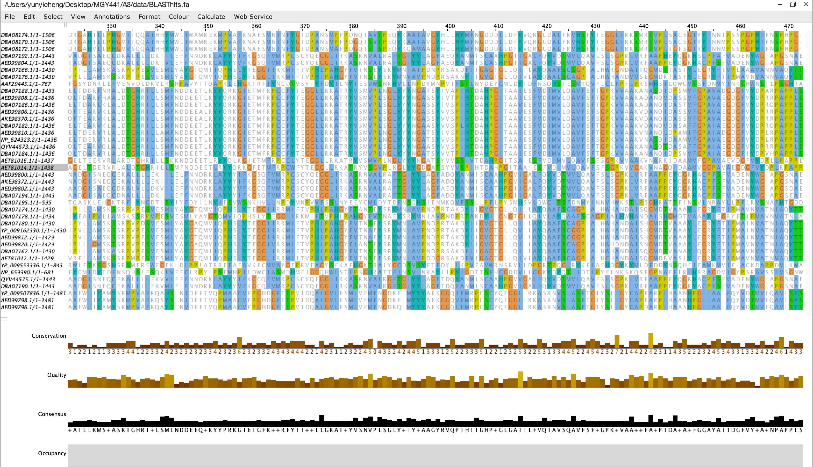

# Twists in the Tale of Trichomonas: Delving into the Dynamic World of a novel *Trichomonas vaginalis* Viruse

written by: [Yunyi Cheng](https://github.com/yunyicheng)

### Virusus intricatus trichomonadis

- Genus: Virusus intricatus:Virusus: Derived from the Latin word "virus," meaning poison or toxin, reflecting the pathogenic nature of the organism.Intricatus: Latin for intricate or complex, highlighting the sophisticated genomic and replication strategies of Trichomonas vaginalis viruses (TVVs), such as their monosegmented dsRNA structure and the unique mechanism of programmed ribosomal frameshifting.
- Species: trichomonadis:Derived from "Trichomonas," the genus name of the protozoan host, Trichomonas vaginalis.The genus name acknowledges the complex and intriguing nature of the virus, particularly its genetic ingenuity and adaptability, while the species name cements its exclusive relationship with the Trichomonas vaginalis host, an aspect that's central to the virus's ecological and pathogenic significance.


## Abstract

In the intricate world of parasitic protozoa and their viruses, the study of Trichomonas vaginalis viruses (TVVs) offers a unique perspective on viral evolution and host-pathogen dynamics. This paper synthesizes current knowledge about TVVs, emphasizing their genetic and ecological traits, and explores their role in shaping the biology of their protozoan host, Trichomonas vaginalis.Drawing on recent genomic studies, we present an overview of the diverse strains of TVVs, highlighting their monosegmented dsRNA structure and the notable mechanism of programmed ribosomal frameshifting. This genetic adaptation, resulting in a fusion protein, is central to the viral replication strategy and its interaction with the host. Our review delves into the ecological implications of these genetic characteristics, discussing how they contribute to the virulence and survival of T. vaginalis in various environmental contexts.By comparing and contrasting the various TVV strains across different datasets, we shed light on the conserved and divergent genetic features across different species. Particular attention is given to the untranslated regions (UTRs) and ribosomal frameshift sites, which exhibit both conservation and significant variation. These findings provide insights into the adaptive mechanisms employed by TVVs and their evolutionary significance.The paper underscores the importance of studying TVVs within the broader scope of virology and parasitology. It highlights how these viruses serve as a model for understanding complex virus-host interactions, particularly in unicellular eukaryotes. We conclude by discussing the potential of this research to inform future studies in viral evolution, pathogenesis, and the development of novel therapeutic strategies targeting parasitic infections.

## Results

### Ecology

- **Sample Source and Ecology** According to VirusAssignments.csv, SRR7547279 is the index run for my virus. According to the SRR code, I found its related experiment (SRX4413567), biosample (SAMN09281278), bioproject (PRJNA473698), and SRA study (SRP154569). According to the information above, I found out that this dataset was generated by Broad Institute for a study on the timing of the significant bottleneck in the quasispecies population of HIV-1 [Piantadosi. 2019]. The study investigated the diversity of HIV-1 in both the bloodstream and the female genital tract (FGT) within two weeks of detecting infection in three women participating in a distinctive prospective cohort in South Africa[Piantadosi. 2019]. Full-length HIV-1 genomes were then compiled from corresponding samples of cervicovaginal lavage (CVL) and plasma[Piantadosi. 2019]. I used the sOTU and SRA accession from VirusAssignments.csv to find related SRA runs in which the virus was reliably detected and got a list of candidate RdRp palmprint sequences, which is saved as filtered_candidates.fa. I then did a BLASTp search on the candidate RdRp palmprint sequence which contains a reliable A, B and C motif detected and annotated in the header and found that it is most likely to be Trichomonas vaginalis virus 5, since it has the highest percent identity of 96.81% [Stephen. 1997]. It is a virus that infects Trichomonas vaginalis, a flagellated protozoan parasite causing the sexually transmitted infection trichomoniasis. This virus is part of the family Totiviridae, which includes viruses with double-stranded RNA genomes and is known to infect a variety of hosts, such as fungi and protozoa. Humans can also be infected by Trichomonas vaginalis through sexual transmission, making humans superhost of the virus. These viruses typically have a capsid structure and utilize an RNA-dependent RNA polymerase (RdRp) for replication.
- **Comparative Ecology Across Datasets** I then compared and contrasted the ecology of my index run with the broader ecology of all runs containing the virus (saved as tab2 in virusRunObservations.csv). I found out that most of the presence of the virus is associated with Human immunodeficiency virus 1 and Trichomonas vaginalis genome, with a few presence in human vaginal metagenome and human gut metagenome. This suggests a strong correlation between Human immunodeficiency virus 1 and Trichomonas vaginalis virus (which share a common host/superhost: human), though further studies would be needed to confirm the underlying causal mechanisms. To check my hypothesis, I searched related studies investigating the relationship between these two viruses. From a previous study, T. vaginalis disruption of urogenital epithelial monolayers could facilitate passage of HIV-1 to underlying layers and activation of local immune cells by T. vaginalis in the presence of infectious HIV-1 might lead to increased viral replication [Guenthner. 2005]. Additionally, I noticed all these detected presence of Trichomonas vaginalis virus 5 in runs share a common environmental condition: they all appear in internal tracts of humans such as vagina and gut, that are humid, have mucosa and lack oxygen, suggesting its favoured conditions, which is confirmed by a study of Gatti et al.[Gatti. 2017].


### Other (bonus) sections

Visualization of all BLAST hits with \>80% query coverage and \>40% amino acid identity with Jalview [Troshin. 2011].



## Discussion

### Genomic Structure and Expression Strategy

The monosegmented dsRNA nature of TVVs is a noteworthy difference from the more commonly observed segmented genomes of many RNA viruses. This structural uniqueness prompts a reevaluation of our understanding of viral replication strategies. The fusion protein mechanism, a product of programmed ribosomal frameshifting, is a remarkable adaptation that allows TVVs to maximize their coding potential.

### Host-Virus Interactions and Virulence

The influence of TVVs on the virulence of Trichomonas vaginalis highlights a complex interplay between virus and host, wherein the virus acts as a modulator of host pathogenicity. This observation extends the conventional narrative of direct virus-host interactions by adding a layer of indirect influence on the host's interaction with its superhost, humans. Understanding this tripartite interaction could provide new perspectives in the study of host-pathogen dynamics and potentially inform therapeutic strategies targeting such interactions.

### Viral Diversity and Co-infection Dynamics

The discovery of multiple species within the Trichomonasvirus genus, especially the identification of TVV5, underscores the rich biodiversity and evolutionary dynamics within viral populations. The phenomenon of co-infection by different TVV species within a single T. vaginalis host presents a fascinating ecological scenario, raising questions about viral competition, co-evolution, and the implications for host virulence. This diversity also offers a unique opportunity to study virus-virus interactions within a host, an area that is relatively underexplored.

### Functional Roles of Untranslated Regions (UTRs)

The long UTRs, particularly the conserved elements within them, challenge the notion of UTRs as mere regulatory sequences. The potential of these regions to contain functional elements like internal ribosomal entry sites suggests a level of genetic complexity that merits further investigation. This finding could have implications for our understanding of viral gene expression and regulation, particularly in the context of RNA viruses.

### Conclusion

In conclusion, the characterization of TVV genomes not only enriches our understanding of these specific viruses but also contributes to the broader field of virology. It brings a reevaluation of some established concepts and opens up new areas for research. Future studies focusing on the functional implications of these findings and their potential applications in antiviral strategies could be particularly fruitful. The TVV-host interaction model also provides a unique system for studying the indirect effects of viruses on host-pathogen dynamics, offering insights that could extend well beyond the realm of parasitic protozoa.

## References

1. Stephen F. Altschul, Thomas L. Madden, Alejandro A. Schäffer, Jinghui Zhang, Zheng Zhang, Webb Miller, and David J. Lipman (1997), "Gapped BLAST and PSI-BLAST: a new generation of protein database search programs", Nucleic Acids Res. 25:3389-3402. 
2. Piantadosi, Anne et al. “Metagenomic Sequencing of HIV-1 in the Blood and Female Genital Tract Reveals Little Quasispecies Diversity during Acute Infection.” Journal of virology vol. 93,2 e00804-18. 4 Jan. 2019, doi:10.1128/JVI.00804-18
3. Guenthner, Patricia C et al. “Trichomonas vaginalis-induced epithelial monolayer disruption and human immunodeficiency virus type 1 (HIV-1) replication: implications for the sexual transmission of HIV-1.” Infection and immunity vol. 73,7 (2005): 4155-60. doi:10.1128/IAI.73.7.4155-4160.2005
4. Troshin PV, Procter JB, Barton GJ (2011) Java bioinformatics analysis web services for multiple sequence alignment–JABAWS:MSA. Bioinformatics 27 2001-2002. ( doi:10.1093/bioinformatics/btr304)
5. Gatti, Fabiane Aguiar Dos Anjos et al. “The prevalence of trichomoniasis and associated factors among women treated at a university hospital in southern Brazil.” PloS one vol. 12,3 e0173604. 27 Mar. 2017, doi:10.1371/journal.pone.01736046. 
6. Graves KJ, Ghosh AP, Kissinger PJ, Muzny CA. Trichomonas vaginalis virus: a review of the literature. Int J STD AIDS. 2019 Apr;30(5):496-504. doi: 10.1177/0956462418809767. Epub 2019 Jan 9. PMID: 30626281.
7. Graves, Keonte J et al. “Trichomonas vaginalis Virus Among Women With Trichomoniasis and Associations With Demographics, Clinical Outcomes, and Metronidazole Resistance.” Clinical infectious diseases : an official publication of the Infectious Diseases Society of America vol. 69,12 (2019): 2170-2176. doi:10.1093/cid/ciz146
8. Goodman R.P., Ghabrial S.A., Fichorova R.N., Nibert M.L. Trichomonasvirus: A new genus of protozoan viruses in the family Totiviridae. Arch. Virol. 2011;156:171–179. doi: 10.1007/s00705-010-0832-8.
9. Wang A.L., Wang C.C. The double-stranded RNA in Trichomonas vaginalis may originate from virus-like particles. Proc. Natl. Acad. Sci. USA. 1986;83:7956–7960. doi: 10.1073/pnas.83.20.7956.
10. Mercer F., Johnson P.J. Trichomonas vaginalis: Pathogenesis, symbiont interactions, and host cell immune responses. Trends Parasitol. 2018;34:683–693. doi: 10.1016/j.pt.2018.05.006. [PubMed] [CrossRef] [Google Scholar]

# Viral Short Story

```
The city was a petri dish, teeming with mysteries that clung to the night like a shadow you couldn't shake. As a detective, I'd seen it all, but nothing prepared me for the case of the elusive Trichomonas vaginalis virus 5.
I hit the streets, tracing the accession code SRR7547279 like a bloodhound on a scent. It led me to a seedy laboratory with the name Broad Institute, the kind you find at the fringes of ethical research. Inside, I discovered a tale told in nucleotides—Virusus intricatus trichomonadis, a double-stranded RNA bandit with a penchant for hijacking protozoan hosts.
The date of the crime? 2013. A year when the world was still innocent, unaware of the impending threat. The virus struck swiftly, infecting the female genital tract within two weeks of detection in South African women. A clever move, leaving the victims blindsided.
As I delved deeper, I uncovered the means—RNA sequencing on human cervico-vaginal lavage samples, a methodical approach to unleashing the genetic mayhem. The motive became clearer, a study on the diversity of HIV-1, a shadowy accomplice that danced with the virus in the bloodstream and the female genital tract.
In the end, I had the story—the virus, the victims, the motive, and the means. The city might not be safe, but at least now it knew the name—Trichomonas vaginalis virus 5, a silent menace lurking in the double helix of the night. The city, however, never sleeps, and neither do I. The next case is just a strand away.
```
